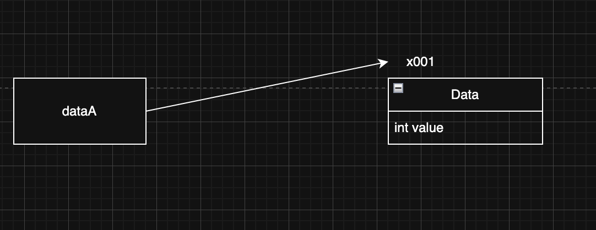
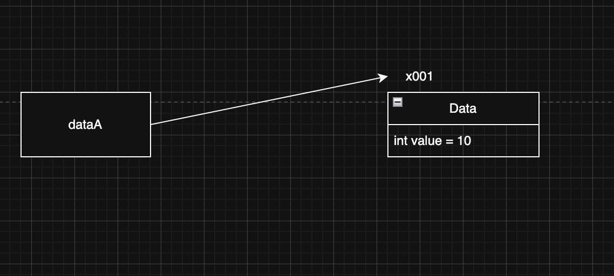
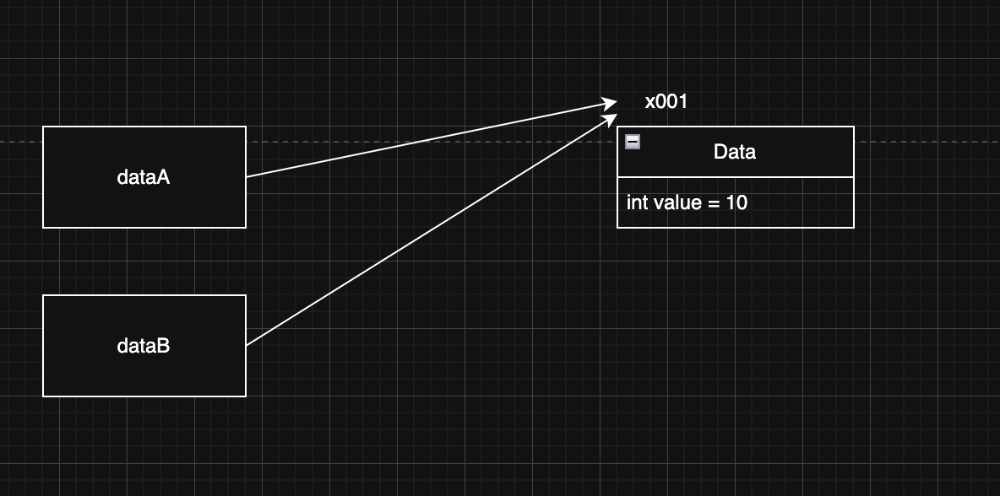
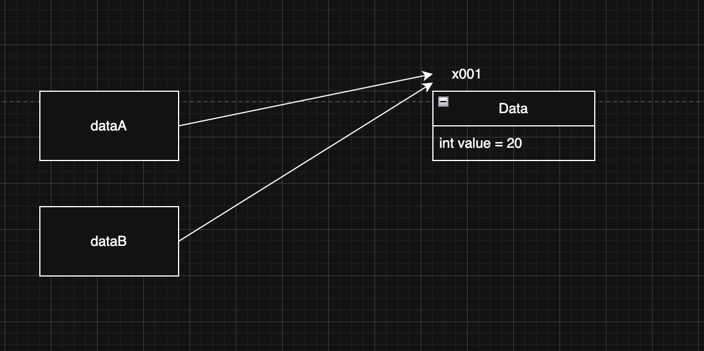
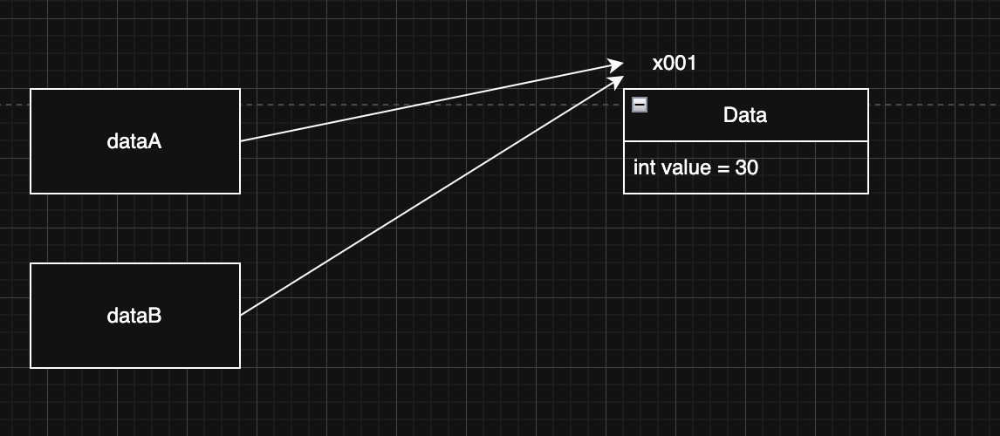
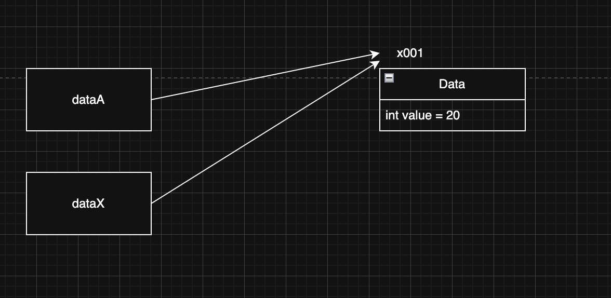
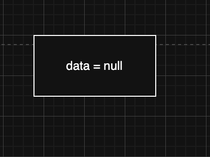
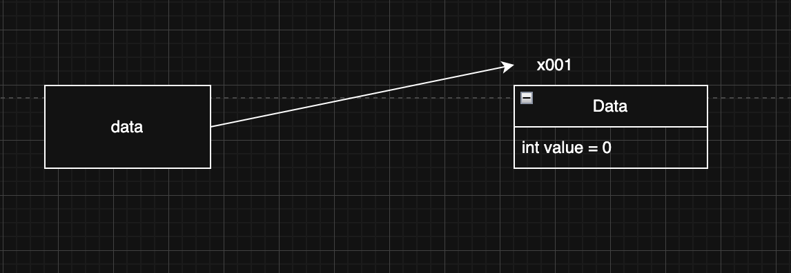
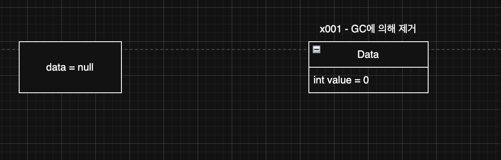

> 해당 블로그 글은 [영한님의 인프런 강의](https://inf.run/PuC6W)를 바탕으로 쓰여진 글입니다.

## 기본형 vs 참조형1 - 시작

**자바에서 참조형을 제대로 이해하는 것이 중요하다.** 

변수는 크게 기본형과 참조형으로 나눠진다. 직접 데이터를 넣을 수 있는 기본형과 객체가 저장된 실제 메모리 위치를 담은 참조값을 넣을 수 있는 참조형이 존재한다.

- 기본형: `int`,`long`,`double`,`boolean`처럼 변수에 사용할 값을 직접 넣을 수 있는 데이터 타입을 기본형이라 한다. 또한 기본형은 연산자를 이용하여 실제 들어있는 데이터끼리 연산이 가능하다.
- 참조형: 객체에 접근하기 위해 그 위치를 담긴 참조값을 저장하는 데이터 타입을 참조형이라고 한다. 객체나 배열이 이에 속한다. 또한 참조형은 연산자를 이용하여 계산이 불가능하다. 이유는 변수에 실제 데이터가 아닌 참조값이 들어가 있기 때문이다.
  - 객체는 `.`을 통하여 메모리 상에 생성된 객체를 찾아가 사용할 수 있다.
  - 배열은 `[]`을 통하여 메모리 상에 생성된 배열을 찾아가 사용할 수 있다.

> 💡 꿀팁
>
> 기본형을 제외한 나머지는 전부 참조형이다. 기본형은 자바가 기본적으로 제공해주는 타입이고 소문자로 시작한다. 반면 클래스는 대문자로 시작한다.

> ✅ 참고
>
> 자바에서 `String` 은 특별하다. `String` 은 사실은 클래스다. 따라서 참조형이다. 그런데 기본형처럼 문자 값을 바로 대입할 수 있다. 문자는 매우 자주 다루기 때문에 자바에서 특별하게 편의 기능을 제공한다.

## 기본형 vs 참조형2 - 변수 대입

**자바는 항상 변수의 값을 복사해서 대입한다.**

자바에서 변수에 값을 대입하는 것은 변수에 들어 있는 값을 복사해서 대입하는 것이다. 기본형, 참조형 모두 항상 변수에 있는 값을 복사해서 대입한다. 기본형이면 변수에 들어 있는 실제 사용하는 값을 복사해서 대입하고, 참조형이면 변수에 들어 있는 참조값을 복사해서 대입한다.

기본형은 변수에 값을 대입하더라도 실제 사용하는 값이 변수에 바로 들어있기 때문에 해당 값만 복사해서 대입한다고 생각하면 쉽게 이해할 수 있다. 그런데 **참조형의 경우 실제 사용하는 객체가 아니라 객체의 위치를 가리키는 참조값만 복사**된다.

그럼 예제코드를 통해 참조형의 참조값 복사에 대해 살펴보자.

``` java
package ref;

public class Data {
    int value;
}
```

위와 같은 클래스가 있다고 하자. 그리고 해당 클래스를 이용하여 아래의 코드를 작성했다.

``` java
package ref;

public class VarChange2 {
    public static void main(String[] args) {
        Data dataA = new Data();
        dataA.value = 10;
        Data dataB = dataA;

        System.out.println("dataA 참조 값 = " + dataA);
        System.out.println("dataB 참조 값 = " + dataB);
        System.out.println("dataA.value = " + dataA.value);
        System.out.println("dataB.value = " + dataB.value);

        dataA.value = 20;
        System.out.println("변경 dataA.value = 20");
        System.out.println("dataA.value = " + dataA.value);
        System.out.println("dataB.value = " + dataB.value);

        dataB.value = 30;
        System.out.println("변경 dataB.value = 30");
        System.out.println("dataA.value = " + dataA.value);
        System.out.println("dataB.value = " + dataB.value);
    }
}
```

그리고 결과를 예측해보자. 단순하게 생각하면 마지막 출력문에는 dataA의 value는 20, dataB의 value는 30이라고 오해하기 쉽다. 하지만 실제 실행을 해보면 dataA는 30, dataB도 30으로 되어 있을 것이다. 그림을 통해 원리를 파악해보자.



- Data dataA = new Data();
    - 위의 코드를 실행하면 위의 그림과 같이 될 것이다.



- dataA.value = 10;
    - dataA.value는 결국 dataA의 참조값인 x001을 읽어와서 해당 공간을 찾아서 value의 값을 10으로 변경해준다.
    - 위의 그림과 같이 변경될 것이다.



- Data dataB = dataA;
    - 자바는 항상 값을 읽어와서 복사하기 때문에 참조 값이 복사되어 전달 된다.
    - 위의 그림과 같이 될 것이다.



- dataA.value = 20;
    - dataA의 참조값을 읽어와서 20으로 변경한다. 즉, x001의 주소로 가서 값을 변경한다. 그러면 dataA와 dataB가 가리키는 객체는 동일하므로 값이 둘다 20으로 출력이 된다.



- dataB.value = 30;
    - dataB의 참조값을 읽어와서 30으로 변경한다. 즉, x001의 주소로 가서 값을 변경한다. 그러면 dataA와 dataB가 가리키는 객체는 동일하므로 값이 둘다 30으로 출력이 된다.

## 기본형 vs 참조형3 - 메서드 호출

**자바는 항상 변수의 값을 복사해서 대입한다.**

메서드 호출도 마찬가지이다. 메서드를 호출할 때 사용하는 매개변수(파라미터)도 결국 변수일 뿐이다. 따라서 메서드를 호출할 때 매개변수에 값을 전달하는 것도 앞서 설명한 내용과 같이 값을 복사해서 전달한다.

``` java
package ref;

public class MethodChange2 {
    public static void main(String[] args) {
        Data dataA = new Data();
        dataA.value = 10;
        System.out.println("메서드 호출 전: dataA.value = " + dataA.value);
        changeReference(dataA);
        System.out.println("메서드 호출 후: dataA.value = " + dataA.value);
    }

    static void changeReference(Data dataX) {
        dataX.value = 20;
    }
}
```

위의 코드를 보면 이전에 그림에 보여줬던거와 완전 동일하다. 그래도 다시 한번 살펴보자.


- Data dataA = new Data();
    - 위의 코드를 실행하면 위의 그림과 같이 될 것이다.


- dataA.value = 10;
    - dataA.value는 결국 dataA의 참조값인 x001을 읽어와서 해당 공간을 찾아서 value의 값을 10으로 변경해준다.
    - 위의 그림과 같이 변경될 것이다.



- changeReference(dataA)
    - 메서드를 호출하면 dataA의 참조값이 복사되어 dataX에 전달되고 위의 그림과 같이 된다.
    - 그리고 메서드 본문에서 dataX.value값을 20으로 변경함으로 dataA가 가리키는 인스턴스의 value도 변경이 된다. 이유는 같은 인스턴스를 가리키고 있기 때문이다.

### 기본형과 참조형의 메서드 호출

자바에서 메서드의 매개변수(파라미터)는 항상 값에 의해 전달된다 그러나 이 값이 실제 값이냐, 참조(메모리 주소)값이냐에 따라 동작이 달라진다.

- 기본형: 메서드로 기본형 데이터를 전달하면, 해당 값이 복사되어 전달된다. 이 경우, 메서드 내부에서 매개변수(파라미터의 값을 변경해도, 호출자의 변수 값에는 영향이 없다.
- 참조형: 메서드로 참조형 데이터를 전달하면, 참조값이 복사되어 전달된다. 이 경우, 메서드 내부에서 매개변수(파라미터)로 전달된 객체의 멤버 변수를 변경하면, 호출자의 객체도 변경된다.

### 참조형과 메서드 호출 - 활용

``` java
package class1;

public class ClassStart3 {
    public static void main(String[] args) {
        Student student1;
        student1 = new Student();
        student1.name = "학생1";
        student1.age = 15;
        student1.grade = 90;

        Student student2 = new Student();
        student2.name = "학생2";
        student2.age = 16;
        student2.grade = 80;

        System.out.println("이름: " + student1.name + " 나이: " + student1.age + " 성적: " + student1.grade);
        System.out.println("이름: " + student2.name + " 나이: " + student2.age + " 성적: " + student2.grade);

    }
}
```

우리가 말한 대원칙 **자바는 항상 변수의 값을 복사해서 대입한다.**라는 것을 깊이있게 생각하고 저번에 배열로 리팩토링 했었던 이전 코드를 메서드를 통해 리팩토링 해보자.

출력문과 초기화 로직을 각각 메서드로 분리해서 아래와 같이 리팩토링이 가능할 것이다.

``` java
package ref;

public class Method1 {
    public static void main(String[] args) {
        Student student1 = new Student();
        initStudent(student1, "학생1", 15, 90);

        Student student2 = new Student();
        initStudent(student2, "학생2", 16, 80);

        printStudent(student1);
        printStudent(student2);
    }

    static void initStudent(Student student, String name, int age, int grade) {
        student.name = name;
        student.age = age;
        student.grade = grade;
    }

    static void printStudent(Student student) {
        System.out.println("이름: " + student.name + " 나이: " + student.age + " 성적: " + student.grade);
    }
}
```

각 메서드는 객체를 파라미터로 받고 있고 우리는 인자로 참조값을 넣어줘서 초기화 로직 및 출력을 수행할 수 있다.

하지만, 여기서 더 부족한 상황이 있다. 바로 객체생성 또한 메서드에서 처리하면 어떨까? 그러면 뭔가 더 코드가 단순해질 것이다. 그렇게 변경해보자.

``` java
package ref;

public class Method2 {
    public static void main(String[] args) {
        Student student1 = createStudent("학생1", 15, 90);
        Student student2 = createStudent("학생2", 16, 80);

        printStudent(student1);
        printStudent(student2);
    }

    static Student createStudent(String name, int age, int grade) {
        Student student = new Student();

        student.name = name;
        student.age = age;
        student.grade = grade;

        return student;
    }

    static void printStudent(Student student) {
        System.out.println("이름: " + student.name + " 나이: " + student.age + " 성적: " + student.grade);
    }
}
```

객체 생성을 초기화 로직에 넣으니 파라미터로 객체를 안 받아도 되고 조금 더 단순해진 것 같다.

## 변수와 초기화

### 변수의 종류

- 멤버 변수(필드): 클래스에 선언
- 지역변수: 메서드에 선언, 매개변수도 지역변수의 한 종류이다.

### 변수의 값 초기화

- 멤버 변수
    - 인스턴스의 멤버 변수는 인스턴스를 생성할 때 자동 초기화가 된다.
    - `int`는 0, `boolean`은 false, 참조형은 null로 초기화 된다.
    - 물론, 대입 연산자를 통하여 개발자가 직접 초기값을 명시할 수도 있다.
- 지역 변수
    - 지역 변수는 반드시 대입 연산자를 통하여 초기값을 지정해줘야 한다.

## null

참조형 변수에는 항상 참조 값이 들어간다. 그런데 만약 아직 참조 할 인스턴스가 없거나 나중에 인스턴스와 연결시키고 싶은 경우도 있을 것이다. 이럴 때 자바에서 `null`이라는 키워드를 제공해준다. `null`은 아직 존재하지 않는 값이라고 알아두면 좋을 것 같다.

``` java
public class Data {
    int value;
}
```

``` java
public class Main {
    public static void main(String[] args) {
        Data data = null;
        data = new Data();
        data = null;
    }
}
```

위의 코드는 `null`을 이용하여 코드를 작성해본 예시 코드이다. 한번 분석해보자.



- Data data = null;
    - 위의 코드를 실행하면 위의 그림과 같이 실행이 된다.



- data = new Data();
    - 위의 코드를 실행하면 메모리 어딘가에 인스턴스를 생성하고 그 안에 멤버 변수는 `int`타입이므로 0으로 초기화 한 후에 참조형 변수와 연결된다.



- data = null;
    - 참조형 변수에 다시 null을 할당하면 기존 연결된 인스턴스와 끊기고 더 이상 참조되지 않는 인스턴스는 GC(가비지 컬렉터)에 의해 제거 된다.

### GC

이렇게 아무도 참조하지 않는 인스턴스는 사용되지 않고 메모리 용량만 차지할 뿐이다. 이전에 C/C++ 시절에는 소멸자라는 것이 존재하여 우리가 만든 객체들을 다 사용하면 제거를 해줘야 했다. 하지만 이런 것은 너무 번거롭다. 그래서 자바에서 GC라는 것을 만들고 GC가 인스턴스들을 모니터링 하고 있다가 더 이상 참조되지 않는 인스턴스들을 제거해준다. 이거에 대한 알고리즘들이 있는데 너무 깊이 들어가므로 나중에 다른 파트에서 다루겠다.

## NullPointerException

방을 예약할 때 없는 방을 카운터 직원이 알려줬다면 어떻게 될까? 우리는 엄청 화가 날 것이다. 이처럼 자바에서도 null을 가리키는 참조 값에 무언가를 하면 `NullPointerException`이 발생한다. 흔히 우리는 줄여서 `NPE`라고 한다. 앞으로 `NullPointerException`을 `NPE`로 줄여서 말하겠다.

``` java
package ref;

public class NullMain2 {
    public static void main(String[] args) {
        Data data = null;
        data.value = 10;
        System.out.println("data = " + data.value);
    }
}
```

위와 같은 경우에 data라는 참조 변수 값에 null이 할당되고 value에 10을 넣으려고 한다. 그러면 바로 NPE가 발생한다. 물론 Data라는 설명서가 있으니 value 써야지라고는 할 수 있다. 하지만 참조값이 null이여서 할당하면 예외가 발생하는 것이다. 위의 코드같은 경우는 쉽게 금방 예외를 해결할 수 있고 인텔리제이서 경고도 띄워준다. 하지만 헷갈리는 경우는 아래와 같다.

``` java
package ref;

public class BigData {
    Data data;

    int count;
}
```

``` java
package ref;

public class NullMain3 {
    public static void main(String[] args) {
        BigData bigData = new BigData();
        System.out.println("bigData.count = " + bigData.count);
        System.out.println("bigData.data = " + bigData.data);

        System.out.println("bigData.data.value = " + bigData.data.value);
    }
}
```

위의 코드를 보면 BigData라는 클래스의 멤버변수로 Data라는 참조변수가 할당되어 있다. 초기값을 지정을 안 했으므로 null로 할당이 된다. 하지만 main메서드에서 data에 있는 값을 가져오려 하므로 NPE가 발생한다. 이처럼 실무에서 복잡한 로직에서 NPE가 발생하는 경우가 있는데 이럴때 엄청 유의해야 한다.

> 잘못된 지식이 있을 경우 댓글로 남겨주시면 빠르게 반영하겠습니다!