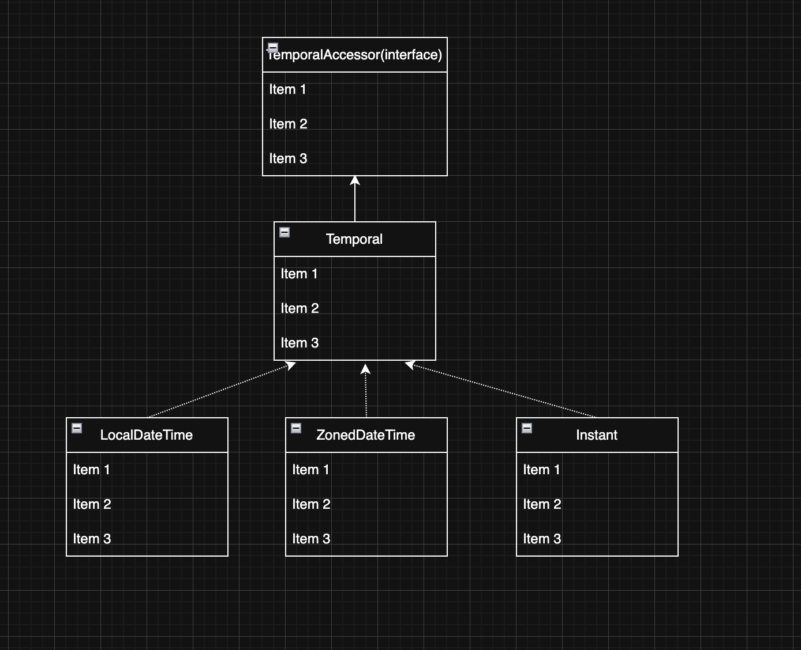
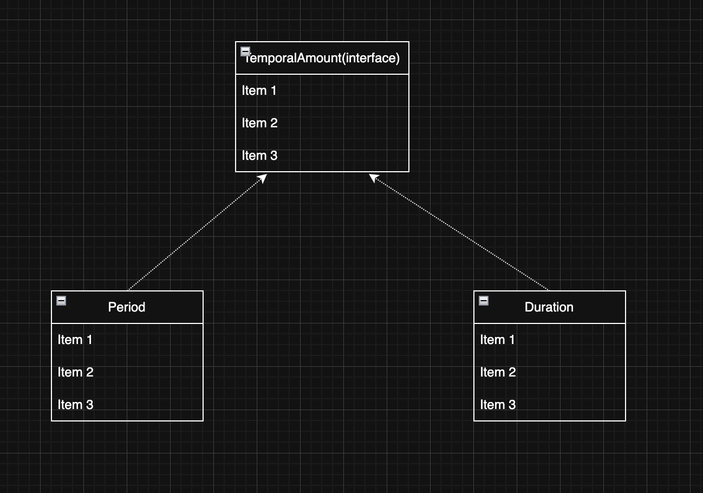
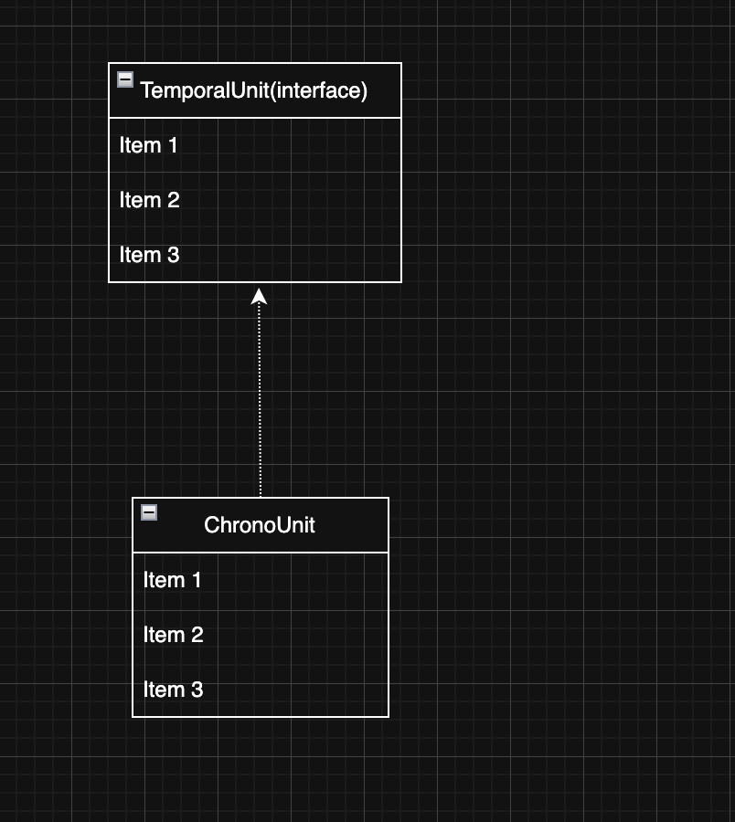
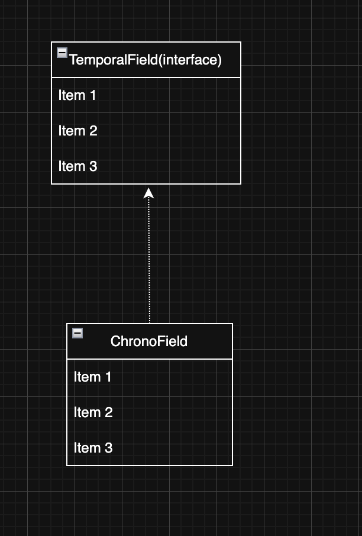

> 해당 블로그 글은 [영한님의 인프런 강의](https://inf.run/FiFGQ)를 바탕으로 쓰여진 글입니다.

## 날짜와 시간 라이브러리가 필요한 이유

날짜와 시간을 계산하는 것은 정말 복잡하고 어렵다. 처음에 필자도 그냥 산수로 하면 되는거 아닌가라고 생각을 하였다. 하지만 구체적으로 들어가다 보면 정말 복잡하다. 그러면 왜 날짜 계산이 어려울까?

### 날짜와 시간 차이 계산

특정 날짜에서 다른 날짜까지의 정확한 일수를 계산하는 것은 생각보다 복잡하다. 윤년, 각 달의 일수 등을 모두 고려해야 하며, 간단한 뺄셈 연산으로는 정확한 결과를 얻기 어렵다.

### 윤년 계산

윤년 계산은 간단해 보이지만 실제로는 매우 복잡하다. 윤년은 보통 4년마다 한 번씩 발생하지만, 100년 단위일 때는 윤년이 아니며, 400년 단위일 때는 다시 윤년이다. 즉, 이런것을 고려하면서 날짜 계산을 하기에는 정말 복잡하다.

### 일광 절약 시간(Daylight Saving Time, DST) 변환

보통 3월에서 10월은 태양이 일찍 뜨고, 나머지는 태양이 상대적으로 늦게 뜬다. 시간도 여기에 맞추어 1시간 앞당기거나 늦추는 제도를 일광 절약 시간제 또는 썸머타임이라 한다. 일광 절약 시간은 국가나 지역에 따라 적용 여부와 시작 및 종료 날짜가 다르다. 이로 인해 날짜와 시간 계산 시 1시간의 오차가 발생할 수 있으며, 이를 정확히 계산하는 것은 복잡하다. 또한 DST는 우리나라에서는 적용되지 않는다. 그러니 해외시간 계산 같은 것을 할때는 정말 복잡하지 않을 수 없다.

### 타임존 계산

세계는 다양한 타임존으로 나뉘어 있으며, 각 타임존은 UTC(협정 세계시)로부터의 시간 차이로 정의된다. 타임존 간의 날짜와 시간 변환을 정확히 계산하는 것은 복잡하다. 타임존의 목록으로는 아래와 같다.

- Europe/London
- GMT
- UTC
- US/Arizona -07:00
- America/New_York -05:00
- Asia/Seoul +09:00
- Asia/Dubai +04:00
- Asia/Istanbul +03:00
- Asia/Shanghai +08:00
- Europe/Paris +01:00
- Europe/Berlin +01:00

여기서 GMT와 UTC는 세계 표준 시간이라고 보면 된다. 처음 세계에서 시간을 정의할 때 영국에 그리니치 천문대를 기준으로 시간을 정의하였다. 그런데 지구의 자전속도가 조금씩 달라진다는 것을 알게된 우리 인간은 윤초를 추가하거나 빼는 방식으로 시간을 조정함으로써, 보다 정확한 시간을 유지하게 하였다. 따라서 보통 UTC를 기준으로 표준 시간을 정의한다.

> ⚠️ 주의
>
> 일광 절약 시간이 적용되는 경우, 타임존 차이가 변할 수 있다.

이러한 복잡성 때문에 대부분의 현대 개발 환경에서는 날짜와 시간을 처리하기 위해 잘 설계된 라이브러리를 사용해야 한다. 이러한 라이브러리는 위에서 언급한 복잡한 계산을 추상화하여 제공하므로, 개발자는 보다 안정적이고 정확하며 효율적인 코드를 작성할 수 있다.

### 자바 날짜와 시간 라이브러리의 역사

#### Date

- JDK1.0에 등장한 시간 관련 라이브러리다.
- 문제점
  - 타임존 처리 부족: 초기 `Date` 클래스는 타임존(time zone)을 제대로 처리하지 못했다.
  - 불편한 날짜 시간 연산: 날짜 간 연산이나 시간의 증감 등을 처리하기 어려웠다.
  - 불변 객체 부재: `Date` 객체는 변경 가능(mutable)하여, 데이터가 쉽게 변경될 수 있었고 이로 인해 버그가 발생하기 쉬웠다.
- 해결책: `Calendar` 클래스를 도입하여 타임존 지원 및 날짜 시간 연산을 위한 추가 메서드를 지원했다.

#### Calendar

- JDK1.1에 등장한 시간 관련 라이브러리다.
- 문제점
  - 사용성 저하: `Calendar` 는 사용하기 복잡하고 직관적이지 않았다.
  - 성능 문제: 일부 사용 사례에서 성능이 저하되는 문제가 있었다.
  - 불변 객체 부재: `Calendar` 객체도 변경 가능하여 사이드 이펙트, 스레드 안전성 문제가 있었다.
- 해결책: 어느 개발자가 이러한 문제점을 직시하고 `Joda-Time`이라는 오픈소스 라이브러리를 도입하였다.

#### Joda-Time

- 문제점: `Joda-Time`의 문제점은 자바 표준 라이브러리가 아니여서 사용하려면 해당 라이브러리를 설치하여 사용해야 했다.
- 해결책: 자바가 이 개발자를 영입하여 해당 라이브러리를 개선하여 JDK8에 `java.time`이라는 API를 제공하였다.

#### java.time 패키지

- `java.time` 패키지는 이전 API의 문제점을 해결하면서, 사용성, 성능, 스레드 안전성, 타임존 처리 등에서 크게 개선되었다. 변경 불가능한 불변 객체 설계로 사이드 이펙트, 스레드 안전성 보장, 보다 직관적인 API 제공으로 날짜와 시간 연산을 단순화했다.

## 자바 날짜와 시간 라이브러리 소개

### LocalDate, LocalTime, LocalDateTime

- LocalDate: 년-월-일과 같이 날짜만 표현할 때 사용 ex.2025-05-02
- LocalTime: 시-분-초와 같이 시간만 표현할 때 사용, 참고로 초 단위는 ms, ns를 포함한다. ex. 12:05:22.845
- LocalDateTime: LocalDate와 LocalTime을 합친 형태이다. ex. 2025-05-02T12:05:22.845

해당 클래스들은 앞에 `Local`이 붙어있고 이것으로 유추해보면 세계시간대를 고려한 시간이 아니다. 해당 지역의 시간을 고려한 시간대이므로 국내 서비스 웹 어플리케이션을 만들때 주로 사용한다.

### ZonedDateTime, OffsetDateTime

- ZonedDateTime: 기존 LocalDateTime에 offsetTime(UTC와 시간 차이)과 타임존이 포함된 시간대이다. 타임존을 알면 오프셋과 일광 절약 시간제에 대한 정보를 알 수 있다. 즉, 일광 절약 시간제가 적용된 시간대이다. ex. 2025-05-02T12:05:22.845+9:00[Asia/Seoul]
- OffsetDateTime: 기존 LocalDateTime에 offsetTime만 추가된 시간대이다. 타임존이 없기에 일광 절약 시간제를 알 수 없다. ex. 2025-05-02T12:05:22.845+9:00

### Year, Month, YearMonth, MonthDay

자주 사용되지 않는다. 각각 년, 월, 년-월, 월-일을 다룰 때 사용한다.

### Instant

UTC(협정 세계시)를 기준으로 하는, 시간의 한 지점을 나타낸다. 즉, UTC를 기준으로 지금 시간대의 차이를 ns단위로 저장되어 있는 값다.

### Period, Duration

#### Period

두 날짜 사이의 간격을 년, 월, 일 단위로 나타낸다. 이렇게만 보면 뭔지 모르겠는데 예시를 보면 확 이해를 할 것이다. 예를 들어, 이 프로젝트는 2025년 12월 31일까지 완료해야한다라는 문구에서 Period를 사용할 수 있다.

#### Duration

두 시간 사이의 간격을 시, 분, 초(나노초) 단위로 나타낸다. 이렇게만 보면 뭔지 모르겠는데 예시를 보면 확 이해를 할 것이다. 예를 들어, 퇴근 시간까지 30분 남았어라고 할 때 Duration을 사용할 수 있다.

## 기본 날짜와 시간 - LocalDateTime

가장 기본이 되는 날짜와 시간 클래스는 `LocalDate`,`LocalTime`,`LocalDateTime`이다.

### LocalDate

``` java
package time;

import java.time.LocalDate;

public class LocalDateMain {
    public static void main(String[] args) {
        LocalDate nowDate = LocalDate.now();
        LocalDate ofDate = LocalDate.of(2013, 11, 21);

        System.out.println("오늘 날짜 = " + nowDate);
        System.out.println("지정 날짜 = " + ofDate);

        LocalDate plusDays = ofDate.plusDays(10);
        System.out.println("지정날짜+10d = " + plusDays);
    }
}
```

위의 코드는 `LocalDate`를 가지고 각 종 메서드를 호출하면서 확인해보는 코드이다. 그럼 주요 메서드들을 알아보자.

- `now()` : 현재 시간을 기준으로 생성한다.
- `of()` : 특정 날짜를 기준으로 생성한다. 년, 월, 일을 입력할 수 있다.
- `plusDays()` : 특정 일을 더한다. 다양한 `plusXxx()`메서드가 존재한다.

> ⚠️ 주의
>
> 모든 날짜 클래스는 불변이다. 따라서 변경이 발생하는 경우 새로운 객체를 생성해서 반환하므로 반환값을 꼭 받아야 한다.

### LocalTime

``` java
package time;

import java.time.LocalTime;

public class LocalTimeMain {
    public static void main(String[] args) {
        LocalTime nowTime = LocalTime.now();
        LocalTime ofTime = LocalTime.of(9, 10, 30);

        System.out.println("현재 시간 = " + nowTime);
        System.out.println("지정 시간 = " + ofTime);

        LocalTime ofTimePlus = ofTime.plusSeconds(30);
        System.out.println("지정 시간+30s = " + ofTimePlus);
    }
}
```

주요 메서드들을 살펴보자.

- `now()` : 현재 시간을 기준으로 생성한다.
- `of()` : 특정 시간을 기준으로 생성한다. 시, 분, 초, 나노초를 입력할 수 있다.
- `plusSeconds()` : 특정 초를 더한다. 다양한 `plusXxx()`메서드가 존재한다.

> ⚠️ 주의
>
> 모든 날짜 클래스는 불변이다. 따라서 변경이 발생하는 경우 새로운 객체를 생성해서 반환하므로 반환값을 꼭 받아야 한다.

### LocalDateTime

``` java
package time;

import java.time.LocalDate;
import java.time.LocalDateTime;
import java.time.LocalTime;

public class LocalDateTimeMain {
    public static void main(String[] args) {
        LocalDateTime nowDt = LocalDateTime.now();
        LocalDateTime ofDt = LocalDateTime.of(2016, 8, 16, 8, 10, 1);

        System.out.println("현재 날짜 시간 = " + nowDt);
        System.out.println("지정 날짜 시간 = " + ofDt);

        LocalDate localDate = ofDt.toLocalDate();
        LocalTime localTime = ofDt.toLocalTime();

        System.out.println("localDate = " + localDate);
        System.out.println("localTime = " + localTime);

        LocalDateTime localDateTime = LocalDateTime.of(localDate, localTime);
        System.out.println("localDateTime = " + localDateTime);

        LocalDateTime ofDtPlus = ofDt.plusDays(1000);
        System.out.println("지정 날짜 시간+1000d = " + ofDtPlus);

        LocalDateTime ofDtPlus1Year = ofDt.plusYears(1);
        System.out.println("지정 날짜 시간+1년 = " + ofDtPlus1Year);

        System.out.println("현재 날짜 시간이 지정 날짜 시간보다 이전인가? " + nowDt.isBefore(ofDt));
        System.out.println("현재 날짜 시간이 지정 날짜 시간보다 이후인가? " + nowDt.isAfter(ofDt));
        System.out.println("현재 날짜 시간이 지정 날짜 시간보다 같은가? " + nowDt.isEqual(ofDt));
    }
}
```

주요 메서드를 살펴보자.

- `now()` : 현재 날짜와 시간을 기준으로 생성한다.
- `of()` : 특정 날짜와 시간을 기준으로 생성한다. `LocalDate`와 `LocalTime`을 인수로 받을 수 있다.
- `toXxx()`: 날짜와 시간을 `toXxx()`메서드로 분리할 수 있다.
- `plusXxx()` : 특정 날짜와 시간을 더한다. 다양한 `plusXxx()` 메서드가 존재한다.
- `isBefore()`: 다른 날짜시간과 비교한다. 현재 날짜와 시간이 이전이라면 `true` 를 반환한다.
- `isAfter()`: 다른 날짜시간과 비교한다. 현재 날짜와 시간이 이후라면 `true` 를 반환한다.
- `isEqual()`: 다른 날짜시간과 시간적으로 동일한지 비교한다. 시간이 같으면 `true` 를 반환한다.

#### isEqual() vs equals()

- `isEqual()` 는 단순히 비교 대상이 시간적으로 같으면 `true` 를 반환한다. 객체가 다르고, 타임존이 달라도 시간적으로 같으면 `true` 를 반환한다. 쉽게 이야기해서 시간을 계산해서 시간으로만 둘을 비교한다.
- `equals()` 객체의 타입, 타임존 등등 내부 데이터의 모든 구성요소가 같아야 `true` 를 반환한다.

## 타임존 - ZonedDateTime

### ZoneId

자바는 타임존을 `ZoneId` 클래스로 제공한다.

``` java
package time;

import java.time.ZoneId;

public class ZoneIdMain {
    public static void main(String[] args) {
        for (String availableZoneId : ZoneId.getAvailableZoneIds()) {
            ZoneId zoneId = ZoneId.of(availableZoneId);
            System.out.println(zoneId + " | " + zoneId.getRules());
        }

        ZoneId zoneId = ZoneId.systemDefault();
        System.out.println("ZoneId.systemDefault = " + zoneId);

        ZoneId seoulZoneId = ZoneId.of("Asia/Seoul");
        System.out.println("seoulZoneId = " + seoulZoneId);
    }
}
```

주요 메서드들을 살펴보자.

- `ZoneId.systemDefault()` : 시스템이 사용하는 기본 `ZoneId` 를 반환한다.
  - 시스템마다 다르다. 그래서 해외지역의 EC2 인스턴스에 배포를 한다면 해당 부분을 주의해야 한다.
- `ZoneId.of()` : 타임존을 직접 제공해서 `ZoneId` 를 반환한다.

`ZoneId` 는 내부에 일광 절약 시간 관련 정보, UTC와의 오프셋 정보를 포함하고 있다.

### ZonedDateTime

`LocalDateTime`에 `ZoneId`를 포함한게 `ZonedDateTime`이다.

``` java
package time;

import java.time.LocalDateTime;
import java.time.ZoneId;
import java.time.ZonedDateTime;

public class ZonedDateTimeMain {
    public static void main(String[] args) {
        ZonedDateTime nowZdt = ZonedDateTime.now();
        System.out.println("nowZdt = " + nowZdt);

        LocalDateTime ldt = LocalDateTime.of(2030, 1, 1, 13, 30, 50);
        ZonedDateTime zdt1 = ZonedDateTime.of(ldt, ZoneId.of("Asia/Seoul"));
        System.out.println("zdt1 = " + zdt1);

        ZonedDateTime zdt2 = ZonedDateTime.of(2030, 1, 1, 13, 30, 50, 0, ZoneId.of("Asia/Seoul"));
        System.out.println("zdt2 = " + zdt2);

        ZonedDateTime utcZdt = zdt2.withZoneSameInstant(ZoneId.of("UTC"));
        System.out.println("utcZdt = " + utcZdt);
    }
}
```

주요 메서드들을 살펴보자.

- `now()` : 현재 날짜와 시간을 기준으로 생성한다. 이때 `ZoneId` 는 현재 시스템을 따른다.
- `of()` : 특정 날짜와 시간을 기준으로 생성한다. `ZoneId` 를 추가해야 한다.
- `withZoneSameInstant(ZoneId)` : 타임존을 변경한다. 타임존에 맞추어 시간도 함께 변경된다.

### OffsetDateTime

`LocalDateTime`에 `ZoneOffset`만 포함된 것이 `OffsetDateTime`이다. 해당 클래스는 타임존은 포함되지 않기 때문에 일광 절약 시간은 적용되지 않는다.

``` java
package time;

import java.time.LocalDateTime;
import java.time.OffsetDateTime;
import java.time.ZoneOffset;

public class OffsetDateTimeMain {
    public static void main(String[] args) {
        OffsetDateTime nowOdt = OffsetDateTime.now();
        System.out.println("nowOdt = " + nowOdt);

        LocalDateTime ldt = LocalDateTime.of(2030, 1, 1, 13, 30, 50);
        System.out.println("ldt = " + ldt);

        OffsetDateTime odt = OffsetDateTime.of(ldt, ZoneOffset.of("+01:00"));
        System.out.println("odt = " + odt);
    }
}
```

#### ZonedDateTime vs OffsetDateTime

- `ZonedDateTime` 은 구체적인 지역 시간대를 다룰 때 사용하며, 일광 절약 시간을 자동으로 처리할 수 있다. 사용자 지정 시간대에 따른 시간 계산이 필요할 때 적합하다. 즉, 배포할때 ZoneId를 설정하여 시간 값을 설정하기도 한다.
- `OffsetDateTime` 은 UTC와의 시간 차이만을 나타낼 때 사용하며, 지역 시간대의 복잡성을 고려하지 않는다. 시간대 변환 없이 로그를 기록하고, 데이터를 저장하고 처리할 때 적합하다.

> ✅ 참고
>
> `ZonedDateTime`같은 경우는 글로벌 서비스를 개발할 때 사용한다. 국내 서비스만 개발한다면 `LocalDateTime`을 일단 고려하자!

## 기계 중심의 시간 - Instant

Instant` 는 UTC(협정 세계시)를 기준으로 하는, 시간의 한 지점을 나타낸다. `Instant` 는 날짜와 시간을 나노초 정밀도로 표현하며, 1970년 1월 1일 0시 0분 0초(UTC 기준)를 기준으로 경과한 시간으로 계산된다.**쉽게 이야기해서 Instant 내부에는 초 데이터만 들어있다. (나노초 포함)** 따라서 날짜와 시간을 계산에 사용할 때는 적합하지 않다.

> ✅ 참고
>
> Epoch time(에포크 시간), 또는 Unix timestamp는 컴퓨터 시스템에서 시간을 나타내는 방법 중 하나이다. 이는 1970년 1월 1일 00:00:00 UTC부터 현재까지 경과된 시간을 초 단위로 표현한 것이다. 즉, Unix 시간은 1970년 1월 1일 이후로 경과한 전체 초의 수로, 시간대에 영향을 받지 않는 절대적인 시간 표현 방식이다. Instant는 에포크 시간을 다루는 클래스라고 생각하자. 또한 UTC기준이기에 글로벌 서비스를 개발할 때에 사용할 수 있다. 솔직히 개인적인 의견은 그냥 이런게 있구나라고만 알고 사용할 때 찾아보면 되지 않을까 싶다.

### 특징

- 장점
  - 시간대 독립성: `Instant` 는 UTC를 기준으로 하므로, 시간대에 영향을 받지 않는다. 이는 전 세계 어디서나 동일한 시점을 가리키는데 유용하다.
  - 고정된 기준점: 모든 `Instant` 는 1970년 1월 1일 UTC를 기준으로 하기 때문에, 시간 계산 및 비교가 명확하고 일관된다.
- 단점
  - 사용자 친화적이지 않음: `Instant` 는 기계적인 시간 처리에는 적합하지만, 사람이 읽고 이해하기에는 직관적이지 않다. 예를 들어, 날짜와 시간을 계산하고 사용하는데 필요한 기능이 부족하다.
  - 시간대 정보 부재: `Instant` 에는 시간대 정보가 포함되어 있지 않아, 특정 지역의 날짜와 시간으로 변환하려면 추가적인 작업이 필요하다.

### 사용 예시

- 전 세계적인 시간 기준 필요 시: `Instant` 는 UTC를 기준으로 하므로, 전 세계적으로 일관된 시점을 표현할 때 사용하기 좋다. ex. 로그 기록
- 시간대 변환 없이 시간 계산 필요 시: 시간대의 변화 없이 순수하게 시간의 흐름만을 다루고 싶을 때 `Instant` 가 적합하다. 이는 시간대 변환의 복잡성 없이 시간 계산을 할 수 있게 해준다.
- 데이터 저장 및 교환: 데이터베이스에 날짜와 시간 정보를 저장하거나, 다른 시스템과 날짜와 시간 정보를 교환할 때 `Instant` 를 사용하면, 모든 시스템에서 동일한 기준점(UTC)을 사용하게 되므로 데이터의 일관성을 유지하기 쉽다.

그런데 이렇게 예시가 있지만 그냥 글로벌 서비스를 만들 때 사용한다고 보고 지금은 그냥 쓱 훓기만 하자. 왜냐하면 로그같은 것을 기록할 때도 어처피 좋은 서비스들도 있고 국내 서비스만 운용한다면 UTC를 기준으로 할 필요가 없기 때문이다.

``` java
package time;

import java.time.Instant;
import java.time.ZonedDateTime;

public class InstantMain {
    public static void main(String[] args) {
        Instant now = Instant.now();
        System.out.println("now = " + now);

        ZonedDateTime zdt = ZonedDateTime.now();
        Instant from = Instant.from(zdt);
        System.out.println("from = " + from);

        Instant epochStart = Instant.ofEpochSecond(0);
        System.out.println("epochStart = " + epochStart);

        Instant later = epochStart.plusSeconds(3600);
        System.out.println("later = " + later);

        long laterEpochSecond = later.getEpochSecond();
        System.out.println("laterEpochSecond = " + laterEpochSecond);
    }
}
```

주요 메서드를 살펴보자.

- `now()` : UTC를 기준 현재 시간의 `Instant` 를 생성한다.
- `from()` : 다른 타입의 날짜와 시간을 기준으로 `Instant` 를 생성한다. 참고로 `Instant` 는 UTC를 기준으로 하기 때문에 시간대 정보가 필요하다. 따라서 `LocalDateTime` 은 사용할 수 없다.
- `ofEpochSecond()` : 에포크 시간을 기준으로 `Instant` 를 생성한다. 0초를 선택하면 에포크 시간인 1970년 1월 1일 0시 0분 0초로 생성된다.
- `plusSeconds()` : 초를 더한다. 초, 밀리초, 나노초 정도만 더하는 간단한 메서드가 제공된다.
- `getEpochSecond()` : 에포크 시간인 UTC 1970년 1월 1일 0시 0분 0초를 기준으로 흐른 초를 반환한다.

## 기간, 시간의 간격 - Duration, Period

|구분|Period|Duration|
|---|------|--------|
|단위|년, 월, 일|시간, 분, 초, 나노초|
|사용 대상|날짜|시간|
|주요 메서드|getYears(), getMonth(), getDays()|toHours(), toMinutes(), getSeconds(), getNano()|

### Period

``` java
package time;

import java.time.LocalDate;
import java.time.Period;

public class PeriodMain {
    public static void main(String[] args) {
        Period period = Period.ofDays(10);
        System.out.println("period = " + period);

        LocalDate currentDate = LocalDate.of(2030, 1, 1);
        LocalDate plusDate = currentDate.plus(period);
        System.out.println("현재 날짜: " + currentDate);
        System.out.println("더한 날짜: " + plusDate);

        LocalDate startDate = LocalDate.of(2023, 1, 1);
        LocalDate endDate = LocalDate.of(2024, 4, 2);
        Period between = Period.between(startDate, endDate);
        System.out.println("기간: " + between.getMonths() + "개월 " + between.getDays() + "일");
    }
}
```

주요 메서드를 알아보자.

- `of()` : 특정 기간을 지정해서 `Period` 를 생성한다.
  - `of(년, 월, 일)`
  - `ofDays()`
  - `ofMonths()`
  - `ofYears()`
- `plus()`: 계산에 사용되기도 한다.
- `between(startDate, endDate)`: 특정 날짜간의 기간 구하기, static 메서드이다.

### Duration

``` java
package time;

import java.time.Duration;
import java.time.LocalTime;

public class DurationMain {
    public static void main(String[] args) {
        Duration duration = Duration.ofMinutes(30);
        System.out.println("duration = " + duration);

        LocalTime lt = LocalTime.of(1, 0);
        System.out.println("기준 시간 = " + lt);

        LocalTime plusTime = lt.plus(duration);
        System.out.println("더한 시간 = " + plusTime);

        LocalTime start = LocalTime.of(9, 0);
        LocalTime end = LocalTime.of(10, 0);
        Duration between = Duration.between(start, end);
        System.out.println("차이: " + between.getSeconds() + "초");
        System.out.println("근무시간: " + between.toHours() + "시간 " + between.toMinutesPart() + "분");
    }
}
```

주요 메서드를 알아보자.

- `of()` : 특정 시간을 지정해서 `Duration` 를 생성한다.
  - `of(지정)`
  - `ofSeconds()`
  - `ofMinutes()`
    - 위와 같이 이용하면 해당 초가 나온다. ex. 1시간 60분
    - `ofMinutesPart()`를 이용하면 시간단위를 뺀 분 단위만 나온다. ex. 1시간 0분
  - `ofHours()`
- `plus()`: 계산에 사용되기도 한다.
- `between(start, end)`: 특정 시간의 차이 구하기, static 메서드이다.

## 날짜와 시간의 핵심 인터페이스

날짜와 시간은 특정 시점의 시간(시각)과 시간의 간격(기간)으로 나눌 수 있다.

### 특정 시점의 시간



- 특정 시점의 시간: `Temporal`(`TemporalAccessor`포함) 인터페이스를 구현한다.
  - 구현으로 `LocalDateTime`,`LocalDate`, `LocalTime` , `ZonedDateTime`, `OffsetDateTime`,`Instant` 등이 있다.

#### TemporalAccessor

날짜와 시간을 읽기 위한 인터페이스이며, 특정 시점의 날짜와 시간을 읽기 위한 기능을 제공한다. 쉽게 생각해서 읽기 전용이라고 생각하면 된다.

#### Temporal

`TemporalAccessor`를 상속받는 인터페이스로 날짜와 시간을 조작하는 기능을 제공한다. 쉽게 생각해서 쓰기 전용이라고 생각하면 된다.

### 시간의 간격



- 시간의 간격(기간): `TemporalAmount` 인터페이스를 구현한다.
  - 구현으로는 `Period`, `Duration`이 존재한다.

#### TemporalAmount

시간의 간격을 나타내며 날짜와 시간 객체에 적용하며, 그 객체를 조정할 수 있다.

### 시간 단위와 필드

#### 시간 단위 - TemporalUnit, ChronoUnit



- `TemporalUnit` 인터페이스는 날짜와 시간을 측정하는 단위를 나타내며, 주로 사용되는 구현체는 `java.time.temporal.ChronoUnit` 열거형으로 구현되어 있다.
- `ChronoUnit` 은 다양한 시간 단위를 제공한다.

##### 시간 단위

|ChronoUnit|설명|
|------|---|
|NANOS|나노초 단위|
|MICROS|마이크로초 단위|
|MILLIS|밀리초 단위|
|SECONDS|초 단위|
|MINUTES|분 단위|
|HOURS|시간 단위|

##### 날짜 단위

|ChronoUnit|설명|
|------|---|
|DAYS|일 단위|
|WEEKS|주 단위|
|MONTHS|월 단위|
|YEARS|년 단위|
|DECADES|10년 단위|
|CENTURIES|세기 단위|
|MILLENNIA|천년 단위|

##### 기타 단위

|ChronoUnit|설명|
|------|---|
|ERAS|시대 단위|
|FOREVER|무한대의 시간 단위|

##### ChronoUnit의 주요 메서드

|메서드 이름|설명|
|------|---|
|between(Temporal, Temporal)|두 Temporal 객체 사이의 시간을 현재 ChronoUnit 단위로 측정하여 반환한다.|
|isDateBased()|현재 ChronoUnit이 날짜 기반 단위인지 여부를 반환한다.|
|isTimeBased()|현재 ChronoUnit이 시간 기반 단위인지 여부를 반환한다.|
|isSupportedBy(Temporal)|주어진 Temporal 객체가 현재 ChronoUnit 단위를 지원하는지 여부를 반환한다.|
|getDuration()|현재 ChronoUnit의 기간을 Duration 객체로 반환한다.|

#### 시간 필드 - ChronoField



ChronoField` 는 날짜 및 시간을 나타내는 데 사용되는 열거형이다. 이 열거형은 다양한 필드를 통해 날짜와 시간의 특정 부분을 나타낸다. 여기에는 연도, 월, 일, 시간, 분 등이 포함된다.

- `TemporalField` 인터페이스는 날짜와 시간을 나타내는데 사용된다. 주로 사용되는 구현체는 `java.time.temporal.ChronoField` 열거형으로 구현되어 있다.
- `ChronoField`는 다양한 필드를 통해 날짜와 시간의 특정 부분을 나타낸다. 여기에는 연도, 월, 일, 시간, 분 등이 포함된다.
- 필드라는 뜻이 날짜와 시간 중에 있는 특정 필드들을 뜻한다. 쉽게 생각해서 2025-05-02일때 연은 2025, 월은 05, 일은 02인것처럼 특정 단위 값을 의미한다.
- 단순히 시간의 단위 하나하나를 뜻하는 `ChronoUnit` 과는 다른 것을 알 수 있다. `ChronoField` 를 사용해야 날짜와 시간의 각 필드 중에 원하는 데이터를 조회할 수 있다.

##### 연도 관련 필드

|ChronoField|설명|
|------|---|
|ERA|연대, 예를 들어 서기(AD) 또는 기원전(BC)|
|YEAR_OF_ERA|연대 내의 연도|
|YEAR|연도|
|EPOCH_DAY|1970-01-01부터의 일 수|

##### 월 관련 필드

|ChronoField|설명|
|------|---|
|MONTH_OF_YEAR|월 (1월 = 1)|
|PROLEPTIC_MONTH|연도를 월로 확장한 값|

##### 주 및 일 관련 필드

|ChronoField|설명|
|------|---|
|DAY_OF_WEEK|요일 (월요일 = 1)|
|ALIGNED_DAY_OF_WEEK_IN_MONTH|월의 첫 번째 요일을 기준으로 정렬된 요일|
|ALIGNED_DAY_OF_WEEK_IN_YEAR|연의 첫 번째 요일을 기준으로 정렬된 요일|
|DAY_OF_MONTH|월의 일 (1일 = 1)|
|DAY_OF_YEAR|연의 일 (1월 1일 = 1)|
|EPOCH_DAY|유닉스 에폭(1970-01-01)부터의 일 수|

##### 시간 관련 필드

|ChronoField|설명|
|------|---|
|HOUR_OF_DAY|시간 (0-23)|
|CLOCK_HOUR_OF_DAY|시계 시간 (1-24)|
|HOUR_OF_AMPM|오전/오후 시간 (0-11)|
|CLOCK_HOUR_OF_AMPM|오전/오후 시계 시간 (1-12)|
|MINUTE_OF_HOUR|분 (0-59)|
|SECOND_OF_MINUTE|초 (0-59)|
|NANO_OF_SECOND|초의 나노초 (0-999,999,999)|
|MICRO_OF_SECOND|초의 마이크로초 (0-999,999)|
|MILLI_OF_SECOND|초의 밀리초 (0-999)|

##### 기타 필드

|ChronoField|설명|
|------|---|
|AMPM_OF_DAY|하루의 AM/PM 부분|
|INSTANT_SECONDS|초를 기준으로 한 시간|
|OFFSET_SECONDS|UTC/GMT에서의 시간 오프셋 초|

##### 주요 메서드

|메서드|반환 타입|설명|
|------|---|---|
|getBaseUnit()|TemporalUnit|필드의 기본 단위를 반환한다. 예를 들어, 분 필드의 기본 단위는 ChronoUnit.MINUTES이다.|
|getRangeUnit()|TemporalUnit|필드의 범위 단위를 반환한다. 예를 들어, MONTH_OF_YEAR의 범위 단위는 ChronoUnit.YEARS이다.|
|isDateBased()|boolean|필드가 주로 날짜를 기반으로 하는지 여부를 나타냅니다. YEAR와 같은 날짜 기반 필드는 true를 반환한다.|
|isTimeBased()|boolean|필드가 주로 시간을 기반으로 하는지 여부를 나타낸다. HOUR_OF_DAY와 같은 시간 기반 필드는 true를 반환한다.|
|range()|ValueRange|필드가 가질 수 있는 값의 유효 범위를 ValueRange 객체로 반환한다. 이 객체는 최소값과 최대값을 제공한다.|

`TemporalUnit(ChronoUnit)`,`TemporalField(ChronoField)` 는 단독으로 사용하기 보다는 주로 날짜와 시간을 조회하거나 조작할 때 사용한다.

## 날짜와 시간 조회하고 조작하기1

그럼 이제 예제를 통하여 날짜와 시간을 조회하고 조작해보자.

### 날짜와 시간 조회하기

``` java
package time;

import java.time.LocalDateTime;
import java.time.temporal.ChronoField;

public class GetTimeMain {
    public static void main(String[] args) {
        LocalDateTime dt = LocalDateTime.of(2030, 1, 1, 13, 50, 59);
        System.out.println("YEAR = " + dt.get(ChronoField.YEAR));
        System.out.println("MONTH_OF_YEAR = " + dt.get(ChronoField.MONTH_OF_YEAR));
        System.out.println("DAY_OF_MONTH = " + dt.get(ChronoField.DAY_OF_MONTH));
        System.out.println("HOUR_OF_DAY = " + dt.get(ChronoField.HOUR_OF_DAY));
        System.out.println("MINUTE_OF_HOUR = " + dt.get(ChronoField.MINUTE_OF_HOUR));
        System.out.println("SECOND_OF_MINUTE = " + dt.get(ChronoField.SECOND_OF_MINUTE));

        System.out.println("편의 메서드 사용");
        System.out.println("YEAR = " + dt.getYear());
        System.out.println("MONTH_OF_YEAR = " + dt.getMonthValue());
        System.out.println("DAY_OF_MONTH = " + dt.getDayOfMonth());
        System.out.println("HOUR_OF_DAY = " + dt.getHour());
        System.out.println("MINUTE_OF_HOUR = " + dt.getMinute());
        System.out.println("SECOND_OF_MINUTE = " + dt.getSecond());

        System.out.println("편의 메서드 없음");
        System.out.println("MINUTE_OF_DAY = " + dt.get(ChronoField.MINUTE_OF_DAY));
        System.out.println("SECOND_OF_DAY = " + dt.get(ChronoField.SECOND_OF_DAY));
    }
}
```

#### TemporalAccessor.get(TemporalField field)

- `LocalDateTime` 을 포함한 특정 시점의 시간을 제공하는 클래스는 모두 `TemporalAccessor` 인터페이스를 구현한다.
- `TemporalAccessor` 는 특정 시점의 시간을 조회하는 기능을 제공한다.
- `get(TemporalField field)` 을 호출할 때 어떤 날짜와 시간 필드를 조회할 지 `TemporalField` 의 구현인 `ChronoField` 를 인수로 전달하면 된다.

#### 편의 메서드 제공

기본적으로 특정 시점의 시간을 구하려면 `get`메서드를 통해 값과 단위를 넘겨줘야 한다. 하지만 자주 사용하는 것들은 미리 만들어두어서 매우 간편히 호출할 수 있다.

``` java
dt.get(ChronoField.DAY_OF_MONTH));
dt.getDayOfMonth();
```

#### 편의 메서드 없음

자주 사용하지 않는 것들은 편의 메서드를 제공하지 않는다. 따라서 `get`메서드를 호출해서 사용하면 된다.

### 날짜와 시간 조작하기

``` java
package time;

import java.time.LocalDateTime;
import java.time.Period;
import java.time.temporal.ChronoUnit;

public class ChangeTimePlusMain {
    public static void main(String[] args) {
        LocalDateTime dt = LocalDateTime.of(2018, 1, 1, 13, 50, 59);
        System.out.println("dt = " + dt);

        LocalDateTime plusDt1 = dt.plus(10, ChronoUnit.YEARS);
        System.out.println("plusDt1 = " + plusDt1);

        LocalDateTime plusDt2 = dt.plusYears(10);
        System.out.println("plusDt2 = " + plusDt2);

        Period period = Period.ofYears(10);
        LocalDateTime plusDt3 = dt.plus(period);
        System.out.println("plusDt3 = " + plusDt3);
    }
}
```

#### Temporal plus(long amountToAdd, TemporalUnit unit)

- `LocalDateTime` 을 포함한 특정 시점의 시간을 제공하는 클래스는 모두 `Temporal` 인터페이스를 구현한다.
- `Temporal` 은 특정 시점의 시간을 조작하는 기능을 제공한다.
- `plus(long amountToAdd, TemporalUnit unit)`를 호출할 때 더하기 할 숫자와 시간의 단위(Unit)를 전달하면 된다. 이때 `TemporalUnit` 의 구현인 `ChronoUnit` 을 인수로 전달하면 된다.
- 불변이므로 반환 값을 받아야 한다.

#### 편의 메서드 제공

자주 사용하는 것은 편의 메서드를 제공한다.

``` java
dt.plus(10, ChronoUnit.YEARS);
dt.plusYears(10);
```

#### Period를 이용한 시간 조작

`plus`메서드에 Period나 Duration 타입을 넣어서 조작할 수도 있다.

### 지원 여부

그런데 모든 필드를 조회할 수 있는 것은 아니다. `LocalDate`같은 경우는 시, 분, 초 같은 시간 단위는 조회가 당연히 안된다. 하지만 `get`메서드를 이용하면 컴파일 에러없이 사용이 가능하고 나중에 런타임 에러를 만나게 된다. 이럴 경우, `isSupported`라는 메서드를 통해 지원가능여부를 확인해야 한다.

``` java
now.isSupported(ChronoField.SECOND_OF_MINUTE);
```

## 날짜와 시간 조회하고 조작하기2

`Temporal.with()` 를 사용하면 날짜와 시간의 특정 필드의 값만 변경할 수 있다. 불변이므로 반환값을 받아야 한다. 그럼 예제를 한번 살펴보자.

``` java
package time;

import java.time.DayOfWeek;
import java.time.LocalDateTime;
import java.time.temporal.ChronoField;
import java.time.temporal.TemporalAdjusters;

public class ChangeTimeWithMain {
    public static void main(String[] args) {
        LocalDateTime dt = LocalDateTime.of(2018, 1, 1, 13, 50, 59);
        System.out.println("dt = " + dt);

        LocalDateTime changeDt1 = dt.with(ChronoField.YEAR, 2020);
        System.out.println("changeDt1 = " + changeDt1);

        LocalDateTime changeDt2 = dt.withYear(2020);
        System.out.println("changeDt2 = " + changeDt2);

        LocalDateTime with1 = dt.with(TemporalAdjusters.next(DayOfWeek.FRIDAY));
        System.out.println("기준 날짜: " + dt);
        System.out.println("다음 금요일: " + with1);

        LocalDateTime with2 = dt.with(TemporalAdjusters.lastInMonth(DayOfWeek.SUNDAY));
        System.out.println("같은 달의 마지막 일요일: " + with2);
    }
}
```

`plus`와 차이점은 `plus`는 특정 날짜에서 값을 더해주는 것이고 `with`은 그 특정 값으로 변경하는 것이다. `with` 메서드도 편의 메서드를 제공하고 지원을 안 하는 것은 직접 `with` 메서드를 사용하면 된다.

### TemporalAdjuster 사용

`with()` 는 아주 단순한 날짜만 변경할 수 있다. 다음 금요일, 이번 달의 마지막 일요일 같은 복잡한 날짜를 계산하고 싶다면 `TemporalAdjuster` 를 사용하면 된다.

#### TemporalAdjusters 클래스가 제공하는 주요 기능

|메서드 이름|설명|
|------|---|
|dayOfWeekInMonth|주어진 요일이 몇 번째인지에 따라 날짜를 조정한다.|
|firstDayOfMonth|해당 월의 첫째 날로 조정한다.|
|firstDayOfNextMonth|다음 달의 첫째 날로 조정한다.|
|firstDayOfNextYear|다음 해의 첫째 날로 조정한다.|
|firstDayOfYear|해당 해의 첫째 날로 조정한다.|
|firstInMonth|주어진 요일 중 해당 월의 첫 번째 요일로 조정한다.|
|lastDayOfMonth|해당 월의 마지막 날로 조정한다.|
|lastDayOfNextMonth|다음 달의 마지막 날로 조정한다.|
|lastDayOfNextYear|다음 해의 마지막 날로 조정한다.|
|lastDayOfYear|해당 해의 마지막 날로 조정한다.|
|lastInMonth|주어진 요일 중 해당 월의 마지막 요일로 조정한다.|
|next|주어진 요일 이후의 가장 가까운 요일로 조정한다.|
|nextOrSame|주어진 요일 이후의 가장 가까운 요일로 조정하되, 현재 날짜가 주어진 요일인 경우 현재 날짜를 반환한다.|
|previous|주어진 요일 이전의 가장 가까운 요일로 조정한다.|
|previousOrSame|주어진 요일 이전의 가장 가까운 요일로 조정하되, 현재 날짜가 주어진 요일인 경우 현재 날짜를 반환한다.|

## 날짜와 시간 문자열 파싱과 포맷팅

- **포맷팅**: 날짜와 시간 데이터를 원하는 포맷의 문자열로 변경하는 것, `Date`->`String` 메서드로 `format` 메서드가 제공된다.
- **파싱**: 문자열을 날짜와 시간 데이터로 변경하는 것, `String`->`Date` 메서드로 `parse` 메서드가 제공된다.

날짜 객체를 원하는 형태의 문자로 변경하려면 `DateTimeFormatter` 를 사용하면 된다. 여기에 `ofPattern()`으로 원하는 포맷을 지정하면 된다. 예제를 통해 확인해보자.

``` java
package time;

import java.time.LocalDateTime;
import java.time.format.DateTimeFormatter;

public class FormattingMain {
    public static void main(String[] args) {
        LocalDateTime now = LocalDateTime.of(2024, 12, 31, 13, 50, 59);
        DateTimeFormatter formatter = DateTimeFormatter.ofPattern("yyyy-MM-dd HH:mm:ss");
        String formattedDateTime = now.format(formatter);
        System.out.println("날짜와 시간 포맷팅: " + formattedDateTime);

        String dateTimeString = "2030-01-01 11:30:00";
        LocalDateTime parsedDateTime = LocalDateTime.parse(dateTimeString, formatter);
        System.out.println("문자열 파싱 날짜와 시간: " + parsedDateTime);
    }
}
```

> ✅ 참고
>
> `ofPattern` 메서드를 사용할때 여러가지 패턴으로 다양한 문자열 형태로 포맷팅을 할 수 있다. 자세한 것은 [공식 사이트](https://docs.oracle.com/javase/8/docs/api/java/time/format/DateTimeFormatter.html#patterns)를 통해 확인해보자.

> 잘못된 지식이 있을 경우 댓글로 남겨주시면 빠르게 반영하겠습니다!