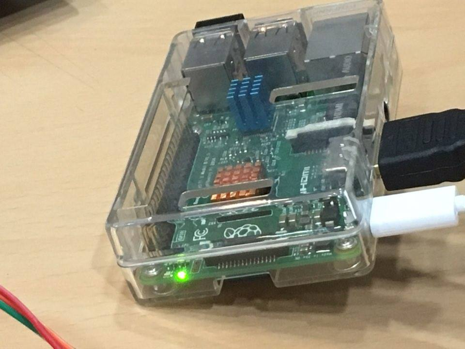

## 서사

안녕하세요, 개발자 양성빈(Robert)입니다. 어느덧 2024년도 절반 이상을 지나고 있습니다. 그래서 지금 시점에 저의 개발자 인생 커리어 회고를 다시금 해볼려고 합니다.

그런데 갑자기? 왜 저의 커리어를 회고하냐고요? 지금 현재 저의 시점이 개발 커리어에 있어서 가장 중요한 시기인것 같고 이렇게 회고함으로 앞으로의 원동력을 얻을 수 있을 것 같아서 저의 회고를 시작해봅니다.

## 대학생, 개발을 처음 접하다.

개발 커리어까지는 아니지만 저의 개발이라는 것을 처음 접한 것은 대학생때였습니다. 한 서울 소재의 전문대학교에 입학한 저는 컴퓨터 전자과라는 학과로 입학을 하게 되었습니다. 컴퓨터에 매우 관심이 있어서 혹은 개발자가 되고 싶어서 이 학과에 입학한 것은 절대 아니였습니다. 저는 문과였고 방송기자가 되는 것이 꿈이였지만 제 꿈이 미치지 못하는 대학입시 성적을 받게 되었고 결국 부모님의 의견에 따라 성적에 맞춰서 진학하게 되었습니다.

해당 학과에 진학해서 개발자의 꿈이 시작되었을까요? 그렇지는 않습니다. 저는 학과 수업은 뒷전이였고 원래 꿈을 찾아가야겠다는 생각에 편입시험 준비를 하게 되었습니다.

그러던 중에 저희 부모님께서는 저의 이런 모습을 좋게 보지는 않으셨습니다. 그리고 아버지께서는 저에게 아래와 같이 말씀을 하셨습니다.

> "어느 상황속에도 포기하지 말고 최선을 다해라! 너가 정말 다른 꿈을 이룰 수 있다면 현재 처한 상황에 대해서도 목표를 잡고 해내봐!"

그런 말씀이 저에게 울림이 크게 다가왔고 중간고사에서 좋은 학점을 받아보자라는 생각을 하게 됩니다. 하지만 이제까지 수업을 듣지 않았던 저는 전공서적을 펼쳤을때 거의 외계어 수준이였고 이해조차 할 수 없었습니다. 하지만 여기서 포기할 수는 없다고 느낀 저는 다른 학교에 재학중인 컴공과 학부생 친구에게 도움을 요청했고 거의 과외식으로 공부를 하게 되었습니다.

이렇게 공부를 하다보니 나름 개발공부가 너무 재밌었고 **몰입** 이라는 것을 처음 느낀 순간 그 쾌감은 아직도 잊을 수 없었습니다. 이렇게 공부를 하게되었고 대학생 첫 중간고사를 4.07/4.5라는 성적을 받게 되었던것 같습니다.

## 인생의 멘토를 만나다.

이렇게 중간고사에서 좋은 성적을 거둔 저는 더욱 개발에 흥미가 느껴졌고 막연히 개발자가 되어야겠다는 꿈을 가진 채 하루하루를 보내었습니다. 그러던 중에 학교에서 멘토링 프로그램을 개설한다고 공고가 올라왔고 저는 해당 프로그램을 호기심에 신청하게 되었습니다. 그리고 여기서 저의 인생의 멘토를 만나게 됩니다. 바로 저희 학교 선배님이십니다. 해당 프로그램에서 저는 개발에 대한 상세한 진로와 알고리즘/자료구조에 대해 상세히 학습을 해보게 되었습니다. 거기서 조금의 절망도 있었지만 나름 공부해나간다는 것, 몰입을 한다는 것이 정말로 행복하고 즐거운 나날들이였습니다. 그리고 해당 프로그램이 종료 시점이 될 즘에 저는 그 선배에게 개인적으로 모르는 부분을 여쭤봐도 괜찮냐고 말씀을 드렸고 그 선배는 흔쾌히 승낙을 하셨습니다. 그리고 저는 혼자 공부를 하면서 모르는 것들을 많이 질문을 했으며 좀 더 개발자가 되어야한다는 꿈을 확고 시킨 것 같습니다.

> 아직도 그 선배와 연락을 하고 지내며, 아직도 모르는 부분들에 대해 물어보기도 합니다.

## 다양한 활동

이렇게 막연히 개발자가 되어야 한다는 꿈을 가진 저는 여러 활동을 해보기로 결정합니다. 대표적인 예시로는 [우분투 커뮤니티](https://ubuntu-kr.org/)에서 주최하는 라즈베리파이 스터디 프로그램이 있었는데 그 프로그램을 앞 전에 언급드린 선배와 같이 참여하게 됩니다. 하지만 처음 스터디 모임에서 매우 많은 어려움을 느꼈지만 다른 분들이 하시는 것을 보는것 만으로 많은 만족감을 가지게 되며 좀 더 열심히 해봐야겠다고 생각을 하게 됩니다.

## DBA

그렇게 개발자의 꿈을 가지며 학기 수업을 듣던 중 유독 몰입감과 도파민이 급상승 되는 수업을 듣게 되었습니다. 바로 데이터베이스라는 수업이였습니다. 기존 배웠던 프로그래밍언어들과 다르게 뭔가 다른 방식으로 하는 것을 보고 엄청 신기하게 느껴졌습니다. 또한 모델링을 통해 내가 테이블들을 설계하고 해당 설계에 따라 쿼리문들을 작성해보고 데이터를 조합해보고 여러가지 실습을 통해 해당 관련 직군으로 진로를 설정해보면 좋을 것 같다는 생각을 하게 되었습니다. 그래서 해당 관련 직군을 찾아본 결과 DBA라는 직군을 찾게 되었고 해당 진로를 결정한 채 군입대를 하게 됩니다. 😭

## 전역 후, 새로운 꿈

그렇게 무사히 군복무를 다 하고 복학을 하였고 DBA라는 꿈을 위해 SQL을 다시 공부하려는 시점에 엄청난 사건이 일어났습니다. 바로 저의 뇌 메모리가 초기화가 되어서 막막해진 상태였습니다. 그렇게 다시 공부하자는 생각으로 공부를 하려는 순간, 또 하나의 직군에 매몰되게 되었습니다. 바로 백엔드 엔지니어였습니다. 그 직군에 매몰된 계기는 아래와 같습니다.

바로 웹프로그래밍I, 웹프로그래밍II 수업에서 servlet과 spring이라는 것을 배우게 되었고 데이터베이스에 공부했을때의 몰입감과 도파민만큼이나 상승되었고 관련 공부를 개인적으로 해보기로 결정하게 됩니다.

## 첫 취업

그렇게 여러 강의 플랫폼들을 돌아다니며 필요한 강의들을 구매하여 학습을 하게 되었고 그렇게 저는 첫 취업을 하게 됩니다. 하지만 제가 바라던 백엔드 엔지니어가 아닌 프론트엔드 엔지니어로 교수님 추천을 받아 조기취업을 하게 됩니다. 사실 백엔드 직군이 아니기에 조금 실망감도 있었고 해당 커리어를 망치는 길이 아닌가 싶었지만 원영적 사고로 "프론트엔드 기술의 경험을 쌓을 수 있는 기회니, 완전 럭키비키잖아!"라는 생각을 하게 되었고 해당 업무에 충실히 해보게 되었습니다.

## 다양한 경험

현업을 하면서 프론트엔드에 대해 다양한 경험을 많이 할 수 있었습니다. 또한 제가 하고 싶어하는 백엔드 업무 또한 회사 백오피스 및 R&D개발에서 사용을 해보고 첫 배포도 해보는 등 정말 좋은 경험이였습니다. 또한 해당 현업을 하면서 다른 개발자분들은 어떻게 공부를 해가고 어떻게 네트워킹을 하는지 궁금하게 되었으며 이곳저곳 다양한 커뮤니티를 찾아보게 되었습니다. 그리고 결국 다양한 오픈채팅방들을 찾게 되었고 현재도 참여중이며 다양한 네트워킹 및 지식들을 줍줍하고 있는 중입니다!

> 📤 현재 제가 참여하고 있는 오픈채팅방 링크 공유
>
> 1. [개발바닥 1사로](https://open.kakao.com/o/gJx6CEMd) (현재 정원이 가득 찬걸로 판명...)
> 2. [위클리 아카데미](https://open.kakao.com/o/gyvuT5Yd)
> 3. [유쾌한 스프링방](https://open.kakao.com/o/gPjtvkfe) (현재 정원 제한이 걸린걸로 알고 있습니다.)
> 4. [AWS의 모든 것](https://open.kakao.com/o/gNSUnzob)
> 5. [Real MySQL](https://open.kakao.com/o/gx274hbe)
> 6. [개발의 터전](https://open.kakao.com/o/goXNMFBg)

또한 오프라인으로도 많은 활동을 하게 되었습니다. Google I/O, 인프콘, 유스콘등등 다양한 개발자 행사에 참여를 하게 되었습니다. 그런 행사에서 다양한 직무에서 일하고 계신 현업자분들과 네트워킹을 하면서 다양한 경험과 지식들을 들으며 제가 본받고 싶은 부분들에 대해서는 메모를 해두었다가 실천을 하려고 노력하고 있습니다.

추가적으로 다양한 교육에도 참여를 진행해보려고 노력했습니다. 얼마전 인프런에서 주최한 워밍업 스터디 클럽에 참여를 하게 되었고 운영진 수상까지 받게 되었습니다.

## 마무리

지금까지 저의 이야기를 두서없이 풀어쓴 것 같아서 읽으시는 분들께 조금은 죄송하게 느껴집니다.

결론을 지어보면 내가 개발자의 커리어를 시작한 이유는 단순한 **몰입** 이였습니다. 그 몰입이 지금까지의 커리어로 만들어준 계기가 된 것 같습니다.

앞으로 이 몰입하는 즐거움을 통해 더욱 성장하는 개발자가 되도록 노력해보겠습니다.

지금까지 저의 글을 읽어주신 분들께 다시 한번 감사 인사를 올리며 글을 마쳐봅니다.

> 많은 피드백을 주시면 수정 및 업데이트를 진행할 예정이니, 많은 의견 부탁드립니다.
