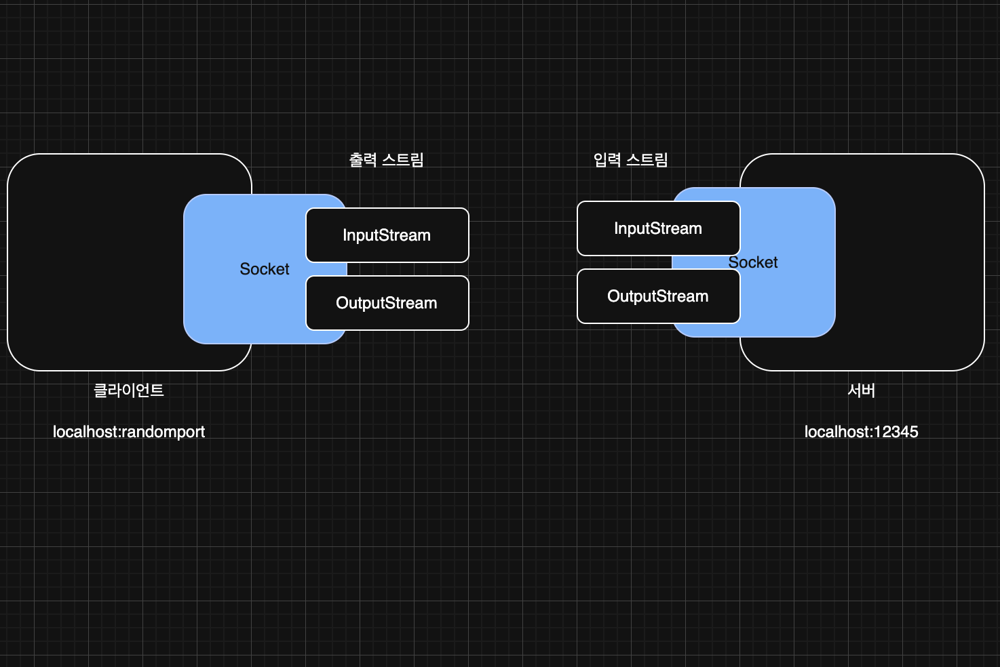
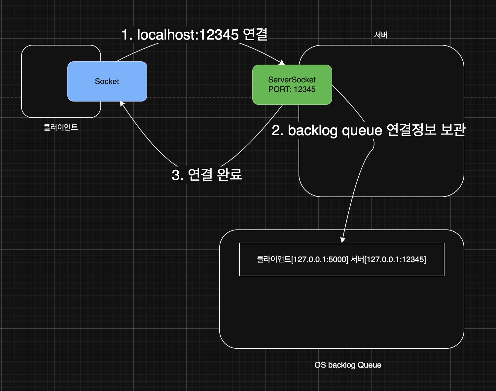
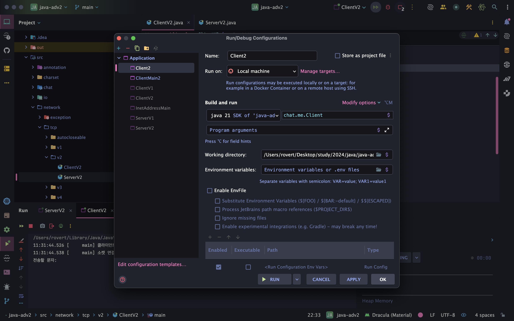
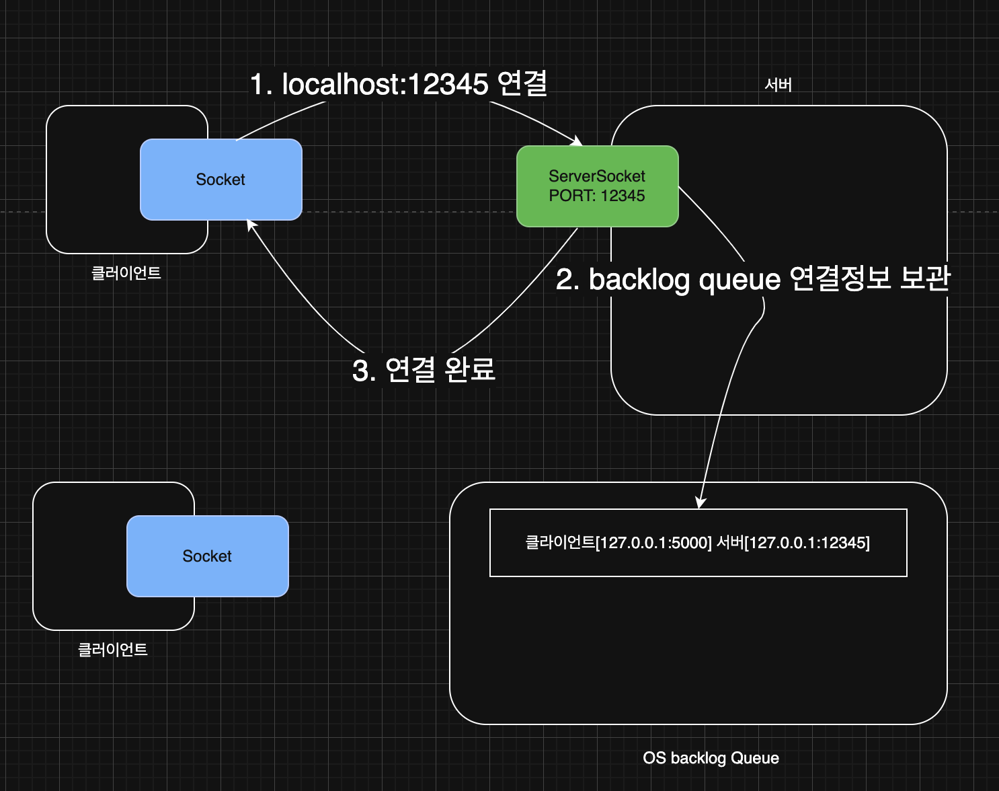
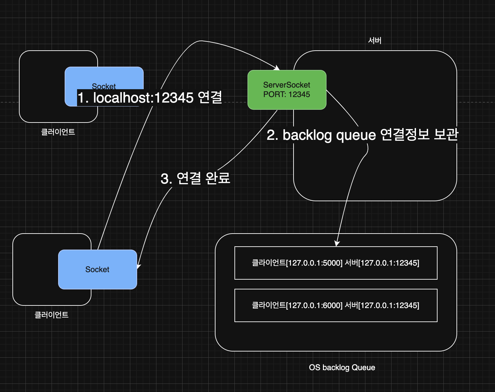
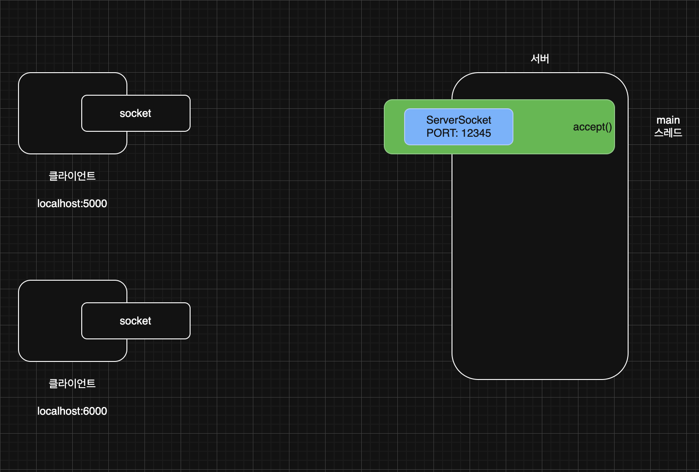
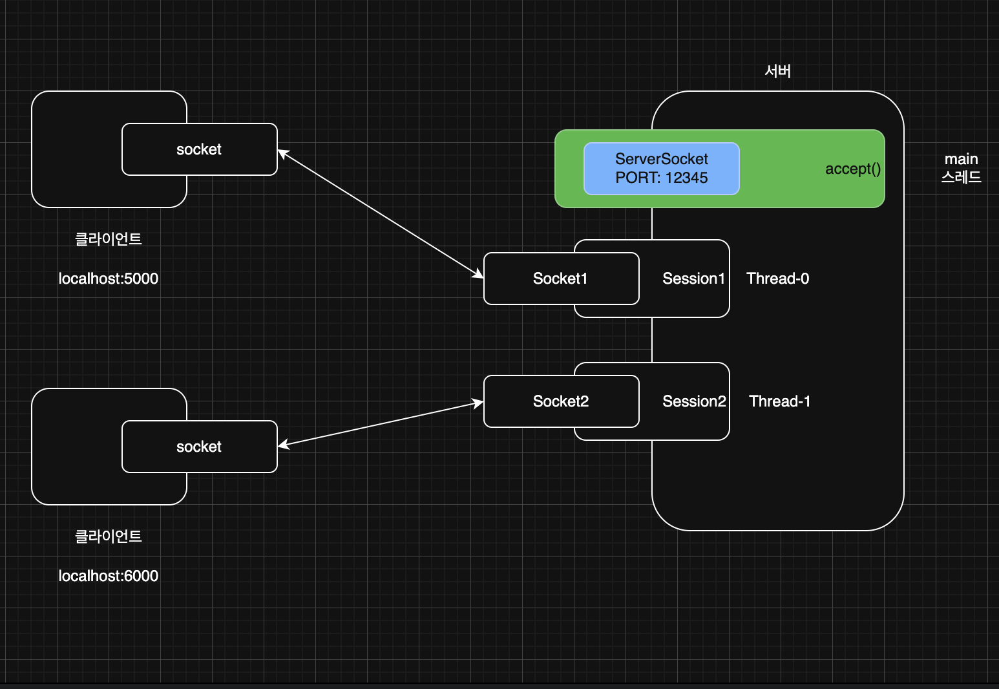

> 해당 블로그 글은 [영한님의 인프런 강의](https://inf.run/vskmA)를 바탕으로 쓰여진 글입니다.

## 네트워크 프로그램1 - 예제

이번에는 간단한 네트워크 프로그램을 만들면서 이론 공부도 같이 해보자. 프로그램은 단순히 클라이언트에서 메세지를 보내면 서버에서 그 메세지에 "World!"라는 문자열을 붙여서 다시 전달하는 단순한 프로그램이다. 그럼 본격적으로 들어가보자.

프로그램 코드를 작성하기 전에 먼저 멀티스레드 포스팅때 사용했던 로그를 사용해보겠다. 나중에 스레드를 여러개 만들고 로그를 찍어보기 위해서 재사용 하는 것이다.

``` java
package util;

import java.time.LocalTime;
import java.time.format.DateTimeFormatter;

public abstract class MyLogger {

    private static final DateTimeFormatter formatter = DateTimeFormatter.ofPattern("HH:mm:ss.SSS");

    public static void log(Object obj) {
        String time = LocalTime.now().format(formatter);
        System.out.printf("%s [%9s] %s\n", time, Thread.currentThread().getName(), obj);
    }
}
```

다음으로 클라이언트 코드를 작성해보자.

``` java
package network.tcp.v1;

import java.io.DataInputStream;
import java.io.DataOutputStream;
import java.io.IOException;
import java.net.Socket;

import static util.MyLogger.log;

public class ClientV1 {

    private static final int PORT = 12345;

    public static void main(String[] args) throws IOException {
        log("클라이언트 시작");

        Socket socket = new Socket("localhost", PORT);
        DataInputStream input = new DataInputStream(socket.getInputStream());
        DataOutputStream output = new DataOutputStream(socket.getOutputStream());

        log("소켓 연결: " + socket);

        String toSend = "Hello";
        output.writeUTF(toSend);
        log("client -> server: " + toSend);

        String received = input.readUTF();
        log("client <- server: " + received);

        log("연결 종료: " + socket);
        input.close();
        output.close();
        socket.close();
    }
}
```

서버와 연결을 진행하려면 `Socket`이라는 클래스를 사용해야 한다. 첫번째 인자로 연결할 서버의 주소를 적어주고 두번째 인자로 포트 번호를 적어주면 된다. 이와 같은 이유로 클라이언트를 혼자 실행하면 예외가 발생한다. 그래서 서버 코드가 반드시 필요하다. 이제 서버쪽을 작성해보자.

``` java
package network.tcp.v1;

import java.io.DataInputStream;
import java.io.DataOutputStream;
import java.io.IOException;
import java.net.ServerSocket;
import java.net.Socket;

import static util.MyLogger.log;

public class ServerV1 {

    private static final int PORT = 12345;

    public static void main(String[] args) throws IOException {
        log("서버 시작");
        ServerSocket serverSocket = new ServerSocket(PORT);
        log("서버 소켓 시작 - 리스닝 포트: " + PORT);

        Socket socket = serverSocket.accept();
        log("소켓 연결: " + socket);
        DataInputStream input = new DataInputStream(socket.getInputStream());
        DataOutputStream output = new DataOutputStream(socket.getOutputStream());

        String received = input.readUTF();
        log("client -> server: " + received);

        String toSend = received + " World!";
        output.writeUTF(toSend);
        log("client <- server: " + toSend);

        log("연결 종료: " + socket);
        input.close();
        output.close();
        socket.close();
        serverSocket.close();
    }
}
```

서버를 실행하려면 `ServerSocket`이라는 클래스를 생성하고 인자로 포트번호를 작성해주면 된다. 그리고 `accept`라는 메서드에서 서버는 자기한테 연결되는 클라이언트가 있을 때까지 대기를 한다. 만약 연결이 되면 그 아래의 로직들을 수행하는 것이다.

### localhost

- `localhost`는 현재 사용 중인 컴퓨터 자체를 가리키는 특별한 호스트 이름이다.
  - `google.com`,`naver.com`과 같은 호스트 이름이지만, 자기 자신의 컴퓨터를 뜻하는 이름이다.
- `localhost`는 127.0.0.1이라는 IP로 매핑된다.
- 127.0.0.1은 IP 주소 체계에서 루프백 주소(loopback address)로 지정된 특별한 IP 주소이다. 이 주소는 컴퓨터가 스스로를 가리킬 때 사용되며, "localhost"와 동일하게 취급된다.
- 127.0.0.1은 컴퓨터가 네트워크 인터페이스를 통해 외부로 나가지 않고, 자신에게 직접 네트워크 패킷을 보낼 수 있도록 한다.

> ⚠️ 주의
>
> 만약 `localhost` 가 잘 되지 않는다면, 자신의 PC의 운영체제에 `localhost`가 127.0.0.1로 매핑되어 있지 않은 문제이다. 이 경우 `localhost` 대신에 127.0.0.1을 직접 입력하면 된다.

> ⚠️ 주의
>
> 서버를 시작하지 않고, 클라이언트만 실행하면 해당 예외가 발생한다.(`java.net.ConnectException: Connection refused`)

> ⚠️ 주의
>
> - `Exception in thread "main" java.net.BindException: Address already in use`
> - 만약 이런 예외가 발생한다면, 이미 12345라는 포트를 다른 프로세스가 사용하고 있다는 뜻이다. 포트를 다른 숫자로 변경해서 사용하자.
> - 우리가 작성한 서버 프로그램을 아직 종료하지 않은 상태로 다시 실행하는 경우에도 12345 포트를 이미 점유하고 있으므로 같은 예외가 발생할 수 있다.

그럼 이제 위에서 작성한 코드들을 하나씩 분석해보자.

## 네트워크 프로그램1 - 분석

TCP/IP 통신에서는 통신할 대상 서버를 찾을 때 호스트 이름이 아니라, IP 주소가 필요하다. 네트워크 프로그램을 분석하기 전에 먼저 호스트 이름으로 IP를 어떻게 찾는지 확인해보자.

``` java
package network.tcp.v1;

import java.net.InetAddress;
import java.net.UnknownHostException;

public class InetAddressMain {
    public static void main(String[] args) throws UnknownHostException {
        InetAddress localhost = InetAddress.getByName("localhost");
        System.out.println(localhost);

        InetAddress google = InetAddress.getByName("google.com");
        System.out.println(google);
    }
}
```

자바의 `InetAddress` 클래스를 사용하면 호스트 이름으로 대상 IP를 찾을 수 있다. 찾는 과정은 아래와 같다.

- 자바는 `InetAddress.getByName("호스트명")` 메서드를 사용해서 해당하는 IP 주소를 조회한다.
- 이 과정에서 시스템의 호스트 파일을 먼저 확인한다.
  - `/etc/hosts` (리눅스, mac)
  - `C:\Windows\System32\drivers\etc\hosts` (윈도우,Windows)
- 호스트 파일에 정의되어 있지 않다면, DNS 서버에 요청해서 IP 주소를 얻는다.

### 클라이언트 코드 분석

클라이언트와 서버 연결은 `Socket`을 이용한다.

``` java
Socket socket = new Socket("localhost", PORT);
```

- `localhost`를 통해 자신의 컴퓨터에 있는 12345 포트에 TCP 접속을 시도한다.
  - `localhost`는 IP가 아니므로 해당하는 IP를 먼저 찾는다. 내부에서 `InetAddress`를 사용한다.
  - `localhost`는 127.0.0.1이라는 IP에 매핑되어 있다.
  - `127.0.0.1:12345`에 TCP 접속을 시도한다.
- 연결이 성공적으로 완료되면 `Socket` 객체를 반환한다.
- `Socket`은 서버와 연결되어 있는 연결점이라고 생각하면 된다.
- `Socket` 객체를 통해서 서버와 통신할 수 있다.

클라이언트와 서버의 데이터 통신은 소켓 사이에 스트림을 통하여 진행을 한다.



``` java
DataInputStream input = new DataInputStream(socket.getInputStream());
DataOutputStream output = new DataOutputStream(socket.getOutputStream());
```

- `Socket`은 서버와 데이터를 주고 받기 위한 스트림을 제공한다.
- `InputStream` : 서버에서 전달한 데이터를 클라이언트가 받을 때 사용한다.
- `OutputStream` : 클라이언트에서 서버에 데이터를 전달할 때 사용한다.
- `InputStream` , `OutputStream` 을 그대로 사용하면 모든 데이터를 byte로 변환해서 전달해야 하기 때문에 번거롭다. 여기서는 `DataInputStream`,`DataOutputStream`이라는 보조 스트림을 사용해서, 자바 타입의 메시지를 편리하게 주고 받을 수 있도록 했다.

지금까지 클라이언트 코드의 핵심부분을 살펴보았다. 나머지는 이전 스트림 시간에 살펴보았고 자원정리도 `close()` 메서드를 호출하여 정리한다는 사실도 이제는 알 것이다. 그럼 다음으로 서버 코드를 분석해보자.

### 서버 코드 분석

서버는 특정 포트를 열어두어야 한다. 그래야 클라이언트가 해당 포트를 지정해서 접속할 수 있다.

``` java
ServerSocket serverSocket = new ServerSocket(PORT);
```

- 서버는 서버 소켓(`ServerSocket`)이라는 특별한 소켓을 사용한다.
- 지정한 포트를 사용해서 서버 소켓을 생성하면, 클라이언트는 해당 포트로 서버에 연결할 수 있다.



- 서버가 12345 포트로 서버 소켓을 열어둔다. 클라이언트는 이제 12345 포트로 서버에 접속할 수 있다.
- 클라이언트가 12345 포트에 연결을 시도한다.
- 이때 OS 계층에서 TCP 3 way handshake가 발생하고, TCP 연결이 완료된다.
- TCP 연결이 완료되면 서버는 OS backlog queue라는 곳에 클라이언트와 서버의 TCP 연결 정보를 보관한다.
  - 이 연결 정보를 보면 클라이언트의 IP, PORT, 서버의 IP, PORT 정보가 모두 들어있다.

TCP 연결시에는 클라이언트 서버 모두 IP, 포트 정보가 필요하다. 그런데 생각해보면 클라이언트 자신의 포트를 지정한 적이 없다. 서버의 경우 포트가 명확하게 지정되어 있어야 한다. 그래야 클라이언트에서 서버에 어떤 포트에 접속할지 알 수 있다. 반면에 서버에 접속하는 클라이언트의 경우에는 자신의 포트가 명확하게 지정되어 있지 않아도 된다. 클라이언트는 보통 포트를 생략하는데, 생략할 경우 클라이언트 PC에 남아 있는 포트 중 하나가 랜덤으로 할당된다. 참고로 클라이언트의 포트도 명시적으로 할당할 수는 있지만 잘 사용하지 않는다.

``` java
Socket socket = serverSocket.accept();
```

- 서버 소켓은 단지 클라이언트와 서버의 TCP 연결만 지원하는 특별한 소켓이다.
- 실제 클라이언트와 서버가 정보를 주고 받으려면 `Socket` 객체가 필요하다. (서버 소켓이 아니다! 소켓이다!)
- `serverSocket.accept()` 메서드를 호출하면 TCP 연결 정보를 기반으로, `Socket` 객체를 만들어서 반환한다.

즉, `ServerSocket`이 `accept()` 메서드를 호출하면 backlog queue에 TCP 연결 정보를 조회하고 만약 TCP 연결정보가 없다면 연결정보가 생성될 때까지 대기한다.(블로킹) 해당 정보를 기반으로 `Socket`객체를 생성하고 사용된 TCP정보는 backlog queue에서 제거된다.

이제 프로그램 분석은 끝났다. 하지만 현재 프로그램에는 작은 문제가 하나 있다. 이 프로그램은 메시지를 하나만 주고 받으면 클라이언트와 서버가 모두 종료된다. 메시지를 계속 주고 받고, 원할 때 종료할 수 있도록 변경해보자.

## 네트워크 프로그램2 - 예제

이번에는 클라이언트에 "Hello" 문자 이외에 사용자가 입력한 문자를 서버에게 보내고 "exit"라고 보내면 종료되게끔 작성해보자.

``` java
package network.tcp.v2;

import java.io.DataInputStream;
import java.io.DataOutputStream;
import java.io.IOException;
import java.net.Socket;
import java.util.Scanner;

import static util.MyLogger.log;

public class ClientV2 {

    private static final int PORT = 12345;

    public static void main(String[] args) throws IOException {
        log("클라이언트 시작");

        Socket socket = new Socket("localhost", PORT);
        DataInputStream input = new DataInputStream(socket.getInputStream());
        DataOutputStream output = new DataOutputStream(socket.getOutputStream());

        log("소켓 연결: " + socket);

        Scanner scanner = new Scanner(System.in);

        while (true) {
            System.out.print("전송할 문자: ");
            String toSend = scanner.nextLine();

            output.writeUTF(toSend);
            log("client -> server: " + toSend);

            if (toSend.equals("exit")) {
                break;
            }

            String received = input.readUTF();
            log("client <- server: " + received);
        }

        log("연결 종료: " + socket);
        input.close();
        output.close();
        socket.close();
        scanner.close();
    }
}
```

클라이언트와 서버간 메세지를 주고받으려면 단순히 `while`문과 같은 반복문을 계속 돌려주면 된다. 그리고 입력한 문자가 "exit"일때는 반복문을 빠져나가게끔 변경하면 된다.

``` java
package network.tcp.v2;

import java.io.DataInputStream;
import java.io.DataOutputStream;
import java.io.IOException;
import java.net.ServerSocket;
import java.net.Socket;

import static util.MyLogger.log;

public class ServerV2 {

    private static final int PORT = 12345;

    public static void main(String[] args) throws IOException {
        log("서버 시작");
        ServerSocket serverSocket = new ServerSocket(PORT);
        log("서버 소켓 시작 - 리스닝 포트: " + PORT);

        Socket socket = serverSocket.accept();
        log("소켓 연결: " + socket);
        DataInputStream input = new DataInputStream(socket.getInputStream());
        DataOutputStream output = new DataOutputStream(socket.getOutputStream());

        while (true) {
            String received = input.readUTF();
            log("client -> server: " + received);

            if (received.equals("exit")) {
                break;
            }

            String toSend = received + " World!";
            output.writeUTF(toSend);
            log("client <- server: " + toSend);
        }

        log("연결 종료: " + socket);
        input.close();
        output.close();
        socket.close();
        serverSocket.close();
    }
}
```

서버도 클라이언트와 유사하다. 그런데 위의 코드에는 문제가 존재한다. 서버는 하나의 클라이언트가 아니라, 여러 클라이언트의 연결을 처리할 수 있어야 한다. 여러 클라이언트가 하나의 서버에 접속해서 실행하면 두번째로 연결된 클라이언트는 데이터를 처음에 보낸 이후로 계속 대기상태에 빠진다. 그리고 서버는 두번째 클라이언트가 보낸 메세지를 받지를 못하는 문제가 있다.

참고로, 인텔리제이에서 클라이언트를 하나 더 실행하려면 `Edit Configuration`에 가서 아래와 같이 클라이언트 앱을 추가해서 실행하면 된다.



그럼 코드를 자세히 분석해보자.

## 네트워크 프로그램2 - 분석



- 서버는 12345 서버 소켓을 열어둔다.
- 50000번 랜덤 포트를 사용하는 클라이언트가 먼저 12345 포트의 서버에 접속을 시도한다.
- 이때 OS 계층에서 TCP 3 way handshake가 발생하고, TCP 연결이 완료된다.
- TCP 연결이 완료되면 서버는 OS backlog queue라는 곳에 클라이언트와 서버의 TCP 연결 정보를 보관한다.

여기서 중요한 점이 있는데, 이 시점에 TCP 3 way handshake가 완료되었기 때문에, 클라이언트와 서버의 TCP 연결은 이미 완료되고, 클라이언트의 소켓 객체도 정상 생성된다. 참고로 이 시점에 아직 서버의 소켓 객체(서버 소켓 아님)는 생성되지 않았다.



이번에는 60000번 랜덤 포트를 사용하는 클라이언트가 12345 포트의 서버에 접속을 시도하고 연결을 완료한다. 50000번 클라이언트와 60000번 클라이언트 모두 서버와 연결이 완료되었고, 클라이언트의 소켓도 정상 생성된다.

여기서 서버와 클라이언트가 데이터를 주고 받으려면 `Socket` 객체가 존재해야 한다. `ServerSocket.accpet()` 메서드를 호출하면 backlog 큐의 정보를 기반으로 소켓 객체를 하나 생성한다. backlog 큐는 말 그대로 큐이기 때문에 먼저 들어온 TCP 정보를 꺼낸다. 맨 처음에는 클라이언트 포트가 5000번인 정보를 꺼내고 첫번째 클라이언트와 데이터를 주고 받는 `Socket` 객체를 생성한다.

두번째 클라이언트는 데이터를 보낼 때 이미 TCP 연결이 완료되었으므로 데이터를 서버쪽으로 전송은 할 수 있다. 하지만 `ServerSocket`에서는 두번째 클라이언트와 데이터를 주고 받을 `Socket` 객체가 없기 때문에 데이터를 주고받지 못하는 상황이 오는 것이다.

즉, 클라이언트가 데이터를 보낼 때 어플리케이션 레이어에서 TCP 송신 버퍼로 내려오고 세그먼트화, 패킷화를 한 이후에 서버쪽으로 전달한다. 그럼 서버쪽에서는 NIC를 타서 TCP 수신 버퍼에 쌓인다. 그리고 `ServerSocket.accept()`를 호출할 때 수신 버퍼에 데이터를 하나 가져오는 것으로 이해하면 쉽다. 그런데 두번째 클라이언트의 정보를 기반으로 `ServerSocket.accept()`를 호출하지 않았기에 계속 수신버퍼에서 대기를 하는 것이다.

여기서 핵심적인 내용이 있는데, 소켓 객체 없이 서버 소켓만으로도 TCP 연결은 완료된다는 점이다. 하지만 연결 이후에 서로 메시지를 주고 받으러면 소켓 객체가 필요하다. 즉, 여기서 알 수 있는 사실은 TCP연결은 착각이라는 사실이다.

### 현재 코드의 문제점

- 새로운 클라이언트가 접속하면?
  - 새로운 클라이언트가 접속했을 때 서버의 `main` 스레드는 `accept()` 메서드를 절대로 호출할 수 없다! 왜냐하면 `while` 문으로 기존 클라이언트와 메시지를 주고 받는 부분만 반복하기 때문이다.
  - `accept()`를 호출해야 소켓 객체를 생성하고 클라이언트와 메시지를 주고 받을 수 있다.
- 2개의 블로킹 작업 - 핵심은 별도의 스레드가 필요하다!
  - `accept()` : 클라이언트와 서버의 연결을 처리하기 위해 대기
  - `readXxx()` : 클라이언트의 메시지를 받아서 처리하기 위해 대기
  - 각각의 블로킹 작업은 별도의 스레드에서 처리해야 한다. 그렇지 않으면 다른 블로킹 메서드 때문에 계속 대기할 수 있다.

## 네트워크 프로그램3



- 서버의 `main` 스레드는 서버 소켓을 생성하고, 서버 소켓의 `accept()`를 반복해서 호출해야 한다.


- 클라이언트가 서버에 접속하면 서버 소켓의 `accept()` 메서드가 `Socket`을 반환한다.
- `main` 스레드는 이 정보를 기반으로 `Runnable`을 구현한 `Session`이라는 별도의 객체를 만들고, 새로운 스레드에서 이 객체를 실행한다. 여기서는 `Thread-0`이 `Session`을 실행한다.
- `Session` 객체와 `Thread-0`은 연결된 클라이언트와 메시지를 주고 받는다.



- 새로운 TCP 연결이 발생하면 `main` 스레드는 새로운 `Session` 객체를 별도의 스레드에서 실행한다. 그리고 이 과정을 반복한다.
- `Session` 객체와 `Thread-1` 은 연결된 클라이언트와 메시지를 주고 받는다.

즉, `main` 스레드는 새로운 연결이 있을 때마다 `Session` 객체를 별도의 스레드로 생성하여 실행시키는 역할을 한다. 그리고 `Session` 객체는 실제 클라이언트와 데이터를 송수신 하는 역할을 진행한다. 그럼 이 로직을 코드로 작성해보자.

클라이언트 코드는 기존과 동일하다. `Session`과 서버쪽 코드만 수정해보겠다.

``` java
package network.tcp.v3;

import java.io.DataInputStream;
import java.io.DataOutputStream;
import java.io.IOException;
import java.net.Socket;

import static util.MyLogger.log;

public class SessionV3 implements Runnable {

    private final Socket socket;

    public SessionV3(Socket socket) {
        this.socket = socket;
    }

    @Override
    public void run() {
        try {
            DataInputStream input = new DataInputStream(socket.getInputStream());
            DataOutputStream output = new DataOutputStream(socket.getOutputStream());

            while (true) {
                String received = input.readUTF();
                log("client -> server: " + received);

                if (received.equals("exit")) {
                    break;
                }

                String toSend = received + " World!";
                output.writeUTF(toSend);
                log("client <- server: " + toSend);
            }

            log("연결 종료: " + socket);
            input.close();
            output.close();
            socket.close();
        } catch (IOException e) {
            throw new RuntimeException(e);
        }
    }
}
```

``` java
package network.tcp.v3;

import java.io.IOException;
import java.net.ServerSocket;
import java.net.Socket;

import static util.MyLogger.log;

public class ServerV3 {

    private static final int PORT = 12345;

    public static void main(String[] args) throws IOException {
        log("서버 시작");
        ServerSocket serverSocket = new ServerSocket(PORT);
        log("서버 소켓 시작 - 리스닝 포트: " + PORT);

        while (true) {
            Socket socket = serverSocket.accept();
            log("소켓 연결: " + socket);

            SessionV3 session = new SessionV3(socket);
            Thread thread = new Thread(session);
            thread.start();
        }
    }
}
```

이제 정말 잘 작성된 네트워크 프로그램인것 같다. 하지만 여전히 문제가 존재한다. 만약 강제로 클라이언트를 종료시켜보자.

클라이언트의 연결을 직접 종료하면 클라이언트 프로세스가 종료되면서, 클라이언트와 서버의 TCP 연결도 함께 종료된다. 이때 서버에서 `readUTF()`로 클라이언트가 메시지를 읽으려고 하면 `EOFException`이 발생한다. 소켓의 TCP 연결이 종료되었기 때문에 더는 읽을 수 있는 메시지가 없다는 뜻이다. EOF(파일의 끝)가 여기서는 전송의 끝이라는 뜻이다. 그런데 여기서 심각한 문제가 하나 있다. 이렇게 예외가 발생해버리면 서버에서 자원 정리 코드를 호출하지 못한다는 점이다. 서버 로그를 보면 연결 종료 로그가 없는 것을 확인할 수 있다.

### 윈도우 OS 추가

참고로 윈도우의 경우 `java.io.EOFException` 이 아니라 `java.net.SocketException: Connection reset`이 발생한다. 둘의 차이가 발생하는 이유는 다음과 같다. 클라이언트의 연결을 직접 종료하면 클라이언트 프로세스가 종료되면서, 클라이언트와 서버의 TCP 연결도 함께 종료된다. 이때 소켓을 정상적으로 닫지 않고 프로그램을 종료했기 때문에 각각의 OS는 남아있는 TCP 연결을 정리하려고 시도한다. 이때 MAC과 윈도우 OS의 TCP 연결 정리 방식이 다르다.

- 맥: TCP 연결 정상 종료
- 윈도우: TCP 연결 강제 종료

결론적으로 자바 객체는 GC가 되지만 자바 외부의 자원은 자동으로 GC가 되는게 아니다. 따라서 꼭! 정리를 해주어야 한다.

## 자원 정리1

위의 네트워크 프로그래밍에서는 강제종료 시, 자원정리가 제대로 되지를 못했다. 예외가 터지더라도 자원 정리는 반드시 필요하다. 그래서 자원 정리를 프로그램에 적용하기 전에, 간단한 예제로 자원정리를 이해해보고 시작해보자.

``` java
package network.tcp.autocloseable;

public class CallException extends Exception {
    public CallException(String message) {
        super(message);
    }
}
```

``` java
package network.tcp.autocloseable;

public class CloseException extends Exception {
    public CloseException(String message) {
        super(message);
    }
}
```

위와 같이 호출할 때 터질 수 있는 예외와 닫을때 터질 수 있는 예외를 정의하였다. 이제 로직을 작성해보자.

``` java
package network.tcp.autocloseable;

public class ResourceV1 {

    private String name;

    public ResourceV1(String name) {
        this.name = name;
    }

    public void call() {
        System.out.println(name + " call");
    }

    public void callEx() throws CallException {
        System.out.println(name + " callEx");
        throw new CallException(name + " ex");
    }

    public void close() {
        System.out.println(name + " close");
    }

    public void closeEx() throws CloseException {
        System.out.println(name + " closeEx");
        throw new CloseException(name + " ex");
    }
}
```

호출할 때나 닫을 때 정상 로직 메서드와 예외가 터지는 메서드를 2개씩 정의하였다. 이제 이를 사용하는 코드를 작성해보자.

``` java
package network.tcp.autocloseable;

public class ResourceCloseMainV1 {
    public static void main(String[] args) {
        try {
            logic();
        } catch (CallException e) {
            System.out.println("CallException 예외처리");
            e.printStackTrace();
        } catch (CloseException e) {
            System.out.println("CloseException 에외처리");
            e.printStackTrace();
        }
    }

    private static void logic() throws CallException, CloseException {
        ResourceV1 resource1 = new ResourceV1("resource1");
        ResourceV1 resource2 = new ResourceV1("resource2");

        resource1.call();
        resource2.callEx();

        System.out.println("자원 정리");
        resource2.closeEx();
        resource1.closeEx();
    }
}
```

지금 코드에서 실행을 해보면 `resource2`에서 호출할 때 예외가 터져서 자원 정리를 수행하지 못하였다. 이를 어떻게 해결할까?

## 자원 정리2

그럼 이제 예외가 발생해도 자원을 정리시켜보자.

``` java
package network.tcp.autocloseable;

public class ResourceCloseMainV2 {
    public static void main(String[] args) {
        try {
            logic();
        } catch (CallException e) {
            System.out.println("CallException 예외처리");
            e.printStackTrace();
        } catch (CloseException e) {
            System.out.println("CloseException 에외처리");
            e.printStackTrace();
        }
    }

    private static void logic() throws CallException, CloseException {
        ResourceV1 resource1 = null;
        ResourceV1 resource2 = null;

        try {
            resource1 = new ResourceV1("resource1");
            resource2 = new ResourceV1("resource2");

            resource1.call();
            resource2.callEx();
        } catch (CallException e) {
            System.out.println("ex: " + e);
            throw e;
        } finally {
            if (resource2 != null) {
                resource2.closeEx();
            }

            if (resource1 != null) {
                resource1.closeEx();
            }
        }
    }
}
```

이 코드에는 그래도 몇가지 문제가 존재한다.

### null 체크

이번에는 `finally` 코드 블록을 사용해서 자원을 닫는 코드가 항상 호출되도록 했다. 만약 `resource2` 객체를 생성하기 전에 예외가 발생하면 `resource2`는 `null`이 된다. 따라서 `null` 체크를 해야한다. `resource1`의 경우에도 `resource1`을 생성하는 중에 예외가 발생한다면 `null` 체크가 필요하다.

### 자원 정리 중에 예외 발생

`finally` 코드 블록은 항상 호출되기 때문에 자원이 잘 정리될 것 같지만, 이번에는 자원을 정리하는 중에 `finally` 코드 블록 안에서`resource2.closeEx()`를 호출하면서 예외가 발생한다. 결과적으로 `resource1.closeEx()`는 호출되지 않는다.

### 핵심 예외가 발생하는 문제

이 코드에서 발생한 핵심적인 예외는 `CallException` 이다. 이 예외 때문에 문제가 된 것이다. 그런데 `finally` 코드 블록에서 자원을 정리하면서 `CloseException` 예외가 추가로 발생했다. 예외 때문에 자원을 정리하고 있는데, 자원 정리중에 또 예외가 발생한 것이다. 이 경우 `logic()`을 호출한 쪽에서는 핵심 예외인 `CallException`이 아니라 `finally` 블록에서 새로 생성된 `CloseException`을 받게 된다. 핵심 예외가 사라진 것이다! 개발자가 원하는 예외는 당연히 핵심 예외다. 이 핵심 예외를 확인해야 제대로 된 문제를 찾을 수 있다. 자원을 닫는 중에 발생한 예외는 부가 예외일 뿐이다.

그럼 이런 문제를 어떻게 해결할까?

## 자원 정리3

이번에는 자원 정리의 코드에서 try-catch를 사용해서 자원 정리 중에 발생하는 예외를 잡아서 처리해보자.

``` java
package network.tcp.autocloseable;

public class ResourceCloseMainV3 {
    public static void main(String[] args) {
        try {
            logic();
        } catch (CallException e) {
            System.out.println("CallException 예외처리");
            e.printStackTrace();
        } catch (CloseException e) {
            System.out.println("CloseException 에외처리");
            e.printStackTrace();
        }
    }

    private static void logic() throws CallException, CloseException {
        ResourceV1 resource1 = null;
        ResourceV1 resource2 = null;

        try {
            resource1 = new ResourceV1("resource1");
            resource2 = new ResourceV1("resource2");

            resource1.call();
            resource2.callEx();
        } catch (CallException e) {
            System.out.println("ex: " + e);
            throw e;
        } finally {
            if (resource2 != null) {
                try {
                    resource2.closeEx();
                } catch (CloseException e) {
                    System.out.println("close ex: " + e);
                }
            }

            if (resource1 != null) {
                try {
                    resource1.closeEx();
                } catch (CloseException e) {
                    System.out.println("close ex: " + e);
                }
            }
        }
    }
}
```

- `finally` 블럭에서 각각의 자원을 닫을 때도, 예외가 발생하면 예외를 잡아서 처리하도록 했다.
- 이렇게 하면 자원 정리 시점에 예외가 발생해도, 다음 자원을 닫을 수 있다.
- 자원 정리 시점에 발생한 예외를 잡아서 처리했기 때문에, 자원 정리 시점에 발생한 부가 예외가 핵심 예외를 가리지 않는다.
- 자원 정리 시점에 발생한 예외는 당장 더 처리할 수 있는 부분이 없다. 이 경우 로그를 남겨서 개발자가 인지할 수 있게 하는 정도면 충분하다. 즉, 핵심 비즈니스 로직에 대한 예외만 처리하는 것이 더 중요한 것이다.

이렇게 모든 문제를 다 해결하였다. 하지만 조금 찜찜한 부분이 존재한다.

- `resource` 변수를 선언하면서 동시에 할당할 수 없음
- `catch` 이후에 `finally` 호출, 자원 정리가 조금 늦어진다.
- 개발자가 실수로 `close()`를 호출하지 않을 가능성
- 개발자가 `close()` 호출 순서를 실수, 보통 자원을 생성한 순서와 반대로 닫아야 함

이런 부분을 어떻게 해결할까?

## 자원 정리4

위의 찜찜한 문제를 `try-with-resources`를 이용하여 해결해보자.

``` java
package network.tcp.autocloseable;

public class ResourceV2 implements AutoCloseable {

    private String name;

    public ResourceV2(String name) {
        this.name = name;
    }

    public void call() {
        System.out.println(name + " call");
    }

    public void callEx() throws CallException {
        System.out.println(name + " callEx");
        throw new CallException(name + " ex");
    }

    @Override
    public void close() throws CloseException {
        System.out.println(name + " close");
        throw new CloseException(name + " ex");
    }
}
```

`try-with-resources`를 사용하려면 일단 해당 자원이 `AutoClosable` 인터페이스를 구현해야 한다. 이제 사용하는 코드를 살펴보자.

``` java
package network.tcp.autocloseable;

public class ResourceCloseMainV4 {
    public static void main(String[] args) {
        try {
            logic();
        } catch (CallException e) {
            System.out.println("CallException 예외처리");
            Throwable[] suppressed = e.getSuppressed();

            for (Throwable throwable : suppressed) {
                System.out.println("suppressedEx = " + throwable);
            }

            e.printStackTrace();
        } catch (CloseException e) {
            System.out.println("CloseException 에외처리");
            e.printStackTrace();
        }
    }

    private static void logic() throws CallException, CloseException {
        try (ResourceV2 resource1 = new ResourceV2("resource1");
             ResourceV2 resource2 = new ResourceV2("resource2")) {
            resource1.call();
            resource2.callEx();
        } catch (CallException e) {
            System.out.println("ex: " + e);
            throw e;
        }
    }
}
```

`try-with-resources`를 통하여 위의 문제들을 전부 해결하였다. 종료중에 예외를 던져도 이 예외는 핵심 예외라 생각하지 않고 부가 예외로 핵심예외에 담아서 보내는 것이다. 또한 자동으로 `close()`를 호출해주는 장점이 있다.

### try-with-resources 장점

- **리소스 누수 방지**: 모든 리소스가 제대로 닫히도록 보장한다. 실수로 `finally` 블록을 적지 않거나, `finally` 블럭 안에서 자원 해제 코드를 누락하는 문제들을 예방할 수 있다.
- **코드 간결성 및 가독성 향상**: 명시적인 `close()` 호출이 필요 없어 코드가 더 간결하고 읽기 쉬워진다.
- **스코프 범위 한정**: 예를 들어 리소스로 사용되는 `resource1,2` 변수의 스코프가 `try` 블럭 안으로 한정된다. 따라서 코드 유지보수가 더 쉬워진다.
- **조금 더 빠른 자원 해제**: 기존에는 try -> catch -> finally로 catch 이후에 자원을 반납했다. try-with-resources구문은 `try` 블럭이 끝나면 즉시 `close()`를 호출한다.
- **자원 정리 순서**: 먼저 선언한 자원을 나중에 정리한다.
- **부가 예외 포함**

### try-with-resources 예외처리와 부가 예외 포함

`try-with-resources`를 사용하는 중에 핵심 로직 예외와 자원을 정리하는 중에 발생하는 부가 예외가 모두 발생하면 어떻게 될까?

- `try-with-resources`는 핵심 예외를 반환한다.
- 부가 예외는 핵심 예외안에 `Suppressed`로 담아서 반환한다.
- 개발자는 자원 정리 중에 발생한 부가 예외를 `e.getSuppressed()`를 통해 활용할 수 있다.

> ✅ 참고
>
> 자바 예외에는 `e.addSuppressed(ex)`라는 메서드가 있어서 예외 안에 참고할 예외를 담아둘 수 있다. 참고로 이 기능도 `try-with-resources`와 함께 등장했다.

> 잘못된 지식이 있을 경우 댓글로 남겨주시면 빠르게 반영하겠습니다!