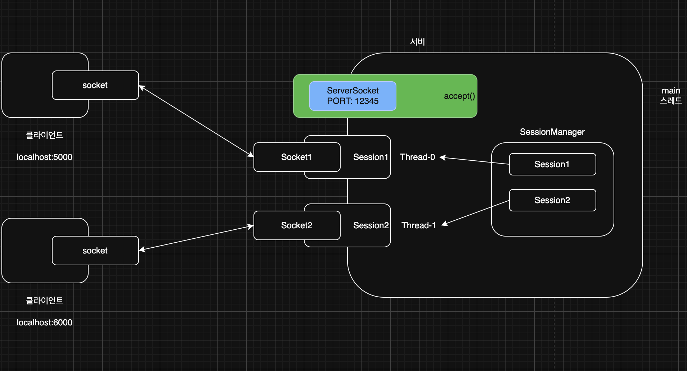
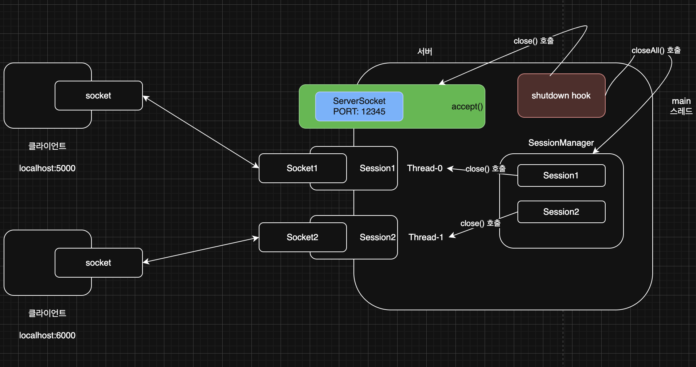

> 해당 블로그 글은 [영한님의 인프런 강의](https://inf.run/vskmA)를 바탕으로 쓰여진 글입니다.

## 네트워크 프로그램4 - 자원 정리1

그러면 기존 네트워크 프로그램에서 `try-catch-finally`로 핵심 예외를 일단 잡아보자! 그 전에 조금 `close` 메서드를 조금 쉽게 사용하기 위해서 유틸을 먼저 만들어보자.

``` java
package network.tcp;

import java.io.IOException;
import java.io.InputStream;
import java.io.OutputStream;
import java.net.Socket;

import static util.MyLogger.log;

public class SocketCloseUtil {

    public static void closeAll(Socket socket, InputStream input, OutputStream output) {
        close(input);
        close(output);
        close(socket);
    }

    public static void close(InputStream input) {
        if (input != null) {
            try {
                input.close();
            } catch (IOException e) {
                log(e.getMessage());
            }
        }
    }

    public static void close(OutputStream output) {
        if (output != null) {
            try {
                output.close();
            } catch (IOException e) {
                log(e.getMessage());
            }
        }
    }

    public static void close(Socket socket) {
        if (socket != null) {
            try {
                socket.close();
            } catch (IOException e) {
                log(e.getMessage());
            }
        }
    }
}
```

이제 클라이언트 코드를 작성해보자.

``` java
package network.tcp.v4;

import java.io.DataInputStream;
import java.io.DataOutputStream;
import java.io.IOException;
import java.net.Socket;
import java.util.Scanner;

import static network.tcp.SocketCloseUtil.closeAll;
import static util.MyLogger.log;

public class ClientV4 {

    private static final int PORT = 12345;

    public static void main(String[] args) throws IOException {
        log("클라이언트 시작");

        Socket socket = null;
        DataInputStream input = null;
        DataOutputStream output = null;

        try {
            socket = new Socket("localhost", PORT);
            input = new DataInputStream(socket.getInputStream());
            output = new DataOutputStream(socket.getOutputStream());
            log("소켓 연결: " + socket);

            Scanner scanner = new Scanner(System.in);

            while (true) {
                System.out.print("전송할 문자: ");
                String toSend = scanner.nextLine();

                output.writeUTF(toSend);
                log("client -> server: " + toSend);

                if (toSend.equals("exit")) {
                    break;
                }

                String received = input.readUTF();
                log("client <- server: " + received);
            }
        } catch (IOException e) {
            log(e);
        } finally {
            closeAll(socket, input, output);
            log("연결 종료: " + socket);
        }
    }
}
```

다음은 `Session` 코드를 수정해보자.

``` java
package network.tcp.v4;

import java.io.DataInputStream;
import java.io.DataOutputStream;
import java.io.IOException;
import java.net.Socket;

import static network.tcp.SocketCloseUtil.closeAll;
import static util.MyLogger.log;

public class SessionV4 implements Runnable {

    private final Socket socket;

    public SessionV4(Socket socket) {
        this.socket = socket;
    }

    @Override
    public void run() {
        DataInputStream input = null;
        DataOutputStream output = null;

        try {
            input = new DataInputStream(socket.getInputStream());
            output = new DataOutputStream(socket.getOutputStream());

            while (true) {
                String received = input.readUTF();
                log("client -> server: " + received);

                if (received.equals("exit")) {
                    break;
                }

                String toSend = received + " World!";
                output.writeUTF(toSend);
                log("client <- server: " + toSend);
            }
        } catch (IOException e) {
            log(e);
        } finally {
            closeAll(socket, input, output);
            log("연결 종료: " + socket);
        }
    }
}
```

서버는 기존 V3와 같다. 이렇게 `try-catch-finally`로 핵심 예외를 잡아서 처리를 해보았다. 하지만 이렇게 보니 코드가 지저분해지며 `Socket`, `InputStream`, `OutputStream`의 변수 스코프가 길어지는 것을 알 수 있다. 이제 그럼 한번 해결해보자.

## 네트워크 프로그램5 - 자원 정리2

이제 `try-with-resources`를 도입해보자. 클라이언트 코드부터 고쳐보자.

``` java
package network.tcp.v5;

import java.io.DataInputStream;
import java.io.DataOutputStream;
import java.io.IOException;
import java.net.Socket;
import java.util.Scanner;

import static util.MyLogger.log;

public class ClientV5 {

    private static final int PORT = 12345;

    public static void main(String[] args) throws IOException {
        log("클라이언트 시작");

        try (Socket socket = new Socket("localhost", PORT);
             DataInputStream input = new DataInputStream(socket.getInputStream());
             DataOutputStream output = new DataOutputStream(socket.getOutputStream())) {
            log("소켓 연결: " + socket);

            Scanner scanner = new Scanner(System.in);

            while (true) {
                System.out.print("전송할 문자: ");
                String toSend = scanner.nextLine();

                output.writeUTF(toSend);
                log("client -> server: " + toSend);

                if (toSend.equals("exit")) {
                    break;
                }

                String received = input.readUTF();
                log("client <- server: " + received);
            }
        } catch (IOException e) {
            log(e);
        }
    }
}
```

`try`블록을 수행 후, 바로 `close()`가 선언한 역순으로 수행된다.

> ✅ 참고
>
> `OutputStream`,`InputStream`,`Socket` 모두 `AutoCloseable`을 구현하고 있다.

이제 `Session`코드를 고쳐보자.

``` java
package network.tcp.v5;

import java.io.DataInputStream;
import java.io.DataOutputStream;
import java.io.IOException;
import java.net.Socket;

import static util.MyLogger.log;

public class SessionV5 implements Runnable {

    private final Socket socket;

    public SessionV5(Socket socket) {
        this.socket = socket;
    }

    @Override
    public void run() {
        try (socket;
             DataInputStream input = new DataInputStream(socket.getInputStream());
             DataOutputStream output = new DataOutputStream(socket.getOutputStream())) {
            while (true) {
                String received = input.readUTF();
                log("client -> server: " + received);

                if (received.equals("exit")) {
                    break;
                }

                String toSend = received + " World!";
                output.writeUTF(toSend);
                log("client <- server: " + toSend);
            }
        } catch (IOException e) {
            log(e);
        }

        log("연결 종료: " + socket + " isClosed: " + socket.isClosed());
    }
}
```

서버코드는 기존과 같다.

## 네트워크 프로그램6 - 자원 정리3

이번에는 서버를 종료할 때, 서버 소켓과 연결된 모든 소켓 자원을 다 반납하고 서버를 안정적으로 종료하는 방법을 알아보자. 서버를 종료하려면 서버에 종료라는 신호를 전달해야 한다. 예를 들어서 서버도 콘솔 창을 통해서 입력을 받도록 만들고, "종료"라는 메시지를 입력하면 모든 자원을 정리하면서 서버가 종료되도록 하면 된다. 하지만 보통 서버에서 콘솔 입력은 잘 하지 않으므로, 이번에는 서버를 직접 종료하면서 자원도 함께 정리하는 방법을 알아보겠다.

### 셧다운 훅

자바는 프로세스가 종료될 때, 자원 정리나 로그 기록과 같은 종료 작업을 마무리 할 수 있는 셧다운 훅이라는 기능을 지원한다.

- 정상 종료
    - 모든 non 데몬 스레드의 실행 완료로 자바 프로세스 정상 종료
    - 사용자가 Ctrl+C를 눌러서 프로그램을 중단
    - `kill` 명령 전달 (`kill -9` 제외)
    - IDE의 stop 버튼
- 강제 종료
    - 운영체제에서 프로세스를 더 이상 유지할 수 없다고 판단할 때 사용
    - 리눅스/유닉스의 `kill -9` 나 Windows의 `taskkill /F`

즉, 정상 종료시, 셧다운 훅이 작동하여 종료를 하고 강제 종료 시, 셧다운 훅이 작동하지 않는다.

그러면 셧다운 훅을 이용하여 정상 종료 로직을 구현해보고 서버 종료시, 자원을 정상적으로 반납 후 종료하는 로직까지 해보겠다.

먼저 클라이언트 코드를 살펴보자. 클라이언트 코드는 기존과 같다.

다음으로 서버는 세션을 관리하는 세션 매니저가 필요하다. 왜냐하면 서버를 종료 시, 서버가 가지고 있는 세션들의 소켓을 종료해야 하는데 세션은 클라이언트가 접속할 때마다 추가로 생성함으로 매번 찾아서 종료를 하기 불편하니 세션이 생성될 때마다 세션 매니저에 등록 후, 해당 매니저를 통해 한번에 종료하는 방법으로 가보려고 하는 것이다.



그럼 위의 그림처럼 코드를 작성해보자.

``` java
package network.tcp.v6;

import java.util.ArrayList;
import java.util.List;

public class SessionManagerV6 {

    private List<SessionV6> sessions = new ArrayList<>();

    public synchronized void add(SessionV6 session) {
        sessions.add(session);
    }

    public synchronized void remove(SessionV6 session) {
        sessions.remove(session);
    }

    public synchronized void closeAll() {
        for (SessionV6 session : sessions) {
            session.close();
        }

        sessions.clear();
    }
}
```

각 세션은 소켓과 연결 스트림을 가지고 있다. 따라서 서버를 종료할 때 사용하는 세션들도 함께 종료해야 한다. 모든 세션들을 찾아서 종료하려면 생성한 세션을 보관하고 관리할 객체가 필요하다. 그래서 위와 같이 작성을 하였다.

- `add()` : 클라이언트의 새로운 연결을 통해, 세션이 새로 만들어지는 경우 `add()`를 호출해서 세션 매니저에 세션을 추가한다.
- `remove()` : 클라이언트의 연결이 끊어지면 세션도 함께 정리된다. 이 경우 `remove()`를 호출해서 세션 매니저에서 세션을 제거한다.
- `closeAll()` : 서버를 종료할 때 사용하는 세션들도 모두 닫고, 정리한다.

또한 각 메서드들은 동시성 문제가 발생할 우려가 있기에 동기화 락을 걸어주었다.

이제 `Session`을 살펴보자.

``` java
package network.tcp.v6;

import java.io.DataInputStream;
import java.io.DataOutputStream;
import java.io.IOException;
import java.net.Socket;

import static network.tcp.SocketCloseUtil.closeAll;
import static util.MyLogger.log;

public class SessionV6 implements Runnable {

    private final Socket socket;

    private final DataInputStream input;

    private final DataOutputStream output;

    private final SessionManagerV6 sessionManager;

    private boolean closed = false;

    public SessionV6(Socket socket, SessionManagerV6 sessionManager) throws IOException {
        this.socket = socket;
        this.input = new DataInputStream(socket.getInputStream());
        this.output = new DataOutputStream(socket.getOutputStream());
        this.sessionManager = sessionManager;
        this.sessionManager.add(this);
    }

    @Override
    public void run() {
        try {
            while (true) {
                String received = input.readUTF();
                log("client -> server: " + received);

                if (received.equals("exit")) {
                    break;
                }

                String toSend = received + " World!";
                output.writeUTF(toSend);
                log("client <- server: " + toSend);
            }
        } catch (IOException e) {
            log(e);
        } finally {
            sessionManager.remove(this);
            close();
        }
    }

    public synchronized void close() {
        if (closed) {
            return;
        }

        closeAll(socket, input, output);
        closed = true;
        log("연결 종료: " + socket);
    }
}
```

아쉽지만 `Session`은 이제 `try-with-resources`를 사용할 수 없다. 왜냐하면 서버를 종료하는 시점에도 `Session`의 자원을 정리해야 하기 때문이다.

`try-with-resources` 는 try 선언부에서 사용한 자원을 try가 끝나는 시점에 정리한다. 따라서 try에서 자원의 선언과 자원 정리를 묶어서 처리할 때 사용할 수 있다. 하지만 지금은 서버를 종료하는 시점에도 `Session` 이 사용하는 자원을 정리해야 한다. 서버를 종료하는 시점에 자원을 정리하는 것은 `Session` 안에 있는 `try-with-resources`를 통해 처리할 수 없다.

## 네트워크 프로그램6 - 자원 정리4

이제 서버쪽을 살펴보자.

``` java
package network.tcp.v6;

import java.io.IOException;
import java.net.ServerSocket;
import java.net.Socket;

import static util.MyLogger.log;

public class ServerV6 {

    private static final int PORT = 12345;

    public static void main(String[] args) throws IOException {
        log("서버 시작");
        SessionManagerV6 sessionManager = new SessionManagerV6();
        ServerSocket serverSocket = new ServerSocket(PORT);
        log("서버 소켓 시작 - 리스닝 포트: " + PORT);

        ShutdownHook shutdownHook = new ShutdownHook(serverSocket, sessionManager);
        Runtime.getRuntime().addShutdownHook(new Thread(shutdownHook, "shutdown"));

        try {
            while (true) {
                Socket socket = serverSocket.accept();
                log("소켓 연결: " + socket);

                SessionV6 session = new SessionV6(socket, sessionManager);
                Thread thread = new Thread(session);
                thread.start();
            }
        } catch (IOException e) {
            log("서버 소켓 종료: " + e);
        }
    }

    static class ShutdownHook implements Runnable {

        private final ServerSocket serverSocket;

        private final SessionManagerV6 sessionManager;

        public ShutdownHook(ServerSocket serverSocket, SessionManagerV6 sessionManager) {
            this.serverSocket = serverSocket;
            this.sessionManager = sessionManager;
        }

        @Override
        public void run() {
            log("shutdownHook 실행");

            try {
                sessionManager.closeAll();
                serverSocket.close();

                Thread.sleep(1000);
            } catch (Exception e) {
                e.printStackTrace();
                System.out.println("e = " + e);
            }
        }
    }
}
```

`Runtime.getRuntime().addShutdownHook()` 을 사용하면 자바 종료시 호출되는 셧다운 훅을 등록할 수 있다. 여기에 셧다운이 발생했을 때 처리할 작업과 스레드를 등록하면 된다.

셧다운 훅의 동작 과정을 살펴보자.



- 셧다운 훅이 실행될 때 모든 자원을 정리한다.
- `sessionManager.closeAll()` : 모든 세션이 사용하는 자원(`Socket`,`InputStream`,`OutputStream`)을 정리한다.
- `serverSocket.close()` : 서버 소켓을 닫는다.

그런데 자원 정리를 할 때 `Thread.sleep(1000);`을 한 이유가 무엇일까? 보통 모든 non 데몬 스레드의 실행이 완료되면 자바 프로세스가 정상 종료된다. 하지만 다음과 같은 종료도 있다.

- 사용자가 Ctrl+C를 눌러서 프로그램을 중단
- `kill` 명령 전달 (`kill -9` 제외)
- IDE stop 버튼

이런 경우에는 non 데몬 스레드의 종료 여부와 관계없이 자바 프로세스가 종료된다. 단 셧다운 훅의 실행이 끝날 때 까지는 기다려준다. 셧다운 훅의 실행이 끝나면 non 데몬 스레드의 실행 여부와 상관 없이 자바 프로세스는 종료된다. 따라서 다른 스레드가 자원을 정리하거나 필요한 로그를 남길 수 있도록 셧다운 훅의 실행을 잠시 대기한다.

## 네트워크 예외1 - 연결 예외

네트워크 연결시 발생할 수 있는 예외들을 정리해보자.

``` java
package network.exception.connect;

import java.io.IOException;
import java.net.ConnectException;
import java.net.Socket;
import java.net.UnknownHostException;

public class ConnectMain {
    public static void main(String[] args) throws IOException {
        unknownHostEx1();
        unknownHostEx2();
        connectionRefused();
    }

    private static void unknownHostEx1() throws IOException {
        try {
            Socket socket = new Socket("999.999.999.999", 80);
        } catch (UnknownHostException e) {
            e.printStackTrace();
        }
    }

    private static void unknownHostEx2() throws IOException {
        try {
            Socket socket = new Socket("google.goo", 80);
        } catch (UnknownHostException e) {
            e.printStackTrace();
        }
    }

    private static void connectionRefused() throws IOException {
        try {
            Socket socket = new Socket("localhost", 45678);
        } catch (ConnectException e) {
            e.printStackTrace();
        }
    }
}
```

### java.net.UnknownHostException

- 호스트를 알 수 없음
- `999.999.999.999` : 이런 IP는 존재하지 않는다.
- `google.gogo` : 이런 도메인 이름은 존재하지 않는다.

### java.net.ConnectException: Connection refused

- `Connection refused` 메시지는 연결이 거절되었다는 뜻이다.
- 연결이 거절되었다는 것은, 우선은 네트워크를 통해 해당 IP의 서버 컴퓨터에 접속은 했다는 뜻이다.
- 그런데 해당 서버 컴퓨터가 45678 포트를 사용하지 않기 때문에 TCP 연결을 거절한다.
- IP에 해당하는 서버는 켜져있지만, 사용하는 PORT가 없을 때 주로 발생한다.
- 네트워크 방화벽 등에서 무단 연결로 인지하고 연결을 막을 때도 발생한다.
- 서버 컴퓨터의 OS는 이때 TCP RST(Reset)라는 패킷을 보내서 연결을 거절한다.
- 클라이언트가 연결 시도 중에 RST 패킷을 받으면 이 예외가 발생한다.

> 📚 TCP RST(Reset) 패킷
>
> TCP 연결에 문제가 있다는 뜻이다. 이 패킷을 받으면 받은 대상은 바로 연결을 해제해야 한다.

## 네트워크 예외2 - 타임아웃

네트워크 연결을 시도해서 서버 IP에 연결 패킷을 전달했지만 응답이 없는 경우 어떻게 될까?

``` java
package network.exception.connect;

import java.io.IOException;
import java.net.ConnectException;
import java.net.Socket;

public class ConnectionTimeoutMain1 {
    public static void main(String[] args) throws IOException {
        long start = System.currentTimeMillis();

        try {
            Socket socket = new Socket("192.168.1.250", 45678);
        } catch (ConnectException e) {
            e.printStackTrace();
        }

        long end = System.currentTimeMillis();

        System.out.println("end = " + (end - start));
    }
}
```

위의 예제 코드는 IP 연결 패킷을 보낸다. 즉, SYN을 보내는 것이다. 하지만 해당 IP는 존재하지 않는 IP라고 하자. 해당 IP를 사용하는 서버가 없으므로 TCP 응답이 오지 않는다. 또는 해당 IP로 연결 패킷을 보내지만 해당 서버가 너무 바쁘거나 문제가 있어서 연결 응답 패킷을 보내지 못하는 경우도 있다. 이럴때 기다리는 시간은 무한대일까? 물론 무한대는 아니다. 기본적으로 OS에서 대기하는 시간이 있고 그 대기시간을 넘으면 아래와 같은 예외를 발생시킨다.

``` bash
java.net.ConnectException: Operation timed out
```

### OS 기본 대기 시간

- Windows: 약 21초
- Linux: 약 75초에서 180초 사이

TCP 연결을 클라이언트가 이렇게 오래 대기하는 것은 좋은 방법이 아니다. 연결이 안되면 고객에게 빠르게 현재 연결에 문제가 있다고 알려주는 것이 더 나은 방법이다. 내가 고객이라고 생각해보자. 어느 웹 사이트를 접속했는데 75초정도 기달린다고 보면 매우 짜증나서 그 전에 해당 웹 사이트를 나갈 것이다.

TCP 연결 타임아웃 시간을 직접 설정해보자.

``` java
package network.exception.connect;

import java.io.IOException;
import java.net.InetSocketAddress;
import java.net.Socket;
import java.net.SocketTimeoutException;

public class ConnectionTimeoutMain2 {
    public static void main(String[] args) throws IOException {
        try {
            Socket socket = new Socket();
            socket.connect(new InetSocketAddress("192.168.1.250", 45678), 1000);
        } catch (SocketTimeoutException e) {
            e.printStackTrace();
        }
    }
}
```

- `new Socket()`
    - `Socket` 객체를 생성할 때 인자로 IP, PORT를 모두 전달하면 생성자에서 바로 TCP 연결을 시도한다. 하지만 IP, PORT를 모두 빼고 객체를 생성하면, 객체만 생성되고, 아직 연결은 시도하지 않는다. 추가적으로 필요한 설정을 더 한 다음에 `socket.connect()`를 호출하면 그때 TCP 연결을 시도한다. 이 방식을 사용하면 추가적인 설정을 더 할 수 있는데, 대표적으로 타임아웃을 설정할 수 있다.

타임아웃 시간이 지나도 연결이 되지 않으면 다음 예외가 발생한다.

``` bash
java.net.SocketTimeoutException: Connect timed out
```

타임아웃 중에 또 하나 중요한 타임아웃이 있다. 바로 소켓 타임아웃 또는 read 타임 아웃이라고 부르는 타임아웃이다. 만약 3 way handshake가 잘 성립되서 연결 자체는 잘 되었다고 해보자. 그런데 만약 해당 서버의 CPU가 100%를 꽉 차서 더 이상 처리할 수 없다고 할 때 어떻게 할까? 결론부터 말하자면 타임아웃 설정을 해줘야 한다. 그렇지 않으면 서비스 장애가 발생할 수 있다.

``` java
package network.exception.connect;

import java.io.IOException;
import java.net.ServerSocket;
import java.net.Socket;

public class SoTimeoutServer {
    public static void main(String[] args) throws IOException, InterruptedException {
        ServerSocket serverSocket = new ServerSocket(12345);
        Socket socket = serverSocket.accept();

        Thread.sleep(1000000);
    }
}
```

위와 같이 서버가 무한대기를 하는 서버가 있다고 하자.

``` java
package network.exception.connect;

import java.io.IOException;
import java.io.InputStream;
import java.net.Socket;

public class SoTimeoutClient {
    public static void main(String[] args) throws IOException {
        Socket socket = new Socket("localhost", 12345);
        InputStream input = socket.getInputStream();

        try {
            socket.setSoTimeout(3000);
            int read = input.read();
            System.out.println("read = " + read);
        } catch (Exception e) {
            e.printStackTrace();
        }

        socket.close();
    }
}
```

그리고 해당 서버를 연결하는 위의 클라이언트가 있을 때 해당 클라이언트는 3초의 대기시간을 설정해주므로 무한대기 하지 않고 바로 3초 지나면 예외를 발생하게끔 하였다.

우리가 실무에서 API 개발을 할때도 외부 API를 쓰거나 조금 큰 회사라면 MSA구조로 다른 서버의 api를 쓸 경우가 많다. 쉽게 생각해서 로그인을 할 때 구글이나 카카오같은 OAuth2 로그인을 이용하는데 해당 로그인 provider가 장애가 발생해서 요청을 못 받으면 어떻게 될까? 만약 해당 타임아웃 설정을 안해주다간, 무한대기에 빠지거나 서비스가 장애가 발생할 수 있다. 결국 이런 외부 API를 쓸 경우에 해당 타임아웃을 설정한다.

> ✅ 참고
>
> 여기서 외부 API라면 외부에서 직접 만든 API나, 내부에 다른 모듈의 API일 수도 있고 DB나 Redis같은 외부 자원이 될 수 있다.

결론적으로 **외부 서버와 통신을 하는 경우 반드시 연결 타임아웃과 소켓 타임아웃을 지정하자.**

## 네트워크 예외3 - 정상 종료

TCP에는 2가지 종류의 종료가 있다.

- 정상 종료
- 강제 종료

### 정상 종료

- 클라이언트와 서버가 연결되어 있다.
- 서버가 연결 종료를 위해 `socket.close()`를 호출한다.
    - 서버는 클라이언트에 FIN 패킷을 전달한다.
- 클라이언트는 FIN 패킷을 받는다.
    - 클라이언트의 OS에서 FIN에 대한 ACK 패킷을 전달한다.
- 클라이언트도 종료를 위해 `socket.close()`를 호출한다.
    - 클라이언트는 서버에 FIN 패킷을 전달한다.
    - 서버의 OS는 FIN 패킷에 대한 ACK 패킷을 전달한다.

그럼 위의 과정을 코드를 통해 살펴보자. 먼저 서버부터 살펴보자.

``` java
package network.exception.close.normal;

import java.io.IOException;
import java.net.ServerSocket;
import java.net.Socket;

import static util.MyLogger.log;

public class NormalCloseServer {
    public static void main(String[] args) throws IOException, InterruptedException {
        ServerSocket serverSocket = new ServerSocket(12345);
        Socket socket = serverSocket.accept();
        log("소켓 연결: " + socket);

        Thread.sleep(1000);
        socket.close();
        log("소켓 종료");
    }
}
```

이제 클라이언트 코드를 살펴보자.

``` java
package network.exception.close.normal;

import java.io.*;
import java.net.Socket;

import static util.MyLogger.log;

public class NormalCloseClient {
    public static void main(String[] args) throws IOException {
        Socket socket = new Socket("localhost", 12345);
        log("소켓 연결: " + socket);
        InputStream inputStream = socket.getInputStream();

        readByInputStream(inputStream, socket);
        readByBufferedReader(inputStream, socket);
        readByDataInputStream(inputStream, socket);

        log("연결 종료: " + socket.isClosed());
    }

    private static void readByInputStream(InputStream input, Socket socket) throws IOException {
        int read = input.read();
        log("read = " + read);

        if (read == -1) {
            input.close();
            socket.close();
        }
    }

    private static void readByBufferedReader(InputStream input, Socket socket) throws IOException {
        BufferedReader br = new BufferedReader(new InputStreamReader(input));
        String readString = br.readLine();
        log("readString = " + readString);

        if (readString == null) {
            br.close();
            socket.close();
        }
    }

    private static void readByDataInputStream(InputStream input, Socket socket) throws IOException {
        DataInputStream dis = new DataInputStream(input);

        try {
            dis.readUTF();
        } catch (EOFException e) {
            log(e);
        } finally {
            dis.close();
            socket.close();
        }
    }
}
```

전체 프로세스를 살펴보자.

- 클라이언트가 서버에 접속한다.
- 클라이언트는 `input.read()`로 서버의 데이터를 읽기 위해 대기한다.
- 그런데 1초 뒤에 서버에서 연결을 종료한다.
    - 서버에서 `socket.close()`를 호출하면 클라이언트에 FIN 패킷을 보낸다.
- 클라이언트는 FIN 패킷을 받는다.
- 서버가 소켓을 종료했다는 의미이므로 클라이언트는 더는 읽을 데이터가 없다.
- `FIN` 패킷을 받은 클라이언트의 소켓은 더는 서버를 통해 읽을 데이터가 없다는 의미로 -1(EOF)를 반환한다.

그런데 클라이언트 코드를 살펴보면 각 메서드 별로 EOF를 해석하는 방법이 다르다.

- `read()` -> -1
    - EOF의 의미를 숫자 -1로 반환한다.
- `BufferedReader().readLine()` -> null
    - `BufferedReader()`는 문자 `String`을 반환한다. 따라서 -1을 표현할 수 없다. 대신에 `null`을 반환한다.
- `DataInputStream.readUTF()` -> `EOFException`
    - `DataInputStream`은 이 경우 `EOFException`을 던진다.
    - 예외를 통해서 연결을 종료할 수 있는 방법을 제공한다.

그런데 만약 서버에서 `FIN` 메세지를 보냈는데 클라이언트에서 연결 종료를 거부한다면 어떻게 될까?

## 네트워크 예외4 - 강제 종료

TCP 연결 중에 문제가 발생하면 `RST`라는 패킷이 발생한다. 이 경우 연결을 즉시 종료해야 한다.

``` java
package network.exception.close.reset;

import java.io.IOException;
import java.net.ServerSocket;
import java.net.Socket;

import static util.MyLogger.log;

public class ResetCloseServer {
    public static void main(String[] args) throws IOException {
        ServerSocket serverSocket = new ServerSocket(12345);
        Socket socket = serverSocket.accept();
        log("소켓 연결: " + socket);

        socket.close();
        serverSocket.close();
        log("소켓 종료");
    }
}
```

``` java
package network.exception.close.reset;

import java.io.IOException;
import java.io.InputStream;
import java.io.OutputStream;
import java.net.Socket;
import java.net.SocketException;

import static util.MyLogger.log;

public class ResetCloseClient {
    public static void main(String[] args) throws IOException, InterruptedException {
        Socket socket = new Socket("localhost", 12345);
        log("소켓 연결: " + socket);
        InputStream input = socket.getInputStream();
        OutputStream output = socket.getOutputStream();

        Thread.sleep(1000);

        output.write(1);

        Thread.sleep(1000);

        try {
            int read = input.read();
            System.out.println("read = " + read);
        } catch (SocketException e) {
            e.printStackTrace();
        }

        try {
            output.write(1);
        } catch (SocketException e) {
            e.printStackTrace();
        }
    }
}
```

- 클라이언트와 서버가 연결되어 있다.
- 서버는 종료를 위해 `socket.close()`를 호출한다.
    - 서버는 클라이언트에 FIN 패킷을 전달한다.
- 클라이언트는 FIN 패킷을 받는다.
    - 클라이언트의 OS에서 FIN에 대한 ACK 패킷을 전달한다.
- 클라이언트는 `output.write(1)`를 통해 서버에 메시지를 전달한다.
    - 데이터를 전송하는 PUSH 패킷이 서버에 전달된다.
- 서버는 이미 FIN으로 종료를 요청했는데, PUSH 패킷으로 데이터가 전송되었다.
    - 서버가 기대하는 값은 FIN 패킷이다.
- 서버는 TCP 연결에 문제가 있다고 판단하고 즉각 연결을 종료하라는 RST 패킷을 클라이언트에 전송한다.

RST 패킷이 도착하면 자바는 `read()`로 메시지를 읽을 때 `java.net.SocketException: Connection reset` 예외를 던진다. 혹여나 `write()` 메서드를 호출하면 `java.net.SocketException: Broken pipe` 예외를 던진다.

> ✅ 참고: RST
>
> - TCP에서 RST 패킷은 연결 상태를 초기화(리셋)해서 더 이상 현재의 연결을 유지하지 않겠다는 의미를 전달한다. 여기서 "Reset"은 현재의 세션을 강제로 종료하고, 연결을 무효화하라는 뜻이다.
> - RST 패킷은 TCP 연결에 문제가 있는 다양한 상황에 발생한다.

참고 부분의 "다양한 상황"이란 아래의 상황들이 대표적이다.

- TCP 스펙에 맞지 않는 순서로 메시지가 전달될 때
- TCP 버퍼에 있는 데이터를 아직 다 읽지 않았는데, 연결을 종료할 때
- 방화벽 같은 곳에서 연결을 강제로 종료할 때도 발생한다.

> ✅ 참고
>
> 자기 자신의 소켓을 닫은 이후에 `read()`,`write()`을 호출할 때 `SocketException`이 발생한다.

네트워크에서 이런 예외를 다 따로따로 이해하고 다루어야 할까? 사실 어떤 문제가 언제 발생할지 자세하게 다 구분해서 처리하기는 어렵다. 따라서 기본적으로 정상 종료, 강제 종료 모두 자원 정리하고 닫도록 설계하면 된다. 예를 들어서 `SocketException`,`EOFException`은 모두 `IOException`의 자식이다. 따라서 `IOException`이 발생하면 자원을 정리하면 된다. 만약 더 자세히 분류해야 하는 경우가 발생하면 그때 예외를 구분해서 처리하면 된다.

> 잘못된 지식이 있을 경우 댓글로 남겨주시면 빠르게 반영하겠습니다!