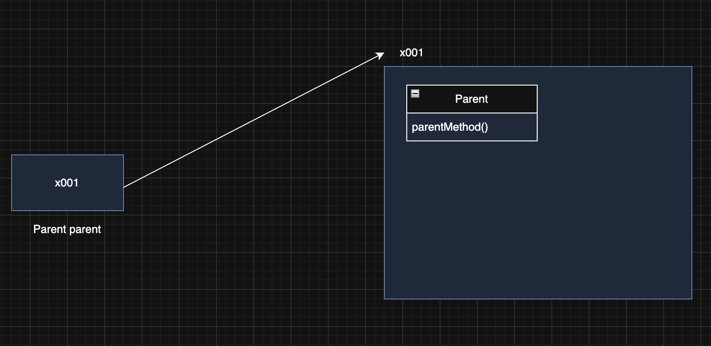
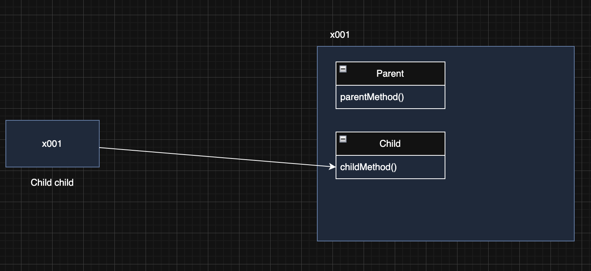
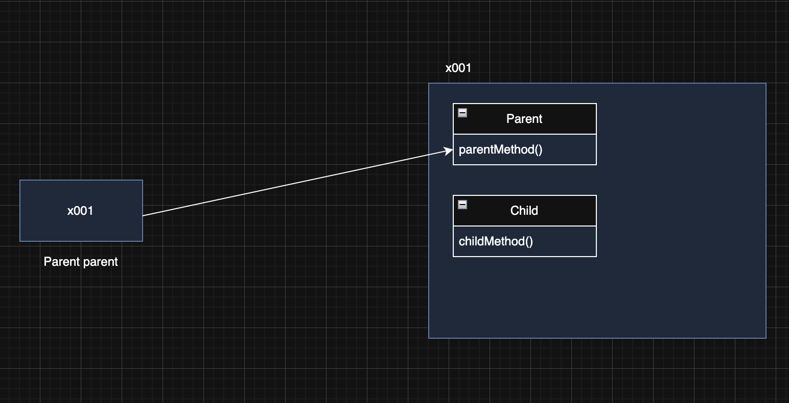
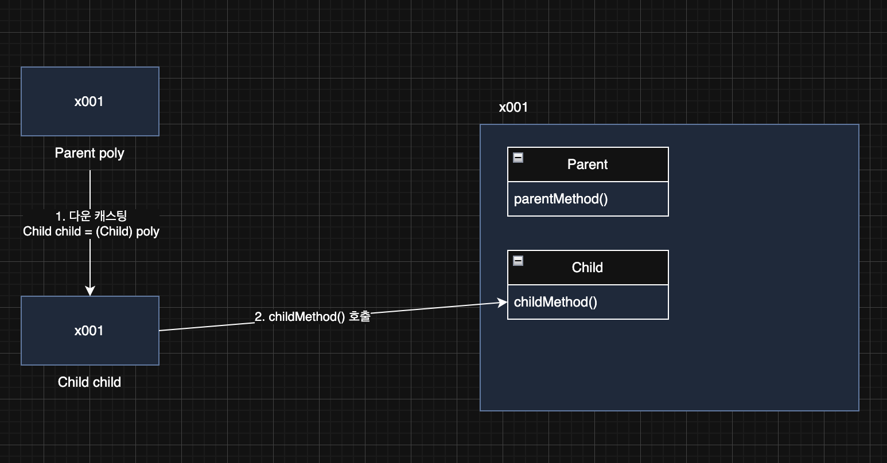
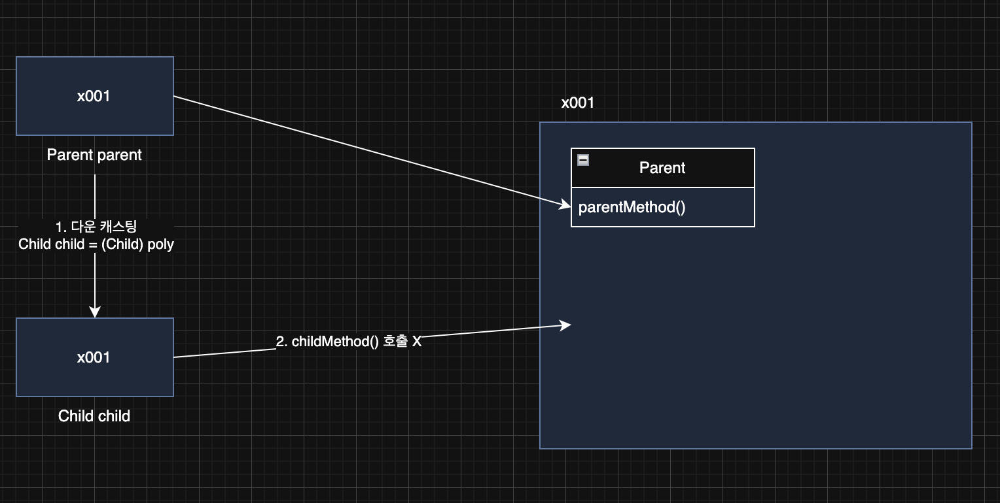
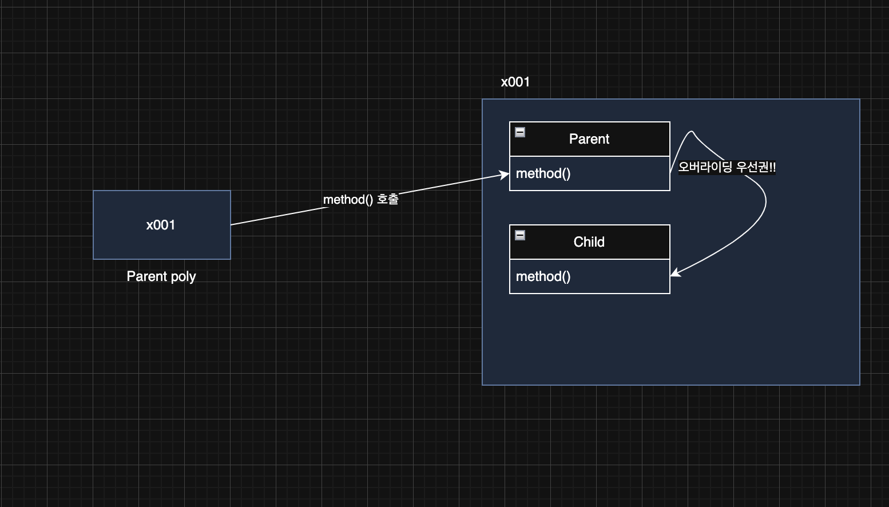

> 해당 블로그 글은 [영한님의 인프런 강의](https://inf.run/PuC6W)를 바탕으로 쓰여진 글입니다.

## 다형성 시작

객체지향 프로그래밍의 대표적인 특징으로는 캡슐화, 상속, 다형성이 있다. 그 중에서 다형성은 객체지향 프로그래밍의 꽃이라 불린다.

캡슐화와 상속은 우리가 직관적으로 이해하기 쉬웠다. 하지만 다형성의 개념은 매우 까다롭고 이해하기 힘든 부분이 존재한다. 하지만 다형성을 모르고는 자바를 배웠다라고 할 수 없을 정도로 엄청 중요하니 차근히 학습해보자.

다형성을 이해하기 위해서는 2가지 개념을 알아야 한다.

- **다형적 참조**
- **메서드 오버라이딩**

### 다형적 참조

다형적 참조에 대해 말로 설명하는 것보다 코드를 보고 설명하는게 좋을 것 같다. 아래의 예제 코드를 보자.

``` java
package poly.basic;

public class Parent {

    public void parentMethod() {
        System.out.println("Parent.parentMethod");
    }
}
```

위와 같이 부모 클래스를 정의해두었다.

``` java
package poly.basic;

public class Child extends Parent {

    public void childMethod() {
        System.out.println("Child.childMethod");
    }
}
```

위의 클래스는 부모 클래스를 상속 받은 자식 클래스이다. 이제 위의 두 클래스를 사용하는 코드를 살펴보자.

``` java
package poly.basic;

public class PolyMain {
    public static void main(String[] args) {
        System.out.println("Parent -> Parent");
        Parent parent = new Parent();
        parent.parentMethod();

        System.out.println("Child -> Child");
        Child child = new Child();
        child.parentMethod();
        child.childMethod();

        System.out.println("Parent -> Child");
        Parent poly = new Child();
        poly.parentMethod();

//        Child child1 = new Parent();

//        poly.childMethod();
    }
}
```

위의 코드를 보면 `Parent poly = new Child();`부분에서 아리송 할 것이다. 이 부분을 차근히 설명해보겠다. 그 전에 위의 코드들부터 순차적으로 설명해보겠다.

#### 부모 타입의 변수가 부모 인스턴스를 참조



``` java
Parent parent = new Parent();
```

부모 타입의 변수가 부모 인스턴스를 참조하는 것은 당연히 가능하다. 본인의 타입의 인스턴스이기 때문이다. `new`연산자로 부모 인스턴스가 생성이 된다.(자식 인스턴스는 생성X) 그리고 반환값으로 참조값을 전달하고 부모 타입의 참조변수가 그 값을 저장한다. 그래서 부모 타입 변수가 자신의 메서드를 호출 할 수 있는 것이다.

#### 자식 타입의 변수가 자식 인스턴스 참조



``` java
Child child = new Child();
```

자식 타입의 변수가 자식 인스턴스를 참조하는 것도 당연히 가능하다. 자식 인스턴스가 생성이 되면 자식 인스턴스뿐만 아니라 부모 인스턴스도 같이 생성이 된다. 그리고 생성된 참조값을 변수에 저장한다. 그래서 자식 타입의 변수에서 자식 인스턴스 메서드를 호출하는 것도 너무 당연하게 가능한 것이다.

#### 다형적 참조: 부모 타입의 변수가 자식 인스턴스 참조



부모 타입의 변수가 자식 인스턴스를 참조한다. 일단 `new`연산자로 자식 인스턴스를 생성했으니, 이와 동시에 부모 인스턴스도 같이 생성이 된다. 그리고 생성된 참조값을 부모 타입 변수에 저장한다.

부모 타입은 자식 타입을 담을 수 있다. 하지만 반대로 아래처럼 자식타입이 부모 타입을 담을 수는 없다.

``` java
Child child = new Parent(); // 컴파일 에러
```

자바에서 부모 타입은 자신은 물론이고, 자신을 기준으로 모든 자식 타입을 참조할 수 있다. 이것이 바로 다양한 형태를 참조할 수 있다고 해서 다형적 참조라 한다.

#### 다형적 참조와 인스턴스 실행

`poly.parentMethod()`를 실행하면 먼저 참조값을 찾는다. 참조값을 찾은 다음에 해당 변수의 타입을 확인해본다. 지금은 Parent인 부모 타입이다. 이제 참조값을 가지고 부모타입 인스턴스에 간다. 그리고 실행하려는 메서드가 있는지 확인한다. 있으니 실행하는데 없다면 상위 타입으로 가보려고 한다. 근데 지금은 현재 상위 타입이 존재하지 않으므로 컴파일 에러가 발생한다.

#### 다형적 참조의 한계

그러면 만약 아래의 코드를 실행하면 어떻게 될까?

``` java
Parent poly = new Child();
poly.childMethod();
```

먼저 poly의 참조값을 찾는다. 그 후, poly의 타입이 무엇인지 확인한다. poly타입이 부모 타입이므로 참조값을 통해 인스턴스 접근 후 부모타입으로 간다. 그리고 `childMethod`를 찾는다. 부모 타입에는 존재하지 않으므로 상위타입으로 가려고 한다. 하지만 현재 부모타입보다 상위타입이 없으므로 컴파일 에러가 발생한다.

> ⚠️ 주의
>
> 해당 인스턴스에 메서드를 발견 못하면 자식타입으로 찾아보는 것이 아닌 바로 상위 타입으로 가는 점 주의해야 한다!

그러면 이런 의문이 들 것이다. 왜 이런 다형적 참조를 해서 더 불편해지게 한 것일까? 인스턴스와 변수타입만 맞추면 이런 문제를 다 해결이 가능해질 것 같은데 말이다. 일단 이런 의문을 품은채 다음으로 넘어가보자.

## 다형성과 캐스팅

``` java
Parent poly = new Child();
poly.childMethod(); // 컴파일 에러
```

위와 같이 부모타입의 변수로 자식 메서드를 호출할 수가 없다. 하지만 이렇게 만들고 싶은 상황이 있지 않을까? 그래서 자바에서는 다운 캐스팅이라는 개념을 지원해준다.

### 다운 캐스팅



부모 타입을 사용하는 변수를 자식 타입에 대입하려고 하면 컴파일 오류가 발생한다. 자식은 부모를 담을 수 없다. 이때는 다운캐스팅이라는 기능을 사용해서 부모 타입을 잠깐 자식 타입으로 변경하면 된다. `(타입)`처럼 괄호와 그 사이에 타입을 지정하면 참조 대상을 특정 타입으로 변경할 수 있다. 이렇게 특정 타입으로 변경하는 것을 캐스팅이라 한다. 우리가 자바 입문편때 배운 타입 캐스팅을 생각하면 쉬울 것이다.

### 캐스팅

- 업 캐스팅: 부모 타입으로 변경
- 다운 캐스팅: 자식 타입으로 변경

## 캐스팅의 종류

### 일시적 다운 캐스팅

이제까지 우리는 다운캐스팅을 하면서 아래와 같이 작성해왔다.

``` java
Child child = (Child) parent;
child.childMethod();
```

하지만 캐스팅 하나 때문에 변수를 선언해서 하는 것은 매우 귀찮은 일이다. 그래서 자바에서 일시적 다운 캐스팅을 아래와 같이 지원한다.

``` java
((Child) parent).childMethod();
```

이렇게 일시적 다운캐스팅을 사용하면 별도의 변수 없이 인스턴스의 자식 타입의 기능을 사용할 수 있다.

### 업 캐스팅

다운캐스팅과 반대로 현재 타입을 부모 타입으로 변경하는 것을 업캐스팅이라 한다.

``` java
Child child = new Child();
Parent parent = (Parent) child; // 캐스팅 연산자 생략 가능
Parent parent = child;
```

업캐스팅은 생략할 수 있다. 다운캐스팅은 생략할 수 없다. 참고로 업캐스팅은 매우 자주 사용하기 때문에 생략을 권장한다. 그러면 왜 다운 캐스팅은 생략을 할 수 없을까? 그 이유에 대해 알아보자.

## 다운캐스팅과 주의점

다운캐스팅은 잘못하면 심각한 런타임 오류가 발생할 수 있다.

``` java
Parent parent = new Child();
Child child = (Child) parent;
child.childMethod();
```

위의 코드를 실행하면 전혀 문제가 발생하지 않는다. 하지만 이런 경우가 존재할 수 있다.

``` java
Parent parent = new Parent();
Child child = (Child) parent;
child.childMethod();
```

위의 코드에는 타입 캐스팅 부분에서 아래와 같이 런타임 에러가 발생한다.

``` bash
Exception in thread "main" java.lang.ClassCastException: class poly.basic.Parent
cannot be cast to class poly.basic.Child (poly.basic.Parent and poly.basic.Child are in unnamed module of loader 'app') at poly.basic.CastingMain4.main(CastingMain4.java:11)
```

이렇게 발생하는 이유는 다음과 같다.



먼저 `new`연산자로 부모 인스턴스를 생성했다. 그리고 부모타입 변수에 참조 값을 저장해두었다. 그리고 이 참조값을 복사해서 자식타입으로 다운 캐스팅 후에 자식 메서드를 호출하려고 한다. 하지만 해당 참조값은 부모 인스턴스를 가리키고 그 인스턴스에 자식 메서드를 호출하려고 보니 자식 메서드가 없는 것이다. 그래서 런타임 에러가 발생하고 이런 이유로 자바에서는 다운 캐스팅을 할 때 자동으로 해주지 않고 개발자에게 경고를 해주는 것이다.

### 업 캐스팅이 안전하고 다운 캐스팅이 위험한 이유

업캐스팅의 경우 이런 문제가 절대로 발생하지 않는다. 왜냐하면 객체를 생성하면 해당 타입의 상위 부모 타입은 모두 함께 생성된다! 따라서 위로만 타입을 변경하는 업캐스팅은 메모리 상에 인스턴스가 모두 존재하기 때문에 항상 안전하다. 따라서 캐스팅을 생략할 수 있다. 반면에 다운캐스팅의 경우 인스턴스에 존재하지 않는 하위 타입으로 캐스팅하는 문제가 발생할 수 있다. 왜냐하면 객체를 생성하면 부모 타입은 모두 함께 생성되지만 자식 타입은 생성되지 않는다. 따라서 개발자가 이런 문제를 인지하고 사용해야 한다는 의미로 명시적으로 캐스팅을 해주어야 한다.

### 컴파일 오류 vs 런타임 오류

컴파일 오류는 변수명 오타, 잘못된 클래스 이름 사용등 자바 프로그램을 실행하기 전에 발생하는 오류이다. 이런 오류는 IDE에서 즉시 확인할 수 있기 때문에 안전하고 좋은 오류이다. 반면에 런타임 오류는 이름 그대로 프로그램이 실행되고 있는 시점에 발생하는 오류이다. 런타임 오류는 매우 안좋은 오류이다. 왜냐하면 보통 고객이 해당 프로그램을 실행하는 도중에 발생하기 때문이다.

## instanceof

다형성에서 참조형 변수는 이름 그대로 다양한 자식을 대상으로 참조할 수 있다. 그런데 참조하는 대상이 다양하기 때문에 어떤 인스턴스를 참조하고 있는지 확인하려면 어떻게 해야할까?

각 참조변수가 참조하는 인스턴스 타입을 확인하고 싶을 경우 `instanceof`라는 키워드를 사용하면 된다. 아래 코드를 통해 보자.

``` java
package poly.basic;

public class CastingMain5 {
    public static void main(String[] args) {
        Parent parent1 = new Parent();
        System.out.println("parent1 호출");
        call(parent1);

        Parent parent2 = new Child();
        System.out.println("parent2 호출");
        call(parent2);
    }

    private static void call(Parent parent) {
        parent.parentMethod();

        if (parent instanceof Child) {
            System.out.println("Child 인스턴스 맞음");
            Child child = (Child) parent;
            child.childMethod();
        }
    }
}
```

보통은 해당 참조변수가 어떤 인스턴스 타입인지는 금방 확인이 된다. 코드가 몇 줄 안되는 경우는 더더욱 그럴 것이다. 하지만 위와 같이 메서드로 분리되었거나 해당 메서드가 외부 API인 경우라면 넘어오는 인자가 어떤 타입인지는 반드시 확인해야 할 것이다. 그래서 위에처럼 Child타입이 맞다면 다운캐스팅을 진행하고 아니면 패스하는 방식을 많이 이용한다. 만약 해당 조건이 없다면 이전처럼 런타임 에러가 발생할 것이다.

조금 더 자세히 보자.

``` java
new Parent() instanceof Parent
```

위의 코드는 한마디로 보면 아래와 비슷하다고 볼 수 있다.

``` java
Parent p = new Parent();
```

즉, 이렇게 생각하면 아래의 코드는 성립이 안된다는 것을 파악할 수 있다.

``` java
new Parent() instanceof Child
```

왜냐하면 위의 식을 풀어보면 아래의 코드인데 자식 타입은 부모 타입을 받을 수 없기 때문이다.

``` java
Child c = new Parent();
```

### 자바 16 - Pattern Matching for instanceof

자바 16이상을 쓰면 `instanceof`를 조금 더 편하게 쓸 수 있다.

``` java
package poly.basic;

public class CastingMain6 {
    public static void main(String[] args) {
        Parent parent1 = new Parent();
        System.out.println("parent1 호출");
        call(parent1);

        Parent parent2 = new Child();
        System.out.println("parent2 호출");
        call(parent2);
    }

    private static void call(Parent parent) {
        parent.parentMethod();

        if (parent instanceof Child child) {
            System.out.println("Child 인스턴스 맞음");
            child.childMethod();
        }
    }
}
```

위에처럼 조건문에 변수를 선언하는 방식으로 하고 조건문 내용에 타입 캐스팅하는 부분을 제거할 수 있다. 조금 더 깔끔해진 것을 확인할 수 있다.

## 다형성과 메서드 오버라이딩

다형성을 이루는 또 하나의 중요한 핵심 이론은 바로 메서드 오버라이딩이다. 메서드 오버라이딩에서 꼭! 기억해야 할 점은 **오버라이딩 된 메서드가 항상 우선권을 가진다**는 점이다. 그러면 예제를 통하여 한번 살펴보자.

``` java
package poly.overriding;

public class Parent {

    public String value = "parent";

    public void method() {
        System.out.println("Parent.method");
    }
}
```

위와 같이 부모 클래스를 정의하였다.

``` java
package poly.overriding;

public class Child extends Parent {

    public String value = "child";

    @Override
    public void method() {
        System.out.println("Child.method");
    }
}
```

그리고 자식 클래스가 부모 클래스를 상속 받고 부모 클래스의 메서드를 오버라이딩하였다. 이제 사용하는 코드를 보자.

``` java
package poly.overriding;

public class OverridingMain {
    public static void main(String[] args) {
        Child child = new Child();
        System.out.println("Child -> Child");
        System.out.println("value = " + child.value);
        child.method();

        Parent parent = new Parent();
        System.out.println("Parent -> Parent");
        System.out.println("value = " + parent.value);
        parent.method();

        Parent poly = new Child();
        System.out.println("Parent -> Child");
        System.out.println("value = " + poly.value);
        poly.method();
    }
}
```

이 코드를 실행하기 전에 한번 예상해보자. 특히 마지막 부분이 어떻게 나올지 생각해보자! 그런데 우리가 배운 이론으로 생각하면 가장 마지막에 `poly.value`값은 parent가 나오고 `poly.method()`는 Parent.method라고 나와야 할 것 같다. 하지만 메서드 결과는 Child.method가 나온다. 왜 그럴까? 그림을 통해 보자.



먼저 부모 타입의 참조값을 통해 자식 인스턴스의 부모 타입 인스턴스 영역으로 간다. 그 후에 `method()`를 호출한다. 하지만 호출하기 전에 이 메서드가 오버라이딩이 되었는지 자식타입들을 확인해본다. 오버라이딩이 되었다면 오버라이딩된 메서드를 호출한다.

> 잘못된 지식이 있을 경우 댓글로 남겨주시면 빠르게 반영하겠습니다!