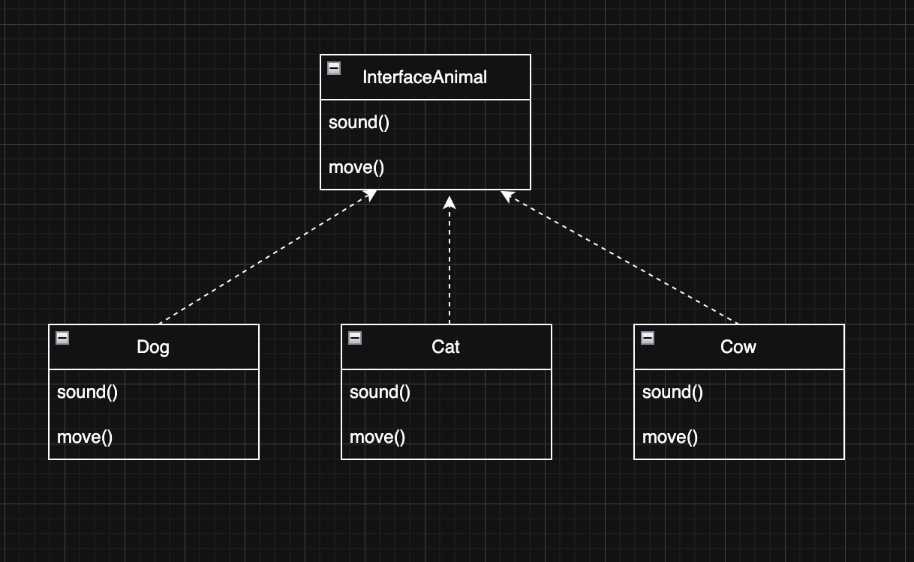
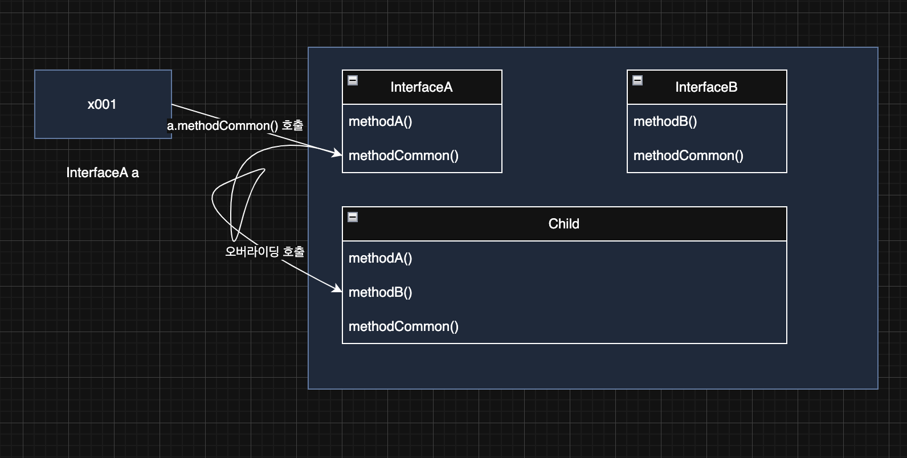
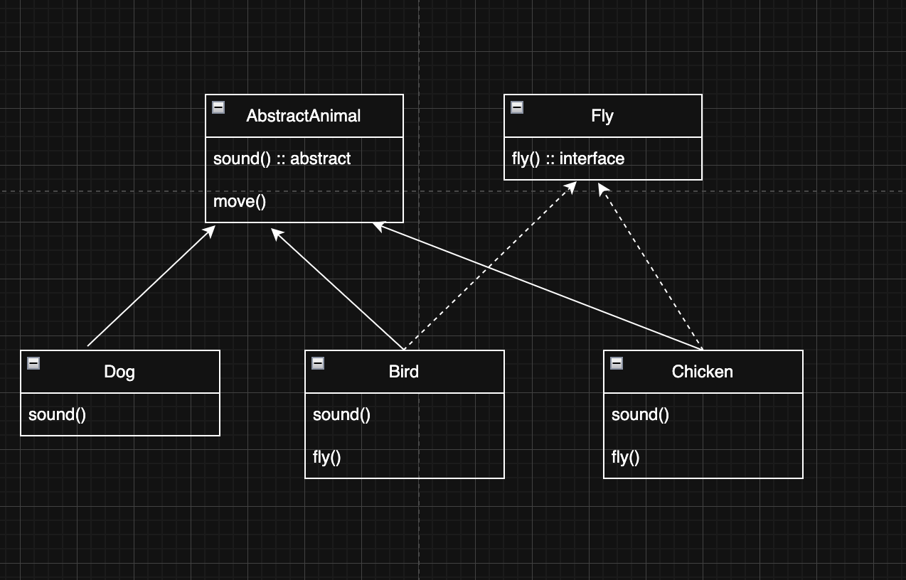

> 해당 블로그 글은 [영한님의 인프런 강의](https://inf.run/PuC6W)를 바탕으로 쓰여진 글입니다.

## 다형성 활용1

이제 다형성이 어떻게 활용되는지 예제를 발전하면서 알아보자.

``` java
package poly.ex1;

public class Dog {

    public void sound() {
        System.out.println("멍멍");
    }
}
```

``` java
package poly.ex1;

public class Cat {

    public void sound() {
        System.out.println("야옹");
    }
}
```

``` java
package poly.ex1;

public class Cow {

    public void sound() {
        System.out.println("음매");
    }
}
```

이렇게 서로 다른 타입의 동물 클래스들을 개발했다. 이제 이를 사용하는 코드를 확인해보자.

``` java
package poly.ex1;

public class AnimalSoundMain {
    public static void main(String[] args) {
        Dog dog = new Dog();
        Cat cat = new Cat();
        Cow cow = new Cow();

        System.out.println("동물 소리 테스트 시작");
        dog.sound();
        System.out.println("동물 소리 테스트 종료");

        System.out.println("동물 소리 테스트 시작");
        cat.sound();
        System.out.println("동물 소리 테스트 종료");

        System.out.println("동물 소리 테스트 시작");
        cow.sound();
        System.out.println("동물 소리 테스트 종료");
    }
}
```

이렇게 동물들의 소리를 출력하는 코드가 완성이 되었다. 하지만 여러분은 이제는 알 것이다. 꽤나 좋지 못한 코드이다. 왜냐하면 동물들이 추가될 때마다 반복적으로 보이는 출력문 코드를 추가해줘야 하기 때문이다.

### 중복 제거 시도

#### 메서드 추출

그러면 이런 중복적인 코드를 어떻게 제거할까? 바로 떠오르는 것이 메서드로 분리하자는 생각이 든다. 하지만 그렇게 할 수가 없다. 왜냐하면 각각 동물 클래스들은 서로 다른 타입이기 때문에 공통된 타입이 없어서 하나의 메서드로는 추출이 불가능하다. 굳이 만든다면 동물별로 메서드를 만들어야 하는데 기존과 크게 달라진게 없다.

#### 반복문, 배열

그러면 반복문과 배열을 이용해서 중복을 제거할 수 있는듯 보인다. 하지만 이것도 해결책이 되지 못한다. 왜냐하면 이것 또한 공통된 타입의 배열에 동물들 객체를 담아야 하는데 공통된 타입이 없기 때문이다.

이런 문제를 우리는 다형적 참조와 메서드 오버라이딩으로 해결할 수 있다.

## 다형성 활용2

그러면 한번 다형적 참조와 메서드 오버라이딩을 이용하여 코드를 변경해보자. 그러기 위해서는 공통타입을 먼저 만들어야 할 것 같다.

``` java
package poly.ex2;

public class Animal {

    public void sound() {
        System.out.println("동물 울음 소리");
    }
}
```

위와 같이 공통 부모 클래스로 동물 클래스를 만들었다. 이제 이 동물 클래스를 상속시키자.

``` java
package poly.ex2;

public class Dog extends Animal {

    @Override
    public void sound() {
        System.out.println("멍멍");
    }
}
```

``` java
package poly.ex2;

public class Cat extends Animal {

    @Override
    public void sound() {
        System.out.println("야옹");
    }
}
```

``` java
package poly.ex2;

public class Cow extends Animal {

    @Override
    public void sound() {
        System.out.println("음매");
    }
}
```

이제 이것을 사용하는 main 메서드를 개발해보자. 메서드 추출을 사용하여 기존보다 더 단순하게 만들 수 있을 것이다.

``` java
package poly.ex2;

public class AnimalSoundMain1 {
    public static void main(String[] args) {
        Dog dog = new Dog();
        Cat cat = new Cat();
        Cow cow = new Cow();

        soundAnimal(dog);
        soundAnimal(cat);
        soundAnimal(cow);
    }

    private static void soundAnimal(Animal animal) {
        System.out.println("동물 소리 테스트 시작");
        animal.sound();
        System.out.println("동물 소리 테스트 종료");
    }
}
```

이렇게 다형적 참조와 메서드 오버라이딩덕에 코드가 단순해졌다.

## 다형성 활용3

이제 위의 메인 메서드를 배열과 반복문을 이용하여 좀 더 리팩토링을 해보겠다.

``` java
package poly.ex2;

public class AnimalSoundMain3 {
    public static void main(String[] args) {
        Animal[] animalArr = {new Dog(), new Cat(), new Cow()};

        for (Animal animal : animalArr) {
            soundAnimal(animal);
        }
    }

    private static void soundAnimal(Animal animal) {
        System.out.println("동물 소리 테스트 시작");
        animal.sound();
        System.out.println("동물 소리 테스트 종료");
    }
}
```

공통타입 배열을 만들어서 인스턴스들을 넣어주고 반복문을 통하여 메서드를 호출시키는 형태로 진화시켰다. 즉, 변경사항이 생기더라도 수정범위가 적은 아주 좋은 프로그램이 만들어졌다. 이제 모든게 완벽히 끝난것처럼 보이지만 몇가지 문제점이 있다.

### Animal 클래스를 생성할 수 있는 문제

지금보면 Animal클래스는 다형성을 위해 만든 공통 클래스이다. 이것은 생성 목적이 아닌 것이다. 하지만 실수로 개발자가 해당 클래스를 생성할 수 있다. 정말 좋은 코드라면 해당 클래스는 인스턴스화를 막아야 한다.

### Animal 클래스를 상속받는 곳에서 `sound()`메서드를 오버라이딩 하지 않을 가능성

또 하나의 문제가 바로 Animal 클래스에 있는 메서드를 오버라이딩 하지 않을 가능성이 존재한다. 어떤 개발자가 다른 동물 클래스를 만들었고 Animal 클래스를 상속받았지만 오버라이딩을 안 하고 그냥 사용할 수 있다. 그러면 결국 부모 클래스의 메서드를 호출하게 되고 예상과 다른 결과가 나오게 된다. 즉, 강제성이 없다. 뭔가 강제적으로 반드시 오버라이딩하라는 에러가 나오게 하면 좋을 것 같다.

위와 같은문제를 추상 클래스와 추상 메서드를 통해 해결이 가능하다.

## 추상 클래스1

### 추상 클래스

동물과 같이 부모 클래스는 제공하지만, 실제 생성되면 안되는 클래스를 추상 클래스라 한다. 추상 클래스는 이름 그대로 추상적인 개념을 제공하는 클래스이다. 따라서 실체인 인스턴스가 존재하지 않는다. 대신에 상속을 목적으로 사용되고, 부모 클래스 역할을 담당한다.

- 추상 클래스는 클래스를 선언할 때 앞에 추상이라는 의미의 `abstract` 키워드를 붙여주면 된다.
- 나머지는 일반 클래스와 똑같다. 다만, 직접 인스턴스화를 못하게 제약을 걸어준 것이다.

``` java
public abstract class Animal {
    // ...
}
```

### 추상 메서드

부모 클래스를 상속 받는 자식 클래스가 반드시 오버라이딩 해야 하는 메서드를 부모 클래스에 정의할 수 있다. 이것을 추상 메서드라 한다. 추상 메서드는 이름 그대로 추상적인 개념을 제공하는 메서드이다. 따라서 실체가 존재하지 않고, 메서드 바디가 없다.

- 추상 메서드는 선언할 때 메서드 앞에 추상이라는 의미의 `abstract` 키워드를 붙여주면 된다.
- 추상 메서드의 접근 제어자는 `private`은 안 된다.
- **추상 메서드가 하나라도 있는 클래스는 추상 클래스로 선언해야 한다.**
    - 그렇지 않으면 컴파일 오류가 발생한다.
    - 추상 메서드는 메서드 바디가 존재하지 않는다. 따라서 추상메서드가 존재하면 직접 생성하지 못하도록 추상 클래스 안에 있어야 한다.
- **추상 메서드는 상속 받는 자식 클래스가 반드시 오버라이딩 해야 한다.**
    - 그렇지 않으면 컴파일 오류가 발생한다.
    - 추상 메서드는 자식 클래스가 반드시 오버라이딩 해야 하기 때문에 메서드 바디가 존재하지 않는다. 그래서 오히려 메서드 바디를 만들면 오류를 발생시킨다.
    - 오버라이딩을 하지 않으면 자식 클래스도 추상 클래스가 되어야 한다.
- 추상 메서드는 기존 메서드와 동일하다. 단, 메서드 바디가 없고 자식 클래스가 반드시 구현해야 하는 제약을 두는 것이다.

``` java
public abstract void sound();
```

그럼 이제 예제를 통해 추상 클래스와 추상 메서드를 확인해보자.

``` java
package poly.ex3;

public abstract class AbstractAnimal {

    public abstract void sound();

    public void move() {
        System.out.println("동물이 움직입니다.");
    }
}
```

위의 코드는 동물이라는 부모 클래스를 추상 클래스로 둔 것이다. 또한 `sound` 메서드는 자식 클래스들이 반드시 구현을 해야 한다. 그리고 `move`처럼 일반적인 메서드 선언도 가능하다. 단, 일반 메서드는 자식 클래스가 반드시 구현을 해야하는 것은 아니다.

그리고 이제 추상 클래스를 상속한 자식 클래스들을 만들어보자.

``` java
package poly.ex3;

public class Dog extends AbstractAnimal {

    @Override
    public void sound() {
        System.out.println("멍멍");
    }
}
```

``` java
package poly.ex3;

public class Cat extends AbstractAnimal {

    @Override
    public void sound() {
        System.out.println("야옹");
    }
}
```

``` java
package poly.ex3;

public class Cow extends AbstractAnimal {

    @Override
    public void sound() {
        System.out.println("음매");
    }
}
```

이제 사용하는 코드를 확인해보자.

``` java
package poly.ex3;

public class AbstractMain {
    public static void main(String[] args) {
//        AbstractAnimal abstractAnimal = new AbstractAnimal();

        Dog dog = new Dog();
        Cat cat = new Cat();
        Cow cow = new Cow();

        cat.sound();
        cat.move();

        soundAnimal(dog);
        soundAnimal(cat);
        soundAnimal(cow);
    }

    private static void soundAnimal(AbstractAnimal animal) {
        System.out.println("동물 소리 테스트 시작");
        animal.sound();
        System.out.println("동물 소리 테스트 종료");
    }
}
```

위의 main 메서드를 보면 추상 클래스를 직접 인스턴스화를 못한다. 만약 강제 인스턴스화를 한다면 아래와 같은 컴파일 에러가 발생한다.

``` bash
java: poly.ex3.AbstractAnimal is abstract; cannot be instantiated
```

또한 자식 클래스에서 깜빡하고 추상 메서드를 구현을 안해도 아래와 같은 컴파일 에러가 발생한다.

``` java
java: poly.ex3.Dog is not abstract and does not override abstract method sound() in poly.ex3.AbstractAnimal
```

## 추상 클래스2

추상 클래스에서 모든 메서드가 추상 메서드인 클래스를 순수 추상 클래스라고 한다. 순수 추상 클래스는 아래와 같은 특징이 존재한다.

- 인스턴스를 생성할 수 없다.
- 상속시 자식은 모든 메서드를 오버라이딩 해야 한다.
- 주로 다형성을 위해 사용된다.

이런 특징을 잘 생각해보면 순수 추상 클래스는 마치 어떤 규격을 지켜서 구현해야 하는 것 처럼 느껴진다. 약간 우리 생활 측면에서 보면 유선 마우스 같다. 유선 마우스는 PC와 연결하려면 USB 포트 규격이 맞아야 한다. 맞지 않으면 연결을 못하는 것처럼 말이다. 자바에서는 이렇게 순수 추상 클래스를 인터페이스라는 개념으로 활용한다. 그러면 인터페이스의 개념을 알아보기 전에 순수 추상 클래스의 예제를 살펴보자.

``` java
package poly.ex4;

public abstract class AbstractAnimal {

    public abstract void sound();

    public abstract void move();
}
```

위와 같이 추상 클래스에 메서드 전부가 추상 메서드인 것을 순수 추상 클래스라고 부른다.

> 단, 해당 용어는 공식 용어는 아니고 쉽게 이해하기 위해 만든 용어이다.

이제 해당 클래스들을 자식 클래스가 상속을 받으면 `sound` 메서드와 `move` 메서드를 전부 강제로 구현을 해야 한다. 해당 부분의 코드는 기존과 유사함으로 생략한다.

## 인터페이스

자바는 순수 추상 클래스를 더 편리하게 사용할 수 있는 인터페이스라는 기능을 제공한다.

``` java
public abstract class AbstractAnimal {

    public abstract void sound();

    public abstract void move();
}
```

위와 같은 순수 추상 클래스를 인터페이스로 아래와 같이 작성 할 수 있다.

``` java
public interface AbstractAnimal {
    public abstract void sound();

    public abstract void move();
}
```

하지만 위의 인터페이스를 실무에서는 아래와 같이 축약해서 많이 사용한다.

``` java
public interface AbstractAnimal {
    void sound();

    void move();
}
```

인터페이스는 순수 추상 클래스가 가지고 있는 특징에 더해서 아래와 같이 추가적인 장점을 가진다.

- 인터페이스의 메서드는 모두 `public` , `abstract` 이다.
- 메서드에 `public abstract` 를 생략할 수 있다. 참고로 생략이 권장된다.
- 인터페이스는 다중 구현(다중 상속)을 지원한다.

또한 인터페이스에는 멤버변수를 지원한다. 그런데 인터페이스는 반드시 구현당할 운명에 처한 녀석이다. 그래서 일반 멤버 변수를 쓰면 값을 재할당할 수 있기에 기본적으로 `public`,`static`,`final` 이 모두 포함된다.

``` java
public interface AbstractAnimal {
    public static final String ABSTRACT_HELLO = "hello";
    void sound();

    void move();
}
```



클래스에서 상속관계를 표현할 때 UML에서 실선으로 표현하지만 인터페이스는 상속이 아니고 구현한다라고 표현하기에 점선으로 표현한다. 그럼 위의 UML을 코드로 표현해보자.

``` java
package poly.ex5;

public interface InterfaceAnimal {
    void sound();

    void move();
}
```

위와 같이 인터페이스를 선언하고 아래와 같이 자식 클래스가 인터페이스를 구현하면 되는 것이다.

``` java
package poly.ex5;

public class Dog implements InterfaceAnimal {

    @Override
    public void sound() {
        System.out.println("멍멍");
    }

    @Override
    public void move() {
        System.out.println("개 이동");
    }
}
```

``` java
package poly.ex5;

public class Cat implements InterfaceAnimal {

    @Override
    public void sound() {
        System.out.println("냐옹");
    }

    @Override
    public void move() {
        System.out.println("고양이 이동");
    }
}
```

``` java
package poly.ex5;

public class Cow implements InterfaceAnimal {

    @Override
    public void sound() {
        System.out.println("음매");
    }

    @Override
    public void move() {
        System.out.println("소 이동");
    }
}
```

위의 자식 클래스들을 보면 상속처럼 `extends` 대신에 `implements`를 사용했다. 상속이 아니라 구현이기 때문에 해당 키워드도 달라진 것이다.

클래스, 추상 클래스, 인터페이스는 프로그램 코드, 메모리 구조상 모두 똑같다. 모두 자바에서는 `.class`로 다루어진다. 인터페이스를 작성할 때도 `.java` 에 인터페이스를 정의한다.

### 상속 vs 구현

부모 클래스의 기능을 자식 클래스가 상속 받을 때, 클래스는 상속 받는다고 표현하지만, 부모 인터페이스의 기능을 자식이 상속 받을 때는 인터페이스를 구현한다고 표현한다. 상속은 말 그대로 부모가 가지고 있는 기능을 물려받아서 사용하는 개념이다. 하지만 인터페이스는 물려받을 기능이 없다. 구현해야 할 것만 있는 것이다. 그래서 인터페이스는 상속이라는 말을 사용하지 않고 구현이라고 표현한다.

### 인터페이스를 사용하는 이유

- 제약: 인터페이스를 만드는 이유는 인터페이스를 구현하는 곳에서 인터페이스의 메서드를 반드시 구현해라는 규약(제약)을 주는 것이다. 그런데 순수 추상 클래스의 경우 미래에 누군가 그곳에 실행 가능한 메서드를 끼워 넣을 수 있다. 이렇게 되면 추가된 기능을 자식 클래스에서 구현하지 않을 수도 있고, 또 더는 순수 추상 클래스가 아니게 된다. 인터페이스는 모든 메서드가 추상 메서드이다. 따라서 이런 문제를 원천 차단할 수 있다.
- 다중 구현: 자바에서 클래스 상속은 부모를 하나만 지정할 수 있다. 반면에 인터페이스는 부모를 여러명 두는 다중 구현(다중 상속)이 가능하다.

> ✅ 참고
>
> 자바8에 등장한 `default` 메서드를 사용하면 인터페이스도 메서드를 구현할 수 있다. 하지만 이것은 예외적으로 아주 특별한 경우에만 사용해야 한다. 자바9에서 등장한 인터페이스의 `private` 메서드도 마찬가지이다.

## 인터페이스 - 다중 구현

자바는 다중 상속을 지원하지 않는다. 그래서 `extends` 대상은 하나만 선택할 수 있다. 부모를 하나만 선택할 수 있다는 뜻이다. 물론 부모가 또 부모를 가지는 것은 괜찮다. 만약 두 부모 클래스를 하나의 자식 클래스가 다중상속이 가능하다면 어떻게 할까? 두 부모에 같은 메서드가 있다면 오버라이딩 할 때 어느것을 오버라이딩해야 할 지 문제가 될 것이다. 그렇다면 클래스는 앞서 설명한 이유로 다중 상속이 안되는데, 인터페이스의 다중 구현은 허용한 이유는 뭘까? 인터페이스는 모두 추상 메서드로 이루어져 있기 때문이다. 예제 코드를 살펴보자.

``` java
package poly.diamond;

public interface InterfaceA {
    void methodA();

    void methodCommon();
}
```

``` java
package poly.diamond;

public interface InterfaceB {
    void methodB();

    void methodCommon();
}
```

위에처럼 인터페이스 2개를 선언 하였다. 그리고 아래의 자식 클래스가 이 2개의 인터페이스를 구현하는 로직을 작성했다.

``` java
package poly.diamond;

public class Child implements InterfaceA, InterfaceB {

    @Override
    public void methodA() {
        System.out.println("Child.methodA");
    }

    @Override
    public void methodB() {
        System.out.println("Child.methodB");
    }

    @Override
    public void methodCommon() {
        System.out.println("Child.methodCommon");
    }
}
```

`implements InterfaceA, InterfaceB` 와 같이 다중 구현을 할 수 있다. `implements` 키워드 위에 `,`로 여러 인터페이스를 구분하면 된다. `methodCommon()` 의 경우 양쪽 인터페이스에 다 있지만 같은 메서드이므로 구현은 하나만 하면 된다.

그러면 그림을 통해 확인해보자.



``` java
InterfaceA a = new Child();
a.methodCommon();
```

위의 코드를 동작하는 그림을 그려보았다. 먼저 InterfaceA 타입의 참조변수를 통해 참조값을 찾아 해당 인스턴스에 접근한다. 접근 한 다음에 `methodCommon()`을 찾는다. 호출자 타입이 InterfaceA이므로 해당 타입으로 간다. 가보니 `methodCommon`이 존재하나 자식 클래스에서 오버라이딩을 하는 것을 알 수 있었다. 그래서 오버라이딩 메서드가 호출이 된다.

## 클래스와 인터페이스 활용

그럼 이제 상속과 구현을 함께 이용하는 예제를 살펴보겠다. UML을 먼저 살펴보자.



위의 UML을 보고 코드를 작성해보자. 실무에서는 이렇게 UML로 먼저 설계 단계를 거치고 코드를 작성한다. 그래서 이런 훈련도 많이 필요하다!

``` java
package poly.ex6;

public abstract class AbstractAnimal {

    public abstract void sound();

    public void move() {
        System.out.println("동물이 이동합니다.");
    }
}
```

``` java
package poly.ex6;

public interface Fly {
    void fly();
}
```

``` java
package poly.ex6;

public class Dog extends AbstractAnimal {

    @Override
    public void sound() {
        System.out.println("멍멍");
    }
}
```

``` java
package poly.ex6;

public class Bird extends AbstractAnimal implements Fly {

    @Override
    public void sound() {
        System.out.println("짹짹");
    }

    @Override
    public void fly() {
        System.out.println("새 날기");
    }
}
```

``` java
package poly.ex6;

public class Chicken extends AbstractAnimal implements Fly {

    @Override
    public void sound() {
        System.out.println("꼬기오");
    }

    @Override
    public void fly() {
        System.out.println("닭 날기");
    }
}
```

이렇게 상속과 구현을 함께 사용하는 경우가 실무에서 비일비재하다. 잘 알아두자!

> 잘못된 지식이 있을 경우 댓글로 남겨주시면 빠르게 반영하겠습니다!