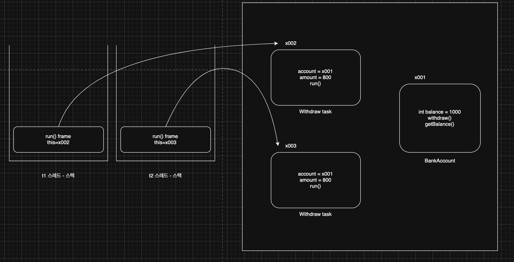
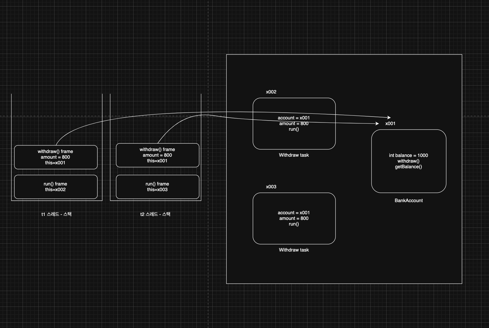
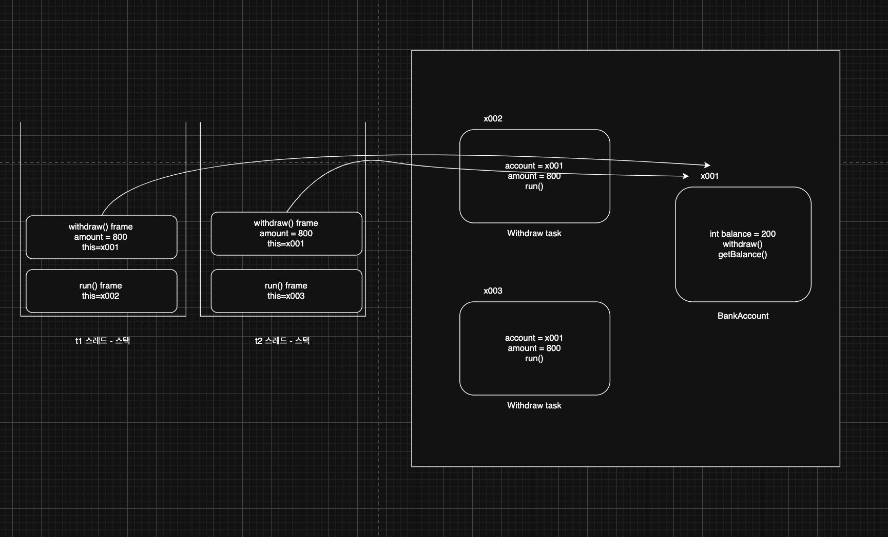

> 해당 블로그 글은 [영한님의 인프런 강의](https://inf.run/6oSgn)를 바탕으로 쓰여진 글입니다.

## 출금 예제 - 시작

멀티스레드를 사용할 때 가장 주의해야 할 점은, 같은 자원(리소스)에 여러 스레드가 동시에 접근할 때 발생하는 동시성 문제이다. 참고로 여러 스레드가 접근하는 자원을 **공유 자원**이라 한다. 대표적인 공유 자원은 인스턴스의 필드(멤버 변수)이다. 멀티스레드를 사용할 때는 이런 공유 자원에 대한 접근을 적절하게 동기화(synchronization)해서 동시성 문제가 발생하지 않게 방지하는 것이 중요하다.

그러면 예제를 통해 동시성 문제에 대해 살펴보자.

``` java
package thread.sync;

public interface BankAccount {

    boolean withdraw(int amount);

    int getBalance();
}
```

위와 같이 출금관련 인터페이스를 설계한다.

``` java
package thread.sync;

import static util.MyLogger.log;
import static util.ThreadUtils.sleep;

public class BankAccountV1 implements BankAccount {

    private int balance;
//    volatile private int balance;

    public BankAccountV1(int initialBalance) {
        this.balance = initialBalance;
    }

    @Override
    public boolean withdraw(int amount) {
        log("거래 시작: " + getClass().getSimpleName());

        log("[검증 시작] 출금액: " + amount + ", 잔액: " + balance);

        if (balance < amount) {
            log("[검증 실패] 출금액: " + amount + ", 잔액: " + balance);
            return false;
        }

        log("[검증 완료] 출금액: " + amount + ", 잔액: " + balance);
        sleep(1000);

        balance -= amount;

        log("[출금 완료] 출금액: " + amount + ", 잔액: " + balance);
        log("거래 종료");

        return true;
    }

    @Override
    public int getBalance() {
        return balance;
    }
}
```

그리고 해당 인터페이스를 구현한 위의 클래스를 정의하고 출금을 하기 전 검증로직을 통해 검증을 진행 후 출금을 진행하는 형식이다. 여기서는 마이너스 통장을 방지하기 위해서 검증을 진행하였다.

``` java
package thread.sync;

public class WithdrawTask implements Runnable {

    private BankAccount account;

    private int amount;

    public WithdrawTask(BankAccount account, int amount) {
        this.account = account;
        this.amount = amount;
    }

    @Override
    public void run() {
        account.withdraw(amount);
    }
}
```

다음으로 출금을 동시에 진행하는 것을 테스트하기 위해 `Runnable` 구현체를 만들어서 출금을 진행하게끔 하였다.

``` java
package thread.sync;

import static util.MyLogger.log;
import static util.ThreadUtils.sleep;

public class BankMain {
    public static void main(String[] args) throws InterruptedException {
        BankAccount account = new BankAccountV1(1000);

        Thread t1 = new Thread(new WithdrawTask(account, 800), "t1");
        Thread t2 = new Thread(new WithdrawTask(account, 800), "t2");

        t1.start();
        t2.start();

        sleep(500);

        log("t1 state: " + t1.getState());
        log("t2 state: " + t2.getState());

        t1.join();
        t2.join();

        log("최종 잔액: " + account.getBalance());
    }
}
```

이제 `main`메서드에서 `main` 스레드가 t1, t2 스레드를 생성하고 0.5초간 `TIMED_WAITING` 상태가 된 다음에 t1, t2 출금 로직을 진행한 후 잔액조회를 진행하였다. 결과는 바로 마이너스 통장이 되버렸다. 왜 그렇게 되었을까?



t1과 t2 스레드가 서로 다른 `Withdraw` 인스턴스를 참조하여 `run()`을 호출한다. 스택 프레임의 `this`에는 호출한 메서드의 인스턴스 참조가 들어있다. 그리고 두 스레드는 같은 계좌에 대해서 출금을 시도한다.


두 스레드가 같은 계좌에 접근하고 검증단계를 거친다. 처음에는 각각 잔액에 1000원이였으나, 800원 인출을 진행하는거니 두 스레드 전부 검증단계에 통과한다. 그리고 출금로직이 진행되버린다. 결국 마이너스 통장의 문제가 발생한다. 이런 문제를 어떻게 해결할까? `balance` 값에 `volatile`을 도입하면 문제가 해결되지 않을까? 그렇지 않다. `volatile`은 한 스레드가 값을 변경했을 때 다른 스레드에서 변경된 값을 즉시 볼 수 있게 하는 메모리 가시성의 문제를 해결할 뿐이다. 해당 문제는 메모리 가시성 문제가 아니다.

## 동시성 문제

그럼 왜 이런 문제가 발생했는지 알아보자. 먼저 t1 스레드가 조금 더 빨리 실행되었다고 가정해보자.



t1이 t2보다 조금 더 빨리 실행되었다고 가정하자. 그러면 t1 스레드는 검증로직을 수행할 것이다. 잔액이 출금액보다 많은지 비교를 한다. 현재 잔액은 1000원이고 출금액은 800원이므로 검증로직을 통과한다. 그리고 `sleep()`을 만나서 잠시 대기상태로 빠진다. 그 동안 t2 스레드가 검증로직을 수행한다. 잔액을 확인하면 아직 1000원이고 출금액 800원과 비교하여 검증단계를 통과한다. 그리고 잠시 대기상태로 빠진다.



그리고 t1이 실행가능 상태로 변경되고 출금을 진행한다. 그리고 잔액을 200원으로 변경한다. 


다음 t2가 출금을 진행한다. 현재 잔액을 확인하여 출금을 진행하므로 잔액 200원에 출금로직을 진행하니 -600원이 된 것이다.


그러면 t1과 t2가 동시에 진행한다고 생각해보자. t1과 t2가 동시에 검증로직을 수행한다. 둘다 잔액과 출금액을 비교한다. 1000원은 800원보다 크므로 검증단계를 무사히 통과한다. 다음 대기상태에 잠시 빠진다.


이후 t1과 t2가 동시에 출금 로직을 수행한다. 둘다 잔액을 확인해 출금액만큼 감소를 시킨다. 둘다 동시에 잔액 1000원에 800원을 감소시키니 200원으로 남는 최악의 사태가 빠진다. 출금은 1600원이 되었는데 은행에서는 800원만 빠지는 위험한 사태가 된 것이다.

이런 문제를 바로 동시성 문제라고 한다. 그럼 이 동시성 문제를 어떻게 해결할 수 있을까?

## 임계 영역

이런 문제가 발생한 근본 원인은 여러 스레드가 함께 사용하는 공유 자원을 여러 단계로 나누어 사용하기 때문이다. 즉, 공유자원인 잔액을 검증 단계와 출금 단계에 같이 사용하고 있기에 이런 문제가 나타나는 것이다.

또한 출금로직에는 가정이 하나 있다. 출금로직을 진행하면서 공유자원은 절대 안 변한다는 가정이며, 하나의 스레드만 접근이 가능하다는 가정이 있기에 이런 로직을 작성할 수 있는 것이다. 이런 영역을 임계영역이라고 말한다.

임계영역은 여러 스레드가 동시에 접근하면 데이터 불일치나 예상치 못한 동작이 발생할 수 있는 위험하고 또 중요한 코드 부분을 뜻한다. 즉, 쉽게 말해서 여러 스레드가 동시에 접근해서는 안 되는 공유 자원을 접근하거나 수정하는 부분을 의미한다. 앞서 우리가 살펴본 출금 로직이 바로 임계 영역이다. 출금을 진행할 때 잔액을 검증하는 단계부터 잔액의 계산을 완료할 때 까지가 임계 영역이다. 여기서 잔액은 여러 스레드가 동시에 접근해서는 안되는 공유 자원이다.

즉, 공유자원의 값이 중간에 변경이 안될려면 하나의 스레드만 접근이 가능해야 하고 이런 영역을 임계영역이라 하는 것이다. 그러면 자바는 이런것을 어떻게 해결할까? 뭔가 우리가 생각하기에 다른 스레드가 못 들어오게 문지기를 두면 좋을 것 같다는 생각이 든다. 이 문지기를 자바에서는 `synchronized` 키워드를 통해 제공해준다.

## synchronized 메서드

자바의 `synchronized` 키워드를 사용하면 한 번에 하나의 스레드만 실행할 수 있는 코드 구간을 만들 수 있다.

``` java
package thread.sync;

import static util.MyLogger.log;
import static util.ThreadUtils.sleep;

public class BankAccountV2 implements BankAccount {

    private int balance;

    public BankAccountV2(int initialBalance) {
        this.balance = initialBalance;
    }

    @Override
    public synchronized boolean withdraw(int amount) {
        log("거래 시작: " + getClass().getSimpleName());

        log("[검증 시작] 출금액: " + amount + ", 잔액: " + balance);

        if (balance < amount) {
            log("[검증 실패] 출금액: " + amount + ", 잔액: " + balance);
            return false;
        }

        log("[검증 완료] 출금액: " + amount + ", 잔액: " + balance);
        sleep(1000);

        balance -= amount;

        log("[출금 완료] 출금액: " + amount + ", 잔액: " + balance);
        log("거래 종료");

        return true;
    }

    @Override
    public synchronized int getBalance() {
        return balance;
    }
}
```

출금 로직에 `synchronized` 키워드를 붙여줌으로 동시성 문제개 해결이 되었다.

### synchronized 분석

`synchronized`는 일종의 문지기라고 생각하고 접근하려면 해당 문지기한테 열쇠를 받아야 접근이 가능한 구조이다. 즉, 접근하려는 코드 블럭이 방이라고 생각한다면 해당 방은 락을 가지고 있다고 보면 된다. 그 락을 해제하기 위해서 문지기한테 열쇠를 받아야 하는 구조가 `synchronized`인 것이다. 조금 더 자세히 보겠다.

모든 객체(인스턴스)는 내부에 자신만의 락을 가지고 있다. 이 락을 `모니터 락`이라고도 부른다. 스레드가 `synchronized` 키워드가 있는 메서드에 진입하려면 반드시 해당 인스턴스의 락이 있어야 한다. 처음 t1 스레드가 먼저 들어와서 락을 획득한다. 그리고 해당 메서드로 진입을 한다. 그리고나서 바로 t2 스레드가 진입하려는데 문지기가 락이 없다고 차단시킨다. 즉 해당 스레드는 `BLOCKED`상태가 되고 CPU 스케줄링에도 제외된다. 그리고 t1이 다 작업을 진행하고 문지기한테 락을 반납하면 그제서야 t2를 `RUNNABLE` 상태로 변경시키고 락을 준다.

이렇게 자바의 `synchronized`를 사용하면 한 번에 하나의 스레드만 실행하는 안전한 임계 영역 구간을 편리하게 만들 수 있다.

> ✅ 참고
>
> 락을 획득하는 순서는 보장되지 않는다. 엄밀히 말하면 오래 기달리는 스레드한테 락을 먼저 주기는 하지만 이것은 환경마다 달라지기 때문에 순서를 보장하지는 않는다.

> ✅ 참고
>
> 자바 메모리 모델을 근거로 `volatile`를 사용하지 않아도 `synchronized` 안에서 접근하는 변수의 메모리 가시성 문제는 해결된다.

## synchronized 코드 블럭

`synchronized`의 가장 큰 장점이자 단점은 한 번에 하나의 스레드만 실행할 수 있다는 점이다. 여러 스레드가 동시에 실행하지 못하기 때문에, 전체로 보면 성능이 떨어질 수 있다. 따라서 `synchronized`를 통해 여러 스레드를 동시에 실행할 수 없는 코드 구간은 꼭 필요한 곳으로 한정해서 설정해야 한다. 이럴 때 자바의 synchronized 코드 블럭을 사용할 수 있다.

``` java
package thread.sync;

import static util.MyLogger.log;
import static util.ThreadUtils.sleep;

public class BankAccountV3 implements BankAccount {

    private int balance;

    public BankAccountV3(int initialBalance) {
        this.balance = initialBalance;
    }

    @Override
    public boolean withdraw(int amount) {
        log("거래 시작: " + getClass().getSimpleName());

        synchronized (this) {
            log("[검증 시작] 출금액: " + amount + ", 잔액: " + balance);

            if (balance < amount) {
                log("[검증 실패] 출금액: " + amount + ", 잔액: " + balance);
                return false;
            }

            log("[검증 완료] 출금액: " + amount + ", 잔액: " + balance);
            sleep(1000);

            balance -= amount;

            log("[출금 완료] 출금액: " + amount + ", 잔액: " + balance);
        }

        log("거래 종료");

        return true;
    }

    @Override
    public synchronized int getBalance() {
        return balance;
    }
}
```

- `synchronized (this) {}` : 안전한 임계 영역을 코드 블럭으로 지정한다.
- 이렇게 하면 꼭 필요한 코드만 안전한 임계 영역으로 만들 수 있다.
- `synchronized (this)` : 여기서 괄호`()` 안에 들어가는 값은 락을 획득할 인스턴스의 참조이다.
    - 즉, 다른 인스턴스로 진입을 하고 싶으면 그 인스턴스 참조값을 넘겨주면 된다.
    - 보통은 `this`를 이용한다.

### synchronized 동기화 정리

자바에서 동기화는 여러 스레드가 동시에 접근할 수 있는 자원에 대해 일관성 있고 안전한 접근을 보장하기 위한 메커니즘이다. 동기화는 주로 멀티스레드 환경에서 발생할 수 있는 문제인데 데이터 손상이나 예기치 않은 결과를 방지하기 위해 사용된다.

- 메서드 동기화: 메서드를 `synchronized`로 선언해서, 메서드에 접근하는 스레드가 하나뿐이도록 보장한다.
- 블록 동기화: 코드 블록을 `synchronized`로 감싸서, 동기화를 구현할 수 있다.

이런 동기화 기법으로 **경쟁 조건**이나 **데이터 일관성**문제를 해결할 수 있다.

동기화는 멀티스레드 환경에서 필수적인 기능이지만, 과도하게 사용할 경우 성능 저하를 초래할 수 있으므로 꼭 필요한곳에 적절히 사용해야 한다.

> ✅ 참고
>
> 지역변수는 다른 스레드와 공유가 안된다. 즉, 지역변수를 공유변수로 서로 다른 스레드가 접근하여 연산을 한다면 동시성 문제가 발생하지 않는다. 왜냐하면 지역변수는 스택영역에 속하고 각 스레드의 고유 공간이기 때문이다.
 
> 잘못된 지식이 있을 경우 댓글로 남겨주시면 빠르게 반영하겠습니다!