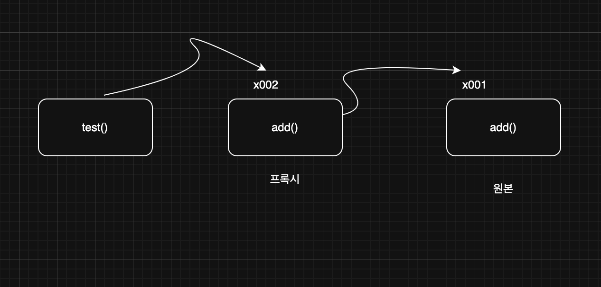

> 해당 블로그 글은 [영한님의 인프런 강의](https://inf.run/6oSgn)를 바탕으로 쓰여진 글입니다.

## 동시성 컬렉션이 필요한 이유1 - 시작

자바에서 제공하는 컬렉션 프레임워크는 CAS를 제공할까?

> ✅ 참고
>
> 여러 스레드가 동시에 접근해도 괜찮은 경우를 **스레드 세이프(Thread Safe)**하다고 한다.

한번 우리가 직접 컬렉션 프레임워크 중 `ArrayList`를 구현하면서 테스트 해보자.

``` java
package thread.collection.simple.list;

public interface SimpleList {

    int size();

    void add(Object e);

    Object get(int index);
}
```

위와 같이 인터페이스를 구현하고 해당 구현체를 만들어 보자.

``` java
package thread.collection.simple.list;

import java.util.Arrays;

import static util.ThreadUtils.sleep;

public class BasicList implements SimpleList {

    private static final int DEFAULT_CAPACITY = 5;

    private Object[] elementData;

    private int size = 0;

    public BasicList() {
        elementData = new Object[DEFAULT_CAPACITY];
    }

    @Override
    public int size() {
        return size;
    }

    @Override
    public void add(Object e) {
        elementData[size] = e;
        sleep(100);
        size++;
    }

    @Override
    public Object get(int index) {
        return elementData[index];
    }

    @Override
    public String toString() {
        return Arrays.toString(Arrays.copyOf(elementData, size)) + " size = " + size +
                " capacity = " + elementData.length;
    }
}
```

위의 코드를 보면 알겠지만 `add()`는 CAS가 될 수 없다. 왜냐하면 연산이 쪼개져 있기 때문이다.

## 동시성 컬렉션이 필요한 이유2 - 동시성 문제

``` java
public void add(Object e) {
    elementData[size] = e;
    sleep(100);
    size++;
}
```

위의 코드는 원자적이지 못한 연산이다. 이 메서드는 단순히 데이터를 추가하는 것으로 끝나지 않는다. 내부에 있는 배열에 데이터를 추가해야 하고, `size`도 함께 하나 증가시켜야 한다. 심지어 `size++` 연산 자체도 원자적이지 않다. `size++` 연산은 `size = size + 1` 연산과 같다. 또한 실제 `ArrayList`에서는 `capacity`값이 넘어가려고 한다면 배열을 복사하고 옮기는 과정도 필요하다. 한번 멀티스레드 상황을 재현해보면서 이전에 만든 `List`를 사용해보겠다.

``` java
package thread.collection.simple;

import thread.collection.simple.list.BasicList;
import thread.collection.simple.list.SimpleList;

import static util.MyLogger.log;

public class SimpleListMainV2 {
    public static void main(String[] args) throws InterruptedException {
        test(new BasicList());
    }

    private static void test(SimpleList list) throws InterruptedException {
        log(list.getClass().getSimpleName());

        Runnable addA = () -> {
            list.add("A");
            log("Thread-1: list.add(A)");
        };

        Runnable addB = () -> {
            list.add("B");
            log("Thread-2: list.add(B)");
        };

        Thread thread1 = new Thread(addA, "Thread-1");
        Thread thread2 = new Thread(addB, "Thread-2");

        thread1.start();
        thread2.start();

        thread1.join();
        thread2.join();

        log(list);
    }
}
```

결과를 보면 이상한 결과가 나온 것을 확인할 수 있다. size는 2인데 데이터는 B만 담기는 현상처럼 말이다. 아마 이렇게 진행되었을 것이다. `Thread-1`과 `Thread-2`가 동시에 `add()` 메서드에 접근한다. `Thread-1`이 조금 더 빨리 들어와서 0번 인덱스에 A를 집어 넣었다. 그리고 바로 `TIMED_WAITING`상태로 들어갔다. 바로 `Thread-2`가 들어와서 0번 인덱스에 B로 변경하였고 `TIMED_WAITING`상태로 변경하였다. 그리고 `Thread-1`이 먼저 깨어나 size값을 읽고 1로 증가시켰다. 다음 `Thread-2`가 size값을 읽고 2로 증가시킨 것이다. 물론 상황이 달라져서 `Thread-2`가 먼저 실행하여 size값을 읽고 더하려는데 그 때 `Thread-1`이 일어나서 size값을 읽고 1로 변경 후 `Thread-2`가 후에 1로 변경할 수 있는 상황도 존재한다. 이처럼 일반적인 컬렉션들은 절대로! 스레드 세이프 하지 않다! 단일 스레드가 컬렉션에 접근하는 경우라면 아무런 문제가 없지만, 멀티스레드 상황에서 여러 스레드가 동시에 컬렉션에 접근하는 경우라면 `java.util` 패키지가 제공하는 일반적인 컬렉션들은 사용하면 안된다!

## 동시성 컬렉션이 필요한 이유3 - 동기화

여러 스레드가 접근해야 한다면 `synchronized`, `Lock` 등을 통해 안전한 임계 영역을 적절히 만들면 문제를 해결할 수 있다.

``` java
package thread.collection.simple.list;

import java.util.Arrays;

import static util.ThreadUtils.sleep;

public class SyncList implements SimpleList {

    private static final int DEFAULT_CAPACITY = 5;

    private Object[] elementData;

    private int size = 0;

    public SyncList() {
        elementData = new Object[DEFAULT_CAPACITY];
    }

    @Override
    public synchronized int size() {
        return size;
    }

    @Override
    public synchronized void add(Object e) {
        elementData[size] = e;
        sleep(100);
        size++;
    }

    @Override
    public synchronized Object get(int index) {
        return elementData[index];
    }

    @Override
    public synchronized String toString() {
        return Arrays.toString(Arrays.copyOf(elementData, size)) + " size = " + size +
                " capacity = " + elementData.length;
    }
}
```

`synchronized`를 사용하여 임계영역을 설정하여 동시성 문제를 해결하였다. 그런제 문제 상황이 있다. `BasicList` 코드가 있는데, 이 코드를 거의 그대로 복사해서 `synchronized` 기능만 추가한 `SyncList` 를 만들었다. 하지만 이렇게 되면 모든 컬렉션을 다 복사해서 동기화 용으로 새로 구현해야 한다. 이것은 매우 비효율적이다.

## 동시성 컬렉션이 필요한 이유4 - 프록시 도입

`ArrayList`,`LinkedList`,`HashSet`,`HashMap` 등의 코드도 모두 복사해서 `synchronized` 기능을 추가한 코드를 만들어야 할까? 실제로 자바는 그렇지 않다. 기존 코드를 그대로 사용하면서 `synchronized` 기능만 살짝 추가하고 싶다면 어떻게 하면 좋을까? 바로 프록시를 이용하는 방법이 있다.

### 프록시

프록시를 쉽게 풀어서 설명하자면 친구에게 대신 음식을 주문해달라고 부탁하는 상황을 생각해 볼 수 있다. 예를 들어, 당신이 피자를 먹고 싶은데, 직접 전화하는 게 부담스러워서 친구에게 대신 전화해서 피자를 주문해달라고 부탁한다고 해보자. 친구가 피자 가게에 전화를 걸어 주문하고, 피자가 도착하면 당신에게 가져다주는 것이다. 여기서 친구가 프록시 역할을 하는 것이다. 즉, 우리 코드에서는 프록시가 `synchronized`를 걸어주면 되는 것이다.

``` java
package thread.collection.simple.list;

public class SyncProxyList implements SimpleList {

    private SimpleList target;

    public SyncProxyList(SimpleList target) {
        this.target = target;
    }

    @Override
    public synchronized int size() {
        return target.size();
    }

    @Override
    public synchronized void add(Object e) {
        target.add(e);
    }

    @Override
    public synchronized Object get(int index) {
        return target.get(index);
    }

    @Override
    public synchronized String toString() {
        return target.toString() + " by " + this.getClass().getSimpleName();
    }
}
```

위의 코드는 프록시 클래스이다. 해당 프록시 클래스는 `BasicList`처럼 `SimpleList`를 구현하고 있다. 그리고 대상체를 가지고 있는데 그 대상체를 추상적인 인터페이스를 가지고 있다. 이러면 어떻게 되냐면 해당 대상체로 `SimpleList` 구현체들이 들어올 수 있는 것이다. 그리고 구현 메서드 내용은 이 대상체의 메서드들을 호출해주는 것뿐이다.



위의 그림처럼 `test`메서드는 파라미터로 추상적인 것인 정적 의존 관계로 맺고 있다. 즉, `SimpleList`라는 것을 받고 있고 해당 구현체들은 다 올 수 있는 것이다. `test` 메서드 입장에서는 해당 구현체만 온다면 어떤 구현체든 상관 없다. 그리고 런타임 의존관계로 `SyncProxyList`를 받는다. 그리고 이 프록시 클래스가 원본인 `BasicList`를 받는 것이다. `test` 메서드 입장에서는 원본이 누군지 알 수가 없다. 그래서 원본이 바껴도 상관이 없는 것이다. 비유적으로 말하면 친구한테 피자좀 시켜달라고 했고 그 친구는 피자 브랜드중 도미노 피자를 주문할지, 피자 헛을 주문할지는 나는 상관이 없는 것이다. 내가 원하는 것은 추상적인 피자만 원한것이기 때문이다.

### 프록시 패턴

지금까지 우리가 구현한 것이 바로 프록시 패턴이다. **프록시 패턴(Proxy Pattern)**은 객체지향 디자인 패턴 중 하나로, 어떤 객체에 대한 접근을 제어하기 위해 그 객체의 대리인 또는 인터페이스 역할을 하는 객체를 제공하는 패턴이다. 프록시 객체는 실제 객체에 대한 참조를 유지하면서, 그 객체에 접근하거나 행동을 수행하기 전에 추가적인 처리를 할 수 있도록 한다.

#### 프록시 패턴의 목적

- 접근 제어: 실제 객체에 대한 접근을 제한하거나 통제할 수 있다.
- 성능 향상: 실제 객체의 생성을 지연시키거나 캐싱하여 성능을 최적화할 수 있다.
- 부가 기능 제공: 실제 객체에 추가적인 기능(로깅, 인증, 동기화 등)을 투명하게 제공할 수 있다.

> ✅ 참고
>
> 스프링의 AOP 기능은 사실 이런 프록시 패턴을 극한으로 적용하는 예이다.

## 자바 동시성 컬렉션1 - synchronized

자바가 제공하는 컬렉션 프레임워크는 스레드 세이프하지 못하다. 우리가 일반적으로 사용하는 `ArrayList`,`LinkedList`,`HashSet`,`HashMap` 등 수 많은 기본 자료 구조들은 내부에서 수 많은 연산들이 함께 사용된다. 배열에 데이터를 추가하고 사이즈를 변경하고, 배열을 새로 만들어서 배열의 크기도 늘리고, 노드를 만들어서 링크에 연결하는 등 수 많은 복잡한 연산이 함께 사용된다.

그러면 애초에 설계부터 그냥 `synchronized`를 걸어두었으면 어떻게 될까? 성능이 안 좋아진다. 저번에 비교하면서 테스트를 해보았을 때도 동기화 락을 안 거는 것이 제일 빨랐다. 그리고 컬렉션이 항상 멀티스레드에서 사용되는 것도 아니다. 미리 동기화를 해둔다면 단일 스레드에서 사용할 때 동기화로 인해 성능이 저하된다. 따라서 동기화의 필요성을 정확히 판단하고 꼭 필요한 경우에만 동기화를 적용하는 것이 필요하다.

> ✅ 참고
>
> 과거에 자바는 이런 실수를 한번 했다. 그것이 바로 `java.util.Vector` 클래스이다. 이 클래스는 지금의 `ArrayList`와 같은 기능을 제공하는데, 메서드에 `synchronized`를 통한 동기화가 되어 있다. 쉽게 이야기해서 동기화된 `ArrayList`이다. 그러나 이에 따라 단일 스레드 환경에서도 불필요한 동기화로 성능이 저하되었고, 결과적으로 `Vector`는 널리 사용되지 않게 되었다. 지금은 하위 호환을 위해서 남겨져 있고 다른 대안이 많기 때문에 사용을 권장하지 않는다.

이런 문제로 자바는 프록시 패턴을 이용하여 동기화를 이룰 수 있게 해주는 메서드를 제공한다. 바로 `Collections.synchronizedList(target)`같은 것으로 말이다. 코드를 살펴보자.

``` java
package thread.collection.java;

import java.util.ArrayList;
import java.util.Collections;
import java.util.List;

public class SynchronizedListMain {
    public static void main(String[] args) {
        List<String> list = Collections.synchronizedList(new ArrayList<>());
        list.add("data1");
        list.add("data2");
        list.add("data3");

        System.out.println(list.getClass());
        System.out.println("list = " + list);
    }
}
```

위의 코드를 보면 정확하게 우리가 이전에 구현했던 그대로인 것을 볼 수 있다. `Collections.synchronizedList(target)`은 `SynchronizedRandomAccessList`를 반환하는데 해당 클래스에 메서드가 `synchronized`가 걸려있다.

`Collections` 는 다음과 같이 다양한 `synchronized` 동기화 메서드를 지원한다. 이 메서드를 사용하면 `List`,`Collection`,`Map`,`Set` 등 다양한 동기화 프록시를 만들어낼 수 있다.

- `synchronizedList()`
- `synchronizedCollection()`
- `synchronizedMap()`
- `synchronizedSet()`
- `synchronizedNavigableMap()`
- `synchronizedNavigableSet()`
- `synchronizedSortedMap()`
- `synchronizedSortedSet()`

### synchronized 프록시 방식의 단점

- 첫째, 동기화 오버헤드가 발생한다. 비록 `synchronized` 키워드가 멀티스레드 환경에서 안전한 접근을 보장하지만, 각 메서드 호출 시마다 동기화 비용이 추가된다. 이로 인해 성능 저하가 발생할 수 있다.
- 둘째, 전체 컬렉션에 대해 동기화가 이루어지기 때문에, 잠금 범위가 넓어질 수 있다. 이는 잠금 경합(lock contention)을 증가시키고, 병렬 처리의 효율성을 저하시키는 요인이 된다. 모든 메서드에 대해 동기화를 적용하다 보면, 특정 스레드가 컬렉션을 사용하고 있을 때 다른 스레드들이 대기해야 하는 상황이 빈번해질 수 있다.
- 셋째, 정교한 동기화가 불가능하다. `synchronized` 프록시를 사용하면 컬렉션 전체에 대한 동기화가 이루어지지만, 특정 부분이나 메서드에 대해 선택적으로 동기화를 적용하는 것은 어렵다. 이는 과도한 동기화로 이어질 수 있다.

이런 단점으로 인해 자바는 `java.util.concurrent` 패키지에 동시성 컬렉션들을 제공한다.

## 자바 동시성 컬렉션2 - 동시성 컬렉션

자바 1.5부터 동시성에 대한 많은 혁신이 이루어졌다. 그 중에 동시성을 위한 컬렉션도 있다. 여기서 말하는 동시성 컬렉션은 스레드 안전한 컬렉션을 뜻한다. `java.util.concurrent` 패키지에는 고성능 멀티스레드 환경을 지원하는 다양한 동시성 컬렉션 클래스들을 제공한다. 이 컬렉션들은 더 정교한 잠금 메커니즘을 사용하여 동시 접근을 효율적으로 처리하며, 필요한 경우 일부 메서드에 대해서만 동기화를 적용하는 등 유연한 동기화 전략을 제공한다.

여기에 다양한 성능 최적화 기법들이 적용되어 있는데, `synchronized`,`Lock`(`ReentrantLock`),`CAS`, 분할 잠금 기술(segment lock)등 다양한 방법을 섞어서 매우 정교한 동기화를 구현하면서 동시에 성능도 최적화했다.

### 동시성 컬렉션 종류

- `List`
    - `CopyOnWriteArrayList` -> `ArrayList`의 대안
- `Set`
    - `CopyOnWriteArraySet` -> `HashSet`의 대안
    - `ConcurrentSkipListSet` -> `TreeSet`의 대안(정렬된 순서 유지, `Comparator` 사용 가능)
- `Map`
    - `ConcurrentHashMap` : `HashMap`의 대안
    - `ConcurrentSkipListMap` : `TreeMap`의 대안(정렬된 순서 유지, `Comparator` 사용 가능)
- `Queue`
    - `ConcurrentLinkedQueue` : 동시성 큐, 비 차단(non-blocking) 큐이다.
- `Deque`
    - `ConcurrentLinkedDeque` : 동시성 데크, 비 차단(non-blocking) 큐이다.
- `BlockingQueue`
    - `ArrayBlockingQueue`
        - 크기가 고정된 블로킹 큐
        - 공정(fair) 모드를 사용할 수 있다. 공정(fair) 모드를 사용하면 성능이 저하될 수 있다.
    - `LinkedBlockingQueue`
        - 크기가 무한하거나 고정된 블로킹 큐
    - `PriorityBlockingQueue`
        - 우선순위가 높은 요소를 먼저 처리하는 블로킹 큐
    - `SynchronousQueue`
        - 데이터를 저장하지 않는 블로킹 큐로, 생산자가 데이터를 추가하면 소비자가 그 데이터를 받을 때까지 대기한다. 생산자-소비자 간의 직접적인 핸드오프(hand-off) 메커니즘을 제공한다. 쉽게 이야기해서 중간에 큐 없이 생산자, 소비자가 직접 거래한다.
    - `DelayQueue`
        - 지연된 요소를 처리하는 블로킹 큐로, 각 요소는 지정된 지연 시간이 지난 후에야 소비될 수 있다. 일정 시간이 지난 후 작업을 처리해야 하는 스케줄링 작업에 사용된다.

> ✅ 참고
>
> `LinkedHashSet`,`LinkedHashMap`처럼 입력 순서를 유지하는 동시에 멀티스레드 환경에서 사용할 수 있는 `Set`,`Map` 구현체는 제공하지 않는다. 필요하다면 `Collections.synchronizedXxx()`를 사용해야 한다.

> 잘못된 지식이 있을 경우 댓글로 남겨주시면 빠르게 반영하겠습니다!