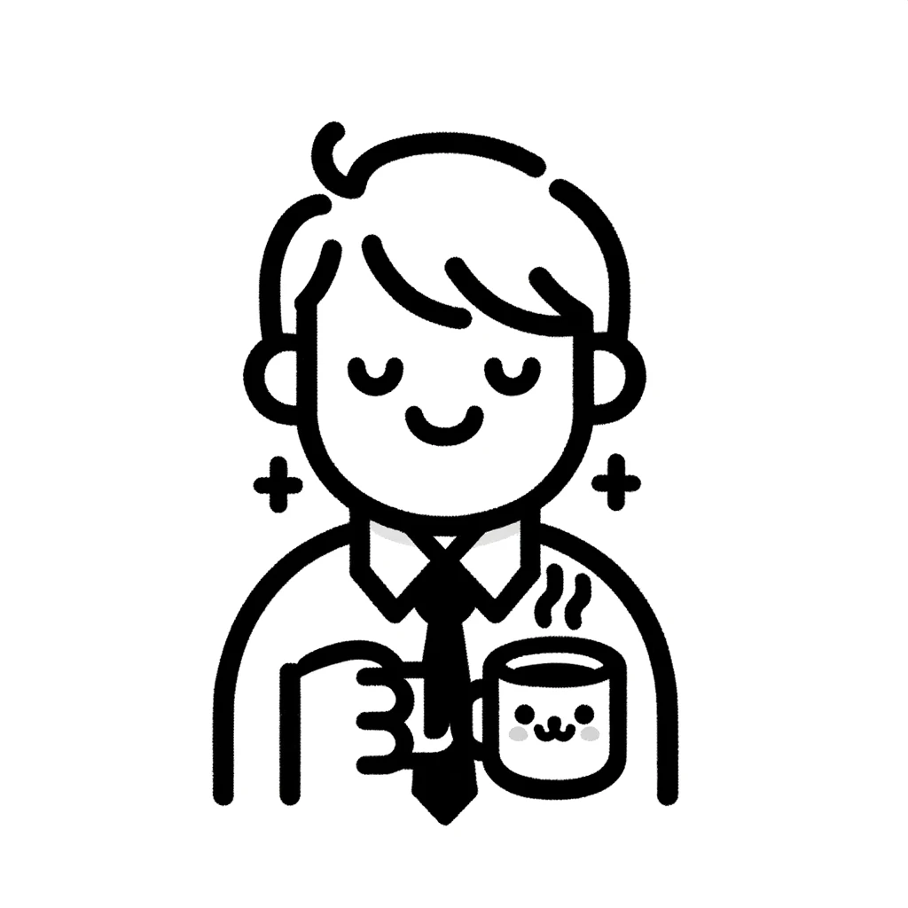
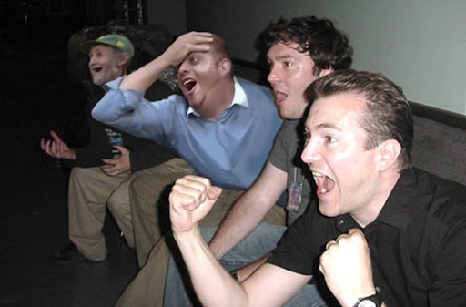

 

> ⚠️ 본 포스트는 순수히 저의 생각을 정리한 것이므로 오해의 소지가 없으시길 바랍니다.

### 라떼 개발자 (feat. 인프런 워밍업 스터디 클럽)

우리는 가끔씩 다른 분들이 아래와 같은 말씀을 들은 경험이 있을 수도 있다.

> 라떼는 말이야~ 너 나이 때 이런 이런 것도 했어!

나도 최근에 이런 경험을 했다. 나는 인프런에서 주최하는 **인프런 워밍업 스터디 클럽**을 참여하게 되었다. 부트캠프 대상자로 신청을 받았지만 직장인인 나도 참여를 하고 싶어서 신청을 고민을 하고 ['개발바닥 유튜브 라방'](https://www.youtube.com/watch?v=u0hoYYYjd_k "'개발바닥 유튜브 라방'")에서 향로님께 이에 관련한 질문을 드렸다. 다행히도 신청을 해도 상관없으시다는 말에 진짜 환호성을 질렀다.

그리고 이번주 월요일부터 스터디 클럽 일정에 따라 진행하게 되었다. 하지만 직장인인 나에게 정말 힘든 일정이었다. 퇴근을 하고 해당 강의를 듣고 미션도 진행하고, 정말 중도에 포기하고 싶은 생각이 0.1ms 정도 들었다. 그러던 중에 유튜브에서 현재 월드 스타인 손흥민 선수의 아버지이신 손웅정 선생님께서 하신 말씀의 영상을 보게 되었다. 손웅정 선생님께서는 아이들을 가르치실 때 이런 말씀을 하셨습니다.

> "세계의 벽 절대 안 높아! 할 수 있어! 남자는 자신감! 일단 붙어봐야 될 거 아니야! 저질러보고! 깨지고! 박고! 가슴만 뛰는 게 축구선수가 아니라 가슴이랑 내가 같이 뛰어야 돼!!!"

손웅정 선생님 말씀처럼 조금 나태해진 저를 **'인프런 워밍업 클럽 스터디'**를 통하여 한번 저질러 보고 미션이나 강의를 들으면서 한번 깨져도 보고 가슴만 뛰는 게 아닌 가슴과 열정과 제 학습곡선이 같이 뛰었으면 하는 바람으로 열심히 해보겠다는 마음을 가지고 다시 강의와 미션을 시작하게 되었다.

그리고 벌써 **'인프런 워밍업 클럽 스터디'를** 시작한 지 1주 차가 마무리되었다. 강의와 미션을 수행하면서 날밤도 세보고 하나하나 주제를 깊게 파면서 학습곡선도 증가를 하게 된 것 같았다. 또한 여러 트러블 슈팅을 맞이하게 되었고 이것을 하나하나 클리어해 나갔다.

> 🛠 트러블 슈팅의 대표적 예  
> 개발바닥 1사로에서 공유를 했던 경험이 있지만, Spring Boot 3.2에서 사용되는 Spring Framework 버전은 더 이상   
> 바이트코드를 구문 분석하여 매개변수 이름을 추론하려고 시도하지 않는다고 한다.  
>   
> 따라서 @RequestParam과 같은 어노테이션에 name 속성을 추가해 명시를 하던가, 빌드 툴을 IntelliJ에서 gradle로 변경을 하여 해결해 갔다. 자세한 내용은 따른 포스트로 다뤄보겠다.

그러면서 해결해 나간 이슈들을 아는 지인분들께 공유드리면 살짝 자랑 아닌 자랑을 했다. 하지만 그 지인분들 중 한 분은 아래와 같이 말씀하셨다.

> 라떼는 말이이에요~ 성빈님 나이 때 ~까지 했는데 겨우 이 정도 이슈해결로는 어디 명함도 못 내밀었죠 ㅋㅋㅋ

처음에 내 생각은 아래와 같이 생각을 하였다.

> "꼰x"인가? 라떼 소리는 군 생활할 때나 들어봤는데...  
> 아니지.. 내가 아직 별거 아닌 걸로 잘난 척했나 보구나.. 진짜 그 사람 입장에선 별게 아닐 텐데..

그러면서 잠시 낙담을 했다. 그런던 중 '낭만닥터 김사부'라는 드라마에서 한 명언을 보게 되었다.

> 누군가에게도 라떼의 시절이 존재한다. 이 라떼의 시절이 없다면 현재의 모습이 없을 거니까..

이 말을 듣고 울림이 컸다. 맞는 말이다. 누군가에게 다 라떼의 시절은 존재한다. 유명한 개발자분들, CTO분들도 다 라떼의 시절은 존재하기 마련이기 때문이다. 그 라떼가 없다면 현재 그분들도 이렇게 있을 수가 없을 테니 말이다. 그러면서 나도 생각을 했다. 스터디 클럽을 진행하면서 마주하는 에러, 이해하기 힘든 개념들, 실무에서 마주하는 버그들 이런 것을 하나하나 해결해 가는 그 하루하루가, 위의 이슈를 해결했던 그 하루가 나의 라떼중에 하루가 될테니 말이다.

이렇게 꾸준히 하루하루 공부하고 깨지고 해결해가는 하나의 라떼를 쌓기 위해 나중에 나만의 라떼를 완성하기 위해 더욱 열심히 해볼 계획이다.