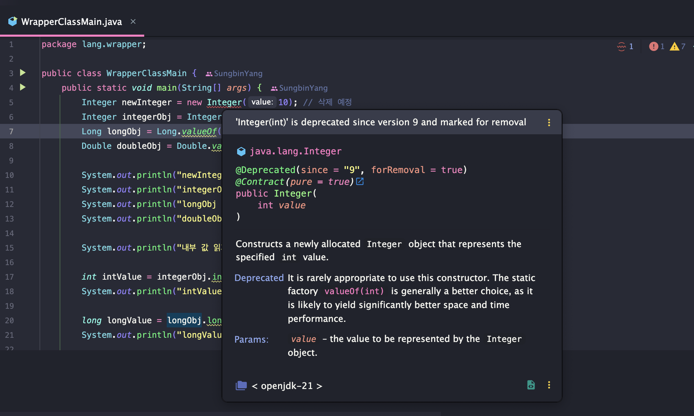
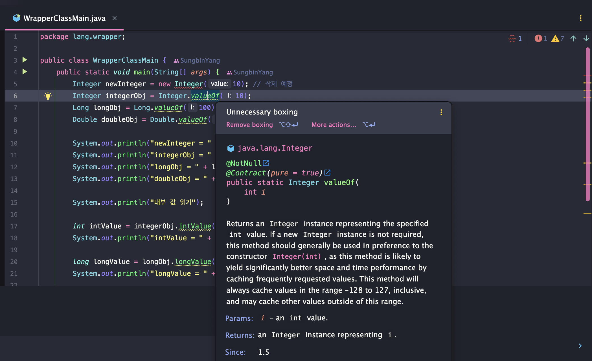

> 해당 블로그 글은 [영한님의 인프런 강의](https://inf.run/FiFGQ)를 바탕으로 쓰여진 글입니다.

## 래퍼 클래스 - 기본형의 한계1

### 기본형의 한계

자바는 객체 지향 언어이다. 그런데 자바 안에 객체가 아닌 것이 있다. 바로 `int`,`double` 같은 기본형(Primitive Type)이다. 즉, 기본형 타입은 객체가 아니기 때문에 아래와 같은 단점이 존재한다.

- 객체가 아니다: 기본형 데이터는 객체가 아니기에 객체의 행동 즉, 메서드를 가질 수 없다.
- null을 가질 수 없다: null이 무조건 안 좋은 것만은 아니다. 때로는 "값이 없다"라는 표현을 가지고 싶은 경우가 있을 것이다. 하지만 기본형 타입은 객체가 아니기에 "값이 없다"라는 표현을 하지 못한다.

그러면 한번 예제를 통해 위의 단점들을 확실히 느껴보자.

``` java
package lang.wrapper;

public class MyIntegerMethodMain0 {
    public static void main(String[] args) {
        int value = 10;
        int i1 = compareTo(value, 5);
        int i2 = compareTo(value, 10);
        int i3 = compareTo(value, 20);

        System.out.println("i1 = " + i1);
        System.out.println("i2 = " + i2);
        System.out.println("i3 = " + i3);
    }

    public static int compareTo(int value, int target) {
        if (value < target) {
            return -1;
        } else if (value > target) {
            return 1;
        } else {
            return 0;
        }
    }
}
```

위의 코드는 값을 비교하는 프로그램이다. 여기서 객체지향의 진심인 자바는 뭔가 불만스러워 진다. value자체를 객체로 표현한다면 `compareTo`라는 메서드는 객체 내부로 가지고 올 수 있을 것 같다. 하지만 value는 `int`라는 기본형 타입이므로 메서드를 가질 수 없다. 따라서 value 데이터를 객체로 변경해보려고 한다.

``` java
package lang.wrapper;

public class MyInteger {

    private final int value;

    public MyInteger(int value) {
        this.value = value;
    }

    public int getValue() {
        return value;
    }

    public int compareTo(int target) {
        if (value < target) {
            return -1;
        } else if (value > target) {
            return 1;
        } else {
            return 0;
        }
    }

    @Override
    public String toString() {
        return String.valueOf(value);
    }
}
```

위와 같이 value데이터를 객체로 표현하였고 static 메서드로 작성된 `compareTo`를 객체 내부로 가져와서 행동을 정의하였다. 이제 조금 객체 지향적으로 아래와 같이 코드를 작성 할 수 있을 것이다.

``` java
package lang.wrapper;

public class MyIntegerMethodMain1 {
    public static void main(String[] args) {
        MyInteger myInteger = new MyInteger(10);
        int i1 = myInteger.compareTo(5);
        int i2 = myInteger.compareTo(10);
        int i3 = myInteger.compareTo(20);

        System.out.println("i1 = " + i1);
        System.out.println("i2 = " + i2);
        System.out.println("i3 = " + i3);
    }
}
```

## 래퍼 클래스 - 기본형의 한계2

### 기본형과 null

기본형은 항상 값을 가져야 한다. 하지만 때로는 데이터가 '없음'이라는 상태가 필요할 수 있다. 그럼 어느 경우에 값이 '없음'이라는 상태가 필요할까? 바로 아래의 코드를 보면 이해가 될 것이다.

``` java
package lang.wrapper;

public class MyIntegerNullMain0 {
    public static void main(String[] args) {
        int[] intArr = {-1, 0, 1, 2, 3};

        System.out.println(findValue(intArr, -1));
        System.out.println(findValue(intArr, 0));
        System.out.println(findValue(intArr, 1));
        System.out.println(findValue(intArr, 100));
    }

    private static int findValue(int[] intArr, int target) {
        for (int value : intArr) {
            if (value == target) {
                return value;
            }
        }

        return -1;
    }
}
```

정수형 배열을 선언하고 그 안에 찾는 값이 있는지 유무를 확인하는 것이다. 값을 찾으면 그 값을 반환하고 못 찾으면 -1을 반환한다. 하지만 문제점을 보면 -1이라는 값을 찾아도 -1이 반환되고 값을 못찾아고 -1이 반환되는 아이러니한 상황에 놓이게 된다. 그러면 우리가 이전에 만든 `MyInteger`를 이용해 코드를 변경해보자.

``` java
package lang.wrapper;

public class MyIntegerNullMain1 {
    public static void main(String[] args) {
        MyInteger[] intArr = {new MyInteger(-1), new MyInteger(0), new MyInteger(1)};

        System.out.println(findValue(intArr, -1));
        System.out.println(findValue(intArr, 0));
        System.out.println(findValue(intArr, 1));
        System.out.println(findValue(intArr, 100));
    }

    private static MyInteger findValue(MyInteger[] intArr, int target) {
        for (MyInteger myInteger : intArr) {
            if (myInteger.getValue() == target) {
                return myInteger;
            }
        }

        return null;
    }
}
```

위의 코드를 보면 알겠지만 `int`타입을 객체로 표현하였다. 그리고 값을 못찾으면 `null`을 반환하게끔 하였다. 이제 확실히 값이 없다라는 상태가 있으니 혼란스러운 결과를 방지할 수 있을 것이다. 물론 기본형을 객체로 만들었다고 다 좋은 것은 아니다. `null` 값을 반환하는 경우 잘못하면 `NullPointerException` 이 발생할 수 있기 때문에 주의해서 사용해야 한다.

## 래퍼 클래스 - 자바 래퍼 클래스

자바는 기본형에 대응하는 래퍼 클래스를 기본으로 제공한다.

- `byte` -> `Byte`
- `short` -> `Short`
- `int` -> `Integer`
- `long` -> `Long`
- `float` -> `Float`
- `double` -> `Double`
- `char` -> `Character`
- `boolean` -> `Boolean`

래퍼 클래스는 불변 클래스이며 비교연산자 대신에 `equals`메서드를 통하여 동등성 비교를 해야 한다. 그러면 코드를 통해 래퍼 클래스 사용법을 알아보자.

``` java
package lang.wrapper;

public class WrapperClassMain {
    public static void main(String[] args) {
        Integer newInteger = new Integer(10); // 삭제 예정
        Integer integerObj = Integer.valueOf(10);
        Long longObj = Long.valueOf(100);
        Double doubleObj = Double.valueOf(10.5);

        System.out.println("newInteger = " + newInteger);
        System.out.println("integerObj = " + integerObj);
        System.out.println("longObj = " + longObj);
        System.out.println("doubleObj = " + doubleObj);

        System.out.println("내부 값 읽기");

        int intValue = integerObj.intValue();
        System.out.println("intValue = " + intValue);

        long longValue = longObj.longValue();
        System.out.println("longValue = " + longValue);

        System.out.println("비교");
        System.out.println("==: " + (newInteger == integerObj));
        System.out.println("equals: " + newInteger.equals(integerObj));
    }
}
```

### 래퍼 클래스 생성 - 박싱

기본형을 래퍼 클래스로 변경하는 것을 마치 박스에 물건을 넣은 것 같다고 해서 **박싱(Boxing)**이라 한다. 또한 객체니까 `new` 연산자로 생성할 것 같아서 사용하면 안 된다. 지금은 작동하지만 IDE에서 곧 사라질 것이라고 경고를 띄워준다.



`new` 연산자 대신에 `valueOf`라는 static 메서드를 이용하여 생성하면 된다. 해당 메서드는 내부에 생성자를 호출해서 반환하는 로직으로 작성되어 있다. 추가로 해당 메서드는 최적화 기능도 존재한다. `-128~127`까지 문자열 상수 풀처럼 미리 Integer 클래스를 만들어 두고 해당 부분을 캐싱한다. 그래서 해당 범위의 숫자가 들어오면 캐싱된 인스턴스를 반환해주고 범위 밖이라면 새로운 인스턴스를 생성하는 것이다.

### intValue() - 언박싱(Unboxing)

래퍼 클래스에 기본형 데이터를 꺼내는 작업을 **언박싱(Unboxing)**이라고 한다. 메서드 명은 `xxxValue()`로 한다.

### equals / toString

래퍼 클래스 간 비교는 `equals` 메서드로 비교를 해야 한다. 해당 메서드를 래퍼 클래스는 상속받아 오버라이딩 해두었다. 또한 `toString`메서드도 기본형 값을 반환할 수 있게 오버라이딩 해두었다. 그래서 참조형 변수를 출력해도 해당 클래스에 들어있는 값이 그대로 출력하는 것이다.

## 래퍼 클래스 - 오토 박싱

기본형 타입의 값을 래퍼 클래스로 변환하려면 `valueOf`라는 static 메서드를 이용하여 박싱을 해줘야 한다. 또한 래퍼 클래스를 기본형 타입으로 변경하기 위해서는 `xxxValue()`라는 메서드를 이용하여 언박싱을 해줘야 한다. 하지만 이 과정이 매우 번거롭다. 그래서 자바1.5부터 오토 박싱(Auto-boxing), 오토 언박싱(Auto-Unboxing)을 지원한다.

``` java
package lang.wrapper;

public class AutoboxingMain2 {
    public static void main(String[] args) {
        int value = 7;
        Integer boxedValue = value;

        int unboxedValue = boxedValue;

        System.out.println("boxedValue = " + boxedValue);
        System.out.println("unboxedValue = " + unboxedValue);
    }
}
```

사실 IDE에서도 오토 박싱과 언박싱을 권장한다. 왜냐하면 오토 박싱과 언박싱을 사용하지 않고 `valueOf`나 `xxxValue`메서드를 사용하면 아래와 같이 경고가 뜨기 때문에 왠만하면 해당 오토박싱과 언박싱을 이용해보자!



## 래퍼 클래스 - 주요 메서드와 성능

### 주요 메서드

래퍼 클래스가 제공하는 주요 메서드를 코드를 통해 알아보자.

``` java
package lang.wrapper;

public class WrapperUtilsMain {
    public static void main(String[] args) {
        Integer i1 = Integer.valueOf(10);
        Integer i2 = Integer.valueOf("10");
        int intValue = Integer.parseInt("10");

        int compareResult = i1.compareTo(20);
        System.out.println("compareResult = " + compareResult);

        System.out.println("sum = " + Integer.sum(10, 20));
        System.out.println("min = " + Integer.min(10, 20));
        System.out.println("max = " + Integer.max(10, 20));
    }
}
```

- `valueOf`: 박싱. 래퍼타입을 반환한다. 만약 인수로 들어가는 타입의 래퍼타입으로 반환하려는 경우는 오토박싱을 이용하면 된다. 하지만 그 외에 다른 타입(ex. 문자열)일 경우는 오토박싱을 지원 안하기 때문에 해당 메서드를 사용해야 한다.
- `parseInt()` : 문자열을 기본형으로 변환한다. 래퍼클래스마다 해당 메서드가 `parseXXX()`로 존재한다.
- `compareTo()` : 내 값과 인수로 넘어온 값을 비교한다. 내 값이 크면 `1`, 같으면 `0`, 내 값이 작으면 `-1`을 반환한다.
- `Integer.sum()`, `Integer.min()`, `Integer.max()` : `static` 메서드이다. 간단한 덧셈, 작은 값, 큰 값 연산을 수행한다.

### 성능

기본형과 래퍼 클래스의 성능을 비교해보자. 과연 어느게 더 성능에 좋을까? 결과부터 말하면 기본형이 성능이 뛰어나다. 왜냐하면 기본형은 해당 데이터 값만 들어있지만 래퍼 클래스는 인스턴스이기 때문에 기본형 데이터 + 메서드 같은 메타데이터가 존재하기에 메모리를 더 많이 차지한다. 그러면 무조건 기본형을 사용해야 할까? 그것은 아니다! 사실 성능차이는 배치연산 같은 엄청 큰 수를 했을 때 유의미하게 보이고 그렇지 않으면 막 크게 차이나지는 않는다. CPU 연산을 아주 많이 수행하는 특수한 경우이거나, 수만~ 수십만 이상 연속해서 연산을 수행해야 하는 경우라면 기본형을 사용해서 최적화를 고려하자. 그렇지 않은 일반적인 경우라면 코드를 유지보수하기 더 나은 것을 선택하면 된다.

### 유지보수 vs 최적화

유지보수 vs 최적화를 고려해야 하는 상황이라면 유지보수하기 좋은 코드를 먼저 고민해야 한다. 특히 최신 컴퓨터는 매우 빠르기 때문에 메모리 상에서 발생하는 연산을 몇 번 줄인다고해도 실질적인 도움이 되지 않는 경우가 많다.

- 코드 변경 없이 성능 최적화를 하면 가장 좋겠지만, 성능 최적화는 대부분 단순함 보다는 복잡함을 요구하고, 더 많은 코드들을 추가로 만들어야 한다. 최적화를 위해 유지보수 해야 하는 코드가 더 늘어나는 것이다. 그런데 진짜 문제는 최적화를 한다고 했지만 전체 애플리케이션의 성능 관점에서 보면 불필요한 최적화를 할 가능성이 있다.
- 특히 웹 애플리케이션의 경우 메모리 안에서 발생하는 연산 하나보다 네트워크 호출 한 번이 많게는 수십만배 더 오래 걸린다. 자바 메모리 내부에서 발생하는 연산을 수천번에서 한 번으로 줄이는 것 보다, 네트워크 호출 한 번을 더 줄이는 것이 더 효과적인 경우가 많다.
- 권장하는 방법은 개발 이후에 성능 테스트를 해보고 정말 문제가 되는 부분을 찾아서 최적화 하는 것이다.

## Class 클래스

자바에서 `Class` 클래스는 클래스의 정보(메타데이터)를 다루는데 사용된다. `Class` 클래스를 통해 개발자는 실행 중인 자바 애플리케이션 내에서 필요한 클래스의 속성과 메서드에 대한 정보를 조회하고 조작할 수 있다.

`Class`클래스는 다음과 같은 기능을 한다.

- ***타입 정보 얻기**: 클래스의 이름, 슈퍼클래스, 인터페이스, 접근 제한자 등과 같은 정보를 조회할 수 있다.
- **리플렉션**: 클래스에 정의된 메서드, 필드, 생성자 등을 조회하고, 이들을 통해 객체 인스턴스를 생성하거나 메서드를 호출하는 등의 작업을 할 수 있다.
- **동적 로딩과 생성**: `Class.forName()` 메서드를 사용하여 클래스를 동적으로 로드하고, `newInstance()` 메서드를 통해 새로운 인스턴스를 생성할 수 있다.
- **애노테이션 처리**: 클래스에 적용된 애노테이(annotation)을 조회하고 처리하는 기능을 제공한다.

`Class` 클래스의 생성방법은 총 3가지가 존재한다.

#### 클래스에서 조회

``` java
Class clazz = String.class;
```

#### 인스턴스에서 조회

``` java
Class clazz = new String().getClass();
```

#### 문자열에서 조회

``` java
Class clazz = Class.forName("java.lang.String");
```

위와 같이 문자열로 조회하는 경우는 체크예외가 발생함으로 반드시 예외처리를 해줘야 한다.

`Class` 클래스의 주요 기능은 아래와 같다. 수 많은 기능들이 존재하지만 지금은 해당 부분만 알아보자.

- **getDeclaredFields()**: 클래스의 모든 필드를 조회한다.
- **getDeclaredMethods()**: 클래스의 모든 메서드를 조회한다.
- **getSuperclass()**: 클래스의 부모 클래스를 조회한다.
- **getInterfaces()**: 클래스의 인터페이스들을 조회한다.

### 클래스 생성하기

`Class` 클래스에는 클래스의 모든 정보가 들어있다. 이 정보를 기반으로 인스턴스를 생성하거나, 메서드를 호출하고, 필드의 값도 변경할 수 있다. 코드를 통해 살펴보자.

``` java
Class clazz = Integer.class;
Integer integer = (Integer) clazz.getDeclaredConstructor().newInstance();

String str = integer.toString();
```

`getDeclaredConstructor()`는 생성자를 선택한다. 또한 `newInstance`는 선택된 생성자를 기반으로 인스턴스를 생성해준다.

### 리플렉션

`Class` 를 사용하면 클래스의 메타 정보를 기반으로 클래스에 정의된 메서드, 필드, 생성자 등을 조회하고, 이들을 통해 객체 인스턴스를 생성하거나 메서드를 호출하는 작업을 할 수 있다. 이런 작업을 리플렉션이라 한다. 추가로 애노테이션 정보를 읽어서 특별한 기능을 수행할 수 도 있다. 최신 프레임워크들은 이런 기능을 적극 활용한다.

## System 클래스

`System` 클래스는 시스템과 관련된 기본 기능들을 제공한다.

- **표준 입력, 출력, 오류 스트림**: `System.in`,`System.out`,`System.err` 은 각각 표준 입력, 표준 출력, 표준 오류 스트림을 나타낸다.
- **시간 측정**: `System.currentTimeMillis()` 와 `System.nanoTime()` 은 현재 시간을 밀리초 또는 나노초 단위로 제공한다.
- **환경 변수**: `System.getenv()` 메서드를 사용하여 OS에서 설정한 환경 변수의 값을 얻을 수 있다.
- **시스템 속성**: `System.getProperties()` 를 사용해 현재 시스템 속성을 얻거나 `System.getProperty(String key)`로 특정 속성을 얻을 수 있다. 시스템 속성은 자바에서 사용하는 설정 값이다.
- **시스템 종료**: `System.exit(int status)` 메서드는 프로그램을 종료하고, OS에 프로그램 종료의 상태 코드를 전달한다. 단, 해당 부분은 가급적 사용을 자제해야 한다.
    - 상태 코드 `0` : 정상 종료
    - 상태 코드 `0` 이 아님: 오류나 예외적인 종료
- **배열 고속 복사**: `System.arraycopy` 는 시스템 레벨에서 최적화된 메모리 복사 연산을 사용한다. 직접 반복문을 사용해서 배열을 복사할 때 보다 수 배 이상 빠른 성능을 제공한다.

## Math, Random 클래스

### Math 클래스

`Math`는 수 많은 수학 문제를 해결해주는 클래스이다. 많은 메서드들을 제공해주며 이것을 다 암기할 필요 없고 사용할 때 찾아보면서 적용해보면 된다. 지금은 예제코드 정도 수준만 알아보자.

``` java
package lang.math;

public class MathMain {
    public static void main(String[] args) {
        System.out.println("max(10, 20) = " + Math.max(10, 20)); // 최댓값
        System.out.println("min(10, 20) = " + Math.min(10, 20)); // 최솟값
        System.out.println("abs(-10) = " + Math.abs(-10)); // 절대값

        System.out.println("ceil(2.1) = " + Math.ceil(2.1)); // 올림
        System.out.println("floor(2.7) = " + Math.floor(2.7)); // 내림
        System.out.println("round(2.5) = " + Math.round(2.5)); // 반올림

        System.out.println("sqrt(4) = " + Math.sqrt(4)); // 제곱근
        System.out.println("random() = " + Math.random()); // 랜덤
    }
}
```

### Random 클래스

랜덤의 경우 `Math.random()` 을 사용해도 되지만 `Random` 클래스를 사용하면 더욱 다양한 랜덤값을 구할 수 있다.

> ✅ 참고
>
> Random 클래스는 java.util 패키지에 속한다.

``` java
package lang.math;

import java.util.Random;

public class RandomMain {
    public static void main(String[] args) {
        Random random = new Random();
//        Random rand = new Random(1);

        int randomInt = random.nextInt();
        System.out.println("randomInt = " + randomInt);

        double randomDouble = random.nextDouble();
        System.out.println("randomDouble = " + randomDouble);

        boolean randomBoolean = random.nextBoolean();
        System.out.println("randomBoolean = " + randomBoolean);

        int randomRange1 = random.nextInt(10);
        System.out.println("0 ~ 9:" + randomRange1);

        int randomRange2 = random.nextInt(10) + 1;
        System.out.println("1 ~ 10:" + randomRange2);
    }
}
```

- `random.nextInt()` : 랜덤 `int` 값을 반환한다.
- `nextDouble()` : `0.0d` ~ `1.0d` 사이의 랜덤 `double` 값을 반환한다.
- `nextBoolean()` : 랜덤 `boolean` 값을 반환한다.
- `nextInt(int bound)` : `0` ~ `bound` 미만의 숫자를 랜덤으로 반환한다.

#### Seed

랜덤은 내부에서 씨드(Seed)값을 사용해서 랜덤 값을 구한다. 그래서 항상 결과 값이 달라진다. 그런데 이 씨드 값이 같으면 항상 같은 결과가 출력된다.

``` java
Random random = new Random(1);
```

> 잘못된 지식이 있을 경우 댓글로 남겨주시면 빠르게 반영하겠습니다!