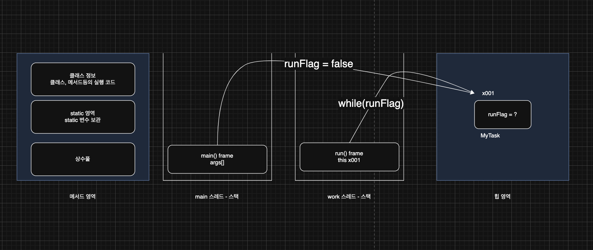
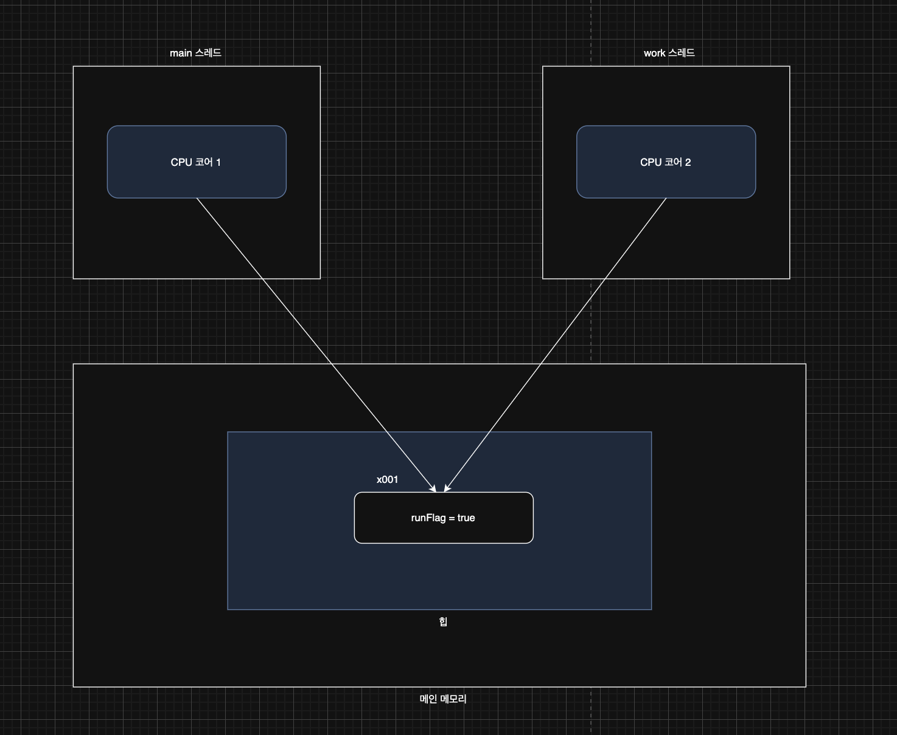
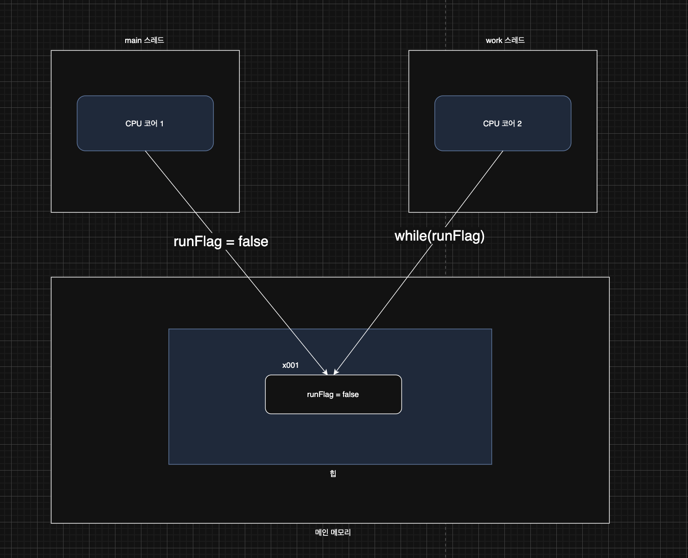
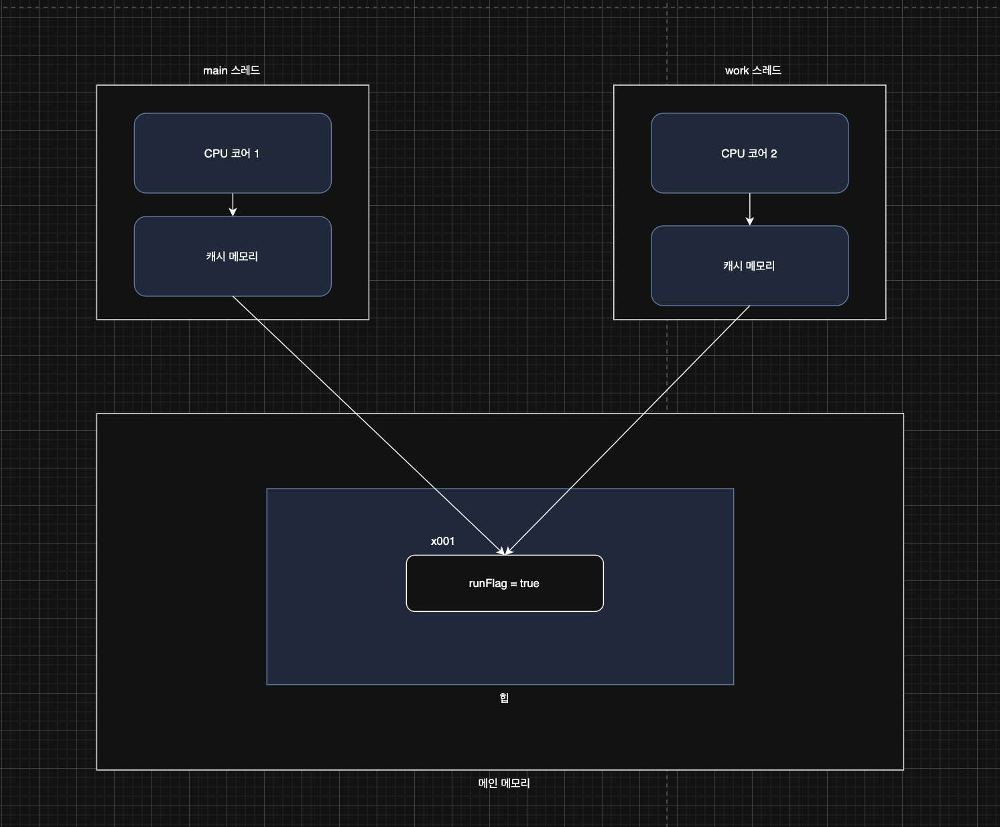
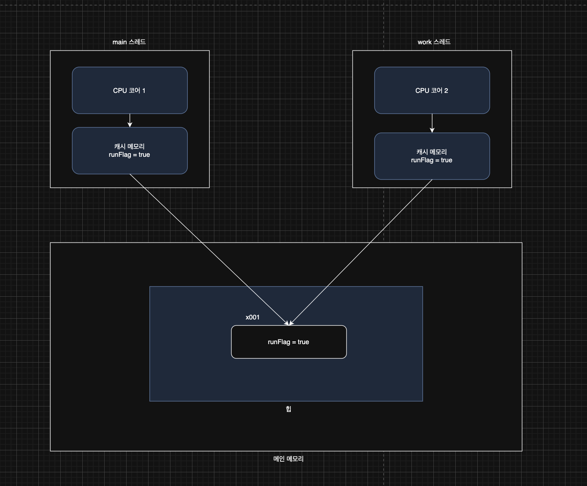
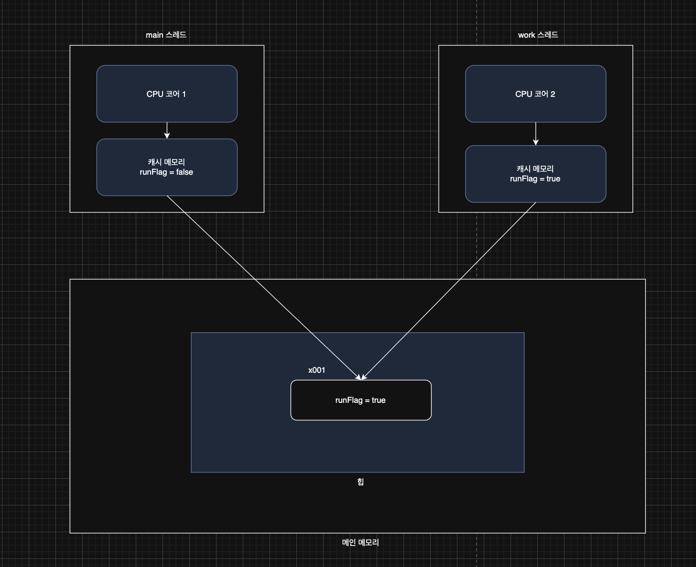

> 해당 블로그 글은 [영한님의 인프런 강의](https://inf.run/6oSgn)를 바탕으로 쓰여진 글입니다.

## volatile, 메모리 가시성1

`volatile`과 메모리 가시성을 이해하기 위해, 예제 코드를 살펴보자.

``` java
package thread.volatile1;

import static util.MyLogger.log;
import static util.ThreadUtils.sleep;

public class VolatileFlagMain {
    public static void main(String[] args) {
        MyTask task = new MyTask();
        Thread t = new Thread(task, "work");
        log("runFlag = " + task.runFlag);
        t.start();

        sleep(1000);
        log("runFlag를 false로 변경 시도");
        task.runFlag = false;
        log("runFlag = " + task.runFlag);
        log("main 종료");
    }

    static class MyTask implements Runnable {

       boolean runFlag = true;

        @Override
        public void run() {
            log("task 시작");

            while (runFlag) {
                // runFlag가 변하면 탈출
            }

            log("task 종료");
        }
    }
}
```

위의 코드는 `work` 스레드가 `MyTask`를 실행시킨다. `MyTask`안에 무한루프를 돌다가 `main` 스레드가 공유변수인 `runFlag`를 `false`로 변경하면 무한루프에 빠져나와 스레드가 종료 상태로 갈 것 같다는 생각을 하지만 실제로 돌려보면 그렇지 않다. 한번 그림을 통해 확인해보자.



`main` 스레드, `work` 스레드 모두 `MyTask` 인스턴스에 있는 `runFlag`를 사용한다. 이 값을 `false`로 변경하면 `work` 스레드의 작업을 종료할 수 있을 것 같지만 그렇지 않다. `main` 스레드가 `work` 스레드를 만들고 1초간 `TIMED_WAITING` 상태가 되다가 공유변수를 `false`로 변경한다. 심지어 공유변수 값도 변경이 되었다. 그런데 왜 `work` 스레드는 종료를 못하고 계속 `RUNNABLE` 상태일까?

## volatile, 메모리 가시성2

### 메모리 가시성 문제

멀티스레드는 이미 여러 스레드가 작동해서 안 그래도 이해하기 어려운데, 거기에 한술 더하는 문제가 있으니, 바로 메모리 가시성 문제이다. 이게 어떤 문제이고, 왜 이런 문제가 발생하는지 알아보자.



`main` 스레드와 `work` 스레드는 각각의 CPU 코어에 할당되어서 실행된다. 자바 프로그램을 실행하고 `main` 스레드와 `work` 스레드는 모두 메인 메모리의 `runFlag`의 값을 읽는다. 프로그램의 시작 시점에는 `runFlag`를 변경하지 않기 때문에 모든 스레드에서 `true`의 값을 읽는다. 그래서 `work` 스레드는 무한반복문을 계속 돈다.



`main` 스레드가 `runFlag`의 값을 `false`로 변경한다. 그러면 `work` 스레드가 그 값을 읽어서 무한루프를 탈출하고 종료상태가 되는게 우리가 예상했던 결과이다. 하지만 실제로 이렇게 동작하지를 않는다.

CPU는 처리 성능을 개선하기 위해 중간에 캐시 메모리라는 것을 사용한다.



메인 메모리는 CPU와 거리가 멀고 CPU가 직접적으로 접근하기에는 매우 느린 성능이 나온다. 그래서 CPU와 가깝고 빠른 메모리가 필요하게 되었는데 그게 캐시 메모리다. 캐시 메모리는 CPU와 가까이 붙어있고, 속도도 매우 빠른 메모리이다.

> ✅ 참고
>
> 캐시 메모리는 상대적으로 가격이 비싸기 때문에 큰 용량을 구성하기는 어렵다.

현대의 CPU 대부분은 코어 단위로 캐시 메모리를 각각 보유하고 있다.



각 스레드가 `runFlag`의 값을 사용하면 CPU는 이 값을 효율적으로 처리하기 위해 먼저 `runFlag`를 캐시 메모리에 불러온다. 그리고 이후에는 캐시 메모리에 있는 `runFlag`를 사용하게 된다.



그러다가 `runFlag`를 `main`스레드가 `false`로 값을 변경한다. 그러면 실제 메인 메모리의 값이 변경이 되는 것이 아니라 **캐시 메모리의 값이 변경이 되는 것이다.** 메인 메모리에는 결과가 즉시 반영이 되지 않는다. 따라서 `work` 스레드의 값이 변경이 안되기 때문에 무한루프에는 탈출이 안되는 것이다. 그러면 언제 메인 메모리에 반영이 될까? 극단적으로 말하면 평생 반영이 안될 수 있다. 하지만 보통 현대 컴퓨터에서는 캐시 메모리에서 메인 메모리로 값이 반영이 되는 시점은 컨텍스트 스위칭 시점이다. 물론, 컨텍스트 스위칭이 된다고 해도 무조건 캐시 메모리와 메인 메모리가 동기화 되지 않을 수 있다. 아무튼 컨텍스트 스위칭을 할 때 해당 스레드가 사용한 캐시 메모리를 PCB가 저장해두고 기존에 있는 값은 비워둬야 한다. 그러기에 그 때 메인 메모리로 값이 반영이 되는 것이다.

> ✅ 참고
>
> 컨텍스트 스위칭 시점은 `Thread.sleep()`이나 콘솔을 찍을 때 일어난다.

> ⚠️ 주의
>
> 컨텍스트 스위칭이 될 때 메인 메모리 값이 캐시 메모리로 변경되는 것은 그럴 수 있고 주로 그럴 수 있다는거지 반드시 그렇다고 보장해주지는 않는다.

이처럼 멀티스레드 환경에서 한 스레드가 변경한 값이 다른 스레드에서 언제 보이는지에 대한 문제를 메모리 가시성이라 한다. 이름 그대로 메모리에 변경한 값이 보이는가, 보이지 않는가의 문제이다.

## volatile, 메모리 가시성3

그럼 이 문제를 어떻게 해결할까? 공유 변수인 `runFlag` 앞에 `volatile`이라는 키워드를 붙여주면 해결이 된다. `volatile` 키워드를 붙이면 아래와 같이 캐시 메모리를 참조하는 것이 아니라 메인 메모리에 직접 접근하여 확인하는 것이다. 여러 스레드에서 같은 값을 읽고 써야 한다면 `volatile` 키워드를 사용하면 된다. 단 캐시 메모리를 사용할 때 보다 성능이 느려지는 단점이 있기 때문에 꼭! 필요한 곳에만 사용하는 것이 좋다.

## 자바 메모리 모델(Java Memory Model)

### 메모리 가시성 문제

멀티스레드 환경에서 한 스레드가 변경한 값이 다른 스레드에서 언제 보이는지에 대한 것을 메모리 가시성이라 한다. 이름 그대로 메모리에 변경한 값이 보이는가, 보이지 않는가의 문제이다.

### Java Memory Model

Java Memory Model(JMM)은 자바 프로그램이 어떻게 메모리에 접근하고 수정할 수 있는지를 규정하며, 특히 멀티 스레드 프로그래밍에서 스레드 간의 상호작용을 정의한다. JMM에 여러가지 내용이 있지만, 핵심은 여러 스레드들의 작업 순서를 보장하는 happens-before 관계에 대한 정의다.

### happens-before

happens-before 관계는 자바 메모리 모델에서 스레드 간의 작업 순서를 정의하는 개념이다. 만약 A 작업이 B 작업보다 happens-before 관계에 있다면, A 작업에서의 모든 메모리 변경 사항은 B 작업에서 볼 수 있다. 즉, A 작업에서 변경된 내용은 B 작업이 시작되기 전에 모두 메모리에 반영된다.

- happens-before 관계는 이름 그대로, 한 동작이 다른 동작보다 먼저 발생함을 보장한다.
- happens-before 관계는 스레드 간의 메모리 가시성을 보장하는 규칙이다.
- happens-before 관계가 성립하면, 한 스레드의 작업을 다른 스레드에서 볼 수 있게 된다.
- 즉, 한 스레드에서 수행한 작업을 다른 스레드가 참조할 때 최신 상태가 보장되는 것이다.

쉽게 이야기 해서 A작업이 B작업보다 먼저 발생하면 B작업은 A작업의 내용을 알 고 있어야 한다는 의미이다.

### happens-before 관계가 발생하는 경우

#### 프로그램 순서 규칙

단일 스레드 내에서, 프로그램의 순서대로 작성된 모든 명령문은 happens-before 순서로 실행된다.

#### volatile 변수 규칙

한 스레드에서 `volatile` 변수에 대한 쓰기 작업은 해당 변수를 읽는 모든 스레드에 보이도록 한다. 즉, `volatile` 변수에 대한 쓰기 작업은 그 변수를 읽는 작업보다 happens-before 관계를 형성한다.

#### 스레드 시작 규칙

한 스레드에서 `Thread.start()`를 호출하면, 해당 스레드 내의 모든 작업은 `start()` 호출 이후에 실행된 작업보다 happens-before 관계가 성립한다. 여기에서 `start()` 호출 전에 수행된 모든 작업은 새로운 스레드가 시작된 후의 작업보다 happens-before 관계를 가진다.

#### 스레드 종료 규칙

한 스레드에서 `Thread.join()`을 호출하면, join 대상 스레드의 모든 작업은 `join()`이 반환된 후의 작업보다 happens-before 관계를 가진다.

#### 인터럽트 규칙

한 스레드에서 `Thread.interrupt()` 를 호출하는 작업이, 인터럽트된 스레드가 인터럽트를 감지하는 시점의 작업보다 happens-before 관계가 성립한다. 즉, `interrupt()` 호출 후, 해당 스레드의 인터럽트 상태를 확인하는 작업이 happens-before 관계에 있다. 만약 이런 규칙이 없다면 인터럽트를 걸어도, 한참 나중에 인터럽트가 발생할 수 있다.

#### 객체 생성 규칙

객체의 생성자는 객체가 완전히 생성된 후에만 다른 스레드에 의해 참조될 수 있도록 보장한다. 즉, 객체의 생성자에서 초기화된 필드는 생성자가 완료된 후 다른 스레드에서 참조될 때 happens-before 관계가 성립한다.

#### 모니터 락 규칙

한 스레드에서 `synchronized` 블록을 종료한 후, 그 모니터 락을 얻는 모든 스레드는 해당 블록 내의 모든 작업을 볼 수 있다.

#### 전이 규칙

만약 A가 B보다 happens-before 관계에 있고, B가 C보다 happens-before 관계에 있다면, A는 C보다 happens-before 관계에 있다.

즉, 결론은 volatile 또는 스레드 동기화 기법을 사용하면 메모리 가시성의 문제가 발생하지 않는다라고 이해하자. 위의 내용은 절대 암기 할 내용은 아니니, 이런게 있다라고만 알아두자.
 
> 잘못된 지식이 있을 경우 댓글로 남겨주시면 빠르게 반영하겠습니다!