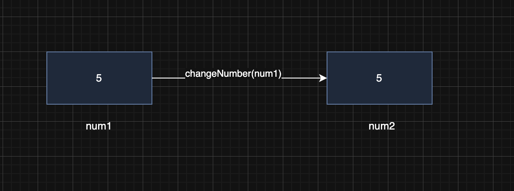
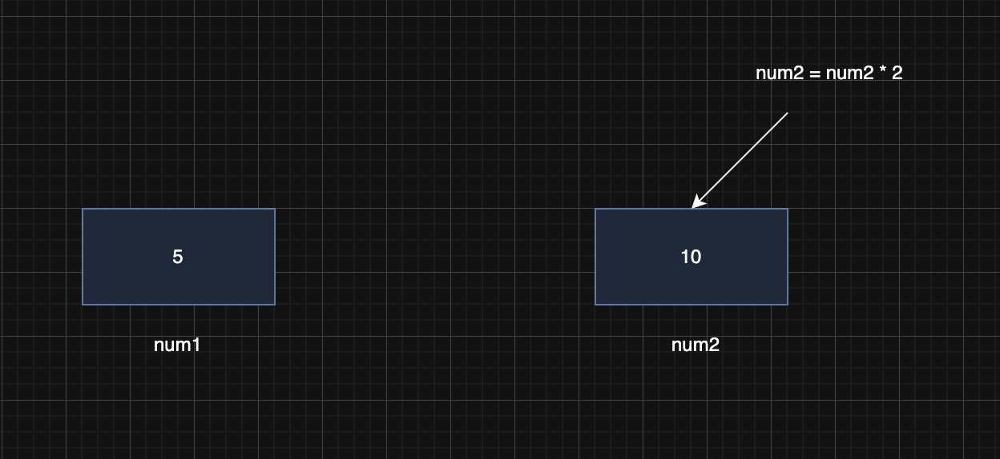

> 해당 블로그 글은 [영한님의 인프런 강의](https://inf.run/WUc1V)를 바탕으로 쓰여진 글입니다.

## 메서드 시작

메서드는 일종의 함수와 같다. 함수라고 막 1차 함수, 2차 함수, 삼각 함수 막 그런게 아니다. 그냥 단순한 함수라고 생각하자. 그러면 왜 메서드가 필요한지 먼저 알아보자.

``` java
package method;

public class Method1 {
    public static void main(String[] args) {
        int a = 1;
        int b = 2;

        System.out.println(a + "+" + b + " 연산 수행");

        int sum1 = a + b;

        System.out.println("결과1 출력: " + sum1);

        int x = 10;
        int y = 20;

        System.out.println(x + "+" + y + " 연산 수행");

        int sum2 = x + y;

        System.out.println("결과2 출력: " + sum2);
    }
}
```

위와 같은 코드가 있다고 하자. 뭔가 이 코드를 리팩토링 해볼 수 있을 것 같다. 배열로 해결할 수 있을 것 같고 혹은 반복문을 통해 해결도 가능한듯 보인다. 하지만 이 2가지로는 한계가 있다. 지금 로직 자체가 더하는 기능을 사용하고 있다. 물론 배열과 반복문으로 해결은 가능하겠지만 이 기능을 해당 파일이 아닌 다른 곳에서 사용한다면 이 2가지로는 힘들 것이다. 이래서 나온게 함수이다.

### 함수

우리가 수학시간에 배운 함수를 떠오르면 된다.

#### 함수 정의

``` java
f(x, y) = x + y
```

위의 수식을 수학시간에 많이 본 형태라 익숙할 것이다. 하지만 코딩에서는 아래와 같이 사용한다.

``` java
add(x, y) = x + y
```

여기서 add는 함수명이고 x와 y 2가지 input을 받아서 더하는 기능을 한다. 여러번 같은 계산을 해야 한다면 지금처럼 함수를 만들어두고(정의), 필요한 입력 값을 넣어서 해당 함수를 호출하
면 된다. 그러면 계산된 결과가 나온다. 또한 함수는 마치 블랙박스와 같다. 함수를 호출할 때는 외부에서는 필요한 값만 입력하면 된다. 그러면 계산된 결과가 출력된다. 우리는 이 함수가 어떻게 동작하는지 사용하는 입장에서는 몰라도 된다. 여기서 핵심은 함수를 한번 정의해두면 계속해서 재사용할 수 있다는 점이다!

## 메서드 사용

자바에서 함수를 메서드라고 한다. 사실 함수가 더 큰 범위이긴 하지만 지금은 그냥 함수랑 메서드를 동일시 생각해보자.

그러면 위의 예제 코드를 메서드를 이용해 한번 리팩토링 해보자.

``` java
package method;

public class Method1Ref {
    public static void main(String[] args) {
        int sum1 = add(5, 10);
        System.out.println("결과1 출력: " + sum1);

        int sum2 = add(15, 20);
        System.out.println("결과2 출력: " + sum2);

    }

    public static int add(int a, int b) {
        System.out.println(a + "+" + b + " 연산 수행");

        return a + b;
    }
}
```

이렇게 바꾸니 뭔가 조금 더 깔끔하다는 느낌이 든다.

### 메서드 정의

``` java
public static int add(int a, int b) {
    System.out.println(a + "+" + b + " 연산 수행");

    return a + b;
}
```

위의 코드가 바로 메서드이다. 메서드는 메서드 선언 부분과 본문으로 나눠진다.

### 메서드 선언

``` java
public static int add(int a, int b)
```

- `public static`
    - public과 static 키워드는 아직 안 배웠다.
    - 지금은 그냥 메서드 선언을 하려면 이렇게 해야한다라고만 알아두자.
- `int add(int a, int b)`
    - int는 메서드의 반환 타입을 의미한다. 여러타입이 올 수 있고 심지어 void라는 반환타입이 없을 수 있다.
    - add는 메서드 이름이다. 호출 할 때 해당 이름으로 호출한다.
    - (int a, int b)는 파라미터 혹은 매개변수라고 부르고 함수에서의 입력 값을 의미한다.

### 메서드 본문

``` java
{
    System.out.println(a + "+" + b + " 연산 수행");

    return a + b;
}
```

위의 부분이 메서드 본문이다. 메서드가 실행해야 할 코드들인 것이다. 메서드 본문은 블랙박스이다. **메서드를 호출하는 곳에서는 메서드 선언은 알지만 메서드 본문은 모른다.** 또한 메서드를 실행하고 나서 반환을 하고 싶으면 `return` 키워드를 사용해야하고 반환 타입과 일치해야 한다. 만약 반환 타입이 없는 void라면 `return`은 생략 가능하다.

### 메서드 호출

``` java
int result = add(1, 2);
```

메서드를 호출하려면 위와 같이 호출하면 된다. 메서드 이름을 부르고 들어가야 할 인자 값을 넣는다. 그럼 해당 인자 값이 메서드 파라미터로 넘어가서 수행하게 된다.

### 메서드 용어 정리

- 인수: 위의 코드처럼 메서드 호출부에 들어가는 값들을 인수라고 한다. 즉, 메서드 내부로 들어가는 값을 의미한다. 인자도 같은 의미이다.
- 매개변수, 파라미터: 매개변수, 파라미터는 같은 말이며 메서드 호출부와 메서드 내부 사이에서 값을 전달하는 역할을 하는 변수라는 뜻이다.

## 메서드 정의

``` java
제어자 반환타입 메서드이름(매개변수 목록) {
    메서드 본문
}
```

메서드를 정의할 때는 위와 같이 정의를 한다.

- 제어자: `public` , `static` 과 같은 부분이다. 제어자는 뒤에서 설명한다. 지금은 항상 `public static` 키워드를 입력하자.
- 반환 타입: 메서드가 실행 된 후 반환하는 데이터의 타입을 지정한다. 메서드가 값을 반환하지 않는 경우, 없다는 뜻의 `void` 를 사용해야 한다. ex. void print(String str)
- 메서드 이름: 메서드를 호출할 때 메서드 이름을 통해 호출을 한다.
- 매개변수: 입력 값으로, 메서드 내부에서 사용할 수 있는 변수이다. 매개변수는 옵션이다. 입력값이 필요 없는 메서드는 매개변수를 지정하지 않아도 된다. 
- 메서드 본문: 실제 메서드의 코드가 위치한다. 중괄호 `{}` 사이에 코드를 작성한다.

## 반환 타입

**반환 타입이 있다면 반드시 값을 반환해야 한다.** 물론 안 받는다고 문제가 되는 것은 아니다. 하지만 메서드 설계 의도와 다른 방향으로 개발하는 것은 옳지 못한 것이다. 만약 반환값이 없는 로직을 수행하고 싶다면 해당 메서드를 하나 더 만드는게 올바르다.

또한 반환타입이 있다면 return을 해줘야 하는데 이 부분은 조건문이 있을 때 유의해야 한다.

``` java
public static String correct(int selection) {
    if (selection == 3) {
        return "OK";
    }
}
```

위와 같이 코딩을 하면 에러가 발생한다. 이유는 파라미터 값이 3이 아닐 경우는 반환하고 있지 않기 때문이다. 따라서 아래와 같이 바꿔줘야 정상적으로 메서드를 완성한 것이다.

``` java
public static String correct(int selection) {
    if (selection == 3) {
        return "OK";
    }

    return "fail";
}
```

또한 return문을 만나면 즉시 해당 메서드르 빠져 나간다.

``` java
public static void checkAdult(int age) {
    if (age > 20) {
        System.out.println("성인");
        return;
    }

    System.out.println("미성년");
}
```

만약 파라미터 변수 값이 age가 20이상인 숫자가 인자로 넘어오면 아래 하단의 미성년 출력문은 수행을 안 한다.

## 메서드 호출과 값 전달1

여기서 아주 중요한 이야기를 하겠다. 자바 프로그램 코드를 분석하다보면 많이 이 원칙을 몰라서 무너지는 경우가 있다.

> **자바는 항상 값을 복사해서 대입한다.**

흔히 영어로 `Call By Value`라고 한다.

그럼 예제코드를 보면서 분석해보자.

``` java
package method;

public class MethodValue1 {
    public static void main(String[] args) {
        int num1 = 5;
        System.out.println("1. changeNumber 변경 전, num1: " + num1);

        changeNumber(num1);

        System.out.println("4. changeNumber 변경 후, num1: " + num1);

    }

    public static void changeNumber(int num2) {
        System.out.println("2. changeNumber 변경 전, num2: " + num2);
        num2 *= 2;
        System.out.println("2. changeNumber 변경 후, num2: " + num2);
    }
}
```



먼저 num1이라는 변수를 선언하고 5를 대입하였다. 그리고 `changeNumber()`라는 메서드를 만나고 인자로 num1을 넘겨준다. 그러면 넘겨줄 때 num1의 값 5를 복사해서 넘겨준다.



그러면 num1을 복사한 num2가 메서드 본문으로 내려와 계산을 하여 10으로 변경이 된다. 하지만 10으로 변경되었다고 해서 num1은 변경되지 않는다. 그 이유는 값을 복사해서 전달했기 때문이다.

## 메서드 호출과 값 전달2

그러면 어떻게 num1을 변경할 수 있을까? 바로 메서드에서 반환값을 반환하면 되는거다. 아래와 같이 변경하면 num1을 변경할 수 있다.

``` java
package method;

public class MethodValue1 {
    public static void main(String[] args) {
        int num1 = 5;
        System.out.println("1. changeNumber 변경 전, num1: " + num1);

        num1 = changeNumber(num1);

        System.out.println("4. changeNumber 변경 후, num1: " + num1);

    }

    public static int changeNumber(int num2) {
        System.out.println("2. changeNumber 변경 전, num2: " + num2);
        num2 *= 2;
        System.out.println("2. changeNumber 변경 후, num2: " + num2);

        return num2;
    }
}
```

## 메서드와 형변환

메서드를 호출할 때 형변환이 가능하다. 메서드 호출 시, 명시적 형변환과 묵시적 형변환에 대해 알아보자.

``` java
package method;

public class MethodCasting1 {
    public static void main(String[] args) {
        double number = 1.5;

        printNumber((int) number);
    }

    public static void printNumber(int n) {
        System.out.println("숫자: " + n);
    }
}
```

위와 같이 명시적 타입 형변환이 가능하며,

``` java
package method;

public class MethodCasting2 {
    public static void main(String[] args) {
        int number = 100;

        printNumber(number);
    }

    public static void printNumber(double n) {
        System.out.println("숫자: " + n);
    }
}
```

위와 같이 묵시적 형변환도 가능하다.

## 메서드 오버로딩

이름이 같고 매개변수가 다른 메서드를 여러개 정의하는 것을 메서드 오버로딩(Overloading)이라 한다.

그래서 자바에서는 아래와 같은 것들이 가능한 것이다.

``` java
int add(int a, int b)

int add(int a, int b, int c)

int add(int a, double b)

int add(double a, int b)
```

### 오버로딩 규칙

메서드의 이름이 같아도 매개변수의 타입 및 순서가 다르면 오버로딩을 할 수 있다. 참고로 반환 타입은 인정하지 않는
다. 즉, 아래와 같은 메서드는 오버로딩에 실패하는 것이다.

``` java
int add(int a, int b)

double add(int a, int b)
```

> 📚 용어정리: 메서드 시그니쳐
>
> `메서드 시그니처 = 메서드 이름 + 매개변수 타입(순서)`
>
> 메서드 시그니처는 메서드의 이름과 매개변수 타입(순서 포함)으로 구성되어 있다. 쉽게 이야기해서 메서드를 구분할 수 있는 기준이다. 자바 입장에서는 각각의 메서드를 고유하게 구분할 수 있어야한다. 그래야 어떤 메서드를 호출 할 지 결정할 수 있다.

즉, 오버로딩의 규칙은 메서드 시그니쳐가 달라야 한다.

그러면 조금 재밌는 케이스를 살펴보자.

``` java
package overloading;

public class Overloading3 {
    public static void main(String[] args) {
        System.out.println("1: " + add(1, 2));
        System.out.println("2: " + add(1.2, 2.5));
    }

    public static double add(double a, double b) {
        System.out.println("2번 호출");
        return a + b;
    }
}
```

위의 코드는 에러가 날까? 안 날까? 10초간 고민해보자. 정답은 정상적으로 수행이 된다. 왜냐하면 첫번째 `add(1, 2)`를 호출하려고 메서드 시그나쳐를 살펴본다. 그런데 int타입의 파라미터를 가진 메서드는 없다. 하지만 double타입은 존재한다. 그래서 int타입의 인자를 형변환해서 전달한다. 그래서 가능한 것이다.

정리하면 먼저 본인의 타입에 최대한 맞는 메서드를 찾아서 실행하고, 그래도 없으면 형 변환 가능한 타입의 메서드를
찾아서 실행한다.

## 정리

메서드를 분리하면 기존에 섞여 있는 로직을 주제별로 분리할 수 있다. 그래서 메서드명만 보더라도 어떠한 작업을 하는지 알 수 있다. 즉, 읽기 쉽고 유지보수도 뛰어날 것이다. 메서드 추출을 왠만해서 진행한다. 다른 곳에서 재사용을 안 해도 말이다.

결국 우리의 목표는 읽기 좋은 코드이다. 읽기 좋은 코드가 유지보수도 뛰어나다. 그래서 메서드 분리도 하고 배열로도 묶고 하는 것이다.

## 추가 꿀팁

변수 이름은 일반적으로 명사를 사용한다. 한편 메서드는 무언가 동작하는데 사용하기 때문에 일반적으로 동사로 시작
한다.

### 메서드의 장점

- **코드 재사용**: 메서드는 특정 기능을 캡슐화하므로, 필요할 때마다 그 기능을 다시 작성할 필요 없이 해당 메서드를 호출함으로써 코드를 재사용할 수 있다.
- **코드의 가독성**: 이름이 부여된 메서드는 코드가 수행하는 작업을 명확하게 나타내므로, 코드를 읽는 사람에게 추가적인 문맥을 제공한다.
- **모듈성**: 큰 프로그램을 작은, 관리 가능한 부분으로 나눌 수 있다. 이는 코드의 가독성을 향상시키고 디버깅을 쉽게 만든다.
- **코드 유지 관리**: 메서드를 사용하면, 코드의 특정 부분에서 문제가 발생하거나 업데이트가 필요한 경우 해당 메서드만 수정하면 된다. 이렇게 하면 전체 코드 베이스에 영향을 주지 않고 변경 사항을 적용할 수 있다.
- **재사용성과 확장성**: 잘 설계된 메서드는 다른 프로그램이나 프로젝트에서도 재사용할 수 있으며, 새로운 기능을 추가하거나 기존 기능을 확장하는 데 유용하다.
- **추상화**: 메서드를 사용하는 곳에서는 메서드의 구현을 몰라도 된다. 프로그램의 다른 부분에서는 복잡한 내부 작업에 대해 알 필요 없이 메서드를 사용할 수 있다.
- **테스트와 디버깅 용이성**: 개별 메서드는 독립적으로 테스트하고 디버그할 수 있다. 이는 코드의 문제를 신속하게 찾고 수정하는 데 도움이 된다.

> 잘못된 지식이 있을 경우 댓글로 남겨주시면 빠르게 반영하겠습니다!