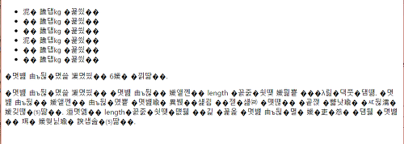

> 해당 블로그 글은 [영한님의 인프런 강의](https://inf.run/vskmA)를 바탕으로 쓰여진 글입니다.

## 프로젝트 환경 구성

프로젝트 환경 구성은 필자가 쓴 [자바 입문편 내용](https://sungbin.kr/Hello-World/#%EA%B0%9C%EB%B0%9C-%ED%99%98%EA%B2%BD-%EC%84%A4%EC%A0%95)을 참고 바란다.

## 컴퓨터와 데이터

우리는 가끔 한글이 깨진 웹사이트나 파일이 깨져서 아래와 같이 나오는 경우를 간간이 볼 수 있을 것이다.



그러면 우리는 뭐가 문제길래 이렇게 깨질까 엄청 고민할 것이다. 이 문제는 다른 문제들도 있겠지만 주요 원인은 바로 인코딩이 주 원인이다. 인코딩을 학습하지 않았을 때 필자도 이 문제로 엄청 고민했던 경험이 있다. 그럼 인코딩에 대해 학습을 하기 전, 간단한 CS 지식을 공부하고 인코딩을 학습해보자. 그래야 인코딩에 대해 더욱 잘 이해할 수 있을 것이다.

컴퓨터는 무엇일까? 컴퓨터는 한마디로 바보다. 컴퓨터는 0과 1이라는 숫자밖에 모른다. 그러면 우리가 입력하는 숫자들은 컴퓨터가 어떻게 알고 표현을 해주는 것일까? 컴퓨터의 램 메모리는 반도체로 이루어져 있고 여기 안에는 수많은 전구들의 집합으로 이루어져 있다. 이 전구는 "켜진 상태"와 "꺼진 상태"의 조합으로 이루어져 있다. 이 전구의 조합으로 우리가 입력하는 숫자들을 표현하는 것이다. 조금 더 자세히 알아보자.

전구는 "켜진 상태"와 "꺼진 상태" 2가지의 경우의 수가 존재한다. 이것을 우리는 2진수를 사용한다고 표현한다. 그리고 공학적인 용어로 이것을 우리는 `1bit`라고 말한다. 그래서 이해가 잘 안되는 독자는 이렇게 외우자!

> 1bit = 전구 1개 = 2^1 = 2가지 = 디지털

여기서 왜 1bit가 디지털일까? 디지털이란, 0이냐 1이냐라는 흑백논리를 가지고 하는 것이기에 1bit라고 할 수 있다. 그러면 전구 4개가 있다고 하자. 이것도 암기해야 할 사항이다. 전기 스위치 4개는 4bit이다. 경우의 수는 2^4 = 16가지이다. 그리고 여기서 한 가지 더 알아야 할 것이 바로 `8 4 2 1`이다. 4bit의 자리 값이 각각 2^3, 2^2, 2^1, 2^0순이고 풀면 8421이 나오는 것이다. 2진수를 표현할 때는 대부분 4bit 단위로 나온다. 그리고 마지막 한가지 더 알아야 할 것이 있다. 전구 4개는 2^4 = 16가지이며, 8421을 암기하자고 했다. 한 가지 더 알아야 할 부분은 바로 16진수이다. 보통 4bit 단위로 16진수 1자리 수로 되어 있다. 그리고 컴퓨터의 데이터는 전부 16진수로 이루어져 있다. 그러니 반드시 알아줘야 할 것이다.

> 4bit = 전구 4개 = 2^4 = 16가지 = 16진수 1자리

즉, 전구가 하나씩 늘때마다 2의 제곱수로 증가한다는 것을 눈치를 챘을 것이다. 컴퓨터는 수 많은 숫자를 이런 방식으로 저장한다. 즉, 16진수 혹은 2진수의 값을 10진수로 변환해 우리에게 보여주거나 우리가 입력한 10진수를 16진수, 2진수로 변환하여 읽어들이는 것이다.

> ✅ 참고
>
> 8bit = 1byte

> ✅ 참고
>
> 음수를 표현해야 한다면 처음 1bit를 음수, 양수를 표현하는데 사용한다. 즉, 8bit라고 한다면 음수까지 표현해야 한다면 첫번재를 flag 비트로 0이면 양수, 1이면 음수로 표현하며 숫자 범위는 7bit범위로 이루어진다. 물론 부호 상관없이 양수만 표현한다면 flag 비트를 무시하고 그냥 8bit(0~255)로 표현할 수 있다.

## 컴퓨터와 문자 인코딩1

그러면 컴퓨터의 문자는 어떻게 저장할까? 일반적으로 컴퓨터는 문자를 모른다. 컴퓨터는 0과 1밖에 모르기 때문이다. 그러면 컴퓨터는 어떻게 문자를 알까? 바로 문자집합이라는 것을 통해 문자를 표현할 수 있는 것이다. 문자집합은 그냥 일종의 표같은거 생각하면 된다. 예를 들어 우리가 문자 'A'를 저장하면, 컴퓨터는 문자 집합을 통해 'A'의 숫자 값 65를 찾는다. 그리고 65를 메모리에 저장한다. 물론 2진수로 저장을 한다. 문자를 불러올 때는 이 과정의 반대로 일어난다.

> ✅ 참고
>
> - 문자 인코딩: 문자 집합을 통해 문자를 숫자로 변환하는 것
> - 문자 디코딩: 문자 집합을 통해 숫자를 문자로 변환하는 것

### ASCII 문자 집합

문자집합이 생기고 각자 컴퓨터 회사에서 자기 마음대로 문자집합을 변경해가면서 사용을 하였다. 그러니 컴퓨터 제조사가 다르면 문자가 다 깨지는 현상이 나타났다. 그래서 미국 정부가 새로운 기준을 만들어서 이것을 꼭 지키라고 강제를 하였는데 그게 바로 ASCII다. 초기 컴퓨터에서는 주로 영문 알파벳, 숫자, 키보드의 특수문자, 스페이스, 엔터와 같은 기본적인 문자만 표현하면 충분했다. 따라서 7비트를 사용하여 총 128가지 문자를 표현할 수 있는 ASCII 공식 문자 집합이 만들어졌다.

> ✅ 참고
>
> ASCII의 숫자는 10진수 숫자가 아니라 문자로 표현된 숫자이다.

### ISO_8859_1

하지만 기존 ASCII로는 문자가 너무 적다. ASCII가 개발되고 나서 서유럽에 많은 컴퓨터 사용자가 늘어서 서유럽 문자를 표현하는 문자 집합이 필요해졌다. 그래서 기존 ASCII에 서유럽 문자의 추가하였다. 이것을 `ISO_8859_1`,`LATIN1`,`ISO-LATIN-1`등으로 불린다. 8bit 문자집합을 쓰며 기존 7bit ASCII에 1bit가 더 추가된 것이다. ISO_8859_1은 기존 ASCII 문자 집합과 호환 가능했다.

### 한글 문자 집합

#### EUC-KR

그러다가 한국에서도 많은 컴퓨터 사용자가 늘면서 한글도 포함된 문자집합이 필요하였다. 그래서 나온 것이 바로 `EUC-KR`이다. EUC-KR은 모든 한글을 담는 것 보다는 자주 사용하는 한글 2350개만 포함해서 만들었다. 한글의 글자는 아주 많기 때문에 256가지만 표현할 수 있는 1byte로 표현하는 것은 불가능하다. 그래서 2byte를 사용하면 총 65536가지 표현 가능해졌다. EUC-KR은 ASCII + 자주 사용하는 한글 2350개 + 한국에서 자주 사용하는 기타 글자를 포함한다. 그리고 실제로 용량은 ASCII는 1byte, 한글은 2byte를 사용한다. 또한 기존 ASCII 문자 집합과 호환 가능하다.

> ✅ 참고
>
> 한글은 초성 단위로 저장을 한다.

#### MS-949

여기서 마이크로소프트가 EUC-KR을 확장하여 만든 인코딩 체계가 바로 MS-949이다. EUC-KR은 "쀍", "삡"과 같이 드물게 사용하는 음절을 표현하지 못하였다. 기존 EUC-KR과 호환을 이루면서 한글 11,172자를 모두 수용하도록 만든 것이 MS949이다. EUC-KR과 마찬가지로 ASCII는 1byte, 한글은 2byte를 사용한다. 기존 ASCII 문자 집합과 호환 가능하며, 윈도우 시스템에서 계속 사용된다.

## 컴퓨터와 문자 인코딩2

전세계적으로 컴퓨터 인구가 늘어나면서, 전세계 문자를 대부분 다 표현할 수 있는 문자 집합이 필요해졌다. 이전에는 EUC-KR이나 MS949 같은 한글 문자표를 PC에 설치하지 않으면 다른 나라 사람들은 한글로 작성된 문서를 열어볼 수 없었다. 그런데 만약에 하나의 메모장에 다양한 언어가 있을 경우 어떻게 할까? 1980년대 말, 다양한 문자 인코딩 표준이 존재했지만, 이들은 모두 특정 언어 또는 문자 세트를 대상으로 했기 때문에 국제적으로 호환성 문제가 많았다.

이를 해결하기 위해 전 세계의 모든 문자들을 단일 문자 세트로 표현할 수 있는 유니코드(Unicode) 표준이 1990년대에 도입되었다. 전 세계의 모든 문자와 기호를 하나의 표준으로 통합하여 표현할 수 있는 문자 집합을 만드는 것이다. 대표적인 예로 `UTF-16`과 `UTF-8`이 있다.

### UTF-16

자주 사용하는 기본 다국어들은 2byte로 표현, 2byte는 65536가지를 표현할 수 있다. 즉, 영어, 유럽 언어, 한국어, 중국어, 일본어등이 2byte를 사용한다. 그리고 그 외의 언어는 4byte를 사용하였다. 하지만 큰 단점이 존재하였다. 바로 영문도 2byte를 사용해야 한다는 점이다. UTF-16을 사용한다면 영문의 경우 다른 문자 집합 보다 2배의 메모리를 더 사용한다. 또한 ASCII와도 호환이 되지를 않는다. 물론 대부분 2byte로 처리하여 계산하기 편하다는 장점은 있었다.

> ✅ 참고
>
> 이 시기에 등장한 자바도 이러한 이유로 UTF-16을 사용하여 `char`타입이 나오게 되었다. 그래서 `char`타입이 2byte다.

### UTF-8

그래서 등장한 것이 `UTF-8`이다. UTF-8은 8bit 기반, 가변길이 인코딩을 사용한다.

- 1byte: ASCII, 영문, 기본 라틴 문자
- 2byte: 그리스어, 히브리어 라틴 확장 문자
- 3byte: 한글, 한자, 일본어
- 4byte: 이모지, 고대문자등

그래서 상대적으로 사용이 복잡하다. 또한 ASCII를 제외한 일부 언어에서 더 많은 용량 사용한다. 하지만 최고의 장점이 ASCII 문자는 1바이트로 표현하면 ASCII와 호환이 된다는 것이다. 결국 UTF-8이 사실상 표준이 되었다.

### **UTF-8이 현대의 사실상 표준 인코딩 기술이 된 이유**

- **저장 공간 절약과 네트워크 효율성**: UTF-8은 ASCII 문자를 포함한 많은 서양 언어의 문자에 대해 1바이트를 사용한다. 반면에 UTF-16은 최소 2바이트를 사용하므로, 주로 ASCII 문자로 이루어진 영문 텍스트에서는 UTF-8이 2배 더 효율적이다. 특히 데이터를 네트워크로 전달할 때는 매우 큰 효율의 차이를 보인다. 참고로 웹에 있는 문서의 80% 이상은 영문 문서이다.
- **ASCII와의 호환성**: UTF-8은 ASCII와 호환된다. UTF-8로 인코딩된 텍스트에서 ASCII 범위에 있는 문자는 기존 ASCII와 동일한 방식으로 처리된다. 예를 들어 문자 "A"는 65로 인코딩 된다. 많은 레거시 시스템은 ASCII 기반으로 구축되어 있다. UTF-8은 이러한 시스템과의 호환성을 유지하면서도 전 세계의 모든 문자를 표현할 수 있다.

> ✅ 참고
>
> 한글 윈도우의 경우 기존 윈도우와 호환성 때문에 기본 인코딩을 MS949로 유지한다. 한글 윈도우도 기본 인코딩을 UTF-8로 변경하려고 노력중이다.

## 문자 집합 조회

문자 집합을 사용해서 문자 인코딩을 어떻게 하는지 코드로 알아보자.

``` java
package charset;

import java.nio.charset.Charset;
import java.nio.charset.StandardCharsets;
import java.util.Set;
import java.util.SortedMap;

public class AvailableCharsetsMain {
    public static void main(String[] args) {
        SortedMap<String, Charset> charsets = Charset.availableCharsets();
        for (String charsetName : charsets.keySet()) {
            System.out.println("charsetName = " + charsetName);
        }

        System.out.println("=====");

        Charset charset1 = Charset.forName("MS949");
        System.out.println("charset1 = " + charset1);

        Set<String> aliases = charset1.aliases();
        for (String alias : aliases) {
            System.out.println("alias = " + alias);
        }

        Charset charset2 = Charset.forName("UTF-8");
        System.out.println("charset2 = " + charset2);

        Charset charset3 = StandardCharsets.UTF_8;
        System.out.println("charset3 = " + charset3);

        Charset defaultCharset = Charset.defaultCharset();
        System.out.println("defaultCharset = " + defaultCharset);
    }
}
```

`Charset.availableCharsets()`은 사용 가능한 문자집합을 `Map`형태로 출력하며, `forName()`으로 원하는 문자집합을 반환받을 수 있다. 또한 `StandardCharsets.UTF_8`과 같이 자주 사용하는 문자집합을 상수로 정의를 해두었으며, 기본적으로는 기본 인코딩을 사용하기도 하는데, 특정 문자집합을 지정하려면 사용하면 된다.

## 문자 인코딩 예제1

`Charset`을 사용해서 실제 문자 인코딩을 해보자.

``` java
package charset;

import java.nio.charset.Charset;
import java.util.Arrays;

import static java.nio.charset.StandardCharsets.*;

public class EncodingMain1 {

    private static final Charset EUC_KR = Charset.forName("EUC-KR");

    private static final Charset MS949 = Charset.forName("MS949");

    public static void main(String[] args) {
        System.out.println("== ASCII 영문 처리 ==");

        encoding("A", US_ASCII);
        encoding("A", ISO_8859_1);
        encoding("A", EUC_KR);
        encoding("A", MS949);
        encoding("A", UTF_8);
        encoding("A", UTF_16BE);

        System.out.println("== 한글 지원 ==");

        encoding("가", EUC_KR);
        encoding("가", MS949);
        encoding("가", UTF_8);
        encoding("가", UTF_16BE);
    }

    private static void encoding(String text, Charset charset) {
        byte[] bytes = text.getBytes(charset);
        System.out.printf("%s -> [%s] 인코딩 -> %s %sbyte\n", text, charset, Arrays.toString(bytes), bytes.length);
    }
}
```

- 문자를 컴퓨터가 이해할 수 있는 숫자(byte)로 변경하는 것을 문자 인코딩이라 한다.
- `String.getByte(Charset)` 메서드를 사용하면 `String` 문자를 byte 배열로 변경할 수 있다.
- 이때 중요한 점이 있는데, 문자를 byte로 변경하려면 문자 집합이 필요하다는 점이다. 따라서 어떤 문자 집합을 참고해서 byte로 변경할지 정해야 한다. `String.getByte()`의 인자로 `Charset` 객체를 전달하면 된다.
- 만약 지정하지 않으면 기본 문자 집합으로 잡힌다.

> ✅ 참고
>
> UTF_16, UTF_16BE, UTF_16LE가 있는데, 우리는 UTF_16BE를 사용하면 된다. BE, LE는 byte의 순서의 차이이다.
> - `UTF_16BE` : [-84, 0]
> - `UTF_16LE` : [0, -84]
> - `UTF_16` : 인코딩한 문자가 BE, LE중에 어떤 것인지 알려주는 2byte가 앞에 추가로 붙는다.

> ✅ 참고
>
> byte 출력에 마이너스 숫자가 보이는 이유
>
> 위의 코드를 실행하면 음수인 부분들이 보일 것이다. 그런 이유는 원래는 1xxxxxxx가 나왔을 것이다. 하지만 부호있는 2진수라면 이것은 음수로 표현한다. 즉, 자바가 이렇게 되어 있어서 음수가 나오는 것이다. 참고로 자바에서 음수로 표현할 때 2의 보수를 이용한다. 자바의 byte를 사용해도 실제 메모리에 저장되는 값은 동일하다. 자바의 byte 타입이 첫 비트로 음수를 표현하기 때문에, 화면에 보여지는 10진수 숫자만 다를 뿐이다. 실제 개발 단계에서 이런 문제를 가지고 고민할 일은 거의 없다.

## 문자 인코딩 예제2

이번에는 문자를 인코딩은 물론이고, 디코딩까지 해보자.

``` java
package charset;

import java.nio.charset.Charset;
import java.nio.charset.StandardCharsets;
import java.util.Arrays;

import static java.nio.charset.StandardCharsets.*;

public class EncodingMain2 {

    private static final Charset EUC_KR = Charset.forName("EUC-KR");

    private static final Charset MS_949 = Charset.forName("MS949");

    public static void main(String[] args) {
        System.out.println("== ASCII 영문 인코딩 ==");

        test("A", US_ASCII, US_ASCII);
        test("A", US_ASCII, ISO_8859_1);
        test("A", US_ASCII, EUC_KR);
        test("A", US_ASCII, MS_949);
        test("A", US_ASCII, UTF_8);
        test("A", US_ASCII, UTF_16BE); // 디코딩 실패

        System.out.println("== 한글 인코딩 - 기본 ==");

        test("가", US_ASCII, US_ASCII); // x
        test("가", ISO_8859_1, ISO_8859_1); // x
        test("가", EUC_KR, EUC_KR);
        test("가", MS_949, MS_949);
        test("가", UTF_8, UTF_8);
        test("가", UTF_16BE, UTF_16BE);

        System.out.println("== 한글 인코딩 - 복잡한 문자 ==");

        test("뷁", EUC_KR, EUC_KR); // x
        test("뷁", MS_949, MS_949);
        test("뷁", UTF_8, UTF_8);
        test("뷁", UTF_16BE, UTF_16BE);

        System.out.println("== 한글 인코딩 - 디코딩이 다른 경우 ==");

        test("가", EUC_KR, MS_949);
        test("뷁", MS_949, EUC_KR); // 인코딩 가능, 디코딩 x
        test("가", EUC_KR, UTF_8); // x
        test("가", MS_949, UTF_8); // x
        test("가", UTF_8, MS_949); // x

        System.out.println("== 영문 인코딩 - 디코딩이 다른 경우 ==");

        test("A", EUC_KR, UTF_8);
        test("A", MS_949, UTF_8);
        test("A", UTF_8, MS_949);
        test("A", UTF_8, UTF_16BE); // x
    }

    private static void test(String text, Charset encodingCharset, Charset decodingCharset) {
        byte[] encoded = text.getBytes(encodingCharset);
        String decoded = new String(encoded, decodingCharset);
        System.out.printf("%s -> [%s] 인코딩 -> %s %sbyte -> [%s] 디코딩 -> %s\n", text, encodingCharset,
                Arrays.toString(encoded), encoded.length, decodingCharset, decoded);
    }
}
```

영문 'A'를 인코딩하면 65가 나온다. 그리고 디코딩을 할 때 문자집합을 달리 해보았는데 UTF-16을 제외하고 전부 디코딩이 성공적으로 이루어졌다. 그 이유는 UTF-16은 ASCII와 호환되지 않기 때문이다.

한글 '가'는 ASCII, ISO-8859-1로 인코딩 할 수 없다. 이유는 해당 문자 집합은 한글을 모르기 때문이다. 그래서 출력도 ?로 나온 것이다. EUC-KR, MS949, UTF-8, UTF-16은 한글 인코딩 디코딩이 잘 수행되는 것을 확인할 수 있다.

EUC-KR은 자주 사용하는 한글 2350개만 표현할 수 있다. 따라서 '뷁'과 문자는 문자 집합에 없으므로 인코딩할 수 없다. 하지만 MS949, UTF-8, UTF-16은 모든 한글을 표현할 수 있다. 따라서 '뷁'과 같은 문자도 인코딩 할 수 있다.

만약 인코딩 문자집합과 디코딩 문자잡합이 다르면 어떨까?

- '가'와 같이 자주 사용하는 한글은 EUC-KR, MS949 서로 호환된다. 따라서 EUC-KR로 인코딩해도 MS949로 디코딩 할 수 있다. MS949는 EUC-KR을 포함한다.
- '뷁'과 같이 특수한 한글은 MS949로 인코딩 할 수 있지만, EUC-KR의 문자 집합에 없으므로 EUC-KR로 디코딩 할 수 없다.
- 한글을 인코딩할 때 UTF-8과 EUC-KR(MS949)는 서로 호환되지 않는다.

### 정리

- ASCII 영문 인코딩: UTF-16을 제외하고 모두 호환
- 사실상 표준인 UTF-8을 사용하자.

### 한글이 깨지는 가장 큰 2가지 이유

- EUC-KR(MS949), UTF-8이 서로 호환되지 않음
  - 한글이 깨지는 대부분의 문제는 UTF-8로 인코딩한 한글을 EUC-KR(MS949)로 디코딩하거나 또는 EUC-KR(MS949)로 인코딩한 한글을 UTF-8로 디코딩할 때 발생한다.
- EUC-KR(MS949) 또는 UTF-8로 인코딩한 한글을 `ISO-8859-1`로 디코딩 할 때 문제 발생

> 잘못된 지식이 있을 경우 댓글로 남겨주시면 빠르게 반영하겠습니다!