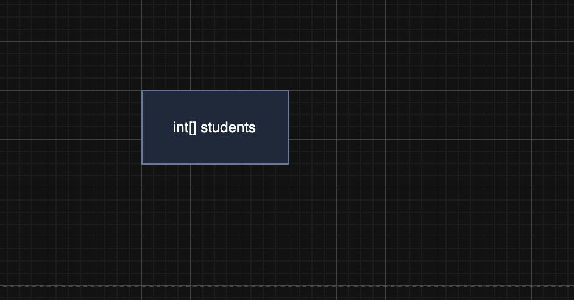
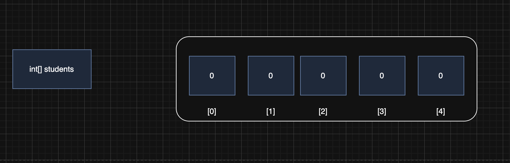
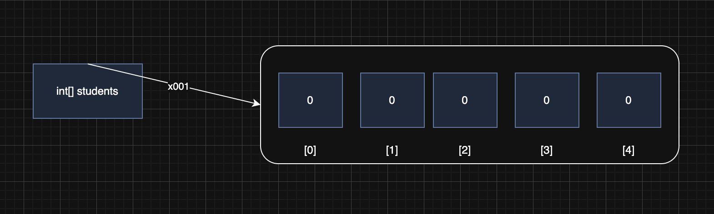
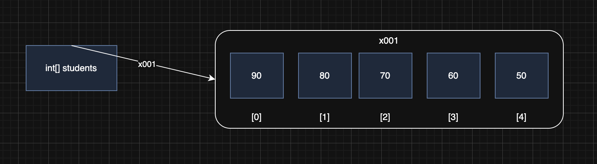
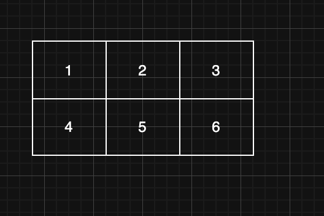

> 해당 블로그 글은 [영한님의 인프런 강의](https://inf.run/WUc1V)를 바탕으로 쓰여진 글입니다.

## 배열 시작

배열을 학습하기 전에 왜 배열이 필요한지 코드를 통해 알아보자.

``` java
package array;

public class Array1 {
    public static void main(String[] args) {
        int student1 = 90;
        int student2 = 80;
        int student3 = 70;
        int student4 = 60;
        int student5 = 50;

        System.out.println("학생1 점수: " + student1);
        System.out.println("학생2 점수: " + student2);
        System.out.println("학생3 점수: " + student3);
        System.out.println("학생4 점수: " + student4);
        System.out.println("학생5 점수: " + student5);
    }
}
```

위와 같은 학생의 점수를 출력하는 코드가 있다고 하자. 독자들이 봐도 너무 지저분해 보이는 코드이다. 이 코드의 문제점은 학생이 추가될 때 마다 추가해야하는 부분이 많다. 학생 점수에 대한 변수를 추가해야 하고 출력문을 추가해야 한다.

그러면 우리는 이 생각을 할 수 있을 것이다.

> 🙋🏻 "반복문으로 해결가능할 것 같은데?"

그럴 것 같지만 아니다. 왜냐하면 "학생1 점수:" 같은 문자열은 반복문을 통해 해결 가능하지만 변수명은 어찌 못한다. 그럼 이것을 어떻게 해결할 수 있을까? 바로 **배열**을 통해 해결이 가능하다.

이렇게 같은 타입의 변수를 반복해서 선언하고 반복해서 사용하는 문제를 해결하는 것이 바로 배열이다.

## 배열의 선언과 생성

배열은 같은 타입의 변수를 사용하기 편하게 하나로 묶어둔 것이다. 그러면 이전 코드를 배열을 사용해서 변경해보자.

``` java
package array;

public class Array1Ref1 {
    public static void main(String[] args) {
        int[] students;
        students = new int[5];

        students[0] = 90;
        students[1] = 80;
        students[2] = 70;
        students[3] = 60;
        students[4] = 50;

        System.out.println("학생1 점수: " + students[0]);
        System.out.println("학생2 점수: " + students[1]);
        System.out.println("학생3 점수: " + students[2]);
        System.out.println("학생4 점수: " + students[3]);
        System.out.println("학생5 점수: " + students[4]);
    }
}
```

그러면 위의 코드를 한번 설명해보겠다.

### 세부 내용



- `int[] students;`
    - 배열 변수를 선언한다는 의미이다.
    - 배열 변수를 선언했다고 해서 배열 자체가 만들어진 것은 아니다.
    - 위의 코드에서는 정수형 타입 배열이 만들어진 것이다.
    - 비유적으로 표현하면 호텔에 와서 방을 요청하는 행위를 뜻한다.





- `students = new int[5];`
    - 배열을 사용하려면 배열을 생성해야 한다.
    - `new int[5]`라는 것은 int형 변수가 들어 갈 수 있는 5개 크기의 공간을 만들었다라는 뜻이다.
    - 배열이 생성되면 내부 값은 자동으로 기본 값으로 초기화 된다. 정수는 0, 실수는 0.0, boolean은 false, 객체는 null로 초기화 된다.
    - 비유적으로 표현하자면 손님이 방을 요청하였고 접수원은 방이 몇개 필요한지 물어본다. 여기서는 5개가 필요하다고 했고 5개가 연속적으로 비워져 있는 방이 있는 층을 찾고 그 방이 더러울 수 있으므로 청소를 요청해 깨끗이 비우는 행위를 한다.
    - 그리고 이렇게 배열이 생성되면 배열의 공간을 가르킬 수 있는 참조 값을 할당한다. `x001`같은 16진수 형태로 받는다. 그러면 해당 참조값을 변수에 보관하고 해당 변수로 이제 어느 공간에 생성된 배열을 접근이 가능한 것이다.
    - 비유적으로 말하자면 해당 층이 깨끗이 청소가 되었다면 해당 층을 갈 수 있는 키를 손님에게 전달하는 행위이다.

## 배열 사용

### 인덱스

배열은 변수와 사용법이 비슷한데, 차이점이 있다면 다음과 같이 `[]` 사이에 숫자 번호를 넣어주면 된다. 배열의 위치를
나타내는 숫자를 인덱스(index)라 한다.



배열의 인덱스는 항상 0부터 시작한다. 그리고 최대 인덱스 범위는 총 길이의 -1까지의 인덱스를 존재한다. 예를들어 총 길이가 5인 배열이 있다면 인덱스의 범위는 0부터 4까지 인것이다.

만약 인덱스의 범위를 벗어나서 접근을 한다면 아래와 같이 컴파일 에러가 발생한다.

``` bash
Exception in thread "main" java.lang.ArrayIndexOutOfBoundsException: Index 5 out
of bounds for length 5 at array.Array1Ref1.main(Array1Ref1.java:14)
```

### 배열 값 대입 및 사용

배열 값 대입은 단순하다. 일반적인 변수와 사용법은 같으나 다른 점은 `[]`에 인덱스를 설정하는 것이다. 그 외에는 변수와 동일하다.

``` java
students[0] = 90; //1. 배열에 값을 대입
x001[0] = 90; //2. 변수에 있는 참조값을 통해 실제 배열에 접근. 인덱스를 사용해서 해당 위치의 요소에
접근, 값 대입
```

코드를 보면 students에는 x001이라는 참조값이 들어있다. 그 참조값이 배열을 의미하는 것은 아니다. 배열이 있는 위치를 말하는 것이다. 그 위치로 가서 인덱스를 찾고 값을 대입한다. 이 방식으로 사용하는 것도 동일하다. `students[0]`과 같이 해주면 사용을 할 수 있다.

비유적으로 표현하자면 층을 접근할 수 있는 키를 받아서 각 호실로 사람이 들어가는 것을 볼 수 있다. 여기서 호실은 인덱스를 뜻하고 사람은 값을 의미한다.

### 기본형 vs 참조형

- 기본형은 우리가 이제까지 봤던 `int`, `double`, `boolean`과 같은 타입으로 데이터를 직접 넣을 수 있다. 데이터에 바로 접근이 가능하다.
- 참조형은 배열과 같은 것으로 참조값을 통해 데이터 접근이 가능하다.

> 🙋🏻 질문
>
> 그러면 왜 참조값을 만들었을까? 그 이유는 참조값은 동적으로 사이즈를 변경이 가능하다. `new int[n];`이라고 할 때 n을 Scanner같은 것으로 받는다면 동적으로 사이즈를 변경할 수 있을 것이다. 반면 기본형은 선언과 동시에 사이즈가 정해지고 동적으로 변경이 불가능하다.

## 배열 리팩토링

> ✅ 참고
>
> 리팩토링이란, 기능은 그대로 유지한 채, 내부구조 개선 및 유지보수를 더 쉽게 만들기 위한 코드 개선을 의미한다.

그러면 이전 예제를 리팩토링할 부분을 살펴보자. 일단 아래와 같은 출력 부분을 반복문을 통해 변경이 가능해질 것이다.

``` java
// 리팩토링 전
System.out.println("학생1 점수: " + students[0]);
System.out.println("학생2 점수: " + students[1]);
System.out.println("학생3 점수: " + students[2]);
System.out.println("학생4 점수: " + students[3]);
System.out.println("학생5 점수: " + students[4]);
```

``` java
// 리팩토링 후
for (int i = 0; i < students.length; i++) {
    System.out.println("학생 " + (i + 1) + ": " + students[i]);
}
```

여기서 살펴볼 부분중에 `students.length`라는 것을 처음 봤을 것이다. length는 해당 배열의 길이를 반환해준다. 또한 length는 단순히 반환하는 기능만 있고 변경하는 setter기능은 존재하지 않는다.

다음으로 초기화 부분도 변경이 가능하다.

``` java
// 리팩토링 전
int[] students;
students = new int[5];

students[0] = 90;
students[1] = 80;
students[2] = 70;
students[3] = 60;
students[4] = 50;
```

위의 코드를 아래와 같이 변경이 가능하다.

``` java
// 리팩토링 후
int[] students;
students = new int[]{90, 80, 70, 60, 50};
```

또한 위의 코드보다 더 간편하게 변경이 가능하다.

``` java
// 더 간편하게
int[] students = {90, 80, 70, 60, 50};
```

하지만 위의 코드는 아래와 같이 선언과 초기화를 분리할 수 없고 선언과 초기화를 같이 해야 한다.

``` java
// 컴파일 에러
int[] students;
students = {90, 80, 70, 60, 50};
```

## 2차원 배열 - 시작

우리가 지금까지 본 배열은 1차원 배열이다. 배열은 1차원 배열뿐만 아니라 다차원 배열인 2차원 배열도 존재한다. 쉽게 생각해서 표라고 생각하면 좋다. 혹은 고교 수학 과정에서 배운 행렬을 생각하면 더 쉬울 것이다.



여기서 가로부분을 행(row), 세로부분을 열(column)이라고 한다. 그러면 코드를 통해 위의 그림처럼 만들어보겠다.

``` java
package array;

public class ArrayDi0 {
    public static void main(String[] args) {
        int[][] arr = new int[2][3];

        arr[0][0] = 1;
        arr[0][1] = 2;
        arr[0][2] = 3;
        arr[1][0] = 4;
        arr[1][1] = 5;
        arr[1][2] = 6;

        System.out.print(arr[0][0] + " ");
        System.out.print(arr[0][1] + " ");
        System.out.print(arr[0][2] + " ");
        System.out.println();

        System.out.print(arr[1][0] + " ");
        System.out.print(arr[1][1] + " ");
        System.out.print(arr[1][2] + " ");
        System.out.println();
    }
}
```

선언은 `int[][] arr`처럼 `[]`을 2개 넣어주면 되고 첫번째 []가 가로를 의미하는 행을 의미하고 두번째 []를 열이라고 한다.

## 2차원 배열 - 리팩토링1

이제 리팩토링을 해보자. 위의 코드를 변경해볼 부분이 있다. 출력문을 반복문을 이용해서 변경이 가능할 것 같다. 변경을 해보면 아래와 같이 리팩토링을 할 수 있다.

``` java
// 변경 전
System.out.print(arr[0][0] + " ");
System.out.print(arr[0][1] + " ");
System.out.print(arr[0][2] + " ");
System.out.println();

System.out.print(arr[1][0] + " ");
System.out.print(arr[1][1] + " ");
System.out.print(arr[1][2] + " ");
System.out.println();
```

``` java
// 변경 후
for (int row = 0; row < 2; row++) {
    for (int col = 0; col < 3; col++) {
        System.out.print(arr[row][col] + " ");
    }
    System.out.println();
}
```

## 2차원 배열 - 리팩토링2

이제 몇가지 더 개선할 부분이 있다.

- 초기화: 1차원 배열처럼 초기화도 간편하게 할 수 있을 것 같다.

- length속성 활용: 1차원 배열처럼 배열의 length 속성을 이용하여 배열의 길이를 하드코딩으로 작성 안해도 될 것 같다.

그러면 한번 리팩토링 해보자.

``` java
package array;

public class ArrayDi3 {
    public static void main(String[] args) {
        int[][] arr = {
                {1, 2, 3}, // 0행
                {4, 5, 6}, // 1행
        };

        for (int row = 0; row < arr.length; row++) {
            for (int col = 0; col < arr[row].length; col++) {
                System.out.print(arr[row][col] + " ");
            }
            System.out.println();
        }
    }
}
```

위의 코드에서 `arr.length`는 큰 중괄호에 몇개의 요소가 있나를 파악한다. 딱 봐도 2개가 있다는 것을 존재한다. 즉 이것은 행의 길이를 반환한다. 다음으로 `arr[row].length`를 보면 각 행이 몇개의 요소를 가지고 있는지 확인한다. 3개를 가지고 있다는 것을 유관적으로도 파악이 가능하다. 이렇게하여 길이를 동적으로 가져올 수 있다는 것을 알 수 있다.

## 향상된 for문

우리가 반복문 시간에 안 배운 for문이 존재한다. 바로 향상된 for문이라는 것이다. 이 향상된 for문은 배열이나 컬렉션 같은 곳에서 자주 사용이 된다.

``` java
for (변수 : 배열 또는 컬렉션) {
    // 배열 또는 컬렉션의 요소를 순회하면서 수행할 작업
}
```

그러면 예제 코드 일부를 살펴보자.

``` java
String fruits = {"사과", "오렌지", "바나나", "키위"};

for (String fruit : fruits) {
    System.out.println(fruit);
}
```

위와 같이 향상된 for문을 이용할 수 있다. 향상된 for문은 아래와 같은 특성이 있다.

- 일반 for문과 같이 동작한다.
- 향상된 for문은 배열의 인덱스를 사용하지 않고, 종료 조건을 주지 않아도 된다. 단순히 해당 배열을 처음부터 끝
까지 탐색한다.
- 향상된 for문은 배열의 인덱스를 사용하지 않고도 배열의 요소를 순회할 수 있기 때문에 코드가 간결하고 가독성
이 좋다.

다만 향상된 for문을 못 사용하는 부분이 있다. 바로 배열의 인덱스를 활용할 때 사용을 못한다. 그럴때는 어쩔수 없이 일반 for문을 사용해야 한다.

> 💡 꿀팁
>
> 향상된 for문을 간편히 생성하는 법이 있다. 배열이나 컬렉션을 선언하고 라이브 템플릿 `iter`을 사용하면 즉각 배열에 대한 향상된 for문이 생성된다.

> 잘못된 지식이 있을 경우 댓글로 남겨주시면 빠르게 반영하겠습니다!