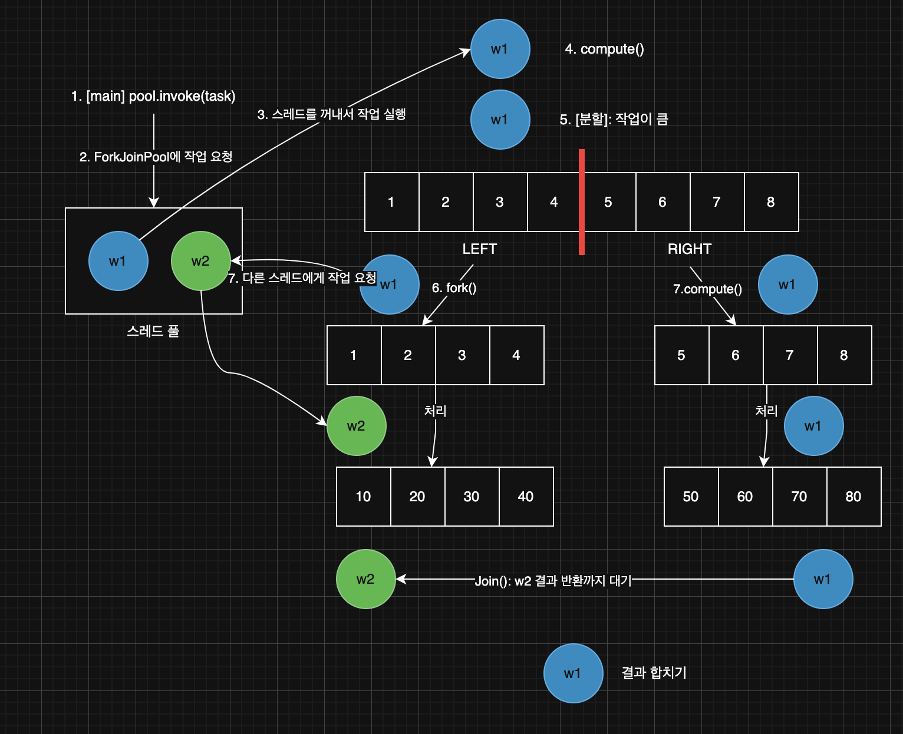

> 해당 블로그 글은 [영한님의 인프런 강의](https://inf.run/ZEStF)를 바탕으로 쓰여진 글입니다.

## 단일 스트림

병렬 스트림을 제대로 이해하려면 스트림 개념뿐만 아니라 멀티스레드와 fork/join 프레임워크에 대해서 알아야 한다. 멀티스레드는 이전 포스팅에 알아보았고 스트림도 이전에 알아보았으니 이제 fork/join 프레임워크를 알아야 한다. 일단 해당 프레임워크를 알기 전에 단일 스트림부터 차근히 예제를 발전시키면서 학습해보자.

먼저 우리가 멀티스레드를 배웠을 때 사용했던 유틸을 가져오겠다.

``` java
package util;

import java.time.LocalDateTime;
import java.time.format.DateTimeFormatter;

public class MyLogger {

    private static final DateTimeFormatter formatter = DateTimeFormatter.ofPattern("HH:mm:ss.SSS");

    public static void log(Object obj) {
        String time = LocalDateTime.now().format(formatter);
        System.out.printf("%s [%9s] %s\n", time, Thread.currentThread().getName(), obj);
    }
}
```

이제 `Job` 클래스를 하나 생성하겠다. 일종의 `Task`라고 생각하면 좋을 것이다.

``` java
package parallel;

import static util.MyLogger.log;

public class HeavyJob {

    public static int heavyTask(int i) {
        log("calculate " + i + " -> " + i * 10);

        try {
            Thread.sleep(1000);
        } catch (InterruptedException e) {
            throw new RuntimeException(e);
        }

        return i * 10;
    }

    public static int heavyTask(int i, String name) {
        log("[" + name + "] " + i + " -> " + i * 10);

        try {
            Thread.sleep(1000);
        } catch (InterruptedException e) {
            throw new RuntimeException(e);
        }

        return i * 10;
    }
}
```

`HeavyJob` 클래스는 오래 걸리는 작업을 시뮬레이션하는데, 각 작업은 1초 정도 소요된다고 가정하겠다.

이제 `main` 메서드 코드를 작성해보겠다.

``` java
package parallel;

import java.util.stream.IntStream;

import static util.MyLogger.log;

public class ParallelMain1 {
    public static void main(String[] args) {
        long startTime = System.currentTimeMillis();

        int sum = IntStream.rangeClosed(1, 8)
                .map(HeavyJob::heavyTask)
                .reduce(0, Integer::sum);

        long endTime = System.currentTimeMillis();

        log("time: " + (endTime - startTime) + "ms, sum: " + sum);
    }
}
```

실행시간을 살펴보면 약 8초정도 걸린 것을 볼 수 있을 것이다. 너무 시간이 오래 걸린다. 이것을 스레드를 이용해서 한번 단축시켜보자.

## 스레드 직접 사용

앞서 하나의 메인 스레드로 1~8의 범위를 모두 계산했다. 이제 스레드를 이용하여 실행시간을 줄여보자. 예제에서는 스레드 2개를 사용해서 기존 실행시간의 성능을 2배 빠르게 해보자.

``` java
package parallel;

import static util.MyLogger.log;

public class ParallelMain2 {
    public static void main(String[] args) throws InterruptedException {
        long startTime = System.currentTimeMillis();

        // Fork 작업을 분할한다.
        SumTask task1 = new SumTask(1, 4);
        SumTask task2 = new SumTask(5, 8);
        Thread thread1 = new Thread(task1, "thread-1");
        Thread thread2 = new Thread(task2, "thread-2");

        // 분할한 작업을 처리한다.
        thread1.start();
        thread2.start();

        // join - 처리한 결과를 합친다.
        thread1.join();
        thread2.join();
        log("main 스레드 대기 완료");

        int sum = task1.result + task2.result;

        long endTime = System.currentTimeMillis();
        log("time: " + (endTime - startTime) + "ms, sum: " + sum);
    }

    private static class SumTask implements Runnable {

        int startValue;

        int endValue;

        int result = 0;

        public SumTask(int startValue, int endValue) {
            this.startValue = startValue;
            this.endValue = endValue;
        }

        @Override
        public void run() {
            log("작업 시작");

            int sum = 0;

            for (int i = startValue; i <= endValue; i++) {
                int calculated = HeavyJob.heavyTask(i);
                sum += calculated;
            }

            result = sum;

            log("작업 완료 result = " + result);
        }
    }
}
```

`thread-1`,`thread-2`가 작업을 분할해서 처리했기 때문에 8초의 작업을 4초로 줄일 수 있었다. 하지만 이렇게 스레드를 직접 사용하면 스레드 수가 늘어나면 코드가 복잡해지고, 예외 처리, 스레드 풀 관리 등 추가 관리 포인트가 생기는 문제가 있다.

## 스레드 풀 사용

이번에는 자바가 제공하는 `ExecutorService`를 사용해서 더 편리하게 병렬 처리를 해보자.

``` java
package parallel;

import java.util.concurrent.*;

import static util.MyLogger.log;

public class ParallelMain3 {
    public static void main(String[] args) throws InterruptedException, ExecutionException {
        ExecutorService es = Executors.newFixedThreadPool(2);
        long startTime = System.currentTimeMillis();

        SumTask task1 = new SumTask(1, 4);
        SumTask task2 = new SumTask(5, 8);

        Future<Integer> future1 = es.submit(task1);
        Future<Integer> future2 = es.submit(task2);

        Integer result1 = future1.get();
        Integer result2 = future2.get();

        int sum = result1 + result2;
        long endTime = System.currentTimeMillis();

        log("time: " + (endTime - startTime) + "ms, sum: " + sum);

        es.close();
    }

    private static class SumTask implements Callable<Integer> {

        int startValue;

        int endValue;

        public SumTask(int startValue, int endValue) {
            this.startValue = startValue;
            this.endValue = endValue;
        }

        @Override
        public Integer call() {
            log("작업 시작");

            int sum = 0;

            for (int i = startValue; i <= endValue; i++) {
                int calculated = HeavyJob.heavyTask(i);
                sum += calculated;
            }

            log("작업 완료 result = " + sum);

            return sum;
        }
    }
}
```

`Executors.newFixedThreadPool(2)`로 스레드 풀을 만든다. 이 스레드 풀은 최대 2개의 스레드를 제공한다. 그 후, 작업을 2개로 분리하여 `submit(Callable)`로 스레드 풀에 작업을 맡기면 `Future` 객체를 반환 받는다. 메인 스레드는 `future.get()`을 통해 실제 계산 결과가 반환될 때까지 대기(`join`과 유사)한다.

이전 코드에 비해 스레드 풀로 스레드를 관리하고 작업도 `Callable`로 구현함으로 조금 더 코드가 간결해졌다. 하지만 여전히 코드 레벨에서 분할/병합 로직을 직접 짜야 하고, 스레드 풀 생성과 관리도 개발자가 직접해야 한다.

## Fork/Join 패턴

### 분할(Fork), 처리(Execute), 모음(Join)

스레드는 한 번에 하나의 작업을 처리할 수 있다. 따라서 하나의 큰 작업을 여러 스레드가 처리할 수 있는 작은 단위의 작업으로 분할(Fork)해야 한다. 그리고 이렇게 분할한 작업을 각각의 스레드가 처리(Execute)하는 것이다. 각 스레드의 분할된 작업 처리가 끝나면 분할된 결과를 하나로 모아야(Join) 한다. 이렇게 **분할(Fork) 처리(Execute) 모음(Join)**의 단계로 이루어진 멀티스레딩 패턴을 **Fork/Join 패턴**이라고 부른다. 이 패턴은 병렬 프로그래밍에서 매우 효율적인 방식으로, 복잡한 작업을 병렬적으로 처리할 수 있게 해준다.

그러면 해당 패턴이 우리가 이전에 만든 예제에 어떻게 녹아져 있는지 살펴보자.

예제에서 큰 작업은 1부터 8까지 더하는 작업이다. 이것을 우리는 스레드 2개로 분리하여 스레드1은 1부터 4까지 더하는 계산을 스레드2는 5부터 8까지 더하는 계산을 동시에 진행하였다. 이렇게 큰 작업을 여러 작은 작업으로 쪼개어(`Fork`) 각각의 스레드나 작업 단위로 할당하는 것을 포크(`Fork`)라 한다.

이렇게 작업을 스레드별로 분리를 하였다면 각 스레드가 해당 작업을 처리해야 할 것이다. 그 후에 처리된 결과물을 **하나로 합쳐야 한다.** Join은 이렇게 갈라진 작업들이 모두 끝난 뒤, 다시 **합류**하여 하나로 **결과를 모으는** 모습을 의미한다.

지금까지 작업을 직접 분할하고, 처리하고, 처리된 결과를 합쳤다. 이러한 분할 -> 처리(작업 병렬 실행) -> 모음의 과정을 더 편리하게 구현할 수 있는 방법은 없을까? 자바는 **Fork/Join 프레임워크**를 제공해서 개발자가 이러한 패턴을 더 쉽게 구현할 수 있도록 지원한다.

## Fork/Join 프레임워크1 - 소개

자바의 Fork/Join 프레임워크는 자바 7부터 도입된 `java.util.concurrent` 패키지의 일부로, 멀티코어 프로세서를 효율적으로 활용하기 위한 병렬 처리 프레임워크이다.

### 분할 정복 전략

- 큰 작업(task)을 작은 단위로 재귀적으로 분할(fork)
- 각 작은 작업의 결과를 합쳐(join) 최종 결과를 생성
- 멀티코어 환경에서 작업을 효율적으로 분산 처리

### 작업 훔치기 알고리즘

- 각 스레드는 자신의 작업 큐를 가짐
- 작업이 없는 스레드는 다른 바쁜 스레드의 큐에서 작업을 "훔쳐와서" 대신 처리
- 부하 균형을 자동으로 조절하여 효율성 향상

### 주요 클래스

#### ForkJoinPool

- Fork/Join 작업을 실행하는 특수한 `ExecutorService` 스레드 풀
- 작업 스케줄링 및 스레드 관리를 담당
- 기본적으로 사용 가능한 프로세서 수 만큼 스레드 생성
- 쉽게 이야기해서 **분할 정복과 작업 훔치기에 특화된 스레드 풀**이다.

``` java
// 기본 풀 생성 (프로세서 수에 맞춰 스레드 생성)
ForkJoinPool pool = new ForkJoinPool();

// 특정 병렬 수준으로 풀 생성
ForkJoinPool customPool = new ForkJoinPool(4);
```

#### ForkJoinTask

- `ForkJoinTask`는 Fork/Join 작업의 기본 추상 클래스다.
- `Future`를 구현했다.
- 개발자는 주로 다음 두 하위 클래스를 구현해서 사용한다.
    - `RecursiveTask<V>` : 결과를 반환하는 작업
    - `RecursiveAction` : 결과를 반환하지 않는 작업(`void`)

#### RecursiveTask / RecursiveAction의 구현 방법

- `compute()` 메서드를 재정의해서 필요한 작업 로직을 작성한다.
- 일반적으로 일정 기준(임계값)을 두고, **작업 범위가 작으면 직접 처리**하고, **크면 작업을 둘로 분할**하여 각각 병렬로 처리하도록 구현한다.

#### fork() / join() 메서드

- `fork()` : 현재 스레드에서 다른 스레드로 작업을 **분할**하여 보내는 동작(비동기 실행)
- `join()` : 분할된 작업이 끝날 때까지 기다린 후 결과를 가져오는 동작

> ✅ 참고
>
> Fork/Join 프레임워크를 실무에서 직접적으로 다루는 일은 드물다. 따라서 이런게 있다 정도만 알아두고 넘어가자.

### Fork/Join 프레임워크 활용

그럼 앞선 예시를 `Fork/Join` 프레임워크를 이용하여 해결해보자. 대략 로직은 이렇게 구성하면 좋을 것 같다.

- **Fork**: 작업의 크기가 8이면 임계값을 넘었다. 따라서 작업을 절반으로 분할한다.
- **Execute**: 다음으로 작업의 크기가 4라면 임계값의 범위 안에 들어오므로 작업을 분할하지 않고, 처리한다.
- **Join**: 최종 결과를 합친다.

``` java
package parallel.forkjoin;

import parallel.HeavyJob;

import java.util.List;
import java.util.concurrent.RecursiveTask;

import static util.MyLogger.log;

public class SumTask extends RecursiveTask<Integer> {

    private static final int THRESHOLD = 4;

    private final List<Integer> list;

    public SumTask(List<Integer> list) {
        this.list = list;
    }

    @Override
    protected Integer compute() {
        if (list.size() <= THRESHOLD) {
            log("[처리 시작] " + list);

            int sum = list.stream()
                    .mapToInt(HeavyJob::heavyTask)
                    .sum();

            log("[처리 완료] " + list + " -> sum: " + sum);

            return sum;
        } else {
            int mid = list.size() / 2;
            List<Integer> leftList = list.subList(0, mid);
            List<Integer> rightList = list.subList(mid, list.size());

            log("[분할] " + list + " -> LEFT" + leftList + ", RIGHT" + rightList);

            SumTask leftTask = new SumTask(leftList);
            SumTask rightTask = new SumTask(rightList);

            leftTask.fork();

            int rightResult = rightTask.compute();
            Integer leftResult = leftTask.join();
            int joinSum = leftResult + rightResult;

            log("LEFT[" + leftResult + "], RIGHT[" + rightResult + "] -> sum: " + joinSum);

            return joinSum;
        }
    }
}
```

- **THRESHOLD (임계값)**: 작업을 더 이상 분할하지 않고 직접 처리할 리스트의 크기를 정의한다. 여기서는 4로 설정되어, 리스트 크기가 4 이하일 때 직접 계산한다. 4보다 크면 작업을 분할한다.
- **작업 분할**: 리스트의 크기가 임계값보다 크면, 리스트를 반으로 나누어 `leftList`와 `rightList`로 분할한다.
- **fork(), compute()**
    - `fork()`는 왼쪽 작업을 다른 스레드에 위임하여 병렬로 처리한다.
    - `compute()`는 오른쪽 작업을 현재 스레드에서 직접 수행한다(재귀 호출).
- **join()**: 분할된 왼쪽 작업이 완료될 때까지 기다린 후 결과를 가져온다.
- **결과 합산**: 왼쪽과 오른쪽 결과를 합쳐 최종 결과를 반환한다.

이제 사용하는 코드를 살펴보자.

``` java
package parallel.forkjoin;

import java.util.List;
import java.util.concurrent.ForkJoinPool;
import java.util.stream.IntStream;

import static util.MyLogger.log;

public class ForkJoinMain1 {
    public static void main(String[] args) {
        List<Integer> data = IntStream.rangeClosed(1, 8)
                .boxed()
                .toList();

        log("[생성] " + data);

        ForkJoinPool pool = new ForkJoinPool(10);

        long startTime = System.currentTimeMillis();

        SumTask task = new SumTask(data);
        int result = pool.invoke(task);
        pool.close();

        long endTime = System.currentTimeMillis();

        log("time: " + (endTime - startTime) + "ms, sum: " + result);
        log("pool: " + pool);
    }
}
```

- **데이터 생성**: `IntStream.rangeClosed(1, 8)`를 사용해 1부터 8까지의 숫자 리스트를 생성한다.
- **ForkJoinPool 생성**
    - `new ForkJoinPool(10)`으로 최대 10개의 스레드를 사용할 수 있는 풀을 생성한다.
    - 참고로 기본 생성자(`new ForkJoinPool()`)를 사용하면 시스템의 프로세서 수에 맞춰 스레드가 생성된다.
    - 마치 `ExecutorService`로 스레드 풀을 생성하는 것과 유사하다.
- **invoke()**: 메인 스레드가 `pool.invoke(task)`를 호출하면 `SumTask`를 스레드 풀에 전달한다. `SumTask`는 `ForkJoinPool`에 있는 별도의 스레드에서 실행된다. 메인 스레드는 작업이 완료될 때까지 기다린 후 결과를 받는다.
- **pool.close()**: 더 이상 작업이 없으므로 풀을 종료한다.

이것을 그림과 함께 상세하게 살펴보자.



- 작업 시작
    - `main` 스레드가 `invoke(task)`를 호출해서 `ForkJoinPool`에 작업을 요청
    - 스레드 풀은 스레드를 꺼내서 작업을 실행 여기서는 `ForkJoinPool-1-worker-1` 스레드가 실행됨, 줄여서 `w1`이라고 표현하겠음
    - `w1` 스레드는 `task(SumTask)`의 `compute()`를 호출함
- 작업 분할
    - 리스트 크기가 `THRESHOLD(4)`보다 크므로 분할됨.
    - `w1`은 분할한 왼쪽 리스트인 `LEFT[1,2,3,4]`는 `fork(leftTask)`를 호출해서 다른 스레드가 작업을 처리하도록 요청함
    - `w1`은 분할할 오른쪽 리스트인 `RIGHT[5,6,7,8]`는 자기 자신의 메서드인 `compute(rightTask)`를 호출해서 자기 자신이 스스로 처리함 (재귀 호출)
- 병렬 처리
    - 각 스레드가 동시에 `HeavyJob.heavyTask()`를 실행하며 병렬로 계산.
- 작업 완료
    - 최종 결과의 합을 구하기 위해 `w1` 스레드는 `w2` 스레드의 작업에` join()` 메서드를 호출해서 `w2`의 결과를 기다림

## Fork/Join 프레임워크2 - 작업 훔치기

### 더 분할하여 성능 최적화 하기

이번에는 임계값을 줄여서 작업을 더 잘게 분할해보자. 다음 코드를 참고해서 `THRESHOLD` 값 4를 2로 변경하자. 그러면 8개의 작업이 4개의 작업으로 분할될 것이다.

``` java
private static final int THRESHOLD = 2;
```

`SumTask`의 임계 값을 2로 줄였다. 그리고 프로그램을 실행하니 기존에 비해 2배 더 빨라졌다. 임계값을 낮춤으로써 더 많은 스레드(총 4개)가 병렬로 작업을 처리했으며, 이전 실행(임계값 4)에서는 2개의 스레드만 사용되었다. 로그를 보면 계산이 거의 동시에 시작되어 거의 동시에 완료된 것을 확인할 수 있다.

## 작업 훔치기 알고리즘

> ✅ 참고
>
> 이 부분은 크게 중요하지 않으므로 참고로만 알아두자.

이번에는 작업 훔치기에 대해 자세히 알아보자.

- **Fork/Join 풀의 스레드는 각자 자신의 작업 큐를 가진다.**
    - 덕분에 작업을 큐에서 가져가기 위한 스레드간 경합이 줄어든다.
- 그리고 자신의 작업이 없는 경우, 그래서 스레드가 할 일이 없는 경우에 **다른 스레드의 작업 큐에 대기중인 작업을 훔쳐서 대신 처리**한다.

그럼 이전 예제를 통해 작업 훔치기 알고리즘에 대해 살펴보자.

``` bash
12:09:47.326 [     main] [생성] [1, 2, 3, 4, 5, 6, 7, 8]
```

- `ForkJoinPool`에 작업을 요청하면 `ForkJoinPool` 내부에 있는 외부 작업 큐에 작업이 저장된다.
- 포크 조인 풀의 스레드는 각자 자신의 작업 큐를 가진다.
- 포크 조인 풀의 스레드는 만약 자신이 할 일이 없고, 자신의 작업 큐에도 작업이 없는 경우 다른 작업 큐에 있는 작업을 훔쳐서 대신 처리할 수 있다.
- `w1` 스레드는 자신이 처리할 일이 없으므로 다른 작업 큐의 작업을 훔친다. 여기서는 외부 작업 큐에 들어 있는 작업을 훔쳐서 대신 처리한다.
- `w1`은 훔친 작업의 `compute()`를 호출하면서 작업을 시작한다.

``` bash
12:09:47.347 [ForkJoinPool-1-worker-1] [분할] [1, 2, 3, 4, 5, 6, 7, 8] -> LEFT[1, 2, 3, 4], RIGHT[5, 6, 7, 8]
```

- `w1`은 작업의 크기가 크다고 평가하고 작업을 둘로 분할한다.
- `[1,2,3,4]`의 작업은 fork를 호출해서 비동기로 다른 스레드가 실행해주길 기대한다.
    - 사실 `fork()`는 스레드 자신의 작업 큐에 작업을 넣어두는 것이다.
        - 이후에 자신이 여유가 되면 스스로 보관한 작업을 처리하고, 자신이 여유가 없고 쉬는 스레드가 있다면 쉬는 스레드가 작업을 훔쳐가서 대신 처리한다.
- `[5,6,7,8]`의 작업은 compute를 호출해서 스스로 처리한다. (재귀 호출)
- `w1`은 `compute([5,6,7,8])`를 호출했으므로 스스로 `[5,6,7,8]`을 처리해야 한다.
- `w1`의 작업 큐에 있는 `[1,2,3,4]` 작업은 아직 다른 스레드에서 훔쳐가지 않았다.

``` bash
12:09:47.348 [ForkJoinPool-1-worker-1] [분할] [5, 6, 7, 8] -> LEFT[5, 6], RIGHT[7, 8]
```

- `w1`은 `[5,6,7,8]` 작업을 분할한다.
    - `[5,6]`은 Fork를 통해서 자신의 작업 큐에 보관한다.
    - `[7,8]`은 compute를 호출해서 스스로 처리한다.
- `w1`은 `[7,8]`의 처리를 시작한다.
- `w1`의 작업 큐에 작업이 2개나 대기 중이다. 쉬고 있는 `w2`가 `w1`의 작업`[1,2,3,4]`를 훔친다.
- 참고로 여기에 있는 큐는 데크에 가깝다. 따라서 양쪽으로 넣고 뺄 수 있는 구조이다.
- 스레드 스스로 작업을 작업 큐에 보관하거나 꺼낼 때는 위에서, 다른 곳에서 훔칠 때는 아래 방향에서 훔친다.
    - 이런 구조 덕분에 경합이 덜 발생한다.
- `w2`가 `compute()`를 호출해서 `[1,2,3,4]`를 처리한다.

``` bash
12:09:47.348 [ForkJoinPool-1-worker-2] [분할] [1, 2, 3, 4] -> LEFT[1, 2], RIGHT[3, 4]
```

- `w2`는 작업의 크기가 크다고 평가하고 작업을 둘로 분할한다.
- `[1,2]`의 작업은 fork를 호출해서 자신의 작업 큐에 넣어둔다.
- `[3,4]`의 작업은 compute를 호출해서 스스로 처리한다. (재귀 호출)
- 작업 큐에 남아있는 작업들을 `w3`,`w4` 스레드가 훔쳐가서 실행한다.
    - `w3` : `w1`의 작업 큐 `[5,6]`을 훔쳐서 처리
    - `w4` : `[w2]`의 작업 큐 `[1,2]`를 훔쳐서 처리

``` bash
12:09:47.349 [ForkJoinPool-1-worker-1] [처리 시작] [7, 8]
12:09:47.349 [ForkJoinPool-1-worker-4] [처리 시작] [1, 2]
12:09:47.349 [ForkJoinPool-1-worker-3] [처리 시작] [5, 6]
12:09:47.349 [ForkJoinPool-1-worker-2] [처리 시작] [3, 4]
```

- 결과적으로 4개의 작업이 4개의 스레드에 분할되어 동시에 수행된다.

``` bash
12:09:49.382 [     main] pool: java.util.concurrent.ForkJoinPool@65ab7765[Terminated, parallelism = 10, size = 0, active = 0, running = 0, steals = 4, tasks = 0, submissions = 0]
```

- 이번 작업에서 총 4번의 작업 훔치기가 있었다.
- 마지막에 출력한 `ForkJoinPool`의 로그를 확인해보면 `steals = 4` 항목을 확인할 수 있다.

임계값을 낮춤으로써 작업이 더 잘게 분할되고, 그 결과 더 많은 스레드가 병렬로 작업을 처리할 수 있게 되었다. 이는 Fork/Join 프레임워크의 핵심 개념인 **분할 정복(Divide and Conquer)** 전략을 명확하게 보여준다. 적절한 임계값 설정은 병렬 처리의 효율성에 큰 영향을 미치므로, 작업의 특성과 시스템 환경에 맞게 조정하는 것이 중요하다.

### Fork/Join 적절한 작업 크기 선택

너무 작은 단위로 작업을 분할하면 스레드 생성과 관리에 드는 오버헤드가 커질 수 있으며, 너무 큰 단위로 분할하면 병렬 처리의 이점을 충분히 활용하지 못할 수 있다.

작업시간이 완전히 동일하게 처리된다고 가정하면 이상적으로는 한 스레드당 1개의 작업을 처리하는 것이 좋다. 왜냐하면 스레드를 100% 사용하면서 분할과 결합의 오버헤드도 최소화 할 수 있기 때문이다. 하지만 작업 시간이 다른 경우를 고려한다면 한 스레드당 1개의 작업 보다는 더 잘게 쪼개어 두는 것이 좋다. 왜냐하면 `ForkJoinPool`은 스레드의 작업이 끝나면 다른 스레드가 처리하지 못하고 대기하는 작업을 훔쳐서 처리하는 기능을 제공하기 때문이다. 따라서 쉬는 스레드 없이 최대한 많은 스레드를 활용할 수 있다.

그래서 실무에서는 적절한 임계값을 선택하는 것이 가장 큰 숙제이다. 그러면 어떻게 적절한 임계값을 설정할까?

- **작업의 복잡성**: 작업이 단순하면 분할 오버헤드가 더 크게 작용한다. 작업이 복잡할수록 더 작은 단위로 나누는 것이 유리할 수 있다. 예를 들어 1 + 2 + 3 + 4의 아주 단순한 연산을 1 + 2, 3 + 4로 분할하게 되면 분할하고 합하는 비용이 더 든다.
- **작업의 균일성**: 작업 처리 시간이 불균일할수록 작업 훔치기(work stealing)가 효과적으로 작동하도록 적절히 작은 크기로 분할하는 것이 중요하다.
- **시스템 하드웨어**: 코어 수, 캐시 크기, 메모리 대역폭 등 하드웨어 특성에 따라 최적의 작업 크기가 달라진다.
- **스레드 전환 비용**: 너무 작은 작업은 스레드 관리 오버헤드가 증가할 수 있다.

적절한 작업의 크기에 대한 정답은 없지만, CPU 바운드 작업이라고 가정할 때, CPU 코어수에 맞추어 스레드를 생성하고, 작업 수는 스레드 수에 4 ~ 10배 정도로 생성하자. 물론 작업의 성격에 따라 다르다. 그리고 성능 테스트를 통해 적절한 값으로 조절하면 된다.

## Fork/Join 프레임워크3 - 공용 풀

### 공용 풀 설명

자바 8에서는 공용 풀(Common Pool)이라는 개념이 도입되었는데, 이는 Fork/Join 작업을 위한 자바가 제공하는 기본 스레드 풀이다.

### 공용 풀 특징

- **시스템 전체에서 공유**: 애플리케이션 내에서 **단일 인스턴스로 공유**되어 사용된다.
- **자동 생성**: 별도로 생성하지 않아도 `ForkJoinPool.commonPool()`을 통해 접근할 수 있다.
- **편리한 사용**: 별도의 풀을 만들지 않고도 `RecursiveTask` / `RecursiveAction`을 사용할 때 기본적으로 이 공용 풀이 사용된다.
- **병렬 스트림 활용**: 자바 8의 병렬 스트림은 내부적으로 이 공용 풀을 사용한다.
- **자원 효율성**: 여러 곳에서 별도의 풀을 생성하는 대신 공용 풀을 사용함으로써 시스템 자원을 효율적으로 관리할 수 있다.
- **병렬 수준 자동 설정**: 기본적으로 시스템의 가용 프로세서 수에서 1을 뺀 값으로 병렬 수준(parallelism)이 설정 된다.

Fork/Join 공용 풀은 쉽게 이야기해서, 개발자가 편리하게 Fork/Join 풀을 사용할 수 있도록 자바가 기본으로 제공하는 Fork/Join 풀의 단일 인스턴스이다.

코드로 해당 부분을 살펴보자.

``` java
package parallel.forkjoin;

import java.util.List;
import java.util.concurrent.ForkJoinPool;
import java.util.stream.IntStream;

import static util.MyLogger.log;

public class ForkJoinMain2 {
    public static void main(String[] args) {
        int processorCount = Runtime.getRuntime().availableProcessors();
        ForkJoinPool commonPool = ForkJoinPool.commonPool();

        log("processorCount = " + processorCount + ", commonPool = " + commonPool.getParallelism());

        List<Integer> data = IntStream.rangeClosed(1, 8)
                .boxed()
                .toList();

        log("[생성] " + data);

        SumTask task = new SumTask(data);
        Integer result = task.invoke();

        log("최종 결과: " + result);
    }
}
```

위의 예제는 `ForkJoinPool` 인스턴스를 생성하지 않고, 대신 공용 풀을 사용한다. 그러면 위의 코드를 조금 더 상세하게 살펴보자.

이전 예제는 `ForkJoinPool`을 생성한 다음에 `pool.invoke(task)`를 통해 풀에 직접 작업을 요청했다. 하지만 이번 예제는 작업에 직접 `invoke` 메서드를 호출한다.

- 여기서 사용한 `invoke()` 메서드는 현재 스레드(여기서는 메인 스레드)에서 작업을 시작하지만, `fork()`로 작업 분할 후에는 공용 풀의 워커 스레드들이 분할된 작업을 처리한다.
    - 메인 스레드가 스레드 풀이 아닌 `RecursiveTask`의 `invoke()`를 직접 호출하면 메인 스레드가 작업의 `compute()`를 호출하게 된다. 이때 내부에서 `fork()`를 호출하면 공용 풀의 워커 스레드로 작업이 분할 된다.
    - 메인 스레드는 최종 결과가 나올 때 까지 대기(블로킹)해야 한다. 따라서 그냥 대기하는 것 보다는 작업을 도와주는 편이 더 효율적이다.
        - `invoke()` : 호출 스레드가 작업을 도우면서 대기(블로킹)한다. 작업의 결과를 반환 받는다.
        - `fork()` : 작업을 비동기로 호출하려면 `invoke()` 대신에 `fork()`를 호출하면 된다. `Future`(`ForkJoinTask`)를 반환 받는다.

공용 풀은 JVM이 종료될 때까지 계속 유지되므로, 별도로 풀을 종료(`shutdown()`)하지 않아도 된다. 이렇게 공용 풀(`ForkJoinPool.commonPool`)을 활용하면, 별도로 풀을 생성/관리하는 코드를 작성하지 않아도 간편하게 병렬 처리를 구현할 수 있다.

### 공용 풀 vs 커스텀 풀

공용 풀은 방금 예제에서 사용한 방식이고 커스텀 풀은 이전 예제에서 사용했던 방식이다. 그럼 둘의 차이를 살펴보자.

- **자원 관리**: 커스텀 풀은 명시적으로 생성하고 관리해야 하지만, 공용 풀은 시스템에서 자동으로 관리된다.
- **재사용성**: 공용 풀은 여러 곳에서 공유할 수 있어 자원을 효율적으로 사용할 수 있다.
- **설정 제어**: 커스텀 풀은 병렬 수준(스레드의 숫자), 스레드 팩토리 등을 세부적으로 제어할 수 있지만, 공용 풀은 기본 설정을 사용한다.
- **라이프사이클**: 커스텀 풀은 명시적으로 종료해야 하지만, 공용 풀은 JVM이 관리한다. 따라서 종료하지 않아도 된다.

물론 공용 풀도 설정을 아래와 같이 변경이 가능하지만 진짜 필요한 경우가 아닌 경우에는 사용하지 말자!

``` bash
-Djava.util.concurrent.ForkJoinPool.common.parallelism=3
```

``` java
System.setProperty("java.util.concurrent.ForkJoinPool.common.parallelism", "3");
```

### 공용 풀이 CPU - 1만큼 스레드를 생성하는 이유

기본적으로 자바의 Fork/Join 공용 풀은 시스템의 가용 CPU 코어 수에서 1을 뺀 값을 병렬 수준(parallelism)으로 사용한다. 이유는 아래와 같다.

#### 메인 스레드 참여

위의 예제에서 보았지만 메인 스레드도 커스텀 풀에서 했던 것처럼 놀지 않고 작업을 도운다. 따라서 공용 풀에서 스레드를 14개까지 만들 필요 없이 13개의 워커 스레드 + 1개의 메인 스레드로 충분히 CPU 코어를 활용할 수 있다.

#### 다른 프로세스와의 자원 경쟁 고려

애플리케이션이 실행되는 환경에서는 OS나 다른 애플리케이션, 혹은 GC(가비지 컬렉션) 같은 내부 작업들도 CPU를 사용해야 한다. 즉, 운영체제에서 사용하는 CPU도 존재하고 그 외의 IDE, 브라우저등 여러 곳에서 CPU를 사용할 수 있다. 모든 코어를 최대치로 점유하도록 설정하면 다른 중요한 작업이 지연되거나, 컨텍스트 스위칭 비용이 증가할 수 있다. 따라서 하나의 코어를 여유분으로 남겨 두어 전체 시스템 성능을 보다 안정적으로 유지하려는 목적이 있다.

#### 효율적인 자원 활용

일반적으로는 CPU 코어 수와 동일하게 스레드를 만들더라도 성능상 큰 문제는 없지만, 공용 풀에서 CPU 코어 수-1을 기본값으로 설정함으로써, 특정 상황(다른 작업 스레드나 OS 레벨 작업)에서도 병목을 일으키지 않는 선에서 효율적으로 CPU를 활용할 수 있다.

## 자바 병렬 스트림

자바의 병렬 스트림은 Fork/Join 공용 풀을 사용해서 병렬 연산을 수행한다.

``` java
package parallel.forkjoin;

import parallel.HeavyJob;

import java.util.concurrent.ForkJoinPool;
import java.util.stream.IntStream;

import static util.MyLogger.log;

public class ForkJoinMain3 {
    public static void main(String[] args) {
        int processorCount = Runtime.getRuntime().availableProcessors();
        ForkJoinPool commonPool = ForkJoinPool.commonPool();

        log("processorCount = " + processorCount + ", commonPool = " + commonPool.getParallelism());

        long startTime = System.currentTimeMillis();

        int sum = IntStream.rangeClosed(1, 8)
                .parallel()
                .map(HeavyJob::heavyTask)
                .reduce(0, Integer::sum);

        long endTime = System.currentTimeMillis();

        log("time: " + (endTime - startTime) + "ms, sum: " + sum);
    }
}
```

기존에 대비해서 딱 1줄인 `.parallel()`만 붙여주었다. 그러면 바로 병렬 스트림이 적용되는 것이다. **직접 스레드를 만들 필요 없이** 스트림에 `parallel()` 메서드만 호출하면, 스트림이 자동으로 병렬 처리된다.

어떻게 복잡한 멀티스레드 코드 없이 해당 작업들이 병렬로 처리될 수 있을까? 조금 신기하다. 바로 결론부터 말하면 `.parallel()`에는 Fork/Join 프레임워크의 `ForkJoinCommonPool`을 사용하고 있기 때문이다. 스트림에서 `parallel()`를 선언하면 스트림은 공용 `ForkJoinPool`을 사용하고, 내부적으로 병렬 처리 가능한 스레드 숫자와 작업의 크기 등을 확인하면서, `Spliterator`를 통해 데이터를 자동으로 분할한다. 분할 방식은 데이터 소스의 특성에 따라 최적화되어 있다. 그리고 공용 풀을 통해 작업을 적절한 수준으로 분할(Fork), 처리(Execute)하고, 그 결과를 모은다(Join) 이때 요청 스레드(여기서는 메인 스레드)도 어차피 결과가 나올 때 까지 대기해야 하기 때문에, 작업에 참여해서 작업을 도운다.

## 병렬 스트림 사용시 주의점1

병렬 스트림은 Fork/Join 공용 풀을 사용한다. Fork/Join 공용 풀은 CPU 바운드 작업(계산 집약적인 작업)을 위해 설계되었다. 따라서 스레드가 주로 대기해야 하는 I/O 바운드 작업에는 적합하지 않다.

- I/O 바운드 작업은 주로 네트워크 호출을 통한 대기가 발생한다. 예) 외부 API 호출, 데이터베이스 조회

### ⚠️ 주의 Fork/Join 프레임워크는 CPU 바운드 작업에만 사용해라!

**Fork/Join 프레임워크는 주로 CPU 바운드 작업(계산 집약적인 작업)을 처리하기 위해 설계**되었다. 이러한 작업은 CPU 사용률이 높고 I/O 대기 시간이 적다. CPU 바운드 작업의 경우, 물리적인 CPU 코어와 비슷한 수의 스레드를 사용하는 것이 최적의 성능을 발휘할 수 있다. 스레드 수가 코어 수보다 많아지면 컨텍스트 스위칭 비용이 증가하고, 스레드 간 경쟁으로 인해 오히려 성능이 저하될 수 있기 때문이다.

만약 DB 조회와 같이 I/O 바운드 작업을 할 때 해당 병렬 스트림을 사용하면 아래의 문제가 발생한다.

- **스레드 블로킹에 따른 CPU 낭비**
    - `ForkJoinPool`은 CPU 코어 수에 맞춰 제한된 개수의 스레드를 사용한다. (특히 공용 풀)
    - I/O 작업으로 스레드가 블로킹되면 CPU가 놀게 되어, 전체 병렬 처리 효율이 크게 떨어진다.
- **컨텍스트 스위칭 오버헤드 증가**
    - I/O 작업 때문에 스레드를 늘리면, 실제 연산보다 대기 시간이 길어지는 상황이 발생할 수 있다.
    - 스레드가 많아질수록 컨텍스트 스위칭(context switching) 비용도 증가하여 오히려 성능이 떨어질 수 있다.
- **작업 훔치기 기법 무력화**
    - `ForkJoinPool` 이 제공하는 작업 훔치기 알고리즘은, CPU 바운드 작업에서 빠르게 작업 단위를 계속 처리하도록 설계되었다. (작업을 훔쳐서 쉬는 스레드 없이 계속 작업)
    - I/O 대기 시간이 많은 작업은 스래드가 I/O로 인해 대기하고 있는 경우가 많아, 작업 훔치기가 빛을 발휘하기 어렵고, 결과적으로 병렬 처리의 장점을 살리기 어렵다.
- **분할-정복(작업 분할) 이점 감소**
    - Fork/Join 방식을 통해 작업을 잘게 나누어도, I/O 병목이 발생하면 CPU 병렬화 이점이 크게 줄어든다.
    - 오히려 분할된 작업들이 각기 I/O 대기를 반복하면서, `fork()` , `join()` 에 따른 오버헤드만 증가할 수 있다.

따라서, 블로킹 작업이나 특수한 설정이 필요한 경우에는 커스텀 풀을 고려해야 한다. 그러면 예제를 통해 해당 주의점에 대해 알아보자. 해당 예제는 여러 요청이 동시에 들어올 때 공용 풀에서 어떤 문제가 발생 할 수 있는지 알아보는 예제이다.

``` java
package parallel.forkjoin;

import parallel.HeavyJob;

import java.util.concurrent.ExecutorService;
import java.util.concurrent.Executors;
import java.util.stream.IntStream;

import static util.MyLogger.log;

public class ForkJoinMain4 {
    public static void main(String[] args) throws InterruptedException {
        System.setProperty("java.util.concurrent.ForkJoinPool.common.parallelism", "3");

        ExecutorService requestPool = Executors.newFixedThreadPool(100);
        int nThreads = 3;

        for (int i = 1; i <= 3; i++) {
            String requestName = "request" + i;
            requestPool.submit(() -> logic(requestName));
            Thread.sleep(1000);
        }

        requestPool.close();
    }

    private static void logic(String requestName) {
        log("[" + requestName + "] START");

        long startTime = System.currentTimeMillis();

        int sum = IntStream.rangeClosed(1, 4)
                .parallel()
                .map(i -> HeavyJob.heavyTask(i, requestName))
                .reduce(0, Integer::sum);

        long endTime = System.currentTimeMillis();

        log("[" + requestName + "] time: " + (endTime - startTime) + "ms, sum: " + sum);
    }
}
```

여기서는 CPU 코어 수를 4개로 가정하였다. 즉, 병렬 스트림 내의 공용 풀의 work 스레드는 3개 인것이다. 그리고 `logic`이라는 무거운 계산을 한다고 해보자. 여기서는 무거운 작업을 표현하기 위해 `Thread.sleep()`으로 대기를 걸어주었다. 그리고 해당 무거운 작업을 여러 사용자가 요청한다고 시뮬레이션 한 결과이다.

그러면 먼저 실행 결과부터 보자.

``` bash
14:28:03.368 [pool-1-thread-1] [request1] START
14:28:03.391 [ForkJoinPool.commonPool-worker-1] [request1] 2 -> 20
14:28:03.391 [pool-1-thread-1] [request1] 3 -> 30
14:28:03.391 [ForkJoinPool.commonPool-worker-2] [request1] 4 -> 40
14:28:03.391 [ForkJoinPool.commonPool-worker-3] [request1] 1 -> 10
14:28:04.343 [pool-1-thread-2] [request2] START
14:28:04.344 [pool-1-thread-2] [request2] 3 -> 30
14:28:04.394 [ForkJoinPool.commonPool-worker-1] [request2] 4 -> 40
14:28:04.394 [ForkJoinPool.commonPool-worker-2] [request2] 2 -> 20
14:28:04.403 [pool-1-thread-1] [request1] time: 1024ms, sum: 100
14:28:05.348 [pool-1-thread-2] [request2] 1 -> 10
14:28:05.349 [pool-1-thread-3] [request3] START
14:28:05.350 [pool-1-thread-3] [request3] 3 -> 30
14:28:05.351 [ForkJoinPool.commonPool-worker-3] [request3] 2 -> 20
14:28:05.396 [ForkJoinPool.commonPool-worker-1] [request3] 1 -> 10
14:28:05.396 [ForkJoinPool.commonPool-worker-2] [request3] 4 -> 40
14:28:06.354 [pool-1-thread-2] [request2] time: 2009ms, sum: 100
14:28:06.400 [pool-1-thread-3] [request3] time: 1050ms, sum: 100
```

- 공용 풀의 제한된 병렬성
    - 공용 풀은 병렬 수준(parallelism)이 3으로 설정되어 있어, 최대 3개의 작업만 동시에 처리할 수 있다. 여기에 요청 스레드도 자신의 작업에 참여하므로 각 작업당 총 4개의 스레드만 사용된다.
    - 따라서 총 12개의 요청(각각 4개의 작업)을 처리하는데 필요한 스레드 자원이 부족하다.
- 처리 시간의 불균형
    - request1: 1024ms (약 1초)
    - request2: 2009ms (약 2초)
    - request3: 1050ms (약 1초)
    - 첫 번째 요청은 거의 모든 공용 풀 워커를 사용할 수 있었지만, 이후 요청들은 제한된 공용 풀 자원을 두고 경쟁해야 한다. 따라서 완료 시간이 점점 느려진다. 물론 지금은 거의 차이가 없고 request3은 request2보다 조금 더 빠르지만 request1에 비해 늦다. 하지만 요청이 엄청 많아지면 시간이 점점 벌어질 것이다.
- 스레드 작업 분배
    - 일부 작업은 요청 스레드(pool-1-thread-N)에서 직접 처리되고, 일부는 공용 풀(ForkJoinPool.commonPool-worker-N)에서 처리된다.
    - 요청 스레드가 작업을 도와주지만, 공용 풀의 스레드가 매우 부족하기 때문에 한계가 있다.

즉, I/O 바운드 작업에 병렬 스트림을 사용한다면 아래와 같은 문제가 있다.

- **공용 풀 병목 현상**: 모든 병렬 스트림이 동일한 공용 풀을 공유하므로, 요청이 많아질수록 병목 현상이 발생한다.
- **자원 경쟁**: 여러 요청이 제한된 스레드 풀을 두고 경쟁하면서 요청의 성능이 저하된다.
- **예측 불가능한 성능**: 같은 작업이라도 동시에 실행되는 다른 작업의 수에 따라 처리 시간이 크게 달라진다.

특히 실무 환경에서는 주로 여러 요청을 동시에 처리하는 애플리케이션 서버를 사용하게 된다. 이때 수 많은 요청이 공용 풀을 사용하는 것은 매우 위험할수 있다. 따라서 병렬 스트림을 남용하면 전체 시스템 성능이 저하될 수 있다.

> ⚠️ 주의 실무에서 공용 풀은 절대! I/O 바운드 작업을 하면 안된다!
>
> 실무에서 공용 풀에 I/O 바운드 작업을 해서 장애가 나는 경우가 있다. CPU 코어가 4개라면 공용 풀은 3개의 스레드만 사용한다. 그리고 공용 풀을 애플리케이션 전체에서 사용된다. 공용 풀에 있는 스레드 3개가 I/O 바운드 작업으로 대기하는 순간, 애플리케이션에서 공용 풀을 사용하는 모든 요청이 다 밀리게 된다.
>
> **공용 풀은 반드시 CPU 바운드(계산 집약적인)** 작업에만 사용해야 한다! 병렬 스트림은 처음부터 Fork/Join 공용 풀을 사용해서 CPU 바운드 작업에 맞도록 설계되어 있다. 따라서 이런 부분을 잘 모르고 실무에서 병렬 스트림에 I/O 대기 작업을 하는 것은 아주 위험한 일이다. 특히 병렬 스트림의 경우 단순히 `parallel()` 한 줄만 추가하면 병렬 처리가 되기 때문에, 어떤 스레드가 사용 되는지도 제대로 이해하지 못하고 사용하는 경우가 있다. 병렬 스트림은 반드시 CPU 바운드 작업에만 사용하자!

## 병렬 스트림 사용시 주의점2

별도의 전용 스레드 풀을 사용해서 앞선 예제의 문제를 해결해보자.

``` java
package parallel.forkjoin;

import parallel.HeavyJob;

import java.util.List;
import java.util.concurrent.ExecutionException;
import java.util.concurrent.ExecutorService;
import java.util.concurrent.Executors;
import java.util.concurrent.Future;
import java.util.stream.IntStream;

import static util.MyLogger.log;

public class ForkJoinMain6 {
    public static void main(String[] args) throws InterruptedException {
        ExecutorService requestPool = Executors.newFixedThreadPool(100);
        ExecutorService logicPool = Executors.newFixedThreadPool(400);
        int nThreads = 3;

        for (int i = 1; i <= nThreads; i++) {
            String requestName = "request" + i;
            requestPool.submit(() -> logicPool.submit(() -> logic(requestName, logicPool)));
            Thread.sleep(1000);
        }

        requestPool.close();
        logicPool.close();
    }

    private static void logic(String requestName, ExecutorService es) {
        log("[" + requestName + "] START");

        long startTime = System.currentTimeMillis();

        List<Future<Integer>> futures = IntStream.rangeClosed(1, 4)
                .mapToObj(i -> es.submit(() -> HeavyJob.heavyTask(i, requestName)))
                .toList();

        int sum = futures.stream()
                .mapToInt(f -> {
                    try {
                        return f.get();
                    } catch (Exception e) {
                        throw new RuntimeException(e);
                    }
                }).sum();

        long endTime = System.currentTimeMillis();

        log("[" + requestName + "] time: " + (endTime - startTime) + "ms, sum: " + sum);
    }
}
```

위의 코드에는 병렬 스트림을 사용하지 않고 로직 풀과 요청 풀을 분리하였다. 이로 인하여 결과를 확인해보면 아래와 같은 효과를 볼 수 있다.

- **일관된 처리 시간**
    - 요청마다 처리시간이 달라지는 것을 해결하였다.
- **독립적인 스레드 할당**
    - 공용 스레드 풀에 work 스레드를 사용하지 않고 개별 별도 풀의 스레드를 사용하였다.
- **확장성 향상**
    - 공용 풀 병목 현상이 발생하지 않았다.

## CompletableFuture와 주의 사항

특히 실무에서 자주 하는 실수가 병렬 스트림을 I/O 대기 작업에 사용하거나, 또는 `CompletableFuture`를 사용할 때 발생한다.

- 병렬 스트림은 처음부터 Fork/Join 공용 풀과 함께 사용하도록 설계되었다. 따라서 반드시 CPU 바운드 작업에 사용해야 한다.
    - I/O 대기 작업에 사용하면 Fork/Join 공용 풀의 스레드 병목으로 모든 요청이 밀리는 큰 장애가 발생하기 쉽다.
- 실무에서 복잡한 멀티스레드 코드를 작성할 때는 `CompletableFuture`가 도움이 된다.
- `CompletableFuture` 를 생성할 때는 별도의 스레드 풀을 반드시 지정해야 한다. 그렇지 않으면 **Fork/Join 공용 풀**이 대신 사용된다. 이 때문에 많은 장애가 발생한다. `CompletableFuture` 를 사용할 때는 **반드시! 커스텀 풀을 지정해서 사용**하자!

> 잘못된 지식이 있을 경우 댓글로 남겨주시면 빠르게 반영하겠습니다!