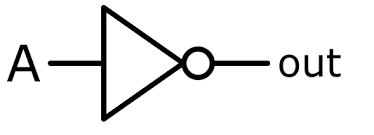
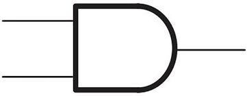
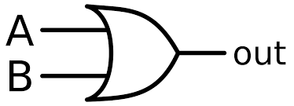
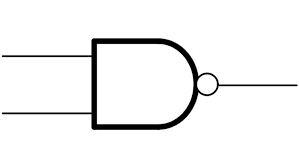
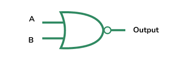
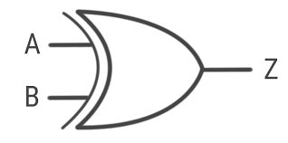
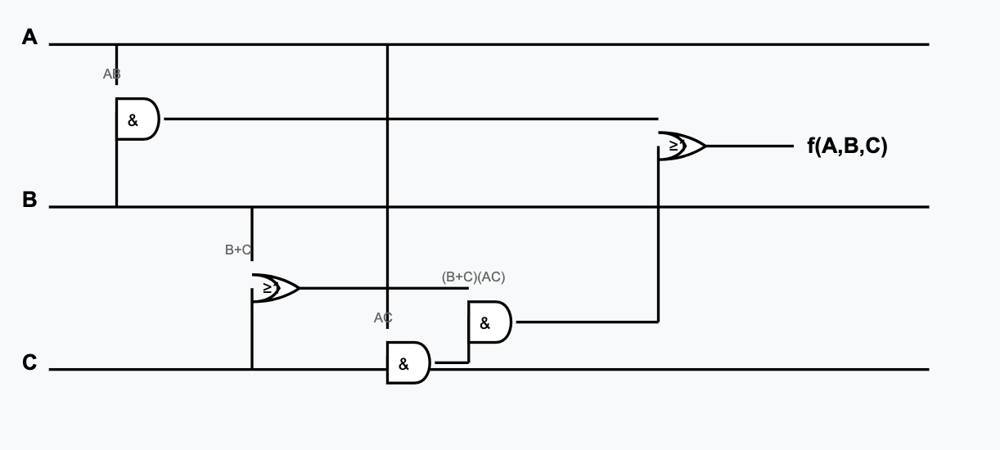

> 해당 블로그 글은 [감자님의 인프런 강의](https://inf.run/dQpKa)를 바탕으로 쓰여진 글입니다.

## 불 대수 개요

과거의 컴퓨터는 동작방식이 10진수를 이용하여 계산을 진행했다. 이후, 조지 불이라는 사람이 The Mathmetical of Logic이라는 책을 발표하였다. 이는 논리학과 대수학을 연결했지만 당시에는 실용적인 방안이 없었다. 이후 클로드 새넌이 불대수로 사칙연산이 가능하다는 것을 증명하면서 디지털의 시대를 열게 되었다. 오늘날 컴퓨터는 디지털 장치로 이루어져 있으며 이 모든 장치는 불 대수를 바탕으로 작동한다. 불 대수는 일반 수학과 달리 변수가 0과 1 또는 거짓과 참으로만 표현되는 두 가지 상태의 변수를 사용한다. 이 2가지 상태의 변수로 우리는 모든 계산이 가능하다.

그러면 불 대수는 어디서 활용이 될 수 있을까? 불 대수는 다양한 분야에서 활용된다. 가장 대표적으로 디지털 회로에 사용된다. 과거에는 이 회로를 릴레이 스위치로 구성되었으나 트랜지스터가 발명되면서 이를 대체하기 시작했다.

또한, 불 대수는 우리가 코딩하는 프로그래밍 언어에서도 다뤄진다. 바로 `boolean`형 변수를 표기하거나 이를 이용한 조건식이나 반복문에서 많이 확용된다.

``` c
if ((a > b) && (b < c))
{

}
```

개발자가 코딩을 하면서 다루는 수는 수 많은 bit로 이루어져 있는데 불 대수를 통해 이 bit들로 다양한 계산이 가능하다. 또한 데이터베이스 쿼리 작성 시에도 불 대수를 활용하면 논리를 더 깔끔히 정리하거나 다른 형태로 변환할 수 있다.

## 불 연산

불 대수에서 가장 먼저 학습할 것은 바로 0과 1 두 가지만 다루는 논리 연산이다. 이 논리 연산을 불 연산이라고 부른다. 불 연산에서 가장 먼저 알아 볼 연산은 `NOT` 연산이다.

`NOT` 연산은 입력 값을 반대로 반전 시킨다. 만약 입력 값이 1이면 출력은 0이 되고 입력 값이 0이라면 출력은 1이 된다. 이를 논리회로로 표현하면 아래와 같은 회로가 되며, NOT GATE라고 부른다.



또한, 입력 값에 따라 출력 값을 표기한 표를 진리 표라고 부른다. NOT GATE 진리표는 아래와 같다.

<table style="border-collapse: collapse; margin: 10px 0;">
  <thead>
    <tr>
      <th style="border: 1px solid #ddd; padding: 8px; background-color: #f2f2f2; color: black;">입력 (A)</th>
      <th style="border: 1px solid #ddd; padding: 8px; background-color: #f2f2f2; color: black;">출력 (NOT A)</th>
    </tr>
  </thead>
  <tbody>
    <tr>
      <td style="border: 1px solid #ddd; padding: 8px; text-align: center;">0</td>
      <td style="border: 1px solid #ddd; padding: 8px; text-align: center;">1</td>
    </tr>
    <tr>
      <td style="border: 1px solid #ddd; padding: 8px; text-align: center;">1</td>
      <td style="border: 1px solid #ddd; padding: 8px; text-align: center;">0</td>
    </tr>
  </tbody>
</table>

다음으로 살펴 볼 연산은 `AND` 연산이다. `AND` 연산을 논리회로로 표현하면 아래와 같으며



이를 AND GATE라고 한다. `AND` 연산은 2개 이상의 피연산자를 가지며 모든 피연산자가 1일때만 결과 값 1을 출력한다. 그 외의 모든 경우에는 0을 출력한다. 쉽게 생각해서 2개 이상의 피연산자를 곱셈을 진행한다라고 생각하면 편하다. `AND` 연산의 진리표는 아래와 같다.

<table style="border-collapse: collapse; margin: 10px 0;">
  <thead>
    <tr>
      <th style="border: 1px solid #ddd; padding: 8px; background-color: #f2f2f2; color: black;">입력 A</th>
      <th style="border: 1px solid #ddd; padding: 8px; background-color: #f2f2f2; color: black;">입력 B</th>
      <th style="border: 1px solid #ddd; padding: 8px; background-color: #f2f2f2; color: black;">출력 (A AND B)</th>
    </tr>
  </thead>
  <tbody>
    <tr>
      <td style="border: 1px solid #ddd; padding: 8px; text-align: center;">0</td>
      <td style="border: 1px solid #ddd; padding: 8px; text-align: center;">0</td>
      <td style="border: 1px solid #ddd; padding: 8px; text-align: center;">0</td>
    </tr>
    <tr>
      <td style="border: 1px solid #ddd; padding: 8px; text-align: center;">0</td>
      <td style="border: 1px solid #ddd; padding: 8px; text-align: center;">1</td>
      <td style="border: 1px solid #ddd; padding: 8px; text-align: center;">0</td>
    </tr>
    <tr>
      <td style="border: 1px solid #ddd; padding: 8px; text-align: center;">1</td>
      <td style="border: 1px solid #ddd; padding: 8px; text-align: center;">0</td>
      <td style="border: 1px solid #ddd; padding: 8px; text-align: center;">0</td>
    </tr>
    <tr>
      <td style="border: 1px solid #ddd; padding: 8px; text-align: center;">1</td>
      <td style="border: 1px solid #ddd; padding: 8px; text-align: center;">1</td>
      <td style="border: 1px solid #ddd; padding: 8px; text-align: center;">1</td>
    </tr>
  </tbody>
</table>

또한, `AND` 연산을 논리 곱이라고도 부르며, 곱셈 기호로도 표기하기도 한다.

다음으로 알아 볼 연산은 `OR` 연산이다. `OR` 연산을 논리회로로 표현하면 아래와 같다.



이를 OR GATE라고 부른다. `OR` 연산은 `AND` 연산처럼 2개 이상의 피연산자를 가진다. 진리표는 아래와 같다.

<table style="border-collapse: collapse; margin: 10px 0;">
  <thead>
    <tr>
      <th style="border: 1px solid #ddd; padding: 8px; background-color: #f2f2f2; color: black;">입력 A</th>
      <th style="border: 1px solid #ddd; padding: 8px; background-color: #f2f2f2; color: black;">입력 B</th>
      <th style="border: 1px solid #ddd; padding: 8px; background-color: #f2f2f2; color: black;">출력 (A OR B)</th>
    </tr>
  </thead>
  <tbody>
    <tr>
      <td style="border: 1px solid #ddd; padding: 8px; text-align: center;">0</td>
      <td style="border: 1px solid #ddd; padding: 8px; text-align: center;">0</td>
      <td style="border: 1px solid #ddd; padding: 8px; text-align: center;">0</td>
    </tr>
    <tr>
      <td style="border: 1px solid #ddd; padding: 8px; text-align: center;">0</td>
      <td style="border: 1px solid #ddd; padding: 8px; text-align: center;">1</td>
      <td style="border: 1px solid #ddd; padding: 8px; text-align: center;">1</td>
    </tr>
    <tr>
      <td style="border: 1px solid #ddd; padding: 8px; text-align: center;">1</td>
      <td style="border: 1px solid #ddd; padding: 8px; text-align: center;">0</td>
      <td style="border: 1px solid #ddd; padding: 8px; text-align: center;">1</td>
    </tr>
    <tr>
      <td style="border: 1px solid #ddd; padding: 8px; text-align: center;">1</td>
      <td style="border: 1px solid #ddd; padding: 8px; text-align: center;">1</td>
      <td style="border: 1px solid #ddd; padding: 8px; text-align: center;">1</td>
    </tr>
  </tbody>
</table>

피연산자 중 하나라도 1이라면 결과 값으로 1을 출력하고 모든 연산자가 0일때만 0을 출력한다. 쉽게 생각해서 모든 피연산자를 덧셈한다고 생각하면 쉬울 것이다. 단, 이진수 연산을 해야하니 1 + 1을 할 때는 2가 되는 것이 아니라 1로 생각해야 한다. 이 점을 주의하자. 이런 `OR` 연산을 논리 합이라고 부른다.

다음으로 알아 볼 연산은 `NAND` 연산이다. `NAND` 연산을 논리회로로 표현하면 아래와 같다.



이는 AND GATE에 동그라미 하나가 더 붙은 모습이며 NAND GATE라고 부른다. `NAND` 연산은 2개 이상의 피연산자를 가지며 `AND` 연산 결과에 `NOT` 연산을 한번 더 수행하는 연산이다. `NAND` 연산의 진리표를 보면 `AND` 연산의 출력과 정반대임을 알 수 있다.

<table style="border-collapse: collapse; margin: 10px 0;">
  <thead>
    <tr>
      <th style="border: 1px solid #ddd; padding: 8px; background-color: #f2f2f2; color: black;">입력 A</th>
      <th style="border: 1px solid #ddd; padding: 8px; background-color: #f2f2f2; color: black;">입력 B</th>
      <th style="border: 1px solid #ddd; padding: 8px; background-color: #f2f2f2; color: black;">출력 (A NAND B)</th>
    </tr>
  </thead>
  <tbody>
    <tr>
      <td style="border: 1px solid #ddd; padding: 8px; text-align: center;">0</td>
      <td style="border: 1px solid #ddd; padding: 8px; text-align: center;">0</td>
      <td style="border: 1px solid #ddd; padding: 8px; text-align: center;">1</td>
    </tr>
    <tr>
      <td style="border: 1px solid #ddd; padding: 8px; text-align: center;">0</td>
      <td style="border: 1px solid #ddd; padding: 8px; text-align: center;">1</td>
      <td style="border: 1px solid #ddd; padding: 8px; text-align: center;">1</td>
    </tr>
    <tr>
      <td style="border: 1px solid #ddd; padding: 8px; text-align: center;">1</td>
      <td style="border: 1px solid #ddd; padding: 8px; text-align: center;">0</td>
      <td style="border: 1px solid #ddd; padding: 8px; text-align: center;">1</td>
    </tr>
    <tr>
      <td style="border: 1px solid #ddd; padding: 8px; text-align: center;">1</td>
      <td style="border: 1px solid #ddd; padding: 8px; text-align: center;">1</td>
      <td style="border: 1px solid #ddd; padding: 8px; text-align: center;">0</td>
    </tr>
  </tbody>
</table>

디지털 논리 회로에서 NAND GATE는 매우 중요하다. 왜냐하면 NAND GATE만으로도 모든 논리 게이트를 구현할 수 있기 때문이다. 그럼 어떻게 구현할 수 있을까? 해당 내용은 추후에 자세히 알아보도록 하겠다.

다음으로 알아 볼 연산은 `NOR` 연산이다. `NOR` 연산을 논리회로로 표현하면 아래와 같다.



OR GATE에 동그라미 하나가 더 붙은 모습으로 이를 NOR GATE라고 부른다. `NOR` 연산은 2개 이상의 피연산자를 가지며 `OR` 연산 결과에 `NOT` 연산을 한번 더 수행한 결과이다. `NOR` 연산의 진리표를 보면 `OR` 연산 출력의 정 반대임을 알 수 있다.

<table style="border-collapse: collapse; margin: 10px 0;">
  <thead>
    <tr>
      <th style="border: 1px solid #ddd; padding: 8px; background-color: #f2f2f2; color: black;">입력 A</th>
      <th style="border: 1px solid #ddd; padding: 8px; background-color: #f2f2f2; color: black;">입력 B</th>
      <th style="border: 1px solid #ddd; padding: 8px; background-color: #f2f2f2; color: black;">출력 (A NOR B)</th>
    </tr>
  </thead>
  <tbody>
    <tr>
      <td style="border: 1px solid #ddd; padding: 8px; text-align: center;">0</td>
      <td style="border: 1px solid #ddd; padding: 8px; text-align: center;">0</td>
      <td style="border: 1px solid #ddd; padding: 8px; text-align: center;">1</td>
    </tr>
    <tr>
      <td style="border: 1px solid #ddd; padding: 8px; text-align: center;">0</td>
      <td style="border: 1px solid #ddd; padding: 8px; text-align: center;">1</td>
      <td style="border: 1px solid #ddd; padding: 8px; text-align: center;">0</td>
    </tr>
    <tr>
      <td style="border: 1px solid #ddd; padding: 8px; text-align: center;">1</td>
      <td style="border: 1px solid #ddd; padding: 8px; text-align: center;">0</td>
      <td style="border: 1px solid #ddd; padding: 8px; text-align: center;">0</td>
    </tr>
    <tr>
      <td style="border: 1px solid #ddd; padding: 8px; text-align: center;">1</td>
      <td style="border: 1px solid #ddd; padding: 8px; text-align: center;">1</td>
      <td style="border: 1px solid #ddd; padding: 8px; text-align: center;">0</td>
    </tr>
  </tbody>
</table>

마지막으로 알아 볼 연산은 `XOR` 연산이다. `XOR` 연산을 논리회로로 표현하면 아래와 같다.



OR GATE와 비슷하지만 입력 쪽에 줄이 하나 더 있는 모양이다. `XOR` 연산은 2개 이상의 피연산자를 가지며 입력 값중 1이 정확히 한 개일때만 1을 출력하고 나머지 경우 0을 출력하는 회로이다. `XOR` 연산의 진리표는 다음과 같다.

<table style="border-collapse: collapse; margin: 10px 0;">
  <thead>
    <tr>
      <th style="border: 1px solid #ddd; padding: 8px; background-color: #f2f2f2; color: black;">입력 A</th>
      <th style="border: 1px solid #ddd; padding: 8px; background-color: #f2f2f2; color: black;">입력 B</th>
      <th style="border: 1px solid #ddd; padding: 8px; background-color: #f2f2f2; color: black;">출력 (A XOR B)</th>
    </tr>
  </thead>
  <tbody>
    <tr>
      <td style="border: 1px solid #ddd; padding: 8px; text-align: center;">0</td>
      <td style="border: 1px solid #ddd; padding: 8px; text-align: center;">0</td>
      <td style="border: 1px solid #ddd; padding: 8px; text-align: center;">0</td>
    </tr>
    <tr>
      <td style="border: 1px solid #ddd; padding: 8px; text-align: center;">0</td>
      <td style="border: 1px solid #ddd; padding: 8px; text-align: center;">1</td>
      <td style="border: 1px solid #ddd; padding: 8px; text-align: center;">1</td>
    </tr>
    <tr>
      <td style="border: 1px solid #ddd; padding: 8px; text-align: center;">1</td>
      <td style="border: 1px solid #ddd; padding: 8px; text-align: center;">0</td>
      <td style="border: 1px solid #ddd; padding: 8px; text-align: center;">1</td>
    </tr>
    <tr>
      <td style="border: 1px solid #ddd; padding: 8px; text-align: center;">1</td>
      <td style="border: 1px solid #ddd; padding: 8px; text-align: center;">1</td>
      <td style="border: 1px solid #ddd; padding: 8px; text-align: center;">0</td>
    </tr>
  </tbody>
</table>

쉽게 생각해서 두 입력이 같으면 0 다르면 1로 외우는 것도 추천한다. 이런 특성때문에 두 입력이 같은지 다른지 확인할 때 `XOR` 연산을 사용하기도 한다.

## 불 대수의 성질과 법칙

이제 불 대수의 여러 법칙들을 알아보자. 불 대수에는 **항등원**이 존재한다. 항등원이란, 임의의 수 a에 대하여 어떤 수를 연산했을 때 처음의 수 a가 되도록 만들어주는 수를 말한다. 한번 예시를 들어보겠다.

덧셈에서는 0이 항등원이다. 예를들어 10에 0을 더하면 결과는 10이 된다. 곱셈에서는 1이 항등원이다. 예를들어 10에 1을 곱하면 결과는 10이 된다. 이는 불 대수에서도 동일하게 적용된다. 따라서 `AND` 연산의 항등원은 1이 되고 `OR` 연산의 항등원은 0이 된다. 이를 이용하면 아래와 같은 수식이 성립됨을 직감할 수 있다.

> A = A AND 1 = A OR 0

위의 수식을 보고 어떤 독자는 너무 당연한 이야기라고 생각할 수 있을 것이다. 굳이 더 길게 쓸 필요 없이 그냥 A로 표기하면 좋지 않을까 싶기도 할 것이다. A를 길게 표현하는 것이 불필요해보일 수 있지만 항등원 성질은 복잡한 식을 정리할 때 유용하게 활용된다. 앞으로 배울 여러 법칙들과 여러 정리과정에서 항등원이 왜 필요한지 알 것이다.

그럼 이제 불 대수의 법칙을 살펴보도록 하겠다. 가장 먼저 **교환 법칙**에 대해 살펴보자. 교환 법칙은 피연산자들의 순서를 바꿔도 결과가 같다는 성질이다.

> ex
>
> A AND B = B AND A
>
> A OR B = B OR A
>
> A XOR B = B XOR A

다음으로 알아 볼 법칙은 **결합 법칙**이다. 결합 법칙은 3개 이상의 항을 연산할 때 어느 두 항을 먼저 연산하더라도 최종결과가 같은 성질을 말한다.

> ex
>
> (A AND B) AND C = A AND (B AND C)
>
> (A OR B) OR C = A OR (B OR C)
>
> (A XOR B) XOR C = A XOR (B XOR C)

> ⚠️ 주의
>
> 결합 법칙은 주의할 점이 있는데 NAND, NOR, XNOR같은 부정연산이 같이 들어간 연산에는 적용되지 않는다. 이 원리는 수학에서 곱셈과 덧셈은 결합법칙이 성립하지만 뺄셈과 나눗셈은 결합법칙이 성립되지 않은 것과 유사하다.

다음으로 살펴 볼 법칙은 **분배 법칙**이다. 분배 법칙은 예시로 보면 바로 알 수 있으니 예시로 살펴보도록 하자.

> ex
>
> A AND (B OR C) = (A AND B) OR (A AND C)
>
> A OR (B AND C) = (A OR B) AND (A OR C)
>
> A AND (B XOR C) = (A AND B) XOR (A AND C)

이 법칙은 `AND`, `OR`, `XOR`에서 성립한다. 분배 법칙도 결합 법칙처럼 `NAND`, `NOR`, `XNOR`에는 적용되지 않습니다.

다음으로 알아 볼 법칙은 **동일 법칙**이다. 동일 법칙은 `AND`나 `OR` 연산에서 같은 값을 두번 연산해도 결과가 그 값과 같다는 성질이다.

> ex
>
> A AND A = A
>
> A OR A = A

다음으로 알아 볼 법칙은 **이중 부정 법칙**이다. 이중 부정 법칙은 어떤 변수를 두번 부정하면 원래 값으로 돌아온다는 성질이다.

다음으로 알아 볼 법칙은 **흡수 법칙**이다. 흡수 법칙은 아래와 같은 2가지 형태를 가진다.

> A AND (A OR B) = A
>
> A OR (A AND B) = A

이는 복잡한 식이 하나의 성질로 흡수되는 법칙을 말한다. 흡수 법칙은 지금까지 알아 본 법칙들로 증명이 가능하다. 수식에 대입을 하면 쉽게 이해가 가능할 것이다.

마지막으로 알아 볼 법칙은 **드모르간 법칙**이다. 드모르간 법칙은 다음과 같다.

> NOT (A AND B) = NOT A OR NOT B
>
> NOT (A OR B) = NOT A AND NOT B

드모르간 법칙은 식을 정리할 때 사용되며, 자주 사용되는 법칙 중 하나이다.

## 불 함수

이번에는 불 함수에 대해 살펴보도록 하자. 수학에서 함수는 입력 값이 변함에 따라 출력 값도 변한다. 예시를 들어보도록 하자. 함수가 `f(x) = 2x + 1`이라고 가정해보자. 입력 x에 2가 들어갈 때 출력이 5가 된다. 불 함수는 이러한 함수 중에서 입력 값과 출력 값이 모두 `true` 혹은 `false`인 특별한 함수이다. 대표적인 예시로 `f(A, B) = A AND B`같은 불 대수가 들어간 함수이다.

불 함수는 이러한 방정식 형태뿐만 아니라 진리표나 논리 회로로도 표현할 수 있다. 이렇게 불 함수는 방정식 표현을 진리표로 혹은 논리회로를 방정식으로 표현할 수 있다면 컴퓨터 설계에 있어서 매우 유용할 것이다. 그럼 해당 방법을 살펴보자.

먼저, 방정식을 진리표로 바꾸는 방법에 대해 살펴보자. 이 방식은 매우 간단하다. 방정식에 입력 값에 가능한 모든 값을 대입하여 계산한 결과를 진리표에 대입하면 된다.

다음으로, 방정식에서 논리 회로로 변경하는 방법에 대해 살펴보자. 만약 방정식이 아래와 같이 되어 있다면

> f(A, B, C) = (AB) + ((B + C)(AC))

먼저 입력 값 A, B, C를 논리 회로로 표기해준다. 가장 먼저, AB를 계산하기 위해서 A와 B를 AND 게이트로 연결한다. 다음 B OR C를 계산하기 위해서 B와 C는 OR 게이트에 연결해준다. 이제 A와 C를 AND 연산하기 위해서 A와 C를 AND 게이트에 연결해주도록 한다. 이제 B OR C와 A AND C의 결과를 새로운 AND 게이트에 연결해준다. 이후 해당 결과와 A AND B의 결과를 OR 게이트에 연결해주면 논리 회로가 완성이 된다.



해당 과정은 연산 우선순위에 따라 단순히 논리게이트로만 연결만 해주면 되는 작업이다. 불 연산의 우선순위는 수학과 마찬가지로 괄호 안에 있는 연산이 가장 먼저 수행되고 그 다음으로 NOT, AND, OR순서로 진행된다.

## 진리표를 변환하는 방법

이번에는 진리표를 방정식과 논리회로로 변환하는 방법에 대해 알아보도록 하겠다. 먼저 아래와 같은 진리표가 있다고 생각해보자.

<table style="border-collapse: collapse; font-family: Arial, sans-serif;">
  <tr style="color: black;">
    <th style="border: 1px solid #ddd; padding: 8px 12px; text-align: center; background-color: #f2f2f2; font-weight: bold;">A</th>
    <th style="border: 1px solid #ddd; padding: 8px 12px; text-align: center; background-color: #f2f2f2; font-weight: bold;">B</th>
    <th style="border: 1px solid #ddd; padding: 8px 12px; text-align: center; background-color: #f2f2f2; font-weight: bold; border-right: 2px solid #333;">C</th>
    <th style="border: 1px solid #ddd; padding: 8px 12px; text-align: center; background-color: #f2f2f2; font-weight: bold;">F</th>
  </tr>
  <tr>
    <td style="border: 1px solid #ddd; padding: 8px 12px; text-align: center;">0</td>
    <td style="border: 1px solid #ddd; padding: 8px 12px; text-align: center;">0</td>
    <td style="border: 1px solid #ddd; padding: 8px 12px; text-align: center; border-right: 2px solid #333;">0</td>
    <td style="border: 1px solid #ddd; padding: 8px 12px; text-align: center;">0</td>
  </tr>
  <tr style="background-color: #f9f9f9; color: black;">
    <td style="border: 1px solid #ddd; padding: 8px 12px; text-align: center;">0</td>
    <td style="border: 1px solid #ddd; padding: 8px 12px; text-align: center;">0</td>
    <td style="border: 1px solid #ddd; padding: 8px 12px; text-align: center; border-right: 2px solid #333;">1</td>
    <td style="border: 1px solid #ddd; padding: 8px 12px; text-align: center;">0</td>
  </tr>
  <tr>
    <td style="border: 1px solid #ddd; padding: 8px 12px; text-align: center;">0</td>
    <td style="border: 1px solid #ddd; padding: 8px 12px; text-align: center;">1</td>
    <td style="border: 1px solid #ddd; padding: 8px 12px; text-align: center; border-right: 2px solid #333;">0</td>
    <td style="border: 1px solid #ddd; padding: 8px 12px; text-align: center;">0</td>
  </tr>
  <tr style="background-color: #f9f9f9; color: black;">
    <td style="border: 1px solid #ddd; padding: 8px 12px; text-align: center;">0</td>
    <td style="border: 1px solid #ddd; padding: 8px 12px; text-align: center;">1</td>
    <td style="border: 1px solid #ddd; padding: 8px 12px; text-align: center; border-right: 2px solid #333;">1</td>
    <td style="border: 1px solid #ddd; padding: 8px 12px; text-align: center;">0</td>
  </tr>
  <tr>
    <td style="border: 1px solid #ddd; padding: 8px 12px; text-align: center;">1</td>
    <td style="border: 1px solid #ddd; padding: 8px 12px; text-align: center;">0</td>
    <td style="border: 1px solid #ddd; padding: 8px 12px; text-align: center; border-right: 2px solid #333;">0</td>
    <td style="border: 1px solid #ddd; padding: 8px 12px; text-align: center;">0</td>
  </tr>
  <tr style="background-color: #f9f9f9; color: black;">
    <td style="border: 1px solid #ddd; padding: 8px 12px; text-align: center;">1</td>
    <td style="border: 1px solid #ddd; padding: 8px 12px; text-align: center;">0</td>
    <td style="border: 1px solid #ddd; padding: 8px 12px; text-align: center; border-right: 2px solid #333;">1</td>
    <td style="border: 1px solid #ddd; padding: 8px 12px; text-align: center;">0</td>
  </tr>
  <tr>
    <td style="border: 1px solid #ddd; padding: 8px 12px; text-align: center;">1</td>
    <td style="border: 1px solid #ddd; padding: 8px 12px; text-align: center;">1</td>
    <td style="border: 1px solid #ddd; padding: 8px 12px; text-align: center; border-right: 2px solid #333;">0</td>
    <td style="border: 1px solid #ddd; padding: 8px 12px; text-align: center;">1</td>
  </tr>
  <tr style="background-color: #f9f9f9; color: black;">
    <td style="border: 1px solid #ddd; padding: 8px 12px; text-align: center;">1</td>
    <td style="border: 1px solid #ddd; padding: 8px 12px; text-align: center;">1</td>
    <td style="border: 1px solid #ddd; padding: 8px 12px; text-align: center; border-right: 2px solid #333;">1</td>
    <td style="border: 1px solid #ddd; padding: 8px 12px; text-align: center;">1</td>
  </tr>
</table>

그런데 진리표만 보면 어떤 불 연산들이 조합되었는지 알기가 어렵다. 여기서 우리가 가장 먼저 할 일은 결과 값이 0인 행들은 모두 제외시키는 것을 해야 한다. 결과가 0인 행들은 신경쓰지 않아도 되는 행들이라서 이를 Don't Care라고 부른다. Don't Care행을 지우면 아래와 같이 2개의 행만 구성된다.

<table style="border-collapse: collapse; font-family: Arial, sans-serif;">
  <tr style="color: black;">
    <th style="border: 1px solid #ddd; padding: 8px 12px; text-align: center; background-color: #f2f2f2; font-weight: bold;">A</th>
    <th style="border: 1px solid #ddd; padding: 8px 12px; text-align: center; background-color: #f2f2f2; font-weight: bold;">B</th>
    <th style="border: 1px solid #ddd; padding: 8px 12px; text-align: center; background-color: #f2f2f2; font-weight: bold; border-right: 2px solid #333;">C</th>
    <th style="border: 1px solid #ddd; padding: 8px 12px; text-align: center; background-color: #f2f2f2; font-weight: bold;">F</th>
  </tr>
  <tr>
    <td style="border: 1px solid #ddd; padding: 8px 12px; text-align: center;">1</td>
    <td style="border: 1px solid #ddd; padding: 8px 12px; text-align: center;">1</td>
    <td style="border: 1px solid #ddd; padding: 8px 12px; text-align: center; border-right: 2px solid #333;">0</td>
    <td style="border: 1px solid #ddd; padding: 8px 12px; text-align: center;">1</td>
  </tr>
  <tr style="background-color: #f9f9f9; color: black;">
    <td style="border: 1px solid #ddd; padding: 8px 12px; text-align: center;">1</td>
    <td style="border: 1px solid #ddd; padding: 8px 12px; text-align: center;">1</td>
    <td style="border: 1px solid #ddd; padding: 8px 12px; text-align: center; border-right: 2px solid #333;">1</td>
    <td style="border: 1px solid #ddd; padding: 8px 12px; text-align: center;">1</td>
  </tr>
</table>

우리는 이 2개의 행만 방정식이나 논리회로로 변환하면 되는 것이다. 첫 번째 행을 방정식으로 변환해보자. 같은 행 내에서는 모든 입력을 `AND` 연산으로 연결하여 결과가 1이 되도록 하면 된다. 즉, `F(A, B, C) = A AND B AND C`라는 불 함수를 만들어 본다.

그리고 해당 불 함수에 진리표의 입력 값을 넣어봤을 때 결과 값이 일치한지 확인한다. 하지만 결과 값이 일치하지 않는다. 이럴 때 다음으로 할 일은 입력 값중 다른 값이 존재한다면 해당 값을 `NOT` 연산을 처리한다. 여기서는 C가 다르니 C쪽에 `NOT` 연산을 해준다. 그러면 진리표에 맞게 첫번째 행의 결과 값이 나오게 됨을 알 수 있다. 즉 이를 방정식으로 다시 표현하면 `F(A, B, C) = A AND B AND NOT C`인 셈을 알 수 있다.

이제 다음 행도 각 입력 값을 `AND`로 연결해 불 연산을 해주면 된다. 즉, 불 함수로 만들면 `F(A, B, C) = A AND B AND C`로 나옴을 알 수 있다.

이렇게 모든 행을 방정식으로 만들었다면 각 행을 `OR` 연산으로 묶어주기만 하면 된다. 즉, `(A AND B AND NOT C) OR (A AND B AND C)`를 수행하면 되는 것이다. 이렇게 완성된 방정식을 기존 진리표에 대입해서 확인해보면 일치하다는 것을 알 수 있을 것이다.

이 방정식을 바탕으로 논리회로도 쉽게 구성할 수 있다. 먼저 입력 A, B, C를 만들어주고 왼쪽 방정식에 해당하는 논리 회로를 구성해준다. A와 B는 그대로 AND GATE에 연결하고 C는 NOT GATE를 거쳐서 AND GATE에 연결해주면 된다.

이번에는 오른쪽 방정식에 해당되는 논리회로를 구성해준다. A와 B, C를 각각 AND GATE에 연결해주면 끝이다.

이제 각 방정식의 결과 값들을 OR GATE에 연결해주면 완성되는 것이다. 이렇게 진리표 하나로 방정식과 논리회로를 구성할 수 있다. 이제 여기서 더 나아가서 해당 방정식과 논리회로를 조금 더 최적화를 해보도록 하겠다. 우리가 코드를 리팩토링하는 것처럼 말이다. 이렇게 리팩토링 과정을 거치면 논리회로도 단순해지고 필요한 부품수도 줄어들어 비용도 절감되며 속도도 향상된다. 그러면 어떻게 리팩토링을 할 수 있을까? 바로 불 대수 법칙들을 이용하는 것이다.

`(A AND B AND NOT C) OR (A AND B AND C)`같은 방정식을 불 대수 법칙을 이용하여 간단히 만들어 보자. 먼저 분배 법칙을 적용해 `A AND B AND (NOT C OR C)`로 표현이 가능하다. 여기서 `NOT C OR C` 연산은 항상 1이 된다. 따라서 식을 `A AND B AND 1`로 표현할 수 있다. 여기서 해당 방정식을 한 번 더 분배 법칙을 적용하면 `A AND B`로 단순화 시킬 수 있다.

이런 단순화된 방정식을 회로로 구성하면 우리가 알던 기초적인 AND GATE가 됨을 알 수 있다.

## 카르노 맵

카르노 맵은 복잡한 불 방정식을 쉽고 빠르게 정리하기 위한 기법이다. 그런데 우리가 알고 있듯이 방정식은 불 대수의 법칙을 이용해서 줄일 수 있다고 알 수 있었다. 그러면 굳이 카르노 맵이 필요할까? 물론 불 대수의 법칙을 이용하여 방정식을 줄일 수 있다. 하지만 식이 조금만 복잡해져도 이러한 방법은 시간이 많이 걸리고 어렵다. 그래서 조금 더 쉽게 줄이기 위해 카르노 맵을 배운다고 생각하면 될 것이다.

카르노 맵은 불 방정식을 간략화 하기 위해 만들어진 도구이다. 카르노 맵은 입력 변수에 따라 달라지는 표를 만들어 정리한다.

먼저 변수 A, B 2개가 있는 식을 간소화 하는 방법을 알아보자. 우리가 간소화 해 볼 방정식은 아래와 같다.

> F = A AND B OR A AND NOT B OR NOT A AND NOT B

카르노 맵에서 변수가 2개일 때는 2^2개 즉, 4개가 들어 갈 수 있는 표를 만들고 왼쪽에 A와 B를 적는다. 그 다음 A열에 0과 1을 적어준다. B행도 0과 1을 적어준다. 이렇게 기본 표가 완성되면 준비는 끝난 것이다. 이제 각 항을 표에 그려보겠다. 먼저 첫 항인 A AND B를 표에 적어주겠다. A AND B가 1이 되려면 A가 1이고 B가 1이어야 한다. 그러면 카르노 맵의 해당 영역에 1을 표시해준다. 다음으로 A AND NOT B를 알아보자. A AND NOT B가 1이 되려면 A는 1이고 B는 0이어야 한다. 해당 지점에도 1을 표시한다. 다음으로 세번째 항인 NOT A AND NOT B를 표에 적어보겠다. NOT A AND NOT B가 1이 되려면 A와 B 전부 0이 되어야 한다. 해당 지점에 1을 표기해준다.

다음으로 1이 적힌 영역을 묶어줘야 한다. 묶는 단위는 2의 거듭제곱으로 최대한 크게 선택해야 한다. 먼저 이 영역을 2^1개인 2개로 묶어주겠다. 그러면 1이 하나 남게 되는데 남은 1을 단독으로 묶어줄 수도 있지만 최대한 크게 묶기 위해서 2개 단위로 묶어준다. 그러면 2개로 묶인 영역이 2개가 된 것을 알 수 있다.

이제 묶인 영역을 바탕으로 최종 정리를 해보겠다. 세로로 묶인 영역은 A값과 관계없이 B가 0인 경우이다. 이는 NOT B를 의미한다. 가로로 묶인 영역은 B값과 상관없이 A가 1인 경우이다. 이는 A를 의미한다. 이 두 항을 OR연산으로 연결하면 A OR NOT B가 됨을 알 수 있다.

세번째 항도 같다. 즉, 세로 열에 A를 나머지는 BC를 표기해주면 되고 나머지는 이전과 동일하다. 그러면 과정을 그림으로 나타내보겠다. 그림을 보면 한번에 이해가 될 것이다.


> 잘못된 지식이 있을 경우 댓글로 남겨주시면 빠르게 반영하겠습니다!