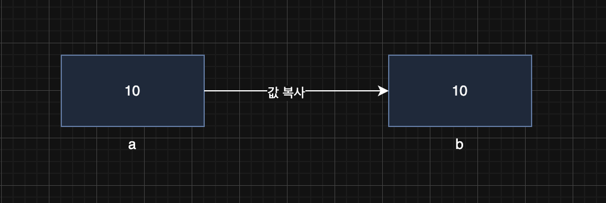
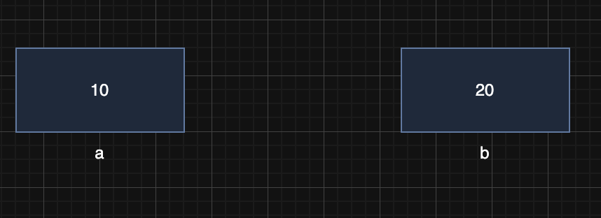
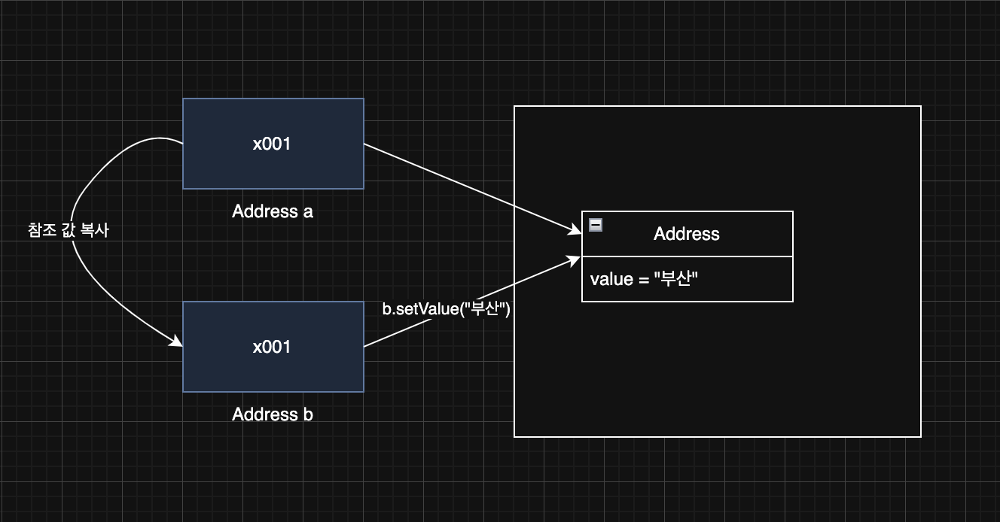

> 해당 블로그 글은 [영한님의 인프런 강의](https://inf.run/FiFGQ)를 바탕으로 쓰여진 글입니다.

자바에서 제공해주는 기본 클래스들은 전부 불변 객체이다. 따라서 불변 객체가 무엇인지 모른다면 기본 클래스를 제대로 이해를 못 할 것이다. 그래서 우리는 불볍 객체에 대해 알아보려고 한다.

## 기본형과 참조형의 공유

우리가 이제까지 배웠던 대원칙을 떠올려보자. **자바는 항상 변수의 값을 복사해서 대입한다.(Call By Value)** 이 원칙은 너무너무 중요하다. 또한 이 원칙이 불변 객체의 시작점인 것이다. 그러면 이 원칙을 생각하면서 기본형과 참조형이 어떻게 변수의 값을 전달하는지 살펴보자.

- 기본형: 하나의 값을 여러 변수에서 절대로 공유하지 않는다.
- 참조형: 하나의 객체를 참조값을 통해 여러 변수에서 공유할 수 있다.

기본형은 변수에 들어있는 값이 그대로 저장되어 있기에 절대 변수를 공유해서 진행할 수는 없다. 하지만 참조형 변수는 참조값을 복사하여 전달하기 때문에 참조값에 해당하는 인스턴스를 공유할 수 있다. 그러면 쉽게 예제를 살펴보자.

``` java
package lang.immutable.address;

public class PrimitiveMain {
    public static void main(String[] args) {
        int a = 10;
        int b = a;
        System.out.println("a = " + a);
        System.out.println("b = " + b);

        b = 20;
        System.out.println("20 -> b");
        System.out.println("a = " + a);
        System.out.println("b = " + b);
    }
}
```

위와 같이 a라는 변수를 선언하고 10을 대입한다. 그 후에 변수 b를 선언하고 a의 값을 복사해서 대입한다. 즉, 그림으로 표현하면 아래와 같이 된다.



그 후 변수에 20을 대입한다. 그러면 아래 그림과 같이 b의 값만 변경이 된다.



그러면 이제 참조형으로 값 복사에 대해 알아보자.

``` java
package lang.immutable.address;

public class Address {

    private String value;

    public Address(String value) {
        this.value = value;
    }

    public String getValue() {
        return value;
    }

    public void setValue(String value) {
        this.value = value;
    }

    @Override
    public String toString() {
        return "Address{" +
                "value='" + value + '\'' +
                '}';
    }
}
```

위와 같이 주소에 대한 클래스를 정의하였다. 이제 main메서드를 통해 해당 객체를 이용해 참조형 값 복사를 알아보자.

``` java
package lang.immutable.address;

public class RefMain1_1 {
    public static void main(String[] args) {
        Address a = new Address("서울");
        Address b = a;
        System.out.println("a = " + a);
        System.out.println("b = " + b);

        b.setValue("부산");
        System.out.println("부산 -> b");
        System.out.println("a = " + a);
        System.out.println("b = " + b);
    }
}
```

위의 코드의 실행 결과는 어떻게 될까? 처음에는 둘다 서울로 나올 것이다. 그러면 두번째 출력문은 어떻게 나올까? b만 부산으로 나올까? 아니다! 결과는 둘다 부산으로 변경이 되어 버렸다. 왜 그럴까? 바로 참조값을 복사해서 전달하여 같은 인스턴스를 공유하고 있기 때문이다. 그림으로 살펴보면 아래와 같이 될 것이다.




## 공유 참조와 사이드 이펙트

> 📚 용어 정리
>
> 사이드 이펙트: 프로그래밍에서 어떤 계산이 주된 작업 외에 추가적인 부수 효과를 일으키는 것을 말한다. 대표적인 예시로 바로 위에서 작성했던 코드이다. 프로그래밍에서 사이드 이펙트는 보통 부정적인 의미로 사용되는데, 사이드 이펙트는 프로그램의 특정 부분에서 발생한 변경이 의도치 않게 다른 부분에 영향을 미치는 경우에 발생한다. 이로 인해 디버깅이 어려워지고 코드의 안정성이 저하될 수 있다.

우리는 위에서 b만 값을 변경하려고 의도를 하였는데 a까지 같이 변경되는 사이드 이펙트를 맛을 보았다. 그럼 어떻게 이것을 해결할 수 있을까?

### 해결법

``` java
Address a = new Address("서울");
Address b = a;
```

위의 코드를 아래와 같이 인스턴스를 별도로 생성하게 변경하면 되는 것이다.

``` java
Address a = new Address("서울");
Address b = new Address("서울");
```

위와 같이 하면 a와 b 전부 서로 다른 인스턴스를 참조하기 때문에 b의 값을 변경해도 a의 값은 변경되지 않는다. 지금까지 발생한 모든 문제는 같은 객체(인스턴스)를 변수 `a` , `b` 가 함께 공유하기 때문에 발생했다. 따라서 객체를 공유하지 않으면 문제가 해결된다.

쉽게 이야기해서 여러 변수가 하나의 객체를 공유하지 않으면 지금까지 설명한 문제들이 발생하지 않는다. 그런데 여기서 문제가 있다. 하나의 객체를 여러 변수가 공유하지 않도록 강제로 막을 수 있는 방법이 없다는 것이다. 즉, 아래와 같이 작성해도 컴파일 에러나 런타임 에러가 발생하지는 않는 것이다.

``` java
Address a = new Address("서울");
Address b = a;
```

그리고 더 최악으로 가서 이렇게 인스턴스의 필드를 변경하는 로직을 외부 API를 이용하여 한다고 해보자. 보통 API 로직을 뜯어보지 않고 우리는 사용법만 보고 사용을 하기 마련인데 이 API를 만든 개발자가 문서화를 친절히 안했다면 아까와 같은 사이드 이펙트가 발생하기 마련이다. 아래의 예제 코드는 위의 이야기를 코드로 설명한 것인데 `change`메서드가 외부 API라고 생각해보자.

``` java
package lang.immutable.address;

public class RefMain1_3 {
    public static void main(String[] args) {
        Address a = new Address("서울");
        Address b = a;
        System.out.println("a = " + a);
        System.out.println("b = " + b);

        change(b, "부산");
        System.out.println("부산 -> b");
        System.out.println("a = " + a);
        System.out.println("b = " + b);
    }

    private static void change(Address address, String changeAddress) {
        System.out.println("주소 값을 변경합니다 -> " + changeAddress);
        address.setValue(changeAddress);
    }
}
```

여러 변수가 하나의 객체를 참조하는 공유 참조를 막을 수 있는 방법은 없다. 그럼 공유 참조로 인해 발생하는 문제를 어떻게 해결할 수 있을까? 단순히 개발자가 공유 참조 문제가 발생하지 않도록 조심해서 코드를 작성해야 할까?

## 불변 객체 - 도입

지금까지 발생한 문제를 잘 생각해보면 공유하면 안되는 객체를 여러 변수에서 공유했기 때문에 발생한 문제이다. 하지만 앞서 살펴보았듯이 객체의 공유를 막을 수 있는 방법은 없다. 그런데 사이드 이펙트의 더 근본적인 원인을 고려해보면, 객체를 공유하는 것 자체는 문제가 아니다. 객체를 공유한다고 바로 사이드 이펙트가 발생하지는 않는다. **문제의 직접적인 원인은 공유된 객체의 값을 변경한 것에 있다.**

오히려 아래와 같이 값을 공유하는 것은 문제가 안되고 오히려 좋다. 메모리도 절약하고 실행시간도 조금이라도 단축시킬 수 있다.

``` java
Address a = new Address("서울");
Address b = a;
```

하지만 아래와 같이 값을 변경하는데서 사이드 이펙트가 발생한다.

``` java
b.setValue("부산");
```

그러면 이렇게 값을 못 바꾸게 설정하면 된다. 즉, setter를 없애주면 해결이 될 것 같다. 하지만 이렇게 해도 문제가 될 수 있다. 왜냐하면 다른 개발자가 보고 setter를 만들 수 있기 때문이다. 그러면 어떻게 해결하는게 좋을까? 바로 멤버 변수 자체를 `final`로 만들고 setter를 제거하는 것이다. 그러면 다른 개발자가 setter를 만들더라도 컴파일 에러가 발생하기에 이건 불변 객체라는 것을 알게끔 할 수 있다.

``` java
package lang.immutable.address;

public class Address {

    private final String value;

    public Address(String value) {
        this.value = value;
    }

    public String getValue() {
        return value;
    }

    @Override
    public String toString() {
        return "Address{" +
                "value='" + value + '\'' +
                '}';
    }
}
```

이렇게 불변 객체를 만들 준비를 하였다면 아래와 같이 생성자를 호출하여 다른 인스턴스로 만들면 해당 문제는 해결이 된다.

``` java
package lang.immutable.address;

public class RefMain2 {
    public static void main(String[] args) {
        Address a = new Address("서울");
        Address b = a;
        System.out.println("a = " + a);
        System.out.println("b = " + b);

        b = new Address("부산");
        System.out.println("b -> 부산");
        System.out.println("a = " + a);
        System.out.println("b = " + b);
    }
}
```

### 정리

**불변이라는 단순한 제약을 사용해서 사이드 이펙트라는 큰 문제를 막을 수 있다.**

- 객체의 공유 참조는 막을 수 없다. 그래서 객체의 값을 변경하면 다른 곳에서 참조하는 변수의 값도 함께 변경되는 사이드 이펙트가 발생한다. 사이드 이펙트가 발생하면 안되는 상황이라면 불변 객체를 만들어서 사용하면 된다. 불변 객체는 값을 변경할 수 없기 때문에 사이드 이펙트가 원천 차단된다.
- 불변 객체는 값을 변경할 수 없다. 따라서 불변 객체의 값을 변경하고 싶다면 변경하고 싶은 값으로 새로운 불변 객체를 생성해야 한다. 이렇게 하면 기존 변수들이 참조하는 값에는 영향을 주지 않는다.

> ✅ 참고
>
> - 가변: 가변은 이름 그대로 처음 만든 이후 상태가 변할 수 있다는 뜻이다.
> - 불변: 불변은 이름 그대로 처음 만든 이후 상태가 변하지 않는다는 뜻이다.

## 불변 객체 - 값 변경

불변 객체를 사용하지만 그래도 값을 변경해야 하는 메서드가 필요하면 어떻게 해야할까? 한번 예제 코드를 통해 알아보자.

``` java
package lang.immutable.address;

public class Address {

    private final String value;

    public Address(String value) {
        this.value = value;
    }

    public String getValue() {
        return value;
    }

    @Override
    public String toString() {
        return "Address{" +
                "value='" + value + '\'' +
                '}';
    }
}
```

위와 같은 불변 클래스가 있다. 여기서 `add`라는 메서드로 기존 주소에 주소를 더 추가하는 로직을 만들어야 한다고 하자. 그래서 아래와 같이 코드를 작성했다고 하자. 뭔가 이상함을 느꼈을 것이다.

``` java
package lang.immutable.address;

public class Address {

    private final String value;

    public Address(String value) {
        this.value = value;
    }

    public String getValue() {
        return value;
    }

    public void add(String addValue) {
      value += addValue;
    }

    @Override
    public String toString() {
        return "Address{" +
                "value='" + value + '\'' +
                '}';
    }
}
```

위와 같이 작성하면 바로 컴파일 에러이다. 왜냐하면 멤버 변수가 `final`로 선언되어 있기에 변경이 불가능하다. 그러면 어떻게 불변 클래스에 값을 변경 할 수 있을까? 사실, 불변으로 만들었으면 이런 로직은 자제해야 하지만 비즈니스 로직상 필요한 경우가 종종 있다. 이럴 경우 아래와 같이 하면 변경이 가능하다.

``` java
package lang.immutable.address;

public class Address {

    private final String value;

    public Address(String value) {
        this.value = value;
    }

    public String getValue() {
        return value;
    }

    public Address add(String newValue) {
      return new Address(value + newValue);
    }

    @Override
    public String toString() {
        return "Address{" +
                "value='" + value + '\'' +
                '}';
    }
}
```

위와 같이 값을 변경하는 새로운 주소 클래스를 반환하면 된다. 그러면 사용하는 곳에서 아래와 같이 반환값을 받아서 사용하면 된다.

``` java
package lang.immutable.change;

public class Main {
    public static void main(String[] args) {
        Address obj1 = new Address("경기도");
        Address obj2 = obj1.add("시흥시");

        System.out.println("obj1 = " + obj1.getValue());
        System.out.println("obj2 = " + obj2.getValue());
    }
}
```

만약 반환 값을 받지 않고 사용하면 값은 변동이 없을 것이다. 그래서 불변 객체에서 변경과 관련된 메서드들은 보통 객체를 새로 만들어서 반환하기 때문에 **꼭! 반환 값을 받아야 한다.**

> ✅ 참고
>
> 불변 객체에서 값을 변경하는 경우 "with"로 시작하는 경우가 많다. 이 개념을 프로그래밍에 적용하면, 불변 객체의 메서드가 "with"로 이름 지어진 경우, 그 메서드가 지정된 수정사항을 포함하는 객체의 새 인스턴스를 반환한다는 사실을 뜻한다. 그리고 메서드명만 봐도 뭔가 추가한다라는 의미도 볼 수 있다. 그래서 보통 "with"를 붙여서 관례처럼 사용한다. 익숙해지도록 해보자!

지금까지 불변객체에 대해 알아보았다. 그러면 여기서 드는 의문이 있다. 모든 클래스를 모두 불변으로 만들어야 할까? 그것은 아니다! 불변으로 만들어야 할 것도 있고 아닐 것도 있다. 그래서 필자는 보통 이렇게 판단한다. 이 클래스가 공유될만한지를 판단한다. 만약 공유가 될 것 같다면 사이드 이펙트가 발생해도 괜찮은지 여부를 생각한다. 그런데 보통 이렇게 생각하기 쉽지 않다. 그래서 추천드리는 방안은 객체간의 차이를 보라고 말씀드리고 싶다. 불변객체는 새로운 객체를 만들어야 한다. 두개의 객체가 동등성이 다른지 여부를 볼 것이다. "서울"과 "주소"처럼 서로 달라야 하니 다른 객체여야 하고 불변으로 해야겠다라는것처럼 말이다.

또한 클래스를 불변으로 두면 장점은 여러가지가 있다. 캐시 안전성, 멀티쓰레드 안전성, 엔티티 값 타입등 뭐 여러가지가 있지만 지금은 와 닿지 않는다. 나중에 해당 개념을 공부하고 한번 적용해보면 몸소 느낄 수 있지 않을까 생각한다.

> 잘못된 지식이 있을 경우 댓글로 남겨주시면 빠르게 반영하겠습니다!