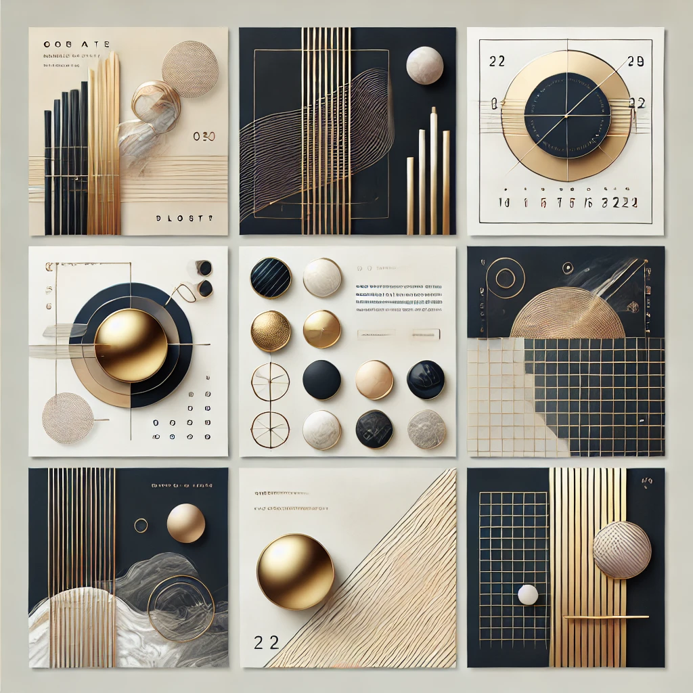

드디어 블로그를 이관해보려고 합니다! 😊

## 블로그 이관 이유?

현재 나는 velog, tistory등 여러 블로그를 왔다 갔다 하면서 운영을 해왔습니다. 떠돌아 다니면서 운영해본 느낌으로 아래와 같습니다.

### 티스토리

* 카카오에서 운영 중인 블로그 플랫폼입니다.

* 티스토리는 블로그 운영에 필요한 기능을 제공하면서도 사용도 간편하며 광고도 붙일 수 있는 최적의 플랫폼입니다.

* 블로그의 디자인 수정도 쉽게 할 수 있지만 스킨이 아주 많지는 않지만 HTML, CSS 지식이 있다면 내 마음대로 커스터마이징을 할 수 있습니다.

### velog

* velog는 개발 블로그 플랫폼입니다.

* 시리즈 기능이 있어서 동일 주제 글들을 정렬해서 볼 수 있으며, 최근에는 팔로우 기능도 생겨서 점점 플랫폼이 커져가는것 같습니다.

* 하지만 최근들어 500에러가 많이 발생해서 개인적으로 포스팅에 불편함이 있었으며, 내 마음대로 플랫폼을 수정하기 힘들었습니다.

### 네이버 블로그

* 커스터마이징이 매우 힘듭니다.

* 네이버 검색 유입에는 강력합니다.

### Github Blog

* GitHub Pages는 GitHub에서 제공하는 정적 웹 호스팅 서비스입니다.

* 무료로 이용이 가능하며, 최근들어 많은 개발자분들이 이용을 합니다.

* 다양한 스킨들을 내 마음대로 커스터마이징을 할 수 있으며 Github가 오류가 나지 않는 이상 내가 잘 운영만 잘하면 됩니다.

처음에는 velog를 사용하게 되었다. 일단 블로그를 만드는게 목적이였기에 사용하게 되었다. 하지만 점점 운영을 해오면서

나만의 블로그를 운영해보고 싶다는 생각이 들었습니다. (또한 에러로 인한 고생이 조금 했다.) 그래서 티스토리로 옮기게 되었습니다. 

하지만 어느순간 티스토리를 운영하면서 느낀 점은 기본 UI들이 내가 보기엔 딱딱해보였다. 또한 최근들어 티스토리 접속 오류들도 간간이 보였습니다.

또한 [티스토리 OPEN API 종료](https://notice.tistory.com/2664)소식으로 다른 티스토리 운영하시는 분들도 이관하게 되는 것을 보게 되었습니다.

물론 나는 이런 API들을 잘 사용하지 않아서 별로 상관은 없었지만 내가 직접 플랫폼에 의존하지 않은 나만의 블로그를 만들어보고 싶다는 생각이 점차 들기 시작했습니다.

그래서 Github Blog를 이용해보기로 하였습니다.

> ⚠️ 설정이 매우 어려웠다는 것은 안 비밀!

## 새로운 블로그 이관

Github Blog로 이관을 하면서 가장 중요한 것은 테마였습니다. 내가 일일이 만들어도 되지만 너무 많은 시간이 소요될것 같다는 생각이 들었고 다른 분들의 테마들을 보기로 하였습니다.

대부분 지킬(Jekyll)을 사용하여 블로그를 만든다고 하였지만 문제는 루비로 만들어진다는 것였습니다. 여기서 고민을 되었습니다.

> "루비는 내가 모르는데 과연 괜찮을까?"

그래서 조금 더 찾아본 결과 Gatsby(가츠비)라는것을 알게 되었습니다. Gatsby는 React와 GraphQL 기반으로 동작하는 정적 사이트 생성기입니다.

그래서 React는 어느정도 조금 손 볼 수 있다는 생각이 들었고 Gatsby를 선택하게 되었습니다. 그리고 Gatsby로 된 github io를 찾아보던 중

아는 분의 블로그 테마가 조금 탐 났습니다. 그래서 그 분의 테마를 사용하려고 한번 보니, 그 분도 다른 분의 테마를 사용하신 것을 알게 되었습니다.

## vallista-land

해당 블로그는 **우아한형제들에 재직중이신 마광휘님**이 만드신 오픈소스 블로그 [Vallista/vallista-land](https://github.com/Vallista/vallista-land)를 활용하여 만들어졌습니다.

먼저 해당 프로젝트를 사용하기 전에 [마광휘님의 블로그 소개 글](https://vallista.kr/%EB%B8%94%EB%A1%9C%EA%B7%B8-v3-%EA%B0%9C%ED%8E%B8/#%EB%B8%94%EB%A1%9C%EA%B7%B8-V3)을 확인하게 되었습니다.

> 한번 블로그 글을 클릭하셔서 보시면, 이 블로그의 기반의 프로젝트의 특징에 대해 잘 알수 있습니다.

그 후에 여러 검색을 해보면서 lerna + yarn workspace 기반으로 모노레포를 구성에 대해 조금은 자세히 알게 되었습니다.

하지만 조금 걸리는 것이 LICENSE 문제였습니다. 아무런 라이센스 고지가 없어서 SNS를 통하여 마광휘님께 여쭤보셨더니, **마구 사용하셔도 된다**는 답변을 얻게 되었습니다.

## 회고

이제까지 블로그를 거의 유령 블로그로 운영하게 되었습니다. 또한 거의 공부한 내용을 정리하는 식으로 운영을 해왔는데 별로 도움이 되지 않은 것 같습니다. 공부한 내용은 내 개인 노션에 정리를 하겠다 다짐하고 나의 일상적인 내용, 회고, 기술적인 지식 공유거리, 트러블슈팅등을 한번 공유해봐야겠습니다.

그럼 앞으로 새로운 블로그 잘 부탁드립니다! 🎉🎉🎉