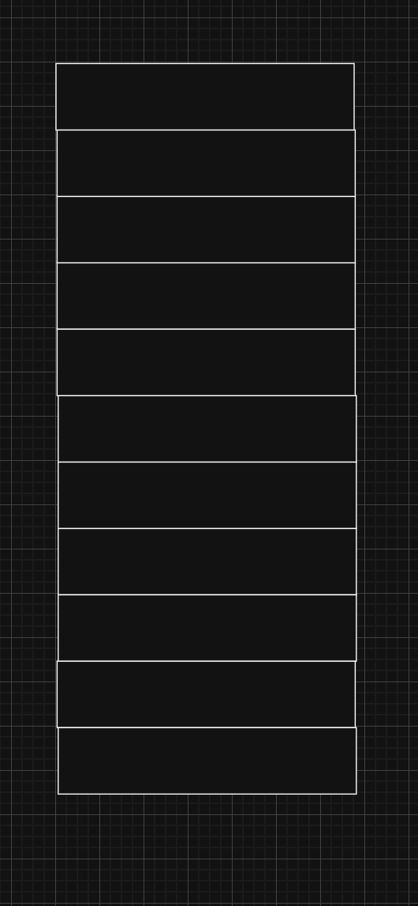
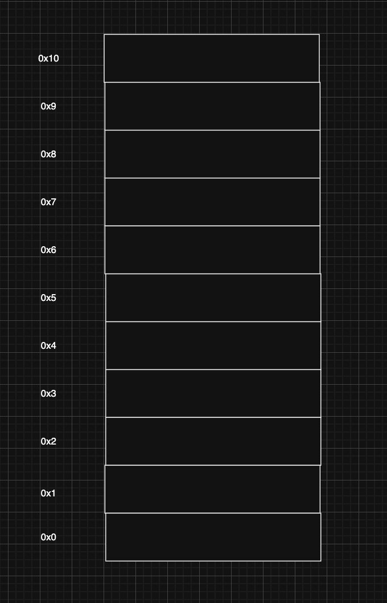
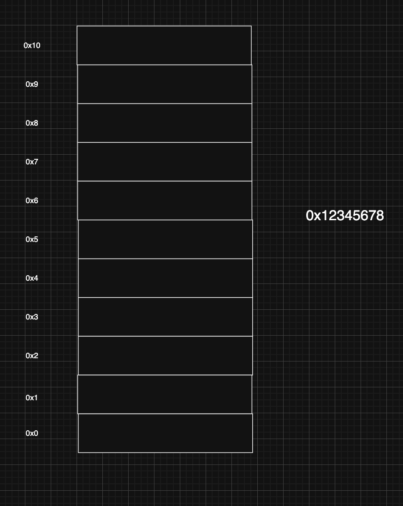

> 해당 블로그 글은 [감자님의 인프런 강의](https://inf.run/dQpKa)를 바탕으로 쓰여진 글입니다.

이번 포스팅에서는 사람이 수를 다루는 방법과 컴퓨터가 수를 처리하는 방식에 대해 살펴보도록 하겠다.

## 10진법과 2진법

사람이 수를 세는 방법은 10진법을 사용한다. 즉, 0~9까지 한 자리의 수로 나타내다가 10이 되는 순간 2자리로 표현하는 수 체계를 의미한다. 10진법에서 각 자리 수의 값은 10^n을 각 자리의 수와 곱해서 계산을 진행한다. 예를 들어서 225라는 숫자는 10^2 * 2 + 10^1 * 2 + 10^0 * 5로 표현할 수 있다.

십진법은 사림이 숫자를 세는데 가장 자연스러운 방법이며 우리는 수를 셀 때 당연히 10진수를 떠올린다. 이는 사람이 손가락이 10개이기 때문에 너무나도 당연한 방법으로 굳혀진 것이다. 하지만 컴퓨터는 이런 10진수 기반으로 연산을 처리하면 매우 비효율적이다.

컴퓨터는 정보를 저장할 때 0과 1만을 사용하는데 이를 **비트**라고 부른다. 컴퓨터는 모든 정보를 비트로 저장하기 때문에 비트를 이용해 수를 표현하는 방법이 필요하다. 한 개의 비트로 표현할 수 있는 수가 2개밖에 되지 않는다. 이러한 이유로 10진수를 사용하는 대신에 이진법을 사용하게 되었다.

그러면 이진법으로 10진수를 어떻게 표현할까? 예를 들어 10진수 5를 이진법으로 어떻게 표현할 수 있을까? 이진법으로 5를 표현하려면 최소 자릿수가 3개가 필요하다. 즉, 3비트가 필요한 셈이다. 그러면 2진수 000(2)부터 하나씩 살펴보도록 하겠다.

000(2)은 10진수로 0이다. 10진수 1은 당연히 001(2)일 것이다. 그러면 10진수 2를 표현할때는 2진수 001(2)에 1을 더하면 된다. 하지만 2진수 체계일때는 숫자 2가 되면 자리올림이 발생한다. 그래서 010(2)이 될 것이다. 여기에 1을 더하면 10진수 3이되고 2진수로 011(2)이 된다. 여기서 다시 1을 더하면 첫번째 자리에서 자리 올림이 발생하고 두번째 자리에서도 자리올림이 발생한다. 즉, 100(2)이 되고 10진수로 4가 되는 것이다. 여기서 다시 1을 더하면 우리가 구하려는 10진수 5가 되고 2진수로 101(2)이 되는 것이다.

하지만 실제 이렇게 0부터 1씩 더해서 계산하는 것은 매우 비효율적이다. 이를 위해 2진수를 10진수로 빠르게 변환하는 방법이 존재한다. 10진수가 10^n으로 자릿수와 곱하는 것처럼 2진수도 2^n으로 자릿수와 곱하면 되는 것이다. 예를 들어 1101(2)이라는 2진수는 2^3 * 1 + 2^2 * 1 + 2^1 * 0 + 2^0 * 1 = 13으로 10진수를 구할 수 있다.

그러면 10진수를 2진수로 변환하는 방법은 무엇일까?

## 10진수를 2진수로 변환하기

지금부터 10진수를 2진수로 변환하는 방법에 대해 살펴보도록 하겠다. 10진수를 2진수로 변환하는 방법은 10진수를 2로 나눌 수 없을때까지 계속 나누고 나머지를 역순으로 읽으면 된다. 한번 예시를 통해 살펴보도록 하겠다.

10진수 9를 2진수로 변환해보도록 하겠다. 먼저 10진수 9를 2로 나눈다. 그러면 몫은 4, 나머지는 1이 나온다. 해당 나머지 1을 2진수 첫번째 자리로 둔다. 그리고 해당 몫 4를 2로 나눈다. 그러면 몫은 2, 나머지는 0이다. 해당 나머지 0을 2진수 두번째 자리로 둔다. 다음으로 몫 2를 2로 나눈다. 그러면 몫은 1, 나머지는 0이다. 해당 나머지를 2진수 세번째 자리로 둔다. 다음으로 몫 1을 2로 나눈다. 그러면 몫은 0 나머지는 1이다. 따라서 해당 나머지를 2진수 네번째 자리로 둔다. 다음으로 0을 2로 나누려고 하지만 나누는 수가 0이므로 여기서 종료한다. 그러면 결과는 1001(2)가 나오게 된다.

2진수에서 가장 왼쪽에 있는 비트를 가장 큰 수를 나타내므로 Most Significant bit라고 부른다. 줄여서 MSB라고 부른다. 반대로 가장 오른쪽에 있는 비트는 가장 작은 수를 나타내므로 Least Significant bit라고 부른다. 줄여서 LSB라고 부른다.

## 16진법

우리는 컴퓨터가 정보를 저장할 때 비트를 사용한다는 사실을 알고 있다. 비트는 0과 1 두가지 상태만 표현 가능하므로 이진법을 사용한다. 한 개의 비트는 0이나 1밖에 표현하지 못하므로 우리가 사용할 수 있는 수를 표현하려면 여러개의 비트가 필요하다. 예를들어, 245라는 수를 표현하려면 8개의 비트가 필요한 것처럼 말이다. 245를 2진수로 표현하면 11110101(2)로 표현한다. 2진수는 이렇게 한 자리에 0과 1밖에 오지 못해서 10진수에 비해 지릿수가 길어지는 단점이 존재한다. 그래서 이러한 단점때문에 가독성이 매우 떨어진다.

이러한 단점을 해결하고자 16진법이 등장하게 되었다. 16진법은 한 자리에 16가지의 수를 표현할 수 있다. 0~9까지는 일반 숫자를 사용하고 10~15까지는 알파벳 A~F를 사용한다. 16진수 F(16)가 있을 때 여기에 1을 더하면 자릿수가 바껴서 10(16)으로 변경된다는 사실은 이제 유추해볼 수 있을 것이다.

그런데 이런 의문이 있을 것이다. 이럴꺼면 차라리 10진법으로 사용하면 되는데 왜 16진법을 사용할까? 왜냐하면 2진수를 10진수로 표현하는 것보다 16진수로 표현하면 자릿수도 줄고 조금 더 단순해지기 때문이라고 생각한다. 16진수 1자리는 2진수 4자리와 정확히 대응한다.

예를 들어보자. 10진수 14를 2진수로 표현한다면 1110(2)이 된다. 이것을 16진수로 표현한다면 E(16)로 표현할 수 있다. 이렇게만 봐도 매우 단순해지는 것을 볼 수 있을 것이다. 하나만 더 예를 들어보자. 10진수 245를 2진수로 표현한다면 11110101(2)로 표현이 가능하다. 만약 이것을 16진수로 표현한ㄷ면 F5(16)로 표현이 가능하다.

> 2진수를 16진수로 표현할때는 단순하게 자릿수 4자리씩 끊어서 계산하면 된다.

이전에 10진수를 2진수로 2진수를 10진수로 표현했던 것처럼 16진수를 10진수, 10진수를 16진수로도 표현이 가능하다. 하지만 우리는 대부분의 상황에서 2진수를 간결하게 표현하기 위해 16진수를 사용하기 때문에 16진수를 2진수로 2진수를 16진수로 표현하는 방법에 대해 살펴보도록 하겠다. 해당 방법은 추후에 알아보자. 일단은 지금은 2진수에서 16진수로 표기할때는 자릿수 4개를 끊어서 계산하고 16진에서 2진수로 표현할때는 각 자리를 4자리 2진수로 변경하면 되겠구나라고 알아가고 넘어가자.

다음으로 진법을 표현하는 2가지 방법에 대해 알아보자. 숫자 1001이 있을 때 어떤 진법으로 해석하냐에 따라 그 값이 달라진다. 10진법으로 해석하면 1001이 되고 2진법으로 해석하면 9가 되며, 16진수로 해석하면 4097이 된다. 이처럼 진법 표기가 없으면 혼란이 생길 수 있어서 어떤 진법인지 명확하게 표기해야 한다. 일반적으로 10진수는 별도의 표기 없이 그대로 사용한다. 2진법은 2가지 방법으로 표기가 가능하다. 1001과 같은 수에 아래첨자 (2)를 붙여서 1001(2)로 표현하거나 LSB 왼쪽에 0b를 붙여서 0b1001이라고 표현하는 방법이 있다. 16진수 역시 2가지 방법이 존재한다. 1001과 같은 수에 아래첨자 (16)을 붙여서 1001(16)으로 사용하거나 LSB 왼쪽에 0x를 붙여서 0x1001로 표기한다.

## 빅 엔디안과 리틀 엔디안

비트를 다룰 때 반드시 알아야 하는 개념이 존재한다. 바로 빅 엔디안과 리틀 엔디안이다. 예시를 한번 들어보자.

한 공간의 크기가 8bit, 즉 1byte 단위로 나눠진 메모리가 있다고 해보자. 첫번째 메모리 공간은 1 바이트를 저장할 수 있으며 주소는 0이다. 두번째 메모리 공간도 1 바이트를 저장할 수 있고 주소는 1이다. 이런식으로 각각의 1 바이트 공간에 순차적으로 주소가 할당된다.

여기서 32bit 즉, 4byte로 이루어진 데이터가 있다고 해보자.

여기서 prefix로 0x가 붙어있으므로 16진수로 해석해야 한다. 16진수는 한 자릿수가 4비트이므로 두자리가 1바이트가 되고 총 8자리이므로 4바이트가 된다. 1바이트 저장공간에는 4바이트 데이터를 한 번에 저장할 수 없으므로 1바이트 메모리 4개를 이용해 저장해야 한다. 4바이트 데이터를 1바이트로 쪼개서 0번지부터 채우는 방법에는 2가지가 존재한다.

첫번째 방법은 가장 왼쪽, 즉 MSB를 먼저 채우는 방법이다. 가장 큰 자릿수를 가장 낮은 번지에 먼저 채우기 때문에 **빅 엔디안**이라고 부른다. 두번째 방법은 가장 오른쪽, 즉 LSB를 먼저 채우는 방법이다. 가장 낮은 자릿수를 가장 낮은 번지에 먼저 채우기 때문에 **리틀 엔디안**이라고 부른다.

그럼 이 2가지 방법 중 어느 방법이 더 좋을까? 두 방법 중 어느 것이 더 좋거나 나쁘거나 할 것이 없다. 다만, 주의해야할 점은 어느 방법으로 하던지 선택을 했으면 그 방법으로 통일을 해야한다. 그렇지 않으면 원래 데이터와 달라지기 때문이다.

빅 엔디안과 리틀 엔디안은 컴퓨터 구조뿐만 아니라 네트워크에서도 사용하기 때문에 해당 용어들은 반드시 숙지해야 한다.

## 오버플로우와 인터럽트

이번에는 비트 연산 중 발생하는 오버플로우에 대해 살펴보도록 하자. 오버플로우는 컴퓨터에서 치명적인 오류를 일으키는 가장 중요한 문제이다. 이는 데이터를 표현할 수 있는 비트 수가 제한되어 있어서 발생하는 문제이다.

8비트로 구성된 두 수를 아래와 같이 더한다고 해보자.

> 11110001(2) + 00001011(2)

이를 더할 때는 LSB부터 순차적으로 더한다. 먼저 가장 오른쪽 비트인 1과 1을 더하면 자리올림이 발생하고 해당 자리는 0이 된다. 그 다음 비트를 연산할 때는 자리올림이 발생한 수와 비트들을 더한다. 여기서도 마찬가지로 자리올림이 발생하고 해당 자리도 0이 된다. 그 다음 비트부터는 자리 올림이 발생하지 않아 각 비트들을 더하면 11111100(2)라는 결과가 나온다. 이것이 오버플로우가 발생하지 않는 이상적인 경우이다.

이제 다른 경우를 살펴보자.

> 11111111(2) + 00000001(2)

위의 두 수를 더하면 LSB부터 자리올림이 연쇄적으로 발생해 결과는 100000000(2)가 된다. 하지만 이것이 문제가 된다. 우리는 데이터를 8비트에 저장하는데 해당 결과는 9비트이므로 표현이 불가능하다. 정확히는 표현은 하는데 8비트만 표현이 가능하다. 따라서 MSB를 자르고 8비트로만 표현이 가능한셈이다. 그러면 계산의 결과는 00000000(2)로 10진수로 0이되는 셈이다.

이렇게 어떤 계산 결과로 유효한 비트 범위를 넘는 현상을 오버플로우라고 말한다. 그럼 오버플로우는 덧셈에서만 발생할까? 아니다. 뺄셈, 곱셈, 나눗셈에서도 발생이 가능하다. 연산결과가 현재 비트로 표현할 수 있는 범위를 벗어난다면 이를 모두 오버플로우라고 한다. 위의처럼 MSB를 벗어난 경우도 오버플로우이지만 LSB를 벗어나는 경우도 오버플로우라고 뜻한다.

오버플로우가 발생하면 사용자의 데이터가 완전히 달라지므로 의도하지 않는 결과가 발생하거나 이를 악용한 해킹까지 가능한 심각한 문제이다. 따라서 컴퓨터 과학자들은 오버플로우가 발생하면 진행 중인 동작을 멈추고 이를 처리할 수 있도록 시스템을 구상했는데 이를 **인터럽트**라고 부른다.

인터럽트는 CPU가 현재 어떤 동작을 수행 중이더라도 즉시 중단하고 인터럽트 처리 동작을 수행한다. 특정 인터럽트가 발생하면 이미 등록된 인터럽트 서비스 루틴(ISR)을 통해 처리한다. 인터럽트로 인해 기존 동작이 중단되고 인터럽트 서비스 루틴이 실행 된 후에는 원래 수행하던 동작을 수행한다. 인터럽트는 오버플로우 외에도 다양한 상황에서 발생할 수 있으며 필요에 따라 비활성화 할 수 있다.

인터럽트는 크기 외부 인터럽트와 내부 인터럽트로 구분된다. 외부 인터럽트는 입출력 장치나 전원과 같은 외부 요소에서 발생한다. 내부 인터럽트는 명령어나 데이터 처리 과정 중 오류가 발생했을 때 일어난다. 오버플로우, 0으로 나누기등이 대표적인 내부 인터럽트 예시이다.

## 음수

이번에는 컴퓨터가 음수를 표현하는 방법에 대해 알아보자. 컴퓨터는 2의 보수법을 사용해 음수를 표현하는데 이를 이용하면 뺄셈도 쉽게 할 수 있다.

7을 2진수 4비트로 표현하면 0b0111이 된다. 4비트는 0부터 15까지 총 16가지로 표현이 가능하다. 이때 0~15까지는 모두 양수이며 이를 부호 없는 정수라고 일컫는다. 반면 음수를 표현하려면 부호 있는 정수로 해석해야 하며 부호 있는 정수는 MSB를 부호표현에 사용한다. 표현할 수 있는 범위는 4비트 기준 -8~7까지 표현이 가능하다. MSB가 0이면 양수를 1이면 음수를 표현한다. 그래서 실제 표현할 수 있는 비트는 3비트이고 따라서 표현할 수 있는 범위가 -8~7인 것이다.

그러면 양수 7을 음수로 바꾸려면 어떻게 할까? 먼저 7을 이진수로 표현한다. 0b0111이 된다. 그 다음 1의 보수법을 사용한다. 1의 보수법은 모든 비트를 `NOT` 연산을 하는 것이다. 1의 보수법을 이용하여 비트를 반전 시키면 0b1000이 된다. 여기서 LSB에 1을 더하면 2의 보수법이 된다. 그 결과는 0b1001이 된다. 따라서 부호 있는 정수 -7을 이진수로 표현하면 0b1001이 되는 것이다.

2의 보수법에 가장 큰 장점은 덧셈 연산에서 두드러진다. 예를 들어 7-7을 연산하면 0이 된다. 이를 부호 있는 정수로 표현해보자. 부호 있는 정수 7을 4비트로 표현하면 0b0111이 된다. -7은 0b1001이 된다. 이제 이 둘을 더해보면 LSB에서 자리 올림이 발생해 오버플로우가 일어나면서 4비트는 0000이 된다. 이처럼 7과 -7을 더할때 0이 되므로 2의 보수법으로 뺄셈도 자연스럽게 처리 할 수 있다.

> 잘못된 지식이 있을 경우 댓글로 남겨주시면 빠르게 반영하겠습니다!