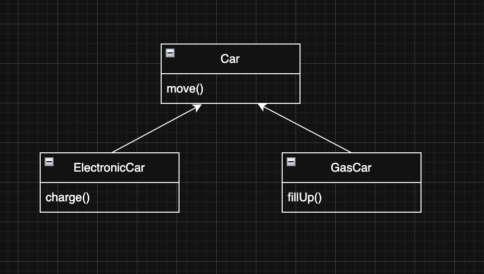
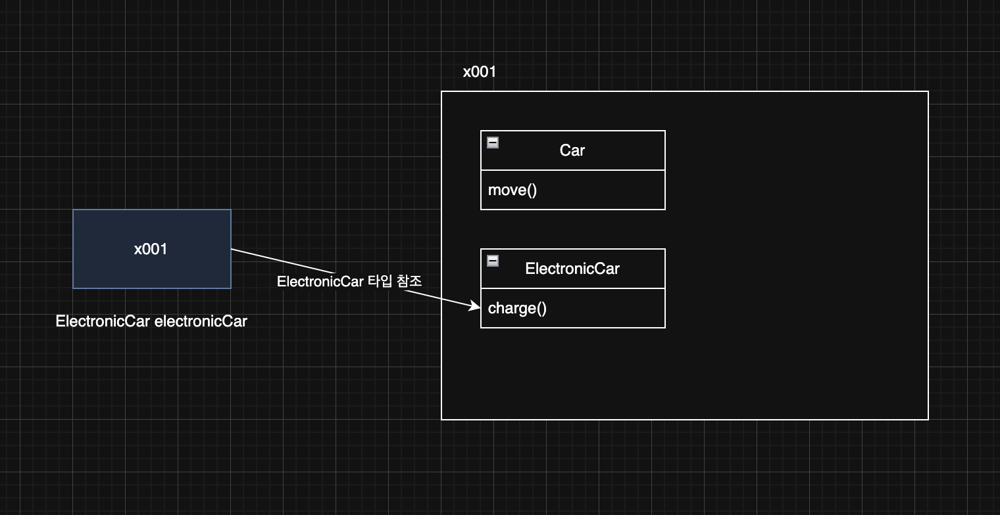
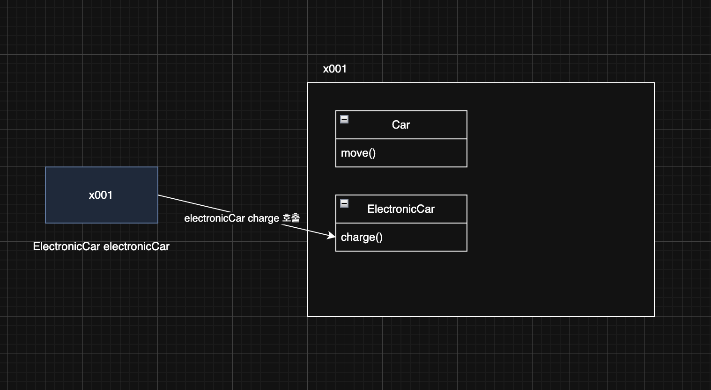
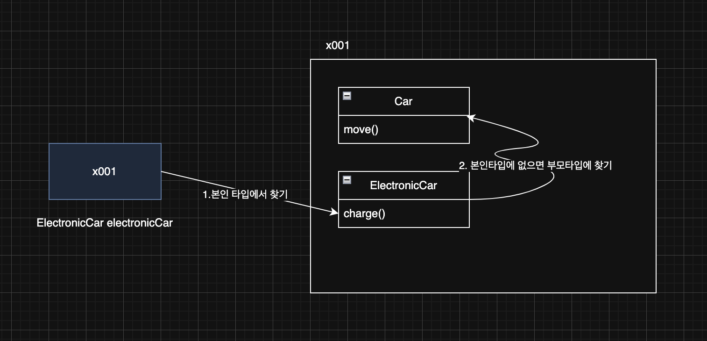
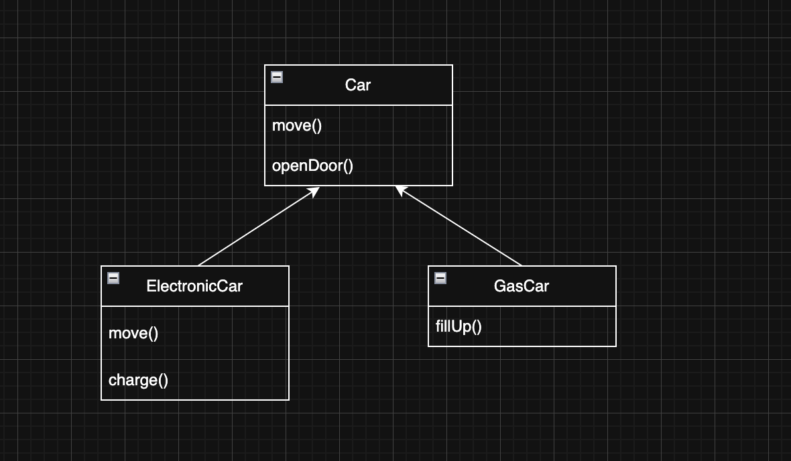
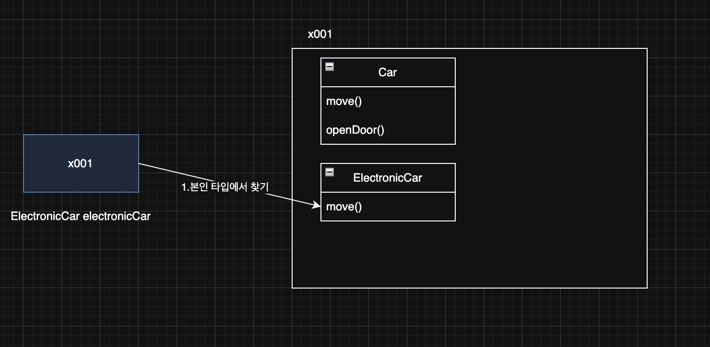
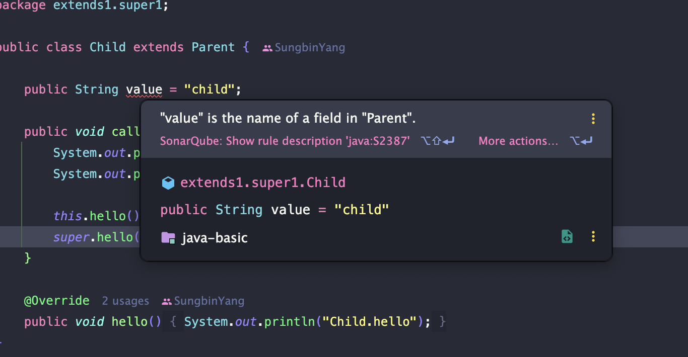

> 해당 블로그 글은 [영한님의 인프런 강의](https://inf.run/PuC6W)를 바탕으로 쓰여진 글입니다.

## 상속 - 시작

상속 관계가 왜 필요한지 한번 예제코드를 발전시키면서 살펴보자.

``` java
package extends1.ex1;

public class ElectricCar {

    public void move() {
        System.out.println("차를 이동합니다.");
    }

    public void charge() {
        System.out.println("충전합니다.");
    }
}
```

``` java
package extends1.ex1;

public class GasCar {

    public void move() {
        System.out.println("차를 이동합니다.");
    }

    public void fillUp() {
        System.out.println("기름을 주유합니다.");
    }
}
```

``` java
package extends1.ex1;

public class CarMain {
    public static void main(String[] args) {
        ElectricCar electricCar = new ElectricCar();
        electricCar.move();
        electricCar.charge();

        GasCar gasCar = new GasCar();
        gasCar.move();
        gasCar.fillUp();
    }
}
```

전기 자동차와 가스 자동차를 생성하고 이동과 충전의 행위를 하였다. 하지만 뭔가 전기 자동차, 가스 자동차 전부 이동한다는 행위자체는 비슷해보인다. 또한 전기 자동차, 가스 자동차 전부 자동차의 구체화된 개념이라는 것을 알 수 있다. 이런 경우 우리는 상속관계를 통해 자동차로 추상화 시키고 각각의 자동차를 구체화 시킬 수 있다.

## 상속 관계

상속은 객체 지향 프로그래밍의 핵심 요소 중 하나로, 기존 클래스의 필드와 메서드를 새로운 클래스에서 재사용하게 해준다. 이름 그대로 기존 클래스의 속성과 기능을 그대로 물려받는 것이다. 상속을 사용하려면 `extends` 키워드를 사용하면 된다. 그리고 `extends` **대상은 하나만 선택**할 수 있다.

> 📚 용어 정리
>
> - 부모클래스/슈퍼클래스/상위클래스: 상속을 통해 자신의 필드와 메서드를 다른 클래스에 제공하는 클래스
> - 자식클래스/서브클래스/하위클래스: 부모 클래스로부터 필드와 메서드를 상속받는 클래스

그러면 위의 코드를 상속관계로 변경해보자.

``` java
package extends1.ex2;

public class Car {

    public void move() {
        System.out.println("차를 이동합니다.");
    }
}
```

``` java
package extends1.ex2;

public class ElectricCar extends Car {

    public void charge() {
        System.out.println("충전합니다.");
    }
}
```

``` java
package extends1.ex2;

public class GasCar extends Car {

    public void fillUp() {
        System.out.println("기름을 주유합니다.");
    }
}
```

이렇게 상속구조로 변경하여 공통 기능인 `move()`를 부모 클래스에 두고 다른 부분만 자식 클래스에 정의하였다. 이제 다른 자동차를 만들때마다 `Car`를 상속받으면 된다.



상속은 부모의 기능을 자식이 물려 받는 것이다. 따라서 자식이 부모의 기능을 물려 받아서 사용할 수 있다. 반대로 부모 클래스는 자식 클래스에 접근할 수 없다. 자식 클래스는 부모 클래스의 기능을 물려 받기 때문에 접근할 수 있지만, 그 반대는 아니다. 부모 코드를 보자! 자식에 대한 정보가 하나도 없다. 반면에 자식 코드는 `extends Car` 를 통해서 부모를 알고 있다.

### 단일 상속

자바에서는 참고로 상속을 하나만 받을 수 있다. 상식적으로 생각해보자. 내가 자식인데 어머니가 2명인 사람은 흔치 않을 것이다. C++같은 곳에서는 다중 상속을 제공한다. 하지만 이런 다중상속을 이용하면 다양한 문제가 발생하고 클래스 구조도가 매우 복잡해진다. 그래서 자바같은 경우에는 다중 상속을 허용하지 않는 것이다. 하지만 추후에 배우겠지만 인터페이스같은 것으로 다중구현은 가능하다.

## 상속과 메모리 구조

그럼 이제 메모리 구조에 대해 파악해보자! 해당 부분은 정말 중요하니 잘 기억해두자!

### `ElectronicCar electronicCar = new ElectronicCar();`



`new ElectronicCar()`를 호출하면 `ElectricCar` 뿐만 아니라 상속 관계에 있는 `Car` 까지 함께 포함해서 인스턴스를 생성한다. 참조값은 `x001`로 하나이지만 실제로 그 안에서는 `Car` , `ElectricCar` 라는 두가지 클래스 정보가 공존하는 것이다. 즉, 상속을 하면 단순히 필드와 메서드만 물려받는 것이 아니라 부모와 함께 포함해서 위의 그림처럼 생성이 된다.

### `electronicCar.charge();`



`electronicCar.charge();`를 호출하면 해당 인스턴스에 먼저 참조값을 찾는다. 참조값이 x001이니 x001.charge()가 호출이 된다. 그러면 x001에 인스턴스 내부엥 들어간다. 다음으로 **호출하는 변수의 타입(클래스)을 기준으로 선택**하여 charge()를 호출한다. 호출하는 타입의 charge() 메서드가 존재하니 실행을 시킨다.

### `electronicCar.move();`



`electronicCar.move();`를 호출하면 먼저 호출하는 변수 타입에서 먼저 찾는다. 그런데 move() 메서드는 존재하지 않는다. 그러면 상위 타입으로 올라가서 찾는다. 상위타입에는 move() 메서드가 존재하므로 해당 메서드를 실행한다.

만약 부모에서도 해당 기능을 찾지 못하면 더 상위 부모에서 필요한 기능을 찾아본다. 부모에 부모로 계속 올라가면서 필드나 메서드를 찾는 것이다. 물론 계속 찾아도 없으면 컴파일 오류가 발생한다.

## 상속과 기능 추가

상속을 하면 공통 기능을 추가를 쉽게 할 수 있다. 예를 들어 자동차에 문열기 기능을 추가해야 한다고 하자. 만약 상속관계가 없다면 일일이 추가를 해야하지만 상속관계가 있다면 부모 클래스에 하나만 추가하면 자식들이 전부 그 기능을 쓸 수 있다.

## 상속과 메서드 오버라이딩

만약 부모의 공통 기능 중에 자식에서 다르게 구현하고 싶은 경우는 어떻게 해야할까? 이름을 일일이 다르게 하면 굳이 상속을 할 필요가 없을지도 모른다. 그래서 자바에서는 **오버라이딩** 개념을 지원한다. 아래의 예제 코드를 통해 확인해보자.

``` java
package extends1.overriding;

public class Car {

    public void move() {
        System.out.println("차를 이동합니다.");
    }

    public void openDoor() {
        System.out.println("문을 엽니다.");
    }
}
```

위와 같이 부모 클래스에 move메서드와 openDoor라는 메서드를 정의해두었다. 그런데 전기차에서 move메서드를 다르게 구현하고 싶다. 메서드 오버라이딩을 통하여 아래와 같이 구현할 수 있다.

``` java
package extends1.overriding;

public class ElectricCar extends Car {

    public void charge() {
        System.out.println("충전합니다.");
    }

    @Override
    public void move() {
        System.out.println("전기차를 빠르게 이동합니다.");
    }
}
```

이렇게 부모의 메서드 명과 동일하게 해주고 메서드 본문만 다르게 작성하면 오버라이딩이 구현된 것이다.

### @Override

`@` 이 붙은 부분을 애노테이션이라 한다. 애노테이션은 주석과 비슷한데, 프로그램이 읽을 수 있는 특별한 주석이라 생각하면 된다.

해당 어노테이션은 부모 클래스의 메서드를 오버라이딩했다고 표기를 하는 것이다. 그러면 자바 컴파일러는 이것을 보고 메서드가 정확히 오버라이딩이 되었는지 확인한다. 그렇지 못할 경우 컴파일 에러를 발생시킨다. 해당 어노테이션은 필수는 아니고 옵션이다. 하지만 실무에서는 대부분 붙인다. 바로 위와 같은 이유때문일 것 같다.



이제 메모리 구조를 통해 오버라이딩을 확인해보자.



먼저 `electronicCar.move()`를 호출한다. 참조값을 통해 해당 인스턴스로 간 뒤에 호출한 타입의 메서드가 있는지 확인한다. 찾아보니 존재하므로 해당 메서드를 호출하는 것이다.

### 오버로딩과 오버라이딩

오버로딩과 오버라이딩 뭔가 말이 비슷하면서 헷갈린다. 그래서 두가지 개념을 정확히 구분해야 한다.

- 메서드 오버로딩: 메서드 시그니쳐가 다른 메서드 여러개를 정의하는 것을 메서드 오버로딩이라고 한다.
- 메서드 오버라이딩: 메서드 오버라이딩은 하위 클래스에서 상위 클래스의 메서드를 재정의하는 과정을 의미한다. 따라서 상속 관계에서 사용한다. 부모의 기능을 자식이 다시 정의하는 것이다. 오버라이딩을 단순히 해석하면 무언가를 넘어서 타는 것을 말한다. 자식의 새로운 기능이 부모의 기존 기능을 넘어 타서 기존 기능을 새로운 기능으로 덮어버린다고 이해하면 된다.

### 메서드 오버라이딩 조건

- 메서드 이름: 부모 클래스와 동일해야 한다.
- 메서드 매개변수(파라미터): 매개변수(파라미터) 타입, 순서,개수가 같아야 한다.
- 반환타입: 반환 타입이 같아야 한다. 단 반환 타입이 하위 클래스 타입일 수 있다.
- 접근 제어자: 버라이딩 메서드의 접근 제어자는 상위 클래스의 메서드보다 더 제한적이어서는 안된다. 예를 들어, 상위 클래스의 메서드가 `protected`로 선언되어 있으면 하위 클래스에서 이를 `public` 또는 `protected`로 오버라이드할 수 있지만, `private` 또는 `default`로 오버라이드 할 수 없다.
- 예외: 오버라이딩 메서드는 상위 클래스의 메서드보다 더 많은 체크 예외를 `throws`로 선언할 수 없다. 하지만 더 적거나 같은 수의 예외, 또는 하위 타입의 예외는 선언할 수 있다.
- `static`,`final`,`private` : 키워드가 붙은 메서드는 오버라이딩 될 수 없다.
    - `static`은 클래스 레벨에서 작동하므로 인스턴스 레벨에서 사용하는 오버라이딩이 의미가 없다. 쉽게 이야기해서 그냥 클래스 이름을 통해 필요한 곳에 직접 접근하면 된다.
    - `final`은 오버라이딩을 금한다. 왜냐하면 `final` 메서드는 새롭게 정의를 금하기 때문이다.
    - `private` 메서드는 해당 클래스에서만 접근 가능하기 때문에 하위 클래스에서 보이지 않는다. 따라서 오버라이딩 할 수 없다.
- 생성자 오버라이딩: 생성자는 오버라이딩 할 수 없다.

## 상속과 접근 제어

상속과 관련 있는 접근 제어자는 바로 `protected`이다. `protected`는 같은 패키지에서 접근이 가능하며 추가적으로 상속관계에서도 접근이 가능하다.

> 혹시 접근제어자가 기억이 안 나면 [해당 포스팅](https://sungbin.kr/접근-제어자/)을 참고해보자.

상속관계에서 메서드를 호출하면 먼저 `new`연산자를 통해 인스턴스를 생성한다. 해당 인스턴스를 생성할때 상속관계면 인스턴스 안에 본인 타입뿐만 아니라 상위타입까지 같이 생성한다. 그리고 호출한 매개변수 타입으로 메서드를 찾는다. 만약 메서드를 찾는데 없다면 상위타입으로 올라간다. 이때 접근제어자를 보고 해당 메서드가 있는지 유무를 판단한다.

## super - 부모 참조

부모와 자식의 필드명이 같거나 메서드가 오버라이딩 되어 있으면, 자식에서 부모의 필드나 메서드를 호출할 수 없다. 이때 `super` 키워드를 사용하면 부모를 참조할 수 있다. `super`는 이름 그대로 부모 클래스에 대한 참조를 나타낸다. 예제를 살펴보자.

``` java
package extends1.super1;

public class Parent {

    public String value = "parent";

    public void hello() {
        System.out.println("Parent.hello");
    }
}
```

위와 같이 부모 클래스를 정의하였다. 이제 해당 부모 클래스를 상속받는 자식 클래스를 정의해보자.

``` java
package extends1.super1;

public class Child extends Parent {

    public String value = "child";

    public void call() {
        System.out.println("this.value = " + this.value);
        System.out.println("super.value = " + super.value);

        this.hello();
        super.hello();
    }

    @Override
    public void hello() {
        System.out.println("Child.hello");
    }
}
```

기본적으로 변수든, 메서드든 호출한 매개변수 타입으로 먼저 찾아간다. 그런데 `super`라는 키워드를 만나면 바로 상위 타입으로 올라가서 찾는다.

참고로, 변수를 오버라이딩처럼 위와 같이 할 수는 있다. 다만, 에러는 안 나지만 아래와 같이 IDE에서 경고창을 띄워준다. 되도록 상위 타입과 변수명은 다르게 작성해보는 것도 방법일 수 있겠다.



## super - 생성자

상속 관계의 인스턴스를 생성하면 결국 메모리 내부에는 자식과 부모 클래스가 각각 다 만들어진다. 따라서 각각의 생성자도 모두 호출되어야 한다. **상속 관계를 사용하면 자식 클래스의 생성자에서 부모 클래스의 생성자를 반드시 호출해야 한다.(규칙)** 상속관계에서 부모 생성자를 호출 할 때는 `super()`를 사용하면 된다.

상속을 받으면 무조건 생성자 첫 줄에 `super()`를 호출해야 한다. 하지만 우리가 지금까지 코딩을 해오면서 그런 일이 없었다. 그 이유는 부모 클래스가 기본 생성자밖에 없을 경우 자식 클래스 생성자 첫 줄에 자바 컴파일러가 자동으로 생성해주기 때문이다. 즉, 부모 클래스의 생성자가 기본 생성자(파라미터가 없는 생성자)인 경우에는 `super()` 를 생략할 수 있다. 코드를 살펴보자.

``` java
package extends1.super2;

public class ClassA {

    public ClassA() {
        System.out.println("ClassA 생성자");
    }
}
```

위와 같이 부모 클래스의 생성자를 정의하였다.

``` java
package extends1.super2;

public class ClassB extends ClassA {

    public ClassB(int a, int b) {
        super(); // 생략 가능
        System.out.println("ClassB 생성자 a = " + a + " b = " + b);
    }
}
```

그리고 이렇게 명시적으로 `super()`를 넣어서 부모 생성자를 호출하는 결과를 볼 수 있다. 하지만 이 부분은 생략이 가능하다. 다음으로 해당 클래스를 상속받는 자식 클래스를 만들어보자.

``` java
package extends1.super2;

public class ClassC extends ClassB {

    public ClassC() {
        super(10, 20);
        System.out.println("ClassC 생성자");
    }
}
```

`ClassB`클래스는 기본 생성자가 없기 때문에 위와 같이 `super()`를 명시해줬다. 또한 코드의 첫줄에 `this(...)` 를 사용하더라도 반드시 한번은 `super(...)` 를 호출해야 한다. 아래의 코드를 보면 이게 무슨 말인지 이해가 될 것이다.

``` java
package extends1.super2;

public class ClassB extends ClassA {

    public ClassB(int a) {
        this(a, 0);
        System.out.println("ClassB 생성자 a = " + a);
    }

    public ClassB(int a, int b) {
        super();
        System.out.println("ClassB 생성자 a = " + a + " b = " + b);
    }
}
```

> 잘못된 지식이 있을 경우 댓글로 남겨주시면 빠르게 반영하겠습니다!