> 해당 블로그 글은 [영한님의 인프런 강의](https://inf.run/6oSgn)를 바탕으로 쓰여진 글입니다.

## 생산자 소비자 문제 - 소개

멀티스레드의 핵심을 제대로 이해하려면 반드시 생산자 소비자 문제를 이해하고, 올바른 해결 방안도 함께 알아두어야 한다. 생산자 소비자 문제를 제대로 이해하면 멀티스레드를 제대로 이해했다고 볼 수 있다. 그 만큼 중요한 내용이니 자세히 학습해보자.

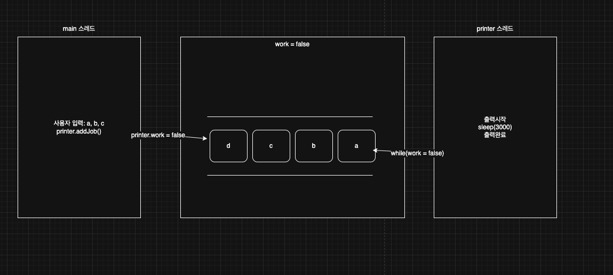

위의 그림은 이전에 프린터 예제 그림이다. 위의 프린터 예제가 바로 생산자 소비자 문제가 발생할 수 있는 경우이다. 그럼 용어부터 살펴보자.

### 기본 개념

- 생산자(Producer): 데이터를 생성하는 역할을 한다. 예를 들어, 파일에서 데이터를 읽어오거나 네트워크에서 데이터를 받아오는 스레드가 생산자 역할을 할 수 있다.
    - 앞서 프린터 예제에서 사용자의 입력을 프린터 큐에 전달하는 스레드가 생산자의 역할이다.
- 소비자(Consumer): 생성된 데이터를 사용하는 역할을 한다. 예를 들어, 데이터를 처리하거나 저장하는 스레드가 소비자 역할을 할 수 있다.
    - 앞서 프린터 예제에서 프린터 큐에 전달된 데이터를 받아서 출력하는 스레드가 소비자 역할이다.
- 버퍼(Buffer): 생산자가 생성한 데이터를 일시적으로 저장하는 공간이다. 이 버퍼는 한정된 크기를 가지며, 생산자와 소비자가 이 버퍼를 통해 데이터를 주고받는다.
    - 앞서 프린터 예제에서 프린터 큐가 버퍼 역할이다.

### 문제 상황

- 생산자가 너무 빠를 때: 버퍼가 가득 차서 더 이상 데이터를 넣을 수 없을 때까지 생산자가 데이터를 생성한다. 버퍼가 가득 찬 경우 생산자는 버퍼에 빈 공간이 생길 때까지 기다려야 한다.
- 소비자가 너무 빠를 때: 버퍼가 비어서 더 이상 소비할 데이터가 없을 때까지 소비자가 데이터를 처리한다. 버퍼가 비어있을 때 소비자는 버퍼에 새로운 데이터가 들어올 때까지 기다려야 한다.

생산자 소비자 문제는 생산자 스레드와 소비자 스레드가 특정 자원을 함께 생산하고, 소비하면서 발생하는 문제이다. 이것은 중간에 있는 버퍼의 크기가 한정되어 있기 때문에 발생한다. 따라서 한정된 버퍼 문제라고도 한다.

## 생산자 소비자 문제 - 예제1 코드

그러면 한번 예제코드를 살펴보자.

``` java
package thread.bounded;

public interface BoundedQueue {

    void put(String data);

    String take();
}
```

위의 코드는 버퍼의 역할을 하는 큐의 인터페이스이다. `put`은 큐에 데이터를 넣고 `take`는 큐에 데이터를 빼는 역할을 맡는다. `put`은 주로 생산자 스레드에서 `take`는 소비자 스레드에서 사용한다.

``` java
package thread.bounded;

import java.util.ArrayDeque;
import java.util.Queue;

import static util.MyLogger.log;

public class BoundedQueueV1 implements BoundedQueue {

    private final Queue<String> queue = new ArrayDeque<>();

    private final int max;

    public BoundedQueueV1(int max) {
        this.max = max;
    }

    @Override
    public synchronized void put(String data) {
        if (queue.size() == max) {
            log("[put] 큐가 가득 참, 버림: " + data);
            return;
        }

        queue.offer(data);
    }

    @Override
    public synchronized String take() {
        if (queue.isEmpty()) {
            return null;
        }

        return queue.poll();
    }

    @Override
    public String toString() {
        return queue.toString();
    }
}
```

여기서 핵심 공유 자원은 바로 `queue(ArrayDeque)`이다. 여러 스레드가 접근할 예정이므로 `synchronized`를 사용해서 한 번에 하나의 스레드만 `put()` 또는 `take()`를 실행할 수 있도록 안전한 임계 영역을 만든다.

> ⚠️ 주의
>
> 원칙적으로 `toString()` 에도 `synchronized` 를 적용해야 한다. 그래야 `toString()` 을 통한 조회 시점에도 정확한 데이터를 조회할 수 있다. 하지만 이번 예제에는 데이터 확인이 중요한 것은 아니고 나중에 조금 꼬이는 상황이 발생하기에 제외시켰다.

``` java
package thread.bounded;

import static util.MyLogger.log;

public class ProducerTask implements Runnable {

    private BoundedQueue queue;

    private String request;

    public ProducerTask(BoundedQueue queue, String request) {
        this.queue = queue;
        this.request = request;
    }

    @Override
    public void run() {
        log("[생산 시도] " + request + " -> " + queue);

        queue.put(request);

        log("[생산 완료] " + request + " -> " + queue);
    }
}
```

데이터를 생성하는 생성자 스레드가 실행하는 클래스이며, `Runnable`을 구현한다. 스레드를 실행하면, `queue.put(request)`을 호출해서 전달된 데이터를 큐에 보관한다.

``` java
package thread.bounded;

import static util.MyLogger.log;

public class ConsumerTask implements Runnable {

    private BoundedQueue queue;

    public ConsumerTask(BoundedQueue queue) {
        this.queue = queue;
    }

    @Override
    public void run() {
        log("[소비 시도]     ? <- " + queue);

        String data = queue.take();

        log("[소비 완료] " + data + " <- " + queue);
    }
}
```

데이터를 소비하는 소비자 스레드가 실행하는 클래스이며 `Runnable`을 구현한다. 큐에 있는 데이터를 꺼내는 로직을 담고 있다.

이제 `main`을 작성해보자.

``` java
package thread.bounded;

import java.util.ArrayList;
import java.util.List;

import static util.MyLogger.log;
import static util.ThreadUtils.sleep;

public class BoundedMain {
    public static void main(String[] args) {
        BoundedQueue queue = new BoundedQueueV1(2);

        producerFirst(queue);
//        consumerFirst(queue);
    }

    private static void producerFirst(BoundedQueue queue) {
        log("== [생산자 먼저 실행] 시작, " + queue.getClass().getSimpleName() + " ==");

        List<Thread> threads = new ArrayList<>();

        startProducer(queue, threads);
        printAllState(queue, threads);
        startConsumer(queue, threads);
        printAllState(queue, threads);

        log("== [생산자 먼저 실행] 종료, " + queue.getClass().getSimpleName() + " ==");
    }

    private static void consumerFirst(BoundedQueue queue) {
        log("== [소비자 먼저 실행] 시작, " + queue.getClass().getSimpleName() + " ==");

        List<Thread> threads = new ArrayList<>();

        startConsumer(queue, threads);
        printAllState(queue, threads);
        startProducer(queue, threads);
        printAllState(queue, threads);

        log("== [소비자 먼저 실행] 종료, " + queue.getClass().getSimpleName() + " ==");
    }

    private static void startProducer(BoundedQueue queue, List<Thread> threads) {
        System.out.println();

        log("생산자 시작");

        for (int i = 1; i <= 3; i++) {
            Thread producer = new Thread(new ProducerTask(queue, "data" + i), "producer" + i);
            threads.add(producer);
            producer.start();
            sleep(100);
        }
    }

    private static void printAllState(BoundedQueue queue, List<Thread> threads) {
        System.out.println();
        log("현재 상태 출력, 큐 데이터: " + queue);

        for (Thread thread : threads) {
            log(thread.getName() + ": " + thread.getState());
        }
    }

    private static void startConsumer(BoundedQueue queue, List<Thread> threads) {
        System.out.println();

        log("소비자 시작");

        for (int i = 1; i <= 3; i++) {
            Thread consumer = new Thread(new ConsumerTask(queue), "consumer" + i);
            threads.add(consumer);
            consumer.start();
            sleep(100);
        }
    }
}
```

각각 생산자 먼저 실행부분과 소비자 먼저 실행 부분을 나눠서 작성하였다. 그리고 각각 실행하면 결과가 달라짐을 알 수 있다. 그럼 한번 그림을 통해 확인해보자.

## 생산자 소비자 문제 - 예제1 분석 - 생산자 우선


위의 그림에서 p1은 생산자 스레드를 의미하며 c1은 소비자 스레드를 의미한다. 또한 임계영역은 코드상에서 `synchronized` 키워드가 붙은 것들을 의미한다.

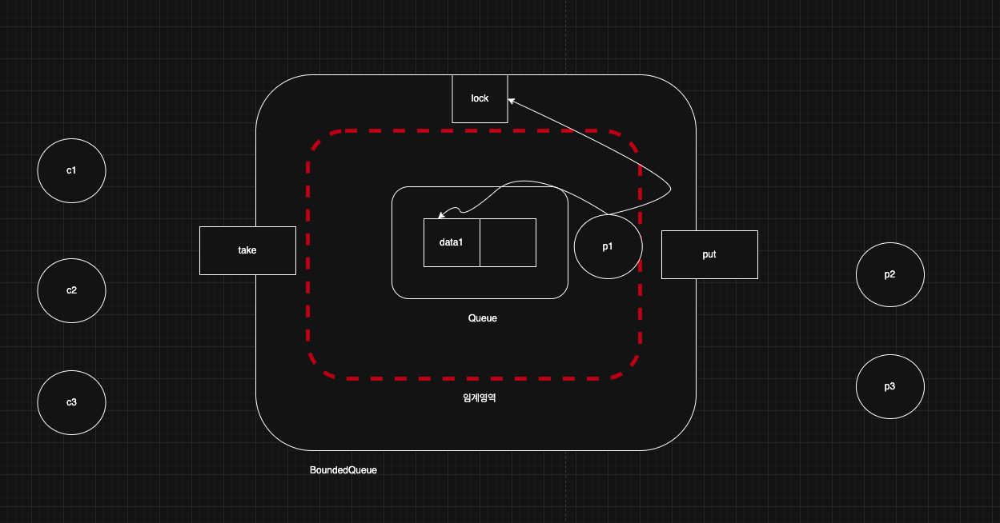

먼저 p1 스레드가 모니터 락을 획득하고 큐에다가 데이터를 삽입한다. 삽입이 완료되었으면 락을 반납하고 p1 스레드 상태는 `TERMINATED` 상태가 된다.

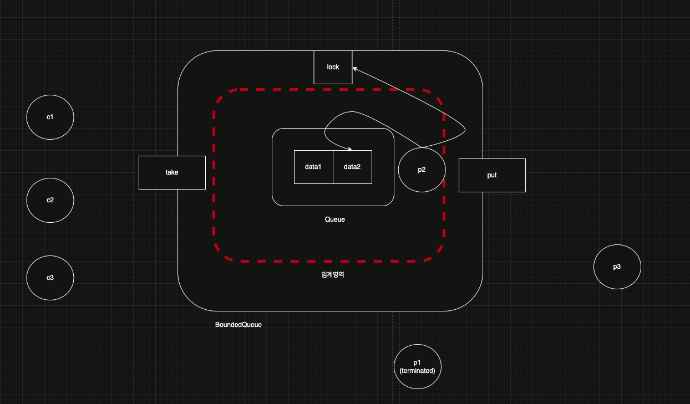

다음으로 p2 스레드가 락을 얻어서 임계영역에 접근한다. 그 후 큐에 데이터를 삽입한다. 삽입이 완료되었으면 락을 반납하고 p2 스레드 상태는 `TERMINATED` 상태가 된다.

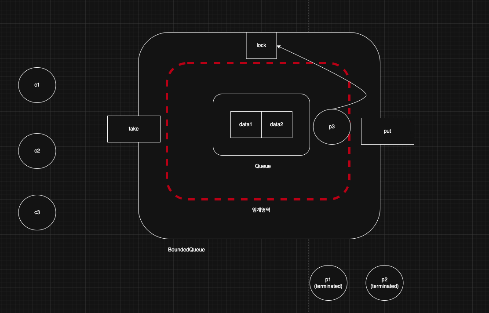

다음으로 p3 스레드가 락을 얻어서 임계영역에 접근한다. 그 후 큐에 데이터를 삽입하려고 봤더니 큐의 데이터가 꽉 찼다. 그러면 해당 데이터를 버리고 락을 반납하고 `TERMINATED` 상태가 된다.

> 📖 데이터를 버리지 않는 대안
>
> `data3`을 버리지 않는 대안은, 큐에 빈 공간이 생길 때 까지 `p3` 스레드가 기다리는 것이다. 언젠가는 소비자 스레드가 실행되어서 큐의 데이터를 가져갈 것이고, 큐에 빈 공간이 생기게 된다. 이때 큐에 데이터를 보관하는 것이다. 그럼 어떻게 기다릴 수 있을까? 단순하게 생각하면 생산자 스레드가 반복문을 사용해서 큐에 빈 공간이 생기는지 주기적으로 체크한 다음에, 만약 빈 공간이 없다면 `sleep()`을 짧게 사용해서 잠시 대기하고, 깨어난 다음에 다시 반복문에서 큐의 빈 공간을 체크하는 식으로 구현하면 될 것 같다.

이제 소비자 스레드에서 데이터를 꺼내오는 순서이다.

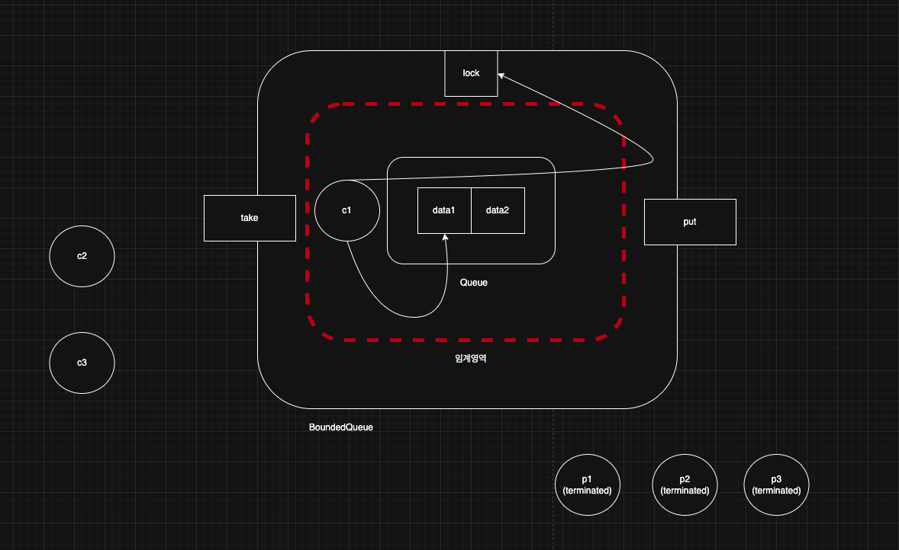

c1 스레드는 락을 획득하여 임계영역에 접근 후 데이터를 꺼낸다. 큐 자료구조이므로 먼저 들어온 data1이 꺼내진다. 꺼냄이 완료되었으면 락을 반납하고 `TERMINATED` 상태가 된다.

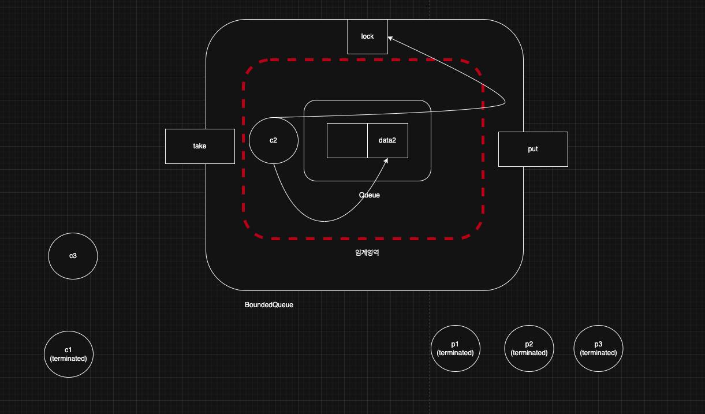

다음으로 c2 스레드가 락을 획득하여 임계영역에 접근 후 데이터를 꺼낸다. data2를 꺼내고 락을 반납 후 `TERMINATED` 상태가 된다.

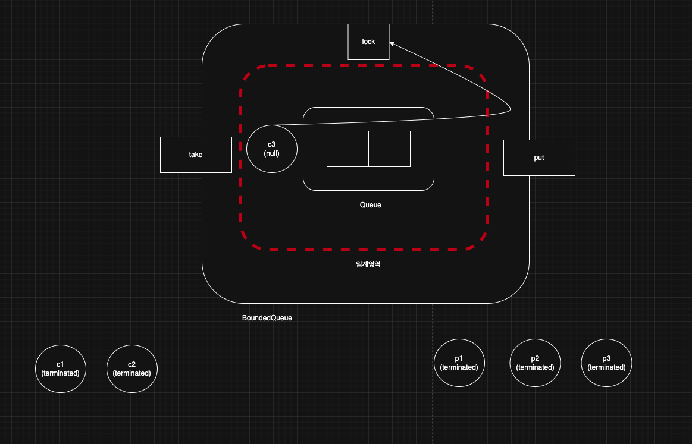

마지막으로 c3 스레드가 락을 획득하여 임계영역에 접근 후 데이터를 꺼내려고 봤더니 큐에 데이터가 없다. 결국 null 반환하고 락을 반납 후 `TERMINATED` 상태가 된다.

> 📖 큐에 데아터가 없다면 기다리자
>
> 소비자 입장에서 큐에 데이터가 없다면 기다리는 것도 대안이다. `null`을 받지 않는 대안은, 큐에 데이터가 추가될 때 까지 c3 스레드가 기다리는 것이다. 언젠가는 생산자 스레드가 실행되어서 큐에 데이터를 추가할 것이다. 물론 생산자 스레드가 계속해서 데이터를 생산한다는 가정이 필요하다. 그럼 어떻게 기다릴 수 있을까? 단순하게 생각하면 소비자 스레드가 반복문을 사용해서 큐에 데이터가 있는지 주기적으로 체크한 다음에, 만약 데이터가 없다면 `sleep()`을 짧게 사용해서 잠시 대기하고, 깨어난 다음에 다시 반복문에서 큐에 데이터가 있는지 체크하는 식으로 구현하면 될 것 같다.

결과적으로 버퍼가 가득차서 p3가 생산한 `data3`은 버려졌다. 그리고 c3가 데이터를 조회하는 시점에 버퍼는 비어 있어서 데이터를 받지 못하고 `null` 값을 받았다. 스레드가 대기하며 기다릴 수 있다면 p3가 생산한 `data3`을 c3가
받을 수도 있었을 것이다.

## 생산자 소비자 문제 - 예제1 분석 - 소비자 우선


이제 소비자 스레드가 먼저 실행한다고 가정해보자.

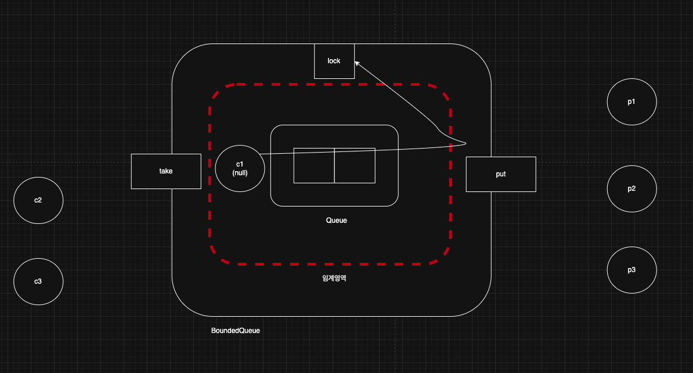

먼저 c1 스레드가 락을 획득 후 임계영역에 접근한다. 데이터를 꺼내려고 받더니 큐에 데이터가 하나도 없다. 따라서 null을 반환하고 `TERMINATED` 상태가 된다.

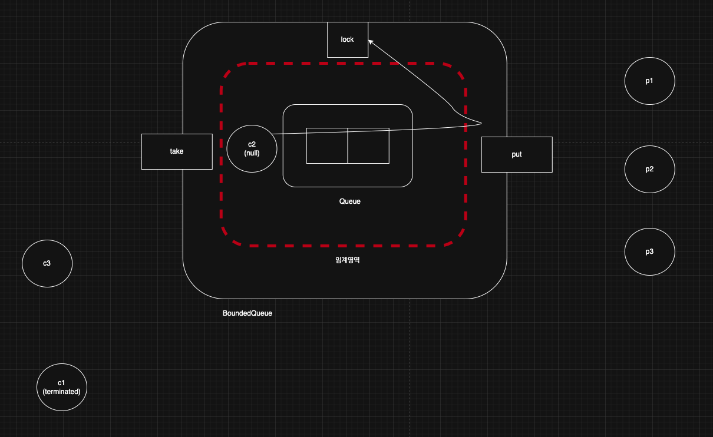

다음 c2 스레드가 락을 획득 후 임계영역에 접근한다. 데이터를 꺼내려고 받더니 큐에 데이터가 하나도 없다. 따라서 null을 반환하고 `TERMINATED` 상태가 된다.

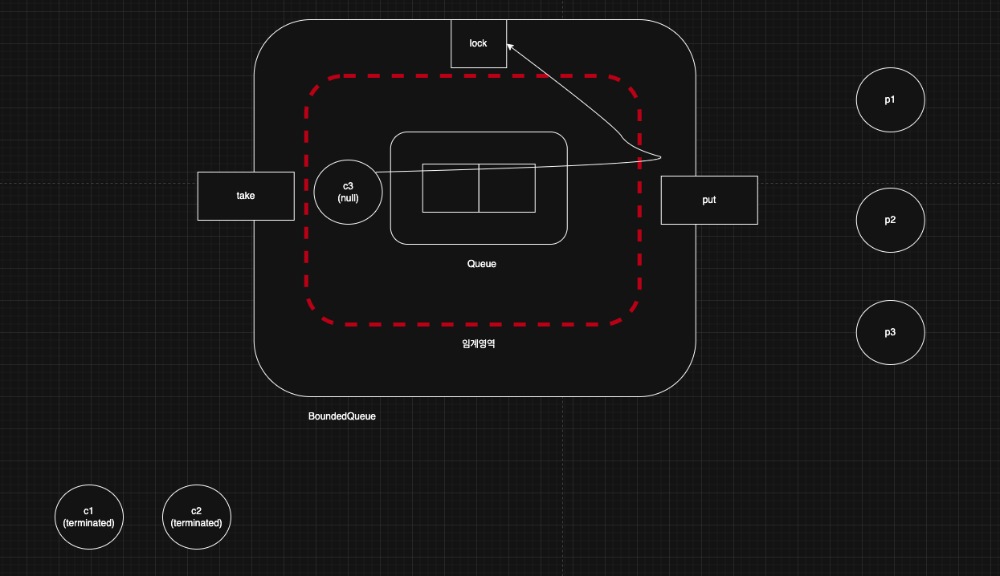

마지막으로 c3 스레드가 락을 획득 후 임계영역에 접근한다. 데이터를 꺼내려고 받더니 큐에 데이터가 하나도 없다. 따라서 null을 반환하고 `TERMINATED` 상태가 된다.

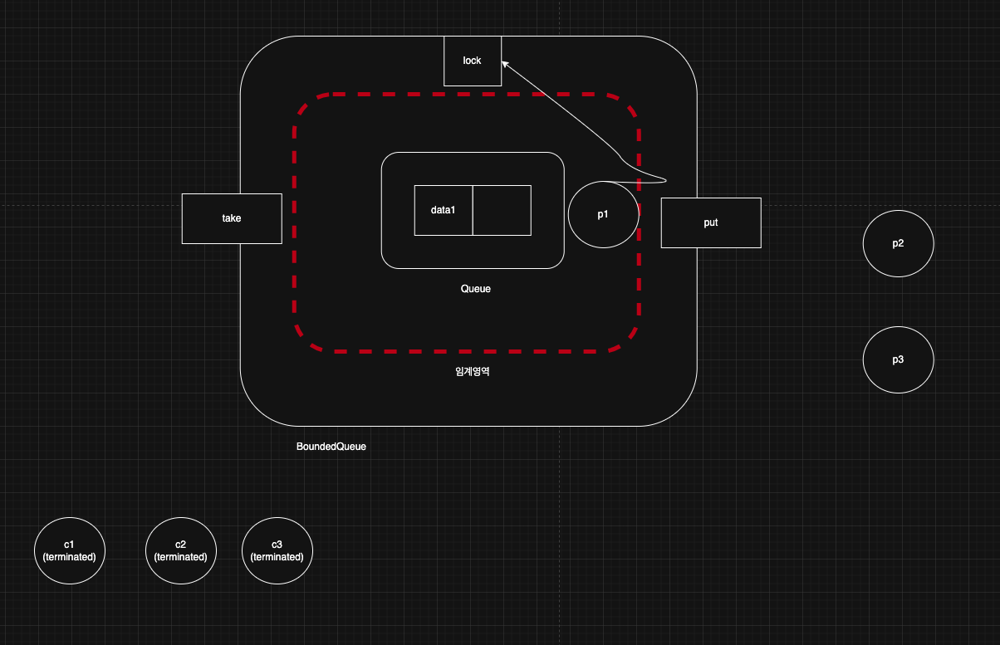

p1 스레드가 락을 획득 후 임계영역에 접근한다. 그 후 data1을 큐에 삽입하고 락을 반납 후 `TERMINATED` 상태가 된다.

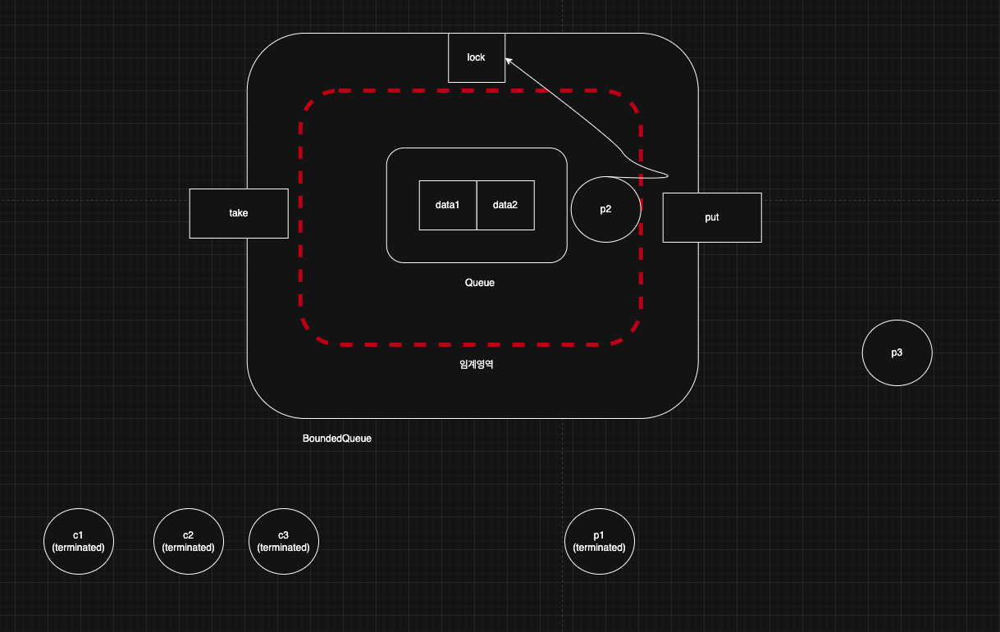

p2 스레드가 락을 획득 후 임계영역에 접근한다. 그 후 data2를 큐에 삽입하고 락을 반납 후 `TERMINATED` 상태가 된다.

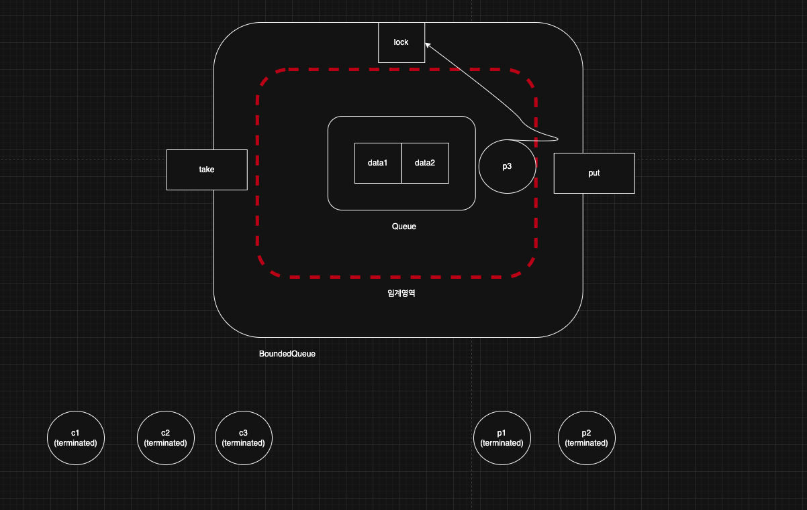

마지막으로 p3가 락을 획득 후 임계영역에 접근한다. 그 후 data3를 큐에 삽입하려 하지만 큐가 가득 찼으므로 버리고 `TERMINATED` 상태가 된다.

### 문제점

- **생산자 스레드 먼저 실행**의 경우 `p3`가 보관하는 `data3`은 버려지고, `c3`는 데이터를 받지 못한다. (`null`을 받는다.)
- **소비자 스레드 먼저 실행**의 경우 `c1`,`c2`,`c3`는 데이터를 받지 못한다.(`null`을 받는다.) 그리고 `p3`가 보관하는 `data3`은 버려진다.

## 생산자 소비자 문제 - 예제2 코드

그럼 위의 문제를 해결하려면 스레드가 잠시 기달려서 생산자 스레드는 큐의 공간이 생길때까지 기달리고 소비자 스레드는 큐의 데이터가 들어올때까지 기달리면 해결된다. 한번 기존 코드를 고쳐보자.

``` java
package thread.bounded;

import java.util.ArrayDeque;
import java.util.Queue;

import static util.MyLogger.log;
import static util.ThreadUtils.sleep;

public class BoundedQueueV2 implements BoundedQueue {

    private final Queue<String> queue = new ArrayDeque<>();

    private final int max;

    public BoundedQueueV2(int max) {
        this.max = max;
    }

    @Override
    public synchronized void put(String data) {
        while (queue.size() == max) {
            log("[put] 큐가 가득 참, 생산자 대기");
            sleep(1000);
        }

        queue.offer(data);
    }

    @Override
    public synchronized String take() {
        while (queue.isEmpty()) {
            log("[take] 큐에 데이터가 없음, 소비자 대기");
            sleep(1000);
        }

        return queue.poll();
    }

    @Override
    public String toString() {
        return queue.toString();
    }
}
```

`put()` 메서드는 큐의 사이즈가 가득 찼는지 여부를 계속 체크하고 1초 대기 상태에 빠지다가 다시 체크하는 무한루프를 돌려서 확인하게끔 하였다. 마찬가지로 `take()` 메서드도 큐가 비어있는지 계속 체크하고 1초 대기상태에 빠지다가 체크하는 무한루프를 돌려보았다. 하지만 결과를 보면 처참하다.

생산자 스레드를 먼저 실행한 경우 소비자 스레드 전부가 차단 상태가 되고 소비자 스레드를 먼저 실행한 경우 c1을 제외한 모든 스레드가 차단 상태가 되버린다. 어떻게 된걸까?

## 생산자 소비자 문제 - 예제2 분석


그러면 위에서 작성한 코드를 그림을 통해 알아보자. 먼저 생산자가 먼저 실행하는 경우를 알아보자. p1 스레드가 락을 획득 후 임계영역 안으로 접근하여 데이터를 큐에 넣는다. 그리고 락을 반납 후 종료상태가 된다.


다음으로 p2 스레드가 락을 획득 후 임계영역에 접근하여 데이터를 큐에 넣은 후 락을 반납하고 종료상태가 된다.

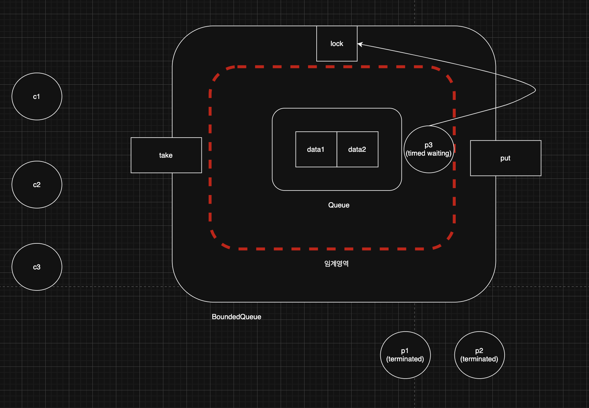

이제 p3 스레드가 락을 획득 후 임계영역에 접근하여 데이터를 넣으려고 한다. 그런데 큐가 가득 찼으므로 `TIMED_WAITING` 상태에 빠지고 1초후 `RUNNABLE`상태로 되어서 큐 사이즈를 체크하는 과정을 반복한다. 빈 자리가 있다면 큐에 데이터를 입력하고 완료된다. 빈 자리가 없다면 `sleep()`으로 잠시 대기한 다음 반복문을 계속해서 수행한다. 1초마다 한 번씩 체크하기 때문에 "큐가 가득 참, 생산자 대기"라는 메시지가 계속 출력될 것이다.

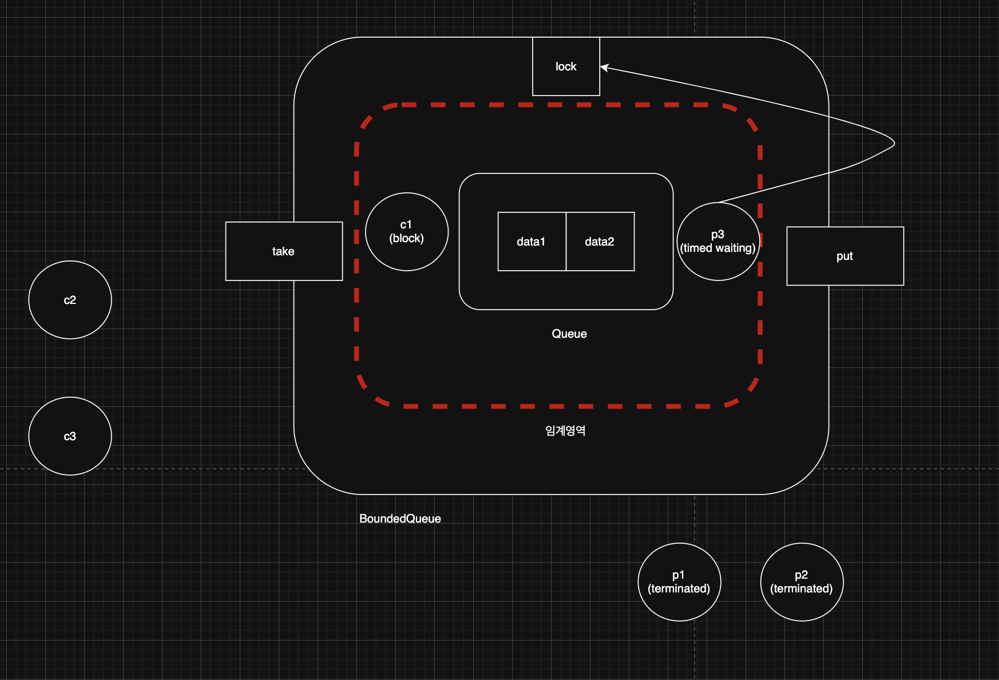

p3가 `TIMED_WAITING` 상태일 동안 소비자 스레드가 임계영역에 접근하려고 한다. 하지만 이미 p3가 락을 획득한 상태라 소비자 스레드는 CPU 스케줄링에 포함되지도 않고 `BLOCKED` 상태가 된다.

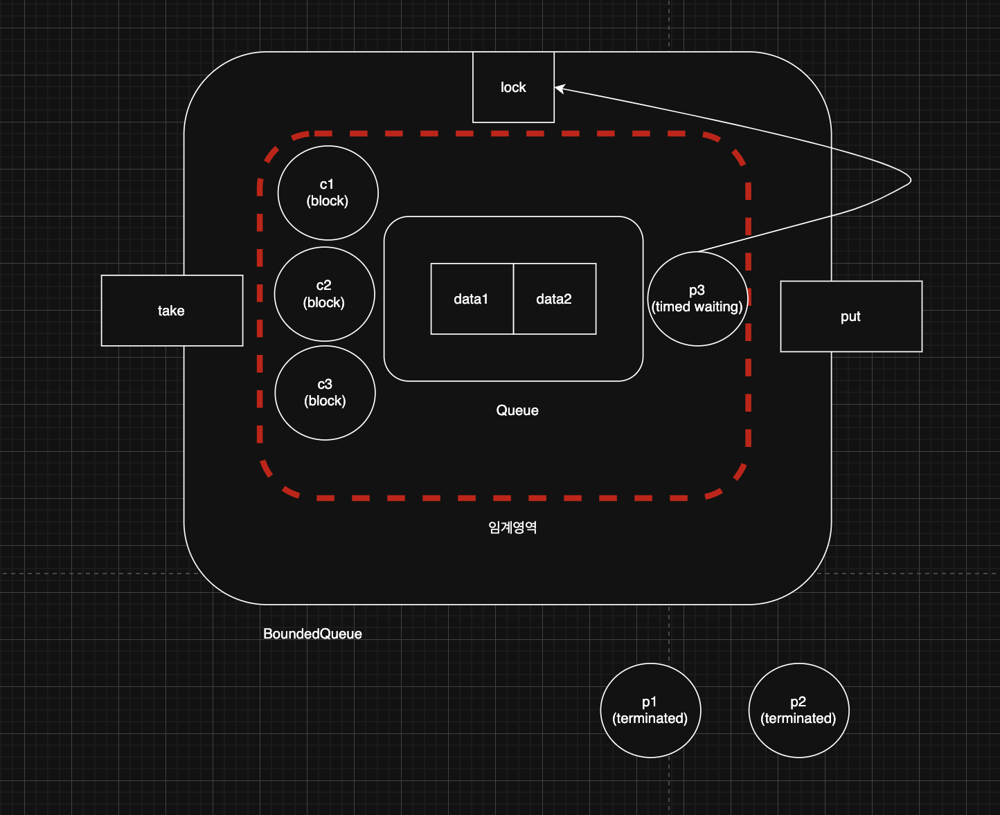

그러면 그 이후의 소비자 스레드도 락을 못 얻어 `BLOCKED` 상태가 될 것이다. 즉, 무한대기가 발생하게 된다.

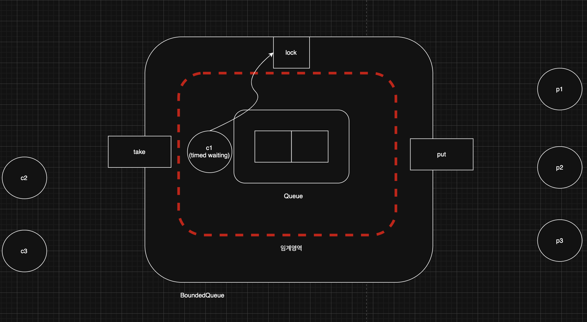

그러면 이제 소비자 스레드가 먼저 실행한다고 해보자. c1 스레드가 락을 획득 후 임계영역에 접근하여 큐에 데이터를 꺼내려고 한다. 하지만 데이터가 하나도 없으므로 1초간 `TIMED_WAITING` 상태에 빠지다가 `RUNNABLE` 상태가 되어 큐에 데이터가 있는지 확인을 반복한다.

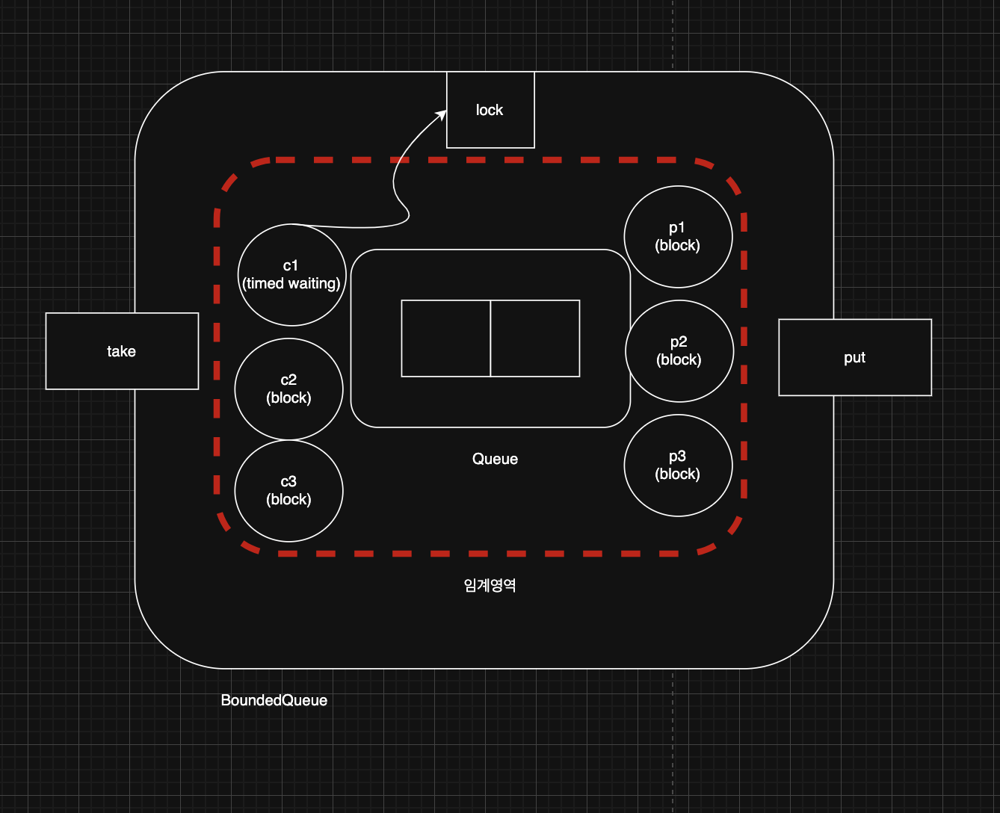

이제 다음 스레드들은 전부 `BLOCKED` 상태가 될 것이다. 왜냐하면 지금 c1 스레드가 락을 획득하고 반납을 안 했기 때문이다. 즉, 운영체제 용어로 두 상황 전부 데드락에 빠진 셈이다.

버퍼가 비었을 때 소비하거나, 버퍼가 가득 찾을 때 생산하는 문제를 해결하기 위해, 단순히 스레드가 잠깐 기다리면 될 것이라 생각했는데, 문제가 더 심각해졌다. 생각해보면 결국 임계 영역 안에서 락을 가지고 대기하는 것이 문제이다. 이것은 마치 열쇠를 가진 사람이 안에서 문을 잠궈버린 것과 같다. 그래서 다른 스레드가 임계 영역안에 접근조차 할 수 없는 것이다.

그런데 여기서 생각해볼 법한 문제가 있다. 데드락 상황이 발생했으니 데드락을 해결하면 된다. 데드락의 해결법은 하나의 스레드를 죽여버리는 것이다. 지금 이 상황에서는 해당 스레드를 락을 반납시키면 해결 될 문제이다. 이런 방법을 자바에서는 `Object.wait()`, `Object.notify()`로 제공해준다.

## Object - wait, notify - 예제3 코드

앞선 무한대기 문제를 `Object` 클래스의 `notify()`와 `wait()` 메서드로 해결을 할 수 있다.

- `Object.wait()`
    - 현재 스레드가 가진 락을 반납하고 대기(`WAITING`)한다.
    - 현재 스레드를 대기(`WAITING`) 상태로 전환한다. 이 메서드는 현재 스레드가 `synchronized` 블록이나 메서드에서 락을 소유하고 있을 때만 호출할 수 있다. 호출한 스레드는 락을 반납하고, 다른 스레드가 해당 락을 획득할 수 있도록 한다. 이렇게 대기 상태로 전환된 스레드는 다른 스레드가 `notify()` 또는 `notifyAll()`을 호출할 때까지 대기 상태를 유지한다.
- `Object.notify()`
    - 대기 중인 스레드 중 하나를 깨운다.
    - 이 메서드는 `synchronized` 블록이나 메서드에서 호출되어야 한다. 깨운 스레드는 락을 다시 획득할 기회를 얻게 된다. 만약 대기 중인 스레드가 여러 개라면, 그 중 하나만이 깨워지게 된다.
- `Object.notifyAll()`
    - 대기 중인 모든 스레드를 깨운다.
    - 이 메서드 역시 `synchronized` 블록이나 메서드에서 호출되어야 하며, 모든 대기 중인 스레드가 락을 획득할 수 있는 기회를 얻게 된다. 이 방법은 모든 스레드를 깨워야 할 필요가 있는 경우에 유용하다.

그럼 `Object`의 `wait()` 메서드와 `notify()` 메서드를 통해 기존 코드를 고쳐보자.

``` java
package thread.bounded;

import java.util.ArrayDeque;
import java.util.Queue;

import static util.MyLogger.log;

public class BoundedQueueV3 implements BoundedQueue {

    private final Queue<String> queue = new ArrayDeque<>();

    private final int max;

    public BoundedQueueV3(int max) {
        this.max = max;
    }

    @Override
    public synchronized void put(String data) {
        while (queue.size() == max) {
            log("[put] 큐가 가득 참, 생산자 대기");

            try {
                wait();
                log("[put] 생산자 깨어남");
            } catch (InterruptedException e) {
                throw new RuntimeException(e);
            }
        }

        queue.offer(data);
        log("[put] 생산자 데이터 저장, notify() 호출");
        notify();
//        notifyAll();
    }

    @Override
    public synchronized String take() {
        while (queue.isEmpty()) {
            log("[take] 큐에 데이터가 없음, 소비자 대기");

            try {
                wait();
                log("[take] 소비자 깨어남");
            } catch (InterruptedException e) {
                throw new RuntimeException(e);
            }
        }

        String data = queue.poll();
        log("[take] 소비자 데이터 획득, notify() 호출");
        notify();
//        notifyAll();

        return data;
    }

    @Override
    public String toString() {
        return queue.toString();
    }
}
```

처음에 생산자 스레드가 락을 획득하고 데이터가 가득 찼는지 확인한다. 가득 찼을 경우 `wait()` 메서드를 통해 락을 반납 후 대기상태로 빠진다. 그리고 공간이 나서 `while`문을 빠져나와 데이터를 넣고나서 `notify`를 통하여 대기 스레드 하나를 깨운다. 그러면 해당 대기 스레드는 대기상태에서 차단상태로 변경된다. 이 과정은 소비자 스레드도 마찬가지로 동작한다.

## Object - wait, notify - 예제3 분석 - 생산자 우선

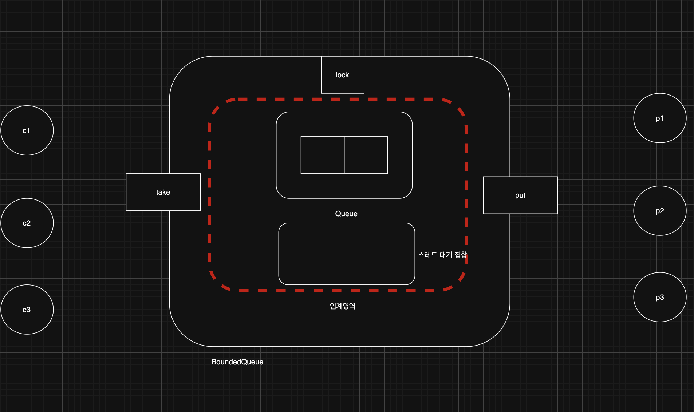

사실 `BlockingQueue` 안에는 모니터 락뿐만 아니라 세트로 스레드 대기 집합도 존재한다.

> 📚 스레드 대기 집합이란?
>
> `synchronized` 임계 영역 안에서 `Object.wait()` 를 호출하면 스레드는 대기(`WAITING`) 상태에 들어간다. 이렇게 대기 상태에 들어간 스레드를 관리하는 것을 대기 집합(wait set)이라 한다. 참고로 모든 객체는 각자의 대기 집합을 가지고 있다.

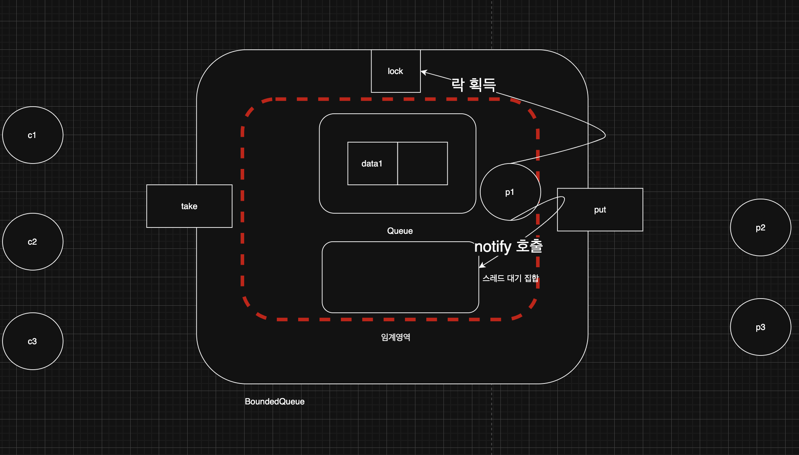

p1 스레드가 락을 획득 후 큐에 데이터를 넣는다. 큐가 가득 안 찼으니 큐에 데이터를 성공적으로 넣고 스레드 대기 집함에 `notify` 메서드를 호출한다. 지금은 대기하는 스레드가 없으니 아무런 반응이 없다. 그 후에 종료될 것이다. p2 스레드도 마찬가지로 동작할 것이다. 문제는 p3이다.

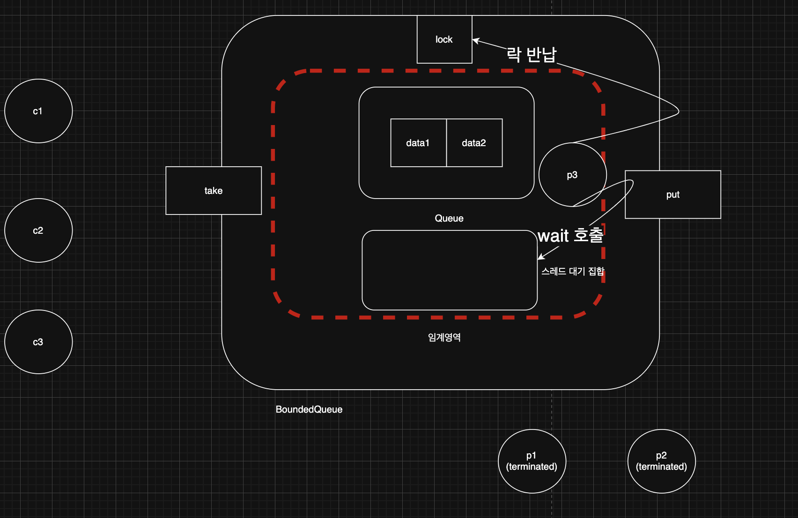

p3가 락을 획득 후, 데이터를 큐에 넣으려고 한다. 하지만 큐는 지금 가득 찼으므로 데이터를 넣지 못하고 `wait` 메서드를 호출하여 대기상태에 빠지고 락을 반납 후 스레드 대기 집합으로 들어간다.

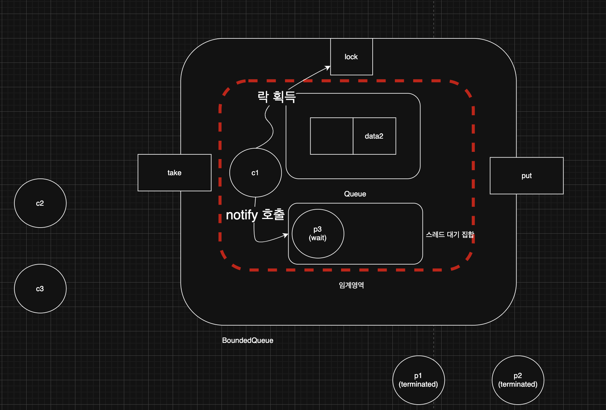

다음으로 소비자 스레드인 c1 스레드가 임계영역에 접근하여 락을 획득하고 큐에 데이터를 가져간다. 그 후, `notify` 메서드로 대기중인 p3 스레드를 `BLOCKED` 상태로 변경한다. 그 이유는 아직 c1이 락을 가지고 있다. 그런데 만약 `RUNNABLE` 상태로 p3 스레드가 깨어나면 잘못된 상황이 발생하기 때문이다. 그래서 `BLOCKED` 상태가 된다.

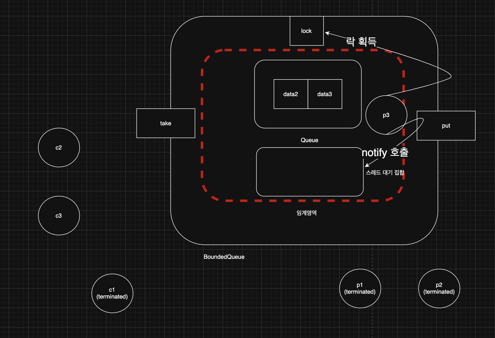

c1 스레드가 락을 반납 후 종료상태가 되면 p3 스레드는 `RUNNABLE` 상태가 되어 `wait` 메서드 이후 로직을 수행한다. 즉, 큐에 데이터를 넣고 스레드 대기 집합에 `notify` 메서드를 호출 후, 종료상태가 될 것이다. 나머지 c2, c3 스레드도 이와 같이 동작이 될 것이다.

## Object - wait, notify - 예제3 분석 - 소비자 우선

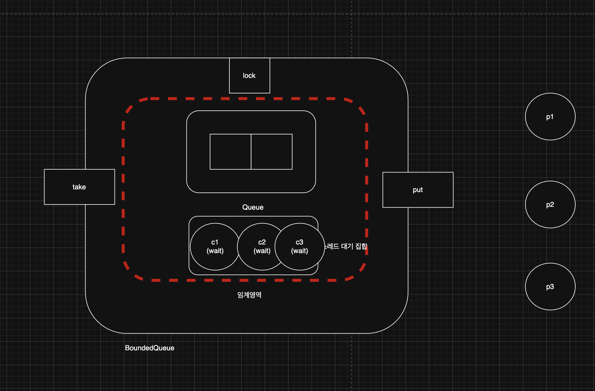

이제 소비자 스레드부터 동작한다고 해보자. c1 스레드가 락을 획득 후, 큐에 데이터를 꺼내려고 했지만 값이 없으므로 `wait` 메서드 호출 후, 대기상태에 빠져서 락을 반납하고 스레드 대기 집합으로 간다. c2, c3도 마찬가지일 것이다.

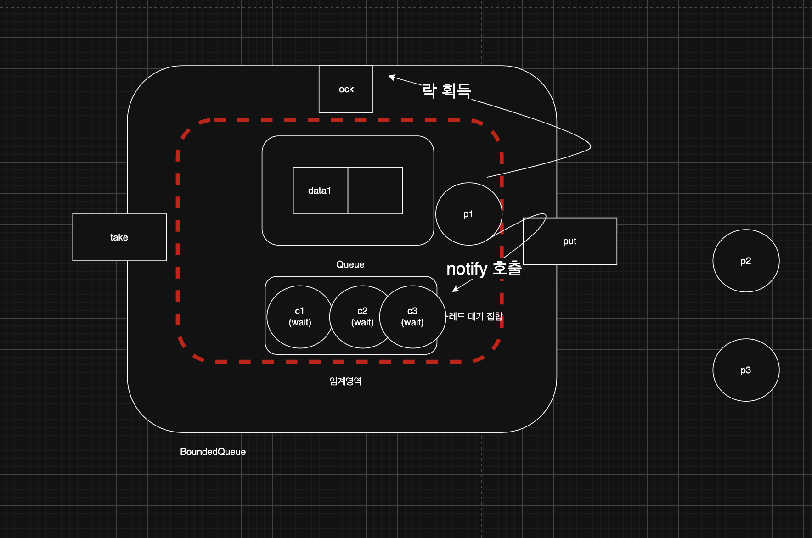

이제 생산자 스레드가 동작한다. p1 스레드가 락을 획득 후, 큐에 데이터를 넣고 스레드 대기 집합에 `notify` 메서드를 호출한다. 그러면 스레드 대기 집합에 있는 스레드들중에 랜덤해서 하나가 `BLOCKED` 상태가 된다. 해당 부분은 JVM 스펙에 명시되어 있지 않기 때문에 진짜 랜덤이다.

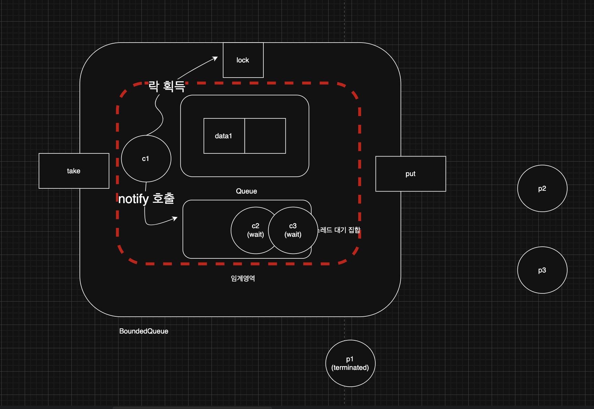

이제 p1 스레드가 락을 반납 후 종료 상태가 되면 깨어난 c1 스레드가 락을 획득 후, 큐에 데이터를 가져간다. 그리고 `notify` 메서드를 통하여 스레드 대기 집합에 스레드를 깨운다. 근데 여기서 문제가 있다. 소비자 스레드가 소비자 스레드를 깨우는 격이 된다. 그러면 깨어난 소비자 스레드는 락을 얻고 작업을 수행하려고 하지만 큐에 데이터가 없어서 다시 스레드 대기 집합으로 간다. 결국 CPU만 쓰는 겪이다.

이후에는 생산자 스레드 p2가 깨어나 이 과정을 반복할 것이다. 결국 CPU를 더 쓰더라도 안전하게 모든 스레드가 종료가 될 것이다.

> ✅ 참고
>
> `notify` 메서드로 특정 스레드만 깨울 수는 없다.

최종 결과를 보면 `p1`,`p2`,`p3`는 모두 데이터를 정상 생산하고, `c1`,`c2`,`c3` 는 모두 데이터를 정상 소비할 수 있었다. 하지만 소비자인 `c1`이 같은 소비자인 `c2`,`c3`를 깨울 수 있었다. 이 경우 큐에 데이터가 없을 가능성이 있다. 이때는 깨어난 소비자 스레드가 CPU 자원만 소모하고 다시 대기 집합에 들어갔기 때문에 비효율적이다. 만약 소비자인 `c1` 입장에서 생산자, 소비자 스레드를 선택해서 깨울 수 있다면, 소비자인 `c2`를 깨우지는 않았을 것이다. 예를 들어서 소비자는 생산자만 깨우고, 생산자는 소비자만 깨울 수 있다면 더 효율적으로 작동할 수 있을 것 같다. 하지만 `notify()`는 이런 선택을 할 수 없다. 물론 이것이 비효율적이라는 것이지 결과에는 아무런 문제가 없다. 약간 돌아서 갈 뿐이다.

## Object - wait, notify - 한계

지금까지 살펴본 `Object.wait()`,`Object.notify()` 방식은 스레드 대기 집합 하나에 생산자, 소비자 스레드를 모두 관리한다. 그리고 `notify()`를 호출할 때 임의의 스레드가 선택된다. 따라서 앞서 살펴본 것 처럼 큐에 데이터가 없는 상황에 소비자가 같은 소비자를 깨우는 비효율이 발생할 수 있다. 또는 큐에 데이터가 가득 차있는데 생산자가 같은 생산자를 깨우는 비효율도 발생할 수 있다.

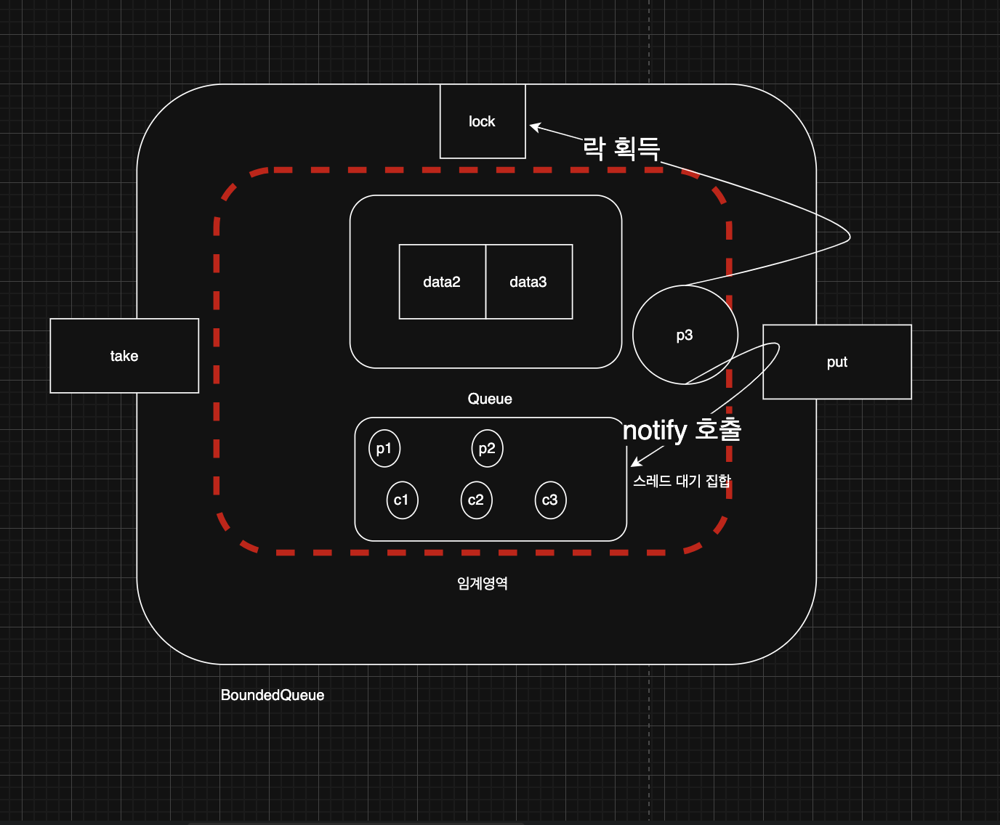

최악의 상황은 그렇다. 만약 스레드 대기 집합에 생산자 스레드와 소비자 스레드가 같이 있고 현재 생산자 스레드가 락을 얻어 데이터를 넣으려는데 만약 데이터가 가득 차서 `wait()`를 호출이 되어 대기상태로 가고 다른 스레드가 락을 획득하려는데 그게 또 생산자 스레드라면? 그리고 계속 생산자 스레드만 깨어난다면 진짜 프로그램이 계속 돌 것이다. 또한 너무 비효율적이다.

이런 문제를 해결하려면 어떻게 할까? 뭔가 우리가 배운 `notifyAll` 메서드로 해결할 수 있을 것 같다. 이 메서드를 호출하면 모든 스레드가 다 깨어나 경쟁상태가 되고 락을 획득하려한다. 그래서 운이 좋게 소비자 스레드가 되면 비효율적이긴 하나 괜찮지만 운이 나쁘게 계속 생산자 스레드만 된다면? 이 상황도 마찬가지일 것이다. 그러면 어떻게 해결할까? 다음 포스팅에서 알아보자.

> ✅ 참고
>
> 실제로 자바는 계속 같은 스레드를 깨우지는 않는다. 일반적으로 오래 기다린 순으로 깨워준다. 그렇다 하더라도 비효율 문제는 해결되지 않는다.

> 잘못된 지식이 있을 경우 댓글로 남겨주시면 빠르게 반영하겠습니다!