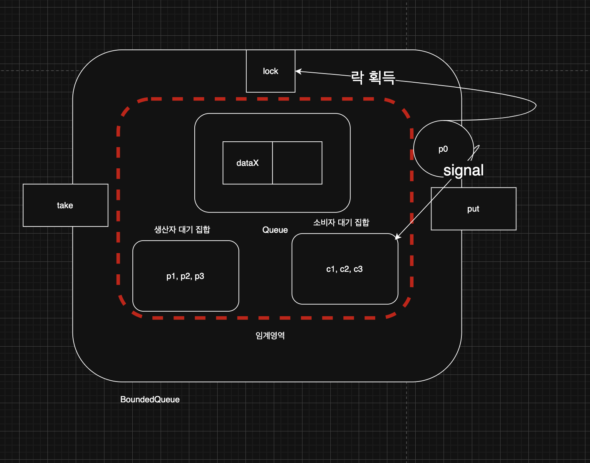
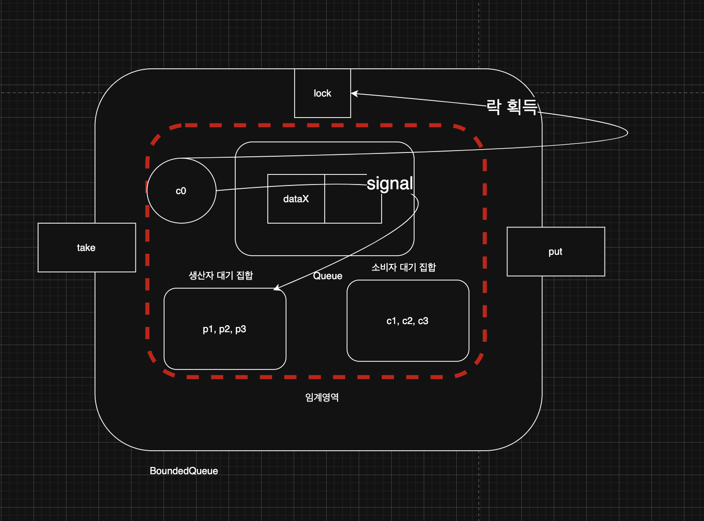
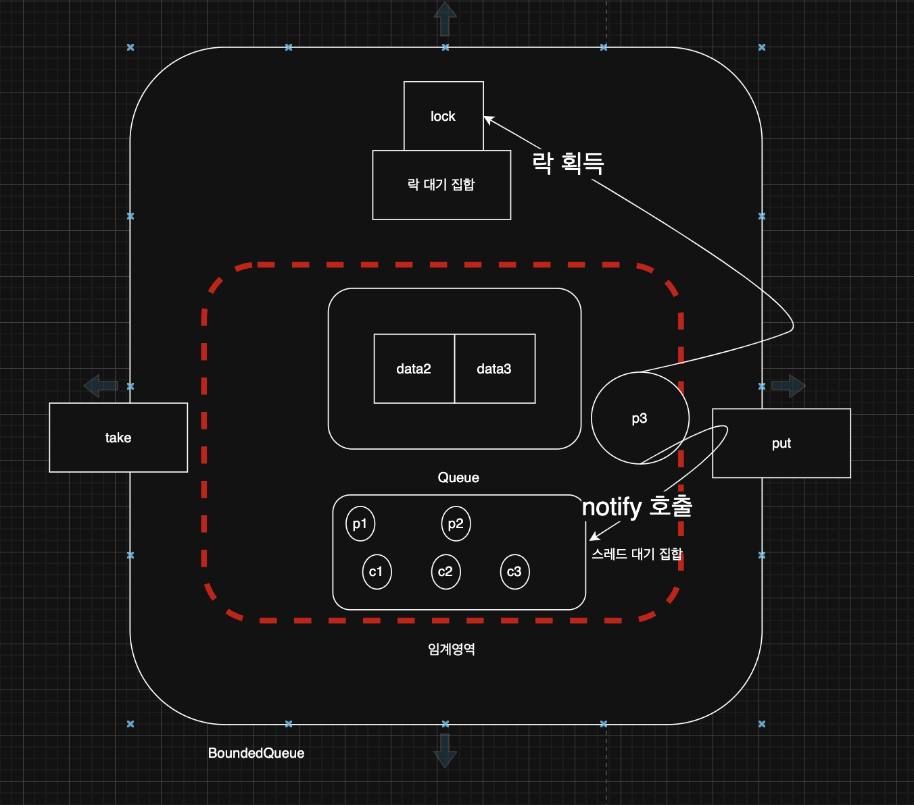
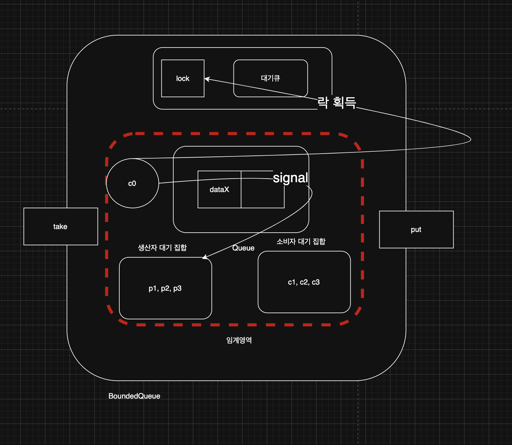

> 해당 블로그 글은 [영한님의 인프런 강의](https://inf.run/6oSgn)를 바탕으로 쓰여진 글입니다.

## Lock Condition - 예제4

생산자가 생산자를 깨우고, 소비자가 소비자를 깨우는 비효율 문제를 어떻게 해결할 수 있을까?

핵심은 생산자 스레드는 데이터를 생성하고, 대기중인 소비자 스레드에게 알려주어야 한다. 반대로 소비자 스레드는 데이터를 소비하고, 대기중인 생산자 스레드에게 알려주면 된다. 결국 생산자 스레드가 대기하는 대기 집합과, 소비자 스레드가 대기하는 대기 집합을 둘로 나누면 된다. 그리고 생산자 스레드가 데이터를 생산하면 소비자 스레드가 대기하는 대기 집합에만 알려주고, 소비자 스레드가 데이터를 소비하면 생산자 스레드가 대기하는 대기 집합에만 열려주면 되는것이다. 이렇게 생산자용, 소비자용 대기 집합을 서로 나누어 분리하면 비효율 문제를 깔끔하게 해결할 수 있다. 그럼 대기 집합을 어떻게 분리할 수 있을까? 바로 앞서 학습한 `Lock`,`ReentrantLock`을 사용하면 된다.

그럼 기존 코드를 `Lock` 인터페이스와 `ReetrantLock`을 이용하여 변경해보자.

``` java
package thread.bounded;

import java.util.ArrayDeque;
import java.util.Queue;
import java.util.concurrent.locks.Condition;
import java.util.concurrent.locks.Lock;
import java.util.concurrent.locks.ReentrantLock;

import static util.MyLogger.log;

public class BoundedQueueV4 implements BoundedQueue {

    private final Lock lock = new ReentrantLock();

    private final Condition condition = lock.newCondition();

    private final Queue<String> queue = new ArrayDeque<>();

    private final int max;

    public BoundedQueueV4(int max) {
        this.max = max;
    }

    @Override
    public void put(String data) {
        lock.lock();

        try {
            while (queue.size() == max) {
                log("[put] 큐가 가득 참, 생산자 대기");

                try {
                    condition.await();
                    log("[put] 생산자 깨어남");
                } catch (InterruptedException e) {
                    throw new RuntimeException(e);
                }
            }

            queue.offer(data);
            log("[put] 생산자 데이터 저장, signal() 호출");
            condition.signal();
        } finally {
            lock.unlock();
        }
    }

    @Override
    public String take() {
        lock.lock();

        try {
            while (queue.isEmpty()) {
                log("[take] 큐에 데이터가 없음, 소비자 대기");

                try {
                    condition.await();
                    log("[take] 소비자 깨어남");
                } catch (InterruptedException e) {
                    throw new RuntimeException(e);
                }
            }

            String data = queue.poll();
            log("[take] 소비자 데이터 획득, signal() 호출");
            condition.signal();

            return data;
        } finally {
            lock.unlock();
        }
    }

    @Override
    public String toString() {
        return queue.toString();
    }
}
```

`Condition`은 `ReentrantLock`을 사용하는 스레드가 대기하는 스레드 대기 공간이다. `lock.newCondition()` 메서드를 호출하면 스레드 대기 공간이 만들어진다. `Lock(ReentrantLock)`의 스레드 대기 공간은 이렇게 만들 수 있다.

> ✅ 참고
>
> `Object.wait()` 에서 사용한 스레드 대기 공간은 모든 객체 인스턴스가 내부에 기본으로 가지고 있다.

반면에 `Lock(ReentrantLock)`을 사용하는 경우 이렇게 스레드 대기 공간을 직접 만들어서 사용해야 한다.

`condition.await()`은 `Object.wait()`와 유사한 기능이다. 해당 스레드를 대기상태로 변경하고 `condition`에 보관한다. `condition.signal()`은 `Object.notify()`와 유사한 기능이다. `condition`에 대기하고 있는 스레드를 랜덤해서 깨우고 `BLOCKED` 상태로 만든다.

## 생산자 소비자 대기 공간 분리 - 예제5 코드

스레드 대기 공간을 생산자용 스레드 대기 공간과 소비자용 스레드 대기 공간을 분리하여 진행하고 생산자 스레드는 소비자 스레드 대기 공간에서 깨우고 소바자 스레드는 생산자 대기 공간에서 깨우면 위의 문제를 깔끔히 해결이 가능하다.

``` java
package thread.bounded;

import java.util.ArrayDeque;
import java.util.Queue;
import java.util.concurrent.locks.Condition;
import java.util.concurrent.locks.Lock;
import java.util.concurrent.locks.ReentrantLock;

import static util.MyLogger.log;

public class BoundedQueueV5 implements BoundedQueue {

    private final Lock lock = new ReentrantLock();

    private final Condition producerCond = lock.newCondition();

    private final Condition consumerCond = lock.newCondition();

    private final Queue<String> queue = new ArrayDeque<>();

    private final int max;

    public BoundedQueueV5(int max) {
        this.max = max;
    }

    @Override
    public void put(String data) {
        lock.lock();

        try {
            while (queue.size() == max) {
                log("[put] 큐가 가득 참, 생산자 대기");

                try {
                    producerCond.await();
                    log("[put] 생산자 깨어남");
                } catch (InterruptedException e) {
                    throw new RuntimeException(e);
                }
            }

            queue.offer(data);
            log("[put] 생산자 데이터 저장, consumerCond.signal() 호출");
            consumerCond.signal();
        } finally {
            lock.unlock();
        }
    }

    @Override
    public String take() {
        lock.lock();

        try {
            while (queue.isEmpty()) {
                log("[take] 큐에 데이터가 없음, 소비자 대기");

                try {
                    consumerCond.await();
                    log("[take] 소비자 깨어남");
                } catch (InterruptedException e) {
                    throw new RuntimeException(e);
                }
            }

            String data = queue.poll();
            log("[take] 소비자 데이터 획득, producerCond.signal() 호출");
            producerCond.signal();

            return data;
        } finally {
            lock.unlock();
        }
    }

    @Override
    public String toString() {
        return queue.toString();
    }
}
```

여기서 핵심은 생산자는 소비자를 깨우고, 소비자는 생산자를 깨운다는 점이다. 소비자가 소비자를 깨운다거나, 생산자가 생산자를 깨우지 않기 때문에 비효율적으로 실행되는 부분이 제거되고 아주 깔끔하게 작업이 실행된다.

## 생산자 소비자 대기 공간 분리 - 예제5 분석



지금 p1, p2, p3가 생산자 대기 공간에 c1, c2, c3가 소비자 대기 공간에 대기상태에 있다. 이때 p0가 락을 획득해서 임계영역에 접근하여 큐에 데이터를 넣은 후에는 소비자 대기 공간에 `signal`을 통해 스레드를 깨운다.



반대로 c0가 온다면 생산자 대기 공간에 `signal`을 통해 스레드를 깨울 것이다.

### Object.notify() vs Condition.signal()

- Object.notify()
    - 대기 중인 스레드 중 임의의 하나를 선택해서 깨운다. 스레드가 깨어나는 순서는 정의되어 있지 않으며, JVM 구현에 따라 다르다. 보통은 먼저 들어온 스레드가 먼저 수행되지만 구현에 따라 다를 수 있다.
    - `synchronized` 블록 내에서 모니터 락을 가지고 있는 스레드가 호출해야 한다.
- Condition.signal()
    - 대기 중인 스레드 중 하나를 깨우며, 일반적으로는 FIFO 순서로 깨운다. 이 부분은 자바 버전과 구현에 따라 달라질 수 있지만, 보통 `Condition`의 구현은 `Queue` 구조를 사용하기 때문에 FIFO 순서로 깨운다.
    - `ReentrantLock`을 가지고 있는 스레드가 호출해야 한다.

## 스레드의 대기

`synchronized`,`ReentrantLock`의 대기 상태에 대해 정리해 보자. 먼저 `synchronized`의 대기 상태를 정리해보자. `synchronized`를 잘 생각해보면 2가지 단계의 대기 상태가 존재한다.

- 락 획득 대기
    - `BLOCKED` 상태로 락 획득 대기
    - `synchronized`를 시작할 때 락이 없으면 대기
    - 다른 스레드가 `synchronized`를 빠져나갈 때 대기가 풀리며 락 획득 시도
- wait() 대기
    - `WAITING` 상태로 대기
    - `wait()`를 호출 했을 때 스레드 대기 집합에서 대기
    - 다른 스레드가 `notify()` 를 호출 했을 때 빠져나감

사실 `synchronized`에서는 `BLOCKED` 상태의 스레드들이 있는 락 대기 집합이라는 것이 별도로 존재한다.



스레드가 락을 획득을 이미 한 상태에서 다른 스레드가 임계영역에 접근하려고 하면 락이 없어서 `BLOCKED` 상태가 된다. 그러면 해당 스레드는 락 대기 집합이라는 곳에 저장된다. 그리고 락을 반납하면 해당 스레드는 락 대기 집합에 나와서 락을 획득 후 임계영역에 진입한다. 만약 이 스레드가 소비자 스레드라면 큐에 데이터를 꺼내야 하는데 만약 데이터가 없다면 스레드 대기 집합에 `WAITING` 상태로 저장된다. 즉, 1차 대기소가 락 대기집합이고 2차 대기소가 스레드 대기 집합으로 보면 좋을 것 같다. 그리고 `notify()`로 깨어나면 다시 1차 대기소인 락 대기 집합으로 가서 `BLOCKED`상태로 가다가 락이 반납되면 다시 획득하여 임계영역에 들어가 작업을 수행하는 것이다.

자바의 모든 객체 인스턴스는 멀티스레드와 임계 영역을 다루기 위해 내부에 3가지 기본 요소를 가진다.

- 모니터 락
- 락 대기 집합
- 스레드 대기 집합

`synchronized`를 사용한 임계 영역에 들어가려면 모니터 락이 필요하다. 모니터 락이 없으면 락 대기 집합에 들어가서 `BLOCKED` 상태로 락을 기다린다. 모니터 락을 반납하면 락 대기 잡합에 있는 스레드 중 하나가 락을 획득하고 `BLOCKED -> RUNNABLE` 상태가 된다. `wait()`를 호출해서 스레드 대기 집합에 들어가기 위해서는 모니터 락이 필요하다. 스레드 대기 집합에 들어가면 모니터 락을 반납한다. 스레드가 `notify()`를 호출하면 스레드 대기 집합에 있는 스레드 중 하나가 스레드 대기 집합을 빠져나온다. 그리고 모니터 락 획득을 시도한다. 이런 과정을 잘 기억해두자!

`ReetrantLock`도 `synchronized`와 유사하게 작동한다.



`ReetrantLock`은 그 내부 안에 대기큐가 존재하여 대기 큐에서 관리를 한다. 다만 `synchronized`와 차이점은 스레드 상태가 `BLOCKED` 상태가 아니라 `WAITING` 상태인것이다. 즉, `lock.lock()`을 호출 했을 때 락이 없으면 대기를 하는 것이다. 그리고 다른 스레드가 `lock.unlock()`을 호출 했을 때 대기가 풀리며 락 획득 시도, 락을 획득하면 대기 큐를 빠져나간다. 그리고 임계영역에 들어오는데 소비자 스레드라고 한다면 큐에 데이터를 꺼낼 것이다. 하지만 데이터가 없다면 `condition.await()`를 호출하여 `condition` 객체의 스레드 대기 공간에서 관리를 한다. 그리고 상태는 `WAITING`상태로 변경된다. 다른 스레드가 `condition.signal()`을 호출 했을 때 `condition` 객체의 스레드 대기 공간에서 빠져나간다.

> ✅ 참고
>
> 깨어난 스레드는 바로 실행되는 것이 아니다. `synchronized`와 마찬가지로 `ReentrantLock`도 대기소가 2단계로 되어 있다. 2단계 대기소인 `condition` 객체의 스레드 대기 공간을 빠져나온다고 바로 실행되는 것이 아니다. 임계 영역 안에서는 항상 락이 있는 하나의 스레드만 실행될 수 있다. 여기서는 `ReentrantLock`의 락을 획득해야 `RUNNABLE` 상태가 되면서 그 다음 코드를 실행할 수 있다. 락을 획득하지 못하면 `WAITING` 상태로 락을 획득할 때 까지 `ReentrantLock`의 대기 큐에서 대기한다.

## 중간 정리 - 생산자 소비자 문제

처음에는 단순한 큐 자료구조를 이용했다. 스레드를 제어할 수 없기 때문에, 버퍼가 가득 차거나, 버퍼에 데이터가 없는 한정된 버퍼 상황에서 문제가 발생한다. 큐가 꽉 차면 데이터를 버리게 되는 문제도 발생했고 큐에 자료가 없다면 null을 반환하는 문제도 발생하였다.

이 문제를 해결하고자 생산자, 소비자 스레드를 대기시키기로 하였다. 하지만 이러니 데드락 문제가 발생하는 결과를 초래했다.

이를 해결하기 위해 `synchronized` 와 함께 사용할 수 있는 `wait()`,`notify()`,`notifyAll()`을 사용해서 문제를 해결했다. `wait()`를 사용하면 스레드가 대기할 때, 락을 반납하고 대기한다. 이후에 `notify()`를 호출하면 스레드가 깨어나면서 락 획득을 시도한다. 이때 락을 획득하면 `RUNNABLE` 상태가 되고, 락을 획득하지 못하면 락 획득을 대기하는 `BLOCKED` 상태가 된다. 이렇게 해서 스레드를 제어하는 큐 자료 구조를 만들 수 있었다. 생산자 스레드는 버퍼가 가득차면 버퍼에 여유가 생길 때 까지 대기한다. 소비자 스레드는 버퍼에 데이터가 없으면 버퍼에 데이터가 들어올 때 까지 대기한다. 이런 구현 덕분에 단순한 자료 구조를 넘어서 스레드까지 제어할 수 있는 자료 구조를 완성했다. 이 방식의 단점은 스레드가 대기하는 대기 집합이 하나이기 때문에, 원하는 스레드를 선택해서 깨울 수 없다는 문제가 있었다.

그래서 `ReetrantLock`을 이용하여 생산자 대기 공간과 소비자 대기 공간을 나누고 생산자 스레드는 대기 공간을 깨울 때 소비자 대기 공간을 소비자 스레드는 생산자 대기 공간을 깨우면 되는 것이다. 그리고 이것을 자바에서 구현해두었는데 바로 `BlockingQueue`이다.

## BlockingQueue - 예제6

자바는 생산자 소비자 문제를 해결하기 위해 `java.util.concurrent.BlockingQueue`라는 특별한 멀티스레드 자료 구조를 제공한다. 이것은 이름 그대로 스레드를 차단(Blocking) 할 수 있는 큐다.

> ⚠️ 주의
>
> 차단이라고 해서 스레드 상태가 차단 상태가 아니다! 그냥 말 그대로 스레드가 접근 못하게 막는다는 것이다.

- 데이터 추가 차단: 큐가 가득 차면 데이터 추가 작업(`put()`)을 시도하는 스레드는 공간이 생길 때까지 차단된다.
- 데이터 획득 차단: 큐가 비어 있으면 획득 작업(`take()`)을 시도하는 스레드는 큐에 데이터가 들어올 때까지 차단된다.

`BlockingQueue`는 인터페이스이고, 다양한 기능을 제공한다. 그리고 이 인터페이스를 구현하는 구현체들도 존재한다.

- `ArrayBlockingQueue` : 배열 기반으로 구현되어 있고, 버퍼의 크기가 고정되어 있다.
- `LinkedBlockingQueue` : 링크 기반으로 구현되어 있고, 버퍼의 크기를 고정할 수도, 또는 무한하게 사용할 수 도 있다.

> ✅ 참고
>
> `Deque` 용 동시성 자료 구조인 `BlockingDeque`도 있다. 동시성 자료 구조들은 추후에 다루겠다.

그럼 `BlockingQueue`를 이용하여 기존 코드를 고쳐보겠다.

``` java
package thread.bounded;

import java.util.concurrent.ArrayBlockingQueue;
import java.util.concurrent.BlockingQueue;

public class BoundedQueueV6_1 implements BoundedQueue {

    private BlockingQueue<String> queue;

    public BoundedQueueV6_1(int max) {
        queue = new ArrayBlockingQueue<>(max);
    }

    @Override
    public void put(String data) {
        try {
            queue.put(data);
        } catch (InterruptedException e) {
            throw new RuntimeException(e);
        }
    }

    @Override
    public String take() {
        try {
            return queue.take();
        } catch (InterruptedException e) {
            throw new RuntimeException(e);
        }
    }

    @Override
    public String toString() {
        return queue.toString();
    }
}
```

보면 우리가 이전에 작성했던 구조와 거의 유사하다. `ArrayBlockingQueue` 는 내부에서 `ReentrantLock`을 사용한다. 그리고 생산자 전용 대기실과 소비자 전용 대기실이 있다. 만약 버퍼가 가득 차면 생산자 스레드는 생산자 전용 대기실에서 대기(`await()`)한다. 생산자 스레드가 생산을 완료하면 소비자 전용 대기실에 `signal()`로 신호를 전달한다.

우리가 구현한 기능과 차이가 있다면 인터럽트가 걸릴 수 있도록, `lock.lock()` 대신에 `lock.lockInterruptibly()`을 사용한 점과, 내부 자료 구조의 차이 정도이다.

## BlockingQueue - 기능 설명

실무에서 웹 어플리케이션을 만든다면 가장 중요한 것은 데이터 정합성도 중요하지만 고객에게 빠른 응답성이 제일 중요하다고 생각한다. 예를들어, 선착순 100% 할인 쿠폰 이벤트를 진행한다고 해보자. 큐의 한계가 10000개라고 가정하자. 선착순 이벤트로 생성자 스레드가 폭주할 것이다. 하지만 소비자 스레드가 100개밖에 없다면 고객은 엄청 오래 대기해야할 것이고 짜증나서 페이지를 닫아버릴 수 있을 것이다. 이렇게 생산자 스레드가 큐에 데이터를 추가할 때 큐가 가득 찬 경우, 또는 큐에 데이터를 추가하기 위해 너무 오래 대기 한 경우에는 데이터 추가를 포기하고, 고객에게 주문 폭주로 너무 많은 사용자가 몰려서 요청을 처리할 수 없다거나, 또는 나중에 다시 시도해달라고 하는 것이 더 나은 선택일 것이다.

큐가 가득 찼을 때는 아래와 같이 4가지 경우로 처리할 수 있다.

- 예외를 던진다. 예외를 받아서 처리한다.
- 대기하지 않는다. 즉시 `false`를 반환한다.
- 대기한다.
- 특정 시간 만큼만 대기한다.

### Throws Exception - 대기시 예외

- add(e): 지정된 요소를 큐에 추가하며, 큐가 가득 차면 `IllegalStateException` 예외를 던진다.
- remove(): 큐에서 요소를 제거하며 반환한다. 큐가 비어 있으면 `NoSuchElementException` 예외를 던진다.
- element(): 큐의 머리 요소를 반환하지만, 요소를 큐에서 제거하지 않는다. 큐가 비어 있으면 `NoSuchElementException` 예외를 던진다.

### Special Value - 대기시 즉시 반환

- offer(e): 지정된 요소를 큐에 추가하려고 시도하며, 큐가 가득 차면 `false`를 반환한다.
- poll(): 큐에서 요소를 제거하고 반환한다. 큐가 비어 있으면 `null`을 반환한다.
- peek(): 큐의 머리 요소를 반환하지만, 요소를 큐에서 제거하지 않는다. 큐가 비어 있으면 `null`을 반환한다.

### Blocks - 대기

- put(e): 지정된 요소를 큐에 추가할 때까지 대기한다. 큐가 가득 차면 공간이 생길 때까지 대기한다.
- take(): 큐에서 요소를 제거하고 반환한다. 큐가 비어 있으면 요소가 준비될 때까지 대기한다.
- Examine (관찰): 해당 사항 없음.

### Times Out - 시간 대기

- offer(e, time, unit): 지정된 요소를 큐에 추가하려고 시도하며, 지정된 시간 동안 큐가 비워지기를 기다리다가 시간이 초과되면 `false`를 반환한다.
- poll(time, unit): 큐에서 요소를 제거하고 반환한다. 큐에 요소가 없다면 지정된 시간 동안 요소가 준비되기를 기다리다가 시간이 초과되면 `null`을 반환한다.
- Examine (관찰): 해당 사항 없음.

## BlockingQueue - 기능 확인

그러면 기능들을 하나씩 살펴보자. `BlockingQueue`의 `offer(data)`,`poll()`를 사용해서 스레드를 대기하지 않고 즉시 반환해보자.

``` java
package thread.bounded;

import java.util.concurrent.ArrayBlockingQueue;
import java.util.concurrent.BlockingQueue;

import static util.MyLogger.log;

public class BoundedQueueV6_2 implements BoundedQueue {

    private BlockingQueue<String> queue;

    public BoundedQueueV6_2(int max) {
        queue = new ArrayBlockingQueue<>(max);
    }

    @Override
    public void put(String data) {
        boolean result = queue.offer(data);
        log("저장 시도 결과 = " + result);
    }

    @Override
    public String take() {
        return queue.poll();
    }

    @Override
    public String toString() {
        return queue.toString();
    }
}
```

결과 값을 보면 알겠지만 우리가 처음에 만든 V1예제와 동일하게 나온다.

다음으로 `BlockingQueue`의 `offer(data, 시간)`,`poll(시간)`를 사용해서, 특정 시간 만큼만 대기하도록 해보자. 메서드는 마치 `Queue` 인터페이스와 같다.

``` java
package thread.bounded;

import java.util.concurrent.ArrayBlockingQueue;
import java.util.concurrent.BlockingQueue;
import java.util.concurrent.TimeUnit;

import static util.MyLogger.log;

public class BoundedQueueV6_3 implements BoundedQueue {

    private BlockingQueue<String> queue;

    public BoundedQueueV6_3(int max) {
        queue = new ArrayBlockingQueue<>(max);
    }

    @Override
    public void put(String data) {
        try {
            boolean result = queue.offer(data, 1, TimeUnit.NANOSECONDS);
            log("저장 시도 결과 = " + result);
        } catch (InterruptedException e) {
            throw new RuntimeException(e);
        }
    }

    @Override
    public String take() {
        try {
            return queue.poll(2, TimeUnit.SECONDS);
        } catch (InterruptedException e) {
            throw new RuntimeException(e);
        }
    }

    @Override
    public String toString() {
        return queue.toString();
    }
}
```

위의 코드는 특정 시간만큼 대기를 하고 만약 그 시간을 넘기면 특정 값을 반환한다. `put()` 메서드는 큐가 가득 차면 `false`를 반환, `take()` 메서드는 큐에 데이터가 없다면 `null`을 반환한다.

`BlockingQueue`의 `add(data)`,`remove()`를 사용해서, 대기시 예외가 발생하도록 해보자.

``` java
package thread.bounded;

import java.util.concurrent.ArrayBlockingQueue;
import java.util.concurrent.BlockingQueue;

public class BoundedQueueV6_4 implements BoundedQueue {

    private BlockingQueue<String> queue;

    public BoundedQueueV6_4(int max) {
        queue = new ArrayBlockingQueue<>(max);
    }

    @Override
    public void put(String data) {
        queue.add(data);
    }

    @Override
    public String take() {
        return queue.remove();
    }

    @Override
    public String toString() {
        return queue.toString();
    }
}
```

이렇게 우리는 생산자 소비자 문제의 원인부터 `BlockingQueue`까지 알아보았다. 내용이 긴 만큼 그 동안의 내용을 잘 기억해두자.

> 잘못된 지식이 있을 경우 댓글로 남겨주시면 빠르게 반영하겠습니다!