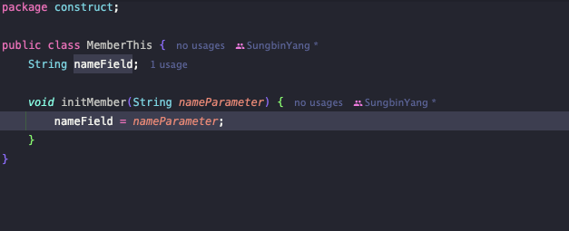

> 해당 블로그 글은 [영한님의 인프런 강의](https://inf.run/PuC6W)를 바탕으로 쓰여진 글입니다.

## 생성자 - 필요한 이유

생성자를 학습하기 전에 왜 생성자가 필요한지 예제를 통해 알아보자. 캐릭터의 정보를 출력하는 예제를 작성해보자.

``` java
package construct;

public class Character {
    String name;

    int life;

    int level;
}
```

위와 같이 캐릭터 클래스를 만들었다. 이제 이것을 활용해서 main 메서드를 작성해보자.

``` java
package construct;

public class MethodInitMain {
    public static void main(String[] args) {
        Character character1 = new Character();
        character1.name = "user1";
        character1.life = 100;
        character1.level = 1;

        Character character2 = new Character();
        character2.name = "user2";
        character2.life = 90;
        character2.level = 2;

        Character[] characters = {character1, character2};

        for (Character s : characters) {
            System.out.println("이름: " + s.name + " 목숨: " + s.life + " 레벨: " + s.level);
        }
    }
}
```

이렇게 작성해보니 뭔가 정보들의 값을 넣는 과정이 뭔가 중복적이다. 이를 메서드로 빼보자!

``` java
package construct;

public class MethodInitMain {
    public static void main(String[] args) {
        Character character1 = new Character();
        init("user1", 100, 1);

        Character character2 = new Character();
        init("user2", 90, 2);

        Character[] characters = {character1, character2};

        for (Character s : characters) {
            System.out.println("이름: " + s.name + " 목숨: " + s.life + " 레벨: " + s.level);
        }
    }

    static void init(Character character, String name, int life, int level) {
        character.name = name;
        character.life = life;
        character.level = level;
    }
}
```

위와 같이 작성해보니 해당 메서드가 객체의 데이터를 쓰고 있는 것이 보인다. 즉, 데이터와 행동이 분리되어 있다. 이것을 저번에 배운 방법으로 객체로 합쳐보자.

## this

이제 메서드를 객체 내부로 이동시켜서 데이터와 행동을 합쳐보자.

``` java
package construct;

public class Character {
    String name;

    int life;

    int level;

    void init(String name, int life, int level) {
        this.name = name;
        this.life = life;
        this.level = level;
    }
}
```

``` java
package construct;

public class MethodInitMain {
    public static void main(String[] args) {
        Character character1 = new Character();
        character1.init("user1", 100, 1);

        Character character2 = new Character();
        character2.init("user2", 90, 2);

        Character[] characters = {character1, character2};

        for (Character s : characters) {
            System.out.println("이름: " + s.name + " 목숨: " + s.life + " 레벨: " + s.level);
        }
    }
}
```

이렇게 하니 객체지향적으로 잘 짜여진 코드가 된 것을 볼 수 있다. 그런데 여기서 코드를 작성하다 보니 낫선 키워드를 발견했을 것이다. 바로 `this`이다. 그러면 왜 `this`를 사용해야 하는지 이유를 알아보자.

`Character` 클래스의 `init` 메서드를 확인해보면 파라미터 이름과 객체 자신이 가지고 있는 멤버변수의 이름이 같은 것을 볼 수 있다. 멤버 변수와 메서드의 매개변수의 이름이 같으면 둘을 어떻게 구분해야 할 수 있을까?

- 이 경우 멤버 변수보다 매개변수가 코드 블럭의 더 안쪽에 있기 때문에 **매개변수가 우선순위**를 가진다. 따라서 `init`메서드의 `name`은 파라미터의 name을 말하는 것이다.
- 멤버 변수에 접근하려면 앞에 `this.` 이라고 해주면 된다. 여기서 `this` 는 인스턴스 자신의 참조값을 가리킨다.(ex. x001)

그러면 만약 파라미터와 멤버변수가 이름이 같은 상황에서 `this`를 사용하지 않으면 어떻게 될까? 에러는 발생하지 않는다. 다만, 값이 제대로 할당이 되지를 않는다. 그래서 매개변수의 이름과 맴버 변수의 이름이 같은 경우 `this` 를 사용해서 둘을 명확하게 구분해야 한다.

### this의 생략

`this` 는 생략할 수 있다. 이 경우 변수를 찾을 때 가까운 지역변수(매개변수도 지역변수다)를 먼저 찾고 없으면 그 다음으로 멤버 변수를 찾는다. 멤버 변수도 없으면 오류가 발생한다. 즉, 파리미터 변수와 멤버 변수의 이름이 다를 경우 생략이 가능하다.

### this의 코딩 스타일

멤버변수에 접근하고 싶은 경우 항상 `this`를 붙이는 코딩 스타일이 존재하였다. 하지만 지금은 이 습관이 불필요하다고 느껴진다. 왜냐하면 과거에는 `this`를 안 붙이면 IDE상에 구분하기 매우 힘들었다. `this`를 생략을 가능한 경우에도 말이다. 하지만 요즘은 IDE내에서 잘 구분함으로 불필요한 코드를 칠 필요없다. 따라서 필요한 경우에만 작성하면 될 것 같다.



이런 점 때문에 `this` 는 앞서 설명한 것 처럼 이름이 중복되는 것 처럼, 꼭 필요한 경우에만 사용해도 충분하다 생각한다라고 영한님께서 말씀하셨다. 하자만 나는 조금은 다른 방면도 생각한다. this를 사용해서 더 명확하게 하는 것도 나는 좋아보인다고 생각한다. 다만, 우리가 무엇을 하든간에 이렇게 '왜' 했는지를 알아야 할 것 같다. 🤔

## 생성자 - 도입

프로그래밍을 하다보면 객체를 생성하고 이후에 바로 초기값을 할당해야 하는 경우가 많다. 그래서 우리는 `init`처럼 초기화 해주는 메서드를 작성했다. 하지만 이것을 매번 객체 생성할 때마다 작성해주면 골치 아플 것이다. 또한 실수로 초기화 로직 메서드를 호출을 안 하면 이상한 값이 들어가는 사태가 발생할 경우도 있을 것이다. 이로 인해 자바에서는 생성자라는 기능을 제공해준다.

``` java
package construct;

public class Character {
    String name;

    int life;

    int level;

    public Character(String name, int life, int level) {
        this.name = name;
        this.life = life;
        this.level = level;
    }
}
```

그리고 아래와 같이 사용이 가능하다.

``` java
package construct;

public class MethodInitMain {
    public static void main(String[] args) {
        Character character1 = new Character("user1", 100, 1);

        Character character2 = new Character("user2", 90, 2);

        Character[] characters = {character1, character2};

        for (Character s : characters) {
            System.out.println("이름: " + s.name + " 목숨: " + s.life + " 레벨: " + s.level);
        }
    }
}
```

생성자는 마치 메서드와 비슷하지만 조금 다른 점이 있다.

- 생성자의 이름은 클래스 이름과 같아야 한다. 따라서 첫 글자도 대문자로 시작한다.
- 생성자는 반환 타입이 없다. 비워두어야 한다.
- 나머지는 메서드와 같다.

생성자는 인스턴스를 생성과 동시에 호출된다. 자세히 말하면 메모리 공간에 인스턴스를 생성하고 그 안에 멤버변수 크기 만큼 할당을 한 다음에 바로 생성자 호출된다. 비유를 하자면 방을 하나 만들고 그 안에 필요한 부엌, 화장실, 방, 거실등을 만든 다음에 다 만들었다고 해당 방 주인을 부르는 것처럼 말이다. 그래서 우리가 `new` 키워드를 사용해서 객체를 생성할 때 마지막에 괄호`()`도 포함해야 하는 이유가 바로 생성자 때문이다. 객체를 생성하면서 동시에 생성자를 호출한다는 의미를 포함한다.

### 생성자 장점

- 중복 호출 제거
    - 생성자가 없었다면 초기화 로직 메서드를 일일이 작성해야 했지만 생성자 덕분에 이런 수고를 덜었다.
- 제약: 생성자 호출 필수
    - 초기화 메서드를 실수로 누락하면 잘못된 값이 들어가고 엄청난 버그로 초래할 수 있다.
    - 하지만 생성자는 반드시 호출해야 하기 때문에 이런 위험을 방지할 수 있다.

> 생성자의 진짜 장점은 객체를 생성할 때 직접 정의한 생성자가 있다면 **직접 정의한 생성자를 반드시 호출**해야 한다는 점이다.

만약 생성자를 호출하지 않는다면 어떻게 될까? 아래와 같이 생성자를 호출하지 않는다고 하자.

``` java
Character ch1 = new Character();
```

그러면 바로 아래와 같이 컴파일 에러가 발생한다. 우리가 직접 생성자를 정의했다면 정의한 생성자는 반드시 호출해야 한다. 물론 생성자를 메서드 오버로딩 처럼 여러개 정의할 수 있는데, 이 경우에는 하나만 호출하면 된다.

``` bash
no suitable constructor found for MemberConstruct(no arguments)
```

그래서 이렇게 강제적으로 생성자를 사용함으로 필수 값들을 초기화하는데 매우 유용하다.

> ✅ 참고
>
> 좋은 프로그램은 무한한 자유도가 주어지는 프로그램이 아니라 적절한 제약이 있는 프로그램이다.

## 기본 생성자

생각해보면 우리는 이제까지 생성자를 호출한 적이 없다.

``` java
Character character = new Character();
```

위의 코드만 봐도 이렇게 작성해도 에러는 발생하지 않는다. 분명 파라미터가 없는 생성자를 호출했는데 우리는 만들지는 않았지만 실행이 된다. 파라미터가 없는 생성자를 기본 생성자라고 하는데 자바가 알아서 자동으로 만들어준다. 단, 생성자가 없는 경우에만 말이다. 우리가 정의한 생성자가 있다면 만들어주지 않는다.

> 🙋🏻 기본 생성자는 왜 만들어주는 걸까?
>
> 만약 자바에서 기본 생성자를 만들어주지 않는다면 생성자 기능이 필요하지 않은 경우에도 모든 클래스에 개발자가 직접 기본 생성자를 정의해야 한다. 생성자 기능을 사용하지 않는 경우도 많기 때문에 이런 편의 기능을 제공한다.

### 정리

- 생성자는 반드시 호출되어야 한다.
- 생성자가 없으면 기본 생성자가 제공된다.
- **생성자가 하나라도 있으면 기본 생성자가 제공되지 않는다.** 이 경우 개발자가 정의한 생성자를 직접 호출해야 한다.

## 생성자 - 오버로딩과 this()

생성자를 여러개 만들어보자. name과 life만 받고 level은 기본 1로 세팅하는 생성잘를 추가해보자.

``` java
package construct;

public class Character {
    String name;

    int life;

    int level;

    public Character(String name, int life) {
        this.name = name;
        this.life = life;
        this.level = 50;
    }

    public Character(String name, int life, int level) {
        this.name = name;
        this.life = life;
        this.level = level;
    }
}
```

그런데 이렇게 작성해보니 뭔가 중복이 되어 보이는 증상이 나타난다. 이것을 줄여볼 수 있다. 바로 `this()`를 이용해서 줄여보자.

``` java
package construct;

public class Character {
    String name;

    int life;

    int level;

    public Character(String name, int life) {
        this(name, life, 50);
    }

    public Character(String name, int life, int level) {
        this.name = name;
        this.life = life;
        this.level = level;
    }
}
```

`this()` 라는 기능을 사용하면 생성자 내부에서 자신의 생성자를 호출할 수 있다. 참고로 `this` 는 인스턴스 자신의 참조값을 가리킨다. 그래서 자신의 생성자를 호출한다고 생각하면 된다.

### this() 규칙

`this()` 는 생성자 코드의 첫줄에만 작성할 수 있다.

> 잘못된 지식이 있을 경우 댓글로 남겨주시면 빠르게 반영하겠습니다!