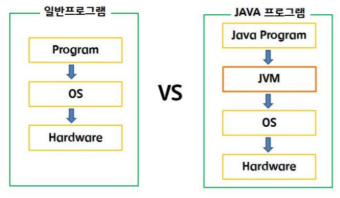
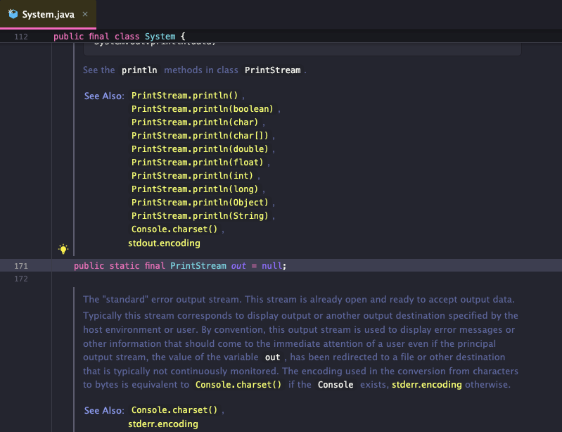
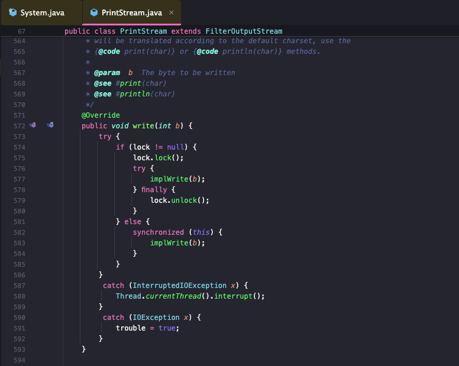
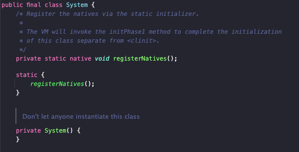

이번 미션을 통해 나는 JVM에 대해 좀 더 깊게 공부를 할 수 있었으며, `System.out.println()`이 어떻게 구성되어 있고 동작하는지 볼 수 있는 기회였다. 그럼 문제풀이 시작해보겠다.

## 초급

### 문제1

> JVM(Java Virtual Machine)이 자바 프로그램을 실행할 때 하는 주요 역할을 설명하세요. JVM이 자바 프로그램을 운영체제와 독립적으로 실행할 수 있게 해주는 이유는 무엇인가요?

위의 문제에 대한 내 생각은 다음과 같다. 

- JVM은 자바 프로그램이 운영체제와 독립적으로 실행될 수 있게 합니다. 자바 코드는 소스 파일에서 작성되며, 컴파일러에 의해 바이트코드로 변환된 후 JVM이 바이트코드를 해석하거나 기계어로 번역하여 실행한다.

- JVM은 이러한 과정을 통해 자바 프로그램이 모든 플랫폼에서 일관된 방식으로 동작할 수 있도록 한다. 즉, JVM이 없다면 바이트코드를 실행할 수 없기 때문에 자바 프로그램이 운영체제와 상관없이 실행되지 못한다.



### 문제2

> 자바 주석을 사용하는 기본적인 이유를 설명하고, 주석을 작성하는 두 가지 방법을 각각 예시와 함께 설명하세요.

위의 문제에 대한 내 생각은 다음과 같다. 주석은 코드의 가독성을 높이고 코드의 기능을 설명하거나 매래에 수정할 때 참고할 수 있는 정보를 제공한다.

- 단일 라인 주석: // 주석내용
- 다중 라인 주석: /* 여러줄의 주석 내용 */

하지만 주석이 너무 무분별하게 적혀져 있으면 오히려 가독성이 떨어지는 부분이 있다. 이 부분은 사람마다 차이가 있으니 구글링으로 '주석의 양면성'에 대해 공부해보는 것도 좋을 것 같다.

### 문제3

> `System.out.println()`을 사용하여 자기소개를 콘솔에 출력하는 프로그램을 작성하세요.

``` java
public class Resume {
    public static void main(String[] args) {
        System.out.println("안녕하세요, 경기도 시흥에 사는 양성빈입니다.");
        System.out.println("만나서 반갑습니다.");
        System.out.println("현재 저는 개발에 푹 빠져 있습니다.");
    }
}
```

깃헙주소: https://github.com/SungbinYang/Java/blob/main/java-start/src/mission/ch02/Resume.java

## 중급

### 문제1

> JVM의 내부 구조 중 클래스 로더, 실행 엔진, 메모리 관리 역할에 대해 간단히 기술하세요.

위의 문제에 대한 내 생각은 다음과 같다. JVM은 자바 프로그램의 실행을 담당하는 가상 머신으로, 바이트코드를 기계어로 해석하여 프로그램이 운영체제와 무관하게 동작할 수 있게 한다. 이제 JVM의 구조적 요소에 대해 살펴보겠다.

- 클래스 로더: 프로그램 실행 시 필요한 클래스를 메모리에 로드하여 중복 로드를 방지하고 클래스 간 의존성을 관리한다.

- 실행엔진: 인터프리터와 JIT 컴파일러가 포함되어 있으며, 바이트코드를 기계어로 변환하여 실행 성능을 향상시킨다.

- 메모리 관리: 자바의 힙, 스택 메모리를 관리하며, JVM의 가비지 컬렉션을 통해 사용하지 않는 객체를 자동으로 제거하여 메모리 누수를 방지한다.

### 문제2

> `System.out.println()`의 내부 동작 과정에서 `PrintStream` 클래스가 어떻게 작동하는지 설명하세요. 또한 `println()` 메서드가 어떤 방식으로 콘솔에 출력을 전달하는지 기술하세요.

- `System.out`은 `PrintStream` 객체로, `System.out.println()`이 호출되면 `PrintStream` 클래스의 `println()` 메서드가 작동하여 텍스트를 출력 스트림으로 보낸다.



- `PrintStream`의 내부 `write()` 메서드를 통해 출력 스트림에 데이터를 전달하고, 데이터를 효율적으로 출력하기 위해 버퍼링을 사용한다.



- `println()` 메서드는 운영체제의 개행 방식(\n 또는 \r\n)에 따라 자동으로 줄바꿈을 추가한다.

## 고급

### 문제1

> JVM(Java Virtual Machine)의 구조와 역할을 상세히 설명하세요. JVM이 자바 프로그램을 실행하는 과정에서 클래스 로딩, 바이트코드 검증, JIT 컴파일 등이 수행되는 각 단계와 그 역할을 단계별로 서술하세요.

JVM은 자바 프로그램을 실행하기 위해 클래스 로딩, 바이트코드 검증, 실행 엔진의 해석 및 컴파일 과정이 단계별로 수행된다.

- 클래스 로더(Class Loader): 자바 클래스 파일을 읽고 메모리에 로드한다. 클래스 간의 의존성을 검사하고, 프로그램이 필요로 하는 클래스를 적재한다.
- 바이트코드 검증(Bytecode Verifier): 로드된 바이트코드가 무결성을 지니고 있는지 검증한다. 이는 보안적 측면에서도 중요하며, 잘못된 메모리 접근이나 실행 오류를 방지한다.
- 실행 엔진(Execution Engine):
  - 인터프리터: 바이트코드를 한 줄씩 해석하여 실행하므로 느리지만, 프로그램 시작 속도가 빠르다.
  - JIT 컴파일러: 실행 중 자주 호출되는 코드 블록을 기계어로 변환하여 성능을 최적화한다.
- 메모리 관리(Memory Management): 힙, 스택 등의 메모리를 관리하고, 가비지 컬렉션을 통해 사용되지 않는 객체를 자동으로 삭제한다.

이 과정을 통해 JVM은 자바 프로그램을 바이트코드에서 기계어로 변환하여 운영체제에서 실행할 수 있게 한다.

### 문제2

> 자바의 `System` 클래스는 상속하거나 인스턴스화할 수 없도록 설계되어 있습니다. 이 설계가 자바의 객체지향 원칙에 어떻게 부합하는지 설명하고, 이로 인해 얻을 수 있는 장점에 대해 서술하세요. (힌트: 싱글톤 패턴과 캡슐화 관점에서 설명해 보세요.) 

- 자바의 `System` 클래스는 `final`로 선언되어 있어 상속이 불가능하며, 생성자가 `private`으로 선언되어 있어 인스턴스화할 수 없다.



- 이 설계는 `System` 클래스가 전역적으로 사용되는 리소스를 관리하는 역할을 하며, 싱글톤 패턴을 통해 의도치 않은 객체 생성을 방지한다.

- 또한, 외부에서 접근할 수 없는 내부 데이터는 캡슐화로 보호되어, 프로그램의 안정성을 높인다.

- 상속과 인스턴스화를 차단함으로써 `System` 클래스의 불필요한 확장과 사용을 막아, 리소스의 무결성과 일관성을 유지할 수 있다.

> 📚 참고자료
>
> https://devham76.github.io/java/jvm/