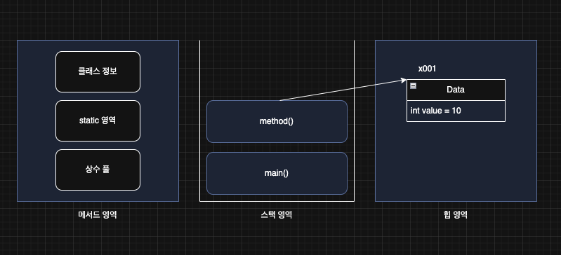
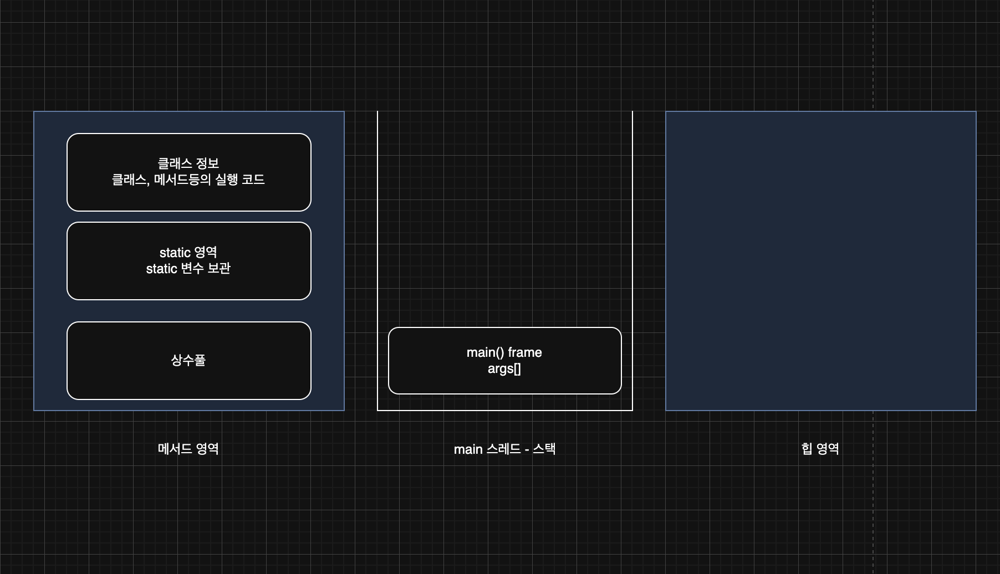
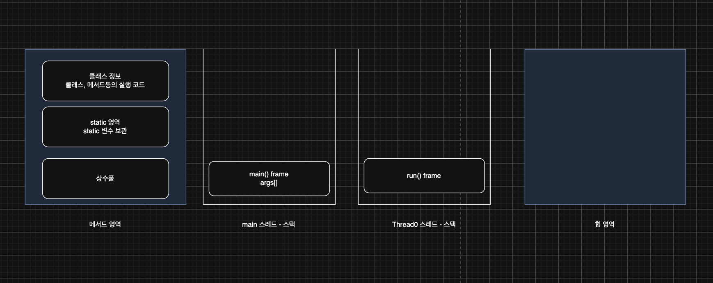
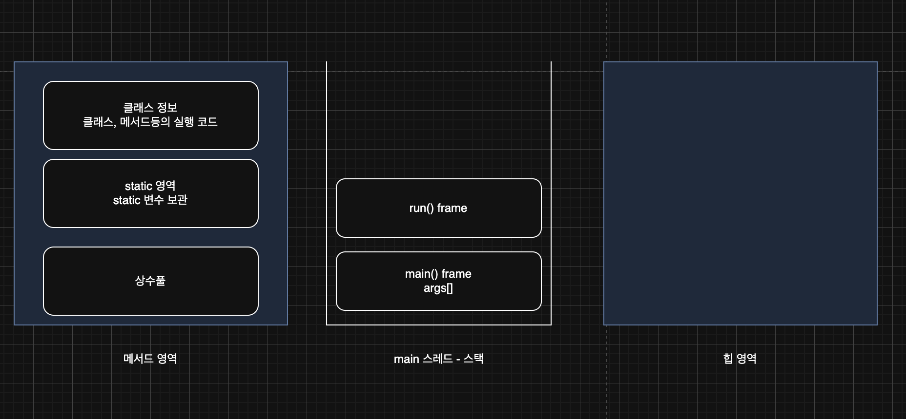
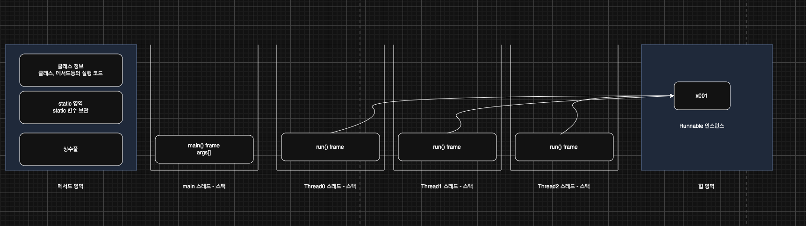

> 해당 블로그 글은 [영한님의 인프런 강의](https://inf.run/6oSgn)를 바탕으로 쓰여진 글입니다.

## 프로젝트 환경 구성

프로젝트 환경 구성은 필자가 쓴 [자바 입문편 내용](https://sungbin.kr/Hello-World/#%EA%B0%9C%EB%B0%9C-%ED%99%98%EA%B2%BD-%EC%84%A4%EC%A0%95)을 참고 바란다.

## 스레드 시작1

### 자바 메모리 구조

자바의 메모리 구조는 크게 메서드 영역, 스택 영역, 힙 영역 3개로 나눌 수 있다.

- 메서드 영역: 클래스 정보를 보관한다. 일종의 붕어빵 틀을 보관한다고 생각하면 이해하기 쉬울 것이다.
- 스택 영역: 실제 프로그램이 실행되는 영역이다. 메서드를 실행할 때 마다 하나씩 쌓인다.
- 힙 영역: 객체(인스턴스)가 생성되는 영역이다. `new` 명령어를 사용하면 이 영역을 사용한다. 붕버빵이 이 안에 담긴다고 생각하면 쉬울 것이다. 참고로 배열도 이 영역에 담긴다.

좀 더 자세히 알아보자.



- **메서드 영역**: 메서드 영역은 프로그램을 실행하는데 필요한 공통 데이터를 관리한다. 이 영역은 프로그램의 모든 영역에서 공유한다.
    - 클래스 정보: 클래스의 실행 코드(바이트 코드), 필드, 메서드와 생성자 코드등 모든 실행 코드가 존재한다.
    - static 영역: `static` 변수들을 보관한다.
    - 런타임 상수 풀: 프로그램을 실행하는데 필요한 공통 리터럴 상수를 보관한다.(Java7부터 힙 영역으로 이동)
- **스택 영역**: 자바 실행 시, 하나의 실행 스택이 생성된다. 각 스택 프레임은 지역 변수, 중간 연산 결과, 메서드 호출 정보 등을 포함한다.
    - 스택 프레임: 스택 영역에 쌓이는 네모 박스가 하나의 스택 프레임이다. 메서드를 호출할 때 마다 하나의 스택 프레임이 쌓이고, 메서드가 종료되면 해당 스택 프레임이 제거된다.
- **힙 영역**: 객체(인스턴스)와 배열이 생성되는 영역이다. 가비지 컬렉션(GC)이 이루어지는 주요 영역이며, 더 이상 참조되지 않는 객체는 GC에 의해 제거된다.

> ✅ 참고
>
> 스택 영역은 더 정확히는 각 스레드별로 하나의 실행 스택이 생성된다. 따라서 스레드 수 만큼 스택이 생성된다. 지금은 스레드를 1개만 사용하므로 스택도 하나이다. 이후 스레드를 추가할 것인데, 그러면 스택도 스레드 수 만큼 증가한다.

### 스레드 생성

스레드를 생성하려면 자바에서는 `Thread` 클래스를 상속하거나 `Runnable` 인터페이스를 구현하면 된다. 일단 상속하는 방법부터 알아보자.

``` java
package thread.start;

public class HelloThread extends Thread {

    @Override
    public void run() {
        System.out.println(Thread.currentThread().getName() + ": run()");
    }
}
```

위와 같이 `Thread` 클래스를 상속받고 `run()` 메서드를 재정의 해주면 된다.

> ✅ 참고
>
> `Thread.currentThread().getName()` 메서드는 현재 실행 중인 스레드의 이름을 반환해주는 메서드이다.

이제 사용하는 코드를 작성해보자.

``` java
package thread.start;

public class HelloThreadMain {
    public static void main(String[] args) {
        System.out.println(Thread.currentThread().getName() + ": main() start");

        HelloThread helloThread = new HelloThread();
        System.out.println(Thread.currentThread().getName() + ": start() 호출 전");

        helloThread.start();
        System.out.println(Thread.currentThread().getName() + ": start() 호출 후");

        System.out.println(Thread.currentThread().getName() + ": main() end");
    }
}
```

`HelloThread` 객체를 생성하고 `run()` 메서드가 아니라 `start()` 메서드를 호출했다. `start()` 메서드는 우리가 직접 구현한 것도 아닌데 해당 메서드를 실행하니 `run()` 메서드가 실행된 것을 볼 수 있다. `start()` 메서드는 스레드를 실행하는 아주 특별한 메서드이다. 해당 메서드를 실행하면 `run()` 메서드가 실행된다.

> ⚠️ 주의
>
> `run()` 메서드가 아니라 반드시 `start()` 메서드를 호출해야 한다. 그래야 별도의 스레드에서 `run()`가 실행된다.

그러면 그림을 통해서 살펴보자.



스레드 생성 전에는 위와 같이 `main()` 메서드는 `main`이라는 이름의 스레드가 실행하는 것을 확인할 수 있다. 프로세스가 작동하려면 스레드가 최소한 하나는 있어야 한다. 그래야 코드를 실행할 수 있다. 자바는 실행 시점에 `main`이라는 이름의 스레드를 만들고 프로그램의 시작점인 `main()` 메서드를 실행한다.



`HelloThread` 스레드 객체를 생성한 다음에 `start()` 메서드를 호출하면 자바는 스레드를 위한 별도의 스택 공간을 할당한다. 스레드 객체를 생성하고, 반드시 `start()`를 호출해야 스택 공간을 할당 받고 스레드가 작동한다. 그러면 `Thread-0` 스레드가 생성이 되고 별도의 스택공간을 할당받고 `run()` 메서드 스택 프레임이 스택 영역에 쌓인다.

> ✅ 참고
>
> 스레드에 이름을 주지 않으면 자바는 스레드에 `Thread-0`, `Thread-1`과 같은 임의의 이름을 부여한다.

즉, `start()`를 호출하는 것은 `main` 스레드가 호출을 하는 것이고 `run()` 메서드를 호출하는 것은 `Thread-0`가 호출을 하는 것이다. 약간 비유적을 표현하면 하나의 가정에 어머니가 일을 하고 계시는데 일이 너무 많아서 나에게 집안일을 시키는 것이다. 여기서 어머니가 `main` 스레드이고 내가 `Thread-0`라고 생각하면 이해하기 쉬울 것이다.

그리고 멀티 스레드 환경에서는 스레드 간 실행순서를 보장하지 않는다. 즉, `start()`를 호출한 `main` 스레드가 대기를 하는것이 아니고 바로 일을 한다. 어머니가 나에게 일을 시키고 내가 일을 하는 동안 휴식을 취하는 것이 아니고 계속 집안일을 하시는 것처럼 말이다.

스레드 간의 실행 순서는 얼마든지 달라질 수 있다. CPU 코어가 2개여서 물리적으로 정말 동시에 실행될 수도 있고, 하나의 CPU 코어에 시간을 나누어 실행될 수도 있다. 그리고 한 스레드가 얼마나 오랜기간 실행되는지도 보장하지 않는다. 한 스레드가 먼저 다 수행된 다음에 다른 스레드가 수행될 수도 있고, 둘이 완전히 번갈아 가면서 수행되는 경우도 있다.

## 스레드 시작2

### start() vs run()

스레드의 `start()` 대신에 재정의한 `run()` 메서드를 직접 호출하면 어떻게 될까?

``` java
package thread.start;

public class BadThreadMain {
    public static void main(String[] args) {
        System.out.println(Thread.currentThread().getName() + ": main() start");

        HelloThread helloThread = new HelloThread();
        System.out.println(Thread.currentThread().getName() + ": run() 호출 전");

        helloThread.run();
        System.out.println(Thread.currentThread().getName() + ": run() 호출 후");

        System.out.println(Thread.currentThread().getName() + ": main() end");
    }
}
```

결과를 보면 알겠지만 `run()` 메서드를 직접 호출하면 새로운 스레드를 생성하지 않고 `main` 스레드가 호출을 한다. 즉, 아래와 같은 메모리 그림이 될 것이다.



스레드의 `start()` 메서드는 스레드에 스택 공간을 할당하면서 스레드를 시작하는 아주 특별한 메서드이다. 그리고 해당 스레드에서 `run()` 메서드를 실행한다. 따라서 `main` 스레드가 아닌 별도의 스레드에서 재정의한 `run()` 메서드를 실행하려면, 반드시 `start()` 메서드를 호출해야 한다.

## 데몬 스레드

스레드는 사용자(user) 스레드와 데몬(daemon) 스레드 2가지 종류로 구분할 수 있다.

- 사용자 스레드
    - 프로그램의 주요 작업을 수행한다.
    - 업이 완료될 때까지 실행된다.
    - 모든 사용자 스레드가 종료되면 JVM도 종료된다.
- 데몬 스레드
    - 백그라운드에서 보조적인 작업을 수행한다.
    - 모든 사용자 스레드가 종료되면 데몬 스레드가 실행중이더라도 종료된다.

``` java
package thread.start;

public class DaemonThreadMain {
    public static void main(String[] args) {
        System.out.println(Thread.currentThread().getName() + ": main() start");

        DaemonThread daemonThread = new DaemonThread();
        daemonThread.setDaemon(true);
        daemonThread.start();

        System.out.println(Thread.currentThread().getName() + ": main() end");
    }

    static class DaemonThread extends Thread {

        @Override
        public void run() {
            System.out.println(Thread.currentThread().getName() + ": run() start");

            try {
              Thread.sleep(10000);
            } catch (InterruptedException e) {
                throw new RuntimeException(e);
            }

            System.out.println(Thread.currentThread().getName() + ": run() end");
        }
    }
}
```

- `setDaemon(true)`: 데몬 스레드로 설정한다.
- 데몬 스레드 여부는 `start()` 메서드 전에 이뤄져야 한다.
- 기본 값은 `false`이고 `false`이면 사용자 스레드이다.

> ✅ 참고
>
> `run()` 메서드 안에서 `Thread.sleep()`를 호출할 때 체크 예외인 `InterruptedException`을 밖으로 던질 수 없고 반드시 잡아야 한다. `run()` 메서드는 체크 예외를 밖으로 던질 수 없다.

## 스레드 생성 - Runnable

스레드를 만들 때는 `Thread` 클래스를 상속 받는 방법과 `Runnable` 인터페이스를 구현하는 방법이 있다. 이번에는 `Runnable` 인터페이스를 구현하는 방식으로 스레드를 생성해보자.

``` java
package thread.start;

public class HelloRunnable implements Runnable {

    @Override
    public void run() {
        System.out.println(Thread.currentThread().getName() + ": run()");
    }
}
```

``` java
package thread.start;

public class HelloRunnableMain {
    public static void main(String[] args) {
        System.out.println(Thread.currentThread().getName() + ": main() start");

        HelloRunnable runnable = new HelloRunnable();
        Thread thread = new Thread(runnable);
        thread.start();

        System.out.println(Thread.currentThread().getName() + ": main() end");
    }
}
```

### Thread 상속 vs Runnable 구현

**스레드 사용할 때는 `Thread`를 상속 받는 방법보다 `Runnable` 인터페이스를 구현하는 방식을 사용하자.**

- Thread 상속
    - 장점
        - 간단한 구현: `Thread` 클래스를 상속받아 `run()` 메서드만 재정의하면 된다.
    - 단점
        - 상속의 제한: 자바는 단일 상속만을 허용하므로 이미 다른 클래스를 상속받고 있는 경우 `Thread` 클래스를 상속 받을 수 없다.
        - 유연성 부족: 인터페이스를 사용하는 방법에 비해 유연성이 떨어진다.
- Runnable 구현
    - 장점
        - 상속의 자유로움: `Runnable` 인터페이스 방식은 다른 클래스를 상속받아도 문제없이 구현할 수 있다.
        - 코드의 분리: 스레드와 실행할 작업을 분리하여 코드의 가독성을 높일 수 있다.
        - 여러 스레드가 동일한 `Runnable` 객체를 공유할 수 있어 자원 관리를 효율적으로 할 수 있다.
    - 단점
        - 코드가 약간 복잡해질 수 있다. `Runnable` 객체를 생성하고 이를 `Thread`에 전달하는 과정이 추가된다.

결론적으로 `Runnable` 인터페이스를 구현하자! 실무에서도 이런 방법으로 사용된다.

## 로거 만들기

현재 어떤 스레드가 코드를 실행하는지 출력하기 위해 다음과 같이 긴 코드를 작성하는 것은 너무 번거롭다.

``` java
System.out.println(Thread.currentThread().getName() + ": run()");
```

실제 실무같은 스프링 프레임워크 환경은 `Logger`라는 기능을 기본적으로 제공해줘서 조금 깔끔하게 로그 출력을 해준다. 혹은 lombok의 `@Slf4j`를 사용하면 더욱 깔끔하게 나오기도 한다. 하지만 지금은 이런 라이브러리를 사용하지 말고 직접 유틸을 구현해보자.

``` java
package util;

import java.time.LocalTime;
import java.time.format.DateTimeFormatter;

public abstract class MyLogger {

    private static final DateTimeFormatter formatter = DateTimeFormatter.ofPattern("HH:mm:ss.SSS");

    public static void log(Object obj) {
        String time = LocalTime.now().format(formatter);
        System.out.printf("%s [%9s] %s\n", time, Thread.currentThread().getName(), obj);
    }
}
```

이제 해당 유틸을 사용해서 해볼려고 한다.

## 여러 스레드 만들기

여러 스레드를 만드는 것을 확인해보자.

``` java
package thread.start;

import static util.MyLogger.log;

public class ManyThreadMainV1 {
    public static void main(String[] args) {
        log("main() start");

        HelloRunnable runnable = new HelloRunnable();

        Thread thread1 = new Thread(runnable);
        thread1.start();

        Thread thread2 = new Thread(runnable);
        thread2.start();

        Thread thread3 = new Thread(runnable);
        thread3.start();

        log("main() end");
    }
}
```

정말 간단하다. 또한 더 많은 스레드를 만들려면 반복문을 통해서도 만들 수 있을 것이다. 메모리 구조는 아래와 같다.



## Runnable을 만드는 다양한 방법

중첩 클래스를 이용하면 다양하게 `Runnable`을 이용할 수 있다.

### 정적 중첩 클래스

``` java
package thread.start;

import static util.MyLogger.log;

public class InnerRunnableMainV1 {
    public static void main(String[] args) {
        log("main() start");

        Runnable runnable = new MyRunnable();
        Thread thread = new Thread(runnable);
        thread.start();

        log("main() end");
    }

    static class MyRunnable implements Runnable {
        @Override
        public void run() {
            log("run()");
        }
    }
}
```

별도의 클래스를 만든 것이 아니라 해당 `Runnable`은 이 클래스에서만 쓰이기 때문에 정적 중첩 클래스로 만들어 보았다.

### 익명 클래스

``` java
package thread.start;

import static util.MyLogger.log;

public class InnerRunnableMainV2 {
    public static void main(String[] args) {
        log("main() start");

        Runnable runnable = new Runnable() {
            @Override
            public void run() {
                log("run()");
            }
        };

        Thread thread = new Thread(runnable);
        thread.start();

        log("main() end");
    }
}
```

위와 같이 익명 클래스로 변경도 가능하다.

### 익명 클래스 변수 없이 직접 전달

``` java
package thread.start;

import static util.MyLogger.log;

public class InnerRunnableMainV3 {
    public static void main(String[] args) {
        log("main() start");

        Thread thread = new Thread(new Runnable() {
            @Override
            public void run() {
                log("run()");
            }
        });

        thread.start();

        log("main() end");
    }
}
```

지금은 굳이 변수를 만들어서 Thread 생성자 인자로 전달 할 필요가 없기 때문에 변수 없이 직접 넣어줬다.

### 람다

``` java
package thread.start;

import static util.MyLogger.log;

public class InnerRunnableMainV4 {
    public static void main(String[] args) {
        log("main() start");

        Thread thread = new Thread(() -> log("run()"));
        thread.start();

        log("main() end");
    }
}
```

위와 같이 익명 클래스를 람다로 변경이 가능하다. 람다에 대해서는 추후 포스팅을 통해 다뤄보겠다.

> 잘못된 지식이 있을 경우 댓글로 남겨주시면 빠르게 반영하겠습니다!