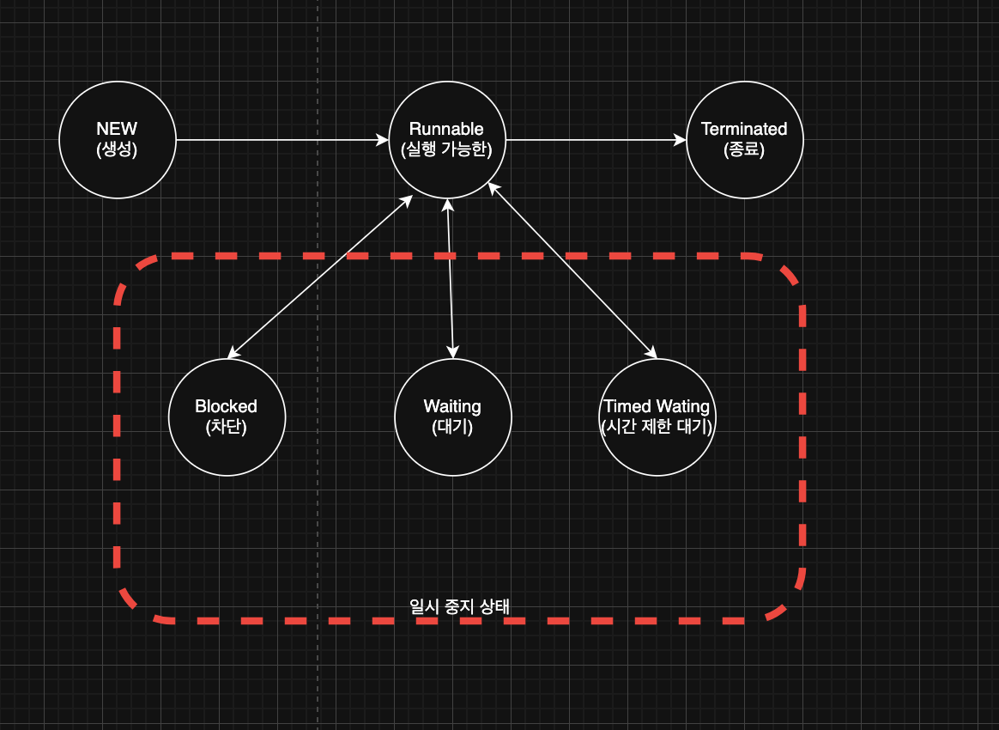
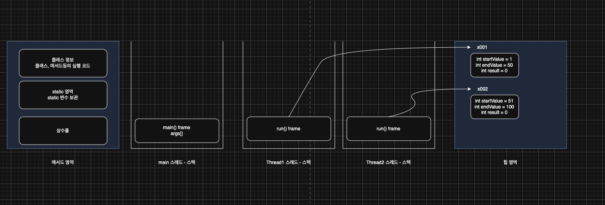
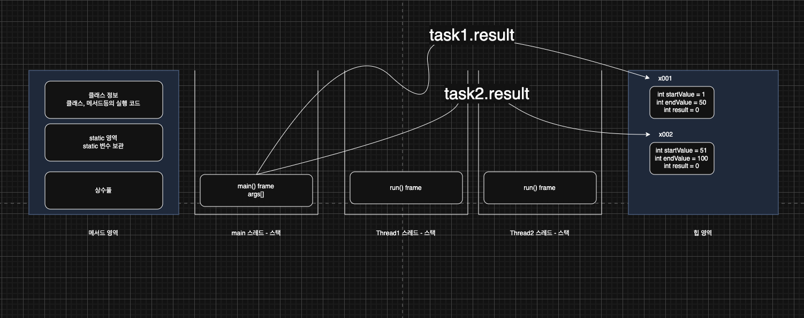
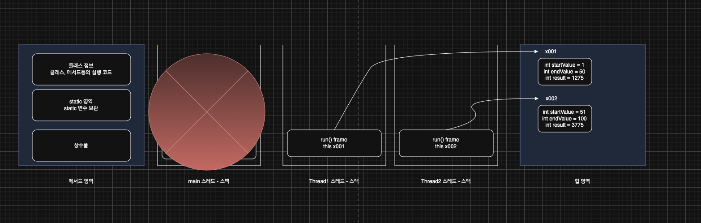

> 해당 블로그 글은 [영한님의 인프런 강의](https://inf.run/6oSgn)를 바탕으로 쓰여진 글입니다.

## 스레드 기본 정보

`Thread` 클래스는 스레드를 생성하고 관리하는 기능을 제공한다. `Thread` 클래스가 제공하는 정보들을 확인해보자.

### 스레드 생성

스레드를 생성할 때는 실행할 `Runnable` 인터페이스의 구현체와, 스레드의 이름을 전달할 수 있다.

``` java
Thread myThread = new Thread(new HelloRunnable(), "myThread");
```

- Runnable 인터페이스: 실행할 작업을 포함하는 인터페이스이다.
- 스레드 이름: `Thread` 클래스 생성자 두번째 파라미터로 문자열로 스레드 이름을 지정할 수 있다. 이 이름은 디버깅이나 로깅 목적으로 유용하다. 참고로 이름을 생략하면 `Thread-0`, `Thread-1`과 같은 임의의 이름이 생성된다.

### 스레드 객체 정보

``` java
log("myThread = " + myThread);
```

- `myThread` 객체를 문자열로 변환하여 출력한다. `Thread` 클래스의 `toString()` 메서드는 스레드 ID, 스레드 이름, 우선순위, 스레드 그룹을 포함하는 문자열을 반환한다.

### 스레드 ID

``` java
log("myThread.threadId() = " + myThread.threadId());
```

- threadId(): 레드의 고유 식별자를 반환하는 메서드이다. 이 ID는 JVM 내에서 각 스레드에 대해 유일하다. ID는 스레드가 생성될 때 할당되며, 직접 지정할 수 없다.

### 스레드 이름

``` java
log("myThread.getName() = " + myThread.getName());
```

- getName(): 스레드의 이름을 반환하는 메서드이다. 스레드 ID는 중복이 안되지만 스레드 이름은 중복이 가능하다.

### 스레드 우선순위

``` java
log("myThread.getPriority() = " + myThread.getPriority());
```

- getPriority(): 스레드의 우선순위를 반환하는 메서드이다. 우선순위는 1(가장 낮음)에서 10(가장 높음)까지의 값으로 설정할 수 있으며, 기본값은 5이다. `setPriority()` 메서드를 사용해서 우선순위를 변경할 수 있다.
- 우선순위는 스레드 스케줄러가 어떤 스레드를 우선 실행할지 결정하는 데 사용된다. 하지만 실제 실행 순서는 JVM 구현과 운영체제에 따라 달라질 수 있다.

### 스레드 그룹

``` java
log("myThread.getThreadGroup() = " + myThread.getThreadGroup());
```

- getThreadGroup(): 스레드가 속한 스레드 그룹을 반환하는 메서드이다. 스레드 그룹은 스레드를 그룹화하여 관리할 수 있는 기능을 제공한다. 기본적으로 모든 스레드는 부모 스레드와 동일한 스레드 그룹에 속하게 된다.
- 스레드 그룹은 여러 스레드를 하나의 그룹으로 묶어서 특정 작업(예: 일괄 종료, 우선순위 설정 등)을 수행할 수 있다.
- `main` 스레드는 기본으로 제공되는 `main` 스레드 그룹에 소속되어 있다. 따라서 자식 스레드도 부모 스레드인 `main` 스레드의 그룹인 `main` 스레드 그룹에 소속된다.

> 📚 용어 정리
>
> 부모 스레드란, 스레드 그룹은 여러 스레드를 하나의 그룹으로 묶어서 특정 작업(예: 일괄 종료, 우선순위 설정 등)을 수행할 수 있다. 기본적으로 `main` 스레드가 새로운 스레드를 생성하기 때문에 최상위 부모는 `main` 스레드이다.

> ✅ 참고
>
> 스레드 그룹 기능은 직접적으로 잘 사용하지는 않기 때문에, 이런 것이 있구나 정도만 알고 넘어가자!

### 스레드 상태

``` java
log("myThread.getState() = " + myThread.getState());
```

- getState(): 스레드의 현재 상태를 반환하는 메서드이다. 반환되는 값은 `Thread.State` 열거형에 정의된 상수 중 하나이다.
    - **NEW**: 스레드가 아직 시작되지 않은 상태이다.
    - **RUNNABLE**: 스레드가 실행 중이거나 실행될 준비가 된 상태이다.
    - **BLOCKED**: 스레드가 동기화 락을 기다리는 상태이다.
    - **WAITING**: 스레드가 다른 스레드의 특정 작업이 완료되기를 기다리는 상태이다.
    - **TIMED_WAITING**: 일정 시간 동안 기다리는 상태이다.
    - **TERMINATED**: 스레드가 실행을 마친 상태이다.

## 스레드의 생명 주기 - 설명



- New(새로운 상태)
    - 스레드가 생성되고 아직 시작되지 않은 상태이다.
    - 이 상태에서는 `Thread` 객체가 생성되지만, `start()` 메서드가 호출되지 않은 상태이다.
- Runnable(실행 가능한 상태)
    - 스레드가 실행될 준비가 된 상태이다. 이 상태에서 스레드는 실제로 CPU에서 실행될 수 있다.
    - `start()` 메서드가 호출되면 스레드는 이 상태로 들어간다.
    - 이 상태는 스레드가 실행될 준비가 되어 있음을 나타내며, 실제로 CPU에서 실행될 수 있는 상태이다. 그러나 Runnable 상태에 있는 모든 스레드가 동시에 실행되는 것은 아니다. 운영체제의 스케줄러가 각 스레드에 CPU 시간을 할당하여 실행하기 때문에, Runnable 상태에 있는 스레드는 스케줄러의 실행 대기열에 포함되어 있다가 차례로 CPU에서 실행된다.

> ✅ 참고
>
> 운영체제 스케줄러의 실행 대기열에 있든, CPU에서 실제 실행되고 있든 모두 `RUNNABLE` 상태이다. 자바에서 둘을 구분해서 확인할 수는 없다.

- Blocked(차단 상태)
    - 스레드가 다른 스레드에 의해 동기화 락을 얻기 위해 기다리는 상태이다.
    - 예를 들어, `synchronized` 블록에 진입하기 위해 락을 얻어야 하는 경우 이 상태에 들어간다.
- Waiting(대기 상태)
    - 스레드가 다른 스레드의 특정 작업이 완료되기를 무기한 기다리는 상태이다.
    - `wait()`, `join()` 메서드가 호출될 때 이 상태가 된다.
    - 스레드는 다른 스레드가 `notify()` 또는 `notifyAll()` 메서드를 호출하거나, `join()`이 완료될 때까지 기다린다.
- Timed Waiting(시간 제한 대기 상태)
    - 스레드가 특정 시간 동안 다른 스레드의 작업이 완료되기를 기다리는 상태이다.
    - `sleep(long millis)`, `wait(long timeout)`, `join(long millis)` 메서드가 호출될 때 이 상태가 된다.
    - 주어진 시간이 경과하거나 다른 스레드가 해당 스레드를 깨우면 이 상태에서 벗어난다.
- Terminated(종료 상태)
    - 스레드의 실행이 완료된 상태이다.
    - 스레드가 정상적으로 종료되거나, 예외가 발생하여 종료된 경우 이 상태로 들어간다.
    - 스레드는 한 번 종료되면 다시 시작할 수 없다.

> ✅ 참고
>
> 자바에서 스레드의 **일시 중지 상태들(Suspended States)**이라는 상태는 없다. 스레드가 기다리는 상태들을 묶어서 쉽게 설명하기 위해 사용한 용어이다.

## 스레드의 생명 주기 - 코드

이제 이런 생명주기를 코드로 살펴보자.

``` java
package thread.control;

import static util.MyLogger.log;

public class ThreadStateMain {
    public static void main(String[] args) throws InterruptedException {
        Thread thread = new Thread(new MyRunnable(), "myThread");
        log("myThread.state1 = " + thread.getState());
        log("myThread.start()");
        thread.start();

        Thread.sleep(1000);
        log("myThread.state3 = " + thread.getState());

        Thread.sleep(4000);
        log("myThread.state5 = " + thread.getState());
        log("end");
    }

    static class MyRunnable implements Runnable {
        @Override
        public void run() {
            try {
                log("start");
                log("myThread.state2 = " + Thread.currentThread().getState());
                log("sleep start()");

                Thread.sleep(3000);

                log("sleep end()");
                log("myThread.state4 = " + Thread.currentThread().getState());
                log("end");
            } catch (InterruptedException e) {
                throw new RuntimeException(e);
            }
        }
    }
}
```

- `Thread.currentThread()` 를 호출하면 해당 코드를 실행하는 스레드 객체를 조회할 수 있다.
- `Thread.sleep()` : 해당 코드를 호출한 스레드는 `TIMED_WAITING` 상태가 되면서 특정 시간 만큼 대기한다. 시간은 밀리초(ms) 단위이다.
- `Thread.sleep()` 은 `InterruptedException` 이라는 체크 예외를 던진다. 따라서 체크 예외를 잡아서 처리하거나 던져야 한다.
    - `run()` 메서드에서는 체크 예외를 밖으로 던질 수 없다. 그래서 강제적으로 `try-catch`를 통하여 예외를 잡아줘야 한다.

## 체크 예외 재정의

`Runnable` 인터페이스의 `run()` 메서드를 구현할 때 `InterruptedException` 체크 예외를 밖으로 던질 수 없는 이유를 알아보자.

``` java
public interface Runnable {
    void run();
}
```

- 체크 예외
    - 부모 메서드가 체크 예외를 던지지 않는 경우, 재정의된 자식 메서드도 체크 예외를 던질 수 없다.
    - 자식 메서드는 부모 메서드가 던질 수 있는 체크 예외의 하위 타입만 던질 수 있다.
- 런타임 예외
    - 예외 처리를 강제하지 않으므로 상관없이 던질 수 있다.

즉, `run()` 메서드는 아무런 예외를 던지고 있지 않는다. 그런데 이것을 구현한 클래스에서 예외를 던지면 자바 문법 상 규칙에 어긋나기 때문에 던지지 못하는 것이다.

자바는 왜 이런 제약을 두는 것일까? 부모 클래스의 메서드를 호출하는 클라이언트 코드는 부모 메서드가 던지는 특정 예외만을 처리하도록 작성된다. 자식 클래스가 더 넓은 범위의 예외를 던지면 해당 코드는 모든 예외를 제대로 처리하지 못할 수 있다. 이는 예외 처리의 일관성을 해치고, 예상하지 못한 런타임 오류를 초래할 수 있다.

예를 들어 부모 클래스에 `InterruptedException`을 던지는 메서드가 존재한다고 보자. 그런데 자식 클래스에서 해당 메서드를 재정의하여 사용할 때 `Exception`을 던진다고 해보자. 그리고 자식 클래스를 사용할때 문제가 발생한다. `main()` 메서드에서 `try-catch`로 메서드를 호출할 때 예외를 잡으려고 `InterruptException`을 잡았다고 해보자. `부모 클래스 부모 = new 자식클래스();`로 작성하면 컴파일 타임을 체크하여 IDE가 자동으로 잡아주는데 재정의된 메서드를 호출하는데 거기서 `Exception`이 발생하면 예외를 못잡는 것이다. 즉, `부모 클래스 부모`는 `InterruptedException` 를 반환하는데, 그 자식이 전혀 다른 예외를 반환한다면 클라이언트는 해당 예외를 잡을 수 없다. 이것은 확실하게 모든 예외를 체크하는 체크 예외의 규약에 맞지 않는다.

### 체크 예외 재정의 규칙

- 자식 클래스에 재정의된 메서드는 부모 메서드가 던질 수 있는 체크 예외의 하위 타입만을 던질 수 있다.
- 원래 메서드가 체크 예외를 던지지 않는 경우, 재정의된 메서드도 체크 예외를 던질 수 없다.

### 안전한 예외 처리

체크 예외를 `run()` 메서드에서 던질 수 없도록 강제함으로써, 개발자는 반드시 체크 예외를 try-catch 블록 내에서 처리하게 된다. 이는 예외 발생 시 예외가 적절히 처리되지 않아서 프로그램이 비정상 종료되는 상황을 방지할 수 있다. 특히 멀티스레딩 환경에서는 예외 처리를 강제함으로써 스레드의 안정성과 일관성을 유지할 수 있다. 하지만 이전에 자바 예외 처리 강의에서 설명했듯이, 체크 예외를 강제하는 이런 부분들은 자바 초창기 기조이고, 최근에는 체크 예외보다는 언체크(런타임) 예외를 선호한다. 그래서 이런 점을 생각해 자바에서도 나중에는 `Callalbe`라는 인터페이스를 제공해준다. 거기서는 추상 메서드가 `Exception` 예외를 던진다.

## join - 시작

앞서 `Thread.sleep()` 메서드를 통해 `TIMED_WAITING` 상태를 알아보았다. 이번에는 `join()` 메서드를 통해 `WAITING` (대기 상태)가 무엇이고 왜 필요한지 알아보자.

``` java
package thread.control.join;

import static util.MyLogger.log;
import static util.ThreadUtils.sleep;

public class JoinMainV0 {
    public static void main(String[] args) {
        log("Start");

        Thread thread1 = new Thread(new Job(), "thread-1");
        Thread thread2 = new Thread(new Job(), "thread-2");

        thread1.start();
        thread2.start();

        log("End");
    }

    static class Job implements Runnable {

        @Override
        public void run() {
            log("작업 시작");
            sleep(2000);
            log("작업 완료");
        }
    }
}
```

위와 같은 코드가 있다고 하자. 그러면 로직을 보면 알겠지만 `main` 스레드가 먼저 종료가 될 것이고 나머지 스레드들이 실행이 될 것이다. 왜냐하면 바로 `Thread.sleep()`을 2초간 진행하기 때문이다. 하지만 만약 생성된 스레드의 작업을 처리해서 나온 반환값을 받아서 `main` 스레드에서 처리하고 싶다면 어떻게 할까?

## join - 필요한 상황

만약 1부터 100까지 더하는 프로그램이 있다고 해보자. 그런데 너무 느린것 같아서 스레드를 2개로 만들어서 사용하려고 한다. 마침 코어도 2개여서 이렇게 개발하면 기존보다 2배 더 빠른 성능을 낼 수 있을 것 같다. 한번 개발해보자.

``` java
package thread.control.join;

import static util.MyLogger.log;
import static util.ThreadUtils.sleep;

public class JoinMainV1 {
    public static void main(String[] args) {
        log("Start");

        SumTask task1 = new SumTask(1, 50);
        SumTask task2 = new SumTask(51, 100);

        Thread thread1 = new Thread(task1, "thread-1");
        Thread thread2 = new Thread(task2, "thread-2");

        thread1.start();
        thread2.start();

        log("task1.result = " + task1.result);
        log("task2.result = " + task2.result);

        int sumAll = task1.result + task2.result;

        log("task1 + task2 = " + sumAll);
        log("End");
    }

    static class SumTask implements Runnable {

        int startValue;

        int endValue;

        int result;

        public SumTask(int startValue, int endValue) {
            this.startValue = startValue;
            this.endValue = endValue;
        }

        @Override
        public void run() {
            log("작업 시작");
            sleep(2000);

            int sum = 0;

            for (int i = startValue; i <= endValue; i++) {
                sum += i;
            }

            result = sum;

            log("작업 완료 result = " + result);
        }
    }
}
```

스레드 2개를 생성해서 하나는 1부터 50까지 하나는 51부터 100까지 더하는 연산을 시켰다. 하지만 결과를 확인해보면 예상과 다르게 0이 나온다. 왜 그럴까? 간략히 이야기 하면 `main` 스레드가 스레드 2개를 생성하고 기다리는게 아니고 바로 자기 연산을 실행한다. 그리고 바로 해당 객체의 인스턴스 변수를 참조해서 더한다. 하지만 해당 인스턴스 변수들은 아직 연산전이기에 초기값 0이 나오는 것이고 결과가 0이 나오는 사태가 발생하는 것이다. 그럼 이 과정을 그림을 통해 살펴보자.



- 프로그램이 처음 시작되면 `main` 스레드는 `thread-1`, `thread-2` 를 생성하고 `start()`로 실행한다.
- `thread-1`, `thread-2` 는 각각 자신에게 전달된 `SumTask` 인스턴스의 `run()` 메서드를 스택에 올리고 실행한다.
    - `thread-1`은 `x001` 인스턴스의 `run()` 메서드를 실행한다.
    - `thread-2`는 `x002` 인스턴스의 `run()` 메서드를 실행한다.



- `main` 스레드는 두 스레드를 시작한 다음에 바로 `task1.result`, `task2.result` 를 통해 인스턴스에 있는 결과 값을 조회한다. 참고로 `main` 스레드가 실행한 `start()` 메서드는 스레드의 실행이 끝날 때 까지 기다리지 않는다! 다른 스레드를 실행만 해두고, 자신의 다음 코드를 실행할 뿐이다!
- `thread-1`, `thread-2`가 계산을 완료해서, `result` 에 연산 결과를 담을 때 까지는 약 2초 정도의 시간이 걸린다. `main` 스레드는 계산이 끝나기 전에 `result`의 결과를 조회한 것이다. 따라서 `0`값이 출력된다.



- 2초가 지난 이후에 `thread-1`, `thread-2`는 계산을 완료한다.
- 이때 `main` 스레드는 이미 자신의 코드를 모두 실행하고 종료된 상태이다.
- 그 후에 각 스레드의 계산 값이 계산된다.

여기서 문제의 핵심은 `main` 스레드가 `thread-1`, `thread-2`의 계산이 끝날 때 까지 기다려야 한다는 점이다. 그럼 어떻게 해야 `main` 스레드가 기다릴 수 있을까?

> ✅ 참고: this의 비밀
>
> 어떤 메서드를 호출하는 것은, 정확히는 특정 스레드가 어떤 메서드를 호출하는 것이다. 스레드는 메서드의 호출을 관리하기 위해 메서드 단위로 스택 프레임을 만들고 해당 스택 프레임을 스택위에 쌓아 올린다. 이때 인스턴스의 메서드를 호출하면, 어떤 인스턴스의 메서드를 호출했는지 기억하기 위해, 해당 인스턴스의 참조값을 스택 프레임 내부에 저장해둔다. 이것이 바로 우리가 자주 사용하던 `this`이다. 특정 메서드 안에서 `this`를 호출하면 바로 스택프레임 안에 있는 `this` 값을 불러서 사용하게 된다. 그림을 보면 스택 프레임 안에 있는 `this`를 확인할 수 있다. 이렇게 `this`가 있기 때문에 `thread-1`, `thread-2`는 자신의 인스턴스를 구분해서 사용할 수 있다.

## join - sleep 사용

특정 스레드를 기다리게 하는 가장 간단한 방법은 `sleep()`을 사용하는 것이다.

``` java
package thread.control.join;

import static util.MyLogger.log;
import static util.ThreadUtils.sleep;

public class JoinMainV2 {
    public static void main(String[] args) {
        log("Start");

        SumTask task1 = new SumTask(1, 50);
        SumTask task2 = new SumTask(51, 100);

        Thread thread1 = new Thread(task1, "thread-1");
        Thread thread2 = new Thread(task2, "thread-2");

        thread1.start();
        thread2.start();

        log("main 스레드 sleep()");
        sleep(3000);
        log("main 스레드 깨어남");

        log("task1.result = " + task1.result);
        log("task2.result = " + task2.result);

        int sumAll = task1.result + task2.result;

        log("task1 + task2 = " + sumAll);
        log("End");
    }

    static class SumTask implements Runnable {

        int startValue;

        int endValue;

        int result;

        public SumTask(int startValue, int endValue) {
            this.startValue = startValue;
            this.endValue = endValue;
        }

        @Override
        public void run() {
            log("작업 시작");
            sleep(2000);

            int sum = 0;

            for (int i = startValue; i <= endValue; i++) {
                sum += i;
            }

            result = sum;

            log("작업 완료 result = " + result);
        }
    }
}
```

이렇게 하니 결과가 잘 나오는 것을 볼 수 있다. 하지만 이렇게 `sleep()`을 사용해서 무작정 기다리는 방법은 대기 시간에 손해도 보고, 또 `thread-1`,`thread-2` 의 수행시간이 달라지는 경우에는 정확한 타이밍을 맞추기 어렵다. 그러면 어떻게 해결할 수 있을까?

## join - join 사용

위와 같은 문제를 해결할 수 있는 방법으로 `join()` 메서드를 사용하는 방법이 있다. 한번 살펴보자.

``` java
package thread.control.join;

import static util.MyLogger.log;
import static util.ThreadUtils.sleep;

public class JoinMainV3 {
    public static void main(String[] args) throws InterruptedException {
        log("Start");

        SumTask task1 = new SumTask(1, 50);
        SumTask task2 = new SumTask(51, 100);

        Thread thread1 = new Thread(task1, "thread-1");
        Thread thread2 = new Thread(task2, "thread-2");

        thread1.start();
        thread2.start();

        log("join() - main 스레드가 thread1, thread2 종료까지 대기");
        thread1.join();
        thread2.join();
        log("main 스레드 대기 완료");

        log("task1.result = " + task1.result);
        log("task2.result = " + task2.result);

        int sumAll = task1.result + task2.result;

        log("task1 + task2 = " + sumAll);
        log("End");
    }

    static class SumTask implements Runnable {

        int startValue;

        int endValue;

        int result;

        public SumTask(int startValue, int endValue) {
            this.startValue = startValue;
            this.endValue = endValue;
        }

        @Override
        public void run() {
            log("작업 시작");
            sleep(2000);

            int sum = 0;

            for (int i = startValue; i <= endValue; i++) {
                sum += i;
            }

            result = sum;

            log("작업 완료 result = " + result);
        }
    }
}
```

`join()` 메서드를 만나면 `main` 스레드는 대상 스레드의 상태가 종료가 될 때까지 `WAITING` 상태에 빠진다. 그래서 이렇게 작성하면 정확하게 1부터 100까지의 계산을 실행할 수 있는 것이다. 하지만 `join()` 메서드의 단점이 존재한다. 바로 무기한 대기를 해야한다는 것이다. 만약 대상 스레드의 작업이 잘못 작성되어 무한루프에 빠진다면 `main` 스레드는 평생 놀 것이다. 이런 점을 어떻게 해결해 볼 수 있을까?

## join - 특정 시간 만큼만 대기

`join()`은 두 가지 메서드가 있다.

- `join()` : 호출 스레드는 대상 스레드가 완료될 때 까지 무한정 대기한다.
- `join(ms)` : 호출 스레드는 특정 시간 만큼만 대기한다. 호출 스레드는 지정한 시간이 지나면 다시 `RUNNABLE` 상태가 되면서 다음 코드를 수행한다.

그레서 위의 무한 대기 문제를 `join(ms)`를 사용하면 특정 시간만큼 대기상태가 된다. 정확히는 `TIMED_WAITING` 상태가 되는 것이다.

> 잘못된 지식이 있을 경우 댓글로 남겨주시면 빠르게 반영하겠습니다!