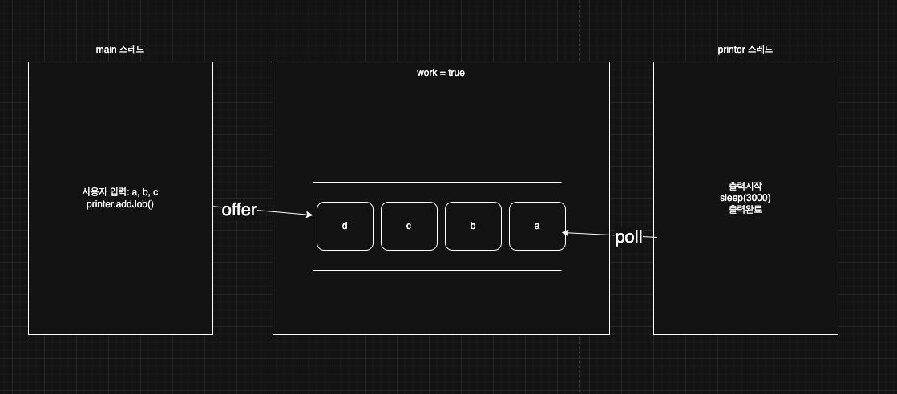
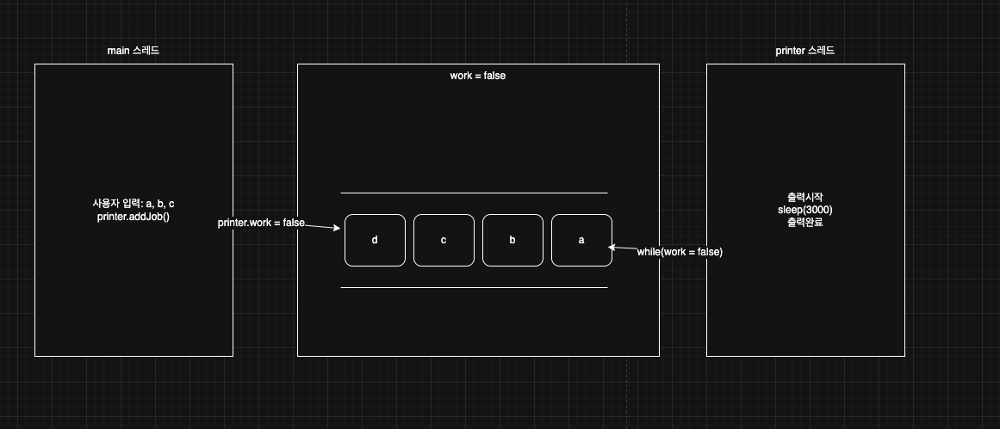

> 해당 블로그 글은 [영한님의 인프런 강의](https://inf.run/6oSgn)를 바탕으로 쓰여진 글입니다.

## 인터럽트 - 시작1

특정 스레드의 작업을 중단시키려면 어떻게 할까? 정말 간단한 방법은 공유변수를 두는 방법이 존재한다. 코드를 통해 살펴보자.

``` java
package thread.control.interrupt;

import static util.MyLogger.log;
import static util.ThreadUtils.sleep;

public class ThreadStopMainV1 {
    public static void main(String[] args) {
        MyTask task = new MyTask();
        Thread thread = new Thread(task, "work");
        thread.start();

        sleep(4000);
        log("작업 중단 지시 runFlag = false");
        task.runFlag = false;
    }

    static class MyTask implements Runnable {

        volatile boolean runFlag = true;

        @Override
        public void run() {
            while (runFlag) {
                log("작업 중");
                sleep(3000);
            }

            log("자원 정리");
            log("작업 종료");
        }
    }
}
```

위의 코드는 `runFlag`를 사용해서 `work` 스레드에 작업 중단을 지시할 수 있다. 처음에는 `runFlag`가 `true`여서 `work` 스레드가 무한루프를 돈다. 그리고 3초간 `TIMED_WAITING`이 되다가 다시 `runFlag`의 값을 확인하고 `true`이면 반복문 실행하고 이 과정을 반복할 것이다. 그리고 `main` 스레드에서 4초간 `TIMED_WAITING` 상태고 그 이후에 `runFlag`를 `false`로 변경한다. 하지만 바로 `false`로 변경했다고 `work` 스레드가 바로 반복문을 빠져나가지 않는다. 그 이유는 바로 `work` 스레드가 `TIMED_WATING` 상태이기 때문이다. 그리고 `RUNNABLE` 상태가 될 때 공유변수를 확인해서 빠져나가는 로직이다. 그러면 어떻게 하면 바로 `work` 스레드 작업을 중단시킬 수 있을까?

## 인터럽트 - 시작2

특정 스레드가 어떤 상태든 바로 깨울 수 있는 마법같은 일이 있다. 바로 인터럽트를 이용하는 것이다.

> 📚 용어 정리
>
> 인터럽트란, 특정 작업을 중단시키는 것을 의미한다. 즉, 특정 작업을 방해해서 못하게 하는 것이다. 비유적으로 표현하자면 내가 자고 있는데 초인종이 울려서 나의 잠을 방해했다. 결국 나는 일어나서 초인종을 누가 눌렀는지 확인해야 한다. 그 초인종이 인터럽트 역할을 하는 것이다.

그럼 코드를 통해 알아보자.

``` java
package thread.control.interrupt;

import static util.MyLogger.log;
import static util.ThreadUtils.sleep;

public class ThreadStopMainV2 {
    public static void main(String[] args) {
        MyTask task = new MyTask();
        Thread thread = new Thread(task, "work");
        thread.start();

        sleep(4000);
        log("작업 중단 지시 thread.interrupt()");
        thread.interrupt();
        log("work 스레드 인터럽트 상태1 = " + thread.isInterrupted());
    }

    static class MyTask implements Runnable {

        @Override
        public void run() {
            try {
                while (true) {
                    log("작업 중");
                    Thread.sleep(3000);
                }
            } catch (InterruptedException e) {
                log("work 스레드 인터럽트 상태2 = " + Thread.currentThread().isInterrupted());
                log("interrupt message = " + e.getMessage());
                log("state = " + Thread.currentThread().getState());
            }

            log("자원 정리");
            log("작업 종료");
        }
    }
}
```

위의 코드에서는 `work` 스레드가 무한 루프에 갖혀서 작업하고 3초간 `TIMED_WAITING` 상태가 되고를 반복한다. 그때 `main` 스레드가 4초가 `TIMED_WAITING` 상태가 되다가 바로 인터럽트를 호출한다. 인터럽트를 호출하면 해당 스레드는 인터럽트 상태가 되고 `Thread.sleep()`와 같이 `InterruptedException`과 같은 예외를 터트리는 코드를 만날 시, 바로 스레드 상태가 `RUNNABLE` 상태가 되면서 `catch` 블록으로 넘어가게 된다. 그리고 인터럽트 상태를 `false`로 초기화한다. 즉, 해당 스레드를 즉각적으로 `RUNNABLE`상태로 변경이 가능하게 되었다.

> ✅ 참고
>
> `interrupt()` 를 호출했다고 해서 즉각 `InterruptedException` 이 발생하는 것은 아니다. 오직 `sleep()` 처럼 `InterruptedException` 을 던지는 메서드를 호출 하거나 또는 호출 중일 때 예외가 발생한다.

인터럽트가 적용되고, 인터럽트 예외가 발생하면, 해당 스레드는 실행 가능 상태가 되고, 인터럽트 발생 상태도 정상으로 돌아온다. 인터럽트를 사용하면 대기중인 스레드를 바로 깨워서 실행 가능한 상태로 바꿀 수 있다. 덕분에 단순히 `runFlag` 를 사용하는 이전 방식보다 반응성이 좋아진 것을 확인할 수 있다.

## 인터럽트 - 시작3

위의 코드에서 조금 아쉬운 부분이 바로 존재한다. 바로 무한루프문 때문이다. 인터럽트가 발생하면 `InterruptedException`을 터트리는 코드를 만나야 해당 반복문을 벗어나는데 `while(true)`부분은 체크를 하지 않는다는 점이다. 인터럽트가 발생해도 이 부분은 항상 `true`이기 때문에 다음 코드로 넘어간다. 그리고 `sleep()`을 호출하고 나서야 인터럽트가 발생하는 것이다. 차라리 `while`문 조건에 인터럽트 상태 유무를 체크하면 좀 더 반복문을 빨리 벗어날 수 있어 보인다. 그러면 기존 코드를 고쳐보자.

``` java
package thread.control.interrupt;

import static util.MyLogger.log;
import static util.ThreadUtils.sleep;

public class ThreadStopMainV3 {
    public static void main(String[] args) {
        MyTask task = new MyTask();
        Thread thread = new Thread(task, "work");
        thread.start();

        sleep(100);
        log("작업 중단 지시 thread.interrupt()");
        thread.interrupt();
        log("work 스레드 인터럽트 상태1 = " + thread.isInterrupted());
    }

    static class MyTask implements Runnable {

        @Override
        public void run() {
            while (!Thread.currentThread().isInterrupted()) {
                log("작업 중");
            }

            log("work 스레드 인터럽트 상태2 = " + Thread.currentThread().isInterrupted());

            try {
                log("자원 정리 시도");
                Thread.sleep(1000);
                log("자원 정리 완료");
            } catch (InterruptedException e) {
                log("자원 정리 실패 - 자원 정리 중 인터럽트 발생");
                log("work 스레드 인터럽트 상태3 = " + Thread.currentThread().isInterrupted());
            }

            log("작업 종료");
        }
    }
}
```

이제 작업이 정상흐름으로 계속 나가는듯 보인다. 하지만 위의 코드에도 문제는 여전히 존재한다. 바로 인터럽트 상태가 계속 `true`라는 것이다. 현재 `work` 스레드에서 인터럽트 상태인지 유무로 반복문을 돌리다가 인터럽트를 `main`스레드가 걸면 인터럽트 상태가 되어 빠져 나온다. 하지만 문제는 위와 같이 인터럽트 상태를 `false`가 아닌 `true`이기 때문에 아래의 인터럽트 예외를 터트리는 코드를 만나면 인터럽트 예외가 발생한다는 것이다. 이것은 뭔가 잘못된 결과 같다. 만약 자원정리 하는 과정에 인터럽트 예외가 발생하는 코드를 만났다면 갑자기 자원정리가 실패가 되는 사태가 발생할 것이다. **이러한 이유로 자바에서 인터럽트 예외를 만나면 인터럽트 상태를 false로 변경하는 이유가 이와 같은 것이다.** 그러면 위의 코드에서 어떻게 하면 인터럽트 예외가 발생하지 않을까?

## 인터럽트 - 시작4

스레드의 인터럽트 상태를 단순히 확인만 하는 용도라면 `isInterrupted()`를 사용하면 된다. 하지만 직접 체크해서 사용할 때는 `Thread.interrupted()`를 사용해야 한다. `Thread.interrupted()` 메서드는 다음과 같이 동작을 한다.

- 스레드가 인터럽트 상태라면 `true`를 반환하고, 해당 스레드의 인터럽트 상태를 `false`로 변경한다.
- 스레드가 인터럽트 상태가 아니라면 `false`를 반환하고, 해당 스레드의 인터럽트 상태를 변경하지 않는다.

그럼 기존 코드를 고쳐보자.

``` java
package thread.control.interrupt;

import static util.MyLogger.log;
import static util.ThreadUtils.sleep;

public class ThreadStopMainV4 {
    public static void main(String[] args) {
        MyTask task = new MyTask();
        Thread thread = new Thread(task, "work");
        thread.start();

        sleep(100);
        log("작업 중단 지시 thread.interrupt()");
        thread.interrupt();
        log("work 스레드 인터럽트 상태1 = " + thread.isInterrupted());
    }

    static class MyTask implements Runnable {

        @Override
        public void run() {
            while (!Thread.interrupted()) {
                log("작업 중");
            }

            log("work 스레드 인터럽트 상태2 = " + Thread.currentThread().isInterrupted());

            try {
                log("자원 정리 시도");
                Thread.sleep(1000);
                log("자원 정리 완료");
            } catch (InterruptedException e) {
                log("자원 정리 실패 - 자원 정리 중 인터럽트 발생");
                log("work 스레드 인터럽트 상태3 = " + Thread.currentThread().isInterrupted());
            }

            log("작업 종료");
        }
    }
}
```

`main` 스레드가 `interrupt()`를 걸면 `work` 스레드는 인터럽트 상태가 발생한다. 그럴때 반복문에 `Thread.interrupted()`를 만나서 인터럽트 상태를 `false`로 변경하고 해당 반복문을 나간다. 이제 인터럽트 상태가 `false`이기 때문에 인터럽트 예외를 터트리는 메서드를 만나도 예외가 터지지 않는다.

> 🔥 강조
>
> 자바는 인터럽트 예외가 한 번 발생하면, 스레드의 인터럽트 상태를 다시 정상(`false`)으로 돌린다. 스레드의 인터럽트 상태를 정상으로 돌리지 않으면 이후에도 계속 인터럽트가 발생하게 된다. 인터럽트의 목적을 달성하면 인터럽트 상태를 다시 정상으로 돌려두어야 한다.

> ✅ 참고
>
> 자바 옛날 버전에는 스레드의 인터럽트를 발생하는 것 외에 스레드를 죽이는 용도로 `Thread.stop()`이라는 메서드가 있었다. 하지만 JDK1.2버전 이후에 deprecated가 되었고 쓰면 안된다. 왜냐하면 `Thread.stop()`은 언제 어디서 멈출지 예측할 수 없어 스레드가 사용하던 자원을 안전하게 정리할 기회를 주지 않기 때문이다.

## 프린터 예제1 - 시작

이제 프린터 예제를 발전시키면서 인터럽트에 대해 좀 더 자세히 알아보자.

``` java
package thread.control.printer;

import java.util.Queue;
import java.util.Scanner;
import java.util.concurrent.ConcurrentLinkedQueue;

import static util.MyLogger.log;
import static util.ThreadUtils.sleep;

public class MyPrinterV1 {
    public static void main(String[] args) {
        Printer printer = new Printer();
        Thread printerThread = new Thread(printer, "printer");
        printerThread.start();

        Scanner userInput = new Scanner(System.in);

        while (true) {
            log("프린터 할 문서를 입력하세요. 종료 (q): ");
            String input = userInput.nextLine();

            if (input.equals("q")) {
                printer.work = false;
                break;
            }

            printer.addJob(input);
        }
    }

    static class Printer implements Runnable {

        volatile boolean work = true;
        Queue<String> jobQueue = new ConcurrentLinkedQueue<>();

        @Override
        public void run() {
            while (work) {
                if (jobQueue.isEmpty()) {
                    continue;
                }

                String job = jobQueue.poll();
                log("출력 시작 : " + job + ", 대기 문서: " + jobQueue);
                sleep(3000);
                log("출력 완료: " + job);
            }

            log("프린터 종료");
        }

        public void addJob(String input) {
            jobQueue.offer(input);
        }
    }
}
```

`main` 스레드에서는 사용자 입력을 받아서 `Printer` 인스턴스의 큐에 값을 넣고 `printer` 스레드는 큐에 값이 있는지 여부를 확인 후에 값을 꺼낸다. 프린터 하는데는 3초가 걸린다고 해서 일부러 `sleep`을 사용하였다. 즉 아래의 그림처럼 되는 것이다.



위와 같이 값을 넣다가 사용자 입력 "q"를 입력하여 공유변수 값을 `false`로 변경하여 `while`문을 벗어났다. 



하지만 위의 코드는 문제가 있는 것을 알 수 있다. 종료를 하려고 "q"를 입력해도 즉각적으로 바로 종료되지 않는다.

## 프린터 예제2 - 인터럽트 도입

``` java
package thread.control.printer;

import java.util.Queue;
import java.util.Scanner;
import java.util.concurrent.ConcurrentLinkedQueue;

import static util.MyLogger.log;

public class MyPrinterV2 {
    public static void main(String[] args) throws InterruptedException {
        Printer printer = new Printer();
        Thread printerThread = new Thread(printer, "printer");
        printerThread.start();

        Scanner userInput = new Scanner(System.in);

        while (true) {
            log("프린터 할 문서를 입력하세요. 종료 (q): ");
            String input = userInput.nextLine();

            if (input.equals("q")) {
                printer.work = false;
                printerThread.interrupt();
                break;
            }

            printer.addJob(input);
        }
    }

    static class Printer implements Runnable {

        volatile boolean work = true;
        Queue<String> jobQueue = new ConcurrentLinkedQueue<>();

        @Override
        public void run() {
            while (work) {
                if (jobQueue.isEmpty()) {
                    continue;
                }

                try {
                    String job = jobQueue.poll();
                    log("출력 시작 : " + job + ", 대기 문서: " + jobQueue);
                    Thread.sleep(3000);
                    log("출력 완료: " + job);
                } catch (InterruptedException e) {
                    log("인터럽트!");
                    break;
                }
            }

            log("프린터 종료");
        }

        public void addJob(String input) {
            jobQueue.offer(input);
        }
    }
}
```

이제 인터럽트를 도입하였다. 사용자가 "q"를 입력하면 공유변수 값을 `false`로 변경해주고 인터럽트를 건다. 그러면 `printer` 스레드는 인터럽트 상태가 되고 `Thread.sleep`으로 인터럽트 예외를 터트리는 메서드를 만날때 `catch`문으로 이동하게 된다. 즉, `printer` 스레드가 `TIMED_WAITING` 상태에서 `RUNNABLE` 상태로 변하는 것이다. 또한 공유변수가 `false`이기 때문에 반복문을 벗어나고 종료가 될 수 있다.

## 프린터 예제3 - 인터럽트 코드 개선

``` java
package thread.control.printer;

import java.util.Queue;
import java.util.Scanner;
import java.util.concurrent.ConcurrentLinkedQueue;

import static util.MyLogger.log;

public class MyPrinterV3 {
    public static void main(String[] args) throws InterruptedException {
        Printer printer = new Printer();
        Thread printerThread = new Thread(printer, "printer");
        printerThread.start();

        Scanner userInput = new Scanner(System.in);

        while (true) {
            log("프린터 할 문서를 입력하세요. 종료 (q): ");
            String input = userInput.nextLine();

            if (input.equals("q")) {
                printerThread.interrupt();
                break;
            }

            printer.addJob(input);
        }
    }

    static class Printer implements Runnable {

        Queue<String> jobQueue = new ConcurrentLinkedQueue<>();

        @Override
        public void run() {
            while (!Thread.interrupted()) {
                if (jobQueue.isEmpty()) {
                    continue;
                }

                try {
                    String job = jobQueue.poll();
                    log("출력 시작 : " + job + ", 대기 문서: " + jobQueue);
                    Thread.sleep(3000);
                    log("출력 완료: " + job);
                } catch (InterruptedException e) {
                    log("인터럽트!");
                    break;
                }
            }

            log("프린터 종료");
        }

        public void addJob(String input) {
            jobQueue.offer(input);
        }
    }
}
```

생각해보면 공유변수를 쓸 필요없이 `Thread.interrupted()` 메서드를 통하여 인터럽트 상태를 확인하고 상태를 변경해주는 역할까지 한다. 이제 완벽한 프린터 예제가 되었다.

## yield - 양보하기

어떤 스레드를 얼마나 실행할지는 운영체제가 스케줄링을 통해 결정한다. 그런데 특정 스레드가 크게 바쁘지 않은 상황 이어서 다른 스레드에 CPU 실행 기회를 양보하고 싶을 수 있다. 이렇게 양보하면 스케줄링 큐에 대기 중인 다른 스레드가 CPU 실행 기회를 더 빨리 얻을 수 있다. 그러면 한번 예제코드를 통해 `yield`를 확인해보자.

``` java
package thread.control.yield;

import static util.ThreadUtils.sleep;

public class YieldMain {

    static final int THREAD_COUNT = 1000;

    public static void main(String[] args) {
        for (int i = 0; i < THREAD_COUNT; i++) {
            Thread thread = new Thread(new MyRunnable());
            thread.start();
        }
    }

    static class MyRunnable implements Runnable {
        @Override
        public void run() {
            for (int i = 0; i < 10; i++) {
                System.out.println(Thread.currentThread().getName() + " - " + i);

                // 1. empty
//                sleep(1); // 2. sleep
//                Thread.yield(); // 3. yield
            }
        }
    }
}
```

지금은 1000개 스레드가 각각 1부터 10까지 출력하는 로직이다. 위의 코드로 수행을 하면 운영체제의 스레드 스케줄링을 따른다.

> ✅ 참고
>
> 실행 환경에 따라 결과는 달라질 수 있다. 다른 예시보다 상대적으로 하나의 스레드가 쭉~ 연달아 실행되다가 다른 스레드로 넘어간다.

그럼 만약 `sleep()`을 사용한다면 어떨까? 스레드가 작업을 하다가 `TIMED_WATIING` 상태에 빠진다. 이렇게 되면 스레드는 CPU 자원을 사용하지 않고, 실행 스케줄링에서 잠시 제외된다. 그리고 1ms 이후에 다시 `RUNNALBE`상태가 된다. 결과적으로 `TIMED_WAITING`상태가 되면서 다른 스레드에 실행을 양보하게 된다. 그리고 스캐줄링 큐에 대기중인 다른 스레드가 CPU의 실행 기회를 빨리 얻을 수 있다. 하지만 이 방식은 `RUNNABLE`->`TIMED_WAITING`->`RUNNABLE`로 변경되는 복잡한 과정을 거치고, 또 특정 시간만큼 스레드가 실행되지 않는 단점이 있다. 예를 들어서 양보할 스레드가 없다면, 차라리 나의 스레드를 더 실행하는 것이 나은 선택일 수 있다. 이 방법은 나머지 스레드가 모두 대기 상태로 쉬고 있어도 내 스레드까지 잠깐 실행되지 않는 것이다. 쉽게 이야기해서 양보할 사람이 없는데 혼자서 양보한 이상한 상황이 될 수 있다.

그러면 `Thread.yield()`를 사용해보자. `yield()`를 사용하면 해당 스레드의 상태는 변경되지 않고 대기줄 맨 뒤로 다시 가게 된다. 즉, 어떻게 보면 `sleep`보다 효율적일 수 있는 것이다. 자세하게 말하면, `Thread.yield()` 메서드는 현재 실행 중인 스레드가 자발적으로 CPU를 양보하여 다른 스레드가 실행될 수 있도록 한다. `yield()` 메서드를 호출한 스레드는 `RUNNABLE` 상태를 유지하면서 CPU를 양보한다. 즉, 이 스레드는 다시 스케줄링 큐에 들어가면서 다른 스레드에게 CPU 사용 기회를 넘긴다. 자바에서 `Thread.yield()` 메서드를 호출하면 현재 실행 중인 스레드가 CPU를 양보하도록 힌트를 준다. 이는 스레드가 자신에게 할당된 실행 시간을 포기하고 다른 스레드에게 실행 기회를 주도록 한다. 참고로 `yield()`는 운영체제의 스케줄러에게 단지 힌트를 제공할 뿐, 강제적인 실행 순서를 지정하지 않는다. 그리고 반드시 다른 스레드가 실행되는 것도 아니다. `yield()` 는 `RUNNABLE` 상태를 유지하기 때문에, 쉽게 이야기해서 양보할 사람이 없다면 본인 스레드가 계속 실행될 수 있는것이다.

## 프린터 예제4 - yield 도입

기존 프린터 예제에 `yield`를 도입하자. 바로 프린터 클래스에 대기큐가 비어있는지 확인하는 구문이다. 인터럽트가 발생하기 전까지 계속 인터럽트의 상태를 체크하고 또 `jobQueue` 의 상태를 확인한다. 문제는 쉴 틈 없이 CPU에서 이 로직이 계속 반복해서 수행된다는 점이다. 1초에 while문을 수억 번 반복할 수도 있다! 결과적으로 CPU 자원을 많이 사용하게 된다. 인터럽트도 걸리지 않고, `jobQueue`도 비어있는데, 이런 체크 로직에 CPU 자원을 많이 사용하게 되면, 정작 필요한 스레드들의 효율이 상대적으로 떨어질 수 있다. 차라리 그 시간에 다른 스레드를 실행시키게 하는게 좋을 것이다. 즉, 다른 스레드가 많다면 이 비어있는 것을 계속 체크하게 하지 말고 `yield`로 양보하면 되는 것이다.

``` java
package thread.control.printer;

import java.util.Queue;
import java.util.Scanner;
import java.util.concurrent.ConcurrentLinkedQueue;

import static util.MyLogger.log;

public class MyPrinterV4 {
    public static void main(String[] args) throws InterruptedException {
        Printer printer = new Printer();
        Thread printerThread = new Thread(printer, "printer");
        printerThread.start();

        Scanner userInput = new Scanner(System.in);

        while (true) {
            log("프린터 할 문서를 입력하세요. 종료 (q): ");
            String input = userInput.nextLine();

            if (input.equals("q")) {
                printerThread.interrupt();
                break;
            }

            printer.addJob(input);
        }
    }

    static class Printer implements Runnable {

        Queue<String> jobQueue = new ConcurrentLinkedQueue<>();

        @Override
        public void run() {
            while (!Thread.interrupted()) {
                if (jobQueue.isEmpty()) {
                    Thread.yield();
                    continue;
                }

                try {
                    String job = jobQueue.poll();
                    log("출력 시작 : " + job + ", 대기 문서: " + jobQueue);
                    Thread.sleep(3000);
                    log("출력 완료: " + job);
                } catch (InterruptedException e) {
                    log("인터럽트!");
                    break;
                }
            }

            log("프린터 종료");
        }

        public void addJob(String input) {
            jobQueue.offer(input);
        }
    }
}
```


> 잘못된 지식이 있을 경우 댓글로 남겨주시면 빠르게 반영하겠습니다!