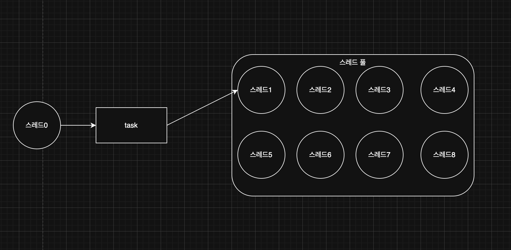
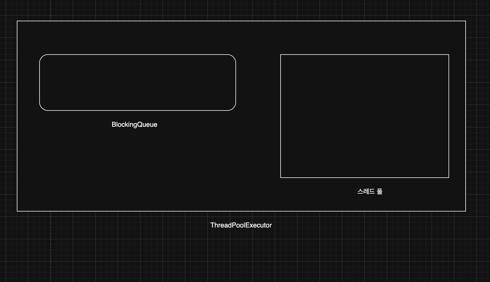
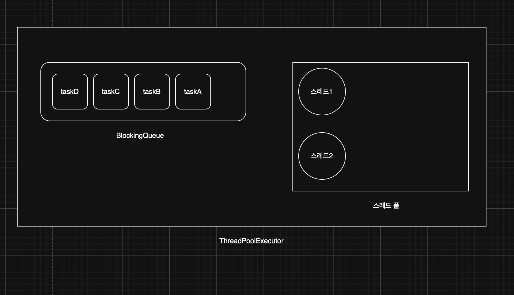
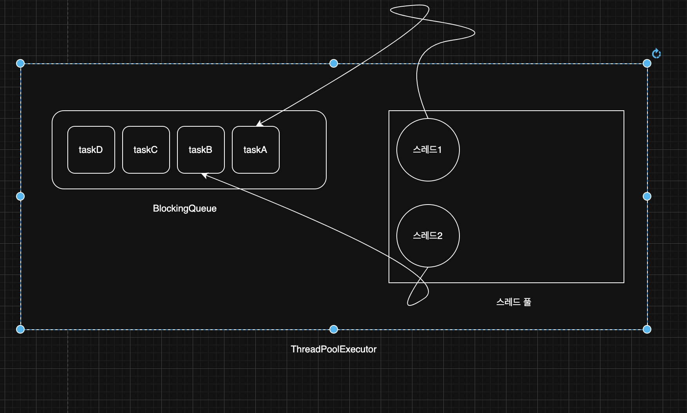
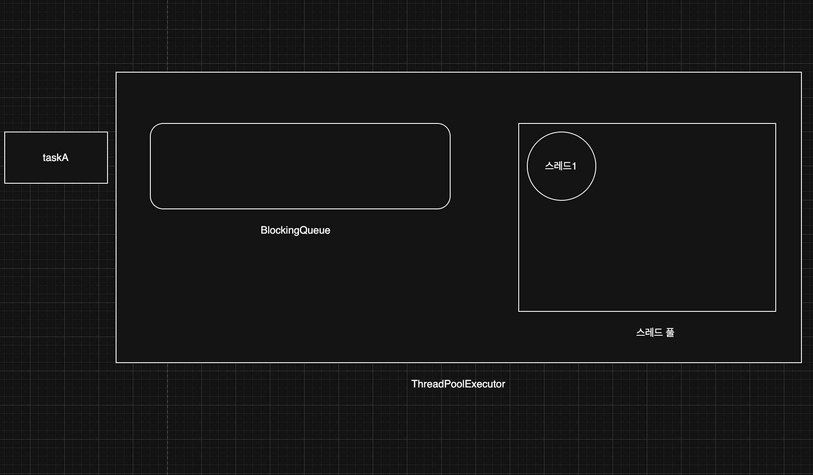
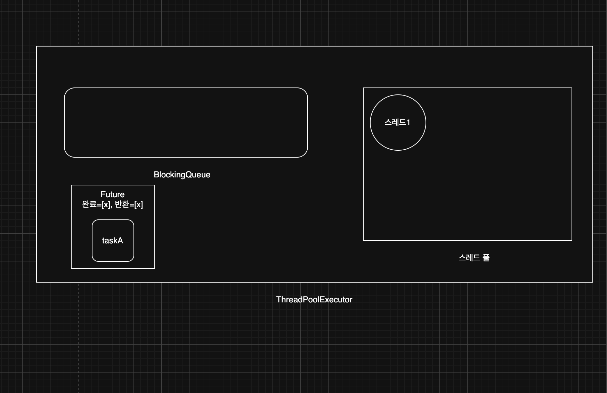
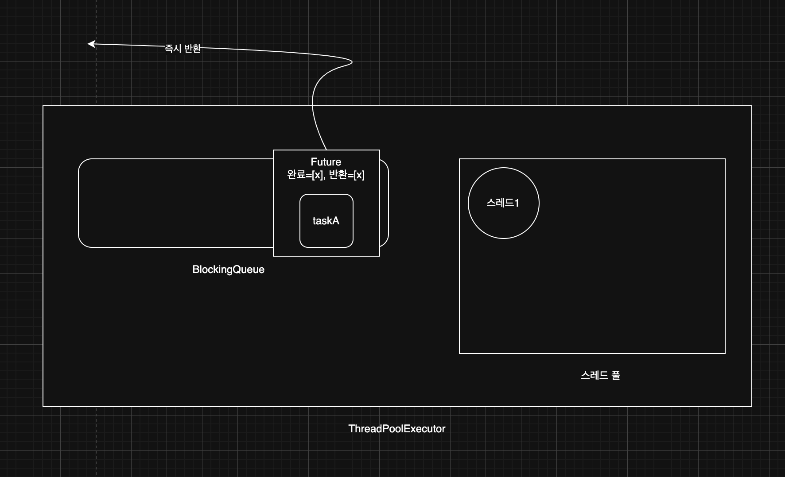
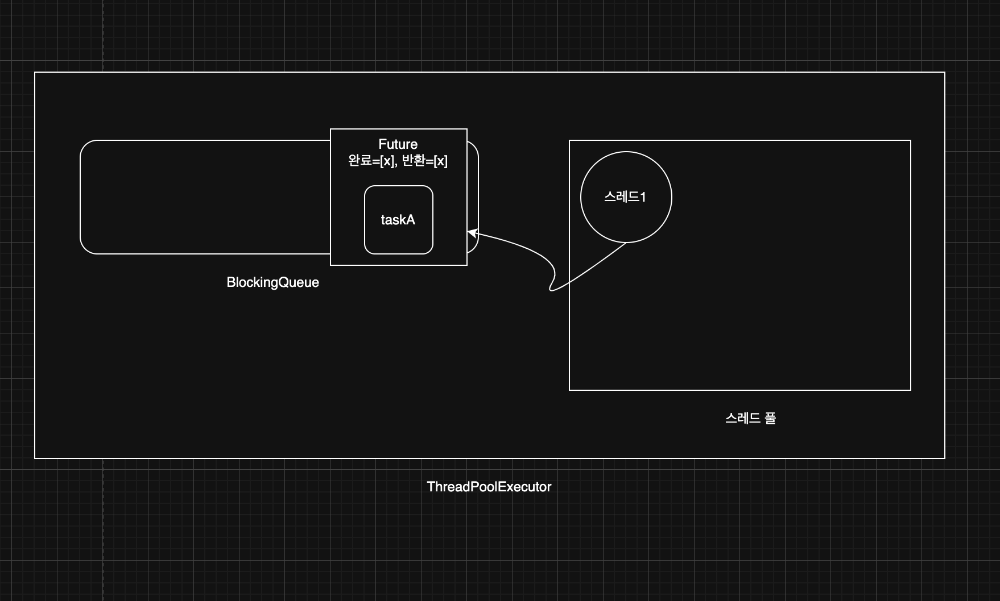
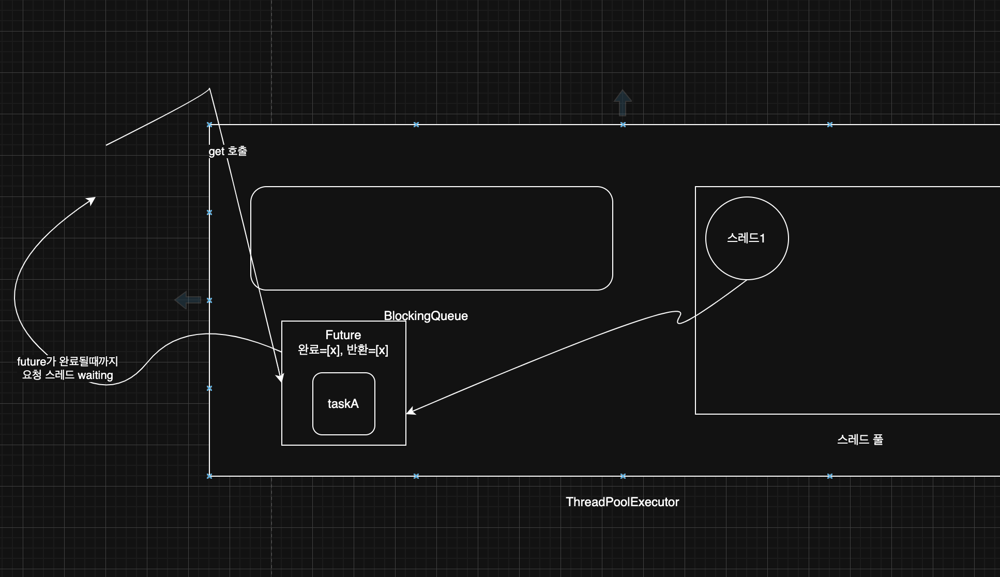
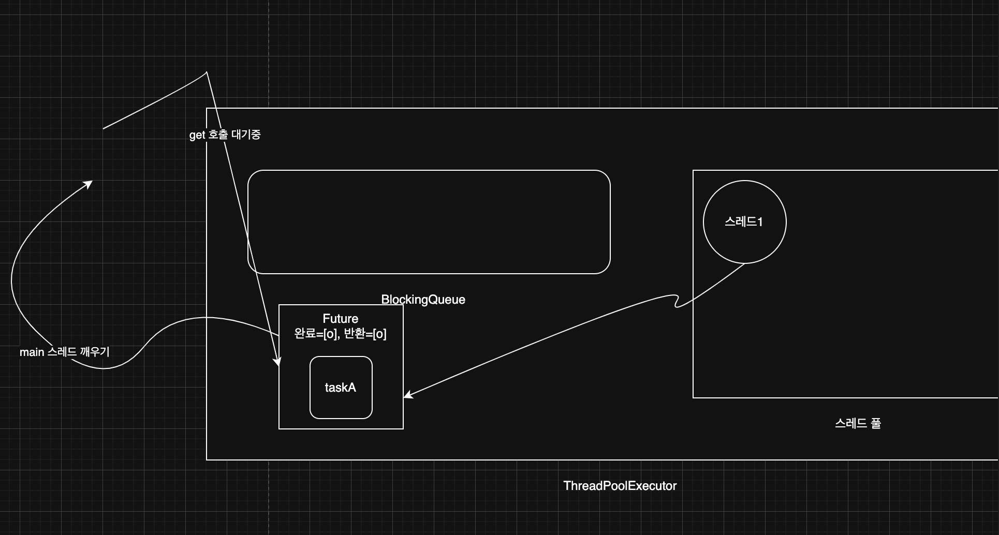

> 해당 블로그 글은 [영한님의 인프런 강의](https://inf.run/6oSgn)를 바탕으로 쓰여진 글입니다.

## 스레드를 직접 사용할 때의 문제점

실무에서 스레드를 직접 생성해서 사용하면 다음과 같은 3가지 문제가 있다.

- 스레드 생성 시간으로 인한 성능 문제
- 스레드 관리 문제
- `Runnable` 인터페이스의 불편함

### 스레드 생성 시간으로 인한 성능 문제

스레드는 매우 무거운 객체이다. 왜 무거울까?

- 메모리 할당: 각 스레드는 자신만의 호출 스택(call stack)을 가지고 있어야 한다. 이 호출 스택은 스레드가 실행되는 동안 사용하는 메모리 공간이다. 따라서 스레드를 생성할 때는 이 호출 스택을 위한 메모리를 할당해야 한다.
- 운영체제 자원 사용: 스레드를 생성하는 작업은 운영체제 커널 수준에서 이루어지며, 시스템 콜(system call)을 통해 처리된다. 이는 CPU와 메모리 리소스를 소모하는 작업이다.
- 운영체제 스케줄러 설정: 새로운 스레드가 생성되면 운영체제의 스케줄러는 이 스레드를 관리하고 실행 순서를 조정해야 한다. 이는 운영체제의 스케줄링 알고리즘에 따라 추가적인 오버헤드가 발생할 수 있다.

> ✅ 참고
>
> 스레드 하나는 보통 1MB정도의 크기를 가진다.

스레드는 굉장히 무겁다. 이렇게 무거운데 만약 선착수 이벤트로 1000명에게 90% 쿠폰을 뿌리겠다고 해보자. 그러면 요청수에 따라 스레드를 다 만들면 시스템이 다운되는 지경까지도 이를 것이다. 그리고 혹여나 작업 시간보다 스레드 생성 시간이 더 오래 걸릴 수도 있는 것이다. 즉, 배보다 배꼽이 더 큰 상황이 될 수 있는 것이다.

### 스레드 관리 문제

서버의 CPU, 메모리 자원은 한정되어 있기 때문에, 스레드는 무한하게 만들 수 없다. 이런 문제를 해결하려면 우리 시스템이 버틸 수 있는, 최대 스레드의 수 까지만 스레드를 생성할 수 있게 관리해야 한다. 또한 만약에 어플리케이션을 종료할 때 안전한 종료로 스레드의 작업을 다 진행하고 종료하거나 인터럽트 요청으로 급하게 종료시킬 때도 이 스레드들이 무언가 어디에서 관리가 되어야 한다는 느낌이 올 것이다.

### `Runnable` 인터페이스의 불편함

- 반환 값이 없다: `run()` 메서드는 반환 값을 가지지 않는다. 따라서 실행 결과를 얻기 위해서는 별도의 메커니즘을 사용해야 한다. 쉽게 이야기해서 스레드의 실행 결과를 직접 받을 수 없다.
- 예외 처리: `run()` 메서드는 체크 예외를 던질 수 없다. 체크 예외의 처리는 메서드 내부에서 처리해야 한다.



즉 위의 문제를 해결하려면 스레드를 관리하는 공간이 필요하다. 이를 위해 자바는 스레드를 **스레드 풀**이라는 공간에서 관리한다.

스레드는 스레드 풀에서 대기하며 쉰다. 그러다가 위의 요청처럼 다른 스레드에 의해 어떤 작업 요청이 들어오면 스레드 풀의 대기하는 스레드 중 하나가 `RUNNABLE`로 상태변경이 되면서 해당 작업을 실행할 것이다. 그리고 작업이 완료되면 `WAITING`상태로 변경하면서 다시 스레드 풀로 들어간다. 이런 과정으로 자바는 스레드를 관리한다.

이렇게 스레드 풀이라는 개념을 사용하면 스레드를 재사용할 수 있어서, 재사용시 스레드의 생성 시간을 절약할 수 있다. 그리고 스레드 풀에서 스레드가 관리되기 때문에 필요한 만큼만 스레드를 만들 수 있고, 또 관리할 수 있다. 사실 스레드 풀이라는 것이 별것이 아니다. 그냥 컬렉션에 스레드를 보관하고 재사용할 수 있게 하면 된다. 하지만 스레드 풀에 있는 스레드는 처리할 작업이 없다면, 대기 상태로 관리해야 하고, 작업 요청이 오면 `RUNNABLE`상태로 변경해야 한다. 막상 구현하려고 하면 생각보다 매우 복잡하다는 사실을 알게될 것이다. 여기에 생산자 소비자 문제까지 겹친다. 잘 생각해보면 어떤 생산자가 작업(task)를 만들 것이고, 우리의 스레드 풀에 있는 스레드가 소비자가 되는 것이다. 이런 문제를 한방에 해결해주는 것이 바로 자바가 제공하는 Executor 프레임워크다.

## Executor 프레임워크 소개

자바의 Executor 프레임워크는 멀티스레딩 및 병렬 처리를 쉽게 사용할 수 있도록 돕는 기능의 모음이다. 이 프레임워크는 작업 실행의 관리 및 스레드 풀 관리를 효율적으로 처리해서 개발자가 직접 스레드를 생성하고 관리하는 복잡함을 줄여준다.

### Executor 프레임워크 주요 요소

#### Executor 인터페이스

가장 기본적이고 단순한 작업을 실행하는 인터페이스로 이전 그림에서 thread-0가 스레드 풀에게 작업을 전달할 때 `Executor` 인터페이스의 `execute(Runnable runnable)`을 실행하면 된다. 인자로 `Runnable`이 들어가면 된다.

#### ExecutorService 인터페이스

`ExecutorService`는 `Executor` 인터페이스를 확장해서 작업 제출과 제어 기능을 추가로 제공한다. 주요 메서드로는 `submit()`,`close()`가 있다. Executor 프레임워크를 사용할 때는 대부분 이 인터페이스를 사용한다. 기본 구현체로는 `ThreadPoolExecutor`가 있다.

### 로그 유틸 만들기

Executor 프레임워크의 상태를 확인하기 위한 로그 출력 유틸리티를 만들어두자.

``` java
package thread.executor;

import java.util.concurrent.ExecutorService;
import java.util.concurrent.ThreadPoolExecutor;

import static util.MyLogger.log;

public abstract class ExecutorUtils {

    public static void printState(ExecutorService executorService) {
        if (executorService instanceof ThreadPoolExecutor poolExecutor) {
            int pool = poolExecutor.getPoolSize();
            int active = poolExecutor.getActiveCount();
            int queuedTasks = poolExecutor.getQueue().size();
            long completedTask = poolExecutor.getCompletedTaskCount();

            log("[pool = " + pool + ", active = " + active + ", " +
                    "queuedTasks = " + queuedTasks + ", completedTask = " + completedTask + "]");
        } else {
            log(executorService);
        }
    }

    public static void printState(ExecutorService executorService, String taskName) {
        if (executorService instanceof ThreadPoolExecutor poolExecutor) {
            int pool = poolExecutor.getPoolSize();
            int active = poolExecutor.getActiveCount();
            int queuedTasks = poolExecutor.getQueue().size();
            long completedTask = poolExecutor.getCompletedTaskCount();

            log(taskName + " -> [pool = " + pool + ", active = " + active + ", " +
                    "queuedTasks = " + queuedTasks + ", completedTask = " + completedTask + "]");
        } else {
            log(taskName + " -> " + executorService);
        }
    }
}
```

여기서 `pool`은 스레드 풀에 관리되는 스레드 수를 의미하며, `active`는 작업을 수행하는 스레드의 수를 뜻하고 `queuedTasks`는 큐에 대기중인 작업 수를 나타낸다. 마지막으로 `completedTask`는 완료 작업 숫자를 나타낸다.

## ExecutorService 코드로 시작하기

간단한 예제로 `ExecutorService`를 알아보자.

``` java
package thread.executor;

import static util.MyLogger.log;
import static util.ThreadUtils.sleep;

public class RunnableTask implements Runnable {

    private final String name;

    private int sleepMs = 1000;

    public RunnableTask(String name) {
        this.name = name;
    }

    public RunnableTask(String name, int sleepMs) {
        this.name = name;
        this.sleepMs = sleepMs;
    }

    @Override
    public void run() {
        log(name + " 시작");
        sleep(sleepMs);
        log(name + " 완료");
    }
}
```

`Runnable` 인터페이스를 구현한 작업 클래스를 만들었다. 이 작업은 단순히 1초 대기하는 작업이다. 이제 사용하는 코드를 볼건데 기존과 다르게 `ExecutorService`를 사용해 볼 것이다.

``` java
package thread.executor;

import java.util.concurrent.ExecutorService;
import java.util.concurrent.LinkedBlockingQueue;
import java.util.concurrent.ThreadPoolExecutor;
import java.util.concurrent.TimeUnit;

import static thread.executor.ExecutorUtils.printState;
import static util.MyLogger.log;
import static util.ThreadUtils.sleep;

public class ExecutorBasicMain {
    public static void main(String[] args) {
        ExecutorService es = new ThreadPoolExecutor(2, 2, 0,
                TimeUnit.MILLISECONDS, new LinkedBlockingQueue<>());

        log("== 초기 상태 ==");
        printState(es);

        es.execute(new RunnableTask("taskA"));
        es.execute(new RunnableTask("taskB"));
        es.execute(new RunnableTask("taskC"));
        es.execute(new RunnableTask("taskD"));

        log("== 작업 수행 중 ==");
        printState(es);

        sleep(3000);

        log("== 작업 수행 완료 ==");
        printState(es);

        es.close();
        log("== shutdown 완료 ==");
        printState(es);
    }
}
```

`ThreadPoolExecutor(ExecutorService)`는 크게 2가지 요소로 구성되어 있다.

- 스레드 풀: 스레드를 관리한다.
- `BlockingQueue` : 작업을 보관한다. 생산자 소비자 문제를 해결하기 위해 단순한 큐가 아니라, `BlockingQueue`를 사용한다.

생산자가 `es.execute(new RunnableTask("taskA"))`를 호출하면, `RunnableTask("taskA")` 인스턴스가 `BlockingQueue`에 보관된다.

- 생산자: `es.execute(작업)` 를 호출하면 내부에서 `BlockingQueue` 에 작업을 보관한다. `main` 스레드가 생산자가 된다.
- 소비자: 스레드 풀에 있는 스레드가 소비자이다. 이후에 소비자 중에 하나가 `BlockingQueue`에 들어있는 작업을 받아서 처리한다.

### ThreadPoolExecutor 생성자

- `corePoolSize` : 스레드 풀에서 관리되는 기본 스레드의 수
- `maximumPoolSize` : 스레드 풀에서 관리되는 최대 스레드 수
- `keepAliveTime`,`TimeUnit unit` : 기본 스레드 수를 초과해서 만들어진 스레드가 생존할 수 있는 대기 시간이다. 이 시간 동안 처리할 작업이 없다면 초과 스레드는 제거된다.
- `BlockingQueue workQueue` : 작업을 보관할 블로킹 큐

위의 코드에서는 기본 스레드 수를 2개로 최대 스레드 수를 2개로 무한대기한 상태로 `LinkedBlockingQueue`를 만들어서 보관한다는 것이다. 이것을 좀 더 알기 쉽게 그림을 통해 살펴보자.



`ThreadPoolExecutor`를 생성한 시점에 스레드 풀에 스레드를 미리 만들어두지는 않는다.



`main` 스레드가 `es.execute()`를 통하여 taskA부터 D까지를 호출한다. 즉, taskA부터 D까지 요청이 블로킹 큐로 전달된다. 최초의 작업이 들어오면 이때 작업을 처리하기 위해 스레드를 만든다. 예를 들어서 최초 작업인 taskA가 들어오는 시점에 스레드1을 생성하고, 다음 작업인 taskB가 들어오는 시점에 스레드2를 생성한다. 이런 방식으로 `corePoolSize`에 지정한 수 만큼 스레드를 스레드 풀에 만든다. 여기서는 2를 설정했으므로 2개까지 만든다. `corePoolSize`까지 스레드가 생성되고 나면, 이후에는 스레드를 생성하지 않고 앞서 만든 스레드를 재사용한다.



스레드 풀에 관리되는 스레드가 2개이므로 `pool=2`, 작업을 수행중인 스레드가 2개이므로 `active=2`, 큐에 대기중인 작업이 2개이므로 `queuedTasks=2`, 완료된 작업은 없으므로 `completedTasks=0`이 되는 것이다. 작업이 완료되면 스레드는 대기(`WAITING`) 상태로 스레드 풀에 대기한다. 그리고 반납된 스레드는 재사용된다. 마찬가지로 taskC와 taskD도 스레드1과 2가 처리를 한다.


마지막으로 `close()`를 호출하면 `ThreadPoolExecutor`가 종료된다. 이때 스레드 풀에 대기하는 스레드도 함께 제거된다.

> ✅ 참고
>
> 당연한 이야기지만 스레드가 스레드 풀에서 작업을 수행하면 당연히 상태는 `RUNNABLE`이 된다.

> ✅ 참고
>
> `close()`는 자바 19부터 지원되는 메서드이다. 만약 19 미만 버전을 사용한다면 `shutdown()`을 호출하자. 

## Runnable의 불편함

`Runnable`은 반환 값을 받을 수 없고 `run()` 메서드에 체크 예외를 던질 수 없다는 문제가 있다. 그럼 이런 문제를 `Executor` 프레임워크는 어떻게 해결했을까? 일단 `Runnable`의 불편함을 예제를 통해 알아보자.

``` java
package thread.executor.future;

import java.util.Random;

import static util.MyLogger.log;
import static util.ThreadUtils.sleep;

public class RunnableMain {
    public static void main(String[] args) throws InterruptedException {
        MyRunnable task = new MyRunnable();
        Thread thread = new Thread(task, "Thread-1");

        thread.start();
        thread.join();

        int result = task.value;
        log("result value = " + result);
    }

    static class MyRunnable implements Runnable {

        int value;

        @Override
        public void run() {
            log("Runnable 시작");
            sleep(2000);

            value = new Random().nextInt(10);

            log("create value = " + value);
            log("Runnable 완료");
        }
    }
}
```

위의 코드는 랜덤 값을 반환하는 단순한 로직인데 반환값을 받을 수 없으니 멤버 변수를 통하여 저장 후 외부에서 접근을 해야할 것이다. 이렇게 간단한 로직을 정말 복잡하게 작성되어서 불편한 감도 있다. `Executor` 프레임워크에서는 이런 문제를 `Future`와 `Callable`로 해결을 하였다.

## Future1 - 소개

### Runnable과 Callable 비교

#### Runnable

``` java
package java.lang;

public interface Runnable {
  void run();
}
```

- `Runnable`의 `run()`은 반환 타입이 `void`이다. 따라서 값을 반환할 수 없다.
- 예외가 선언되어 있지 않다. 따라서 해당 인터페이스를 구현하는 모든 메서드는 체크 예외를 던질 수 없다.

#### Callable

``` java
package java.util.concurrent;

public interface Callable<V> {
  V call() throws Exception;
}
```

- `Callable`의 `call()`은 반환 타입이 제네릭 `V` 이다. 따라서 값을 반환할 수 있다.
- `throws Exception` 예외가 선언되어 있다. 따라서 해당 인터페이스를 구현하는 모든 메서드는 체크 예외인 `Exception`과 그 하위 예외를 모두 던질 수 있다.

그러면 `Callable`과 `Future`을 사용하는 예제를 살펴보자.

``` java
package thread.executor.future;

import java.util.Random;
import java.util.concurrent.*;

import static util.MyLogger.log;
import static util.ThreadUtils.sleep;

public class CallableMainV1 {
    public static void main(String[] args) throws ExecutionException, InterruptedException {
        ExecutorService es = Executors.newFixedThreadPool(1);
        Future<Integer> future = es.submit(new MyCallable());
        Integer result = future.get();

        log("result value = " + result);
        es.close();
    }

    static class MyCallable implements Callable<Integer> {

        @Override
        public Integer call() {
            log("Callable 시작");
            sleep(2000);

            int value = new Random().nextInt(10);

            log("create value = " + value);
            log("Callable 완료");

            return value;
        }
    }
}
```

여기서 처음 보은 것들이 몇개가 있다. 일단 `Executors.newFixedThreadPool()`이다. 해당 메서드의 파라미터 값으로는 스레드 개수를 적어주면 되는데 해당 스레드 개수를 예제처럼 적어주면 아래와 같은 코드가 되는 것이다.

``` java
ExecutorService es = new ThreadPoolExecutor(1,1,0, TimeUnit.MILLISECONDS, new LinkedBlockingQueue<>());
```

다음으로 `MyCallable`이라는 클래스를 보자. 해당 클래스는 `Runnable`대신에 `Callable`을 구현하였다. 이제서야 드디어 반환 값을 받을 수 있고 예외도 던질 수 있게 되었다. 그리고 이 `Callable` 구현체를 스레드 풀에게 전달하려면 기존 `execute()`대신에 `submit()`을 사용하면 된다. 해당 메서드의 파라미터로 `Callable` 구현체를 전달해주면 된다. 그리고 반환 값을 `get()`을 통하여 받을 수 있고 이 부분에서 체크예외가 던져지므로 주의해야 한다.

### Executor 프레임워크 강점

요청 스레드가 결과를 받아야 하는 상황이라면, `Callable`을 사용한 방식은 `Runnable`을 사용하는 방식보다 훨씬 편리하다. 코드만 보면 복잡한 멀티스레드를 사용한다는 느낌보다는, 단순한 싱글 스레드 방식으로 개발한다는 느낌이 들 것이다. 우리가 스레드를 생성도 안 하고 `join`이나 `yield` 같은 것을 전혀 사용하지도 않았는데 스레드가 작업을 받아 수행도 정상적으로 된다. 복잡한 멀티스레드를 매우 편리하게 사용할 수 있는 것이 바로 Executor 프레임워크의 큰 강점이다.

하지만 의문점이 존재한다. `future.get()`을 호출하는 요청 스레드(`main`)는 `future.get()`을 호출 했을 때 2가지 상황으로 나뉘게 된다.

- `MyCallable` 작업을 처리하는 스레드 풀의 스레드가 작업을 완료했다.
- `MyCallable` 작업을 처리하는 스레드 풀의 스레드가 아직 작업을 완료하지 못했다.

`future.get()` 을 호출했을 때 스레드 풀의 스레드가 작업을 완료했다면 반환 받을 결과가 있을 것이다. 그런데 아직 작업을 처리중이라면 어떻게 될까? 이런 의문도 들 것이다. 왜 결과를 바로 반환하지 않고, 불편하게 `Future`라는 객체를 대신 반환할까?

## Future2 - 분석

`Future`는 미래의 결과를 받을 수 있는 객체라는 뜻이다. 미래의 결과를 객체로 받는다? 이게 무슨말일까?

``` java
Future<Integer> future = es.submit(new MyCallable());
```

- `submit`을 호출하면 `MyCallable` 인스턴스가 스레드 풀로 전달된다.
- 이때 `submit()`은 `MyCallable.call()`이 반환하는 무작위 숫자 대신에 `Future`를 반환한다.
- 왜 `Future`로 감쌀까? 이유를 생각해보면 단순할 것 같다. `get()` 메서드로 `main` 스레드는 대기상태가 된다. 만약 대기상태가 아니라 바로 호출한다면 스레드가 작업을 다 했다면 상관이 없겠지만 작업을 안 했다면 뭔가 이상한 값이 나올 것이다. 그래서 이것은 미래의 어느 시점에 작업이 다 될 것이라는 것을 명시하기 위해 `Future`로 반환 값을 감싼거라고 생각한다.
- 따라서 결과를 즉시 받는 것은 불가능하다. 이런 이유로 `es.submit()`은 `MyCallable`의 결과를 반환하는 대신에 `MyCallable`의 결과를 나중에 받을 수 있는 `Futurue`라는 객체를 대신 제공한다.
- 정리하면 `Future`는 전달한 작업의 미래이다. 이 객체를 통해 전달한 작업의 미래 결과를 받을 수 있다.

그럼 예제를 살펴보자.

``` java
package thread.executor.future;

import java.util.Random;
import java.util.concurrent.*;

import static util.MyLogger.log;
import static util.ThreadUtils.sleep;

public class CallableMainV2 {
    public static void main(String[] args) throws ExecutionException, InterruptedException {
        ExecutorService es = Executors.newFixedThreadPool(1);
        log("submit() 호출");

        Future<Integer> future = es.submit(new MyCallable());
        log("future 즉시 반환, future = " + future);

        log("future.get() [블로킹] 메서드 호출 시작 -> main 스레드 WAITING");
        Integer result = future.get();
        log("future.get() [블로킹] 메서드 호출 완료 -> main 스레드 RUNNABLE");

        log("result value = " + result);
        log("future 완료, future = " + future);
        es.close();
    }

    static class MyCallable implements Callable<Integer> {

        @Override
        public Integer call() {
            log("Callable 시작");
            sleep(2000);

            int value = new Random().nextInt(10);

            log("create value = " + value);
            log("Callable 완료");

            return value;
        }
    }
}
```

기존 예제에서 상태를 더 확인하기 위해 로그를 좀 추가하였다.



`MyCallable` 인스턴스를 편의상 `taskA`라고 하겠다. 편의상 스레드풀에 스레드가 1개 있다고 가정하겠다.



요청 스레드는 `es.submit(taskA)`를 호출하고 있다고 하자. 그러면 `ExecutorService`는 전달한 `taskA`의 미래 결과를 알 수 있는 `Future` 객체를 생성한다.

> `Future`는 인터페이스이다. 이때 생성되는 실제 구현체는 `FutureTask`이다.

그리고 생성한 `Future` 객체 안에 `taskA`의 인스턴스를 보관한다. `Future`는 내부에 `taskA` 작업의 완료 여부와, 작업의 결과 값을 가진다. 



그리고 이 `Future` 객체를 블로킹 큐에 담고 반환을 즉시 해준다. `Future`는 내부에 작업의 완료 여부와, 작업의 결과 값을 가진다. 작업이 완료되지 않았기 때문에 아직은 결과 값이 없다. 로그를 보면 현재 `Future`의 상태는 `Not Completed`이고 연관된 작업은 taskA라고 나온다.

> `Future`의 구현체는 `FutureTask`이다.

여기서 중요한 핵심이 있는데, 작업을 전달할 때 생성된 `Future`는 즉시 반환된다는 점이다. 생성한 `Future`를 즉시 반환하기 때문에 요청 스레드는 대기하지 않고, 자유롭게 본인의 다음 코드를 호출할 수 있다.



큐에 들어있는 `Future[taskA]`를 꺼내서 스레드 풀의 스레드1이 작업을 시작한다. 참고로 `Future`의 구현체인 `FutureTask`는 `Runnable` 인터페이스도 함께 구현하고 있다. 스레드1은 `FutureTask`의 `run()` 메서드를 수행한다. 그리고 `run()` 메서드가 `taskA`의 `call()` 메서드를 호출하고 그 결과를 받아서 처리한다.



스레드1은 아직 작업이 완료 안되었다고 하자. 그런데 `main` 스레드에서 `get()` 메서드를 호출하였다. 그러면 요청 스레드는 대기상태에 빠진다. 참고로 `Future`에 대한 참조를 가지고 있기에 언제든지 본인이 필요할 때 `Future.get()`을 호출해서 `taskA` 작업의 미래 결과를 받을 수 있다. 지금은 작업 전이니 대기상태가 되는 것이다. 물론 완료 상태라면 작업의 결과 값을 반환받을 것이다.

> ✅ 참고: 블로킹 메서드
>
> `Thread.join()`,`Future.get()`과 같은 메서드는 스레드가 작업을 바로 수행하지 않고, 다른 작업이 완료될 때 까지 기다리게 하는 메서드이다. 이러한 메서드를 호출하면 호출한 스레드는 지정된 작업이 완료될 때까지 블록(대기)되어 다른 작업을 수행할 수 없다.



그러다가 작업이 완료되면 반환 값을 `Future` 객체 안에 담는다. 그리고 상태를 완료로 변경한다. 다음으로 요청 스레드인 `main` 스레드를 깨운다. 즉, `RUNNABLE` 상태로 변경시키는 것이다.

### Future가 필요한 이유

그런데 잘 생각해보면 한 가지 의문이 들 수 있다. `submit`에서 블로킹을 하나, `get`에서 블로킹 하나 마찬가지지 않을까? 차라리 `submit`에서 블로킹을 시키고 직접 반환 타입으로 받으면 편하지 않을까 싶다. 왜 `Future`가 필요한지 자세히 알아보자.

## Future3 - 활용

1부터 100까지 더하는 것을 `ExecutorService`를 활용하여 멀티 스레드 프로그래밍으로 작성해보자.

``` java
package thread.executor.future;

import java.util.concurrent.*;

import static util.MyLogger.log;

public class SumTaskMainV2 {
    public static void main(String[] args) throws InterruptedException, ExecutionException {
        SumTask task1 = new SumTask(1, 50);
        SumTask task2 = new SumTask(51, 100);
        ExecutorService es = Executors.newFixedThreadPool(2);

        Future<Integer> future1 = es.submit(task1);
        Future<Integer> future2 = es.submit(task2);

        Integer sum1 = future1.get();
        Integer sum2 = future2.get();

        log("task1.result = " + sum1);
        log("task2.result = " + sum2);

        int sumAll = sum1 + sum2;
        log("task1 + task2 = " + sumAll);
        log("End");

        es.close();
    }

    static class SumTask implements Callable<Integer> {

        int startValue;
        int endValue;

        public SumTask(int startValue, int endValue) {
            this.startValue = startValue;
            this.endValue = endValue;
        }

        @Override
        public Integer call() throws Exception {
            log("작업 시작");
            Thread.sleep(2000);

            int sum = 0;

            for (int i = startValue; i <= endValue; i++) {
                sum += i;
            }

            log("작업 완료 result = " + sum);

            return sum;
        }
    }
}
```

`Runnable`로 구현했다면 `join()`도 걸어줘야 하고 멤버 변수로 결과 값을 담아서 외부에서 꺼내야 했다. 또한 체크 예외에 대해 반드시 잡아주지 않아도 된다. 조금 더 간결해졌다.

## Future4 - 이유

만약 `submit` 메서드를 호출할 때 반환 타입이 `Future` 타입이 아니라 원래 원하는 반환 타입으로 반환받는다고 보자. taskA를 `submit` 메서드로 스레드 풀에 전달하면 스레드가 이걸 받아 작업을 할 것이다. 근데 이 작업이 100초 걸린다고 해보자. 그러면 `main` 스레드는 100초를 기달렸다가 결과를 받고 다음 작업인 taskB를 시작한다. 해당 작업도 100초 걸린다고 해보자. 그러면 100초를 기달리고 결과를 받을 것이다. 즉 총 200초가 걸리는 아주 안 좋은 결과가 나온다. 마치 단일 스레드로 돌리는 것과 같다.

만약 `Future`로 받으면 어떻게 될까? taskA가 `submit` 메서드를 호출하면 즉시 `Future`타입을 받는다. 그리고 바로 다음 작업인 taskB를 시행한다. 이것도 바로 `Future`타입으로 바로 받는다. 그 후에 `get()`을 통하여 동시에 taskA와 taskB를 실행할 수 있다. 그리고 100초 후에 두 결과 값을 받을 수 있는 것이다. 바로 반환값을 받는 것보다 2배 성능이 좋아졌다.

이런 이유로 `Future` 타입으로 받는 것이다. 하지만 유의해야 할 점이 있다. 아래와 같이 작성하면 이것 또한 마치 단일 스레드로 돌리는 최악의 효과를 볼 수 있다.

``` java
package thread.executor.future;

import java.util.concurrent.*;

import static util.MyLogger.log;

public class SumTaskMainV2_Bad {
    public static void main(String[] args) throws InterruptedException, ExecutionException {
        SumTask task1 = new SumTask(1, 50);
        SumTask task2 = new SumTask(51, 100);
        ExecutorService es = Executors.newFixedThreadPool(2);

        Future<Integer> future1 = es.submit(task1);
        Integer sum1 = future1.get();

        Future<Integer> future2 = es.submit(task2);
        Integer sum2 = future2.get();

        log("task1.result = " + sum1);
        log("task2.result = " + sum2);

        int sumAll = sum1 + sum2;
        log("task1 + task2 = " + sumAll);
        log("End");

        es.close();
    }

    static class SumTask implements Callable<Integer> {

        int startValue;
        int endValue;

        public SumTask(int startValue, int endValue) {
            this.startValue = startValue;
            this.endValue = endValue;
        }

        @Override
        public Integer call() throws Exception {
            log("작업 시작");
            Thread.sleep(2000);

            int sum = 0;

            for (int i = startValue; i <= endValue; i++) {
                sum += i;
            }

            log("작업 완료 result = " + sum);

            return sum;
        }
    }
}
```

위의 코드처럼 `submit`을 한 후 바로 `get`을 하면 `get` 시점에서 바로 블로킹이 되기 때문에 `main` 스레드가 100초를 기달려야 한다. 즉, 아까와 같은 효과가 나니 주의하자.

`Future`라는 개념이 없다면 결과를 받을 때 까지 요청 스레드는 아무일도 못하고 대기해야 한다. 따라서 다른 작업을 동시에 수행할 수도 없다. `Future`라는 개념 덕분에 요청 스레드는 대기하지 않고, 다른 작업을 수행할 수 있다. 예를 들어서 다른 작업을 더 요청할 수 있다. 그리고 모든 작업 요청이 끝난 다음에, 본인이 필요할 때 `Future.get()`을 호출해서 최종 결과를 받을 수 있다.

`Future`는 요청 스레드를 블로킹(대기) 상태로 만들지 않고, 필요한 요청을 모두 수행할 수 있게 해준다. 필요한 모든 요청을 한 다음에 `Future.get()`을 통해 블로킹 상태로 대기하며 결과를 받으면 된다. 이런 이유로 `ExecutorService`는 결과를 직접 반환하지 않고, `Future`를 반환한다.

## Future5 - 정리

`Future`는 작업의 미래 계산의 결과를 나타내며, 계산이 완료되었는지 확인하고, 완료될 때까지 기다릴 수 있는 기능을 제공한다.

### 주요 메서드

#### boolean cancel(boolean mayInterruptIfRunning)

- **기능**: 아직 완료되지 않은 작업을 취소한다.
- **매개변수**: `mayInterruptIfRunning`
  - `cancel(true)` : `Future`를 취소 상태로 변경한다. 이때 작업이 실행중이라면 `Thread.interrupt()`를 호출해서 작업을 중단한다.
  - `cancel(false)` : `Future`를 취소 상태로 변경한다. 단 이미 실행 중인 작업을 중단하지는 않는다.
- **반환값**: 작업이 성공적으로 취소된 경우 `true`, 이미 완료되었거나 취소할 수 없는 경우 `false`
- **설명**: 작업이 실행 중이 아니거나 아직 시작되지 않았으면 취소하고, 실행 중인 작업의 경우 `mayInterruptIfRunning`이 `true`이면 중단을 시도한다.
- ***참고**: 취소 상태의 `Future`에 `Future.get()`을 호출하면 `CancellationException` 런타임 예외가 발생 한다.

#### boolean isCancelled()

- **기능**: 작업이 취소되었는지 여부를 확인한다.
- **반환값**: 작업이 취소된 경우 `true`, 그렇지 않은 경우 `false`
- **설명**: 이 메서드는 작업이 `cancel()` 메서드에 의해 취소된 경우에 `true`를 반환한다.

#### boolean isDone()

- **기능**: 작업이 완료되었는지 여부를 확인한다.
- **반환값**: 작업이 완료된 경우 `true`, 그렇지 않은 경우 `false`
- **설명**: 작업이 정상적으로 완료되었거나, 취소되었거나, 예외가 발생하여 종료된 경우에 `true`를 반환한다.

#### State state

- **기능**: `Future`의 상태를 반환한다. 자바 19부터 지원한다.
  - `RUNNING` : 작업 실행 중
  - `SUCCESS` : 성공 완료
  - `FAILED` : 실패 완료
  - `CANCELLED` : 취소 완료

#### V get()

- **기능**: 작업이 완료될 때까지 대기하고, 완료되면 결과를 반환한다.
- **반환값**: 작업의 결과
- **예외**
  - `InterruptedException` : 대기 중에 현재 스레드가 인터럽트된 경우 발생
  - `ExecutionException` : 작업 계산 중에 예외가 발생한 경우 발생
- **설명**: 작업이 완료될 때까지 `get()`을 호출한 현재 스레드를 대기(블록킹)한다. 작업이 완료되면 결과를 반환한다.

#### V get(long timeout, TimeUnit unit)

- **기능**: `get()`과 같은데, 시간 초과되면 예외를 발생시킨다.
- **매개변수**:
  - `timeout` : 대기할 최대 시간
  - `unit`: `timeout` 매개변수의 시간 단위 지정
  - **반환값**: 작업의 결과
  - **예외**
    - `InterruptedException` : 대기 중에 현재 스레드가 인터럽트된 경우 발생
    - `ExecutionException` : 계산 중에 예외가 발생한 경우 발생
    - `TimeoutException` : 주어진 시간 내에 작업이 완료되지 않은 경우 발생
  - **설명**: 지정된 시간 동안 결과를 기다린다. 시간이 초과되면 `TimeoutException`을 발생시킨다.

## Future6 - 취소

`cancel()`이 어떻게 동작하는지 예제 코드를 통하여 알아보자.

``` java
package thread.executor.future;

import java.util.concurrent.*;

import static util.MyLogger.log;
import static util.ThreadUtils.sleep;

public class FutureCancelMain {

    private static boolean mayInterruptIfRunning = true;
//    private static boolean mayInterruptIfRunning = false;

    public static void main(String[] args) {
        ExecutorService es = Executors.newFixedThreadPool(1);
        Future<String> future = es.submit(new MyTask());
        log("Future.state: " + future.state());

        sleep(3000);

        log("future.cancel(" + mayInterruptIfRunning + ") 호출");
        boolean cancelResult1 = future.cancel(mayInterruptIfRunning);
        log("Future.state: " + future.state());
        log("future.cancel(" + mayInterruptIfRunning + ") result: " + cancelResult1);

        try {
            log("Future result: " + future.get());
        } catch (CancellationException e) {
            log("Future는 이미 취소되었습니다.");
        } catch (InterruptedException | ExecutionException e) {
            e.printStackTrace();
        }

        es.close();
    }

    static class MyTask implements Callable<String> {

        @Override
        public String call() {
            try {
                for (int i = 0; i < 10; i++) {
                    log("작업 중: " + i);
                    Thread.sleep(1000);
                }
            } catch (InterruptedException e) {
                log("인터럽트 발생");
                return "Interrupted";
            }

            return "Completed";
        }
    }
}
```

`cancel(true)`를 하면 `Future`의 상태를 취소로 변경한다. 그리고 작업중인 스레드들을 인터럽트를 호출하여 중단시킨다. 반면 `cancel(false)`로 변경하면 `Future`의 상태를 취소로 변경하는 것은 같으나 이미 실행 중인 작업은 중단을 안 시킨다. 이렇게 취소 상태가 된 `Future`에 `get()`을 호출하면 이미 취소가 된 상태라 값을 꺼내올 수 없으므로 `CancellationException`라는 런타임 예외가 발생한다.

## Future7 - 예외

`Future.get()`을 호출하면 작업의 결과값 뿐만 아니라, 작업 중에 발생한 예외도 받을 수 있다.

``` java
package thread.executor.future;

import java.util.concurrent.*;

import static util.MyLogger.log;
import static util.ThreadUtils.sleep;

public class FutureExceptionMain {
    public static void main(String[] args) {
        ExecutorService es = Executors.newFixedThreadPool(1);
        log("작업 전달");

        Future<Integer> future = es.submit(new ExCallable());
        sleep(1000);

        try {
            log("future.get() 호출 시도, future.state(): " + future.state());
            Integer result = future.get();
            log("result value = " + result);
        } catch (InterruptedException e) {
            throw new RuntimeException(e);
        } catch (ExecutionException e) {
            log("e = " + e);
            Throwable cause = e.getCause();
            log("cause = " + cause);
        }

        es.close();
    }

    static class ExCallable implements Callable<Integer> {

        @Override
        public Integer call() {
            log("Callable 실행, 예외 발생");
            throw new IllegalArgumentException("ex!");
        }
    }
}
```

작업 클래스에서 일부러 예외를 던져보았다. 그러면 `Future`에서 예외를 담는다. 예외가 발생했으므로 `Future`의 상태는 `FAILED`가 된다. 그리고 `main`스레드는 `get()`을 호출한다. `Future`의 상태가 `FAILED`면 `ExecutionException` 예외를 던진다. 그러면 `catch` 블록으로 가서 `Future`에 담아둔 예외를 출력할 수 있다.

## ExecutorService - 작업 컬렉션 처리

`ExecutorService`는 여러 작업을 한 번에 편리하게 처리하는 `invokeAll()`,`invokeAny()` 기능을 제공한다.

### invokeAll()

- `<T> List<Future<T>> invokeAll(Collection<? extends Callable<T>> tasks) throws InterruptedException`
  - 모든 `Callable` 작업을 제출하고, 모든 작업이 완료될 때까지 기다린다.
- `<T> List<Future<T>> invokeAll(Collection<? extends Callable<T>> tasks, long timeout, TimeUnit unit) throws InterruptedException`
  - 지정된 시간 내에 모든 `Callable` 작업을 제출하고 완료될 때까지 기다린다.

### invokeAny()

- `<T> T invokeAny(Collection<? extends Callable<T>> tasks) throws InterruptedException, ExecutionException` 
  - 하나의 `Callable` 작업이 완료될 때까지 기다리고, 가장 먼저 완료된 작업의 결과를 반환한다.
  - 완료되지 않은 나머지 작업은 취소한다.
- `<T> T invokeAny(Collection<? extends Callable<T>> tasks, long timeout, TimeUnit unit) throws InterruptedException, ExecutionException, TimeoutException`
  - 지정된 시간 내에 하나의 `Callable` 작업이 완료될 때까지 기다리고, 가장 먼저 완료된 작업의 결과를 반환한다.
  - 완료되지 않은 나머지 작업은 취소한다.

> 잘못된 지식이 있을 경우 댓글로 남겨주시면 빠르게 반영하겠습니다!