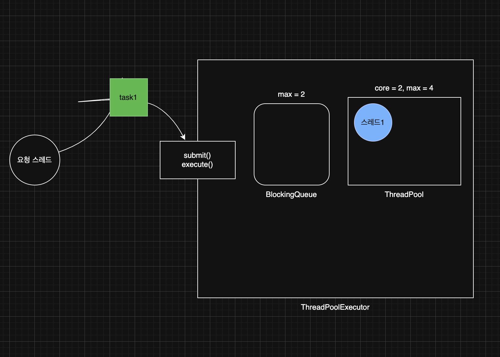
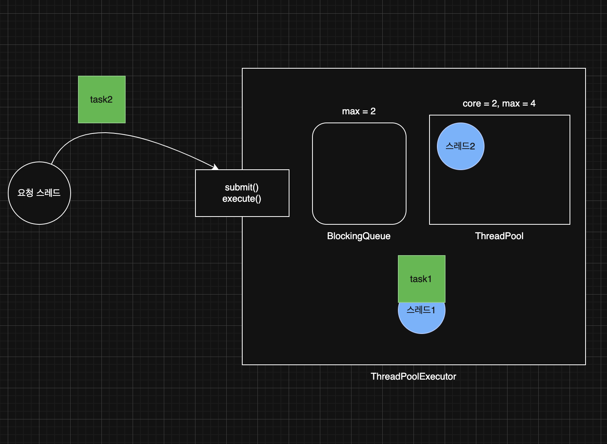
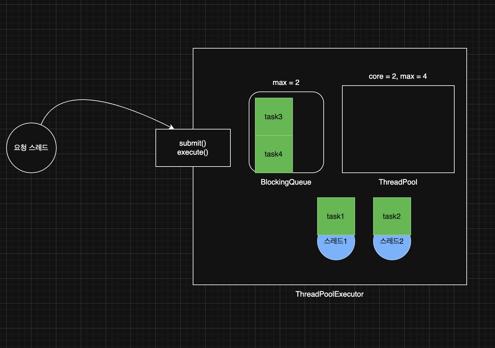
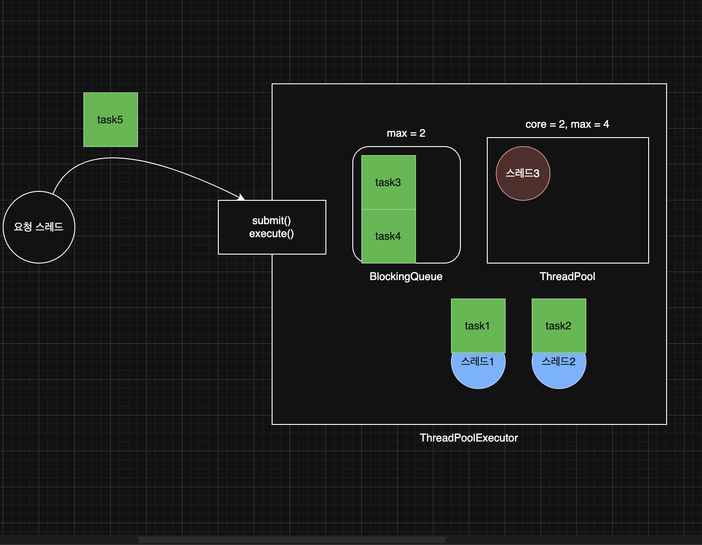
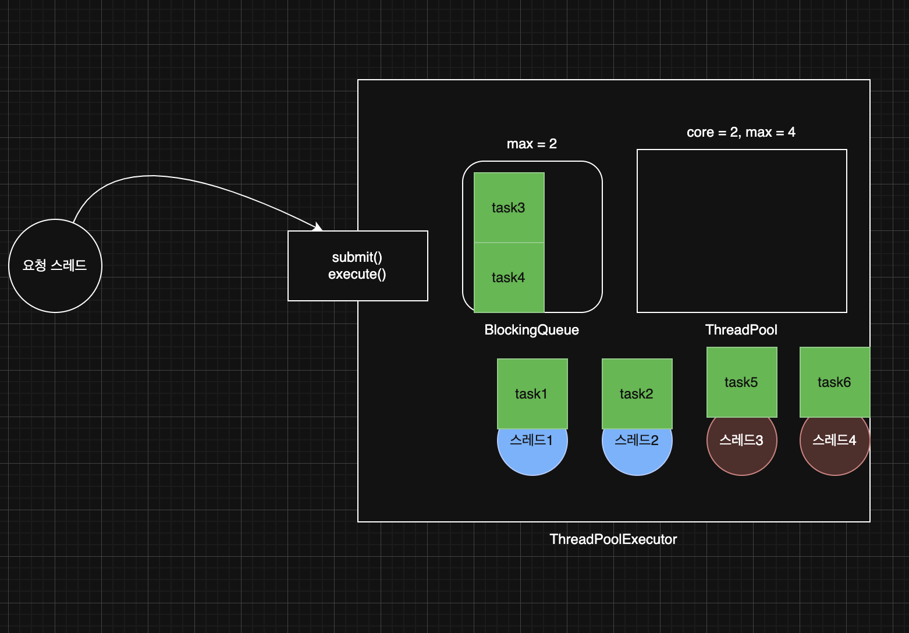
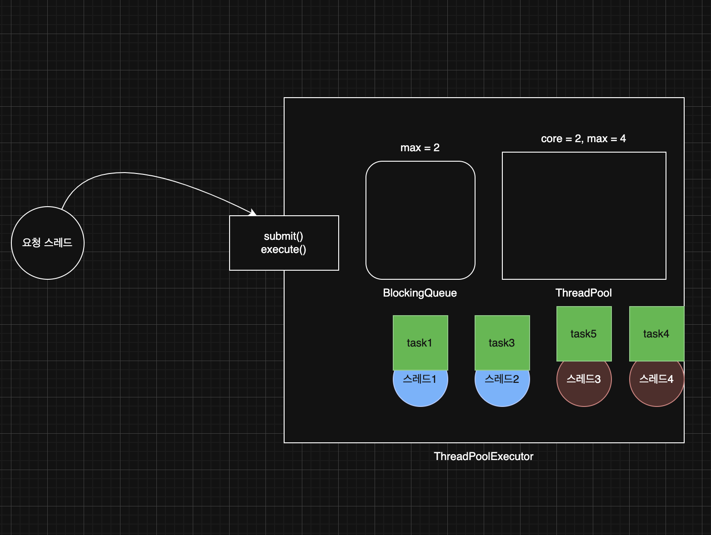

> 해당 블로그 글은 [영한님의 인프런 강의](https://inf.run/6oSgn)를 바탕으로 쓰여진 글입니다.

## ExecutorService 우아한 종료 - 소개

우리가 웹 어플리케이션 1대를 운영중이라고 해보자. 그런데 갑자기 보안 이슈 문제가 생겨서 긴급 패치를 해야한다고 해보자. 그럼 가장 이상적인 방향은 새로 들어오는 request는 막고 기존에 처리하는 api들을 다 처리 후에 종료하는게 가장 이상적일 것이다. 이런 방식을 **graceful shutdown**이라고 한다.

### ExecutorService의 종료 메서드

#### 서비스 종료

- `void shutdown()`
    - 새로운 작업을 받지 않고, 이미 제출된 작업을 모두 완료한 후에 종료한다.
    - 논 블로킹 메서드
- `List<Runnable> shutdownNow()`
    - 실행 중인 작업을 중단하고, 대기 중인 작업을 반환하며 즉시 종료한다.
    - 실행 중인 작업을 중단하기 위해 인터럽트를 발생시킨다.
    - 논 블로킹 메서드

#### 서비스 상태 확인

- `boolean isShutdown()`
    - 서비스가 종료되었는지 확인한다.
- `boolean isTerminated()`
    - `shutdown()`,`shutdownNow()` 호출 후, 모든 작업이 완료되었는지 확인한다.

#### 작업 완료 대기

- `boolean awaitTermination(long timeout, TimeUnit unit) throws InterruptedException`
    - 서비스 종료시 모든 작업이 완료될 때까지 대기한다. 이때 지정된 시간까지만 대기한다.
    - 블로킹 메서드

#### close()

`close()`는 자바 19부터 지원하는 서비즈 종료 메서드이다. 이 메서드는 `shutdown()`과 같다고 생각하면 된다. 더 정확히는 `shutdown()`을 호출하고, 하루를 기다려도 작업이 완료되지 않으면 `shutdownNow()`를 호출한다. 호출한 스레드에 인터럽트가 발생해도 `shutdownNow()`를 호출한다.

### shutdown() - 처리중인 작업이 없는 경우

만약 `BlockingQueue`에 대기 중인 작업이 없고 현재 작업을 처리하는 스레드도 없고 스레드 풀에 스레드들만 대기상태로 있다고 할 때 `shutdown` 메서드를 호출하면 일단 `ExecutorService`는 새로운 요청을 거절하고 스레드 풀의 기본 자원을 정리한다.

> 거절시 기본적으로 `java.util.concurrent.RejectedExecutionException` 예외가 발생한다. 거절 정책은 설정이 가능하다.

### shutdown() - 처리중인 작업이 있는 경우

만약 대기 중인 작업도 있고 처리 중인 작업도 있을 경우 새로운 요청은 당연히 거절되고 처리 중인 작업을 완료한다. 그리고 대기 중인 작업도 완료한 후에 스레드 풀의 기본자원을 정리한다.

### shutdownNow() - 처리중인 작업이 있는 경우

만약 대기 중인 작업도 있고 처리 중인 작업도 있을 경우 새로운 요청은 당연히 거절되고 큐를 비우면서, 큐에 있는 작업을 모두 꺼내서 컬렉션으로 반환한다. 그리고 작업 중인 스레드에 인터럽트가 발생한다. 그리고 스레드 풀의 기본 자원을 정리한다.

## ExecutorService 우아한 종료 - 구현

일반적으로 어플리케이션을 종료할 때 우아한 종료가 가장 이상적이다. 그런데 갑자기 요청이 많이 들어와서 대기큐에 작업이 계속 쌓여 처리가 힘들거나 너무 오래 걸리는 작업이 있을 경우 종료 자체가 늦어질 수 있는 우려가 있다. 그래서 보통 우아한 종료를 하되, 1분 정도만 기달리고 강제 종료를 택한다. 이것을 한번 예제 코드로 작성해보자. 예제에서는 1분이 아닌 10초만 기달려 보는 것으로 해보겠다.

``` java
package thread.executor;

import java.util.concurrent.ExecutorService;
import java.util.concurrent.Executors;
import java.util.concurrent.TimeUnit;

import static thread.executor.ExecutorUtils.printState;
import static util.MyLogger.log;

public class ExecutorShutdownMain {
    public static void main(String[] args) {
        ExecutorService es = Executors.newFixedThreadPool(2);

        es.execute(new RunnableTask("taskA"));
        es.execute(new RunnableTask("taskB"));
        es.execute(new RunnableTask("taskC"));
        es.execute(new RunnableTask("longTask", 100_000));

        printState(es);

        log("== shutdown 시작 ==");
        shutdownAndAwaitTermination(es);
        log("== shutdown 완료 ==");

        printState(es);
    }

    static void shutdownAndAwaitTermination(ExecutorService es) {
        es.shutdown();

        try {
            log("서비스 정상 종료 시도");

            if (!es.awaitTermination(10, TimeUnit.SECONDS)) {
                log("서비스 정상 종료 실패 -> 강제 종료 시도");
                es.shutdownNow();

                if (!es.awaitTermination(10, TimeUnit.SECONDS)) {
                    log("서비스가 종료되지 않았습니다.");
                }
            }
        } catch (InterruptedException e) {
            es.shutdownNow();
        }
    }
}
```

위의 코드에서 taskA, taskB, taskC는 각각 1초씩 걸리는 작업이지만 longTask는 100초를 기달려야 하는 작업이다. 먼저 작업을 스레드 풀에 던지고 종료 로직을 수행할 것이다. 그러면 먼저 `shutdown()`이 호출되고 수행중이던 작업을 종료시키고 큐에 있는 작업도 수행을 할 것이다. 다만, 해당 메서드는 논 블로킹 메서드라 다음 로직을 수행한다. `awaitTermination()` 블로킹 메서드로 10초정도를 기달려본다. 10초에도 안 끝나는 작업이 있을 경우 `shutdownNow()`를 호출한다. 그러면 해당 스레드에 인터럽트가 걸려 바로 종료가 될 것이다.

> 🙋🏻 질문
>
> `shutdownNow()`를 호출한 이후에 왜 `awaitTermination()`으로 10초간 기다릴까? 인터럽트로 스레드를 종료시키려고 하더라도 자원 정리하는데 시간이 있기 때문에 보통 이렇게 작성을 한다.

그런데 이런 경우도 있을 수 있다. 극단적이지만 최악의 경우 스레드가 다음과 같이 인터럽트를 받을 수 없는 코드를 수행중일 수 있다. 이 경우 인터럽트 예외가 발생하지 않고, 스레드도 계속 수행된다.

``` java
while(true) {}
```

이런 경우를 대비해서 강제 종료 후 10초간 대기해도 작업이 완료되지 않으면 "서비스가 종료되지 않았습니다"라고 개발자가 인지할 수 있는 로그를 남겨두어야 한다. 그래야 개발자가 나중에 문제를 찾아서 코드를 수정할 수 있다.

## Executor 스레드 풀 관리 - 코드

Executor 프레임워크가 어떤식으로 스레드를 관리하는지 깊이있게 알아보자.

`ExecutorService`의 기본 구현체인 `ThreadPoolExecutor`의 생성자는 다음 속성을 사용한다.

- `corePoolSize` : 스레드 풀에서 관리되는 기본 스레드의 수
- `maximumPoolSize` : 스레드 풀에서 관리되는 최대 스레드 수
- `keepAliveTime`,`TimeUnit unit` : 기본 스레드 수를 초과해서 만들어진 초과 스레드가 생존할 수 있는 대기 시간, 이 시간 동안 처리할 작업이 없다면 초과 스레드는 제거된다.
- `BlockingQueue workQueue` : 작업을 보관할 블로킹 큐

``` java
package thread.executor.poolsize;

import thread.executor.RunnableTask;

import java.util.concurrent.*;

import static thread.executor.ExecutorUtils.printState;
import static util.MyLogger.log;
import static util.ThreadUtils.sleep;

public class PoolSizeMainV1 {
    public static void main(String[] args) {
        BlockingQueue<Runnable> workQueue = new ArrayBlockingQueue<>(2);
        ExecutorService es = new ThreadPoolExecutor(2, 4,
                3000, TimeUnit.MILLISECONDS, workQueue);

        printState(es);

        es.execute(new RunnableTask("task1"));
        printState(es, "task1");

        es.execute(new RunnableTask("task2"));
        printState(es, "task2");

        es.execute(new RunnableTask("task3"));
        printState(es, "task3");

        es.execute(new RunnableTask("task4"));
        printState(es, "task4");

        es.execute(new RunnableTask("task5"));
        printState(es, "task5");

        es.execute(new RunnableTask("task6"));
        printState(es, "task6");

        try {
            es.execute(new RunnableTask("task7"));
        } catch (RejectedExecutionException e) {
            log("task7 실행 거절 예외 발생: " + e);
        }

        sleep(3000);
        log("== 작업 수행 완료 ==");
        printState(es);

        sleep(3000);
        log("== maximumPoolSize 대기 시간 초과 ==");
        printState(es);

        es.close();
        log("== shutdown 완료 ==");
        printState(es);
    }
}
```

일단 `BlockingQueue`의 사이즈를 2개를 설정했다. 그리고 작업이 2개까지 들어오면 `corePoolSize`로 설정한 2개까지 기본 스레드가 생성되어 작업을 처리한다. 그 후 작업이 2개 더 들어오면 대기 큐에 들어오게 된다. 하지만 여기서 2개가 더 들어오면 큐에도 못 넣고 기본 스레드도 작업 처리하는 상황이니 초과 스레드를 생성하여 처리한다. `maximumPoolSize`는 기본 스레드 + 초과 스레드라고 생각하면 좋을 것 같다. 그리고 `keepAliveTime`은 초과 스레드가 생존하는 시간을 의미하며 이 시간이 지나면 초과스레드는 사라진다.

## Executor 스레드 풀 관리 - 분석

그림을 통해 분석해보자.



task1이 작업을 요청한다. 그러면 Executor는 스레드 풀에 coreSize만큼 스레드가 있는지 확인한다. 지금은 하나도 없으므로 스레드를 하나 새로 생성한다. 스레드를 하나 생성했기에 대기 큐에 넣을 필요 없이 바로 스레드가 처리한다.



task2가 작업을 요청한다. 그러면 Executor는 스레드 풀에 coreSize만큼 스레드가 있는지 확인한다. 지금은 스레드가 1개 있고 coreSize는 2개이므로 1개 더 생성할 수 있다. 그래서 스레드를 하나 생성한다. 그리고 task2를 수행한다.



다음으로 task3이 들어온다. 그러면 Executor는 스레드 풀에 coreSize만큼 스레드가 있는지 확인한다. 그런데 현재 이미 스레드 풀에 coreSize만큼 존재한다. 그래서 task3은 대기 큐에 대기한다. 후에 task4도 들어올텐데 이 작업도 대기 큐에 들어간다.



다음으로 task5가 들어온다. 그러면 Executor는 스레드 풀에 coreSize만큼 스레드가 있는지 확인한다. 이미 coreSize만큼 존재한다. 그래서 대기큐로 보내려고 봤더니 대기큐도 꽉 찼다. 큐가 가득차면 긴급 상황이다. 대기하는 작업이 꽉 찰 정도로 요청이 많다는 뜻이다. 이 경우 `Executor`는 max(`maximumPoolSize`) 사이즈까지 **초과 스레드**를 만들어서 작업을 수행한다. 즉 `maximumPoolSize`로 설정한 4개에서 기본 스레드 2개를 제외한 총 2개의 초과 스레드를 만들 수 있는 것이다. 초과 스레드를 만들어 task5를 수행한다.



task6이 들어오면 이처럼 초과 스레드를 만들어 처리를 할 것이다.


task7이 들어오면 기본 스레드도 꽉 찼고 초과 스레드도 꽉 찼고 대기 큐도 가득 차서 작업을 수행을 못한다. 그래서 `RejectedExecutionException`을 발생시키고 해당 작업을 거절한다.



이후 작업이 끝나면 대기 큐에 있는 작업을 꺼내서 작업을 수행한다. 이와 같은 과정을 반복하다가 `close()` 메서드를 만나면 전부 종료된다.

### 스레드 미리 생성하기

응답시간이 아주 중요한 서버라면, 서버가 고객의 처음 요청을 받기 전에 스레드를 스레드 풀에 미리 생성해두고 싶을 수 있다. 스레드를 미리 생성해두면, 처음 요청에서 사용되는 스레드의 생성 시간을 줄일 수 있다. `ThreadPoolExecutor.prestartAllCoreThreads()`를 사용하면 기본 스레드를 미리 생성할 수 있다.

``` java
package thread.executor;

import java.util.concurrent.ExecutorService;
import java.util.concurrent.Executors;
import java.util.concurrent.ThreadPoolExecutor;

import static thread.executor.ExecutorUtils.printState;

public class PreStartPoolMain {
    public static void main(String[] args) {
        ExecutorService es = Executors.newFixedThreadPool(1000);

        printState(es);

        ThreadPoolExecutor poolExecutor = (ThreadPoolExecutor) es;
        poolExecutor.prestartAllCoreThreads();

        printState(es);

        es.close();
    }
}
```

## Executor 전략 - 고정 풀 전략

자바는 `Executors` 클래스를 통해 3가지 기본 전력을 제공한다.

- **newSingleThreadPool()**: 단일 스레드 풀 전략
- **newFixedThreadPool(nThreads)**: 고정 스레드 풀 전략
- **newCachedThreadPool()**: 캐시 스레드 풀 전략

### newSingleThreadPool(): 단일 스레드 풀전략

- 스레드 풀에 기본 스레드 1개만 사용한다.
- 큐 사이즈에 제한이 없다. (`LinkedBlockingQueue`)
- 주로 간단히 사용하거나, 테스트 용도로 사용한다.

위의 전략은 아래와 같은 코드이다.

``` java
new ThreadPoolExecutor(1, 1,0L, TimeUnit.MILLISECONDS, new LinkedBlockingQueue<Runnable>())
```

### Executor 스레드 풀 관리 - 고정 풀 전략

#### **newFixedThreadPool(nThreads)**

- 스레드 풀에 `nThreads` 만큼의 기본 스레드를 생성한다. 초과 스레드는 생성하지 않는다.
- 큐 사이즈에 제한이 없다. (`LinkedBlockingQueue`)
- 스레드 수가 고정되어 있기 때문에 CPU, 메모리 리소스가 어느정도 예측 가능한 안정적인 방식이다.

위의 전략은 아래와 같은 코드이다.

``` java
new ThreadPoolExecutor(nThreads, nThreads, 0L, TimeUnit.MILLISECONDS, new LinkedBlockingQueue<Runnable>())
```

#### 특징

스레드 수가 고정되어 있기 때문에 CPU, 메모리 리소스가 어느정도 예측 가능한 안정적인 방식이다. 큐 사이즈도 제한이 없어서 작업을 많이 담아두어도 문제가 없다.

> ⚠️ 주의
>
> 이 방식의 가장 큰 장점은 스레드 수가 고정되어서 CPU, 메모리 리소스가 어느정도 예측 가능하다는 점이다. 따라서 일 반적인 상황에 가장 안정적으로 서비스를 운영할 수 있다. 하지만 상황에 따라 장점이 가장 큰 단점이 되기도 한다.

#### **상황1 - 점진적인 사용자 확대**

- 개발한 서비스가 잘 되어서 사용자가 점점 늘어난다.
- 고정 스레드 전략을 사용해서 서비스를 안정적으로 잘 운영했는데, 언젠가부터 사용자들이 서비스 응답이 점점 느리진다고 항의한다.

#### **상황2 - 갑작스런 요청 증가**

- 마케팅 팀의 이벤트가 대성공 하면서 갑자기 사용자가 폭증했다.
- 고객은 응답을 받지 못한다고 항의한다.

#### 확인

- 개발자는 급하게 CPU, 메모리 사용량을 확인해보는데, 아무런 문제 없이 여유있고, 안정적으로 서비스가 운영되고 있다.
- 고정 스레드 전략은 실행되는 스레드 수가 고정되어 있다. 따라서 사용자가 늘어나도 CPU, 메모리 사용량이 확 늘어나지 않는다.
- 큐의 사이즈를 확인해보니 요청이 수 만 건이 쌓여있다. 요청이 처리되는 시간보다 쌓이는 시간이 더 빠른 것이다. 참고로 고정 풀 전략의 큐 사이즈는 무한이다.
- 서비스 초기에는 사용자가 적기 때문에 이런 문제가 없지만, 사용자가 늘어나면 문제가 될 수 있다.
- 선착순 이벤트 같은 갑작스러운 요청도 마찬가지다.

결국 서버 자원은 여유가 있는데, 사용자만 점점 느려지는 문제가 발생한 것이다.

## Executor 전략 - 캐시 풀 전략

### **newCachedThreadPool()**

- 기본 스레드를 사용하지 않고, 60초 생존 주기를 가진 초과 스레드만 사용한다.
- 초과 스레드의 수는 제한이 없다.
- 큐에 작업을 저장하지 않는다. (`SynchronousQueue`)
    - 대신에 생산자의 요청을 스레드 풀의 소비자 스레드가 직접 받아서 바로 처리한다.
- 모든 요청이 대기하지 않고 스레드가 바로바로 처리한다. 따라서 빠른 처리가 가능하다.

위의 전략은 아래의 코드와 같은 것이다.

``` java
new ThreadPoolExecutor(0, Integer.MAX_VALUE, 60L, TimeUnit.SECONDS, new SynchronousQueue<Runnable>());
```

`SynchronousQueue`는 아주 특별한 블로킹 큐이다.

- `BlockingQueue` 인터페이스의 구현체 중 하나이다.
- 이 큐는 내부에 저장 공간이 없다. 대신에 생산자의 작업을 소비자 스레드에게 직접 전달한다.
- 쉽게 이야기해서 저장 공간의 크기가 0이고, 생산자 스레드가 큐가 작업을 전달하면 소비자 스레드가 큐에서 작업을 꺼낼 때 까지 대기한다.
- 소비자 작업을 요청하면 기다리던 생산자가 소비자에게 직접 작업을 전달하고 반환된다. 그 반대의 경우도 같다.
- 이름 그대로 생산자와 소비자를 동기화하는 큐이다.
- 쉽게 이야기해서 중간에 버퍼를 두지 않는 스레드간 직거래라고 생각하면 된다.

캐시 스레드 풀 전략은 매우 빠르고, 유연한 전략이다. 이 전략은 기본 스레드도 없고, 대기 큐에 작업도 쌓이지 않는다. 대신에 작업 요청이 오면 초과 스레드로 작업을 바로바로 처리한다. 따라서 빠른 처리가 가능하다. 초과 스레드의 수도 제한이 없기 때문에 CPU, 메모리 자원만 허용한다면 시스템의 자원을 최대로 사용할 수 있다. 추가로 초과 스레드는 60초간 생존하기 때문에 작업 수에 맞추어 적절한 수의 스레드가 재사용된다. 이런 특징 때문에 요청이 갑자기 증가하면 스레드도 갑자기 증가하고, 요청이 줄어들면 스레드도 점점 줄어든다.

동작 과정은 다음과 같다.

- 사용자 작업 요청이 온다. 그러면 Executor는 coreSize를 확인하여 기본 스레드를 몇개 만들 수 있는지 확인한다.
- 캐시 풀 전략은 기본 스레드가 0이므로 대기 큐 사이즈로 보낼 것이다.
- 그런데 대기 큐 사이즈도 0이다. 따라서 초과 스레드를 생성하는 것이다.
- 해당 초과 스레드는 60초동안 유지하므로 재사용도 가능하다.

> ⚠️ 주의
>
> 이 방식은 작업 수에 맞추어 스레드 수가 변하기 때문에, 작업의 처리 속도가 빠르고, CPU, 메모리를 매우 유연하게 사용할 수 있다는 장점이 있다. 하지만 상황에 따라서 장점이 가장 큰 단점이 되기도 한다.

#### **상황1 - 점진적인 사용자 확대**

- 개발한 서비스가 잘 되어서 사용자가 점점 늘어난다.
- 캐시 스레드 전략을 사용하면 이런 경우 크게 문제가 되지 않는다.
- 캐시 스레드 전략은 이런 경우에는 문제를 빠르게 찾을 수 있다. 사용자가 점점 증가하면서 스레드 사용량도 함께 늘어난다. 따라서 CPU 메모리의 사용량도 자연스럽게 증가한다.
- 물론 CPU, 메모리 자원은 한계가 있기 때문에 적절한 시점에 시스템을 증설해야 한다. 그렇지 않으면 CPU, 메모리 같은 시스템 자원을 너무 많이 사용하면서 시스템이 다운될 수 있다.

#### **상황2 - 갑작스런 요청 증가**

- 마케팅 팀의 이벤트가 대성공 하면서 갑자기 사용자가 폭증했다.
- 고객은 응답을 받지 못한다고 항의한다.

#### **상황2 - 확인**

- 개발자는 급하게 CPU, 메모리 사용량을 확인해보는데, CPU 사용량이 100%이고, 메모리 사용량도 지나치게 높아져있다.
- 스레드 수를 확인해보니 스레드가 수 천개 실행되고 있다. 너무 많은 스레드가 작업을 처리하면서 시스템 전체가 느려지는 현상이 발생한다.
- 캐시 스레드 풀 전략은 스레드가 무한으로 생성될 수 있다.
- 수 천개의 스레드가 처리하는 속도 보다 더 많은 작업이 들어온다.
- 시스템은 너무 많은 스레드에 잠식 당해서 거의 다운된다. 메모리도 거의 다 사용되어 버린다.
- 시스템이 멈추는 장애가 발생한다.

고정 스레드 풀 전략은 서버 자원은 여유가 있는데, 사용자만 점점 느려지는 문제가 발생할 수 있다. 반면에 캐시 스레드 풀 전략은 서버의 자원을 최대한 사용하지만, 서버가 감당할 수 있는 임계점을 넘는 순간 시스템이 다운될 수 있다.

## Executor 전략 - 사용자 정의 풀 전략

위와 같은 두 상황에서 고정 풀 전략을 쓰기도 좀 그렇고 캐시 풀 전략을 쓰기도 그렇다. 이럴 때는 우리가 커스터마이징을 하면 된다. 즉, 일반적인 상황에서는 고정 풀 전략을 가져가다가 사용자 요청이 급증하면 캐시 풀 전략으로 잠시 바꾸다가 요청이 폭증하면 새로운 요청을 거절하는 방식으로 하면 좋을 것 같다. 그래서 보통 실무에서는 아래와 같이 가져간다고 한다.

``` java
ExecutorService es = new ThreadPoolExecutor(100, 200, 60, TimeUnit.SECONDS, new ArrayBlockingQueue<>(1000));
```

코드를 통하여 살펴보자.

``` java
package thread.executor.poolsize;

import thread.executor.RunnableTask;

import java.util.concurrent.*;

import static thread.executor.ExecutorUtils.printState;
import static util.MyLogger.log;

public class PoolSizeMainV4 {

    static final int TASK_SIZE = 1100; // 1. 일반
//    static final int TASK_SIZE = 1200; // 2. 긴급
//    static final int TASK_SIZE = 1201; // 3. 거절

    public static void main(String[] args) {
        ExecutorService es = new ThreadPoolExecutor(100, 200,
                60, TimeUnit.SECONDS, new ArrayBlockingQueue<>(1000));
        printState(es);

        long startMs = System.currentTimeMillis();

        for (int i = 1; i <= TASK_SIZE; i++) {
            String taskName = "task" + i;

            try {
                es.execute(new RunnableTask(taskName));
                printState(es, taskName);
            } catch (RejectedExecutionException e) {
                log(taskName + " -> " + e);
            }
        }

        es.close();

        long endMs = System.currentTimeMillis();

        log("time: " + (endMs - startMs));
    }
}
```

일반적인 상황을 보자. 1000개의 작업이 대기 큐에 있고 100개의 기본 스레드가 작업을 수행하고 있다고 하자. 하나의 작업이 1초정도 걸린다면 대략 11초 정도 걸린다.

긴급 상황을 보자. 큐에 작업이 1000개 대기하고 있는데 그것을 초과하는 요청이 온다. 물론 기본 스레드가 100개 작업을 돌리고 있다. 그러면 초과 스레드를 생성하여 작업을 수행한다. 해당 초과 스레드 덕분에 일반적인 상황보다 더 빨리 끝난다. 대략 6초정도 걸린다.

이제 거절 상황을 보자. 큐에 작업이 1000개 대기 하고 있고 초과 스레드도 100개 기본 스레드도 100개를 작업을 돌린다. 그런데 새로운 요청이 오면 `RejectedExecutionException`을 발생한다.

### 실무에서 자주 하는 실수

``` java
new ThreadPoolExecutor(100, 200, 60, TimeUnit.SECONDS, new LinkedBlockingQueue());
```

만약 이렇게 설정하면 문제가 발생한다. 왜냐하면 `LinkedBlockingQueue`는 사이즈가 무한대라서 초과 스레드가 생기지 않아서 긴급 상황이 오지를 않는 것이다.

## Executor 예외 정책

Executor에는 다양한 예외 정책이 존재한다. 한번 살펴보자.

### AbortPolicy

작업이 거절되면 `RejectedExecutionException`을 던진다. 기본적으로 설정되어 있는 정책이다.

- `ThreadPoolExecutor` 생성자 마지막에 `new ThreadPoolExecutor.AbortPolicy()`를 제공하면 된다.
- 참고로 이것이 기본 정책이기 때문에 생략해도 된다.
- `ThreadPoolExecutor`를 `shutdown()`을 하면 이후에 요청하는 작업을 거절하는데, 이때도 같은 정책이 적용된다.

실무에서는 보통 `RejectedExecutionException`을 잡아서 재시도 로직을 수행하거나 예외 응답을 보낸다.

### DiscardPolicy

거절된 작업을 무시하고 아무런 예외도 발생시키지 않는다.

- `ThreadPoolExecutor` 생성자 마지막에 `new ThreadPoolExecutor.DiscardPolicy()`를 제공하면 된다.
- `ThreadPoolExecutor`를 `shutdown()`을 하면 이후에 요청하는 작업을 거절하는데, 이때도 같은 정책이 적용된다.

### CallerRunsPolicy

호출한 스레드가 직접 작업을 수행하게 한다. 이로 인해 새로운 작업을 제출하는 스레드의 속도가 느려질 수 있다.

이 정책의 특징은 생산자 스레드가 소비자 대신 일을 수행하는 것도 있지만, 생산자 스레드가 대신 일을 수행하는 덕분에 작업의 생산 자체가 느려진다는 점이다. 덕분에 작업의 생산 속도가 너무 빠르다면, 생산 속도를 조절할 수 있다. 즉, `main`스레드가 생산자라면 `main`스레드가 요청한 작업을 직접 수행하는 것이다. 엄밀히 보면 수행하는 동안은 당연히 블로킹이 된다. 참고로 `ThreadPoolExecutor` 를 `shutdown()` 을 하면 이후에 요청하는 작업을 거절하는데, 이때도 같은 정책이 적용된다. 그런데 `CallerRunsPolicy` 정책은 `shutdown()` 이후에도 작업을 수행해버린다. 따라서 `shutdown()` 조건을 체크해서 이 경우에는 작업을 수행하지 않도록 한다.

### 사용자 정의

사용자는 `RejectedExecutionHandler` 인터페이스를 구현하여 자신만의 거절 처리 전략을 정의할 수 있다. 이를 통해 특정 요구사항에 맞는 작업 거절 방식을 설정할 수 있다. 코드를 보자.

``` java
package thread.executor.reject;

import thread.executor.RunnableTask;

import java.util.concurrent.*;
import java.util.concurrent.atomic.AtomicInteger;

import static util.MyLogger.log;

public class RejectMainV4 {
    public static void main(String[] args) {
        ExecutorService executor = new ThreadPoolExecutor(1, 1, 0,
                TimeUnit.SECONDS, new SynchronousQueue<>(), new MyRejectedExecutionHandler());

        executor.submit(new RunnableTask("task1"));
        executor.submit(new RunnableTask("task2"));
        executor.submit(new RunnableTask("task3"));
        executor.submit(new RunnableTask("task4"));

        executor.close();
    }

    static class MyRejectedExecutionHandler implements RejectedExecutionHandler {

        static AtomicInteger count = new AtomicInteger(0);

        @Override
        public void rejectedExecution(Runnable r, ThreadPoolExecutor executor) {
            int i = count.incrementAndGet();
            log("[경고] 거절된 누적 작업의 수: " + i);
        }
    }
}
```

위의 코드에서는 task1을 스레드 풀의 스레드를 생성하여 수행하고 나머지 작업은 우리가 구현한 핸들러가 처리를 하는데 여기서는 `main`스레드가 처리하게 될 것이다.

> 잘못된 지식이 있을 경우 댓글로 남겨주시면 빠르게 반영하겠습니다!