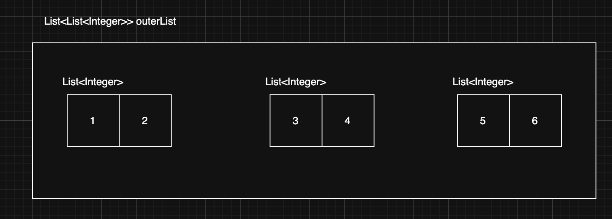
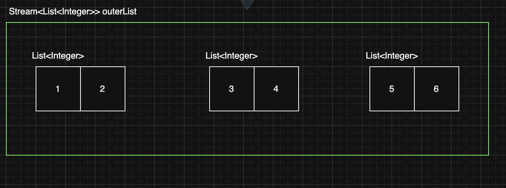
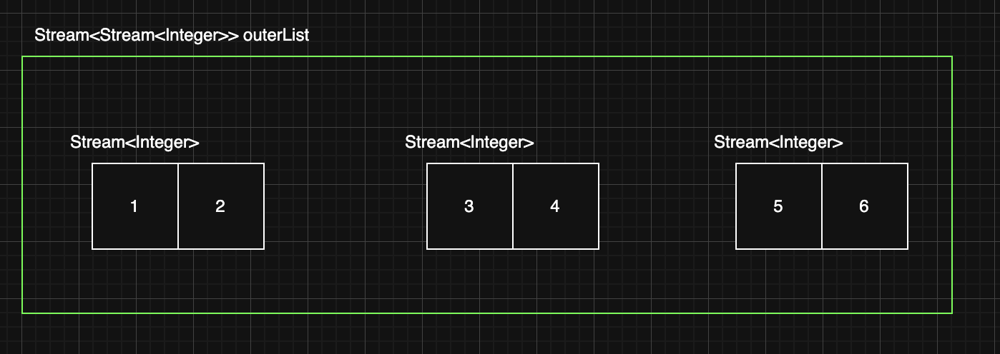
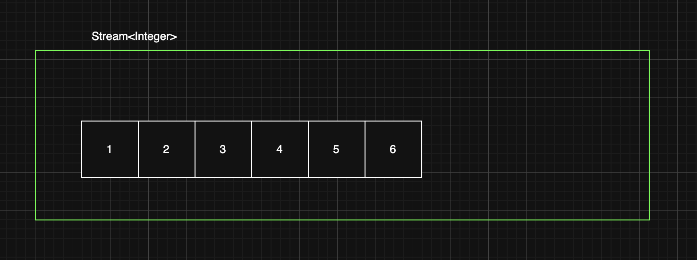
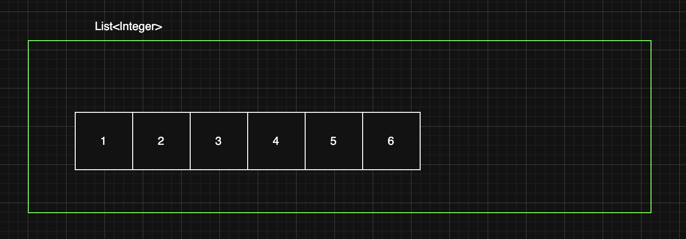

> 해당 블로그 글은 [영한님의 인프런 강의](https://inf.run/ZEStF)를 바탕으로 쓰여진 글입니다.

## 스트림 생성

<table style="width: 100%; border-collapse: collapse; font-family: -apple-system, BlinkMacSystemFont, 'Segoe UI', Roboto, Arial, sans-serif; box-shadow: 0 2px 10px rgba(0, 0, 0, 0.1);">
    <thead>
        <tr style="background-color: slateblue; color: white;">
            <th style="padding: 16px; text-align: left; font-weight: 600; border: 1px solid #3a7bc8;">생성방법</th>
            <th style="padding: 16px; text-align: left; font-weight: 600; border: 1px solid #3a7bc8;">코드 예시</th>
            <th style="padding: 16px; text-align: left; font-weight: 600; border: 1px solid #3a7bc8;">특징</th>
        </tr>
    </thead>
    <tbody>
        <tr style="background-color: white; color:black;">
            <td style="padding: 14px 16px; border: 1px solid #e0e0e0; font-weight: 600;">컬렉션</td>
            <td style="padding: 14px 16px; border: 1px solid #e0e0e0;"><code style="background-color: #f1f3f5; padding: 3px 8px; border-radius: 4px; font-family: Consolas, Monaco, monospace; color: #d63384;">list.stream()</code></td>
            <td style="padding: 14px 16px; border: 1px solid #e0e0e0;">List, Set 등 컬렉션에서 스트림 생성</td>
        </tr>
        <tr style="background-color: #f8f9fa; color:black;">
            <td style="padding: 14px 16px; border: 1px solid #e0e0e0; font-weight: 600;">배열</td>
            <td style="padding: 14px 16px; border: 1px solid #e0e0e0;"><code style="background-color: #f1f3f5; padding: 3px 8px; border-radius: 4px; font-family: Consolas, Monaco, monospace; color: #d63384;">Arrays.stream(arr)</code></td>
            <td style="padding: 14px 16px; border: 1px solid #e0e0e0;">배열에서 스트림 생성</td>
        </tr>
        <tr style="background-color: white; color:black;">
            <td style="padding: 14px 16px; border: 1px solid #e0e0e0; font-weight: 600;">Stream.of(...)</td>
            <td style="padding: 14px 16px; border: 1px solid #e0e0e0;"><code style="background-color: #f1f3f5; padding: 3px 8px; border-radius: 4px; font-family: Consolas, Monaco, monospace; color: #d63384;">Stream.of("a", "b", "c")</code></td>
            <td style="padding: 14px 16px; border: 1px solid #e0e0e0;">직접 요소를 입력해 스트림 생성</td>
        </tr>
        <tr style="background-color: #f8f9fa; color:black;">
            <td style="padding: 14px 16px; border: 1px solid #e0e0e0; font-weight: 600;">무한 스트림(iterate)</td>
            <td style="padding: 14px 16px; border: 1px solid #e0e0e0;"><code style="background-color: #f1f3f5; padding: 3px 8px; border-radius: 4px; font-family: Consolas, Monaco, monospace; color: #d63384;">Stream.iterate(0, n -> n + 2)</code></td>
            <td style="padding: 14px 16px; border: 1px solid #e0e0e0;">무한 스트림 생성 (초깃값 + 함수)</td>
        </tr>
        <tr style="background-color: white; color:black;">
            <td style="padding: 14px 16px; border: 1px solid #e0e0e0; font-weight: 600;">무한 스트림(generate)</td>
            <td style="padding: 14px 16px; border: 1px solid #e0e0e0;"><code style="background-color: #f1f3f5; padding: 3px 8px; border-radius: 4px; font-family: Consolas, Monaco, monospace; color: #d63384;">Stream.generate(Math::random)</code></td>
            <td style="padding: 14px 16px; border: 1px solid #e0e0e0;">무한 스트림 생성 (Supplier 사용)</td>
        </tr>
    </tbody>
</table>

그럼 해당 부분의 예제 코드를 살펴보자.

``` java
package stream.operation;

import java.util.Arrays;
import java.util.List;
import java.util.stream.Stream;

public class CreateStreamMain {
    public static void main(String[] args) {
        System.out.println("1. 컬렉션으로부터 생성");
        List<String> list = List.of("a", "b", "c");
        Stream<String> stream1 = list.stream();
        stream1.forEach(System.out::println);

        System.out.println("2. 배열로부터 생성");
        String[] arr = {"a", "b", "c"};
        Stream<String> stream2 = Arrays.stream(arr);
        stream2.forEach(System.out::println);

        System.out.println("3. Stream.of() 사용");
        Stream<String> stream3 = Stream.of("a", "b", "c");
        stream3.forEach(System.out::println);

        System.out.println("4. 무한 스트림 생성");
        Stream<Integer> infiniteStream = Stream.iterate(0, n -> n + 2);
        infiniteStream.limit(3)
                .forEach(System.out::println);

        System.out.println("5. 무한 스트림 생성 - generate()");
        Stream<Double> randomStream = Stream.generate(Math::random);
        randomStream.limit(3)
                .forEach(System.out::println);
    }
}
```

## 중간 연산

<table style="width: 100%; border-collapse: collapse; font-family: -apple-system, BlinkMacSystemFont, 'Segoe UI', Roboto, Arial, sans-serif; box-shadow: 0 2px 10px rgba(0, 0, 0, 0.1);">
    <thead>
        <tr style="background-color: slateblue; color: white;">
            <th style="padding: 16px; text-align: left; font-weight: 600; border: 1px solid #3a7bc8;">연산</th>
            <th style="padding: 16px; text-align: left; font-weight: 600; border: 1px solid #3a7bc8;">설명</th>
            <th style="padding: 16px; text-align: left; font-weight: 600; border: 1px solid #3a7bc8;">예시</th>
        </tr>
    </thead>
    <tbody>
        <tr style="background-color: white; color: black;">
            <td style="padding: 14px 16px; border: 1px solid #e0e0e0; font-weight: 600;">filter</td>
            <td style="padding: 14px 16px; border: 1px solid #e0e0e0;">조건에 맞는 요소만 남김</td>
            <td style="padding: 14px 16px; border: 1px solid #e0e0e0;"><code style="background-color: #f1f3f5; padding: 3px 8px; border-radius: 4px; font-family: Consolas, Monaco, monospace; color: #d63384;">stream.filter(n -> n > 5)</code></td>
        </tr>
        <tr style="background-color: #f8f9fa; color: black;">
            <td style="padding: 14px 16px; border: 1px solid #e0e0e0; font-weight: 600;">map</td>
            <td style="padding: 14px 16px; border: 1px solid #e0e0e0;">요소를 다른 형태로 변환</td>
            <td style="padding: 14px 16px; border: 1px solid #e0e0e0;"><code style="background-color: #f1f3f5; padding: 3px 8px; border-radius: 4px; font-family: Consolas, Monaco, monospace; color: #d63384;">stream.map(n -> n * 2)</code></td>
        </tr>
        <tr style="background-color: white; color: black;">
            <td style="padding: 14px 16px; border: 1px solid #e0e0e0; font-weight: 600;">flatMap</td>
            <td style="padding: 14px 16px; border: 1px solid #e0e0e0;">중첩 구조 스트림을 일차원으로 평탄화</td>
            <td style="padding: 14px 16px; border: 1px solid #e0e0e0;"><code style="background-color: #f1f3f5; padding: 3px 8px; border-radius: 4px; font-family: Consolas, Monaco, monospace; color: #d63384;">stream.flatMap(list -> list.stream())</code></td>
        </tr>
        <tr style="background-color: #f8f9fa; color: black;">
            <td style="padding: 14px 16px; border: 1px solid #e0e0e0; font-weight: 600;">distinct</td>
            <td style="padding: 14px 16px; border: 1px solid #e0e0e0;">중복 요소 제거</td>
            <td style="padding: 14px 16px; border: 1px solid #e0e0e0;"><code style="background-color: #f1f3f5; padding: 3px 8px; border-radius: 4px; font-family: Consolas, Monaco, monospace; color: #d63384;">stream.distinct()</code></td>
        </tr>
        <tr style="background-color: white; color: black;">
            <td style="padding: 14px 16px; border: 1px solid #e0e0e0; font-weight: 600;">sorted</td>
            <td style="padding: 14px 16px; border: 1px solid #e0e0e0;">요소 정렬</td>
            <td style="padding: 14px 16px; border: 1px solid #e0e0e0;"><code style="background-color: #f1f3f5; padding: 3px 8px; border-radius: 4px; font-family: Consolas, Monaco, monospace; color: #d63384;">stream.sorted() / stream.sorted(Comparator.reverseOrder())</code></td>
        </tr>
        <tr style="background-color: #f8f9fa; color: black;">
            <td style="padding: 14px 16px; border: 1px solid #e0e0e0; font-weight: 600;">peek</td>
            <td style="padding: 14px 16px; border: 1px solid #e0e0e0;">중간 처리 (로그, 디버깅)</td>
            <td style="padding: 14px 16px; border: 1px solid #e0e0e0;"><code style="background-color: #f1f3f5; padding: 3px 8px; border-radius: 4px; font-family: Consolas, Monaco, monospace; color: #d63384;">stream.peek(System.out::println)</code></td>
        </tr>
        <tr style="background-color: white; color: black;">
            <td style="padding: 14px 16px; border: 1px solid #e0e0e0; font-weight: 600;">limit</td>
            <td style="padding: 14px 16px; border: 1px solid #e0e0e0;">앞에서 N개의 요소만 추출</td>
            <td style="padding: 14px 16px; border: 1px solid #e0e0e0;"><code style="background-color: #f1f3f5; padding: 3px 8px; border-radius: 4px; font-family: Consolas, Monaco, monospace; color: #d63384;">stream.limit(5)</code></td>
        </tr>
        <tr style="background-color: #f8f9fa; color: black;">
            <td style="padding: 14px 16px; border: 1px solid #e0e0e0; font-weight: 600;">skip</td>
            <td style="padding: 14px 16px; border: 1px solid #e0e0e0;">앞에서 N개의 요소를 건너뛰고 이후 요소만 추출</td>
            <td style="padding: 14px 16px; border: 1px solid #e0e0e0;"><code style="background-color: #f1f3f5; padding: 3px 8px; border-radius: 4px; font-family: Consolas, Monaco, monospace; color: #d63384;">stream.skip(5)</code></td>
        </tr>
        <tr style="background-color: white; color: black;">
            <td style="padding: 14px 16px; border: 1px solid #e0e0e0; font-weight: 600;">takeWhile</td>
            <td style="padding: 14px 16px; border: 1px solid #e0e0e0;">조건을 만족하는 동안 요소 추출 (Java 9+)</td>
            <td style="padding: 14px 16px; border: 1px solid #e0e0e0;"><code style="background-color: #f1f3f5; padding: 3px 8px; border-radius: 4px; font-family: Consolas, Monaco, monospace; color: #d63384;">stream.takeWhile(n -> n < 5)</code></td>
        </tr>
        <tr style="background-color: #f8f9fa; color: black;">
            <td style="padding: 14px 16px; border: 1px solid #e0e0e0; font-weight: 600;">dropWhile</td>
            <td style="padding: 14px 16px; border: 1px solid #e0e0e0;">조건을 만족하는 동안 요소를 버리고 이후 요소 추출 (Java 9+)</td>
            <td style="padding: 14px 16px; border: 1px solid #e0e0e0;"><code style="background-color: #f1f3f5; padding: 3px 8px; border-radius: 4px; font-family: Consolas, Monaco, monospace; color: #d63384;">stream.dropWhile(n -> n < 5)</code></td>
        </tr>
    </tbody>
</table>

- 중간 연산은 **파이프라인** 형태로 연결할 수 있으며, **스트림을 변경**하지만 원본 데이터 자체를 바꾸지 않는다.
- 중간 연산은 **lazy**(지연, 게으르게)하게 동작하므로, **최종 연산**이 실행될 때까지 실제 처리는 일어나지 않는다.
- `peek`은 **디버깅 목적**으로 자주 사용하며, 실제 스트림의 요소값을 변경하거나 연산 결과를 반환하지는 않는다.
- `takeWhile`,`dropWhile`는 자바 9부터 추가된 기능으로, **정렬된 스트림**에서 사용할 때 유용하다.
    - 정렬되지 않은 스트림에서 쓰면 예측하기 어렵다.

## FlatMap

중간 연산의 하나인 `FlatMap`에 대해서 알아보자. `map`은 각 요소를 하나의 값으로 변환하지만, `flatMap`은 각 요소를 스트림(또는 여러 요소)으로 변환한 뒤, 그 결과를 하나의 스트림으로 평탄화(flatten)해준다. 예를 들면 아래와 같다.

아래의 이중 리스트가

``` bash
[
    [1, 2],
    [3, 4],
    [5, 6]
]
```

아래와 같이 변환 되는 것이다.

``` bash
[1, 2, 3, 4, 5, 6]
```

이제 코드를 살펴보자.

``` java
package stream.operation;

import java.util.ArrayList;
import java.util.Collection;
import java.util.List;
import java.util.stream.Stream;

public class MapVsFlatMapMain {
    public static void main(String[] args) {
        List<List<Integer>> outerList = List.of(
                List.of(1, 2),
                List.of(3, 4),
                List.of(5, 6)
        );
        System.out.println("outerList = " + outerList);

        List<Integer> forResult = new ArrayList<>();
        for (List<Integer> list : outerList) {
            for (Integer i : list) {
                forResult.add(i);
            }
        }
        System.out.println("forResult = " + forResult);

        List<Stream<Integer>> mapResult = outerList.stream()
                .map(Collection::stream)
                .toList();
        System.out.println("mapResult = " + mapResult);

        List<Integer> flatMapResult = outerList.stream()
                .flatMap(Collection::stream)
                .toList();
        System.out.println("flatMapResult = " + flatMapResult);
    }
}
```

여기서 핵심은 `map`과 `flatMap`의 차이다. 실행결과를 보면 알겠지만 차이점이 분명해진다. `map`은 `Stream`의 참조값이 들어있는 리스트가 출력이 되고 `flatMap`은 이중 구조의 리스트가 하나의 리스트로 출력이 됨을 알 수 있다. 그럼 왜 그럴까? 그림을 통해 살펴보자.

### Map



위와 같은 리스트가 존재할 때 `outerList.stream()`을 호출하면 위의 리스트가 아래와 같이 껍떼기 리스트가 `Stream`타입이 된다.



즉, 위의 그림처럼 스트림 내부에는 3개의 `List<Integer>` 요소가 존재한다. 그리고 `map()`을 호출하면 `list -> list.stream()`이 호출되면서 내부에 있는 3개의 `List<Integer>`를 `Stream<Integer>`로 변환한다. 즉, 아래의 그림처럽 요소의 타입이 변경된다.


변환된 3개의 `Stream<Integer>`가 외부 `Stream`에 포함된다. 따라서 `Stream<Stream<Integer>>`가 된다. 즉, 아래의 그림처럼 될 것이다.



이제 마지막으로 `toList()`를 호출하면 스트림을 리스트로 변환한다. 따라서 내부 요소로 `Stream<Integer>`를 3개 가지는 `List<Stream<Integer>>`로 변환된다. 그래서 실제 콘솔에 참조값들이 찍힌 이유가 `List`안에 `Stream` 객체가 들어가있기 때문이다.

### FlatMap


위와 같은 리스트가 존재할 때 `outerList.stream()`을 호출하면 위의 리스트가 아래와 같이 껍떼기 리스트가 `Stream`타입이 된다.


즉, 위의 그림처럼 스트림 내부에는 3개의 `List<Integer>` 요소가 존재한다. 그리고 `map()`을 호출하면 `list -> list.stream()`이 호출되면서 내부에 있는 3개의 `List<Integer>`를 `Stream<Integer>`로 변환한다. 즉, 아래의 그림처럽 요소의 타입이 변경된다.


그 후, `flaMap`이 적용되는데 `flatMap()`은 `Stream<Integer>` **내부의 값을 꺼내서** 외부 `Stream`에 포함한다. 여기서는 1,2,3,4,5,6의 값을 꺼낸다. 즉, `flatMap()`을 호출하면 `list -> list.stream()`이 호출되면서 내부에 있는 3개의 `List<Integer>`를 `Stream<Integer>`로 변환한다.



그리고 마지막으로 `toList()`를 호출함으로 기존 `Stream`타입을 `List`타입으로 변경한다. 즉, 아래의 그림처럼 변경될 것이다.



결론적으로 보면 `flatMap`은 **중첩 구조**(컬렉션 안의 컬렉션, 배열 안의 배열 등)를 **일차원으로 펼치는 데** 사용된다.

## Optional 간단 설명

Optional에 대해 간단하게 살펴보자.

- `Optional`은 내부에 하나의 값(`value`)을 가진다.
- `isPresent()`를 통해 그 값(`value`)이 있는지 없는지 확인할 수 있다.
- `get()`을 통해 내부의 값을 꺼낼 수 있다. 만약 값이 없다면 예외(`NoSuchElementException`)가 발생한다.
- `Optional`은 이름 그대로 필수가 아니라 옵션이라는 뜻이다.
    - 이 말은 옵셔널 내부에 값(`value`)이 있을 수도 있고 없을 수도 있다는 뜻이다.

그럼 예제 코드를 살펴보자.

``` java
package stream.operation;

import java.util.Optional;

public class OptionalSimpleMain {
    public static void main(String[] args) {
        Optional<Integer> optional1 = Optional.of(10);
        System.out.println("optional1 = " + optional1);

        if (optional1.isPresent()) {
            Integer i = optional1.get();
            System.out.println("i = " + i);
        }

        Optional<Object> optional2 = Optional.ofNullable(null);
        System.out.println("optional2 = " + optional2);

        if (optional2.isPresent()) {
            Object o = optional2.get();
            System.out.println("o = " + o);
        }

        Object o2 = optional2.get();
        System.out.println("o2 = " + o2);
    }
}
```

`Optional`은 `null` 값으로 인한 오류(`NullPointerException`)를 방지하고, 코드에서 "값이 없을 수도 있다"는 상황을 명시적으로 표현하기 위해 사용된다. 간단히 말해, `null`을 직접 다루는 대신 `Optional`을 사용하면 값의 유무를 안전하게 처리할 수 있어 코드가 더 명확하고 안정적으로 작성할 수 있다.

자세한 사항은 추후 포스팅으로 다루겠다.

## 최종 연산

최종 연산(Terminal Operation)은 스트림 파이프라인의 **끝**에 호출되어 **실제 연산을 수행**하고 결과를 만들어낸다. 최종 연산이 실행된 후에 스트림은 **소모**되어 더 이상 사용할 수 없다.

<table style="width: 100%; border-collapse: collapse; font-family: -apple-system, BlinkMacSystemFont, 'Segoe UI', Roboto, Arial, sans-serif; box-shadow: 0 2px 10px rgba(0, 0, 0, 0.1);">
    <thead>
        <tr style="background-color: slateblue; color: white;">
            <th style="padding: 16px; text-align: left; font-weight: 600; border: 1px solid #3a7bc8;">연산</th>
            <th style="padding: 16px; text-align: left; font-weight: 600; border: 1px solid #3a7bc8;">설명</th>
            <th style="padding: 16px; text-align: left; font-weight: 600; border: 1px solid #3a7bc8;">예시</th>
        </tr>
    </thead>
    <tbody>
        <tr style="background-color: white; color: black;">
            <td style="padding: 14px 16px; border: 1px solid #e0e0e0; font-weight: 600;">collect</td>
            <td style="padding: 14px 16px; border: 1px solid #e0e0e0;">Collector를 사용하여 결과 수집<br>(다양한 형태로 변환 가능)</td>
            <td style="padding: 14px 16px; border: 1px solid #e0e0e0;"><code style="background-color: #f1f3f5; padding: 3px 8px; border-radius: 4px; font-family: Consolas, Monaco, monospace; color: #d63384;">stream.collect(Collectors.toList())</code></td>
        </tr>
        <tr style="background-color: #f8f9fa; color: black;">
            <td style="padding: 14px 16px; border: 1px solid #e0e0e0; font-weight: 600;">toList (Java16+)</td>
            <td style="padding: 14px 16px; border: 1px solid #e0e0e0;">스트림을 불변 리스트로 수집</td>
            <td style="padding: 14px 16px; border: 1px solid #e0e0e0;"><code style="background-color: #f1f3f5; padding: 3px 8px; border-radius: 4px; font-family: Consolas, Monaco, monospace; color: #d63384;">stream.toList()</code></td>
        </tr>
        <tr style="background-color: white; color: black;">
            <td style="padding: 14px 16px; border: 1px solid #e0e0e0; font-weight: 600;">toArray</td>
            <td style="padding: 14px 16px; border: 1px solid #e0e0e0;">스트림을 배열로 변환</td>
            <td style="padding: 14px 16px; border: 1px solid #e0e0e0;"><code style="background-color: #f1f3f5; padding: 3px 8px; border-radius: 4px; font-family: Consolas, Monaco, monospace; color: #d63384;">stream.toArray(Integer[]::new)</code></td>
        </tr>
        <tr style="background-color: #f8f9fa; color: black;">
            <td style="padding: 14px 16px; border: 1px solid #e0e0e0; font-weight: 600;">forEach</td>
            <td style="padding: 14px 16px; border: 1px solid #e0e0e0;">각 요소에 대해 동작 수행 (반환값 없음)</td>
            <td style="padding: 14px 16px; border: 1px solid #e0e0e0;"><code style="background-color: #f1f3f5; padding: 3px 8px; border-radius: 4px; font-family: Consolas, Monaco, monospace; color: #d63384;">stream.forEach(System.out::println)</code></td>
        </tr>
        <tr style="background-color: white; color: black;">
            <td style="padding: 14px 16px; border: 1px solid #e0e0e0; font-weight: 600;">count</td>
            <td style="padding: 14px 16px; border: 1px solid #e0e0e0;">요소 개수 반환</td>
            <td style="padding: 14px 16px; border: 1px solid #e0e0e0;"><code style="background-color: #f1f3f5; padding: 3px 8px; border-radius: 4px; font-family: Consolas, Monaco, monospace; color: #d63384;">long count = stream.count();</code></td>
        </tr>
        <tr style="background-color: #f8f9fa; color: black;">
            <td style="padding: 14px 16px; border: 1px solid #e0e0e0; font-weight: 600;">reduce</td>
            <td style="padding: 14px 16px; border: 1px solid #e0e0e0;">누적 함수를 사용해<br>모든 요소를 단일 결과로 합침<br>초깃값이 없으면 Optional로 반환</td>
            <td style="padding: 14px 16px; border: 1px solid #e0e0e0;"><code style="background-color: #f1f3f5; padding: 3px 8px; border-radius: 4px; font-family: Consolas, Monaco, monospace; color: #d63384;">int sum = stream.reduce(0, Integer::sum);</code></td>
        </tr>
        <tr style="background-color: white; color: black;">
            <td style="padding: 14px 16px; border: 1px solid #e0e0e0; font-weight: 600;">min / max</td>
            <td style="padding: 14px 16px; border: 1px solid #e0e0e0;">최소값, 최댓값을 Optional로 반환</td>
            <td style="padding: 14px 16px; border: 1px solid #e0e0e0;"><code style="background-color: #f1f3f5; padding: 3px 8px; border-radius: 4px; font-family: Consolas, Monaco, monospace; color: #d63384;">stream.min(Integer::compareTo),<br>stream.max(Integer::compareTo)</code></td>
        </tr>
        <tr style="background-color: #f8f9fa; color: black;">
            <td style="padding: 14px 16px; border: 1px solid #e0e0e0; font-weight: 600;">findFirst</td>
            <td style="padding: 14px 16px; border: 1px solid #e0e0e0;">조건에 맞는 첫 번째 요소 (Optional 반환)</td>
            <td style="padding: 14px 16px; border: 1px solid #e0e0e0;"><code style="background-color: #f1f3f5; padding: 3px 8px; border-radius: 4px; font-family: Consolas, Monaco, monospace; color: #d63384;">stream.findFirst()</code></td>
        </tr>
        <tr style="background-color: white; color: black;">
            <td style="padding: 14px 16px; border: 1px solid #e0e0e0; font-weight: 600;">findAny</td>
            <td style="padding: 14px 16px; border: 1px solid #e0e0e0;">조건에 맞는 아무 요소나 (Optional 반환)</td>
            <td style="padding: 14px 16px; border: 1px solid #e0e0e0;"><code style="background-color: #f1f3f5; padding: 3px 8px; border-radius: 4px; font-family: Consolas, Monaco, monospace; color: #d63384;">stream.findAny()</code></td>
        </tr>
        <tr style="background-color: #f8f9fa; color: black;">
            <td style="padding: 14px 16px; border: 1px solid #e0e0e0; font-weight: 600;">anyMatch</td>
            <td style="padding: 14px 16px; border: 1px solid #e0e0e0;">하나라도 조건을 만족하는지 (boolean)</td>
            <td style="padding: 14px 16px; border: 1px solid #e0e0e0;"><code style="background-color: #f1f3f5; padding: 3px 8px; border-radius: 4px; font-family: Consolas, Monaco, monospace; color: #d63384;">stream.anyMatch(n -> n > 5)</code></td>
        </tr>
        <tr style="background-color: white; color: black;">
            <td style="padding: 14px 16px; border: 1px solid #e0e0e0; font-weight: 600;">allMatch</td>
            <td style="padding: 14px 16px; border: 1px solid #e0e0e0;">모두 조건을 만족하는지 (boolean)</td>
            <td style="padding: 14px 16px; border: 1px solid #e0e0e0;"><code style="background-color: #f1f3f5; padding: 3px 8px; border-radius: 4px; font-family: Consolas, Monaco, monospace; color: #d63384;">stream.allMatch(n -> n > 0)</code></td>
        </tr>
        <tr style="background-color: #f8f9fa; color: black;">
            <td style="padding: 14px 16px; border: 1px solid #e0e0e0; font-weight: 600;">noneMatch</td>
            <td style="padding: 14px 16px; border: 1px solid #e0e0e0;">하나도 조건을 만족하지 않는지<br>(boolean)</td>
            <td style="padding: 14px 16px; border: 1px solid #e0e0e0;"><code style="background-color: #f1f3f5; padding: 3px 8px; border-radius: 4px; font-family: Consolas, Monaco, monospace; color: #d63384;">stream.noneMatch(n -> n < 0)</code></td>
        </tr>
    </tbody>
</table>

- 최종 연산이 호출되면, 그 동안 정의된 **모든 중간 연산이 한 번에** 적용되어 결과를 만든다.
- 최종 연산을 한 번 수행하면, **스트림은 재사용할 수 없다.**
- `reduce`를 사용할 때 초깃값을 지정하면, 스트림이 비어 있어도 **초깃값**이 결과가 된다. 초깃값이 없으면 `Optional`을 반환한다.
    - 초깃값이 없는데, 스트림이 비어 있을 경우 빈 `Optional`(`Optional.empty()`)을 반환한다.
- `findFirst()`,`findAny()`도 결과가 없을 수 있으므로 **Optional**을 통해 값 유무를 확인해야 한다.

## 기본형 특화 스트림

스트림 API에는 **기본형(primitive) 특화 스트림**이 존재한다. 자바에서는 `IntStream`, `LongStream`, `DoubleStream` 세 가지 형태를 제공하여 **기본 자료형(int, long, double)에 특화된 기능**을 사용할 수 있게 한다.

### 기본 특화 스트림 종류

<table style="width: 100%; border-collapse: collapse; font-family: -apple-system, BlinkMacSystemFont, 'Segoe UI', Roboto, Arial, sans-serif; box-shadow: 0 2px 10px rgba(0, 0, 0, 0.1);">
    <thead>
        <tr style="background-color: slateblue; color: white;">
            <th style="padding: 16px; text-align: left; font-weight: 600; border: 1px solid #3a7bc8;">스트림 타입</th>
            <th style="padding: 16px; text-align: left; font-weight: 600; border: 1px solid #3a7bc8;">대상 원시 타입</th>
            <th style="padding: 16px; text-align: left; font-weight: 600; border: 1px solid #3a7bc8;">생성 예시</th>
        </tr>
    </thead>
    <tbody>
        <tr style="background-color: white; color: black;">
            <td style="padding: 14px 16px; border: 1px solid #e0e0e0; font-weight: 600;">IntStream</td>
            <td style="padding: 14px 16px; border: 1px solid #e0e0e0;">int</td>
            <td style="padding: 14px 16px; border: 1px solid #e0e0e0;"><code style="background-color: #f1f3f5; padding: 3px 8px; border-radius: 4px; font-family: Consolas, Monaco, monospace; color: #d63384;">IntStream.of(1, 2, 3), IntStream.range(1, 10), mapToInt(...)</code></td>
        </tr>
        <tr style="background-color: #f8f9fa; color: black;">
            <td style="padding: 14px 16px; border: 1px solid #e0e0e0; font-weight: 600;">LongStream</td>
            <td style="padding: 14px 16px; border: 1px solid #e0e0e0;">long</td>
            <td style="padding: 14px 16px; border: 1px solid #e0e0e0;"><code style="background-color: #f1f3f5; padding: 3px 8px; border-radius: 4px; font-family: Consolas, Monaco, monospace; color: #d63384;">LongStream.of(10L, 20L), LongStream.range(1, 10), mapToLong(...)</code></td>
        </tr>
        <tr style="background-color: white; color: black;">
            <td style="padding: 14px 16px; border: 1px solid #e0e0e0; font-weight: 600;">DoubleStream</td>
            <td style="padding: 14px 16px; border: 1px solid #e0e0e0;">double</td>
            <td style="padding: 14px 16px; border: 1px solid #e0e0e0;"><code style="background-color: #f1f3f5; padding: 3px 8px; border-radius: 4px; font-family: Consolas, Monaco, monospace; color: #d63384;">DoubleStream.of(3.14, 2.78), DoubleStream.generate(Math::random), mapToDouble(...)</code></td>
        </tr>
    </tbody>
</table>

### 주요 기능 및 메서드

기본형 특화 스트림은 **합계**, **평균** 등 자주 사용하는 연산을 **편리한 메서드**로 제공한다. 또한, **타입 변환**과 **박싱/언박싱** 메서드도 제공하여 다른 스트림과 연계해 작업하기 수월하다. 참고로 기본형 특화 스트림은 `int`, `long`, `double` 같은 숫자를 사용한다. 따라서 숫자 연산에 특화된 메서드를 제공할 수 있다.

<table style="width: 100%; border-collapse: collapse; font-family: -apple-system, BlinkMacSystemFont, 'Segoe UI', Roboto, Arial, sans-serif; box-shadow: 0 2px 10px rgba(0, 0, 0, 0.1);">
    <thead>
        <tr style="background-color: slateblue; color: white;">
            <th style="padding: 16px; text-align: left; font-weight: 600; border: 1px solid #3a7bc8;">메서드 / 기능</th>
            <th style="padding: 16px; text-align: left; font-weight: 600; border: 1px solid #3a7bc8;">설명</th>
            <th style="padding: 16px; text-align: left; font-weight: 600; border: 1px solid #3a7bc8;">예시</th>
        </tr>
    </thead>
    <tbody>
        <tr style="background-color: white; color: black;">
            <td style="padding: 14px 16px; border: 1px solid #e0e0e0; font-weight: 600;">sum()</td>
            <td style="padding: 14px 16px; border: 1px solid #e0e0e0;">모든 요소의 합계를 구한다.</td>
            <td style="padding: 14px 16px; border: 1px solid #e0e0e0;"><code style="background-color: #f1f3f5; padding: 3px 8px; border-radius: 4px; font-family: Consolas, Monaco, monospace; color: #d63384;">int total = IntStream.of(1, 2, 3).sum();</code></td>
        </tr>
        <tr style="background-color: #f8f9fa; color: black;">
            <td style="padding: 14px 16px; border: 1px solid #e0e0e0; font-weight: 600;">average()</td>
            <td style="padding: 14px 16px; border: 1px solid #e0e0e0;">모든 요소의 평균을 구한다.<br>OptionalDouble을 반환.</td>
            <td style="padding: 14px 16px; border: 1px solid #e0e0e0;"><code style="background-color: #f1f3f5; padding: 3px 8px; border-radius: 4px; font-family: Consolas, Monaco, monospace; color: #d63384;">double avg = IntStream.range(1, 5).average().getAsDouble();</code></td>
        </tr>
        <tr style="background-color: white; color: black;">
            <td style="padding: 14px 16px; border: 1px solid #e0e0e0; font-weight: 600;">summaryStatistics()</td>
            <td style="padding: 14px 16px; border: 1px solid #e0e0e0;">최소값, 최댓값, 합계, 개수, 평균<br>등이 담긴 IntSummaryStatistics<br>(또는 Long/Double) 객체 반환</td>
            <td style="padding: 14px 16px; border: 1px solid #e0e0e0;"><code style="background-color: #f1f3f5; padding: 3px 8px; border-radius: 4px; font-family: Consolas, Monaco, monospace; color: #d63384;">IntSummaryStatistics stats = IntStream.range(1,5).summaryStatistics();</code></td>
        </tr>
        <tr style="background-color: #f8f9fa; color: black;">
            <td style="padding: 14px 16px; border: 1px solid #e0e0e0; font-weight: 600;">mapToLong()<br>mapToDouble()</td>
            <td style="padding: 14px 16px; border: 1px solid #e0e0e0;">타입 변환 : IntStream → LongStream,<br>DoubleStream ...</td>
            <td style="padding: 14px 16px; border: 1px solid #e0e0e0;"><code style="background-color: #f1f3f5; padding: 3px 8px; border-radius: 4px; font-family: Consolas, Monaco, monospace; color: #d63384;">LongStream ls = IntStream.of(1,2).mapToLong(i -> i * 10L);</code></td>
        </tr>
        <tr style="background-color: white; color: black;">
            <td style="padding: 14px 16px; border: 1px solid #e0e0e0; font-weight: 600;">mapToObj()</td>
            <td style="padding: 14px 16px; border: 1px solid #e0e0e0;">객체 스트림으로 변환 : 기본형 → 참조형</td>
            <td style="padding: 14px 16px; border: 1px solid #e0e0e0;"><code style="background-color: #f1f3f5; padding: 3px 8px; border-radius: 4px; font-family: Consolas, Monaco, monospace; color: #d63384;">Stream&lt;<span style="color: #0969da;">String</span>&gt; s = IntStream.range(1,5).mapToObj(i -> "No: "+i);</code></td>
        </tr>
        <tr style="background-color: #f8f9fa; color: black;">
            <td style="padding: 14px 16px; border: 1px solid #e0e0e0; font-weight: 600;">boxed()</td>
            <td style="padding: 14px 16px; border: 1px solid #e0e0e0;">기본형 특화 스트림을<br>박싱(Wrapper)된 객체 스트림으로 변환</td>
            <td style="padding: 14px 16px; border: 1px solid #e0e0e0;"><code style="background-color: #f1f3f5; padding: 3px 8px; border-radius: 4px; font-family: Consolas, Monaco, monospace; color: #d63384;">Stream&lt;<span style="color: #0969da;">Integer</span>&gt; si = IntStream.range(1,5).boxed();</code></td>
        </tr>
        <tr style="background-color: white; color: black;">
            <td style="padding: 14px 16px; border: 1px solid #e0e0e0; font-weight: 600;">sum(), min(),<br>max(), count()</td>
            <td style="padding: 14px 16px; border: 1px solid #e0e0e0;">합계, 최소값, 최댓값, 개수를 반환<br>(타입별로 int/long/double 반환)</td>
            <td style="padding: 14px 16px; border: 1px solid #e0e0e0;"><code style="background-color: #f1f3f5; padding: 3px 8px; border-radius: 4px; font-family: Consolas, Monaco, monospace; color: #d63384;">long cnt = LongStream.of(1,2,3).count();</code></td>
        </tr>
    </tbody>
</table>

### 성능 - 전통적인 for문 vs 스트림 vs 기본형 특화 스트림

- 전통적인 for문이 보통 가장 빠르다.
- 스트림보다 전통적인 for 문이 1.5배 ~ 2배정도 빠르다.
    - 여기서 말하는 스트림은 `Integer`같은 객체를 다루는 `Stream`을 말한다.
    - 박싱/언박싱 오버헤드가 발생한다.
- 기본형 특화 스트림(`IntStream`등)은 전통적인 for문에 가까운 성능을 보여준다.
    - 전통적인 for문과 거의 비슷하거나 전통적인 for문이 10% ~ 30% 정도 더 빠르다.
    - 박싱/언박싱 오버헤드를 피할 수 있다.
    - 내부적으로 최적화된 연산을 수행할 수 있다.

### 실무 선택

- 이런 성능 차이는 대부분의 일반적인 애플리케이션에서는 거의 차이가 없다. 이런 차이를 느끼려면 한 번에 사용하는 루프가 최소한 수천만 건 이상이어야 한다. 그리고 이런 루프를 많이 반복해야 한다.
- 박싱/언박싱을 많이 유발하지 않는 상황이라면 일반 스트림과 기본형 특화 스트림 간 성능 차이는 그리 크지 않을 수 있다.
- 반면 대규모 데이터 처리나 반복 횟수가 많을 때는 기본형 스트림이 효과적일 수 있으며, 성능 극대화가 필요한 상황에서는 여전히 for 루프가 더 빠른 경우가 많다. 결국 최적의 선택은 구현의 가독성, 유지보수성등을 함께 고려해서 결정해야 한다.
- 정리하면 실제 프로젝트에서는 극단적인 성능이 필요한 경우가 아니라면, 코드의 가독성과 유지보수성을 위해 스트림 API(스트림, 기본형 특화 스트림)를 사용하는 것이 보통 더 나은 선택이다.

> 잘못된 지식이 있을 경우 댓글로 남겨주시면 빠르게 반영하겠습니다!