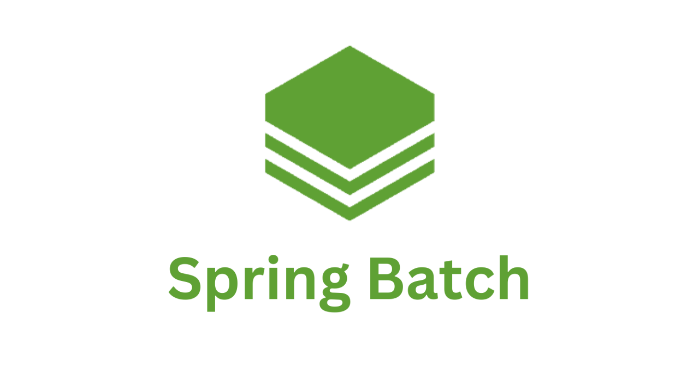

> 해당 블로그 글은 [정수원님의 인프런 강의](https://inf.run/fDUHu)를 바탕으로 쓰여진 글입니다.

## 개발 환경 및 선수 지식

해당 포스팅에 대하여 진행 할 프로젝트의 개발 환경과 선수 지식들을 간략히 소개해보겠다.

### 개발환경

- JDK1.8 이상
- Spring Boot 2.5.1 이상
- DB - H2, MySQL
- IDE - IntelliJ
- Maven or Gradle

### 선수지식

- Spring Boot
- Spring Data JPA
- Spring JDBC
- MySQL
- Lombok

강의에서는 위와 같이 다룬다고 한다. 하지만 본 필자는 JDK21과 Gradle을 사용할 예정이고 부트도 spring boot 3.5이상을 사용해보려고 한다. 독자들도 이 점을 참고해서 봐주시면 감사할 것 같다.

> 잘못된 지식이 있을 경우 댓글로 남겨주시면 빠르게 반영하겠습니다!