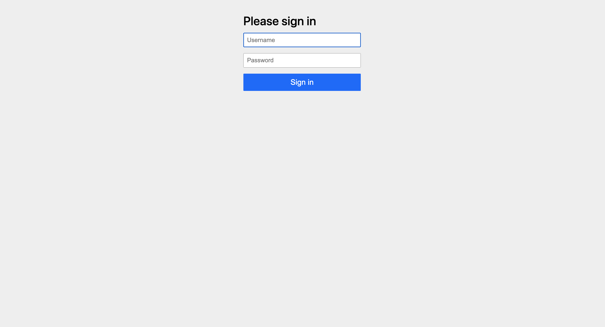
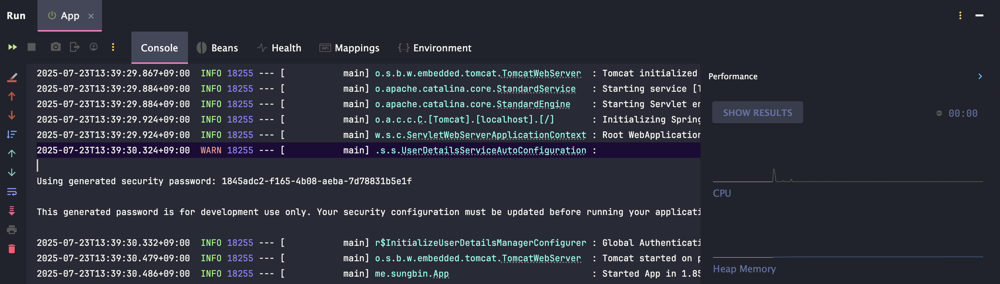
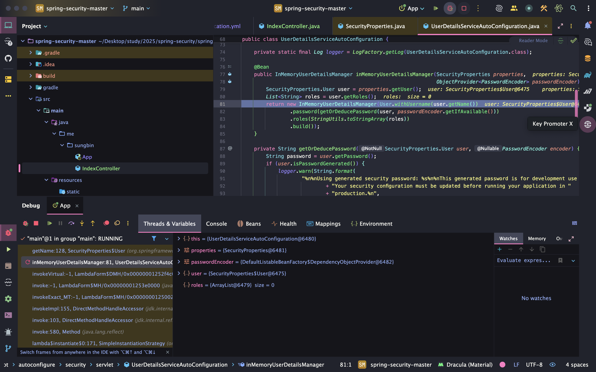

> 해당 블로그 글은 [정수원님의 인프런 강의](https://inf.run/63sgw)를 바탕으로 쓰여진 글입니다.

## 프로젝트 생성 / 의존성 추가

먼저 프로젝트를 생성해보자. 생성 방법은 다 아실것이라 생각하시고 인텔리제이의 스프링 프로젝트를 생성한 후, 의존성을 `spring web`과 `spring security`를 추가해주자. 빌드 툴은 `gradle`로 진행한다. 생성된 `build.gradle`은 아래와 같다.

``` groovy
plugins {
    id 'java'
    id 'org.springframework.boot' version '3.5.3'
    id 'io.spring.dependency-management' version '1.1.7'
}

group = 'me.sungbin'
version = '0.0.1-SNAPSHOT'

java {
    toolchain {
        languageVersion = JavaLanguageVersion.of(21)
    }
}

repositories {
    mavenCentral()
}

dependencies {
    implementation 'org.springframework.boot:spring-boot-starter-security'
    implementation 'org.springframework.boot:spring-boot-starter-web'
    testImplementation 'org.springframework.boot:spring-boot-starter-test'
    testImplementation 'org.springframework.security:spring-security-test'
    testRuntimeOnly 'org.junit.platform:junit-platform-launcher'
}

tasks.named('test') {
    useJUnitPlatform()
}
```

그러면 먼저 컨트롤러 하나를 만들어두고 해당 url로 접속을 해보자. 필자는 아래와 같이 컨트롤러를 생성하여 접속을 진행하였다.

``` java
package me.sungbin;

import org.springframework.web.bind.annotation.GetMapping;
import org.springframework.web.bind.annotation.RestController;

@RestController
public class IndexController {

    @GetMapping("/")
    public String index() {
        return "index";
    }
}
```

이렇게 작성 후, 서버를 기동시켜서 `http://localhost:8080`으로 접속을 해보자. 그러면 이상하게 아래와 같은 로그인 페이지가 나올 것이다.



희한하다. 우리는 이런 로그인 페이지를 접속한 적도 없는데 갑자기 로그인하라고 뜬다. 왜 그럴까? 결론부터 먼저 말하자면 스프링 시큐리티가 자동으로 설정해준 것 때문이다. 그럼 이 기능에 대해 먼저 살펴보도록 하자.

### 자동 설정에 의한 기본 보안 작동

서버가 기동되면 스프링 시큐리티에서 초기화 작업이 이루어지며 이후, 보안 설정 작업이 진행된다. **우리는 별도의 설정이나 코드를 작성하지 않았지만 기본적인 웹 보안 기능이 현재 시스템에 연동되어 작동되는 것이다.** 그러면 이 기본적인 웹 보안 기능은 무엇일까? 바로 아래와 같다.

- 기본적으로 모든 요청에 대하여 인증 여부를 검증하고 인증이 승인되어야 자원에 접근이 가능하다.
- 인증 방식은 폼 로그인 방식과 httpBasic 로그인 방식을 지원한다.
- 인증을 시도할 수 있는 로그인 페이지가 자동적으로 생성되어 렌더링된다.
- 인증 승인이 이루어질 수 있도록 1개의 계정이 기본적으로 제공된다.
  - `SecurityProperties` 설정 클래스에서 username과 password를 생성한다.
  - username: user
  - password: 랜덤 문자열

그리고 이런 인증 체계를 생성해주고 세팅해주는 곳이 바로 스프링 시큐리티의 `SpringBootWebSecurityConfiguration` 클래스이다. 즉, 해당 클래스는 자동 설정에 의한 기본 보안 설정 클래스를 생성하는 곳이라고 생각하면 된다.

하지만 이렇게 기본적으로 생성해주는 인증체계는 실제 실무에서는 사용할 수 없다. 왜냐하면 계정 추가가 불가능하다. 실제 사용하려면 여러 계정이 있어야 할텐데 1개의 계정만 제공해주므로 불가능한 것이다. 다음으로 계정 별 권한 설정을 할 수가 없다. 보통 실무에서는 계정 별로 권한을 설정하는데 기본 보안에서는 권한을 설정할 수가 없다. 마지막으로, 시스템에서 필요로 하는 더 세부적이고 추가적인 보안기능이 필요할 때가 문제가 된다.

그러면 한번 `SecurityProperties`와 `SpringBootWebSecurityConfiguration` 클래스를 살펴보도록 하자.

``` java
/*
 * Copyright 2012-2025 the original author or authors.
 *
 * Licensed under the Apache License, Version 2.0 (the "License");
 * you may not use this file except in compliance with the License.
 * You may obtain a copy of the License at
 *
 *      https://www.apache.org/licenses/LICENSE-2.0
 *
 * Unless required by applicable law or agreed to in writing, software
 * distributed under the License is distributed on an "AS IS" BASIS,
 * WITHOUT WARRANTIES OR CONDITIONS OF ANY KIND, either express or implied.
 * See the License for the specific language governing permissions and
 * limitations under the License.
 */

package org.springframework.boot.autoconfigure.security;

import java.util.ArrayList;
import java.util.EnumSet;
import java.util.List;
import java.util.Set;
import java.util.UUID;

import org.springframework.boot.context.properties.ConfigurationProperties;
import org.springframework.boot.web.servlet.DispatcherType;
import org.springframework.boot.web.servlet.filter.OrderedFilter;
import org.springframework.core.Ordered;
import org.springframework.util.StringUtils;

/**
 * Configuration properties for Spring Security.
 *
 * @author Dave Syer
 * @author Andy Wilkinson
 * @author Madhura Bhave
 * @since 1.0.0
 */
@ConfigurationProperties("spring.security")
public class SecurityProperties {

	/**
	 * Order applied to the {@code SecurityFilterChain} that is used to configure basic
	 * authentication for application endpoints. Create your own
	 * {@code SecurityFilterChain} if you want to add your own authentication for all or
	 * some of those endpoints.
	 */
	public static final int BASIC_AUTH_ORDER = Ordered.LOWEST_PRECEDENCE - 5;

	/**
	 * Order applied to the {@code WebSecurityCustomizer} that ignores standard static
	 * resource paths.
	 * @deprecated since 3.5.0 for removal in 4.0.0 since Spring Security no longer
	 * recommends using the {@code .ignoring()} method
	 */
	@Deprecated(since = "3.5.0", forRemoval = true)
	public static final int IGNORED_ORDER = Ordered.HIGHEST_PRECEDENCE;

	/**
	 * Default order of Spring Security's Filter in the servlet container (i.e. amongst
	 * other filters registered with the container). There is no connection between this
	 * and the {@code @Order} on a {@code SecurityFilterChain}.
	 */
	public static final int DEFAULT_FILTER_ORDER = OrderedFilter.REQUEST_WRAPPER_FILTER_MAX_ORDER - 100;

	private final Filter filter = new Filter();

	private final User user = new User();

	public User getUser() {
		return this.user;
	}

	public Filter getFilter() {
		return this.filter;
	}

	public static class Filter {

		/**
		 * Security filter chain order for Servlet-based web applications.
		 */
		private int order = DEFAULT_FILTER_ORDER;

		/**
		 * Security filter chain dispatcher types for Servlet-based web applications.
		 */
		private Set<DispatcherType> dispatcherTypes = EnumSet.allOf(DispatcherType.class);

		public int getOrder() {
			return this.order;
		}

		public void setOrder(int order) {
			this.order = order;
		}

		public Set<DispatcherType> getDispatcherTypes() {
			return this.dispatcherTypes;
		}

		public void setDispatcherTypes(Set<DispatcherType> dispatcherTypes) {
			this.dispatcherTypes = dispatcherTypes;
		}

	}

	public static class User {

		/**
		 * Default user name.
		 */
		private String name = "user";

		/**
		 * Password for the default user name.
		 */
		private String password = UUID.randomUUID().toString();

		/**
		 * Granted roles for the default user name.
		 */
		private List<String> roles = new ArrayList<>();

		private boolean passwordGenerated = true;

		public String getName() {
			return this.name;
		}

		public void setName(String name) {
			this.name = name;
		}

		public String getPassword() {
			return this.password;
		}

		public void setPassword(String password) {
			if (!StringUtils.hasLength(password)) {
				return;
			}
			this.passwordGenerated = false;
			this.password = password;
		}

		public List<String> getRoles() {
			return this.roles;
		}

		public void setRoles(List<String> roles) {
			this.roles = new ArrayList<>(roles);
		}

		public boolean isPasswordGenerated() {
			return this.passwordGenerated;
		}

	}

}
```

`SecurityProperties` 클래스는 설정 파일이며 해당 파일에서 `User` 객체를 설정을 해준다. 해당 클래스에 정적 중첩 클래스로 정의되어 있으며 필드를 살펴보면 알듯이 `username`은 user로 `password`는 랜덤 문자열로 초기화해준 것을 볼 수 있다. 그래서 우리는 로그인 페이지가 나올때 `username`을 user로 `password`를 콘솔창에 출력된 문자열을 입력해주면 정상 접속된다.




그러면 이 초기화 과정이 어떻게 동작할까? `User` 클래스에 `getName`과 `getPassword`에 디버깅을 찍어서 확인해본 결과 `InMemoryUserDetailsManager`에서 생성해주는 것을 볼 수 있다.



일단 이 정도로 확인을 하고 이제 다음 설정 클래스인 `SpringBootWebSecurityConfiguration`을 살펴보도록 하자.

``` java
/*
 * Copyright 2012-2023 the original author or authors.
 *
 * Licensed under the Apache License, Version 2.0 (the "License");
 * you may not use this file except in compliance with the License.
 * You may obtain a copy of the License at
 *
 *      https://www.apache.org/licenses/LICENSE-2.0
 *
 * Unless required by applicable law or agreed to in writing, software
 * distributed under the License is distributed on an "AS IS" BASIS,
 * WITHOUT WARRANTIES OR CONDITIONS OF ANY KIND, either express or implied.
 * See the License for the specific language governing permissions and
 * limitations under the License.
 */

package org.springframework.boot.autoconfigure.security.servlet;

import org.springframework.boot.autoconfigure.condition.ConditionalOnClass;
import org.springframework.boot.autoconfigure.condition.ConditionalOnMissingBean;
import org.springframework.boot.autoconfigure.condition.ConditionalOnWebApplication;
import org.springframework.boot.autoconfigure.condition.ConditionalOnWebApplication.Type;
import org.springframework.boot.autoconfigure.security.ConditionalOnDefaultWebSecurity;
import org.springframework.boot.autoconfigure.security.SecurityProperties;
import org.springframework.context.annotation.Bean;
import org.springframework.context.annotation.Configuration;
import org.springframework.core.annotation.Order;
import org.springframework.security.config.BeanIds;
import org.springframework.security.config.annotation.web.builders.HttpSecurity;
import org.springframework.security.config.annotation.web.configuration.EnableWebSecurity;
import org.springframework.security.web.SecurityFilterChain;

import static org.springframework.security.config.Customizer.withDefaults;

/**
 * {@link Configuration @Configuration} class securing servlet applications.
 *
 * @author Madhura Bhave
 */
@Configuration(proxyBeanMethods = false)
@ConditionalOnWebApplication(type = Type.SERVLET)
class SpringBootWebSecurityConfiguration {

	/**
	 * The default configuration for web security. It relies on Spring Security's
	 * content-negotiation strategy to determine what sort of authentication to use. If
	 * the user specifies their own {@link SecurityFilterChain} bean, this will back-off
	 * completely and the users should specify all the bits that they want to configure as
	 * part of the custom security configuration.
	 */
	@Configuration(proxyBeanMethods = false)
	@ConditionalOnDefaultWebSecurity
	static class SecurityFilterChainConfiguration {

		@Bean
		@Order(SecurityProperties.BASIC_AUTH_ORDER)
		SecurityFilterChain defaultSecurityFilterChain(HttpSecurity http) throws Exception {
			http.authorizeHttpRequests((requests) -> requests.anyRequest().authenticated());
			http.formLogin(withDefaults());
			http.httpBasic(withDefaults());
			return http.build();
		}

	}

	/**
	 * Adds the {@link EnableWebSecurity @EnableWebSecurity} annotation if Spring Security
	 * is on the classpath. This will make sure that the annotation is present with
	 * default security auto-configuration and also if the user adds custom security and
	 * forgets to add the annotation. If {@link EnableWebSecurity @EnableWebSecurity} has
	 * already been added or if a bean with name
	 * {@value BeanIds#SPRING_SECURITY_FILTER_CHAIN} has been configured by the user, this
	 * will back-off.
	 */
	@Configuration(proxyBeanMethods = false)
	@ConditionalOnMissingBean(name = BeanIds.SPRING_SECURITY_FILTER_CHAIN)
	@ConditionalOnClass(EnableWebSecurity.class)
	@EnableWebSecurity
	static class WebSecurityEnablerConfiguration {

	}

}
```

코드를 확인해보면 `SecurityFilterChainConfiguration`이라는 중첩 클래스에서 조건을 걸고 있는것이 보인다. 바로 `ConditionalOnDefaultWebSecurity` 어노테이션을 통해서 말이다. 해당 어노테이션으로 가보자.

``` java
/*
 * Copyright 2012-2020 the original author or authors.
 *
 * Licensed under the Apache License, Version 2.0 (the "License");
 * you may not use this file except in compliance with the License.
 * You may obtain a copy of the License at
 *
 *      https://www.apache.org/licenses/LICENSE-2.0
 *
 * Unless required by applicable law or agreed to in writing, software
 * distributed under the License is distributed on an "AS IS" BASIS,
 * WITHOUT WARRANTIES OR CONDITIONS OF ANY KIND, either express or implied.
 * See the License for the specific language governing permissions and
 * limitations under the License.
 */

package org.springframework.boot.autoconfigure.security;

import java.lang.annotation.Documented;
import java.lang.annotation.ElementType;
import java.lang.annotation.Retention;
import java.lang.annotation.RetentionPolicy;
import java.lang.annotation.Target;

import org.springframework.context.annotation.Conditional;

/**
 * {@link Conditional @Conditional} that only matches when web security is available and
 * the user has not defined their own configuration.
 *
 * @author Phillip Webb
 * @since 2.4.0
 */
@Target({ ElementType.TYPE, ElementType.METHOD })
@Retention(RetentionPolicy.RUNTIME)
@Documented
@Conditional(DefaultWebSecurityCondition.class)
public @interface ConditionalOnDefaultWebSecurity {

}
```

그러면 `@Conditional` 어노테이션으로 `DefaultWebSecurityCondition`이 전부 참일때 실행되는 것을 볼 수 있을 것이다. 그러면 `DefaultWebSecurityCondition`으로 가보자.

``` java
/*
 * Copyright 2012-2022 the original author or authors.
 *
 * Licensed under the Apache License, Version 2.0 (the "License");
 * you may not use this file except in compliance with the License.
 * You may obtain a copy of the License at
 *
 *      https://www.apache.org/licenses/LICENSE-2.0
 *
 * Unless required by applicable law or agreed to in writing, software
 * distributed under the License is distributed on an "AS IS" BASIS,
 * WITHOUT WARRANTIES OR CONDITIONS OF ANY KIND, either express or implied.
 * See the License for the specific language governing permissions and
 * limitations under the License.
 */

package org.springframework.boot.autoconfigure.security;

import org.springframework.boot.autoconfigure.condition.AllNestedConditions;
import org.springframework.boot.autoconfigure.condition.ConditionalOnClass;
import org.springframework.boot.autoconfigure.condition.ConditionalOnMissingBean;
import org.springframework.context.annotation.Condition;
import org.springframework.security.config.annotation.web.builders.HttpSecurity;
import org.springframework.security.web.SecurityFilterChain;

/**
 * {@link Condition} for
 * {@link ConditionalOnDefaultWebSecurity @ConditionalOnDefaultWebSecurity}.
 *
 * @author Phillip Webb
 */
class DefaultWebSecurityCondition extends AllNestedConditions {

	DefaultWebSecurityCondition() {
		super(ConfigurationPhase.REGISTER_BEAN);
	}

	@ConditionalOnClass({ SecurityFilterChain.class, HttpSecurity.class })
	static class Classes {

	}

	@ConditionalOnMissingBean({ SecurityFilterChain.class })
	static class Beans {

	}

}
```

그러면 2가지 조건이 나오는데 첫번째는 `SecurityFulterChain`과 `HttpSecurity`가 클래스 패스에 있는 조건이다. 해당 클래스들은 스프링 시큐리티 의존성을 추가하면 자동으로 해당 클래스들이 클래스 패스에 존재하게 되니 참이다. 두번째 조건은 `SecurityFilterChain` 인터페이스로 구현된 빈이 존재하지 않는지를 확인한다. 우리는 해당 인터페이스로 빈을 정의한 적이 없다. 따라서 이 조건도 참이기에 해당 조건이 전부 참이 되고 `defaultSecurityFilterChain` 메서드가 실행이 되게 되는 것이다. 그래서 모든 요청에 전부 인증이 필요하게 되는 것이고 해당 인증 방식으로 formLogin 방식과 httpBasic 방식을 이용하는 것이다. 우리는 구동을 웹을 통해서 했기에 이 2가지 방식 중에 formLogin 방식이 실행되는 것이다.

## SecurityBuilder / SecurityConfigurer

- `SecurityBuilder`는 빌더 클래스로, 웹 보안을 구성하는 빈 객체와 설정 클래스들을 생성하는 역할을 하며 대표적인 구현체로는 `WebSecurity`, `HttpSecurity`등이 존재한다.
- `SecurityConfigurer`는 http 요청과 관련된 보안 처리를 담당하는 필터들을 생성하고 여러 초기화 설정에 관여한다.
- `SecurityBuilder`는 `SecurityConfigurer`를 참조하고 있으며 인증 및 인가 초기화 작업은 `SecurityConfigurer`에 의해 진행된다.

즉, 내용을 정리하자면 자동 설정 클래스에 의해서 `build` 메서드를 통하여 `SecurityBuilder` 인터페이스를 구현한 구현체 클래스가 생성이 되며 해당 구현 클래스가 설정 클래스들을 생성하게 된다. 즉, `SecuirtyConfigurer` 구현 클래스들을 생성하고 추가한다. 그리고 각 생성된 `SecurityConfigurer` 구현 클래스에서 `init` 메서드와 `configure` 메서드에서 초기화 작업을 진행하면서 다양한 필터들을 생성하게 된다.

그러면 해당 부분에 대하여 코드를 통해 살펴보도록 하자.

``` java
/*
 * Copyright 2002-2013 the original author or authors.
 *
 * Licensed under the Apache License, Version 2.0 (the "License");
 * you may not use this file except in compliance with the License.
 * You may obtain a copy of the License at
 *
 *      https://www.apache.org/licenses/LICENSE-2.0
 *
 * Unless required by applicable law or agreed to in writing, software
 * distributed under the License is distributed on an "AS IS" BASIS,
 * WITHOUT WARRANTIES OR CONDITIONS OF ANY KIND, either express or implied.
 * See the License for the specific language governing permissions and
 * limitations under the License.
 */

package org.springframework.security.config.annotation;

/**
 * Interface for building an Object
 *
 * @param <O> The type of the Object being built
 * @author Rob Winch
 * @since 3.2
 */
public interface SecurityBuilder<O> {

	/**
	 * Builds the object and returns it or null.
	 * @return the Object to be built or null if the implementation allows it.
	 * @throws Exception if an error occurred when building the Object
	 */
	O build() throws Exception;

}
```

`SecurityBuilder` 인터페이스는 `build` 메서드만 정의된 스펙을 지니고 있으며 해당 인터페이스를 상속받는 `SecurityConfigurer` 인터페이스가 존재한다.

``` java
/*
 * Copyright 2002-2013 the original author or authors.
 *
 * Licensed under the Apache License, Version 2.0 (the "License");
 * you may not use this file except in compliance with the License.
 * You may obtain a copy of the License at
 *
 *      https://www.apache.org/licenses/LICENSE-2.0
 *
 * Unless required by applicable law or agreed to in writing, software
 * distributed under the License is distributed on an "AS IS" BASIS,
 * WITHOUT WARRANTIES OR CONDITIONS OF ANY KIND, either express or implied.
 * See the License for the specific language governing permissions and
 * limitations under the License.
 */

package org.springframework.security.config.annotation;

/**
 * Allows for configuring a {@link SecurityBuilder}. All {@link SecurityConfigurer} first
 * have their {@link #init(SecurityBuilder)} method invoked. After all
 * {@link #init(SecurityBuilder)} methods have been invoked, each
 * {@link #configure(SecurityBuilder)} method is invoked.
 *
 * @param <O> The object being built by the {@link SecurityBuilder} B
 * @param <B> The {@link SecurityBuilder} that builds objects of type O. This is also the
 * {@link SecurityBuilder} that is being configured.
 * @author Rob Winch
 * @see AbstractConfiguredSecurityBuilder
 */
public interface SecurityConfigurer<O, B extends SecurityBuilder<O>> {

	/**
	 * Initialize the {@link SecurityBuilder}. Here only shared state should be created
	 * and modified, but not properties on the {@link SecurityBuilder} used for building
	 * the object. This ensures that the {@link #configure(SecurityBuilder)} method uses
	 * the correct shared objects when building. Configurers should be applied here.
	 * @param builder
	 * @throws Exception
	 */
	void init(B builder) throws Exception;

	/**
	 * Configure the {@link SecurityBuilder} by setting the necessary properties on the
	 * {@link SecurityBuilder}.
	 * @param builder
	 * @throws Exception
	 */
	void configure(B builder) throws Exception;

}
```

해당 설정 인터페이스 구현체에서 `init`과 `configure`를 통해 초기화 및 필터들을 생성하는 것이다. `SecurityBuilder`의 대표적인 구현체로 `HttpSecurity`가 존재하는데 해당 클래스에서는 아래와 같이 설정 구현체 클래스들을 생성하는 작업을 진행한다.

``` java
@Bean(HTTPSECURITY_BEAN_NAME)
@Scope("prototype")
HttpSecurity httpSecurity() throws Exception {
	RequestMatcherFactory.setApplicationContext(this.context);
	LazyPasswordEncoder passwordEncoder = new LazyPasswordEncoder(this.context);
	AuthenticationManagerBuilder authenticationBuilder = newDefaultPasswordEncoderAuthenticationManagerBuilder(
			this.objectPostProcessor, passwordEncoder);
	authenticationBuilder.parentAuthenticationManager(authenticationManager());
	authenticationBuilder.authenticationEventPublisher(getAuthenticationEventPublisher());
	HttpSecurity http = new HttpSecurity(this.objectPostProcessor, authenticationBuilder, createSharedObject());
	WebAsyncManagerIntegrationFilter webAsyncManagerIntegrationFilter = new WebAsyncManagerIntegrationFilter(;
	webAsyncManagerIntegrationFilter.setSecurityContextHolderStrategy(this.securityContextHolderStrategy);
	// @formatter:off
	http
		.csrf(withDefaults())
		.addFilter(webAsyncManagerIntegrationFilter)
		.exceptionHandling(withDefaults())
		.headers(withDefaults())
		.sessionManagement(withDefaults())
		.securityContext(withDefaults())
		.requestCache(withDefaults())
		.anonymous(withDefaults())
		.servletApi(withDefaults())
		.apply(new DefaultLoginPageConfigurer<>());
	http.logout(withDefaults());
	// @formatter:on
	applyCorsIfAvailable(http);
	applyDefaultConfigurers(http);
	return http;
}
```

http 변수로 메서드 체이닝 형식으로 각 설정 파일들을 생성하는데 각 메서드 체이닝 메서드를 가보면 설정 파일을 생성하는 것을 볼 수 있을 것이다. 예를 들어 `csrf` 메서드는 아래와 같이 `CsrfConfigurer`를 생성하는 것을 볼 수 있다.

``` java
public HttpSecurity csrf(Customizer<CsrfConfigurer<HttpSecurity>> csrfCustomizer) throws Exception {
	ApplicationContext context = getContext();
	csrfCustomizer.customize(getOrApply(new CsrfConfigurer<>(context)));
	return HttpSecurity.this;
}
```

이렇게 생성된 설정파일들을 이전에 살펴보았던 `SpringBootWebSecurityConfiguration`클래스의 `SecurityFilterChainConfiguration`에서 의존성 주입을 받아서 넘겨주는 것이다.

``` java
@Configuration(proxyBeanMethods = false)
@ConditionalOnDefaultWebSecurity
static class SecurityFilterChainConfiguration {

	@Bean
	@Order(SecurityProperties.BASIC_AUTH_ORDER)
	SecurityFilterChain defaultSecurityFilterChain(HttpSecurity http) throws Exception {
		http.authorizeHttpRequests((requests) -> requests.anyRequest().authenticated());
		http.formLogin(withDefaults());
		http.httpBasic(withDefaults());
		return http.build();
	}

}
```

그리고 마지막 `build`메서드를 호출하면 아래와 같이 플로우가 진행되는데

``` java
@Override
public final O build() throws Exception {
	if (this.building.compareAndSet(false, true)) {
		this.object = doBuild();
		return this.object;
	}
	throw new AlreadyBuiltException("This object has already been built");
}
```

여기서 핵심은 `doBuild`일 것이다. 해당 `doBuild`의 구현 내용을 보면 아래처럼 설정파일들을 다 가져와서 각 설정 클래스들의 `init`과 `configure`를 통해 초기화 및 필터를 생성하는 것이다.

``` java
private void init() throws Exception {
	Collection<SecurityConfigurer<O, B>> configurers = getConfigurers();
	for (SecurityConfigurer<O, B> configurer : configurers) {
		configurer.init((B) this);
	}
	for (SecurityConfigurer<O, B> configurer : this.configurersAddedInInitializing) {
		configurer.init((B) this);
	}
}
```

## WebSecurity / HttpSecurity

`HttpSecurity`는 `HttpSecurityConfiguration`에서 생성되고 초기화가 진행된다. `HttpSecurity`는 보안에 필요한 각 설정 클래스들과 필터들을 생성하고 최종적으로 `SecurityFilterChain` 빈을 생성하게 된다. 즉, 다시 풀어서 설명해보자면 여러 설정 구현 클래스들을 `Map`에 집어넣고 `build` 메서드를 통하여 `SecurityFilterChain`을 만드는데 해당 클래스에는 `HttpSecurity`를 통해 생성한 필터들이 담겨져 있다.

`SecurityFilterChain`은 인터페이스이고 아래와 같이 2가지 명세를 가지고 있다.

``` java
/*
 * Copyright 2002-2016 the original author or authors.
 *
 * Licensed under the Apache License, Version 2.0 (the "License");
 * you may not use this file except in compliance with the License.
 * You may obtain a copy of the License at
 *
 *      https://www.apache.org/licenses/LICENSE-2.0
 *
 * Unless required by applicable law or agreed to in writing, software
 * distributed under the License is distributed on an "AS IS" BASIS,
 * WITHOUT WARRANTIES OR CONDITIONS OF ANY KIND, either express or implied.
 * See the License for the specific language governing permissions and
 * limitations under the License.
 */

package org.springframework.security.web;

import java.util.List;

import jakarta.servlet.Filter;
import jakarta.servlet.http.HttpServletRequest;

/**
 * Defines a filter chain which is capable of being matched against an
 * {@code HttpServletRequest}. in order to decide whether it applies to that request.
 * <p>
 * Used to configure a {@code FilterChainProxy}.
 *
 * @author Luke Taylor
 * @since 3.1
 */
public interface SecurityFilterChain {

	boolean matches(HttpServletRequest request);

	List<Filter> getFilters();
}
```

각 메서드 명세에 대해 이 명세가 어떤 역할을 하는지에 대해 알아보겠다.

- `boolean matches(HttpServletRequest request)`
  - 이 메서드는 요청이 현재 `SecurityFilterChain`에 의해 처리해야 하는지 혹은 다른 `SecurityFilterChain`에 처리되어야 하는지 여부를 결정한다.
  - `true`를 반환하면 현재 요청이 이 필터 체인에 의해 처리되어야함을 의미하며, `false`를 반환하면 다른 필터 체인이나 처리 로직에 의해 처리되어야함을 의미한다.
  - 이를 통해 특정 요청에 대한 적절한 보안 필터링 로직이 적용될 수 있도록 한다.
- `List<Filter> getFilters()`
  - 이 메서드는 `SecurityFilterChain`에 포함된 `Filter` 객체의 리스트를 반환한다.
  - 이 메서드를 통해 어떤 필터들이 현재 필터 체인에 포함되어 있는지를 확인할 수 있으며 각 필터는 요청 처리 과정에서 특정 작업(ex. 인증, 권한 부여, 로깅등)을 수행한다.

즉, 쉽게 풀어보자면 사용자 요청이 들어오면 `SecurityFilterChain`의 `RequestMatcher`를 통하여 해당 요청을 현재 `SecurityFilterChain`이 처리할 수 있는지를 보고 처리할 수 있다면 `doFilter` 메서드를 통하여 필터 로직을 수행 후 서블릿으로 넘기는 역할을 진행한다.

다음 `WebSecurity`에 대해 살펴보자. `WebSecurity`는 `WebSecurityConfiguration`에서 생성하고 초기화를 진행한다. `WebSecurity`는 `HttpSecurity`에서 생성한 `SecurityFilterChain` 빈을 `WebSecurity` 안의 `SecurityBuilder`에 저장한다. 그리고 `WebSecurity`가 `build` 메서드를 실행하면 `SecurityBuilder`에서 `SecurityFilterChain`을 꺼내서 `FilterChainProxy` 생성자에 넘겨주고 `FilterChainProxy`를 생성한다.

뭔가 좀 복잡한데 코드의 디버깅 과정을 거쳐서 한번 이해해보도록 하자.

우리가 좀 전에 봤던 `HttpSecurityConfiguration`에서의 `httpSecurity` 메서드를 통해 각 설정 파일들을 생성하고 그 설정 파일들의 `init`과 `configure`를 통해 필터들을 생성했던 기억이 있다.

``` java
@Bean(HTTPSECURITY_BEAN_NAME)
@Scope("prototype")
HttpSecurity httpSecurity() throws Exception {
	RequestMatcherFactory.setApplicationContext(this.context);
	LazyPasswordEncoder passwordEncoder = new LazyPasswordEncoder(this.context);
	AuthenticationManagerBuilder authenticationBuilder = newDefaultPasswordEncoderAuthenticationManagerBuilder(
			this.objectPostProcessor, passwordEncoder);
	authenticationBuilder.parentAuthenticationManager(authenticationManager());
	authenticationBuilder.authenticationEventPublisher(getAuthenticationEventPublisher());
	HttpSecurity http = new HttpSecurity(this.objectPostProcessor, authenticationBuilder, createSharedObject());
	WebAsyncManagerIntegrationFilter webAsyncManagerIntegrationFilter = new WebAsyncManagerIntegrationFilter(;
	webAsyncManagerIntegrationFilter.setSecurityContextHolderStrategy(this.securityContextHolderStrategy);
	// @formatter:off
	http
		.csrf(withDefaults())
		.addFilter(webAsyncManagerIntegrationFilter)
		.exceptionHandling(withDefaults())
		.headers(withDefaults())
		.sessionManagement(withDefaults())
		.securityContext(withDefaults())
		.requestCache(withDefaults())
		.anonymous(withDefaults())
		.servletApi(withDefaults())
		.apply(new DefaultLoginPageConfigurer<>());
	http.logout(withDefaults());
	// @formatter:on
	applyCorsIfAvailable(http);
	applyDefaultConfigurers(http);
	return http;
}
```

그리고 생성된 `HttpSecurity` 객체를 넘기기 전에 먼저 `WebSecurity`를 생성해주는 과정을 거칠 것이다.

``` java
@Autowired(required = false)
public void setFilterChainProxySecurityConfigurer(ObjectPostProcessor<Object> objectPostProcessor,
		ConfigurableListableBeanFactory beanFactory) throws Exception {
	this.webSecurity = objectPostProcessor.postProcess(new WebSecurity(objectPostProcessor));
	if (this.debugEnabled != null) {
		this.webSecurity.debug(this.debugEnabled);
	}
	List<SecurityConfigurer<Filter, WebSecurity>> webSecurityConfigurers = newAutowiredWebSecurityConfigurersIgnoreParents(
			beanFactory)
		.getWebSecurityConfigurers();
	webSecurityConfigurers.sort(AnnotationAwareOrderComparator.INSTANCE);
	Integer previousOrder = null;
	Object previousConfig = null;
	for (SecurityConfigurer<Filter, WebSecurity> config : webSecurityConfigurers) {
		Integer order = AnnotationAwareOrderComparator.lookupOrder(config);
		if (previousOrder != null && previousOrder.equals(order)) {
			throw new IllegalStateException("@Order on WebSecurityConfigurers must be unique. Order of " + order
					+ " was already used on " + previousConfig + ", so it cannot be used on " + config + " too.");
		}
		previousOrder = order;
		previousConfig = config;
	}
	for (SecurityConfigurer<Filter, WebSecurity> webSecurityConfigurer : webSecurityConfigurers) {
		this.webSecurity.apply(webSecurityConfigurer);
	}
}
```

바로 `setFilterChainProxySecurityConfigurer` 메서드에서 `postProcess`를 통해 `WebSecurity`를 생성하는 것을 볼 수 있을 것이다. 다음으로 `httpSecurity` 객체를 생성한 후, 아래와 같이 `build`를 호출한다.

``` java
@Configuration(proxyBeanMethods = false)
@ConditionalOnDefaultWebSecurity
static class SecurityFilterChainConfiguration {

	@Bean
	@Order(SecurityProperties.BASIC_AUTH_ORDER)
	SecurityFilterChain defaultSecurityFilterChain(HttpSecurity http) throws Exception {
		http.authorizeHttpRequests((requests) -> requests.anyRequest().authenticated());
		http.formLogin(withDefaults());
		http.httpBasic(withDefaults());
		return http.build();
	}

}
```

그러면 `SecurityFilterChain`의 구현체인 `DefaultSecurityFilterChain`을 생성하는데 인자로 `RequestMatcher`와 필터들을 넘겨준다.

``` java
@Override
protected DefaultSecurityFilterChain performBuild() {
	ExpressionUrlAuthorizationConfigurer<?> expressionConfigurer = getConfigurer(
			ExpressionUrlAuthorizationConfigurer.class);
	AuthorizeHttpRequestsConfigurer<?> httpConfigurer = getConfigurer(AuthorizeHttpRequestsConfigurer.class);
	boolean oneConfigurerPresent = expressionConfigurer == null ^ httpConfigurer == null;
	Assert.state((expressionConfigurer == null && httpConfigurer == null) || oneConfigurerPresent,
			"authorizeHttpRequests cannot be used in conjunction with authorizeRequests. Please select just one.";
	this.filters.sort(OrderComparator.INSTANCE);
	List<Filter> sortedFilters = new ArrayList<>(this.filters.size());
	for (Filter filter : this.filters) {
		sortedFilters.add(((OrderedFilter) filter).filter);
	}
	return new DefaultSecurityFilterChain(this.requestMatcher, sortedFilters);
}
```

지금까지 `HttpSecurity`의 역할이였고 이제 `WebSecurity`로 넘어간다. `WebSecurityConfiguration`의 `setFilterChains`으로 `SecurityFilterChain` 목록을 가지는 필드에 저장을 한다.

``` java
@Autowired(required = false)
void setFilterChains(List<SecurityFilterChain> securityFilterChains) {
	this.securityFilterChains = securityFilterChains;
}
```

다음으로 이렇게 생성된 `SecurityFilterChains`를 `SecurityFilterChainBuilder`에 저장을 한다.

``` java
@Bean(name = AbstractSecurityWebApplicationInitializer.DEFAULT_FILTER_NAME)
public Filter springSecurityFilterChain(ObjectProvider<HttpSecurity> provider) throws Exception {
	boolean hasFilterChain = !this.securityFilterChains.isEmpty();
	if (!hasFilterChain) {
		this.webSecurity.addSecurityFilterChainBuilder(() -> {
			HttpSecurity httpSecurity = provider.getObject();
			httpSecurity.authorizeHttpRequests((authorize) -> authorize.anyRequest().authenticated());
			httpSecurity.formLogin(Customizer.withDefaults());
			httpSecurity.httpBasic(Customizer.withDefaults());
			return httpSecurity.build();
		});
	}
	for (SecurityFilterChain securityFilterChain : this.securityFilterChains) {
		this.webSecurity.addSecurityFilterChainBuilder(() -> securityFilterChain);
	}
	for (WebSecurityCustomizer customizer : this.webSecurityCustomizers) {
		customizer.customize(this.webSecurity);
	}
	return this.webSecurity.build();
}
```

그리고 `build`를 호출하면 `SecurityFilterChains`에 `SecurityFilterChain`을 저장한 후, 해당 `SecurityFilterChains`를 `FilterChainProxy` 생성자로 전달함으로 완료가 된다.

## DelegatingFilterProxy / FilterChainProxy

먼저 `Filter`에 대해 알아보자.

- 서블릿 필터는 웹 어플리케이션에서 클라이언트의 요청과 서버의 응답을 가공하거나 검사하는데 사용되는 구성요소이다.
- 서블릿 필터는 클라이언트의 요청이 서블릿에 도달하기 전이나 서블릿이 응답을 클라이언트에게 보내기 전에 특정 작업을 수행할 수 있다.
- 서블릿 필터는 서블릿 컨테이너(WAS)에서 생성되고 실행되고 종료된다.

클라이언트 요청이 서블릿까지 전달되기까지 수많은 필터들을 거친다. 해당 필터들은 `Filter` 인터페이스를 구현한 클래스들로 구성되어 있고 스프링 컨테이너 밖이므로 스프링의 기능인 DI, AOP등을 사용하지 못하는 것이 기본이다. 또한, 이런 필터들을 묶어서 우리는 `FilterChain`이라고 부른다.

다음으로 `DelegatingFilterProxy`에 대해 알아보자.

- `DelegatingFilterProxy`는 스프링에서 사용되는 특별한 서블릿 필터로, 서블릿 컨테이너와 스프링 애플리케이션 컨텍스트 간에 연결고리를 하는 역할을 하는 필터이다.
- `DelegatingFilterProxy`는 서블릿 필터의 기능을 수행하는 동시에 스프링의 DI, 빈 관리 기능과 연동되도록 설계된 필터이다.
- `DelegatingFilterProxy`는 "springSecurityFilterChain" 이름으로 생성된 빈을 ApplicationContext에서 찾아 요청을 위임한다.
- 실제 보안 처리는 수행하지 않는다.

마지막으로 `FilterChainProxy`에 대해 알아보자.

- springSecurityFilterChain의 이름으로 생성되는 필터 빈으로서 `DelegatingFilterProxy`으로부터 요청을 위임받고 보안 처리 역할을 한다.
- 내부적으로 하나 이상의 `SecurityFilterChain` 객체들을 가지고 있으며 요청 URL 정보를 기준으로 적절한 `SecurityFilterChain`을 선택하여 필터들을 호출한다.
- `HttpSecurity`를 통해 API 추가 시 관련 필터들이 추가된다.
- 사용자의 요청을 필터 순서대로 호출함으로 보안 기능을 동작시키고 필요 시 직접 필터를 생성해서 기존의 필터 전/후로 추가가 가능하다.
- 맨 마지막 인가 처리를 하는 필터까지 특별한 예외나 오류가 발생하지 않으면 성공적으로 요청이 서블릿으로 넘어가게 된다.

그럼 코드를 디버깅하면서 요청 흐름을 살펴보자.

먼저 서버를 구동하게 된다면 `SecurityFilterAutoConfiguration`의 `securityFilterChainRegistration` 메서드로 `DelegatingFilterProxyRegistrationBean`을 생성한다. 해당 클래스는 `DelegatingFilterProxy` 클래스를 빈으로 등록시키는 역할을 하며 생성자 입력값으로 빈 이름을 전달받는데 여기서는 위에서 언급했던 "springSecurityFilterChain" 빈 이름을 전달한다.

``` java
@Bean
@ConditionalOnBean(name = DEFAULT_FILTER_NAME)
public DelegatingFilterProxyRegistrationBean securityFilterChainRegistration(
		SecurityProperties securityProperties) {
	DelegatingFilterProxyRegistrationBean registration = new DelegatingFilterProxyRegistrationBean(
			DEFAULT_FILTER_NAME);
	registration.setOrder(securityProperties.getFilter().getOrder());
	registration.setDispatcherTypes(getDispatcherTypes(securityProperties));
	return registration;
}
```

그러면 `DelegatingFilterProxyRegistrationBean` 생성자가 해당 빈 이름을 가지고 생성을 하고 난 이후, `DelegatingFilterProxy`를 생성한다. 그리고 이 객체를 서블릿 컨텍스트에 등록시킨다.

``` java
@Override
	public DelegatingFilterProxy getFilter() {
		return new DelegatingFilterProxy(this.targetBeanName, getWebApplicationContext()) {

		@Override
		protected void initFilterBean() throws ServletException {
			// Don't initialize filter bean on init()
		}

	};
}
```

이후, `WebSecurity`가 `build`를 요청하여 `FilterChainProxy`를 생성한다. 이때 빈 이름은 "springSecurityFilterChain"이다.

``` java
@Bean(name = AbstractSecurityWebApplicationInitializer.DEFAULT_FILTER_NAME)
public Filter springSecurityFilterChain(ObjectProvider<HttpSecurity> provider) throws Exception {
	boolean hasFilterChain = !this.securityFilterChains.isEmpty();
	if (!hasFilterChain) {
		this.webSecurity.addSecurityFilterChainBuilder(() -> {
			HttpSecurity httpSecurity = provider.getObject();
			httpSecurity.authorizeHttpRequests((authorize) -> authorize.anyRequest().authenticated());
			httpSecurity.formLogin(Customizer.withDefaults());
			httpSecurity.httpBasic(Customizer.withDefaults());
			return httpSecurity.build();
		});
	}
	for (SecurityFilterChain securityFilterChain : this.securityFilterChains) {
		this.webSecurity.addSecurityFilterChainBuilder(() -> securityFilterChain);
	}
	for (WebSecurityCustomizer customizer : this.webSecurityCustomizers) {
		customizer.customize(this.webSecurity);
	}
	return this.webSecurity.build();
}
```

그리고 사용자 요청이 들어오면 `DelegatingFilterProxy`에 `doFilter`부분으로 들어와서 targetBeanName을 가져와서 해당 빈을 찾는다.그리고 빈을 찾으면 해당 빈 이름을 가진 필터를 실행시킨다. 그리고 해당 필터(`FilterChainProxy`)가 실행되면 안의 여러 필터들을 순차적으로 실행을 시킨다.

## 사용자 정의 보안 설정하기

한 개 이상의 `SecurityFilterChain` 타입의 빈을 정의한 후 인증 API 및 인가 API를 설정한다. 바로 아래와 같이 말이다.

``` java
package me.sungbin;

import org.springframework.context.annotation.Bean;
import org.springframework.context.annotation.Configuration;
import org.springframework.security.config.Customizer;
import org.springframework.security.config.annotation.web.builders.HttpSecurity;
import org.springframework.security.config.annotation.web.configuration.EnableWebSecurity;
import org.springframework.security.core.userdetails.User;
import org.springframework.security.core.userdetails.UserDetails;
import org.springframework.security.core.userdetails.UserDetailsService;
import org.springframework.security.provisioning.InMemoryUserDetailsManager;
import org.springframework.security.web.SecurityFilterChain;

@Configuration
@EnableWebSecurity
public class SecurityConfig {

    @Bean
    public SecurityFilterChain securityFilterChain(HttpSecurity httpSecurity) throws Exception {
        httpSecurity
                .authorizeHttpRequests(auth -> auth.anyRequest().authenticated())
                .formLogin(Customizer.withDefaults());

        return httpSecurity.build();
    }
}
```

- `@EnableWebSecurity`을 클래스에 정의한다.
- 모든 설정 코드는 람다 형식으로 작성해야 한다.
- `SecurityFilterChain`을 빈으로 정의하게 되면 자동설정에 의한 `SecurityFilterChain` 빈은 생성되지 않는다.

추가적으로 사용자의 정보를 기본으로 제공해주는 것이 아닌 커스텀을 하거나 추가를 할 수 있다. 먼저 `application.yml` 방식을 알아보자.

``` yaml
spring:
  security:
    user:
      name: user
      password: 1111
      roles: USER
```

혹은 아래와 같이 자바 코드로도 가능하며 자바 코드로는 여러 사용자를 추가할 수 있다.

``` java
@Bean
public UserDetailsService userDetailsService() {
    UserDetails userDetails1 = User.withUsername("user1")
            .password("{noop}1111")
            .roles("USER")
            .build();

    UserDetails userDetails2 = User.withUsername("user2")
            .password("{noop}2222")
            .roles("USER")
            .build();

    UserDetails userDetails3 = User.withUsername("user3")
            .password("{noop}3333")
            .roles("USER")
            .build();

    return new InMemoryUserDetailsManager(userDetails1, userDetails2, userDetails3);
}
```

> 잘못된 지식이 있을 경우 댓글로 남겨주시면 빠르게 반영하겠습니다!