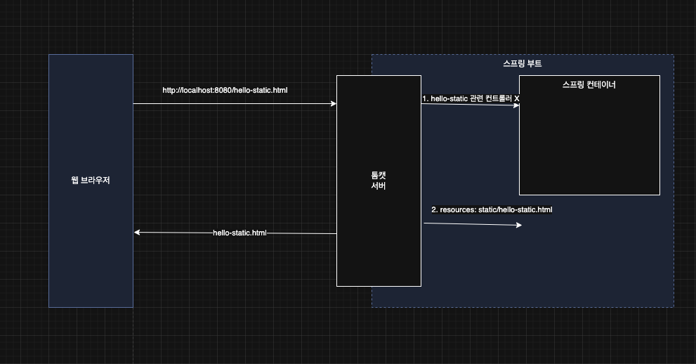
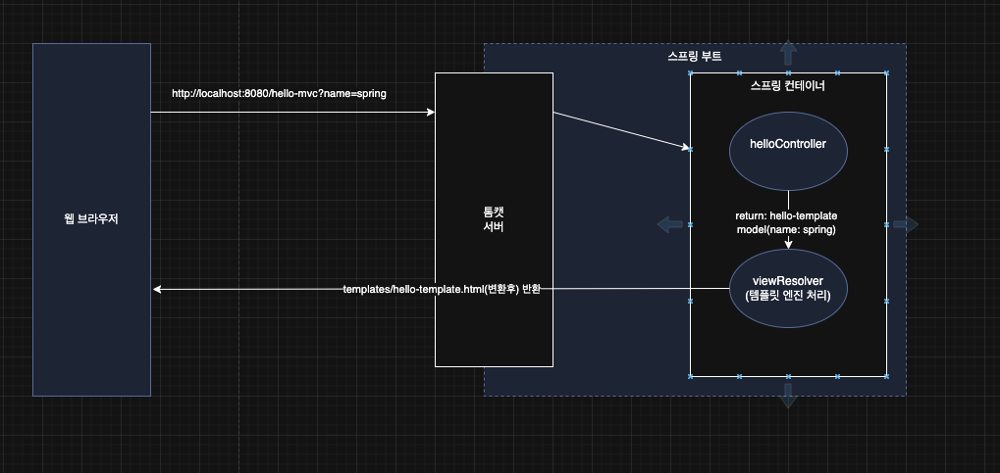
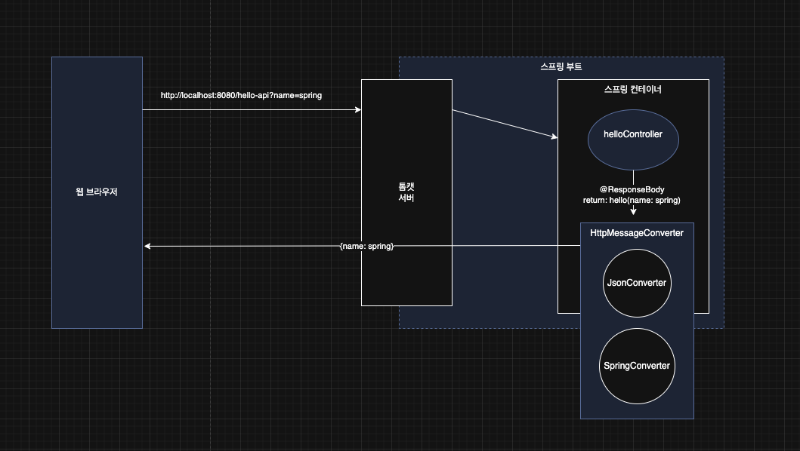

> 해당 블로그 글은 [영한님의 인프런 강의](https://inf.run/deYaF)를 바탕으로 쓰여진 글입니다.

## 정적 컨텐츠

정적 컨텐츠란, 아무런 가공 없이 요청한 html파일을 그대로 보여주는 것을 말한다. 스프링 부트는 해당 기능을 제공한다. html파일을 `resources/static`에 만들어두기만 하면 된다. 예를 들어 아래와 같이 a.html을 만들었다고 가정하자.

``` html
<!DOCTYPE html>
<html lang="ko">
<head>
  <meta charset="UTF-8">
  <title>a</title>
</head>
<body>
a
</body>
</html>
```

그리고 스프링 부트 프로젝트를 실행시키고 url을 `http://localhost:8080/a.html`을 입력하면 해당 html이 그대로 반환이 된다. 상세한 요청 플로우를 그림과 같이 살펴보자. 이번에는 hello-static.html이라고 해보자.



사용자가 http://localhost:8080/hello-static.html을 요청한다. 그러면 톰캣 웹 서버를 거쳐서 스프링 컨테이너에 해당 url이 매핑된 컨트롤러가 있는지 찾는다. 하지만 찾을 수 없다면 static 디렉토리 안에 hello-static.html이 존재하는지 찾고 있다면 반환하고 없으면 404를 띄운다.

## MVC와 템플릿 엔진

MVC란 한마디로 Model, View, Controller라는 것으로 관심사를 분리하자는데서 시작이 되었다. 일단 MVC와 자세한 내용은 추후 다뤄보고 템플릿 엔진을 이용해서 동적 html을 반환시켜보자.

``` java
@GetMapping("/hello-mvc")
public String helloMvc(@RequestParam("name") String name, Model model) {
    model.addAttribute("name", name);

    return "hello-template";
}
```

위와 같이 컨트롤러를 만들어 보자! 지난번과 다르게 파라미터로 `@RequestParam`이라는 어노테이션이 들어갔다. 지금 간략히 말하면 해당 어노테이션의 value값으로 된 쿼리 파라미터를 사용자 요청에 넘길때 사용하겠다는 의미이다.

그러면 그림과 함께 요청 플로우에 대해 알아보자.



브라우저에서 http://localhost:8080/hello-mvc?name=spring과 같은 요청이 온다. 그러면 웹 서버 톰캣은 스프링 컨테이너에 넘기고 해당 컨테이너에서 위의 url과 매핑된 컨트롤러를 찾는다. 그리고 파라미터로 넘겨온 값을 Model객체가 넣어서 문자열과 함께 viewResolver에 반환된다. 그러면 해당 resolver는 템플릿 엔진을 이용해 동적으로 html을 변환하고 해당 변환된 html을 브라우저에 보여준다.

## API

``` java
@ResponseBody
@GetMapping("/hello-api")
public Hello helloApi(@RequestParam("name") String name) {
    Hello hello = new Hello();
    hello.setName(name);

    return hello;
}

public static class Hello {

    private String name;

    public String getName() {
        return name;
    }

    public void setName(String name) {
        this.name = name;
    }
}
```

위와 같이 작성할때 api형식으로 JSON 형태로 반환하고 싶을 때 기존에서 `@ResponseBody` 어노테이션을 붙여주기만 하면 되며, 객체를 반환해주면 된다. 아마 코드를 보면 조금은 느낄 것이다. 그런데 희한하지 않나? 분명 요청이 들어오면 반환값을 가지고 ViewResolver에 갈텐데 어떻게 객체를 판단할까? 왜 html이 안 나올까? `@ResponseBody`를 붙이면 ViewResolver를 타지 않고 HTTP BODY에 내용을 직접 반환하게 해준다. 즉, JSON형태로 출력된다.(물론, XML형태로도 반환이 가능)

그러면 그림과 함께 세부동작은 아래와 같다.



### `@ResponseBody` 를 사용
- HTTP의 BODY에 문자 내용을 직접 반환
- `viewResolver` 대신에 `HttpMessageConverter` 가 동작
- 기본 문자처리: `StringHttpMessageConverter`
- 기본 객체처리: `MappingJackson2HttpMessageConverter`
- byte 처리 등등 기타 여러 HttpMessageConverter가 기본으로 등록되어 있음

> ✅ 참고
>
> 클라이언트의 HTTP Accept 해더와 서버의 컨트롤러 반환 타입 정보 둘을 조합해서 `HttpMessageConverter`가 선택된다.

> 잘못된 지식이 있을 경우 댓글로 남겨주시면 빠르게 반영하겠습니다!