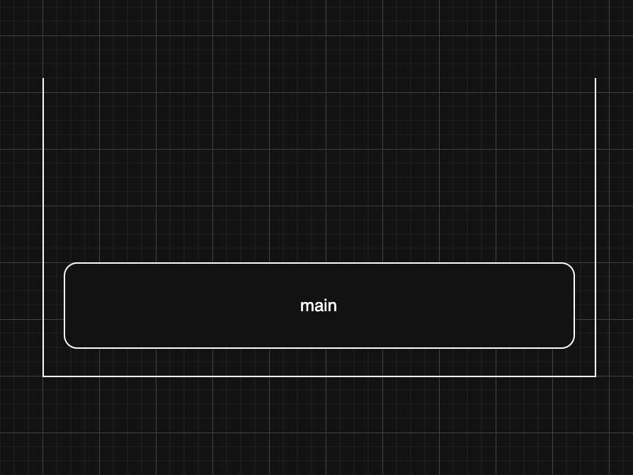
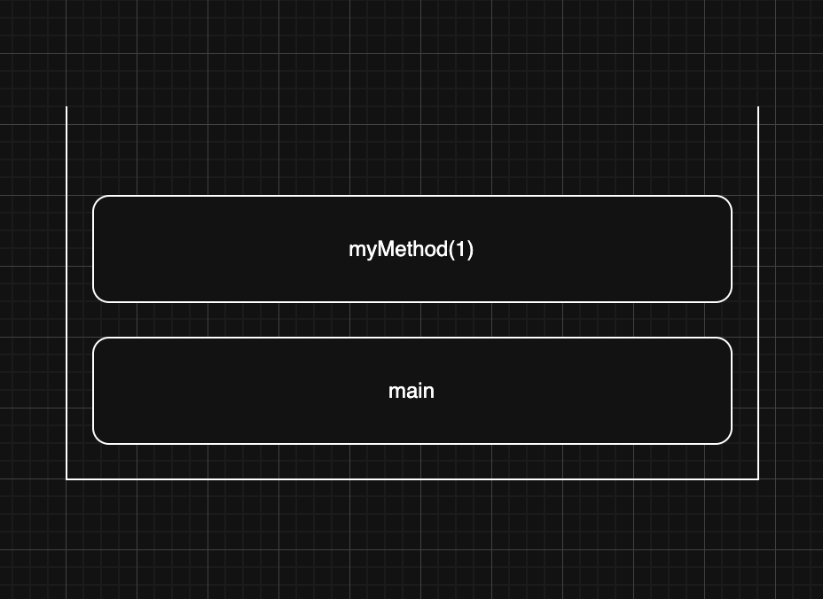
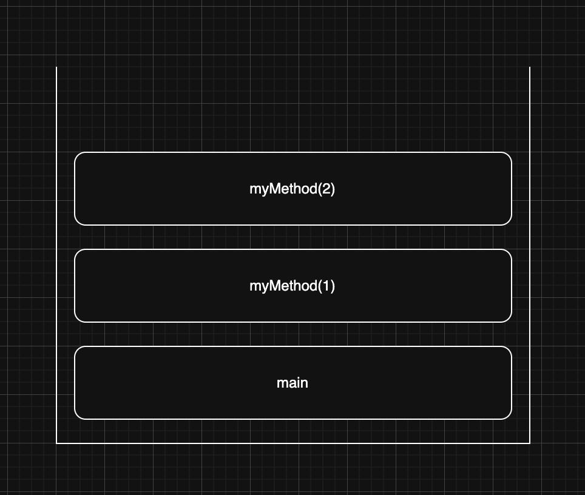
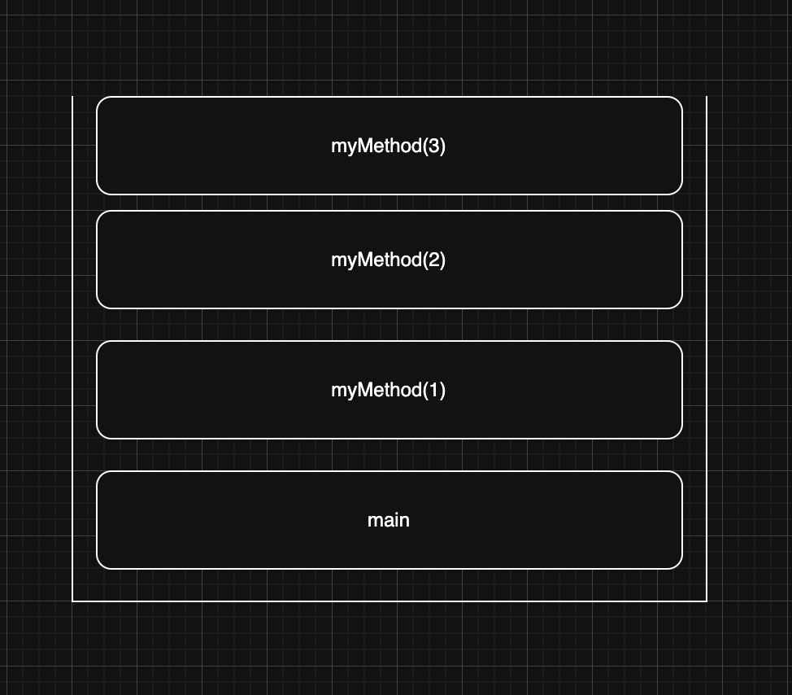
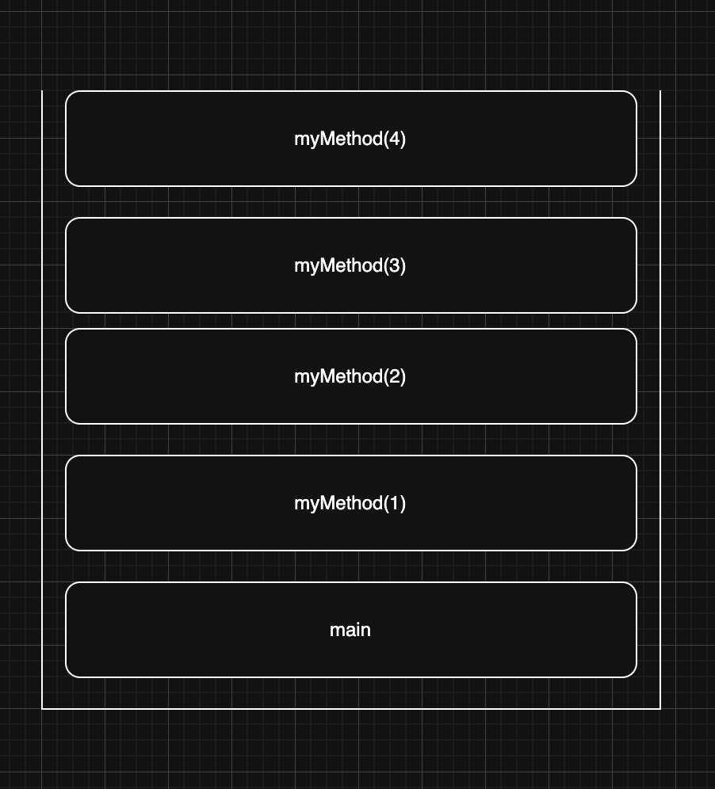

> 해당 블로그 글은 [감자님의 인프런 강의](https://inf.run/5fM4d)를 바탕으로 쓰여진 글입니다.

## 재귀

이번 포스팅부터는 알고리즘에 대해 학습해보겠다. 가장 먼저 재귀가 뭔지 알아보고 이후 여러 정렬 알고리즘에 대해 학습할 예정이다. 그리고 재귀를 이용한 성능이 좋은 정렬 알고리즘을 알아보고 재귀에서 생길 수 있는 문제를 동적 프로그래밍으로 해결해보도록 하겠다.

그럼 먼저 재귀가 뭔지 살펴보자. 재귀는 "어떠한 것을 정의할 때 자기 자신을 참조하는 것"을 뜻한다. 우리는 함수나 메서드를 정의할 때 재귀를 사용하는데 이렇게 재귀적으러 정의된 함수나 메서드를 **재귀 함수** 혹은 **재귀 메서드**라고 부른다. 그럼 대표적인 재귀 메서드의 예를 살펴보자.

``` java
package me.sungbin.dev.section03;

public class RecursionMain {
    public static void main(String[] args) {
        myMethod(1);
    }

    public static void myMethod(int number) {
        System.out.println(number);
        myMethod(number + 1);
    }
}
```

위의 코드를 실행하면 독자들은 아마 예측을 하듯이 일정 숫자까지 콘솔에 출력되다가 자바가 강제로 에러를 던져서 종료되는 것을 볼 수 있을 것이다. 아마 메모리의 여유에 따라 출력되는 숫자 값이 다를 것이다. 그런데 조금 신기할 것이다. 우리는 위의 코드를 보면 알듯이 종료하는 코드를 넣은 적이 없는데 자동으로 종료가 되었다. 이는 스택영역에 공간이 가득 차서 자동으로 종료가 된 것이다.

위의 구현한 메서드는 기저 조건(탈출 조건)이 없기 때문에 메모리가 금방 가득 차서 프로그램이 자동으로 종료된 것이다. 실제로 사용할 수 없는 메서드인 셈이다. 그러면 어떻게 하면 재귀 메서드가 쓸모있게 될까? 재귀 메서드는 기저 조건이 반드시 존재해야 한다. 자기 자신을 계속 호출하다가 특정 조건이 나오면 메서드를 종료하는 상황을 만들어보도록 하겠다.

우리는 1부터 10까지 출력하는 코드를 for문으로 쉽게 구현이 가능하다. 그럼 이런 로직을 재귀 메서드로도 한번 구현해볼까? 바로 아래와 같이 말이다.

``` java
package me.sungbin.dev.section03;

public class RecursionMain {
    public static void main(String[] args) {
        myMethod(1);
    }

    public static void myMethod(int number) {
        if (number > 10) {
            return;
        }

        System.out.println(number);
        myMethod(number + 1);
    }
}
```

우리는 재귀 메서드의 깊은 이해를 위하여 콜 스택이라는 개념에 대해 학습해야 한다. 그러면 지금부터 콜 스택에 대해 하나씩 알아가보자. 콜 스택은 메서드가 호출되면서 올라가는 메모리 영역으로 스택이라고 부른다. 콜 스택은 스택처럼 FILO 특성을 지닌다. 메서드를 호출하면 이 메서드는 콜 스택에 올라가게 되고 메서드가 종료되면 콜 스택에서 제거된다. 즉, 자바에서는 `main` 메서드가 제일 처음으로 들어와서 가장 나중에 나가게 될 것이다.

그럼 이런 재귀함수를 호출할 때 메모리 관점에서 어떻게 되는지 한번 살펴보도록 해보자. 이해를 돕기 위해 기저 조건에 숫자를 3으로 변경하고 그림으로 표현해보겠다.

``` java
package me.sungbin.dev.section03;

public class RecursionMain {
    public static void main(String[] args) {
        myMethod(1);
    }

    public static void myMethod(int number) {
        if (number > 3) {
            return;
        }

        System.out.println(number);
        myMethod(number + 1);
    }
}
```

가장 먼저 자바가 `main` 메서드를 호출할 것이다. 그러면 아래의 그림과 같이 `main` 메서드 스택이 스택영역에 쌓일 것이다.



이후 `myMethod`가 불리면 스택 영역에 아래와 같이 `myMethod`의 파라미터에 1이 들어간 스택이 쌓일 것이다.



그리고 기저 조건을 확인하고 기저 조건에 성립되지 않았기에 다시 한번 `myMethod`를 호출하는데 파라미터가 2로 호출하게 될 것이다. 그리고 파라미터가 2인 `myMethod` 스택이 쌓일 것이다.



이렇게 다시 한번 기저 조건을 확인하고 기저 조건이 성립되지 않았기에 다시 한번 `myMethod`를 호출하는데 파라미터가 3으로 호출하게 될 것이다. 그리고 파라미터가 3인 `myMethod` 스택이 쌓일 것이다.



이렇게 다시 한번 기저 조건을 확인하고 기저 조건이 성립되지 않았기에 다시 한번 `myMethod`를 호출하는데 파라미터가 4로 호출하게 될 것이다. 그리고 파라미터가 4인 `myMethod` 스택이 쌓일 것이다.



파라미터가 4인 메서드 스택은 기저 조건을 성립하기에 탈출하고 메서드를 종료한다. 그리고 스택 영역에 해당 스택이 사라진다. 이후 나머지 스택도 더 이상 호출 할 코드가 없기에 자동으로 종료가 되고 마지막 `main` 메서드 스택이 종료되면서 프로그램이 종료되게 되는 것이다.

이렇게 재귀 메서드는 호출할 때마다 콜 스택의 영역을 차지하게 된다. 이전 우리가 기저 조건을 넣지 않고 실행했을 때 특정 숫자까지 찍히고 종료되었던 이유가 바로 이 콜 스택이 계속 쌓여서 메모리가 부족했기 때문이다. 이 때문에 `for`문으로 해결할 수 있는 작업을 재귀 메서드로 해결하면 더 비효율적인 상황이 많다. 그럼 이런 의문점이 들 것이다.

> 🙋🏻 그럼 재귀 메서드는 쓸 필요가 없지 않나요?

재귀 메서드는 for문을 대체하려고 쓴다고 하기보다는 더 복잡한 문제를 쉽게 해결하기 위해 사용된다. 재귀 메서드를 이용하면 해결하기 힘든 상황을 쉽게 해결할 수 있는 경우가 있는데 대표적으로 우리가 수학시간에 배운 팩토리얼(!)이 대표적이다. 한번 팩토리얼을 구현하면서 재귀 메서드의 힘을 느껴보자. 작성을 하면 아래와 같이 작성할 수 있을 것이다.

``` java
package me.sungbin.dev.section03;

public class FactorialMain {
    public static void main(String[] args) {
        System.out.println(factorial(5));
    }

    private static int factorial(int number) {
        if (number == 1 || number == 0) {
            return 1;
        }

        return number * factorial(number - 1);
    }
}
```

## 재귀적으로 생각하기

재귀적으로 생각하는 것은 엄청 힘든 일이다. 지금부터 재귀의 여러 패턴을 분석하고 재귀 메서드를 만났을 때 어떤 종류 패턴의 재귀 메서드인지 구분하는 힘을 키워보도록 하겠다.

### 패턴1

우리는 1부터 10까지 카운트하는 코드를 for문을 이용해 작성할 수 있다. 그리고 이런 for문으로 작성된 코드를 재귀 메서드를 이용하여 변경도 가능할 것이다. 이렇게 재귀의 한 가지 패턴은 단순히 반복 실행을 하는 것이다. 단순히 반복 실행을 재귀로 구현하면 반복문으로 구현했을 때보다 크게 이점이 되는 부분이 없다. 오히려 콜 스택의 영역만 차지하게 되어서 메모리 관점에서 for문보다 좋지 못하다.

### 패턴2

재귀의 두번째 패턴은 하위 문제의 결과를 기반으로 현재 문제를 계산하는 패턴이다. 우리는 이전에 팩토리얼 메서드를 구현하면서 해당 패턴에 대해 학습을 했던 경험을 가지고 있다. 사실 위에서 작성했던 팩토리얼 메서드는 이렇게 재귀적으로 사용하지 않고 반복문을 통해서도 작성이 가능하다.

``` java
int sum = 1;

for (int i = 1; i <= number; i++) {
    sum *= i;
}
```

재귀적으로 작성된 코드와 반복문 코드를 비교해보면 서로 패러다임이 다르다. 재귀적으로 작성된 코드는 5부터 하나씩 감소된 값을 곱하는 것이고 반복문은 1부터 증가해서 계산된 값을 곱하는 식이다. 그런데 재귀 메서드를 이용할 때 하위 문제의 결과를 기반으로 현재 문제를 계산한다는 것은 굉장히 큰 차이이다.

for문을 이용해서 계산하는 방식을 상향식 계산이라고 하며 재귀 메서드 방식을 하향식 계산이라고 부른다. 그런데 재귀를 사용한다고 해서 모두 하향식 계산이라고 부른지는 않는다. 사실 재귀를 이용해서 상향식 계산도 얼마든지 가능하다. 하지만 재귀의 진정한 힘은 하향식 계산에서 발휘된다. 즉, 재귀를 사용한다고 하면 하향식 계산에서만 쓰는 것이 위력적이다.

그러면 이제 하향식 계산방식을 이용해서 문제를 해결해보자. 먼저 단순한 문제를 알아보자. 배열의 모든 원소의 합을 구하는 문제이다. 이 문제는 어떻게 접근해야할까? 만약 1부터 5까지 들어있는 배열의 합을 구한다고 했을 때 하향식 계산을 한다면 하위 문제를 먼저 도출해내는 것이 관건이다. 여기서 하위문제는 무엇일까? 아마 여기서 하위 문제는 1부터 4까지의 합을 구하는 것이 하위 문제일 것이다. 그럼 한번 구현해보자.

``` java
package me.sungbin.dev.section03;

import java.util.Arrays;

public class SumOfArrayMain {
    public static void main(String[] args) {
        System.out.println(sumArray(new int[]{1, 2, 3, 4, 5}));
    }

    private static int sumArray(int[] arr) {
        if (arr.length == 1) {
            return arr[0];
        }

        return sumArray(Arrays.copyOfRange(arr, 0, arr.length - 1)) + arr[arr.length - 1];
    }
}
```

하지만 이렇게 한번 작성한 것으로 재귀적으로 이해하기 너무 힘들 것이다. 다른 예시를 하나 더 들어보자. 이번에는 문자열의 길이를 반환하는 `strLength` 메서드를 구현해보자.

``` java
package me.sungbin.dev.section03;

import java.util.Arrays;

public class LengthOfString {
    public static void main(String[] args) {
        System.out.println(strLength(new String[]{"a", "b", "c", "d", "e"}));
    }

    private static int strLength(String[] arr) {
        if (arr.length == 0 || arr[0] == null) return 0;
        String[] sliced = Arrays.copyOfRange(arr, 0, arr.length - 1);
        return strLength(sliced) + 1;
    }
}
```

그럼 마지막으로 지수함수를 하향식으로 만들어보자.

``` java
package me.sungbin.dev.section03;

public class PowerMain {
    public static void main(String[] args) {
        System.out.println(power(2, 5));
    }

    private static int power(int x, int n) {
        if (n == 0) {
            return 1;
        }
        
        return power(x, n - 1) * x;
    }
}
```

## 재귀 - 하노이 탑


> 잘못된 지식이 있을 경우 댓글로 남겨주시면 빠르게 반영하겠습니다!