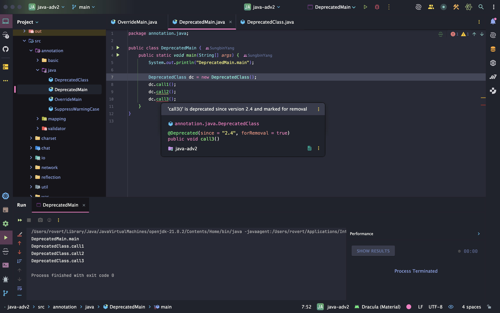

> 해당 블로그 글은 [영한님의 인프런 강의](https://inf.run/vskmA)를 바탕으로 쓰여진 글입니다.

## 애노테이션이 필요한 이유

기존 HTTP 서버의 남은 문제들이 존재한다.

- 리플렉션 서블릿은 요청 URL과 메서드 이름이 같다면 해당 메서드를 동적으로 호출할 수 있다. 하지만 요청 이름과 메서드 이름을 다르게 하고 싶다면 어떻게 해야할까?
- 앞서 `/`와 같이 자바 메서드 이름으로 처리하기 어려운 URL은 어떻게 해결할 수 있을까?
- URL은 주로 `-`(dash)를 구분자로 사용한다. `/add-member`와 같은 URL은 어떻게 해결할 수 있을까?

이런 문제들을 해결하려면 뭔가 코드 상에 추가 정보를 담아두고 코드가 실행할 때 해당 정보를 읽게 하는 방법이 있어야 할 것 같다. 예를 들어, 메서드에 주석을 달아두면 자바 컴파일러가 그것을 읽어들여서 할 수는 없을까? 그런데 주석은 코드가 아니다. 따라서 컴파일 시점에 모두 제거된다. 만약 프로그램 실행 중에 읽어서 사용할 수 있는 주석이 있다면 어떨까? 이것이 바로 애노테이션이다.

그럼 애노테이션에 대해 예제를 통해 학습해보자.

``` java
package annotation.mapping;

import java.lang.annotation.Retention;
import java.lang.annotation.RetentionPolicy;

@Retention(RetentionPolicy.RUNTIME)
public @interface SimpleMapping {
    String value();
}
```

- 애노테이션은 `@interface` 키워드를 사용해서 만든다.
- 그냥 일종의 인터페이스라 생각하면 된다. 그리고 해당 애노테이션은 `value()`라는 속성을 가진다.

이제 해당 애노테이션을 한번 사용해보자.

``` java
package annotation.mapping;

public class TestController {

    @SimpleMapping(value = "/")
    public void home() {
        System.out.println("TestController.home");
    }

    @SimpleMapping(value = "/site1")
    public void page1() {
        System.out.println("TestController.page1");
    }
}
```

- 애노테이션을 사용할 때는 `@` 기호로 시작한다.

> ✅ 참고
>
> 애노테이션은 프로그램 코드가 아니다. 예제에서 애노테이션이 붙어있는 `home()`,`page1()`같은 코드를 호출해도 프로그램에는 아무런 영향을 주지 않는다. 마치 주석과 비슷하다고 이해하면 된다. 다만 일반적인 주석이 아니라, 리플렉션 같은 기술로 실행 시점에 읽어서 활용할 수 있는 특별한 주석이다.

``` java
package annotation.mapping;

import java.lang.reflect.Method;

public class TestControllerMain {
    public static void main(String[] args) {
        TestController testController = new TestController();

        Class<? extends TestController> aClass = testController.getClass();
        for (Method method : aClass.getDeclaredMethods()) {
            SimpleMapping simpleMapping = method.getAnnotation(SimpleMapping.class);

            if (simpleMapping != null) {
                System.out.println("[" + simpleMapping.value() + "] -> " + method);
            }
        }
    }
}
```

- `TestController` 클래스의 선언된 메서드를 찾는다.
- 리플렉션이 제공하는 `getAnnotation()` 메서드를 사용하면 붙어있는 애노테이션을 찾을 수 있다.
    - `Class`,`Method`,`Field`,`Constructor` 클래스는 자신에게 붙은 애노테이션을 찾을 수 있는 `getAnnotation()` 메서드를 제공한다.
    - 여기서는 `Method.getAnnotation(SimpleMapping.class)` 을 사용했으므로 해당 메서드에 붙은 `@SimpleMapping` 애노테이션을 찾을 수 있다.
- `simpleMapping.value()`를 사용해서 찾은 애노테이션에 지정된 값을 조회할 수 있다.

> ✅ 참고
>
> 자바 애노테이션(Annotation)의 영어 단어 "Annotation"은 일반적으로 "주석" 또는 "메모"를 의미한다. 애노테이션은 코드에 추가적인 정보를 주석처럼 제공한다. 하지만 일반 주석과 달리, 애노테이션은 컴파일러나 런타임에서 해석될 수 있는 메타데이터를 제공한다. 즉, 애노테이션은 코드에 메모를 달아놓는 것처럼 특정 정보나 지시를 추가하는 도구로, 코드에 대한 메타데이터를 표현하는 방법이다. 따라서 "애노테이션"이라는 이름은 코드에 대한 추가적인 정보를 주석처럼 달아놓는다는 뜻이다.

## 애노테이션 정의

``` java
package annotation.basic;

import util.MyLogger;

import java.lang.annotation.Retention;
import java.lang.annotation.RetentionPolicy;

@Retention(RetentionPolicy.RUNTIME)
public @interface AnnoElement {
    String value();

    int count() default 0;

    String[] tags() default {};

    Class<? extends MyLogger> annoData() default MyLogger.class;
}
```

### 애노테이션 정의 규칙

#### 데이터 타입

- 기본 타입 (int, float, boolean 등)
- `String`
- `Class`(메타데이터) 또는 인터페이스
- enum
- 다른 애노테이션 타입
- 위의 타입들의 배열
- 앞서 설명한 타입 외에는 정의할 수 없다. 쉽게 이야기해서 일반적인 클래스를 사용할 수 없다.

#### default 값

- 요소에 default 값을 지정할 수 있다.

#### 요소 이름

- 메서드 형태로 정의된다.
- 괄호()를 포함하되 매개변수는 없어야 한다.

#### 반환 값

- `void`를 반환 타입으로 사용할 수 없다.

#### 예외

- 예외를 선언할 수 없다.

#### 특별한 요소 이름

- `value`라는 이름의 요소를 하나만 가질 경우, 애노테이션 사용 시 요소 이름을 생략할 수 있다.

### 애노테이션 사용

애노테이션 사용 예를 살펴보자.

``` java
package annotation.basic;

@AnnoElement(value = "data1", count = 10, tags = {"t1", "t2"})
public class ElementData1 {
}
```

``` java
package annotation.basic;

import java.util.Arrays;

public class ElementData1Main {
    public static void main(String[] args) {
        Class<ElementData1> annoClass = ElementData1.class;
        AnnoElement annotation = annoClass.getAnnotation(AnnoElement.class);

        String value = annotation.value();
        System.out.println("value = " + value);

        int count = annotation.count();
        System.out.println("count = " + count);

        String[] tags = annotation.tags();
        System.out.println("tags = " + Arrays.toString(tags));
    }
}
```

위와 같이 리플렉션을 이용하여 애노테이션 정보를 가져올 수 있다. 여기서 조금 특별한 경우들도 존재하는데 한번 살펴보자.

- `default`로 지정한 애노테이션 속성은 생략이 가능하다.
- 배열의 항목이 하나인 경우 `{}` 생략 가능하다. ex. tags = "t1"
- 입력 요소가 하나인 경우 `value` 키워드 생략 가능

## 메타 애노테이션

애노테이션을 정의하는데 사용하는 특별한 애노테이션을 메타 애노테이션이라 한다.

- `@Retention`
    - `RetentionPolicy.SOURCE`
    - `RetentionPolicy.CLASS`
    - `RetentionPolicy.RUNTIME`
- `@Target`
- `@Documented`
- `@Inherited`

### @Retention

애노테이션의 생존 기간을 지정한다.

- `RetentionPolicy.SOURCE` : 소스 코드에만 남아있다. 컴파일 시점에 제거된다.
- `RetentionPolicy.CLASS` : 컴파일 후 class 파일까지는 남아있지만 자바 실행 시점에 제거된다. (기본 값)
- `RetentionPolicy.RUNTIME` : 자바 실행 중에도 남아있다. 대부분 이 설정을 사용한다.

### @Target

애노테이션을 적용할 수 있는 위치를 지정한다. 대표적으로 `TYPE`,`FIELD`,`METHOD`를 사용한다.

### @Documented

자바 API 문서를 만들 때 해당 애노테이션이 함께 포함되는지 지정한다. 보통 함께 사용한다.

### @Inherited

자식 클래스가 애노테이션을 상속 받을 수 있다.

## 애노테이션과 상속

모든 애노테이션은 `java.lang.annotation.Annotation` 인터페이스를 묵시적으로 상속 받는다.

``` java
package java.lang.annotation;

public interface Annotation {
    boolean equals(Object obj);
    int hashCode();
    String toString();
    Class<? extends Annotation> annotationType();
}
```

`java.lang.annotation.Annotation` 인터페이스는 개발자가 직접 구현하거나 확장할 수 있는 것이 아니라, 자바 언어 자체에서 애노테이션을 위한 기반으로 사용된다. 이 인터페이스는 다음과 같은 메서드를 제공한다.

- `boolean equals(Object obj)` : 두 애노테이션의 동일성을 비교한다.
- `int hashCode()` : 애노테이션의 해시코드를 반환한다.
- `String toString()` : 애노테이션의 문자열 표현을 반환한다.
- `Class<? extends Annotation> annotationType()` : 애노테이션의 타입을 반환한다.

모든 애노테이션은 기본적으로 `Annotation` 인터페이스를 확장하며, 이로 인해 자바에서 애노테이션은 특별한 형태의 인터페이스로 간주된다. 하지만 자바에서 애노테이션을 정의할 때, 개발자가 명시적으로 `Annotation` 인터페이스를 상속하거나 구현할 필요는 없다. 애노테이션을 `@interface` 키워드를 통해 정의하면, 자바 컴파일러가 자동으로 `Annotation` 인터페이스를 확장하도록 처리해준다.

즉, 아래와 같이 어노테이션을 작성하면

``` java
public @interface MyAnnotation {

}
```

자바 컴파일러는 아래와 같이 변경해준다.

``` java
public interface MyAnnotation extends java.lang.annotation.Annotation {

}
```

### 애노테이션과 상속

- 애노테이션은 다른 애노테이션이나 인터페이스를 직접 상속할 수 없다.
- 오직 `java.lang.annotation.Annotation` 인터페이스만 상속한다.
- 따라서 애노테이션 사이에는 상속이라는 개념이 존재하지 않는다.

### @Inherited

애노테이션을 정의할 때 `@Inherited` 메타 애노테이션을 붙이면, 애노테이션을 적용한 클래스의 자식도 해당 애노테이션을 부여 받을 수 있다. **단 주의할 점으로 이 기능은 클래스 상속에서만 작동하고, 인터페이스의 구현체에는 적용되지 않는다.**

### @Inherited가 클래스 상속에만 적용되는 이유

- 클래스 상속과 인터페이스 구현의 차이
    - 클래스 상속은 자식 클래스가 부모 클래스의 속성과 메서드를 상속받는 개념이다. 즉, 자식 클래스는 부모 클래스의 특성을 이어받으므로, 부모 클래스에 정의된 애노테이션을 자식 클래스가 자동으로 상속받을 수 있는 논리적 기반이 있다.
    - 인터페이스는 메서드의 시그니처만을 정의할 뿐, 상태나 행위를 가지지 않기 때문에, 인터페이스의 구현체가 애노테이션을 상속한다는 개념이 잘 맞지 않는다.
- 인터페이스와 다중 구현, 다이아몬드 문제
    - 인터페이스는 다중 구현이 가능하다. 만약 인터페이스의 애노테이션을 구현 클래스에서 상속하게 되면 여러 인터페이스의 애노테이션 간의 충돌이나 모호한 상황이 발생할 수 있다.

## 애노테이션 활용 - 검증기

이제 애노테이션을 활용하는 예를 살펴보겠다. 우리가 실무에서 애노테이션을 많이 이용하는 곳이 바로 DTO의 검증 부분이다. 그러면 검증부분을 애노티에션 없이 작성해보고 그 이후에 애노티에션을 붙여서 사용해보겠다.

``` java
package annotation.validator;

public class Team {

    private String name;

    private int memberCount;

    public Team(String name, int memberCount) {
        this.name = name;
        this.memberCount = memberCount;
    }

    public String getName() {
        return name;
    }

    public int getMemberCount() {
        return memberCount;
    }
}
```

``` java
package annotation.validator;

public class User {

    private String name;

    private int age;

    public User(String name, int age) {
        this.name = name;
        this.age = age;
    }

    public String getName() {
        return name;
    }

    public int getAge() {
        return age;
    }
}
```

위와 같이 두 클래스를 정의를 해두었다. 이제 두 클래스의 검증 부분에 대한 `main`을 작성해보겠다.

``` java
package annotation.validator;

import static util.MyLogger.log;

public class ValidatorV1Main {
    public static void main(String[] args) {
        User user = new User("user1", 0);
        Team team = new Team("", 0);

        try {
            log("== user 검증 ==");
            validateUser(user);
        } catch (Exception e) {
            log(e);
        }

        try {
            log("== team 검증 ==");
            validateTeam(team);
        } catch (Exception e) {
            log(e);
        }
    }

    private static void validateUser(User user) {
        if (user.getName() == null || user.getName().isEmpty()) {
            throw new RuntimeException("이름이 비어있습니다.");
        }

        if (user.getAge() < 1 || user.getAge() > 100) {
            throw new RuntimeException("나이는 1과 100 사이여야 합니다.");
        }
    }

    private static void validateTeam(Team team) {
        if (team.getName() == null || team.getName().isEmpty()) {
            throw new RuntimeException("이름이 비어있습니다.");
        }

        if (team.getMemberCount() < 1 || team.getMemberCount() > 999) {
            throw new RuntimeException("회원 수는 1과 999 사이여야 합니다.");
        }
    }
}
```

딱 봐도 코드가 매우 복잡하다. 게다가 클래스를 하나 더 추가할 때마다 메서드를 추가해야 하고 필드가 늘어날 수록 조건문을 계속 추가해야 한다. 이런 불편함을 애노티에션을 통해 해결해보자.

그럼 먼저 애노테이션을 정의해보자.

``` java
package annotation.validator;

import java.lang.annotation.ElementType;
import java.lang.annotation.Retention;
import java.lang.annotation.RetentionPolicy;
import java.lang.annotation.Target;

@Target(ElementType.FIELD)
@Retention(RetentionPolicy.RUNTIME)
public @interface NotEmpty {
    String message() default "값이 비어있습니다.";
}
```

위의 애노테이션은 필드에만 붙을 수 있고 해당 필드의 검증이 실패하면 `message`의 정의한 값이 출력될 것이다.

``` java
package annotation.validator;

import java.lang.annotation.ElementType;
import java.lang.annotation.Retention;
import java.lang.annotation.RetentionPolicy;
import java.lang.annotation.Target;

@Target(ElementType.FIELD)
@Retention(RetentionPolicy.RUNTIME)
public @interface Range {
    int min();

    int max();

    String message() default "범위를 남았습니다.";
}
```

위의 애노테이션은 필드에만 붙을 수 있고 `min`은 최소값, `max`는 최대값, `message`는 검증에 실패했을 때 출력 메세지다.

이제 해당 애노테이션을 클래스에 정의해보자.

``` java
package annotation.validator;

public class Team {

    @NotEmpty(message = "이름이 비어있습니다.")
    private String name;

    @Range(min = 1, max = 999, message = "회원 수는 1과 999 사이여야 합니다.")
    private int memberCount;

    public Team(String name, int memberCount) {
        this.name = name;
        this.memberCount = memberCount;
    }

    public String getName() {
        return name;
    }

    public int getMemberCount() {
        return memberCount;
    }
}
```

``` java
package annotation.validator;

public class User {

    @NotEmpty(message = "이름이 비어있습니다.")
    private String name;

    @Range(min = 1, max = 100, message = "나이는 1과 100 사이여야 합니다.")
    private int age;

    public User(String name, int age) {
        this.name = name;
        this.age = age;
    }

    public String getName() {
        return name;
    }

    public int getAge() {
        return age;
    }
}
```

이제 필드에 붙인 애노테이션이 검증을 할 수 있게 검증 유틸 클래스를 만들어보자.

``` java
package annotation.validator;

import java.lang.reflect.Field;

public class Validator {

    public static void validate(Object obj) throws Exception {
        Field[] fields = obj.getClass().getDeclaredFields();

        for (Field field : fields) {
            field.setAccessible(true);

            if (field.isAnnotationPresent(NotEmpty.class)) {
                String value = (String) field.get(obj);
                NotEmpty annotation = field.getAnnotation(NotEmpty.class);

                if (value == null || value.isEmpty()) {
                    throw new RuntimeException(annotation.message());
                }
            }

            if (field.isAnnotationPresent(Range.class)) {
                long value = field.getLong(obj);
                Range annotation = field.getAnnotation(Range.class);

                if (value < annotation.min() || value > annotation.max()) {
                    throw new RuntimeException(annotation.message());
                }
            }
        }
    }
}
```

- 전달된 객체에 선언된 필드를 모두 찾아서 `@NotEmpty`,`@Range` 애노테이션이 붙어있는지 확인한다.
    - `isAnnotationPresent()` 메서드로 애노테이션이 존재하는지 유무를 확인하는 것이다.
- 애노테이션이 있는 경우 각 애노테이션의 속성을 기반으로 검증 로직을 수행한다. 만약 검증에 실패하면 애노테이션에 적용한 메시지를 예외에 담아서 던진다.

그럼 `main`을 작성해보자.

``` java
package annotation.validator;

import static util.MyLogger.log;

public class ValidatorV2Main {
    public static void main(String[] args) {
        User user = new User("user1", 0);
        Team team = new Team("", 0);

        try {
            log("== user 검증 ==");
            Validator.validate(user);
        } catch (Exception e) {
            log(e);
        }

        try {
            log("== team 검증 ==");
            Validator.validate(team);
        } catch (Exception e) {
            log(e);
        }
    }
}
```

검증용 애노테이션과 검증기를 사용한 덕분에, 어떤 객체든지 애노테이션으로 간단하게 검증할 수 있게 되었다.

- 새로 추가되는 클래스나 필드에 대해서도 복잡한 로직을 별도로 구현할 필요 없이 적절한 애노테이션을 추가하는 것만으로 검증 로직을 쉽게 확장할 수 있다. 이처럼 애노테이션 기반 검증을 도입하면 코드의 가독성과 확장성이 크게 향상되며, 일관된 규칙을 유지할 수 있어 전체적인 품질 관리에도 도움이 된다.
- 이제 클래스들이 서로 다르더라도, 일관되고 재사용 가능한 검증 방식을 사용할 수 있게 되었다.

> ✅ 참고
>
> 이런 검증 애노테이션은 실무에서 많이 사용한다. 그리고 해당 애노테이션을 자바 진영에서는 애노테이션 기반 검증 기능을 Jakarta(Java) Bean Validaton이라는 이름으로 표준화 했다. 다양한 검증 애노테이션과 기능이 있고, 스프링 프레임워크, JPA 같은 기술들과도 함께 사용된다.

## 자바 기본 애노테이션

`@Override`,`@Deprecated`,`@SuppressWarnings`와 같이 자바 언어가 기본으로 제공하는 애노테이션도 있다.

### @Override

``` java
package java.lang;

import java.lang.annotation.*;

@Target(ElementType.METHOD)
@Retention(RetentionPolicy.SOURCE)
public @interface Override {
}
```

- 메서드 재정의가 정확하게 잘 되었는지 컴파일러가 체크하는데 사용한다.
- 이 애노테이션을 붙이면 자바 컴파일러가 메서드 재정의 여부를 체크해 준다. 만약 문제가 있다면 컴파일을 통과하지 않는다! 개발자의 실수를 자바 컴파일러가 잡아주는 좋은 애노테이션이기 때문에, 사용을 강하게 권장한다.
- `@Override` 애노테이션은 `RetentionPolicy.SOURCE`로 인해 소스단계에만 남아있고 컴파일하면 사라진다.
- `@Override`는 컴파일 시점에만 사용하는 애노테이션이다. 런타임에는 필요하지 않으므로 이렇게 설정되어 있다.

### @Deprecated

`@Deprecated`는 더 이상 사용되지 않는다는 뜻이다. 이 애노테이션이 적용된 기능은 사용을 권장하지 않는다.

- 해당 요소를 사용하면 오류가 발생할 가능성이 있다.
- 호환되지 않게 변경되거나 향후 버전에서 제거될 수 있다.
- 더 나은 최신 대체 요소로 대체되었다.
- 더 이상 사용되지 않는 기능이다.

위와 같은 상황일 때 사용하며 버전관리 프로젝트일 때 위와 같은 상황일때 붙여주면 사용하는 쪽에서 한 눈에 알 수 있어서 사용자가 쉽게 알 수 있다.

``` java
package java.lang;

@Documented
@Retention(RetentionPolicy.RUNTIME)
@Target(value={CONSTRUCTOR, FIELD, LOCAL_VARIABLE, METHOD, PACKAGE, MODULE, PARAMETER, TYPE})
public @interface Deprecated {}
```

- `@Deprecated` : 더는 사용을 권장하지 않는 요소이다.
    - `since` : 더 이상 사용하지 않게된 버전 정보
    - `forRemoval` : 미래 버전에 코드가 제거될 예정이다.

해당 애노테이션은 우리가 그렇게 익숙치 않는 애노테이션이니 예제를 한번 보자.

``` java
package annotation.java;

public class DeprecatedClass {

    public void call1() {
        System.out.println("DeprecatedClass.call1");
    }

    @Deprecated
    public void call2() {
        System.out.println("DeprecatedClass.call2");
    }

    @Deprecated(since = "2.4", forRemoval = true)
    public void call3() {
        System.out.println("DeprecatedClass.call3");
    }
}
```

위와 같이 작성하면 사용하는 쪽에서 아래처럼 나타난다.



즉, 일반 `@Deprecated`를 선언하면 사용하는 쪽에서 노란 줄이 뜨고 `forRemoval`을 사용하면 빨간 줄이 뜬다.

> 단, 빨간 줄이 떴다고 하더라고 컴파일 오류가 발생하는 것은 아니다. 다만, 사용자한테 심각하니 빨리 변경하라고 알려주는 기능을 한다.

### @SuppressWarnings

이름 그대로 경고를 억제하는 애노테이션이다. 자바 컴파일러가 문제를 경고하지만, 개발자가 해당 문제를 잘 알고 있기 때문에, 더는 경고하지 말라고 지시하는 애노테이션이다.

``` java
package java.lang;

@Target({TYPE, FIELD, METHOD, PARAMETER, CONSTRUCTOR, LOCAL_VARIABLE, MODULE})
@Retention(RetentionPolicy.SOURCE)
public @interface SuppressWarnings {
    String[] value();
}
```

예제를 한번 살펴보자.

``` java
package annotation.java;

import java.util.ArrayList;
import java.util.Date;
import java.util.List;

public class SuppressWarningCase {

    @SuppressWarnings("unused")
    public void unusedWarning() {
        int unusedVariable = 10;
    }

    @SuppressWarnings("deprecation")
    public void deprecationWarning() {
        Date date = new Date();
        int date1 = date.getDate();
    }

    @SuppressWarnings({"rawtypes", "unchecked"})
    public void uncheckedCast() {
        List list = new ArrayList();

        List<String> list2 = (List<String>) list;
    }

    @SuppressWarnings("all")
    public void suppressAllWarnings() {
        Date date = new Date();
        date.getDate();

        List list = new ArrayList();
        List<String> stringList = (List<String>) list;
    }
}
```

- **all**: 모든 경고를 억제
- **deprecation**: 사용이 권장되지 않는(deprecated) 코드를 사용할 때 발생하는 경고를 억제
- **unchecked**: 제네릭 타입과 관련된 unchecked 경고를 억제
- **serial**: Serializable 인터페이스를 구현할 때 serialVersionUID 필드를 선언하지 않은 경우 발생하는 경고를 억제
- **rawtypes**: 제네릭 타입이 명시되지 않은(raw) 타입을 사용할 때 발생하는 경고를 억제
- **unused**: 사용되지 않는 변수, 메서드, 필드 등을 선언했을 때 발생하는 경고를 억제

해당 애노테이션은 절대 실무에서 사용해서는 안된다. 이런 경고를 알려주는 것은 프로덕트에 문제가 있다고 자바가 알려주는 것이다. 이것을 무시한다면 나중에 심각한 오류를 초래할 수 있기에 단순 디버깅이나 개발용에 잠깐 사용해야 한다.

> 잘못된 지식이 있을 경우 댓글로 남겨주시면 빠르게 반영하겠습니다!