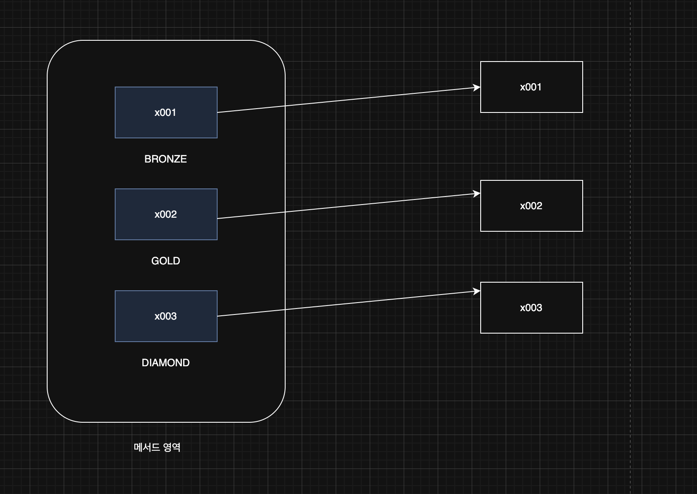

> 해당 블로그 글은 [영한님의 인프런 강의](https://inf.run/FiFGQ)를 바탕으로 쓰여진 글입니다.

## 문자열과 타입 안전성1

자바가 제공하는 열거형(Enum Type)을 제대로 이해하려면 먼저 열거형이 생겨난 이유를 알아야 한다. 한번 예제 코드를 통해 알아보자.

어느날, LOL에 각 등급에 따라 스킨 할인 정책 로직을 개발한다고 해보자.

``` java
package enumeration.ex0;

public class DiscountService {

    public int discount(String grade, int price) {
        int discountPercent = 0;

        if (grade.equals("BRONZE")) {
            discountPercent = 10;
        } else if (grade.equals("GOLD")) {
            discountPercent = 20;
        } else if (grade.equals("DIAMOND")) {
            discountPercent = 30;
        } else {
            System.out.println(grade + ": 할인X");
        }

        return price * discountPercent / 100;
    }
}
```

그래서 위와 같이 할인 정책 로직을 작성하였고 배포를 진행하였다. 예상한 기댓값은 아래와 같을 것이다.

``` java
package enumeration.ex0;

public class StringGradeEx0_1 {
    public static void main(String[] args) {
        int price = 10000;

        DiscountService discountService = new DiscountService();
        int bronze = discountService.discount("BRONZE", price);
        int gold = discountService.discount("GOLD", price);
        int diamond = discountService.discount("DIAMOND", price);

        System.out.println("BRONZE 등급의 할인 금액: " + bronze);
        System.out.println("GOLD 등급의 할인 금액: " + gold);
        System.out.println("DIAMOND 등급의 할인 금액: " + diamond);
    }
}
```

위와 같이 작성하면 문제가 발생하지 않을 것이다. 하지만 만약, 오타를 낸다던가, 없는 등급을 넣을 경우는 할인을 못 받은 심각한 이슈가 생길 것이다. 결국 위의 비즈니스 로직을 작성한 개발자는 조용히 진실의 방으로...

등급에 문자열을 사용하는 지금의 방식은 다음과 같은 문제가 있다. 첫번째, **타입 안전성**문제가 있다. 문자열 자체는 오타를 내기도 쉽고, 없는 등급을 입력할 수 있다. 또한 데이터 일관성이 떨어진다. 대문자로만 입력을 해야하는데 소문자로 입력할 경우, 섞어서 입력 할 경우도 존재할 것이다.

### String 사용 시 타입 안정성 부족 문제

- 값의 제한 부족: `String`으로 상태나 카테고리를 표현하면, 잘못된 문자열을 실수로 입력할 가능성이 있다.
- 컴파일 시 오류 감지 불가: 이러한 잘못된 값은 컴파일 시에는 감지되지 않고, 런타임에서만 문제가 발견되기 때문에 디버깅이 어려워질 수 있다.

그러면 이런 문제를 어떻게 해결할까?

## 문자열과 타입 안전성2

그래서 개발자는 문득 이 생각을 하였다. 상수를 이용하면 될 것 같다는 생각을 한다.

``` java
package enumeration.ex1;

public class Grade {

    public static final String BRONZE = "BRONZE";

    public static final String GOLD = "GOLD";

    public static final String DIAMOND = "DIAMOND";
}
```

위와 같이 클래스에 상수들을 정의하고 아래의 service 로직을 변경하였다.

``` java
package enumeration.ex1;

public class DiscountService {

    public int discount(String grade, int price) {
        int discountPercent = 0;

        if (grade.equals(Grade.BRONZE)) {
            discountPercent = 10;
        } else if (grade.equals(Grade.GOLD)) {
            discountPercent = 20;
        } else if (grade.equals(Grade.DIAMOND)) {
            discountPercent = 30;
        } else {
            System.out.println(grade + ": 할인X");
        }

        return price * discountPercent / 100;
    }
}
```

하지만 위의 코드도 문제가 있다 왜냐하면 `discount` 첫번째 파라미터로 문자열이 들어갈 수 있다. 즉 아래와 같이 문자열을 입력해서 사용이 가능하기 때문이다.

``` java
discountService.discount("gold", price);
```

즉, 상수를 사용하지 않고 문자열을 넣어도 컴파일 단에서 에러가 발생하지 않기 때문이다.

## 타입 안전 열거형 패턴

지금까지 설명한 문제를 해결하기 위해 많은 개발자들이 오랜기간 고민하고 나온 결과가 바로 타입 안전 열거형 패턴이다. 타입 안전 열거형 패턴을 사용하면 나열한 항목만 사용할 수 있다는 것이 핵심이다. 나열한 항목이 아닌 것은 사용할 수 없다. 그럼 이전 예제를 직접 발전 시켜보자.

``` java
package enumeration.ex1;

public class Grade {

    public static final Grade BRONZE = new Grade();

    public static final Grade GOLD = new Grade();

    public static final Grade DIAMOND = new Grade();

    private Grade {

    }
}
```

먼저 회원 등급을 가지고 있는 클래스를 정의하고 각 상수에 자기 자신 클래스를 생성하는 로직을 만들었다. 이렇게 하면 각 등급별로 새로운 인스턴스가 생기고 각기 다른 참조값을 가지게 될 것이다.



그리고 이렇게 참조값을 동일성 비교 연산자를 사용하여 `DiscountService`를 구현하면 된다.

``` java
package enumeration.ex2;

public class DiscountService {

    public int discount(Grade grade, int price) {
        int discountPercent = 0;

        if (grade == Grade.BRONZE) {
            discountPercent = 10;
        } else if (grade == Grade.GOLD) {
            discountPercent = 20;
        } else if (grade == Grade.DIAMOND) {
            discountPercent = 30;
        } else {
            System.out.println("할인X");
        }

        return price * discountPercent / 100;
    }
}
```

위와 같이 작성하니 파라미터 타입으로 무조건 `Grade`타입이어야 하고 그 외의 타입은 받지를 못한다. 만약 강제로 넣으면 아마 컴파일 에러가 발생할 것이다. 또한, 유효하지 못한 값도 넣지 못할 것이며 `Grade` 클래스 생성자가 `private`이므로 직접 객체를 생성하는 사태도 방지할 수 있다.

### 타입 안전 열거형 패턴"(Type-Safe Enum Pattern)의 장점

- 타입 안정성 향상: 정해진 객체만 사용할 수 있기 때문에, 잘못된 값을 입력하는 문제를 근본적으로 방지할 수 있다.
- 데이터 일관성: 정해진 객체만 사용하므로 데이터의 일관성이 보장된다.
- 제한된 인스턴스 생성: 클래스는 사전에 정의된 몇 개의 인스턴스만 생성하고, 외부에서는 이 인스턴스들만 사용 할 수 있도록 한다. 이를 통해 미리 정의된 값들만 사용하도록 보장한다.
- 타입 안전성: 이 패턴을 사용하면, 잘못된 값이 할당되거나 사용되는 것을 컴파일 시점에 방지할 수 있다.

## 열거형 - Enum Type

자바는 타입 안전 열거형 패턴"(Type-Safe Enum Pattern)을 매우 편리하게 사용할 수 있는 열거형(Enum Type)을 제공한다. 쉽게 이야기해서 자바의 열거형은 앞서 배운 타입 안전 열거형 패턴을 쉽게 사용할 수 있도록 프로그래밍 언어에서 지원 하는 것이다.

그러면 위의 타입 열거형 패턴으로 개발한 `Grade`를 enum으로 변경해보자.

``` java
public enum Grade {
    BRONZE, GOLD, DIAMOND
}
```

위와 같이 열거형을 정의할 때는 `enum`이라는 키워드를 `class`키워드 대신에 사용하면 된다.

열거형도 클래스이다. 사실, 위의 enum은 우리가 정의한 열거형 타입 패턴을 이용한 클래스를 자바가 쉽게 사용하게끔 변경해준 것이다. 컴파일을 하면 아래와 같은 코드로 된다.

``` java
public class Grade extends Enum {

    public static final Grade BRONZE = new Grade();

    public static final Grade GOLD = new Grade();

    public static final Grade DIAMOND = new Grade();

    private Grade {

    }
}
```

위의 코드를 보면 알겠지만 `Enum`이라는 클래스를 상속 받고, 생성자가 `private`이라 인스턴스를 생성할 수 없다. 또한 `Enum`을 이미 상속받고 있기 때문에 다른 어떤 클래스도 상속받을 수 없다.

### 열거형의 장점

- **타입 안정성 향상**: 열거형은 사전에 정의된 상수들로만 구성되므로, 유효하지 않은 값이 입력될 가능성이 없다. 이런 경우 컴파일 오류가 발생한다.
- **간결성 및 일관성**: 열거형을 사용하면 코드가 더 간결하고 명확해지며, 데이터의 일관성이 보장된다.
- **확장성**: 새로운 회원 등급을 타입을 추가하고 싶을 때, ENUM에 새로운 상수를 추가하기만 하면 된다.

> ✅ 참고
>
> 열거형을 사용하는 경우 `static import` 를 적절하게 사용하면 더 읽기 좋은 코드를 만들 수 있다.

## 열거형 - 주요 메서드

모든 열거형은 `java.lang.Enum` 클래스를 자동으로 상속 받는다. 따라서 해당 클래스가 제공하는 기능들을 사용할 수 있다.

그러면 한번 예제코드를 통해 살펴보자.

``` java
package enumeration.ex3;

import java.util.Arrays;

public class EnumMethodMain {

    public static void main(String[] args) {
        Grade[] values = Grade.values();
        System.out.println("values = " + Arrays.toString(values));

        for (Grade value : values) {
            System.out.println("name = " + value.name() + ", ordinal = " + value.ordinal());
        }

        String input = "GOLD";
        Grade gold = Grade.valueOf(input);
        System.out.println("gold = " + gold);
    }
}
```

- **values()**: 모든 ENUM 상수를 포함하는 배열을 반환한다.
- **valueOf(String name)**: 주어진 이름과 일치하는 ENUM 상수를 반환한다. 일치하지 않으면 `IllegalArgumentException`을 발생 시킨다.
- **name()**: ENUM 상수의 이름을 문자열로 반환한다.
- **ordinal()**: ENUM 상수의 선언 순서(0부터 시작)를 반환한다.
- **toString()**: ENUM 상수의 이름을 문자열로 반환한다. `name()` 메서드와 유사하지만, `toString()` 은 직접 오버라이드 할 수 있다.

> ⚠️ 주의
>
> 가급적 ordinal()은 사용하지 않는 것이 좋다. 왜냐하면 이 값을 사용하다가 중간에 상수를 선언하는 위치가 변경되면 전체 상수의 위치가 모두 변경될 수 있기 때문이다. 예를 들어 BRONZE(ordinal: 0), GOLD(ordinal: 1), DIAMOND(ordinal: 2)가 있다고 해보자. 그런데 갑자기 SILVER라는 등급을 추가하고 싶어졌다. 그래서 SIVER를 중간에 삽입하면  BRONZE(ordinal: 0), SILVER(ordinal: 1) GOLD(ordinal: 2), DIAMOND(ordinal: 3)이 된다. 이게 실제 DB라고 생각하면 엄청난 큰 이슈가 되는 것이다.

### 정리

- 열거형은 `java.lang.Enum` 를 자동(강제)으로 상속 받는다.
- 열거형은 이미 `java.lang.Enum` 을 상속 받았기 때문에 추가로 다른 클래스를 상속을 받을 수 없다.
- 열거형은 인터페이스를 구현할 수 있다.
- 열거형에 추상 메서드를 선언하고, 구현할 수 있다.

## 열거형 - 리팩토링1

우리가 이전에 작성한 타입 열거형 패턴 클래스를 이용했던 코드를 보면 `DiscountService` 클래스에서 if문이 너무 지저분해 보이는 것을 알 수 있다. 이것을 타입 열거형 패턴으로 한방에 깔끔히 할 수 있다. 일단 할인율 자체의 데이터가 과연 서비스에 있어야 하는지 알아보자. 할인율은 등급과 관련이 있고 해당 등급에 있는게 자연스럽다. 그러면 해당 등급으로 이동해보자.

``` java
public class Grade {

    public static final Grade BRONZE = new Grade(10);

    public static final Grade GOLD = new Grade(20);

    public static final Grade DIAMOND = new Grade(30);

    private final int discountPercent;

    private Grade(int discountPercent) {
        this.discountPercent = discountPercent;
    }

    public int getDiscountPercent() {
        return discountPercent;
    }
}
```

그러면 discountService도 더 간편히 만들 수 있다. 왜냐하면 이미 Grade가 넘어올때 생성자로 할인율을 받아서 상수로 넘기기에 이미 정해진 부분이여서 if문 같은 조건문을 없앨 수 있다.

``` java
public class DiscountService {

    public int discount(Grade grade, int price) {
        return price * grade.getDiscountPercent() / 100;
    }
}
```

## 열거형 - 리팩토링2

이제 열거형 패턴을 이용한 `class`를 enum으로 변경해보자.

``` java
package enumeration.ref2;

public enum Grade {
    BRONZE(10), GOLD(20), DIAMOND(30);

    private final int discountPercent;

    Grade(int discountPercent) {
        this.discountPercent = discountPercent;
    }

    public int getDiscountPercent() {
        return discountPercent;
    }
}
```

`enum`도 클래스이다. 그래서 생성자도 만들 수 있고 메서드도 정의가 가능하다. 위의 코드를 보면 `Grade()`는 private 생성자라고 생각하면 된다. 또한 상수 마지막에 괄호를 열고 생성자에 맞는 인수를 전달하면 적절한 생성자가 호출된다.

## 열거형 - 리팩토링3

이제 discountService 코드를 보면 `Grade`의 데이터를 꺼내서 사용하고 있다. 즉, `Grade` 데이터만 이용하고 있다. 그래서 이것은 캡슐화 원칙에 어긋난다. 이것을 `Grade`가 처리하도록 위임하면 좋을 것 같다.

``` java
public enum Grade {
    BRONZE(10), GOLD(20), DIAMOND(30);

    private final int discountPercent;

    Grade(int discountPercent) {
        this.discountPercent = discountPercent;
    }

    public int getDiscountPercent() {
        return discountPercent;
    }

    public int discount(int price) {
        return price * discountPercent / 100;
    }
}
```

그러면 discountService는 아래와 같이 변경이 가능해졌고 더 단순해지고 명확한 코드가 된 것 같다.

``` java
public class DiscountService {

    public int discount(Grade grade, int price) {
        return grade.discount(price);
    }
}
```

그런데 지금 discountService의 discount는 단순히 grade의 discount 메서드를 호출하는 것 외에 아무것도 하는게 없다. 즉, discountService는 필요가 없고 제거를 할 수 있다.

> 잘못된 지식이 있을 경우 댓글로 남겨주시면 빠르게 반영하겠습니다!