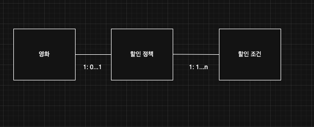
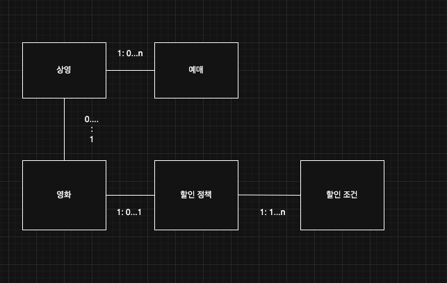

> 해당 블로그 글은 [조영호님의 인프런 강의](https://inf.run/eUUx4)를 바탕으로 쓰여진 글입니다.

## 영화 예매 시스템

우리가 객체 지향 원칙에 대해 학습하기 위해 영화 예매 시스템이라는 도메인으로 해당 원칙을 익혀보도록 하자.

### 도메인

먼저 그 전에 **도메인**이라는 용어를 알아야 한다. 도메인이란, **사용자가 프로그램을 사용하는 주제 영역**이라고 할 수 있다. 그러면 이 말을 들은 독자들은 "도저히 이해하기 힘들다"라고 말할 것이다. 그래서 조금 더 쉬운 표현으로 바꿔보도록 하자. 도메인이란, **소프트웨어로 구현 할 요구사항의 범위**라고 생각하면 좋을 것이다. 즉, 우리가 코딩으로 처리해야 할 범위라고 생각하면 될 것이다.

### 음식 배달

우리가 흔히 사용하는 "배달의 민족", "쿠팡 이츠", "요기요"를 생각해보자. 처음 이 앱을 만든 목적들은 단순했을 것이다. 이런 음식 배달은 다음과 같은 과정으로 이루어져 있을 것이다.

- 고객이 가게 전단지 확보
- 전단지에 적힌 전화번호로 가게에 연락
- 주문
- 가게 사장님이 요리
- 배달원에게 음식 전달
- 배달원이 안전하게 음식을 배달
- 고객이 결제
- 고객이 맛있게 음식 먹기

하지만 이런 과정에서 배달 정보가 누락되거나 오배달될 수 있을 것이다. 나의 경험으로 2002년 월드컵때 치킨을 주문했지만 배달이 안 오는 사태도 있었다. 여기서 우리가 소프트웨어로 구현해야 할 도메인은 바로 가게의 음식 메뉴와 주문, 결제일 것이다. 이것을 영화 도메인에 적용해보자.

**영화**라는 그 자체는 영화 포스터 이미지, 감독, 배우, 총 시간등 다양한 정보들이 존재할 것이다. 그리고 우리 고객은 영화를 **예매**를 할 것이다. 하지만 우리는 영화 자체를 예매를 하는 것이 아닌, 영화 상영시간을 예매 하는 것이다. 그런데 이뿐만 있는 것이 아니다. 영화에는 여러 할인 정책들이 존재한다. 영화 전체 금액에서 1000원을 할인해준다라는 **금액 할인**이 있을 것이고 혹은 몇% 할인을 해준다라는 **비율 할인** 정책들이 있을 것이다. 또한 이런 할인을 해주기 위해서는 어떨 때 할인을 해주겠다는 **할인 조건**이 존재할 것이다. 조조영화일 경우 할인을 해준다라던지 마지막 상영일 경우 할인을 해준다라던지 이런 순서조건이 존재할 것이고, 특정 시간대에 할인을 해준다라는 기간조건이 존재할 것이다. 즉 이것을 설계도로 나타내면 아래와 같을 것이다.

영화가 없다면 할인 정책은 당연히 없을 것이고 할인 정책이 존재한다라면 영화는 반드시 존재할 것이다. 또한 할인 정책이 존재한다면 무조건 할인 조건은 여러개가 될 수 있을 것이며 할인 조건 자체가 있다라면 할인 정책은 반드시 있을 것이다.

결국 우리는 상영정보를 바탕으로 고객이 예매를 하면 예매 정보를 보통 고객에게 보여줄 것이다. 이런 **예매**라는 도메인도 존재한다.

전체적인 설계도를 그려보면 아래와 같을 것이다.

이렇게 설계된 것을 바탕으로 우리는 처음에는 절차지향적 코딩을 진행해보고 이후에 객체지향적으로 리팩토링 하는 과정을 느껴보자.

> 잘못된 지식이 있을 경우 댓글로 남겨주시면 빠르게 반영하겠습니다!