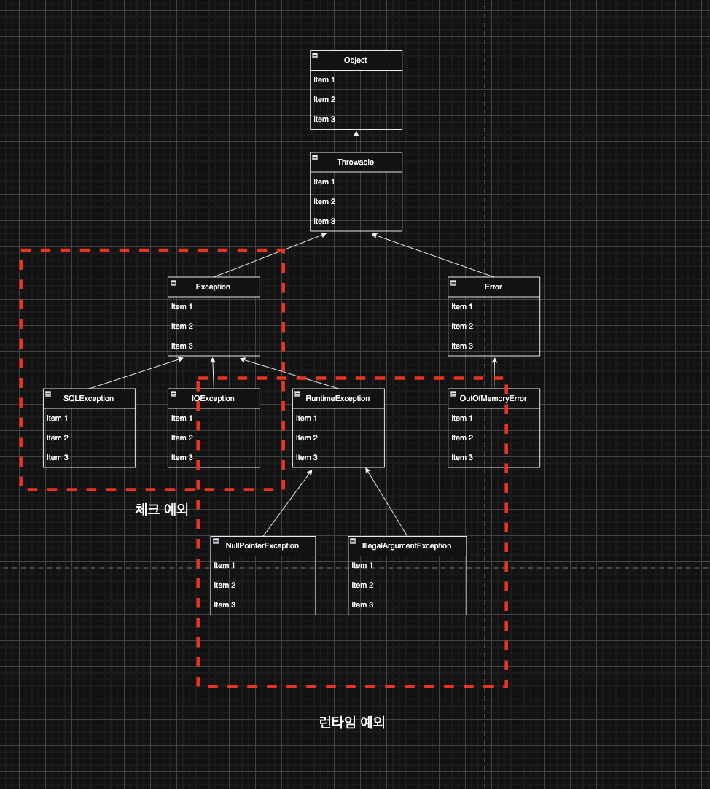
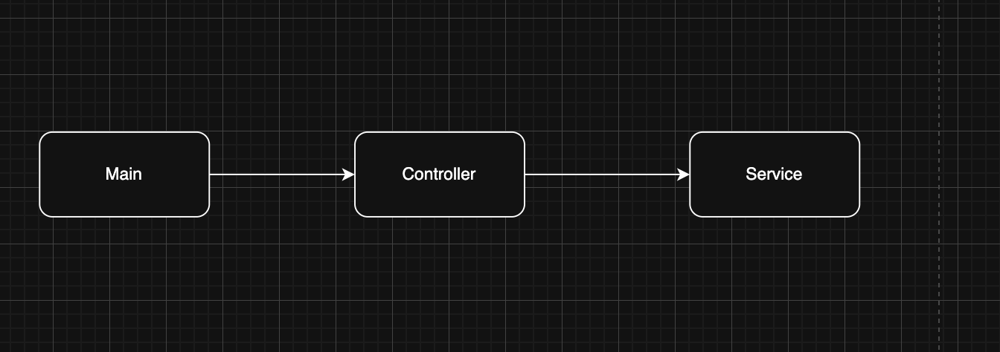

> 해당 블로그 글은 [영한님의 인프런 강의](https://inf.run/FiFGQ)를 바탕으로 쓰여진 글입니다.

## 예외 처리가 필요한 이유1 - 시작

예외 처리가 무엇인지를 학습하기 전에 예외 처리가 왜 필요한지 하나의 큰 예제를 만들면서 알아가 보자. 

이번 예제는 강의와 유사하게 네트워크 메세지 전송 기능을 만든다고 해보자. 코드의 큰 흐름은 다음과 같다. `Main` 을 통해 사용자의 입력을 받으면 사용자의 입력을 `NetworkService`에 전달한다. `NetworkService` 는 `NetworkClient`를 사용해서 외부 서버에 연결하고, 데이터를 전송하고, 전송이 완료되면 연결을 종료한다. `NetworkClient`에는 연결 기능, 전송 기능, 끊기 기능이 존재하고 해당 기능들을 `NetworkService`가 제어를 할 것이다. 그러면 코드를 작성해보자.

``` java
package exception.ex0;

public class NetworkClientV0 {

    private final String address;

    public NetworkClientV0(String address) {
        this.address = address;
    }

    public String connect() {
        System.out.println(address + " 서버 연결 성공");
        return "success";
    }

    public String send(String data) {
        System.out.println(address + " 서버에 데이터 전송: " + data);
        return "success";
    }

    public void disconnect() {
        System.out.println(address + " 서버 연결 해제");
    }
}
```

위와 같이 전송 기능, 연결 기능, 끊기 기능을 가진 `NetworkClient` 객체를 만들었다. 또한 필드로 메세지를 전송 할 주소를 받을 수 있게 해두었다. 또한 이 주소는 변경이 불가해야 하므로 불변으로 만들었다. 다음은 이를 제어하는 `NetworkService`를 개발해보자.

``` java
package exception.ex0;

public class NetworkServiceV0 {

    public void sendMessage(String data) {
        String address = "http://example.com";
        NetworkClientV0 client = new NetworkClientV0(address);

        client.connect();
        client.send(data);
        client.disconnect();
    }
}
```

`NetworkService`는 위와 같이 `sendMessage`라는 기능을 가지고 그 안에 클라이언트 객체를 생성 후, 연결, 전송, 끊기 기능을 순차적으로 진행한다.

``` java
package exception.ex0;

import java.util.Scanner;

public class MainV0 {
    public static void main(String[] args) {
        NetworkServiceV0 networkService = new NetworkServiceV0();
        Scanner scanner = new Scanner(System.in);

        while (true) {
            System.out.print("전송할 문자: ");
            String input = scanner.nextLine();

            if (input.equals("exit")) {
                break;
            }

            networkService.sendMessage(input);
            System.out.println();
        }
        System.out.println("프로그램을 정상 종료합니다.");
    }
}
```

이제 `Main`클래스에서 `NetworkService` 객체를 만들어서 `Scanner`로 입력받은 문자를 전송하는 로직을 작성하였다.

이렇게 코드를 작성하면서 뭔가 완벽한 코드라고 느껴졌다. 하지만 개인적으로는 뭔가 아쉬웠다. 연결이 실패할 경우, 전송이 실패할 경우, 끊기를 실패할 경우 이런 예외를 안 만든게 찜찜했다. 독자분들도 찜찜하셨을 것이다. 그럼 이 코드들을 점차 발전 시켜보자.

## 예외 처리가 필요한 이유2 - 오류 상황 만들기

외부 서버로 데이터를 전송할 때 여러 문제들이 존재한다. 예를 들어, 외부 서버와 통신 자체가 안 될 수 있을 것이고 또는 데이터 전송 자체에서 실패할 수 있을 것이다. 이것을 한번 가상 시뮬레이션처럼 만들어보자.

그럼 먼저 `NetworkClient`를 변경해보자.

``` java
package exception.ex1;

public class NetworkClientV1 {

    private final String address;

    public boolean connectError;

    public boolean sendError;

    public NetworkClientV1(String address) {
        this.address = address;
    }

    public String connect() {
        if (connectError) {
            System.out.println(address + " 서버 연결 실패");
            return "connectError";
        }

        System.out.println(address + " 서버 연결 성공");
        return "success";
    }

    public String send(String data) {
        if (sendError) {
            System.out.println(address + " 서버에 데이터 전송 실패: " + data);
            return "sendError";
        }

        System.out.println(address + " 서버에 데이터 전송: " + data);
        return "success";
    }

    public void disconnect() {
        System.out.println(address + " 서버 연결 해제");
    }

    public void initError(String data) {
        if (data.contains("error1")) {
            connectError = true;
        }

        if (data.contains("error2")) {
            sendError = true;
        }
    }
}
```

`connectError`와 `sendError` 필드를 두고 `initError()` 메서드를 통해 해당 에러들을 정의했다. 여기서는 전송하는 데이터에 "error1"이 포함되면 연결 에러로, "error2"가 포함되면 전송에러로 정의하는 로직을 작성했다. 그리고 각각 연결 메서드, 전송 메서드에서 해당 에러가 발생했을 때 에러 문자열을 반환하도록 하였다. 이제 이것을 사용하는 `NetworkService`를 변경해보자. 기존 코드와 같고 `initError()` 메서드만 호출해줬다.

``` java
package exception.ex1;

public class NetworkServiceV1_1 {

    public void sendMessage(String data) {
        String address = "http://example.com";
        NetworkClientV1 client = new NetworkClientV1(address);
        client.initError(data);

        client.connect();
        client.send(data);
        client.disconnect();
    }
}
```

이제 뭔가 정상적으로 잘 되는 것 같다. 하지만 여전히 남은 문제들이 존재한다. 지금 코드를 실행시켜보면, 연결에 실패해도 데이터 전송과 끊기 로직이 수행된다. 생각해보면 연결이 실패하면 바로 실패가 되어야 하는데 말이다. 또한 개발자가 나중에 확인하기 위해 오류 로그를 조금 남겨놔야 어떤 오류가 많이 발생하는지 확인하고 그 부분을 최적화 할 수 있을 것이다. 이 2가지 문제를 한번 해결해보자.

## 예외 처리가 필요한 이유3 - 반환 값으로 예외 처리

위의 2가지 문제를 해결하기 위해 서비스 코드를 조금 수정하였다.

``` java
package exception.ex1;

public class NetworkServiceV1_2 {

    public void sendMessage(String data) {
        String address = "http://example.com";
        NetworkClientV1 client = new NetworkClientV1(address);
        client.initError(data);

        String connectResult = client.connect();

        if (isError(connectResult)) {
            System.out.println("[네트워크 오류 발생] 오류 코드: " + connectResult);
            return;
        }

        String sendResult = client.send(data);

        if (isError(sendResult)) {
            System.out.println("[네트워크 오류 발생] 오류 코드: " + sendResult);
            return;
        }

        client.disconnect();
    }

    private boolean isError(String resultCode) {
        return !resultCode.equals("success");
    }
}
```

위의 코드를 살펴보면 `connect()` 메서드와 `send()` 메서드의 반환값을 이용하여 오류일 때는 `early return` 구조로 해당 로직에 벗어나게끔 하였다. 이러니 오류 로그도 출력하고 오류가 나면 그 뒤의 작업들은 수행히 안되게끔 작성하였다. 하지만 이렇게 구조를 바꾸니 추가적인 문제가 발생하였다. 바로 연결 끊기 로직이 수행이 안되는 것이다. 생각해보면 전송을 실패하든, 연결에 실패하든 찌꺼기 자원을 수거해야하는 로직이 필요할 것이다. 이렇게 연결끊기를 안 하면 추후에 네트워크 자원이 고갈되는 사태까지 발생한다. 즉, 오류가 발생해도 연결끊기 작업은 반드시 수행되어야 한다.

> ✅ 참고
>
> 자바의 경우 GC가 있기 때문에 JVM 메모리에 있는 인스턴스는 자동으로 해제할 수 있다. 하지만 외부 연결과 같은 자바 외부의 자원은 자동으로 해제가 되지 않는다. 따라서 외부 자원을 사용한 후에는 연결을 해제해서 외부 자원을 반드시 반납해야 한다.

그러면 반드시 연결 끊기가 되게끔 코드를 수정해보자. 바로 `early return`구조를 안 쓰면 되는 것이다.

``` java
package exception.ex1;

public class NetworkServiceV1_3 {

    public void sendMessage(String data) {
        String address = "http://example.com";
        NetworkClientV1 client = new NetworkClientV1(address);
        client.initError(data);

        String connectResult = client.connect();

        if (isError(connectResult)) {
            System.out.println("[네트워크 오류 발생] 오류 코드: " + connectResult);
        } else {
            String sendResult = client.send(data);

            if (isError(sendResult)) {
                System.out.println("[네트워크 오류 발생] 오류 코드: " + sendResult);
            }
        }

        client.disconnect();
    }

    private boolean isError(String resultCode) {
        return !resultCode.equals("success");
    }
}
```

위와 같이 작성을 하니 이제는 오류가 발생해도 연결 끊기 작업이 수행되기 때문에 네트워크 자원도 고갈이 안되고 좋은 프로그램이 된 듯 보인다. 하지만 독자들이 봐도 해당 코드는 너무 지저분해 보일 것이다. 왜냐하면 정상 흐름과 예외 흐름이 전혀 분리되어 있지 않다. 어떤 부분이 정상 흐름이고 어떤 부분이 예외 흐름인지 이해하기가 너무 어렵다. 심지어 예외 흐름을 처리하는 부분이 더 많다. 즉, 정상 흐름과 예외 흐름이 섞여 있기 때문에 코드를 한눈에 이해하기 어렵다. 쉽게 이야기해서 가장 중요한 정상 흐름이 한눈에 들어오지 않는다. 이런 문제를 해결하기 위해 바로 예외 처리 메커니즘이 존재한다. 지금부터 본격적으로 자바 예외 처리에 대해 알아보자. 

## 자바 예외 처리1 - 예외 계층

자바는 프로그램 실행 중에 발생할 수 있는 예상치 못한 상황, 즉 예외(Exception)를 처리하기 위한 메커니즘을 제공한다. 이는 프로그램의 안정성과 신뢰성을 높이는 데 중요한 역할을 한다.

자바에서 예외를 처리할 때 사용하는 키워드는 다음과 같다.

> `try`, `catch`, `finally`, `throw`, `throws`

### 예외 계층 구조



- `Object` : 자바에서 기본형을 제외한 모든 것은 객체다. 예외도 객체이다. 모든 객체의 최상위 부모는 `Object` 이므로 예외의 최상위 부모도 `Object` 이다.
- `Throwable` : 최상위 예외이다. 하위에 `Exception` 과 `Error` 가 있다.
- `Error` : 메모리 부족이나 심각한 시스템 오류와 같이 애플리케이션에서 복구가 불가능한 시스템 예외이다. 애플리케이션 개발자는 이 예외를 잡으려고 해서는 안된다.
- `Exception` : 체크 예외
    - 애플리케이션 로직에서 사용할 수 있는 실질적인 최상위 예외이다.
    - `Exception` 과 그 하위 예외는 모두 컴파일러가 체크하는 체크 예외이다. 단 `RuntimeException` 은 예외로 한다.
- `RuntimeException` : 언체크 예외, 런타임 예외
    - 컴파일러가 체크 하지 않는 언체크 예외이다.
    - `RuntimeException` 과 그 자식 예외는 모두 언체크 예외이다.
    - `RuntimeException` 의 이름을 따라서 `RuntimeException` 과 그 하위 언체크 예외를 **런타임 예외**라고 많이 부른다.

### 체크 예외 vs 런타임 예외

체크 예외는 개발자가 명시적으로 예외처리를 해줘야 한다. 그렇지 않으면 컴파일 에러가 발생한다. 하지만 런타임 예외는 개발자가 명시적으로 안 잡아도 컴파일 에러가 발생하지 않는다.

> ⚠️ 주의
>
> 상속 관계에서 부모 타입은 자식을 담을 수 있다. 이 개념이 예외 처리에도 적용되는데, 상위 예외를 `catch`로 잡으면 그 하위 예외까지 함께 잡는다. 따라서 애플리케이션 로직에서는 `Throwable` 예외를 잡으면 안되는데, 앞서 이야기 한 잡으면 안되는 `Error` 예외도 함께 잡을 수 있기 때문이다. 애플리케이션 로직은 이런 이유로 `Exception` 부터 필요한 예외로 생각하고 잡으면 된다.

## 자바 예외 처리2 - 예외 기본 규칙

예외는 폭탄 돌리기와 같다. 예외가 발생하면 잡아서 처리하거나, 처리할 수 없으면 밖으로 던져야한다.



위의 코드처럼 `Main`은 `Controller`를 호출하고 `Controller`는 `Service`를 호출한다고 해보자. 만약 `Service`에서 예외가 발생했고 `Service` 안에서 예외처리를 못한다고 해보자. 그러면 반드시 `Service`를 호출한 `Controller`에서 예외를 처리해야 한다. 만약 `Controller`에서 예외를 처리하지 못한다면 `Main`으로 던져서 `Main`에서 처리해야 한다.

예외에서 기억할 2가지 규칙이 있는데 이것은 반드시 기억하자.

- 예외는 잡아서 처리하거나 밖으로 던져야 한다.
- 예외를 잡거나 던질 때 지정한 예외뿐만 아니라 그 예외의 자식들도 함께 처리할 수 있다.
    - 예를 들어서 `Exception` 을 `catch`로 잡으면 그 하위 예외들도 모두 잡을 수 있다.
    - 예를 들어서 `Exception` 을 `throws`로 던지면 그 하위 예외들도 모두 던질 수 있다.

> ✅ 참고
>
> 만약 예외를 계속 처리하지 못하고 던져서 자바 `main()` 밖으로 예외를 던지면 예외 로그를 출력하면서 시스템이 종료된다.

## 자바 예외 처리3 - 체크 예외

- `Exception` 과 그 하위 예외는 모두 컴파일러가 체크하는 체크 예외이다. 단 `RuntimeException` 은 예외로 한다.
- 체크 예외는 잡아서 처리하거나, 또는 밖으로 던지도록 선언해야한다. 그렇지 않으면 컴파일 오류가 발생한다.

그러면 예제 코드를 통해 한번 체크 예외에 대해 살펴보자.

``` java
package exception.basic.checked;

public class MyCheckedException extends Exception {

    public MyCheckedException(String message) {
        super(message);
    }
}
```

체크 예외의 부모이자 예외의 부모인 `Exception` 클래스를 상속 받았다. 체크 예외 클래스를 받으려면 `Exception` 클래스를 상속받아야 한다. 또한 메세지를 받는 생성자를 생성하였는데 여기서 내용은 단순히 부모 생성자를 호출하는 기능이다. 예외가 제공하는 기본 기능이 있는데, 그 중에 오류 메시지를 보관하는 기능도 있다. 예제에서 보는 것 처럼 생성자를 통해서 해당 기능을 그대로 사용하면 편리하다. 해당 메세지는 예외의 최종 부모인 `Throwable`의 `detailMessage` 필드에 저장이 된다. 그리고 조회할 때는 `getMessage()`라는 것을 호출하여 불러올 수 있다.

``` java
package exception.basic.checked;

public class Client {

    public void call() throws MyCheckedException {
        throw new MyCheckedException("ex");
    }
}
```

`throw`라는 키워드를 통하여 예외를 발생시킬 수 있다. 예외를 발생시키려면 `throw new 예외 생성자`를 호출해야 한다. 그러면 예외 발생 즉시, 아래의 코드들을 수행하지 않고 해당 메서드를 나간다. 자세히 말하면 메서드를 나가는게 아니고 메서드한테 물어본다고 생각하자. "이 예외 내가 처리하는거야?"라고 물어본다. 그러면 메서드는 자신에게 `thorws 예외`가 붙어있는지 확인해본다. 만약 붙어있다면 해당 메서드를 빠져나가서 그 메서드를 호출한 곳으로 던져준다. 그게 아니라면 컴파일 에러를 발생 시킨다. 여기서 하나 중요한 것은 예외를 던질 때 `thorws`를 사용해야 한다는 것이다.

``` java
package exception.basic.checked;

public class Service {
    Client client = new Client();

    public void callCatch() {
        try {
            client.call();
        } catch (MyCheckedException e) {
            System.out.println("예외 처리, message = " + e.getMessage());
        }

        System.out.println("정상 흐름");
    }

    public void callThrow() throws MyCheckedException {
        client.call();
    }
}
```

위의 서비스 코드에는 `Client`에서 넘어온 예외를 직접 잡는 메서드 하나와 예외를 던져주는 메서드 2개를 선언하였다. 그러면 하나하나 살펴보자. 먼져 예외를 잡는 메서드를 호출하는 과정을 보자.

``` java
package exception.basic.checked;

public class CheckedCatchMain {
    public static void main(String[] args) {
        Service service = new Service();
        service.callCatch();
        System.out.println("정상 종료");
    }
}
```

`main`에서 `callCatch`라는 메서드를 호출한다. 그리고 `client.call()`을 호출하고 `Client`클래스에서 예외를 받는다. 예외를 받으면 해당 메서드에서 `try-catch`로 예외를 잡는다. 여기서 `try` 코드블럭에는 예외가 발생할 법한 코드들을 넣고 예외를 잡으면 `catch` 블록에 넘어가서 상황에 맞게 예외를 처리해주는 것이다. `catch`로 예외를 잡아서 처리하고 나면 코드가 `catch` 블럭의 다음 라인으로 넘어가서 정상 흐름으로 작동한다. 그런데 `catch`로 넘겨준 예외가 인수에 있는 예외 하위타입이거나 맞아야 한다. 만약 `try` 에서 잡은 예외가 `catch` 의 대상에 없으면 예외를 잡을 수 없다. 이때는 예외를 밖으로 던져야 한다. 또한 `catch` 에 `MyCheckedException` 의 상위 타입인 `Exception`을 적어주어도 `MyCheckedException` 을 잡을 수 있다. `catch` 에 예외를 지정하면 해당 예외와 그 하위 타입 예외를 모두 잡아준다. 물론 정확하게 `MyCheckedException` 만 잡고 싶다면 `catch`에 `MyCheckedException`을 적어주어야 한다. 예외도 객체이기 때문에 다형성이 적용된다.

그러면 예외를 잡지 않고 예외를 던져주는 `callThrow()` 메서드를 확인해보자.

``` java
package exception.basic.checked;

public class CheckedThrowMain {
    public static void main(String[] args) throws MyCheckedException {
        Service service = new Service();
        service.callThrow();
        System.out.println("정상 종료");
    }
}
```

`Service.callThrow()` 안에서 예외를 처리하지 않고, 밖으로 던졌기 때문에 예외가 `main()` 메서드까지 올라온다. `main()` 의 `service.callThrow()` 를 호출하는 곳에서 예외를 잡아서 처리하지 못했기 때문에 여기서 예외가 `main()` 밖으로 던져진다. 따라서 `main()` 에 있는 `service.callThrow()` 메서드 다음에 있는 "정상 종료"가 출력되지 않는다. 예외가 `main()` 밖으로 던져지면 예외 정보와 스택 트레이스(Stack Trace)를 출력하고 프로그램이 종료된다.

> ✅ 참고
>
> 스택 트레이스 정보를 활용하면 예외가 어디서 발생했는지, 그리고 어떤 경로를 거쳐서 넘어왔는지 확인할 수 있다.

`throws` 에 `MyCheckedException` 의 상위 타입인 `Exception` 을 적어주어도 `MyCheckedException`을 던질 수 있다. `throws` 에 지정한 타입과 그 하위 타입 예외를 밖으로 던진다. 물론 정확하게 `MyCheckedException` 만 밖으로 던지고 싶다면 `throws` 에 `MyCheckedException`을 적어주어야 한다. 예외도 객체이기 때문에 다형성이 적용된다.

### 체크 예외 장단점

- 장점: 개발자가 실수로 예외를 누락하지 않도록 컴파일러를 통해 문제를 잡아주는 훌륭한 안전 장치이다. 이를 통해 개발자는 어떤 체크 예외가 발생하는지 쉽게 파악할 수 있다.
- 단점: 하지만 실제로는 개발자가 모든 체크 예외를 반드시 잡거나 던지도록 처리해야 하기 때문에, 너무 번거로운 일이 된다. 크게 신경쓰고 싶지 않은 예외까지 모두 챙겨야 한다.

## 자바 예외 처리4 - 언체크 예외

`RuntimeException` 과 그 하위 예외는 언체크 예외로 분류된다. 언체크 예외는 말 그대로 컴파일러가 예외를 체크하지 않는다는 뜻이다. 언체크 예외는 체크 예외와 기본적으로 동일하다. 차이가 있다면 예외를 던지는 `throws` 를 선언하지 않고, 생략 할 수 있다. 생략한 경우 자동으로 예외를 던진다.

그럼 언체크 예외에 대한 예제 코드를 살펴보자.

``` java
package exception.basic.unchecked;

public class MyUncheckedException extends RuntimeException {
    public MyUncheckedException(String message) {
        super(message);
    }
}
```

위의 코드는 `RuntimeException`을 상속받은 언체크 커스텀 예외를 만들었다.

``` java
package exception.basic.unchecked;

public class Client {

    public void call() {
        throw new MyUncheckedException("ex");
    }
}
```

위의 코드에서는 언체크 예외를 발생시켰다. 그런데 체크예외랑 다른 점은 우리가 명시적으로 메서드에 `throws`로 예외를 안 던져도 된다. 자바에서 알아서 해주기 때문이다. 물론, 명시적으로 던져도 무방하다.

``` java
package exception.basic.unchecked;

public class Service {

    Client client = new Client();

    public void callCatch() {
        try {
            client.call();
        } catch (MyUncheckedException e) {
            System.out.println("예외 처리, message = " + e.getMessage());
        }

        System.out.println("정상 로직");
    }

    public void callThrow() {
        client.call();
    }
}
```

위의 코드도 체크예외처럼 언체크 예외를 잡는 메서드 하나와 언체크 예외를 던지는 메서드 하나로 잡아두었다. 체크예외와 달랐던 점은 예외를 던지는 `callThorw()` 메서드에서 명시적으로 `throws`를 안해줘도 된다는 점이다.

> ✅ 참고
>
> 일반적으로 언체크 예외는 `try-catch`로 잡지 않는다. 하지만 굳이 위와 같이 잡아서 처리할 수 있긴 하다.

> ✅ 참고
>
> 언체크 예외는 `thorws` 키워드를 통해 예외 던지는 것을 주로 생략하지만, 중요한 예외의 경우 이렇게 선언해두면 해당 코드를 호출하는 개발자가 이런 예외가 발생한다는 점을 IDE를 통해 좀 더 편리하게 인지할 수 있다. (언체크 예외를 던진다고 선언한다고 해서 체크 예외 처럼 컴파일러를 통해서 체크할 수 있는 것은 아니다. 해당 메서드를 호출하는 개발자가 IDE를 통해 호출 코드를 보고, 이런 예외가 발생한다고 인지할 수 있는 정도이다.)

### 언체크 예외 장단점

- 장점: 신경쓰고 싶지 않은 언체크 예외를 무시할 수 있다. 체크 예외의 경우 처리할 수 없는 예외를 밖으로 던지려면 항상 `throws 예외` 를 선언해야 하지만, 언체크 예외는 이 부분을 생략할 수 있다.
- 단점: 언체크 예외는 개발자가 실수로 예외를 누락할 수 있다. 반면에 체크 예외는 컴파일러를 통해 예외 누락을 잡아준다.

현대 어플리케이션은 주로 언체크 예외를 기본으로 한다. 체크 예외를 사용하는 경우는 극히 드물다. 왜 그럴까? 생각만 해보면 체크예외가 컴파일 타임에서 잡아주고 실수도 방지하니까 더 좋은게 아닐까? 해당 부분을 다음 포스팅에서 이어서 설명하겠다.

> 잘못된 지식이 있을 경우 댓글로 남겨주시면 빠르게 반영하겠습니다!