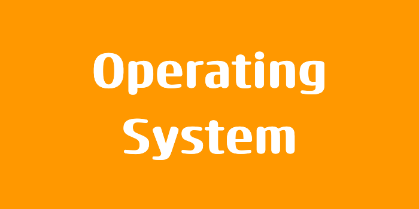

> 본 포스팅은 인프런의 [개발자를 위한 컴퓨터공학 1: 혼자 공부하는 컴퓨터구조 + 운영체제](https://inf.run/6vJaw)를 참조하여 작성한 글입니다.

## 교착 상태란

도심 속 도로에서 차가 꽉 막혀 꼼짝달싹 못하는 상황을 본 적이 있을 것이다. 이렇게 교통이 마비되어 버리면 복구되기까지 오랜 시간이 걸릴 뿐더러 심한 경우 교통 경찰이 직접 와서 마비를 해결해야 할 것이다. 프로세스 실행 과정에도 이와 비슷한 문제가 있다. 프로세스를 실행하기 위해서는 자원이 필요한데 2개 이상의 프로세스가 각자 가지고 있는 자원을 무작정 기다린다면 그 어떤 프로세스도 더 이상 진행할 수 없는 교착상태가 된다. 그러면 교착상태가 무엇이고 언제 어떻게 발생하는지 알아보자.

### 식사하는 철학자 문제

식사하는 철학자 문제는 교착상태를 설명하기 위한 아주 고전적이고 재밌는 문제이다. 동그란 원탁에 다섯 명의 철학자가 앉아 있다. 이 철학자들 앞에는 맛있는 식사가 있고 철학자들 사이 사이에는 식사에 필요한 포크가 있다고 하자. 그리고 철학자들 앞에 있는 식사는 2개의 포크로 먹을 수 있는 음식이라 가정하자. 그러면 철학자들은 아래와 같은 순서로 식사를 진행할 것이다.

- 계속 생각을 하다가 왼쪽 포크가 사용 가능하면 집어든다.
- 계속 생각을 하다가 오른쪽 포크가 사용 가능하면 집어든다.
- 왼쪽과 오른쪽 포크를 모두 집어들면 정해진 시간동안 식사를 한다.
- 식사 시간이 끝나면 오른쪽 포크를 내려 놓는다.
- 오른쪽 포크를 내려 놓은 뒤 왼쪽 포크를 내려 놓는다.
- 첫번째 과정을 다시 반복한다.

이러면 철학자들은 무사히 전부 식사를 마칠 수 있을까? 지금 보기에는 아무런 문제가 없어 보인다. 그런데 만약 **동시에** 라는 조건이 발생하면 엄청 큰일이 난다. 바로 교착 상태가 발생하는 것이다. 동시에 왼쪽 포크를 들고 오른쪽 포크를 집어드려는 순간 오른쪽 포크가 없어서 대기를 하게 된다. 이렇게 교착 상태는 일어나지 않을 사건을 기다리며 진행이 멈춰버리는 증상을 말한다. 다른 예시로는 철수가 화장실에 들어가서 잠금을 하고 볼일을 본 뒤 휴지로 닦으려는 순간 휴지가 없다. 그런데 화장실을 기다리는 영희는 휴지를 가지고 있다. 이런 상황도 교착 상태가 발생하는 것이다.

교착상태를 해결하기 위해서는 교착상태가 발생했을 때의 상황을 정확히 표현해보고 교착상태가 일어나는 근본적인 이유를 이해해야 한다. 그러면 먼저 교착상태가 발생했을 상황을 표현하는 방법에 대해 알아보자.

### 자원 할당 그래프

자원 할당 그래프란 교착상태 발생 조건을 파악할 수 있다. 어떤 프로세스가 어떤 자원을 할당 받아 사용 중인지 확인이 가능하며 어떤 프로세스가 어떤 자원을 기다리고 있는지 파악이 가능한 것이다. 그러면 방법을 알아보자.

- 프로세스는 원으로, 자원의 종류는 사각형으로 표현한다.
- 사용할 수 있는 자원의 개수는 자원 사각형 내의 점으로 표현한다.
- 프로세스가 어떤 자원을 할당받아 사용 중이라면 자원에서 프로세스를 향해 화살표를 표시한다.
- 프로세스가 어떤 자원을 기다리고 있다면 프로세스에서 자원으로 화살표를 표시한다.

이 과정으로 식사하는 철학자 문제를 보면 특징을 볼 수 있다. 자원 할당 그래프가 원형 형태를 띄고 있을 것이다.

### 교착 상태 발생 조건

그러면 교착 상태는 왜 발생할까? 고착 상태가 발생할 조건에는 4가지가 존재한다. 아래의 4가지 조건이 하나라도 만족하지 않는다면 교착상태는 발생하지 않지만 아래 조건이 모두 만족될 때 교착 상태가 발생할 가능성이 존재한다.

- 상호배제: 한 프로세스가 사용하는 자원을 다른 프로세스가 사용할 수 없는 상태
- 점유와 대기: 자원을 할당받은 상태에서 다른 자원을 할당받기를 기다리는 상태
- 비선점: 어떤 프로세스도 다른 프로세스의 자원을 강제로 빼앗지 못하는 상태
- 원형 대기: 프로세스들이 원의 형태로 자원을 대기하는 상태

## 교착 상태 해결 방법

그러면 운영체제는 이런 교착 상태를 어떻게 해결할까? 크게 3가지 방법이 존재한다. 예방, 회피, 검출 후 회복이다.

운영체제는 교착상태가 일어나지 않도록 교착 상태 발생 조건에 부합하지 않게 자원을 분배하여 교착상태를 예방할 수 있고 교착상태가 발생하지 않을 정도로 조금씩 자원을 할당하다가 교착 상태의 위험이 있다면 자원을 할당하지 않는 방식으로 교착상태를 회피할 수도 있다. 그리고 자원을 제약 없이 할당하다가 교착 상태가 검출되면 교착 상태를 회복하는 방법을 취할수도 있다. 이에 대하 한번 알아보자.

### 교착 상태 예방

교착 상태 예방은 애초에 교착 상태가 발생하지 않도록 교착상태 발생 조건(상호배제, 점유와 대기, 비선점, 원형대기) 중 하나를 없애는 방식이다.

먼저 상호배제를 없애는 방법에 대해 알아보자. 상호 배제를 없애면 모든 자원을 공유하게 하는 방식이다. 하지만 이것은 현실적으로 불가능하다. 그렇다면 점유와 대기를 없애보자. 특정 프로세스에 자원을 모두 할당하거나 아예 할당하지 않는 방식으로 배분할 수도 있다. 하지만 해당 방식은 자원의 활용율을 낮출 수 있는 방식이라는 부작용이 존재한다. 이번에는 비선점 조건을 없애보자. 선점이 가능한 자원(e.g. CPU)에 한해서는 정말 효과적이다. 하지만 모든 자원이 선점이 가능한 것은 아니다. 마지막으로 원형 대기 조건을 없애보자. 자원에 번호를 붙이고 오름차순으로 할당하면 원형 대기는 발생하지 않는다. 하지만 자원에 번호를 붙이는 것은 어려운 작업이다. 어떤 자원에 어떤 번호를 붙이냐에 따라 활용율이 달라진다.

이렇게 교착 상태 예방은 교착상태가 발생하지 않음은 보장할 수 있으나 부작용이 따를 수 있다.

### 교착 상태 회피

교착 상태 회피란 교착 상태를 무분별한 자원 할당으로 인해 발생했다고 간주하는 것이다. 교착 상태가 발생하지 않을만큼 조심조심 할당하는 방법이다. 배분할 수 있는 자원의 양을 고려하여 교착상태가 발생하지 않을 만큼만 자원을 분배하는 기법이다. 해당 회피 방법에는 3가지 용어가 등장한다.

- 안전 순서열: 교착 상태 없이 안전하게 프로세스들에 자원을 할당할 수 있는 순서
- 안전 상태: 교착 상태 없이 모든 프로세스가 자원을 할당받고 종료될 수 있는 상태를 의미한다. -> 안전 순서열이 있는 상태
- 불안전 상태: 교착 상태가 발생할 수도 있는 상태 -> 안전 순서열이 없는 상태

그러면 예시를 한번 들어보자. 할당 가능한 자원이 12개가 있고 p1, p2, p3에게 할당한 자원이 9개라고 해보자. 그리고 p1은 추가 5개 자원을 더 요청할 수 있고 p2는 2개, p3는 7개가 남았다고 해보자. 그런데 우리가 남은 자원은 3개이다. 이럴 때 안전 순서열은 어떻게 될까?

일단 3개를 할당 받을 수 있는 프로세스는 p2이다. 그래서 p2에게 2개를 할당해준다. 그러면 남은 자원은 1개가 되고 나머지 프로세스에게는 할당을 못한다. 그리고 p2가 작업을 완료하면 총 4개를 반환할 것이고 남은 자원은 5개가 된다. 그러면 이제 p1에게 5개 전부를 할당할 수 있다. 그러면 남은 자원은 0개가 되고 p1이 전부 작업 완료 후, 10개를 반환할 것이다. 그 다음 p3가 7개를 요청할 것이고 남은 자원은 3개가 될 것이고 p3가 작업 완료 후 9개의 자원을 반환할 것이다. 즉, 안전 순서열은 p2 -> p1 -> p3가 된다.

이렇게 안전 상태에서 안전 상태로 움직이는 경우에만 자원을 할당할 수 있는 방식이 안전 순서열 방식이다. 항시 안전 상태를 유지하도록 자원을 할당하는 방식이다. 대표적인 케이스로 은행원 알고리즘이 존재하는데 한번 살펴보면 좋을 것 같다.

### 교착 상태 검출 후 회복

교착 상태 검출 후 회복은 교착 상태의 발생을 인정하고 사후에 조치하는 방식을 말한다. 프로세스가 자원을 요구하면 일단 할당하고 만약 교착 상태가 검출되면 회복을 하는 방식이다. 회복하는 방식에는 크게 선점을 통한 회복방식과 프로세스 강제 종료를 통한 회복 방식이 존재한다. 선점을 통한 회복 방식은 교착 상태가 해결될 때까지 한 프로세스씩 자원을 몰아주는 방식이다. 프로세스 강제 종료를 통한 회복 방식에는 교착상태에 놓인 프로세스 모두 강제 종료를 한다. 이 과정에서 작업 내역이 유실될 수도 있다. 이렇게 교착 상태가 해결될 때까지 한 프로세스씩 강제 종료를 하는 방식이다. 이 외에도 타조 알고리즘도 존재하니 한번 공부해보면 좋을 것 같다.

> 타조 알고리즘: 교착 상태를 무시하는 방법