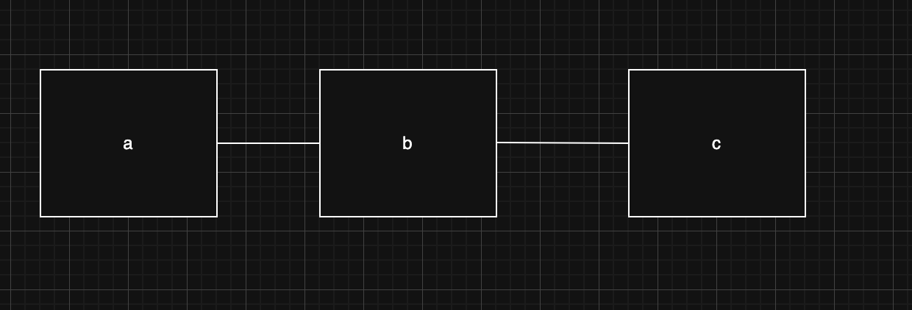
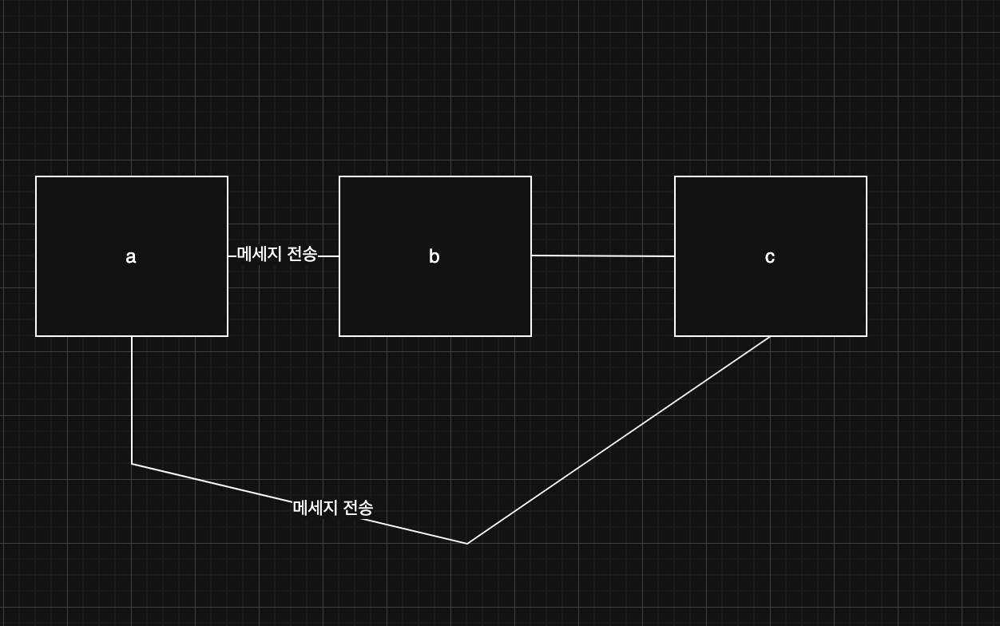
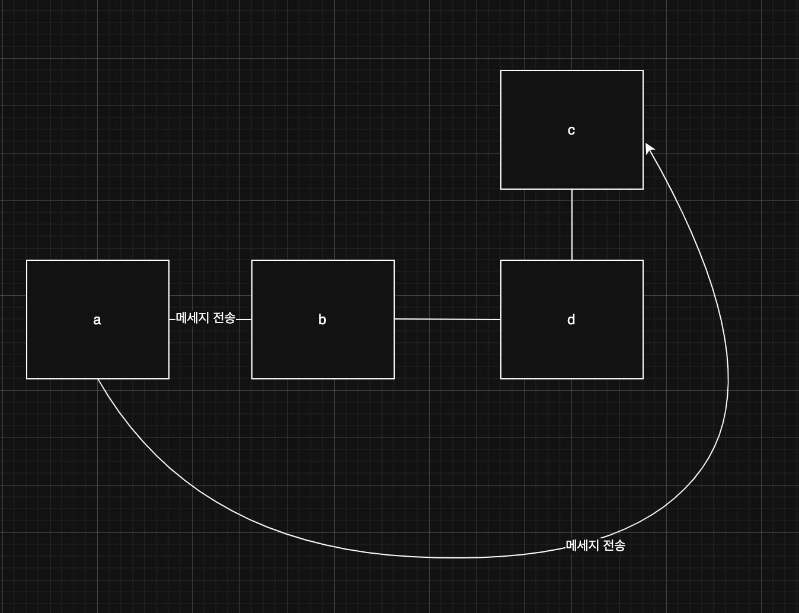

> 해당 블로그 글은 [조영호님의 인프런 강의](https://inf.run/HXdiC)를 바탕으로 쓰여진 글입니다.

## 디미터 법칙과 묻지 말고 시켜라 원칙

캡슐화를 위한 2가지 설계 원칙이 존재한다. 바로 **디미터 법칙**과 **묻지 말고 시켜라** 원칙이 존재한다.

디미터 법칙이란, 협력하는 객체 내부구조를 모르고도 협력이 가능해야하는 법칙을 의미한다. 즉, 결합도가 낮아져야 하며 결합도를 낮추기 위해 메세지 전송을 제한할 필요가 있다. 예를 들어 a라는 객체가 b를 참조하고 b 객체가 c를 참조한다고 생각해보자.



이런 상황에서 아래와 같이 a가 b와 c에게 메세지를 전송할 수 있다고 해보자.



이런 상황에 d라는 객체가 b와 c 사이에 생겼다고 해보자.



이렇게 구조가 변경되고 메세지 자체가 만약 객체의 상태를 변경하는 거라면 이 변경 여파는 a와 b까지도 전부 전파가 될 것이다. 그래서 결합도를 낮추기 위하여 의존성을 제거해야 한다. 즉, a가 c로 메세지 전송을 못하고 직접 참조하는 객체에게만 전송해야 한다.

이것을 a는 구조 변경에 독립적이므로 구조 변경에 캡슐화를 하였다라고 표현한다. 이것이 바로 디미터 법칙인데 이것을 사전에 나오는 풀이를 확인해보자.

> 📚 디미터 법칙
>
> 모든 클래스 C는 C에 구현된 모든 메서드 M에 대해서, M이 메세지를 전송할 수 있는 객체는 아래와 같다.
> - M의 인자로 전달된 클래스(C 자체를 포함)
> - C의 인스턴스 변수의 클래스
>
> (M에 의해 생성된 객체나 M이 호출하는 메서드나 함수에 의해 생성된 객체, 전역변수로 선언된 객체는 모두 M의 인자로 간주한다.)

하지만 설명이 너무 딱딱해서 이해하기 어렵다. 이것을 쉽게 표현하면 아래와 같다.

> 📚 디미터 법칙
>
> 클래스 내부의 메서드는 아래 조건을 만족하는 인스턴스에만 메세지를 전송해야 한다.
> - this 객체
> - 메서드의 매개변수
> - this의 속성
> - this의 속성인 컬렉션 요소
> - 메서드 내에서 생성된 지역 객체

디미터 법칙을 또 다른 표현으로 하자면 아래와 같이 표현할 수도 있으니 참고만 하자.

- 낯선자에게 말하지 말아라
- 오직 인접한 이웃에게만 말해라
- 오직 하나의 도트만 사용하자

기존 `Game` 클래스에서는 인접한 이웃이 아닌 `WorldMap`, `Position`, `Room`에 의존하고 있다. 왜냐하면 `Game` 객체 안에서 `Player`의 내부 인스턴스 변수인 `WorldMap`, `Position`, `Room`에 관해 물어보기 때문이다. 이것을 그러면 어떻게 해결할 수 있을까? 바로 **묻지 말고 시켜라** 원칙을 사용하면 된다.

> 📚 묻지 말고 시켜라 법칙
>
> 여러분은 객체에게 원하는 작업을 이야기함으로써 명령을 전송해야 한다. 우리는 객체의 상태를 묻고 결정을 내린 후, 객체에게 무엇을 수행할 지 지시하는 방식을 선호하지 않는다. 호출자는 호출된 객체의 상태를 바탕으로 결정을 내린 후에 해당 객체의 상태를 변경해서는 안된다. 구현하고 있는 논리는 아마도 호출된 객체의 책임이지, 호출하는 쪽의 책임은 아니다. 객체 외부에서 결정을 내리는 것은 객체의 캡슐화를 위반하는 것이며 버그가 발생하기 쉬운 환경을 조성한다.

즉 책임의 이동을 통하여 이전 문제를 해결할 수 있다. 즉, 아래와 같이 코드를 리팩토링 할 수 있을 것이다.

``` java
package me.sungbin.adventure;

public class Player {

    private WorldMap worldMap;

    private Position position;

    public Player(WorldMap worldMap, Position position) {
        this.worldMap = worldMap;
        this.position = position;
    }

    public boolean move(Direction direction) {
        if (worldMap.isBlocked(position.shift(direction))) {
            return false;
        }

        this.position = this.position.shift(direction);
        return true;
    }

    Position position() {
        return position;
    }

    public Room currentRoom() {
        return worldMap.roomAt(position);
    }
}
```

``` java
package me.sungbin.adventure;

import java.util.Scanner;

public class Game {

    private Player player;
    private CommandParser commandParser;
    private boolean running;

    public Game() {
        this.player = new Player(
                new WorldMap(
                        Size.with(2, 3),
                        new Room(Position.of(0, 0), "샘", "아름다운 샘물이 흐르는 곳입니다. 이곳에서 휴식을 취할 수 있습니다."),
                        new Room(Position.of(0, 1), "다리", "큰 강 위에 돌로 만든 커다란 다리가 있습니다."),
                        new Room(Position.of(1, 1), "성", "용왕이 살고 있는 성에 도착했습니다."),
                        new Room(Position.of(0, 2), "언덕", "저 멀리 성이 보이고 언덕 아래로 좁은 길이 나 있습니다."),
                        new Room(Position.of(1, 2), "동굴", "어둠에 잠긴 동굴 안에 작은 화톳불이 피어 있습니다.")),
                Position.of(0, 2));
        this.commandParser = new CommandParser();
    }

    public void run() {
        welcome();
        play();
        farewell();
    }

    private void welcome() {
        showGreetings();
        showRoom();
        showHelp();
    }

    private void showGreetings() {
        System.out.println("환영합니다!");
    }

    private void showHelp() {
        System.out.println("다음 명령어를 사용할 수 있습니다.");
        System.out.println("go {north|east|south|west} - 이동, look - 보기, help - 도움말, quit - 게임 종료");
    }

    private void farewell() {
        System.out.println("\n게임을 종료합니다.");
    }

    private void play() {
        Scanner scanner = new Scanner(System.in);

        start();
        while (isRunning()) {
            String input = inputCommand(scanner);
            Command command = commandParser.parseCommand(input);
            executeCommand(command);
        }
    }

    private void executeCommand(Command command) {
        switch(command) {
            case Command.Move move -> tryMove(move.direction());
            case Command.Look() -> showRoom();
            case Command.Help() -> showHelp();
            case Command.Quit() -> stop();
            case Command.Unknown() -> showUnknownCommand();
        }
    }

    private void tryMove(Direction direction) {
        if (player.move(direction)) {
            showRoom();
            return;
        }

        showBlocked();
    }

    private void showBlocked() {
        System.out.println("이동할 수 없습니다.");
    }

    public void showRoom() {
        System.out.println("당신은 [" + player.currentRoom().name() + "]에 있습니다.");
        System.out.println(player.currentRoom().description());
    }

    private boolean isRunning() {
        return running;
    }

    private String inputCommand(Scanner scanner) {
        showPrompt();
        return input(scanner);
    }

    private void start() {
        running = true;
    }

    private void stop() {
        this.running = false;
    }

    private void showUnknownCommand() {
        System.out.println("이해할 수 없는 명령어입니다.");
    }

    private String input(Scanner scanner) {
        return scanner.nextLine();
    }

    private void showPrompt() {
        System.out.print("> ");
    }
}
```

이렇게 해결함으로써, 기존 문제인 강한 결합도와 양방향 참조 문제가 해결이 되었다. 이제 1가지 남은 문제가 존재한다.

## 명령 쿼리 분리 원칙으로 부수효과 관리하기

일련의 절차를 묶어 호출가능하도록 이름을 부여한 기능 모듈을 **루틴**이라고 한다. 루틴의 분류로는 부수효과와 반환 값의 유무에 따라 프로시저와 함수로 분리한다. 이것을 객체지향적인 관점에서 봤을 때 프로시저를 명령, 함수를 쿼리로 볼 수 있다. 여기서 나오는 원칙이 **명령-쿼리 분리 원칙**이다.

> 📚 명령 쿼리 분리 원칙
>
> 부수효과를 발생시키지 않는 것만을 함수로 제한함으로써 소프트웨어에서 말하는 "함수"의 개념이 일반 수학에서의 개념과 상충되지 않게 한다. 객체를 변경하지만 직접적으로 값을 반환하지 않는 명령과 객체에 대한 정보를 반환하지만 변경하지 않는 쿼리를 명확히 구분해야 한다.

즉, 질문이 답변을 수정해서는 안 된다고 비유적으로 표현할 수 있다.

- 객체의 상태를 변경하는 명령은 반환 값을 가질 수 없다.
- 객체의 정보를 반환하는 쿼리는 상태를 변경할 수 없다.

명령과 쿼리를 분리하는 근본적인 이유는 바로 이해하기 쉬운 코드를 만들기 위해서이다. 이 개념을 이해하기 위해 이전의 일정 관리 프로그램을 떠올려 보자. 이전 일정 관리 프로그램에 새로운 요구사항이 등장하였다. 어떤 날에 일정이 있는지 확인 후, 일정이 없으면 해당 날짜를 만족시키도록 반복 일정을 조정하는 요구사항이 왔다고 해보자. 그러면 우리는 아래와 같이 작성할 것이다.

``` java
package me.sungbin.event.problem;

import java.time.LocalDate;

public interface RecurringPlan {

    boolean includes(LocalDate day);

    void reschedule(LocalDate day);
}
```

``` java
package me.sungbin.event.problem;

import java.time.DayOfWeek;
import java.time.LocalDate;

public class MonthlyPlan implements RecurringPlan {

    private static final int DAYS_IN_WEEK = 7;

    private DayOfWeek dayOfWeek;

    private Integer ordinal;

    public MonthlyPlan(DayOfWeek dayOfWeek, Integer ordinal) {
        this.ordinal = ordinal;
        this.dayOfWeek = dayOfWeek;
    }

    @Override
    public boolean includes(LocalDate day) {
        if (!day.getDayOfWeek().equals(dayOfWeek)) {
            return false;
        }

        return (day.getDayOfMonth() / DAYS_IN_WEEK) + 1 == ordinal;
    }

    @Override
    public void reschedule(LocalDate day) {
        this.dayOfWeek = day.getDayOfWeek();
        this.ordinal = (day.getDayOfMonth() / DAYS_IN_WEEK) + 1;
    }
}
```

``` java
package me.sungbin.event.problem;

import java.time.DayOfWeek;
import java.time.LocalDate;
import java.util.Set;

public class WeeklyPlan implements RecurringPlan {

    private Set<DayOfWeek> dayOfWeeks;

    public WeeklyPlan(Set<DayOfWeek> dayOfWeeks) {
        this.dayOfWeeks = dayOfWeeks;
    }

    @Override
    public boolean includes(LocalDate day) {
        return dayOfWeeks.contains(day.getDayOfWeek());
    }

    @Override
    public void reschedule(LocalDate day) {
        dayOfWeeks.add(day.getDayOfWeek());
    }
}
```

``` java
package me.sungbin.event.problem;

import java.time.Duration;
import java.time.LocalDate;
import java.time.LocalTime;

public class Schedule {

    private String name;

    private LocalTime from;

    private Duration duration;

    private RecurringPlan plan;

    public Schedule(String name, LocalTime from, Duration duration, RecurringPlan plan) {
        this.name = name;
        this.from = from;
        this.duration = duration;
        this.plan = plan;
    }

    public boolean includes(LocalDate day) {
        if (!plan.includes(day)) {
            plan.reschedule(day);
            return false;
        }

        return true;
    }
}
```

이렇게 작성하니 지금 명령과 쿼리가 하나로 합쳐진 증상을 확인할 수 있을 것이다. 이런 메서드는 코드 내부를 살펴보기 전까지 결과 예측이 힘들며 테스트도 예상하기 어려운 결과를 초래한다.

CQS 원칙은 이런 문제를 해결해준다. CQS 원칙의 장점으로는 일관성 있는 메서드 시그니쳐를 갖는다는 것이다. 반환타입이 있다면 쿼리, 없다면 명령으로 유추할 수 있다. 그럼 위의 코드를 명령과 쿼리를 분리하자.

``` java
package me.sungbin.event.solution;

import java.time.Duration;
import java.time.LocalDate;
import java.time.LocalTime;

public class Schedule {

    private String name;

    private LocalTime from;

    private Duration duration;

    private RecurringPlan plan;

    public Schedule(String name, LocalTime from, Duration duration, RecurringPlan plan) {
        this.name = name;
        this.from = from;
        this.duration = duration;
        this.plan = plan;
    }

    public boolean includes(LocalDate day) {
        return plan.includes(day);
    }

    public void reschedule(LocalDate day) {
        plan.reschedule(day);
    }
}
```

이렇게 작성하니 테스트 예측도 쉬워지고 세부적으로 테스트 코드 안에서도 명령을 기준으로 기대치를 쉽게 예상할 수 있다. 이 CQS 원칙을 클래스 단위로 확장해보자. 지금 현재 클래스는 부수효과를 이해하기 위해 인터페이스를 구현한 구현체 로직까지 확인해야 하는 단점이 존재한다. 사실 메세지를 수신하는 `Schedule`만 보고 `Schedule`의 부수효과만 이해하면 되는데 말이다. 이런 문제를 이용하기 위해 값 객체를 사용하는 방식을 도입할 수 있다. 값 객체의 모든 메서드는 쿼리다. 부수효과가 없으므로 클래스 내부 코드를 확인할 필요가 없다. 그러면 값 객체를 한번 도입해보자.

``` java
package me.sungbin.event.valueobject;

import java.time.LocalDate;

public interface RecurringPlan {

    boolean includes(LocalDate day);

    RecurringPlan reschedule(LocalDate day);
}
```

``` java
package me.sungbin.event.valueobject;

import java.time.DayOfWeek;
import java.time.LocalDate;

public class MonthlyPlan implements RecurringPlan {

    private static final int DAYS_IN_WEEK = 7;

    private DayOfWeek dayOfWeek;
    private Integer ordinal;

    public MonthlyPlan(DayOfWeek dayOfWeek, Integer ordinal) {
        this.ordinal = ordinal;
        this.dayOfWeek = dayOfWeek;
    }

    @Override
    public boolean includes(LocalDate day) {
        if (!day.getDayOfWeek().equals(dayOfWeek)) {
            return false;
        }

        return (day.getDayOfMonth() / DAYS_IN_WEEK) + 1 == ordinal;
    }

    @Override
    public MonthlyPlan reschedule(LocalDate day) {
        return new MonthlyPlan(
                day.getDayOfWeek(),
                (day.getDayOfMonth() / DAYS_IN_WEEK) + 1);
    }
}
```

``` java
package me.sungbin.event.valueobject;

import java.time.DayOfWeek;
import java.time.LocalDate;
import java.util.HashSet;
import java.util.Set;

public class WeeklyPlan implements RecurringPlan {

    private Set<DayOfWeek> dayOfWeeks;

    public WeeklyPlan(Set<DayOfWeek> dayOfWeeks) {
        this.dayOfWeeks = dayOfWeeks;
    }

    @Override
    public boolean includes(LocalDate day) {
        return dayOfWeeks.contains(day.getDayOfWeek());
    }

    @Override
    public WeeklyPlan reschedule(LocalDate day) {
        var copy = new HashSet<>(dayOfWeeks);
        copy.add(day.getDayOfWeek());
        return new WeeklyPlan(copy);
    }
}
```

``` java
package me.sungbin.event.valueobject;

import java.time.Duration;
import java.time.LocalDate;
import java.time.LocalTime;

public class Schedule {

    private String name;
    private LocalTime from;
    private Duration duration;
    private RecurringPlan expression;

    public Schedule(String name, LocalTime from, Duration duration, RecurringPlan expression) {
        this.name = name;
        this.from = from;
        this.duration = duration;
        this.expression = expression;
    }

    public boolean includes(LocalDate day) {
        return expression.includes(day);
    }

    public void reschedule(LocalDate day) {
        this.expression = expression.reschedule(day);
    }
}
```

이제 이 CQS 원칙을 기존 게임의 `Player` 객체에게 적용시켜보자. 한번 잘 고민해보고 결과를 확인하자.

``` java
package me.sungbin.adventure;

public class Player {

    private WorldMap worldMap;
    private Position position;

    public Player(WorldMap worldMap, Position position) {
        this.worldMap = worldMap;
        this.position = position;
    }

    public boolean canMove(Direction direction) {
        return !worldMap.isBlocked(position.shift(direction));
    }

    public void move(Direction direction) {
        if (!canMove(direction)) {
            throw new IllegalArgumentException();
        }

        this.position = this.position.shift(direction);
    }

    Position position() {
        return position;
    }

    public Room currentRoom() {
        return worldMap.roomAt(position);
    }
}
```

이렇게 명령과 쿼리를 분리함으로 부수효과를 제어할 수 있는 효과도 가지게 되었다.

> 잘못된 지식이 있을 경우 댓글로 남겨주시면 빠르게 반영하겠습니다!