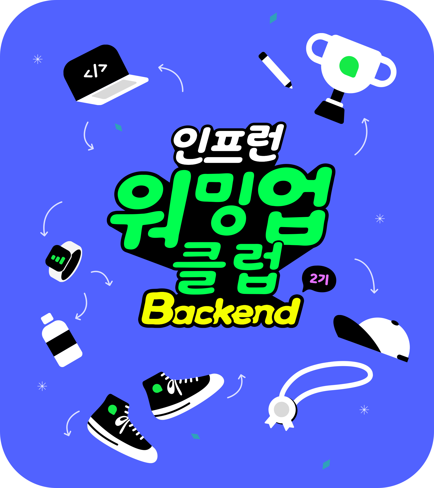

> 이 블로그 글은 [박우빈님의 인프런 강의](https://inf.run/kHiWM)를 참조하여 작성한 글입니다.

드디어 0기때 이후 첫 발자국을 작성해보는 시간이다. 처음 마음 먹었던 초심을 생각하며 0기때보다 더 나은 활동을 해보자고 다짐하며 이 글을 써내려간다.

## 강의 소개

처음 이 강의를 듣기 전, 나는 아래와 같이 생각했다.

> 🤔 읽기 좋은 코드가 과연 무엇일까? 읽기 좋은 코드는 왜 필요할까?

해당 물음을 가지고 강의를 듣기 시작하였다.

우리는 코드를 작성(쓰기)보단 읽는데 시간을 더 많이 투자한다. 기존 코드에 내 코드를 추가하기 위해 내가 과거에 작성한 코드 혹은 다른 동료분들이 작성한 코드를 읽는다고 해보자. 하지만 이해가 안된다면 다시금 읽게 될 것이다. 그리고 많은 시간 끝에 이해라는 경지에 도달하거나 절망이라는 경지에 도달할 것이다.


결국 코드를 작성한다는 것은 모두가 이해하기 쉬운 읽기 기반의 코드를 작성한다는 의미이다. 그리고 코드를 잘 짠다라고 말하는 것은 결국 읽기가 좋다는 의미이고 읽기 좋은 코드는 결국 미래를 위해 유지보수를 위해 필요한 작업이라고 생각이 든다.

또한 우린 가끔 이런 말을 하곤 한다. 나도 몇번 들었던 말이다.

> 코드는 작성하고 난 순간부터 레거시다.

여기서 레거시란, 오래되고 유지보수가 힘든 코드라고 생각하면 된다. 즉, 우리가 작성한 코드들은 먼 훗날의 레거시 코드가 되고 이 레거시 코드들을 유지보수 할 미래의 나 혹은 동료들을 위해 읽기 쉬운 코드를 작성함이 좋을듯 싶어진다. 나 또한 이번에 **제대로 학습**하여 실무에도 적용해볼 수 있는 기회가 되었으면 한다.

> ✅ 읽기 쉬운 코드 작성하는 현재까지 생각
>
> - 미래를 위해 그래야함
> - 유지보수 하기 좋음
> - 미래의 나와 동료를 위해 읽기 쉬운 **클린코드**를 작성해야함.

## 강의 구성

클린코드, 리팩토링 과정의 최고의 연습은 테스트코드를 작성하는 것이다.

테스트 코드를 작성문화를 가진 기업들은 일반적으로 아래의 절차를 가진다.

> 🛠 리팩토링 프로세스 (주관적인 생각)
>
> 1. 리팩토링 대상/범위 확인
> 2. 기능보장을 위한 테스트 코드 작성
> 3. 리팩토링
> 4. 테스트 코드 검증

위의 프로세스로 리팩토링을 진행하지만 우빈님께서는 현재 테스트코드 없이 진행한다고 하셨다. 또한 롬복도 사용을 하지 않으신다고 하며, 순수코드에 집중한다고 하셨다.

나 또한 이번에 우빈님 말씀대로 순수코드에 집중해보며, 시간과 여유가 있을 시, 내가 스스로 테스트 코드도 작성해봄이 좋을 것 같다!

## 강의에 사용할 용어들

> 📚 용어정리
>
> - 도메인(domain): 실무에 자주 사용되는 말들로, 해결하고자하는 문제영역들을 말한다.(비즈니스 요구사항 함축)
> - 도메인 지식: 도메인을 이해하고 해결하는데 필요한 지식
> - 레거시, 유산: 우리가 현자 가지고 있는 코드 \*
> - 조상: 과거의 나 / 동료 / 이 코드를 작성했던 개발자분들
> - 후손: 미래의 나 / 동료 / 내가 만든 코드들을 보게 될 많은 개발자분들

## 우리가 클린코드를 추구하는 이유

우리는 왜 클린코드라는 것을 지켜야 하는걸까? 결론부터 말하면 **가독성**때문이다. 가독성이 좋다라는 것은 이해가 잘된다는 것을 말하며 그것은 곧 유지보수가 수월해지며 그 만큼 우리의 시간과 자원을 절약한다.

세상에는 클린코드라 지칭하는 수많은 원칙들과 조언들이 존재한다. 하지만 이런 원칙들을 관통하는 아주 중요한 주제가 있는데 그게 바로 **추상**이다. 이번부터 추상을 한번 알아보자.

## 프로그램의 정의

그러면 추상이라는 것을 구체적으로 들어가기 전에 프로그램이 무엇인지 알아보자. 내가 생각하는 프로그램은 아래와 같다.

> 프로그램 = 설치하는 것

쉽게 생각해서 프로그램은 설치하는것이라 알고 있었다. 거기서 프로그램의 구조는 데이터 + 코드로 이루어진다 생각한다. 그래서 앞으로 이 2가지를 가지고 데이터의 추상과 코드의 논리를 가지고 학습해볼 예정이다.

## 추상과 구체

이제 본격적으로 추상을 들어가보자. **추상**하면 같이 따라 다니는 단어가 있는데 그것이 바로 **구체**이다. 이 두 단어는 매우 중요한 단어이다. 추상이라는 단어가 무엇일까? 우빈님께서 한자와 위키백과, 피카소의 명언을 참조하셔서 말씀을 해주셨듯이 추상은 아래와 같다.

> 📚 추상
>
> - 구체적인 정보에서 어떤 이미지를 뽑아내는 것이다
> - 중요한 정보는 가려내어 남기고 덜 중요한 정보는 생략하여 버린다.
> - **_추상은 항상 구체적인 실제에서 시작해야한다.(feat. 피카소)_**

즉, 위에 이야기를 토대로 나온 것이 추상화 레벨이다. 즉, 추상화라 하는 것은 내가 생각했을 때 추상적인 것이 몇 %이고 구체적인것이 몇 %이냐라는 것이다. 쉽게 비유하면 이런것이다. 친구와 이야기를 나눌때 진지함 30%이고 농담 70% 주제야!라고 한다. (개인적인 이야기)

아무튼 추상화는 중요한것 같다. 하지만 막상 너무 어렵게 느껴진다. 하지만 오히려 인간은 추상화 능력이 매우 뛰어난 존재이다. 예시를 보자.

친구와 아래와 같이 이야기를 했다 해보자.

> 🗒️ 예시
> Q. 주말에 뭐했어?
> A. 나는 하나의 큰 공간에서 나의 신경을 이용해 나의 걷는 수단으로 하나의 큰 구체를 차는 행위를 했어!

이렇게 했을 때 친구의 반응은 아래와 같을 수 있다.


하지만 우리는 유추를 어느정도 해볼 수 있다.

> 🗒️ 예시
> Q. 주말에 뭐했어?
> A. 축구했어!

첫번째 예시는 구체이고 바로 위의 예시가 추상화 과정이다.

> 추상화: 정보 함축, 제거
> 구체화: 유추, 정보재현 이해

이것은 컴퓨터 과학에서도 사용된다.

> 🙋🏻 컴퓨터는 0과 1밖에 모르는데 어떻게 **고수준**의 작업을 할까?

먼저 정답을 이야기하면 바로 추상화과정때문이다. 그럼 자세히 들어가보자. 1bit가 무엇일까? 0과 1을 의미한다. 이것은 정보의 최소단위이고 이것은 결국 전구의 켜짐과 꺼짐을 나타내는데 이것을 존재성이라 한다. 1byte는 무엇일까? 용량의 최소단위이며 8bit를 묶어서 1byte라 한다. 또한 프로그래밍 언어에서 자료형을 이야기할때 몇byte를 묶어서 하나의 자료형을 나타낸다. 여기서 데이터(bit) 덩어리를 짤라서 묶고 어떻게 읽을것인가이다. 즉, 이것이 추상화이다.

또한 AND나 OR같은 논리 연산식도 데이터와 데이터가 만나 새로운 데이터를 만드는 방법을 의미한다.

즉, 종합해보면 이전에 프로그램을 데이터와 코드로 나타냈는데 위의 예시를 통해 각각 추상화가 가능하다는 것을 알 수 있다.

그러면 처음 질문으로 돌아가서 고수준 작업은 무엇일까? 고수준이라는 것은 추상화 레벨이 높다는 것이고 그와 반대로 저수준은 추상화 레벨이 낮다는 것이다. 대표적인 예시로 프로그래밍 언어와 기계어, 하드웨어와 운영체제와 어플리케이션, OSI7 Layer를 예로 보면 확 알 것이다.

그런데 우리는 읽기 좋은 코드를 이야기 하고 있는데 왜 추상화 과정이 필요할까? 적절한 추상화는 복잡한 데이터와 복잡한 로직을 단순화하여 이해하기 쉽도록 돕는다. 즉, 읽기 쉽다! 예시를 통해 보자.

성빈나라에 축구라는 것을 뻥뻥이라고 해보자. 그리고 친구한테 뻥뻥이했다라고 말하면 친구는 못알아 들을 것이다.

이렇게 못알아 듣는 이유 즉, 추상으로부터 구체를 유추하지 못한 이유는 추상화 과정에서 중요정보를 부각시키지 못했고 상대적으로 덜 중요한 정보를 제거했기 때문이다. 또한 해석자가 동일하게 공유하는 문맥이 아니기 때문이다. 이 말은 중요한 정보는 기준이 각각 다르고 즉, 도메인 별로 추상화 기준이 다르다는것을 알 수 있다. 그래서 다른 실무진들이 도메인 지식이 중요하다는 것도 이와 같기 때문이라 생각이 든다.

잘못된 추상화는 side-effect를 유발하며 이는 매우 critical하다. 적절한 추상화는 해당 도메인의 문맥 안에서 정말 중요한 핵심개념만 남겨서 표현한다. 적절한 추상화의 대표적인 행위가 바로 **이름짓기**인데 한번 이름짓기에 대해 살펴보자.

## 이름 짓기

개발자들이 업무를 하면서 무엇이 가장 힘드냐고 물어보면 10의 9은 "이름짓기"가 힘들다고 말한다. 나 또한 실무에서 변수명같은것을 짓는데만 30분을 소비한 경험이 있곤 하다.

그런데 진짜로 이름 잘 짓는게 중요할까? 나는 중요하다고 본다. 중요하지 않은 일을 이렇게 시간투자하면서 많은 개발자들이 힘들게 시간을 투자하고 있지 않을 것이다.

이름 짓는다는 행위는 **추상적인 사고**를 기반으로 한다.추상적인 사고는 첫째, 표현하고자 하는 구체에서 정말 중요한 핵심개념만을 추출하여 잘 드러내는 표현이며, 우리 도메인의 문맥안에서 이해되는 용어이다. 그럼 이름 짓는 주의 점들을 살펴보겠다.

### 단수, 복수 구분

끝에 -(e)를 붙여서 어떤 데이터(변수, 클래스)가 단수인지 복수인지 나타내는 것만으로도 읽는이에게 중요한 정보를 전달 할 수 있다.

### 이름 줄이지 않기

줄임말이라는 것은 가독성을 제물로 바쳐 효율성을 얻는 것으로 대부분 잃는 것에 비해 얻는 것이 적다. 즉, 자재하는 것이 좋으나 관용어처럼 많이 사람들이 사용하는 줄임말이 존재한다.

> column → col, latitude → lat, longitude → lon, count -> cnt

위의 예시에서 count를 줄이는 것은 우빈님은 비추하신다고 하셨다. 왜냐하면 겨우 5글자에서 3자로 줄이고 cnt만 봤을때 count라고 연상이 안된다고 하셨는데 그 이야기를 들어보니 나도 뭔가 와 닿지 않았다. 이전까지 실무에서도 귀찮을때 이렇게 줄이곤 했는데 조금 반성하게 되는 계기가 된 것 같았다.

또한 자주 사용하는 줄임말이 이해할 수 있는 것은 사실 문맥을 보고 알 수 있다. 예를 들어 익명 클래스에 저런 관용어가 있다고 해보자. 처음 보는 신입 개발자는 알 수 없을 것이다.

### 은어, 방언 사용 X

농담에서 파생된 용어, 일부 팀원, 현재 우리팀만 아는 은어 금지해야한다. 만약 다른 개발자가 해당 코드를 보면 이해하기 힘들기 때문이다. 또한 되도록 도메인 용어를 사용하자! 우리도 실무에서 도메인 용어 사전을 엑셀로 만들어서 사용하곤 한다. 이러닝 도메인을 가진 우리의 예로 보면 스코라는 단위를 표현할때 sco라는 표현 혹은 sc를 많이 사용한다. 물론 이렇게 정의되었더라도 하나로 정하면 그 프로젝트에서는 그것으로 밀고 사용해야한다.

### 좋은 코드 보고 습득하기

비슷한 상황에서 자주 사용하는 용어, 개념을 습득하자. github에 open되어 있는 라이브러리나 프레임워크의 코드를 보면서 용어들을 정리해 볼 필요가 있다고 느껴졌다.

> ex. pool, candidate, threshold등 (일상 용어 != 코드용어)

그럼 이제 코드를 통해 우빈님이 제공해준 코드를 고쳐보자.

자세한 것은 강의를 통해 확인해보고 간략히만 설명해보겠다.

아래와 같이 의미가 없는 변수들을 변경해보았다. 대표적으로 for문의 i와 j의 변수를 아래와 같이 변경해보았다.

```java
for (int row = 0; row < 8; row++) {
  for (int col = 0; col < 10; col++) {
    board[row][col] = "□";
  }
}
```

이런식으로 나머지도 수정을 해보았다. 추가적으로 나는 주석도 달아보았다. 주석이 없으니 우빈님과 코드를 읽으면서 뭔가 난해한 부분도 많기 때문에 주요 로직에 주석을 다는것도 Readable code이지 않을까?

## 메서드와 추상화

잘 쓰여진 코드의 메서드는 반드시 1개의 주제를 가져야 한다. 메서드의 선언부로 우리는 구체적인 내용을 추상화 할 수 있다. 만약 그렇게 하기 힘들다면 그 메서드는 2가지 이상의 일을 하고 있다고 볼 수 있다. 역할분리가 힘든 메서드라고 나는 생각한다.

그래서 메서드를 작성할때 생략할 정보와 의미를 부여하고 드러낼 정보를 구분하는것이 중요하다. 즉, **추상화**가 중요하다. 만약 아까처럼 메서드 내용을 보고 이름을 유추하기 힘들다면 그 메서드 안에 의미를 담을 수 있는 더 작은 단위로 쪼개고 그 쪼갠것을 보고 하나의 유추할 수 있는 포괄적 의미의 메서드 이름을 적어보는 것이 좋을 것 같다.

## 메서드 선언부

메서드 선언부는 아래와 같이 구성되어 있다.

```java
반환타입 메서드명(파라미터) {}
```

> ✅ 용어정리
>
> 메서드 명과 파라미터를 통틀어서 메서드 시그니처라는 용어를 사용한다.
> 메서드 시그니처를 통해서 자바에서 오버로딩이 가능하다.

메서드는 추상화된 구체를 유추할 수 있는 적절한 의미가 담긴 이름이어야 한다. 또한 메서드의 파라미터라는 정보를 통하여 더 풍부한 의미를 전달할 수 있다. 보통 메서드 명을 동사로 시작하는 경우가 있지만 **반드시 일 필요는 없다.** 단순 데이터 반환 같은 경우는 명사로 하여도 무방하다.

> 파라미터와 같이 사용할때 메서드 명은 보통 전치사로 끝나는게 좋다고 하셨다.

```java
int selectedColIndex = convertColFrom(cellInputCol);
int selectedRowIndex = convertRowFrom(cellInputRow);
```

위와 같이 표기하면 확실히 읽을때 명확해짐을 볼 수 있었다.

파라미터의 타입, 개수, 순서를 통하여 의미전달이 또한 가능하다. 아래의 코드를 살펴보자.

```java
public void createLecture(String title, String localDateToString) {}

public void createLecture(String lectureTitle, LocalDate openDate) {}
```

위의 두 메서드중에 2번째것이 명확하다는 것을 알 수 있을것이다. 첫번째 메서드는 메서드를 사용할때 두번째 파라미터에 무엇을 넣어야 하는지 불분명하기 때문이다.

여기서 파라미터는 외부와 소통하는 창이라고 볼 수 있다. 사용하는 입장에서 어떤 정보가 필요한지 알려주는 기능을 한다.

또한 메서드 시그니처에 납득이 가는 적절한 타입의 반환값을 돌려줘야 한다. 만약 납득이 안 간다면 문제가 있는 메서드일 확률이 높다. 또한 `void` 대신 충분히 반환할만한 가치가 있는 값이 있는지 고민을 해보는게 좋을 것이다.

그리고 추가적으로 메서드를 리팩토링 과정을 거쳐 추상화함에 있어서 너무 긴 코드들을 메서드로 묶는다는 생각보단, 추상화가 필요한 부분을 리팩토링한다고 생각하는것이 좋다. 단 1줄이더라도 추상화할만한 가치가 있다면 하는것이 좋다.

그래서 강의를 통해 예제 프로젝트를 기능단위로 묶어서 메서드로 분리함으로 조금 더 깔끔한 코드로 리팩토링 실습을 해보았다.

## 추상화 레벨

우리는 이전까지 엄청 긴 코드들(구체)에서 추상화 과정을 거쳐서 메서드를 추출해보았다. 이렇게 메서드를 추출하는 그 순간 읽는 자 기준으로 외부세계와 내부세계의 경계가 생긴다. 당연하게 생각해보면 쭉 코드를 읽다가 갑자기 메서드를 보면 살짝 멈칫할 것이다. 여기서 외부세계란 추상화 레벨이 높은 세계이고 내부세계란 추상화 레벨이 낮은 구체라고 생각하면 좋을 것이다. 그래서 내부세계에서는 구체적인 내용이 들어가 있고 외부세계에서는 메서드의 필요한 파라미터를 내부세계로 넘겨서 메서드명과 반환타입을 전달하게 될 것이다.

또한 **하나의 세계 안 에서 추상화 레벨은 동등해야 한다.** 만약 그렇지 못한다면 레벨을 맞추게 추상화 과정을 거쳐야 한다.

그래서 실습을 통하여 같은 추상화 레벨이 되도록 메서드들을 분리해보았는데 나는 여기서 몇몇 이해가 안되는 부분이 있었다. 이 부분은 질문을 해봐야 겠다.

## 매직 넘버, 매직 스트링

매직 넘버, 매직 스트링을 알기 전에 상수부터 알아보자. 상수로 추출한다는 것은 하나의 이름을 부여한다는 것이고 즉, 추상화 한다는 것이다.

매직 넘버와 매직 스트링은 의미를 갖고 있으나 상수로 추출되지 않은 숫자나 문자열을 의미하며 이름을 부여함으로 읽기 좋은 코드에 다가간다.

실습을 통해 매직 넘버와 매직 스트링을 상수로 추출해보았다.

## 미션1

### 예시 1

- 추상: 동호회 사람들과 모여서 축구를 한다.
- 구체
  - 같은 좋아하는 것을 목표로 모인 연합의 사람들과 모인다.
  - 경기를 하기 위해 랜덤으로 팀을 나눈다.
  - 서로 다른 지점에 하나의 구체를 넣기 위해 사람의 신경계와 근육을 이용하여 승부를 한다.

### 예시 2

- 추상: 크롬 웹 브라우저에 www.google.com을 입력하여 구글 홈페이지를 접속한다.
- 구체:
  - 사용자가 크롬에 www.google.com을 입력하면, 브라우저는 먼저 DNS 캐시, hosts 파일 등을 확인한 후, 도메인의 IP 주소를 찾기 위해 DNS 서버에 요청을 보낸다.
  - IP 주소를 얻으면, 브라우저는 TCP 3-way 핸드셰이크로 서버와 연결을 설정하고, HTTPS의 경우 TLS 핸드셰이크를 통해 보안 통신을 설정한다.
  - 이후 HTTP 요청을 서버로 전송하고, 서버는 HTML 데이터를 응답하여 브라우저가 이를 렌더링해 화면에 표시
  - 로컬 네트워크에서는 ARP를 사용해 IP 주소를 MAC 주소로 변환하여 데이터가 전송

### 예시 3

- 추상: 어느 웹 사이트에 로그인을 진행한다.
- 구체
  - 로그인 정보 입력:
    사용자가 웹사이트의 로그인 페이지에 사용자 이름과 비밀번호를 입력하고 "로그인" 버튼을 누릅니다.
  - HTTPS 요청 전송:
    브라우저는 이 로그인 정보를 HTTPS 프로토콜을 사용해 암호화하여 서버로 전송합니다. HTTPS는 TLS를 통해 데이터를 보호하여 중간에서 탈취되지 않도록 보장합니다.
  - 서버에서 인증 처리:
    서버는 받은 로그인 정보를 데이터베이스의 사용자 정보와 비교합니다. 입력된 비밀번호는 보통 해시(Hash) 값으로 변환되어 비교되며, 만약 일치한다면 인증이 성공합니다.
  - 세션 또는 토큰 생성:
    인증이 성공하면 서버는 사용자에게 세션 ID나 JWT(JSON Web Token)와 같은 토큰을 발급합니다. 이 세션이나 토큰은 사용자가 인증된 상태임을 나타내며, 클라이언트에 저장됩니다(세션 쿠키 또는 로컬 스토리지).
  - 인증 상태 유지:
    이후 사용자가 웹사이트의 다른 페이지를 요청할 때, 브라우저는 이 세션 ID나 토큰을 함께 전송하여 사용자가 인증된 상태로 남아 있을 수 있도록 합니다.

## 뇌 메모리 적게 쓰기

정리하는 시스템에서 중요한 과제는 최소한의 인지적 노력으로 최대의 정보를 제공해야 한다고 뇌 과학에서 이야기를 한다. 지금 내가 생각해보면 그렇다. 인간의 뇌가 컴퓨터 메모리라고 하였을때 우리의 뇌는 싱글 스레드 기반으로 처리할 것이다. 그리고 다른 사물을 보았을때 다른것을 생각할때 **컨텍스트 스위칭**이라는 작업을 거쳐야 한다.

우리의 뇌는 다른 것을 생각할때 **범주화**라는 작업을 거쳐야 한다. 범주화란 특정 대상의 특징들을 분류하는 작업을 말한다. 즉, 범주화를 통해 우리의 뇌는 최소한의 기억 데이터로 최대 효과를 볼 수 있다.

우리의 뇌는 싱글 스레드 기반으로 돌아간다고 하였고 만약 멀티태스킹을 진행할 경우 수행능력이 떨어지며 속도가 저하된다. 그래서 우리의 뇌는 최소의 인지로 최대의 효율을 볼 수 있다. 이것은 코드도 같다.

결국 이것을 기반으로 우리의 뇌에 적은 메모리가 올라가야 읽기 쉬운 코드가 된다. 후손들이 코드를 읽을때 독자의 메모리를 어떻게 효과적으로 쓸지 고민을 해야 좋은 코드가 된다 생각한다.

## Early return

`if else if else`구조는 우리의 뇌 메모리를 생각해야 한다. 왜냐하면 `else if`문을 생각하면 앞의 조건식을 한번 더 생각해야하기 때문이고 `else`문도 마찬가지다. 그럼 해결책은 무엇이 있을까? 이 조건식들을 하나의 메서드로 추출하고 `else if`문과 `else`문을 지우고 if문들을 만들어 거기서 바로 return을 하는 것이다. 이것은 if문뿐만 아니라 switch문에도 같이 적용된다.

즉 결론은 아래와 같다.

> Early return으로 else의 사용을 지양

그래서 해당부분을 예제 코드에서 리팩토링 하는 과정을 거쳐봤다.

## 사고의 depth 줄이기

사고의 depth 줄이기가 나오면 아래의 2가지를 들 수 있다.

> 1. 중첩 분기문, 중첩 반복문
> 2. 사용할 변수는 가깝게 선언하기

그럼 하나하나 살펴보자.

### 중첩 분기문, 중첩 반복문

왜 사고의 depth를 줄여야 하나? 이유는 이전에 설명했듯이 간단하다.

```java
for (int i = 1; i <= 9; i++) {
  for (int j = 1; j <= 9; j++) {
    if (i >= 2 && j < 8) {
      doSomething();
    }
  }
}
```

위의 코드를 실행한다고 생각해보자. 그러면 첫번째 반복문이 뇌에 입력이 될 것이다. 그리고 두번째 반복문을 만나면 그것도 뇌에 입력이 될 것이다. 그 다음 조건식을 보면 이것또한 뇌에 입력이 되어 같이 생각을 하면 메모리를 많이 쓰게 된다. 그러면 어떻게 추출할까? 아래와 같이 추출할 수 있을듯 하다.

```java
for (int i = 1; i <= 9; i++) {
  doSomethingI();
}

private void doSomethingI() {
  for (int j = 1; j <= 9; j++) {
    doSimethingIJ();
  }
}

private void doSimethingIJ() {
  if (i >= 2 && j < 8) {
      doSomething();
    }
}
```

위와 같이 메서드로 추출하면 외부의 벽이 생긴다. 그렇게 뇌의 메모리를 분리시켜서 생각하게 할 수 있다. 각각의 메서드는 다른 메서드들이나 조건들을 생각을 안해도 된다.

그렇다고 무조건 1 depth로 만들자고 하는 것은 아니다. 보이는 depth를 줄이는데 급급한것이 아니라 추상화를 통한 사고과정의 depth를 줄이는 것이 중요하다. 2중 중첩구조로 표현하는 것이 사고하는데 도움이 된다면 메서드 분리보다는 그대로 두는 것이 좋다. 때로는 메서드 분리하는 것이 더 혼선을 주기 때문이다.

우리의 실습에서는 메서드 분리보단 Array-Stream을 사용하여 해결을 하였다. 그 이유는 row와 col을 사용하는 이중 반복문이 있는데 이를 각각 메서드로 분리하는게 이상하기 때문이다. 그 이유는 row-col은 하나의 세트처럼 작동하기에 분리가 조금 애매했다.

> ⚠️ 주의
>
> 그렇다고 무조건 Stream을 쓰라는 말도 아니다.

### 사용할 변수는 가깝게 선언하기

당연한 애기다. 애를 들어 변수를 선언하고 100줄정도 있다가 그 변수를 사용한다면 선언한 이 변수가 뭐였는지 다시 찾아보는 비효율적인 행동을 해야한다.

우리는 예제코드의 Scanner를 가깝게 위치시켰고 그러다보니 무한반복문에 위치하게 되어 이것을 상수로 바꿔보고 리팩토링 하는 과정을 보았다.

## 공백 라인을 대하는 자세

공백라인도 의미를 가진다. 복잡한 로직의 의미단위를 나누어 보여줌으로 읽는 사람에게 추가적인 정보전달이 가능하다.

해당 부분을 실습을 통해 의미단위로 끊어보았다.

## 부정어를 대하는 자세

부정연산자는 생각을 2번하게 만든다. 해당 조건을 먼저 이해해야하고 해당 조건이 아닌 상황을 한번 더 생각해야하기 때문이다. 즉, 가독성이 떨어진다. 그래서 해결방안은 아래와 같다.

> 1. 부정어구를 쓰지 않아도 되는 상황인지 체크
> 2. 부정의 의미를 담은 다른 단어가 존재하는 지 고민 or 부정어구 메서드 구성

해당 부분을 토대로 예시코드를 리팩토링 해보았다.

## 해피 케이스와 예외 처리

일반적인 사람들은 해피 케이스에 대해 몰두하는 경향이 존재한다. 하지만 예외를 항상 생각하고 사용자 입력을 불신한 상태에서 예외처리를 꼼꼼이 하는 것이 견고한 소프트웨어를 개발하는 자세일 것이다. 그럼 어떻게 예외처리를 할 수 있을까?

먼저 예외처리 전에 예외 발생 가능성을 낮추는 방법이 있다. 어떤 값의 검증이 필요한 부분은 주로 외부세계와 접점일테니 반드시 검증을 꼼꼼이 구체적으로 해야한다.(ex. 사용자 입력, 객체 생성자, 외부서버의 요청) 또한 의도한 예외와 의도치 못한 예외를 구분해야한다. 의도한 예외는 커스텀 Exception 클래스로 정의하여 두고 그외의 의도치 못한 예외는 Exception클래스로 두는등의 행위를 하고 spring boot같은 웹 어플리케이션에서 `ExceptionHandler`를 만들어서 처리를 하는등의 행위를 거쳐야 한다.

또한 `null`을 주의해야한다. 코틀린같은 언어는 언어단에서 처리를해주지만 자바같은 경우는 `NullPointerException`을 주의해야한다. 그래서 항상 `NullPointerException`을 방지하는 방향으로 경각심을 가져야 한다.

또한 메서드 설계시 `return null`을 자제해야한다. 만약 불가피 하다면 `Optional` 클래스를 이용해보자.

### Optional

`Optional`은 비싼 객체이다. 꼭 필요한 상황에서 반환타입으로만 사용하자.

> ⚠️ 주의
>
> 만약 파라미터같은 경우에 사용하는 경우는 피해야한다. 아마 이 부분은 IDE에서 경고표시를 해줄 것이다. 왜 피해야하냐면 분기 케이스가 3개 생기기 때문이다. (Optional이 가진 데이터가 null인지 Optional 그 자체가 null인지 생각때문) 마지막으로 Optional을 반환받았다면 최대한 빠르게 해소해야 한다.

### Optional 해소

분기문을 만드는 `isPresent()-get()`대신 풍부한 API를 사용하자. (ex. `orElseGet()`, `orElseThrow` 등등)

> ⚠️ 주의
>
> orElse와 orElseGet에 사용에 주의하자! orElse같은 경우 항상 실행을 한다. 이게 무슨말이냐면 호출할 필요가 없는 경우에도 항상 실행된다. 그래서 파라미터로 확정된 값이 있을 경우 사용하자. 반면 orElseGet은 null일때만 실행을 한다.

그레서 우리 예제 코드에서 Scanner의 입력을 올바르지 않게 했을때의 부분들을 리팩토링하며, 해당 예외를 커스텀 예외와 의도치 않은 예외를 구분하여 처리하였다. 여기서 나는 조금 더 세밀한 예외정의를 하는게 좋지 않을까라는 생각을 해본다.

## 추상의 관점으로 바라보는 객체 지향

프로그래밍 패러다임에는 아래와 같이 크게 3가지로 나뉜다.

> 1. 절차지향: 지금까지 예제코드 작성했듯이 컴퓨터 처리구조처럼 차례대로 실행하는 흐름을 가지는것
> 2. 객체지향: 객체간 협력을 통한 프로그래밍
> 3. 함수형: 순수함수 조합으로 프로그래밍

> 🙋🏻 순수함수란?
>
> 외부의 요인 없이 같은 input을 넣었을때 같은 output이 나오는것을 의미한다. 즉, 가변데이터는 멀리하고 side effect없이 프로그래밍하는 것을 의미한다.

그럼 우리는 자바로 프로그래밍을 하므로 객체지향에 대해 알아보자. 여기서 객체란 어떤 목적으로 설계된 추상화된 무엇을 의미한다. 즉, 쉽게 말해 데이터와 코드의 조합으로 보면 된다.

> 객체지향을 하면서 각각의 많은 객체들을 생성하다보니 객체간 협력과 객체가 담당하는 책임이 높아졌다.

'캡추상다'라는 용어를 들어봤나? 나는 처음이다. 하지만 뭔가 대강은 알것 같았다. 캡추상다는 아래와 같다.

> 1. 캡슐화: 객체 데이터를 숨기고 가공로직을 숨기고 일부만 들어내는것. 즉, 추상화개념이다.
> 2. 추상화
> 3. 상속: 상속은 강력한 기능이지만 너무 남발하면 안된다.
> 4. 다형성: 일종의 추상화이다. 상위 추상화 레벨에서 요구되는 그런 특징들만 뽑아서 인터페이스화해서 사용하는 것을 말한다. 이렇게 하면 구현체 여러개에 바껴서 사용이 가능하다.

객체지향에서만 쓰이는 애기는 아니지만 객체지향을 공부하다보면 관심사 분리 개념이 나온다. 관심사 분리란 특정 관심사에 따라 객체 생성 및 기능과 책임을 나눈다. 이렇게 하는 이유는 나중에 유지보수성이 좋아지기 때문이다.

또한 관심사 분리는 일련의 개념을 모아 이름을 짓고 기능을 부여하는데 일종의 추상화라 확인이 가능할 것이다.(높은 응집도와 낮은 결합도)

## 객체 설계하기

우리는 메서드 추출과정에서 외부세계와 내부세계가 나눠짐으로 추상화시킨다고 이야기 한 적이 있다. 객체도 마찬가지다. 적절한 관심사들을 분리하여 객체로 만들고 공개 메서드를 통해 외부세계와 소통함으로 객체의 책임을 들어낼 수 있다. 이런 객체들이 모여 객체간 협력을 할 수 있다.

### 객체 추상화

- 비공개 필드(데이터), 비공개 로직(코드)
- 공개 메서드 선언부를 통해 외부세계와 소통
  - 각 메서드의 기능은 객체의 책임을 드러내는 창구
- 객체의 책임이 나뉨에 따라 객체간 협력이 발생

### 객체가 제공하는 것

- 절차지향에서 잘 보이지 않았던 개념을 가시화
- 관심사가 한군데로 꼽히기 때문에 유지보수성 증가
- 여러 객체를 사용하는 입장에서는 구체적인 구현에 신경쓰지 않고 보다 높은 추상화 레벨에서 도메인 로직 다룸

아래는 회원의 나이의 유효성 검사를 나타내는 예이다. 이런 식으로 관심사를 집중 시킬 수 있지 않을까?

### ⚠️ 새로운 객체를 만들 때 주의점

- 1개의 관심사로 명확하게 책임이 정의되었는지 확인한다.
  - 메서드를 추상화할때와 유사
  - 객체를 만듬으로써 외부세계와 어떤 소통을 하려고 하는지 생각
  - 변경된 요구사항 및 리팩토링 과정에서 객체의 책임과 역할이 변경될 수 있다.
  - 생성자, 정적 팩토리 메서드에서 유효성 검증이 가능하다.
    - 도메인에 특화된 검증로직이 들어갈 수 있다.

```java
class Member {
  private int age;

  public Member(final int age) {
    if (this.age < 0) {
      throw new IllegalArgumentException("회원의 나이는 0살 미만일 수 없습니다.");
    }

    this.age = age;
  }
}
```

### setter 사용자제

- 데이터는 불변이 가장 좋다. 변하는 데이터라도 객체가 핸들링 할 수 있다.
- 객체 내부에서 외부세계의 개입없이 자체적인 변경이 가능한지 확인해보고 가공으로 처리할 수 있을지를 확인해보자.
- 만약 외부에서 가지고 있는 데이터로 데이터 변경 요청을 해야하는 경우 `set~`이라는 단순한 이름보다 `update~`같이 의도를 들어내자.

### getter 사용자제

- getter라도 처음에는 사용을 자제하자. 반드시 필요한 경우에만 추가하자.
- 외부에서 객체 내 데이터가 필요하다고 getter를 남발하는것은 객체에 대한 실례되는 행동이다.
- 객체에 메세지를 보내는 방법을 선택해보자.

```java
Member member = new Member();

member.getPassword() // 비유하자면 어떤 사람이 강제로 비밀번호를 뺏는 형식이라 볼 수 있다.
```

### 필드의 수는 적을수록 좋다.

- 불필요한 데이터가 많을수록 복잡도가 높아지고 대응할 변화가 많아진다.
- 필드A를 가지고 계산할 수 있는 A필드가 있다면 메서드 기능으로 제공
- 단, 미리 가공하는 것이 성능상 이점이 있다면 필드로 가지고 있는 것이 좋을 수 있다.

그러면 이제 실습의 대략적인 요약을 해보자.

우리는 예제 코드로 `Cell`이라는 객체로 관심사를 분리 시켰다. 그에따라 변경되는 static 변수들을 변경하고 로직도 변경을 했다. 하지만 여기서 우리는 새로운 도메인 지식을 획득했다. 이제까지 셀이 열렸다/닫혔다라는 개념을 통해 로직을 작성해왔다면 지금은 Cell이라는 객체로 관심사를 분리함으로 사용자가 체크했다라는 개념이 나온것이다.

기존 String기반의 Sign기반의 BOARD가 있고 이를 상황에 따라 표시 할 sign을 갈아끼우는 형태에서 이제 Cell을 정보를 담을 공간의 객체가 생성되었다. BOARD는 Cell을 갈아끼우는 것이 아니라 사용자의 입력에 따라 Cell의 상태를 변화시키는 방향으로 진행하고 리팩토링을 거쳤다.

## SOLID

- SRP: Single Responsibility Principle
- OCP: Open-Closed Principle
- LSP: Liskov Substitution Principle
- ISP: Interface Segregation Principle
- DIP: Dependency Inversion Principle

### SRP: Single Responsibility Principle

- 하나의 클래스는 단 1가지의 변경 이유(책임)만을 가져야만 한다.
- 객체가 가진 공개 메서드, 필드, 상수등은 해당 객체의 단일 책임에 의해서만 변경되어야 한다.
- 관심사 분리
- 높은 응집도, 낮은 결합도(서로다른 두 객체간 의존성 최소화로 결합도를 낮춰야 한다.)

> 🔥 중요
>
> '책임'을 볼 줄 아는 눈이 필요하다.

그래서 우리는 이를 토대로 예제 프로젝트를 리팩토링해보았다.

처음에는 우리의 main메서드에 실행하는 부분을 별도의 `GameApplication`으로 분리하여 실행로직과 게임 로직을 분리하였다. 다음으로 입출력 부분을 각각 별도의 Handler클래스로 분리하여 리팩토링을 진행해보았다. 마지막으로 상수로 되어있는 BOARD를 객체로 분리하여 마지막 리팩토링을 분리해왔다.

이렇게 실습하면서 이제까지 나는 객체지향적으로 작성하지 못했다는 것을 깨달았다. 즉, 단일책임의 원칙을 지키지 못한것이다. 단일책임원칙은 약간 비유적으로 표현하면 이런것 같다.

축구로 비유하면, 축구에서 11명의 선수들은 각자 포지션이라는 책임을 가지고 있다. 각 선수는 자기 포지션에 맞는 역할만 해야 한다는 것과 같아. 예를 들어, 수비수는 수비에만 집중하고, 공격수는 공격에만 집중해야 팀이 효율적으로 움직일 수 있을것이다. 만약 수비수가 공격도 하고 골키퍼 역할까지 하려고 한다면 팀이 혼란에 빠질것이다. 즉, 한 선수에게 여러 역할을 맡기면 혼란이 생기고 효율성이 떨어지기 때문에, 선수마다 책임을 명확하게 분리하는 것이 중요하다.

### OCP: Open-Closed Principle

- 확장에는 열려있고 수정에는 닫혀있어야 한다.
  - 기존 코드의 변경없이 시스템의 기능을 확장할 수 있어야한다.
- 추상화와 다형성을 활용해서 OCP를 지킬 수 있다.

우리는 위를 토대로 예제코드를 리팩토링하였다. 예제코드에 게임 난이도라는 추가 요구사항이 나왔다. 하지만 이것을 유동적으로 변경 전에 알파벳 제한과 숫자가 2자리가 되면 오류가 발생함을 알 수 있었다. 그래서 이것을 해결하고 인덱스 치환 로직을 SRP원칙에 따라 별도 객체로 분리하고 리팩토링 작업을 하였다.

이제 추가요구사항인 난이도를 넣을때 우리는 인터페이스를 이용해 메서드 선언부를 선언해주고 구현체들을 각각 만들어 해결을 하였다.

축구로 비유하면, 축구 팀의 감독이 선수들에게 전술을 지시할 때, 기존 선수들의 역할을 크게 바꾸지 않고도 새로운 전략을 추가하는 상황과 비슷하다.

예를 들어, 새로운 선수가 팀에 합류하거나 새로운 전술을 추가하려고 할 때 기존에 있던 선수들의 역할을 건드리지 않고, 그 새로운 선수나 전술만 추가하는 식이다. 만약 기존의 모든 선수 배치를 다 바꿔야 한다면 팀이 혼란에 빠지지 않을까? 대신 기존의 포지션을 그대로 두고, 새로운 포지션을 하나 더 추가해 전술을 보완하는 것이 OCP에 비유로 들 수 있을 것 같다.

다른 비유로는 레고 블록으로 비유할 수 있다. 레고 집을 만들 때, 기존에 완성된 부분을 해체하지 않고도 새로운 부품을 추가해 더 멋진 집을 만들 수 있는 것이 OCP에 해당한다.

### LSP: Liskov Substitution Principle

- 상속구조에서 부모클래스의 인스턴스를 자식클래스의 인스턴스로 치환이 가능해야 한다.
  - 자식클래스는 부모클래스의 책임을 준수하며 부모클래스의 행동을 변경하지 않아야 한다.
- LSP를 위반하면 상속클래스를 사용할때 오동작이 발생한다. 예상 밖의 예시가 발생하거나 이를 방지하기 위한 불필요한 타입체크가 동반된다.

보통 부모클래스보다 자식클래스가 하는 기능들이 더 많은게 일반적이다. 그래서 조심해야한다. 부모가 일하는 곳에 자식이 갔다가 올바른 방향으로 동작하지 않거나 예상치 못한 예외를 발생시키거나 이를 방지하기 위해 자식의 타입을 체크하는 분기가 발생한다. 이런 분기는 뇌 메모리에 더 올라가기에 불필요한 분기가 생기니 코드가 읽기 불편해진다.

그래서 우리는 예제코드에서 Cell이라는 것을 부모클래스(추상클래스)로 두고 각각 빈 셀, 숫자 셀, 지뢰 셀 클래스를 만들어 리팩토링 하는 과정을 해보았다.

축구로 비유하면, 팀의 주전 선수가 교체 선수로 대체될 때에도 팀의 전술이 동일하게 잘 유지되어야 한다는 것과 같다. 예를 들어, 만약 주전 공격수가 부상당해서 교체 선수가 들어온다고 해도, 그 교체 선수가 주전 선수의 역할을 잘 수행할 수 있어야 팀의 전술에 문제가 생기지 않을것이다. 교체 선수가 갑자기 공격을 포기하고 수비만 하려 한다면, 팀의 전술이 흐트러질 것이다. 즉, 교체 선수는 주전 선수와 같은 역할을 할 수 있어야 한다는 것이 LSP의 핵심이다. 즉, 축구처럼 자식 클래스가 부모 클래스를 언제든지 대체할 수 있도록 만드는 것이 LSP다.

### ISP: Interface Segregation Principle

- 클라이언트는 자신이 사용하지 않는 인터페이스에 의존하지 않아야한다.
  - 예를 들어 하나의 인터페이스에 선언부가 여러개 있고 여러 구현체들이 이 인터페이스를 구현할때 일부 구현체가 모든 선언부가 필요없는 경우 어떻게 할까?
  - 인터페이스를 쪼개면 된다.
- ISP를 위반하면 불필요한 의존성으로 인해 결합도가 높아지고 특정기능의 변경이 여러 클래스에 영향을 미칠 수 있다.

그래서 우리는 실습예제에서 동작부분과 초기화 부분을 인터페이스로 구현했는데 만약 다른 게임이 초기화 부분이 필요없다 가정하고 실습을 했다. 그럴 경우 간단히 이 인터페이스를 분리시켰다.

축구로 비유하자면, 모든 선수가 똑같은 훈련을 받기보다는, 각 포지션에 맞는 훈련만 받는 것이 더 효율적이다는 것과 비슷하다. 예를 들어, 공격수는 골을 넣는 훈련을 집중적으로 해야 하고, 골키퍼는 공을 막는 훈련에 집중해야하지 않을까? 공격수가 골키퍼 훈련까지 받게 된다면 불필요한 훈련으로 시간만 낭비하게 된다. 각 선수는 자신의 역할에 맞는 훈련만 받아야 하는 것이다.

### DIP: Dependency Inversion Principle

- 상위 수준의 모듈(추상)은 하위 수준의 모둘(구체)에 의존해서는 안된다. 모두 추상화에 의존해야 한다.
- 의존성 순방향: 고수준 모듈이 저수준 모듈을 참조하는 것
- 의존성 역방향: 고수준, 저수준 모듈이 모두 추상화에 의존

> 저수준 모듈이 변경되어도 고수준 모듈에는 영향을 끼치면 안된다.

> 의존성: 하나의 모듈이 다른 하나의 모듈을 알고 있거나 직접적으로 생성하는 것을 말한다.

우리의 예제코드에서 이제 위의 개념으로 실습을 하면 아래와 같다. 우리는 `ConsoleInputHandler`과 `ConsoleInputHandler`을 직접 객체를 생성해서 하고 있었다. 하지만 콘솔이라는 것은 너무 구체화되어 있다. 만약 갑자기 웹기반으로 변경되면 많은 부분을 변경해야할 것이다. 그것을 방지하기 위해 두 클래스를 인터페이스로 변경하고 구현을 하는 방식으로 하면 해결이 된다.

축구로 비유하자면, 감독이 특정 선수 개인의 능력에 의존하지 않고, 그 선수의 포지션에 맞는 역할에 의존해야 한다는 것과 비슷하다. 예를 들어, 감독이 특정 공격수에만 의존해서 전략을 짠다면, 그 선수가 부상당하거나 경기에 나가지 못할 경우 큰 문제가 생길것이다. 대신, 공격수라는 포지션에 맞는 역할을 정의하고, 누구든 그 역할을 수행할 수 있도록 전략을 짠다면, 주전 선수가 빠지더라도 팀의 전략은 계속 유지될 수 있을것이다. 만약 감독이 호날두나 메시에 의존해서 전술을 짜다가 그 선수가 없을 시, 팀은 사면초가에 빠질 것이다.

> 🧐 꿀팁
>
> DIP를 애기하면 Spring의 DI와 IoC를 헷갈려 하는 것 같다. 나도 처음에는 그랬다. 둘을 비교해보자.
>
> 1. DI: 의존성 주입이며 일반적으로 생성자를 통해 주입한다. 여기서 생각나는 숫자는 3인데 두 객체가 서로 의존성을 맺을려면 제 3자가 역할을 해주는데 바로 IoC Container인 Spring Context이다.
>
> 2. IoC: 제어의 역전이라 하며 이것은 Spring에서만 통하는 개념은 아니다. 제어의 역전이란 프로그램의 흐름을 순방향은 개발자가 가져가야하지만 이것을 역전시켜서 프레임워크가 담당하고 나의 코드를 프레임워크 일부로 동작시킨다. 이러면 우리는 직접 생성 및 생명주기 관리를 프레임워크에 위임시킬 수 있으며 우리는 그냥 사용하기만 하면 된다.

## 미션2

미션2를 하면서 조금은 논리적 사고 및 객체지향적으로 어떻게 해야하고 읽기 좋은 코드를 만들기 위해 어떻게 할지 또한 SOLID에 대한 정리를 해보았다. 상세 내용은 아래 내가 작성한 포스트를 확인하자!

[미션2 블로그](https://sungbin.kr/%EC%9D%B8%ED%94%84%EB%9F%B0-%EC%9B%8C%EB%B0%8D%EC%97%85-%EC%8A%A4%ED%84%B0%EB%94%94-%ED%81%B4%EB%9F%BD-2%EA%B8%B0-%EB%B0%B1%EC%97%94%EB%93%9C(%ED%81%B4%EB%A6%B0%EC%BD%94%EB%93%9C-%ED%85%8C%EC%8A%A4%ED%8A%B8%EC%BD%94%EB%93%9C)-Day4-%EB%AF%B8%EC%85%98/)

SOLID관련해서만 잠깐 정리를 해보았다.
### 정리

정리를 해보면 아래와 같다.

> 1. SRP (Single Responsibility Principle) - 단일 책임 원칙
>    각 클래스는 하나의 책임만 가져야 한다는 원칙이야. 클래스가 여러 책임을 가지면, 하나의 기능을 변경할 때 다른 기능에도 영향을 줄 수 있다. 축구로 비유하자면, 공격수는 공격만, 골키퍼는 수비만 담당하는 것처럼, 각 클래스는 명확한 역할을 가져야 한다.
> 2. OCP (Open-Closed Principle) - 개방-폐쇄 원칙
>    클래스는 확장에 열려 있고, 수정에는 닫혀 있어야 한다는 원칙이다. 즉, 새로운 기능을 추가할 때 기존 코드를 변경하지 않고 확장할 수 있어야 한다는 뜻이다. 축구로 비유하면, 새로운 전술을 추가할 때 기존 선수 배치에 큰 변화를 주지 않고도 쉽게 새로운 선수를 추가하는 것과 같다.
> 3. LSP (Liskov Substitution Principle) - 리스코프 치환 원칙
>    하위 클래스는 상위 클래스의 자리를 대체할 수 있어야 한다는 원칙이다. 축구로 설명하자면, 교체 선수가 주전 선수의 역할을 대신할 수 있어야 팀의 전술이 무너지지 않듯이, 자식 클래스는 부모 클래스의 기능을 해치지 않고 그대로 사용할 수 있어야 한다.
> 4. ISP (Interface Segregation Principle) - 인터페이스 분리 원칙
>    클라이언트는 자신이 사용하지 않는 메서드에 의존하지 않아야 한다는 원칙이다. 축구에서는 공격수와 수비수가 똑같은 훈련을 받지 않고, 각자의 포지션에 맞는 훈련을 받는 것처럼, 인터페이스도 필요한 기능만 나눠서 설계해야 한다.
> 5. DIP (Dependency Inversion Principle) - 의존 역전 원칙
>    상위 모듈은 하위 모듈에 의존하지 않고, 둘 다 추상화된 인터페이스에 의존해야 한다는 원칙이다. 축구로 비유하면, 특정 선수에게 의존하지 않고 포지션 자체에 의존하는 것처럼, 상위와 하위 모듈은 서로 구체적인 것이 아닌 추상적인 규약에 의존해야 한다.

이 다섯 가지 원칙을 잘 따르면, 시스템의 유지보수성, 확장성, 유연성이 훨씬 좋아진다. 마치 축구 팀이 각 선수의 역할을 잘 분배하고 새로운 전술을 도입할 때 기존 시스템에 혼란이 없도록 만드는 것처럼 말이다.

## 상속과 조합

상속과 조합은 무엇일까? 상속은 지난시간에 배워서 알겠지만 부모 클래스를 자식클래스가 상속받아 부모의 기능을 그대로 이용하는 것이다. 조합은 상속과 항상 같이 따라 다니는데 객체간 협력을 이용할때 조합을 이용한다. 이렇게 볼때 알 수 있듯이 상속보단 조합이 객체지향적으로 더 좋다는 것을 알 수 있아보인다.

- 상속보단 조합을 이용하자.
- 상속은 시멘트처럼 굳어진 구조다. 그래서 수정이 어렵다.
  - 부모와 자식의 결합도가 높다.
- 조합과 인터페이스를 활용하는 것이 유연한 구조다.
  - 상속을 통한 코드의 중복제거가 주는 이점보다 중복이 생기더라도 유연한 구조 설계가 주는 이점이 더 크다.

옛날에는 하드웨어 성능이 안 좋아서 코드 중복 제거가 매우 큰 효과를 주었다. 하지만 오늘날은 하드웨어 성능이 굉장히 뛰어나다. 그래서 상속보단 조합을 이용해 유연한 설계를 하는 것이 좋다. 하지만 이렇다 해서 상속을 아예 사용하지 말자라는 말은 아니다. 확실한 상속구조거나 상속이 주는 효과가 매우 뛰어날것 같다고 느껴지면 상속을 이용하자. 그 외에는 조합으로 다 해결된다. 상속은 또한 부모 자식간의 결합도가 높아 캡슐화가 안 되어 있다고 한다. 이 점도 생각해보자.

그래서 우리는 기존 추상클래스로 되어있는 Cell을 인터페이스로 만들고 Cell의 상태 변경을 하는 필드들을 CellState에 두어 분리를 해보았다. 처음에 이 실습을 하면서 CellState는 그냥 enum으로 하면 안될까 고민을 하였고 추후에도 이렇게 변경이 없으면 한번 질문해봐야 겠다.

## Value Object

Value Object는 훌륭한 추상화 기법 중 하나다. 기본 타입을 객체로 감싸서 의미 부여 및 추상화를 하는 것이다.

- 도메인의 어떤 개념을 추상화하여 표현한 값 객체
- 값으로 취급하기 위해서 불변성, 동등성, 유효성 검증등을 보장
    - 불변성: final 필드, setter금지
    - 동등성: 서로 다른 인스턴스여도(동일성이 달라도) 내부의 값이 같으면 같은 값 객체로 취급, ```equals()``` & ```hashCode()``` 재정의가 필요하다.
    - 유효성 검증: 객체가 생성되는 시점에 값에 대한 유효성 보장

그래서 우빈님께서는 만원 지폐의 일련번호로 이에 대한 예시를 들어주셨다. 일련번호가 달라도 하나의 만원으로 보는것과 같다고 하셨다.

> 🙋🏻 동등성 vs 동일성
>
> 동등성은 객체간 메모리 주소가 달라도 내부의 값이 같다면 같은 객체로 취급을 하자는 것이며 동일성은 메모리 주소 값이 같냐는 의미이다. 동일성 비교는 ```==``` 연산자로 비교하며 동등성 비교는 재정의한 ```equals()```로 해결한다.

### VO vs Entity

- Entity는 식별자가 존재한다. 식별자가 아닌 필드의 값이 달라도 식별자가 같으면 종등한 객체로 취급
    - equals() & hashCode()로 식별자 필드만 가지고 재정의 할 수 있다.
    - 식별자가 같은데 식별자가 아닌 필드의 값이 서로 다른 두 인스턴스가 있다면 같은 Entity가 시간이 지남에 따라 변화한것으로 이해할 수 있다.
- VO는 식별자 없이 내부의 모든 값이 다 같아야 동등한 객체로 취급한다. 개념적으로 전체 필드가 다 같이 식별자 역할을 한다고 생각하자.

그래서 우리의 예제 프로젝트를 리팩토링해보았다. rowIndex와 colIndex는 하나의 세트로 움직이니 이것을 CellPosition이라는 VO를 만들어 리팩토링을 진행하였고 이에 대해 세부적인 로직들을 개선해보았다. 예를 들어 재귀로직을 RelativePostion으로 두어서 stream API를 이용하여 해결을 하였다.

이처럼 코드가 점점 개선되니 뭔가 조금은 많은 부분이 느껴졌다. 실무에서도 한번 신규 프로젝트를 진행할때 도입해볼만한 생각이 듣게 되었다. 하지만 아직까지 능수능란하게 해결을 할지는 고민이 되는 것 같다.

## 일급 컬렉션

일급 컬렉션이란 무엇일까? 일단 컬렉션은 List, Map, Set같은 것들이다. 그럼 일급은 무엇일까? 해당 용어에 파생된것이 일급시민이다.

### 일급 시민
- 다른 요소에게 사용가능한 모든 연산을 지원하는 요소
    - 변수로 할당될 수 있다.
    - 파라미터로 전달 될 수 있다.
    - 함수의 결과로 반환될 수 있다.

### 일급함수
- 함수형 프로그래밍 언어에서 함수는 일급시민이다.
    - 함수형 프로그래밍 언어에서 함수는 일급시민이다.
    - 함수는 변수에 할당될 수 있고 인자로 전달될 수 있고 함수결과로 함수가 반환될 수 있다.

### 일급 컬렉션
- 컬렉션을 포장하면서 컬렉션만을 유일하게 필드로 가지는 객체
    - 컬렉션을 다른 객체와 동등한 레벨로 다루기 위함
    - 단 하나의 컬렉션 필드만 가진다.
- 컬렉션을 추상화하며 의미를 담을 수 있고 가공로직의 보금자리가 생긴다.
    - 가공로직에 대한 테스트도 작성할 수 있다.
- 만약 getter로 컬렉션을 반환할 일이 생긴다면 외부조작을 피하기 위해 꼭 새로운 컬렉션으로 만들어서 반환.

이것을 이용해 우리는 체크했는지 유무 메서드의 ```Cell[][]``` stream API를 이용한 부분을 Cells라는 일급 컬렉션을 만들어 변경을 해보았으며 또한 우리는 빈 셀, 숫자 셀, 지뢰 셀을 보드에 넣어주는 것을 CellPositions라는 일급컬렉션을 통해 리팩토링 및 버그 수정도 해보았다. 아직 일급컬렉션을 처음 공부해봐서 많아 와 닿지는 않지만 이 부분을 한번 다른 곳에도 적용해봄으로 익숙해져야겠다.

## Enum의 특성과 활용

- Enum은 상수집합이며 상수와 관련된 로직을 담을 수 있는 공간이다.
    - 상태와 행위를 한 곳에서 관리할 수 있는 추상화된 객체이다.
- 특정 도메인 개념에 대해 그 종류와 기능을 명시적으로 표현해줄 수 있다.
- 만약 변경이 정말 잦은 개념은 Enum보다 DB로 관리하는 것이 좋다.

그래서 우리는 기존에 SIGN들을 OutputConsoleHandler쪽에 이관하면서 enum을 활용해 리팩토링 과정을 거쳐보았다.

## 다형성 활용하기

이번에는 예제에 있는 반복된 if문을 다형성을 통해 해결해보았다. 해당 if문들에서 변화하는것(조건, 행위 -> 구체)과 변화하지 않은 것(틀 -> 추상)을 나누기로 하였고 그를 위해 인터페이스를 만들어 처리를 하였고 해당 인터페이스를 만들어 스펙들을 정리하였다. 그리고 스펙들을 하나의 클래스에 두어 해당 객체의 메서드만 호출해서 해결하게 하였다.

하지만 해당 문제는 클래스가 많아지면 즉, 스펙이 더 많아 질경우 소스코드를 빈번히 해결해야하는 문제가 있었고 그래서 enum을 통해 해결했다. enum에 인터페이스를 구현시키고 각기 다른 행위 자체를 enum안에 상수에 별도로 구현하는 법을 알았다. 조금 신박했고 유용한 방법인것 같았다. 뭔가 실무에도 한번 써볼법한 방법이였다.

이를 통해 변하는 것과 변화하지 않은 것을 분리하여 추상화하고 OCP를 지키는 구조로 만들었다.

## 숨겨져 있는 도메인 개념 도출하기

- 도메인 지식은 만드는 것이 아니라 발견하는 것이다.
- 객체지향은 현실을 100% 반영하는 도구가 아니라 흉내내는 것이다.
    - 현실세계에서 쉽게 인지하지 못하는 개념도 도출해서 사용할 때가 있다.
- 설계할때는 근시적, 거시적 관점에서 최대한 미래를 예측하고 시간이 지나 만약 틀렸다는 것을 인지하면 언제든 돌아올 수 있도록 코드를 만들어야 한다.
    - 완벽한 설계는 없다. 그 당시의 그들의 최선이 있을뿐

해당부분을 가지고 우리의 예시코드를 리팩토링해봤다. 만약 다양한 설정기능들이 추가가 될 경우 변경할 곳이 많아졌다. 그래서 우리는 config관련 클래스를 만들고 설정부분들을 변경해주는 것을 해보았다.

해당 강의를 듣고 나는 조금 반성했다. 이전에 조상님들이 작성한 레거시 코드를 보고 많은 비판을 했기 때문이다. 그 당시에는 그게 최선일텐데 또한 설계관련해서 한번 생각 나는 영상이 인프콘에 재민님께서 발표한 영상인데 지금 다시 한번 봐보고 공부해봐야 겠다.

> 📚 추가 참조
>
> https://johnlock.tistory.com/405
>
> https://maily.so/trendaword/posts/52a9a219
