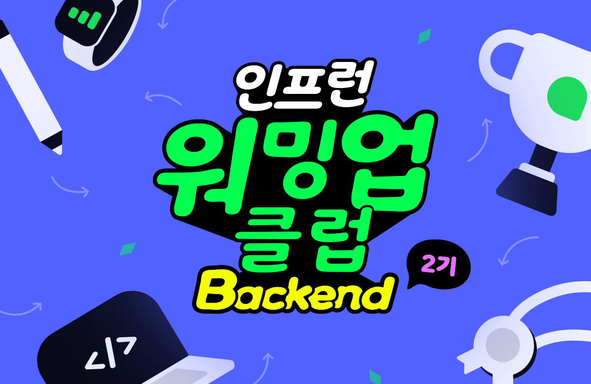
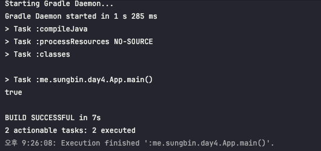
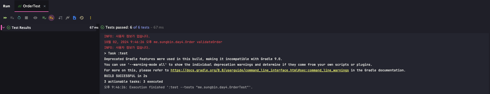

> 이 블로그 글은 [박우빈님의 인프런 강의](https://inf.run/kHiWM)를 참조하여 작성한 글입니다.

# 미션2

## 1. 아래 코드와 설명을 보고, [섹션 3. 논리, 사고의 흐름]에서 이야기하는 내용을 중심으로 읽기 좋은 코드로 리팩토링해 봅시다.

우리는 아래와 같은 조상님이 작성하신 코드를 개선하기 위한 업무를 맡았다고 가정해보자. 코드는 아래와 같다고 해보자.

```java
public boolean validateOrder(Order order) {
    if (order.getItems().size() == 0) {
        log.info("주문 항목이 없습니다.");
        return false;
    } else {
        if (order.getTotalPrice() > 0) {
            if (!order.hasCustomerInfo()) {
                log.info("사용자 정보가 없습니다.");
                return false;
            } else {
                return true;
            }
        } else if (!(order.getTotalPrice() > 0)) {
            log.info("올바르지 않은 총 가격입니다.");
            return false;
        }
    }
    return true;
}
```

현재 해당 부분의 메서드를 보면 사용자가 생성한 '주문'이 유효한지를 검증하는 메서드이다. 그리고 메서드의 선언부를 보면 boolean타입을 반환하며 파라미터 정보로 Order라는 객체가 담겨져 있다. 그리고 아래의 코드 내용을 보고 Order의 코드를 한번 유추해보았다.

```java
package me.sungbin.day4;

import java.util.List;

public class Order {

    private final List<String> items;
    private final long totalPrice;
    private final String customerInfo;

    public Order(List<String> items, long totalPrice, String customerInfo) {
        this.items = items;
        this.totalPrice = totalPrice;
        this.customerInfo = (customerInfo != null) ? customerInfo : "";
    }

    public List<String> getItems() {
        return this.items;
    }

    public long getTotalPrice() {
        return this.totalPrice;
    }

    public boolean hasCustomerInfo() {
        return !this.customerInfo.isEmpty();
    }
}
```

그리고 해당 유효성 검사 로직도 OrderService 클래스 안에 있다고 가정하자.

```java
package me.sungbin.day4;

import java.util.logging.Logger;

public class OrderService {

    private final Logger log = Logger.getLogger(this.getClass().getName());

    public boolean validateOrder(Order order) {
        if (order.getItems().size() == 0) {
            log.info("주문 항목이 없습니다.");
            return false;
        } else {
            if (order.getTotalPrice() > 0) {
                if (!order.hasCustomerInfo()) {
                    log.info("사용자 정보가 없습니다.");
                    return false;
                } else {
                    return true;
                }
            } else if (!(order.getTotalPrice() > 0)) {
                log.info("올바르지 않은 총 가격입니다.");
                return false;
            }
        }
        return true;
    }
}

```

그럼 이제 하나하나씩 바꿔보자. 일단 우리가 배운것을 바탕으로 하면 해당 메서드를 Early-Return구조로 변경이 가능할 것이다. 그러면 코드는 아래와 같을 것이다.

```java
package me.sungbin.day4;

import java.util.logging.Logger;

public class OrderService {

    private final Logger log = Logger.getLogger(this.getClass().getName());

    public boolean validateOrder(Order order) {
        if (order.getItems().size() == 0) {
            log.info("주문 항목이 없습니다.");
            return false;
        }

        if (order.getTotalPrice() > 0) {
            if (!order.hasCustomerInfo()) {
                log.info("사용자 정보가 없습니다.");
                return false;
            }

            return true;
        }

        if (!(order.getTotalPrice() > 0)) {
            log.info("올바르지 않은 총 가격입니다.");
            return false;
        }

        return true;
    }
}
```

그러면 이제 각 if문의 조건식에 부정어 연산을 뺌으로 뇌 메모리 구조를 단순화 시켜보자!

```java
package me.sungbin.day4;

import java.util.logging.Logger;

public class OrderService {

    private final Logger log = Logger.getLogger(this.getClass().getName());

    public boolean validateOrder(Order order) {
        if (order.getItems().size() == 0) {
            log.info("주문 항목이 없습니다.");
            return false;
        }

        if (order.getTotalPrice() > 0) {
            if (order.hasCustomerInfo()) {
                return true;
            }

            log.info("사용자 정보가 없습니다.");
            return false;
        }

        if (order.getTotalPrice() > 0) {
            return true;
        }

        log.info("올바르지 않은 총 가격입니다.");
        return false;
    }
}
```

하지만 지금 이렇게 변경하니 중복된 if문이 존재함을 알 수 있었다. 그러면 해당 if문 중복을 제거할 수 있다.

```java
package me.sungbin.day4;

import java.util.logging.Logger;

public class OrderService {

    private final Logger log = Logger.getLogger(this.getClass().getName());

    public boolean validateOrder(Order order) {
        if (order.getItems().size() == 0) {
            log.info("주문 항목이 없습니다.");
            return false;
        }

        if (order.getTotalPrice() > 0) {
            if (order.hasCustomerInfo()) {
                return true;
            }

            log.info("사용자 정보가 없습니다.");
            return false;
        }

        log.info("올바르지 않은 총 가격입니다.");
        return false;
    }
}
```

조금 더 코드가 간결해졌음을 알 수 있다. 그러면 일부 조건식을 변경해보자. 지금 `order.getITems().size() == 0` 대신 `isEmpty()`로 변경이 가능하다. 변경하면 아래와 같다.

```java
package me.sungbin.day4;

import java.util.logging.Logger;

public class OrderService {

    private final Logger log = Logger.getLogger(this.getClass().getName());

    public boolean validateOrder(Order order) {
        if (order.getItems().isEmpty()) {
            log.info("주문 항목이 없습니다.");
            return false;
        }

        if (order.getTotalPrice() > 0) {
            if (order.hasCustomerInfo()) {
                return true;
            }

            log.info("사용자 정보가 없습니다.");
            return false;
        }

        log.info("올바르지 않은 총 가격입니다.");
        return false;
    }
}
```

다음으로 구체의 부분을 추상화시켜보자. 현재 각 조건식을이 너무 구체이다. 또한 현재 조건들은 getter를 남발하는 폭력적인 메서드이다. 그래서 해당 각 조건식을 Order 객체 안의 공개 메서드로 둘 예정이다. 변경하면 아래와 같다.

```java
package me.sungbin.day4;

import java.util.List;

public class Order {

    private final List<String> items;
    private final long totalPrice;
    private final String customerInfo;

    public Order(List<String> items, long totalPrice, String customerInfo) {
        this.items = items;
        this.totalPrice = totalPrice;
        this.customerInfo = (customerInfo != null) ? customerInfo : "";
    }

    public boolean hasCustomerInfo() {
        return !this.customerInfo.isEmpty();
    }

    public boolean hasNotItems() {
        return this.items.isEmpty();
    }

    public boolean isValidPrice() {
        return this.totalPrice > 0;
    }
}
```

```java
package me.sungbin.day4;

import java.util.logging.Logger;

public class OrderService {

    private final Logger log = Logger.getLogger(this.getClass().getName());

    public boolean validateOrder(Order order) {
        if (order.hasNotItems()) {
            log.info("주문 항목이 없습니다.");
            return false;
        }

        if (order.isValidPrice()) {
            if (order.hasCustomerInfo()) {
                return true;
            }

            log.info("사용자 정보가 없습니다.");
            return false;
        }

        log.info("올바르지 않은 총 가격입니다.");
        return false;
    }
}
```

Order 객체도 깔끔해지고 정말 읽기 좋은 코드가 된듯 보인다. 이제 중첩 if문을 변경해보자. 중첩 if문의 2번째 if문을 메서드로 변경할까해보았지만 논리상 2번째 if문을 별도로 뺄 수 있겠다는 생각이 들었다. 그렇게 변경을 해보았다.

```java
package me.sungbin.day4;

import java.util.logging.Logger;

public class OrderService {

    private final Logger log = Logger.getLogger(this.getClass().getName());

    public boolean validateOrder(Order order) {
        if (order.hasNotItems()) {
            log.info("주문 항목이 없습니다.");
            return false;
        }

        if (!order.isValidPrice()) {
            log.info("올바르지 않은 총 가격입니다.");
            return false;
        }

        if (!order.hasCustomerInfo()) {
            log.info("사용자 정보가 없습니다.");
            return false;
        }

        return true;
    }
}
```

좀더 명확히 분리가 되었지만 부정연산자가 생겨버렸다. 따라서 해당 부정연산자를 없애는 리팩토링을 해보았다. 부정연산자를 쓰는 대신, Order클래스의 공개 메서드를 변경해보았다.

```java
package me.sungbin.day4;

import java.util.List;

public class Order {

    private final List<String> items;
    private final long totalPrice;
    private final String customerInfo;

    public Order(List<String> items, long totalPrice, String customerInfo) {
        this.items = items;
        this.totalPrice = totalPrice;
        this.customerInfo = (customerInfo != null) ? customerInfo : "";
    }

    public boolean hasNotCustomerInfo() {
        return this.customerInfo.isEmpty();
    }

    public boolean hasNotItems() {
        return this.items.isEmpty();
    }

    public boolean isInvalidPrice() {
        return this.totalPrice <= 0;
    }
}
```

```java
package me.sungbin.day4;

import java.util.logging.Logger;

public class OrderService {

    private final Logger log = Logger.getLogger(this.getClass().getName());

    public boolean validateOrder(Order order) {
        if (order.hasNotItems()) {
            log.info("주문 항목이 없습니다.");
            return false;
        }

        if (order.isInvalidPrice()) {
            log.info("올바르지 않은 총 가격입니다.");
            return false;
        }

        if (order.hasNoCustomerInfo()) {
            log.info("사용자 정보가 없습니다.");
            return false;
        }

        return true;
    }
}
```

이제 예외처리를 적용해볼 수 있을것이다. 현재 log로 메세지들을 출력하고 return문을 하는데 그 대신에 예외를 던져 볼 수 있을것이다. 그러면 커스텀 Exception을 만들어 예외를 던져보자. 아래와 같이 할 수 있다.

```java
package me.sungbin.day4;

public class OrderException extends RuntimeException {
    public OrderException(String message) {
        super(message);
    }
}
```

```java
package me.sungbin.day4;

import java.util.logging.Logger;

public class OrderService {

    private final Logger log = Logger.getLogger(this.getClass().getName());

    public boolean validateOrder(Order order) {
        if (order.hasNotItems()) {
            throw new OrderException("주문 항목이 없습니다.");
        }

        if (order.isInvalidPrice()) {
            throw new OrderException("올바르지 않은 총 가격입니다.");
        }

        if (order.hasNoCustomerInfo()) {
            throw new OrderException("사용자 정보가 없습니다.");
        }

        return true;
    }
}
```

이렇게 깔끔히 RuntimeException을 처리하였다. 하지만 여기서 만약 CheckedException이 발생한다고 하면 어떨까? 즉, 개발자가 예상하지 못한 예외가 나올 수 있기 때문에 try-catch구조로 묶어본다. 또한 return하는 boolean형을 변수로 빼서 조금 더 명확하게 해보았다.

```java
package me.sungbin.day4;

import java.util.logging.Logger;

public class OrderService {

    private final Logger log = Logger.getLogger(this.getClass().getName());

    public boolean validateOrder(Order order) {
        boolean isValid = true;

        try {
            if (order.hasNotItems()) {
                throw new OrderException("주문 항목이 없습니다.");
            }

            if (order.isInvalidPrice()) {
                throw new OrderException("올바르지 않은 총 가격입니다.");
            }

            if (order.hasNoCustomerInfo()) {
                throw new OrderException("사용자 정보가 없습니다.");
            }
        } catch (OrderException e) {
            log.info(e.getMessage());
            isValid = false;
        } catch (Exception e) {
            log.info("프로그램에 문제가 생겼습니다.");
            isValid = false;
        }

        return isValid;
    }
}
```

하지만 여기서 끝을 두지 않고 totalPrice라는것도 따로 변수를 두지 않고 해결할 수 있지 않을까라는 고민을 하였다. 그래서 Item 클래스를 만들어서 해결을 할 수 있음을 짐작했다. 또한 item이 null인경우 또한 고려를 하지 않았기에 해결을 해보았다.

```java
package me.sungbin.day4;

public class Item {

    private final String name;
    private final int price;

    public Item(String name, int price) {
        this.name = name;
        this.price = price;
    }

    public int getPrice() {
        return this.price;
    }
}
```

```java
package me.sungbin.day4;

import java.util.Collections;
import java.util.List;

public class Order {

    private final List<Item> items;
    private final String customerInfo;

    public Order(List<Item> items, String customerInfo) {
        this.items = (items != null) ? items : Collections.emptyList();
        this.customerInfo = (customerInfo != null) ? customerInfo : "";
    }

    public int calculateTotalPrice() {
        return this.items.stream().mapToInt(Item::getPrice).sum();
    }

    public boolean hasNoCustomerInfo() {
        return this.customerInfo.isEmpty();
    }

    public boolean hasNotItems() {
        return this.items.isEmpty();
    }

    public boolean isInvalidPrice() {
        return calculateTotalPrice() <= 0;
    }
}
```

이렇게 리팩토링을 하고 보니 문득 이런 생각이 든다. 유효성 검사는 Order 객체 생성자에서 처리할 수 있지 않을까? 그래서 OrderService 클래스의 validateOrder 메서드를 Order안으로 옮겨보자! 그러면 validateOrder의 파라미터 Order는 삭제할 수 있으며 기존 Order에 있었던 공개 메서드를 private 메서드로 변경할 수 있다. 그리고 log라는 final 변수를 Order안으로 데려 올 수 있다. 그리고 OrderService를 삭제할 수 있다. 이렇게 함으로 꼭 필요한 유효성 검사 로직 메서드만 외부세계와 소통창구 역할을 하게 할 수 있고 그 외는 캡슐화를 하여 좀 더 객체지향적일 수 있다.

```java
package me.sungbin.day4;

import java.util.Collections;
import java.util.List;
import java.util.logging.Logger;

public class Order {

    private final List<Item> items;
    private final String customerInfo;

    private final Logger log = Logger.getLogger(this.getClass().getName());

    public Order(List<Item> items, String customerInfo) {
        this.items = (items != null) ? items : Collections.emptyList();
        this.customerInfo = (customerInfo != null) ? customerInfo : "";
    }

    public boolean validateOrder() {
        boolean isValid = true;

        try {
            if (hasNotItems()) {
                throw new OrderException("주문 항목이 없습니다.");
            }

            if (isInvalidPrice()) {
                throw new OrderException("올바르지 않은 총 가격입니다.");
            }

            if (hasNotCustomerInfo()) {
                throw new OrderException("사용자 정보가 없습니다.");
            }
        } catch (OrderException e) {
            log.info(e.getMessage());
            isValid = false;
        } catch (Exception e) {
            log.info("프로그램에 문제가 생겼습니다.");
            isValid = false;
        }

        return isValid;
    }

    private int calculateTotalPrice() {
        return this.items.stream().mapToInt(Item::getPrice).sum();
    }

    private boolean hasNotCustomerInfo() {
        return this.customerInfo.isEmpty();
    }

    private boolean hasNotItems() {
        return this.items.isEmpty();
    }

    private boolean isInvalidPrice() {
        return calculateTotalPrice() <= 0;
    }
}
```

이제 예제를 만들어 확인해보자.

```java
package me.sungbin.day4;

import java.util.Arrays;
import java.util.List;

public class App {
    public static void main(String[] args) {
        List<Item> items = Arrays.asList(new Item("햄버거", 10000), new Item("피자", 30000));
        Order order = new Order(items, "양성빈");

        System.out.println(order.validateOrder());
    }
}

```

위의 코드를 실행하면 아래와 같이 잘 작동된다.



그러면 마지막으로 해당 로직을 검증하는 테스트코드를 작성해보자. 테스트 코드는 공개 메서드인 유효성 검증 로직만 작성하였다.

```java
package me.sungbin.day4;

import org.junit.jupiter.api.DisplayName;
import org.junit.jupiter.api.Test;

import java.util.Arrays;
import java.util.Collections;
import java.util.List;

import static org.junit.jupiter.api.Assertions.*;

class OrderTest {

    @Test
    @DisplayName("주문 유효성 테스트 - 실패(주문 항목이 null)")
    void validate_order_fail_caused_by_items_is_null() {
        // given
        Order nullItemOrder = new Order(null, "양성빈");

        // when
        boolean result = nullItemOrder.validateOrder();

        // then
        assertFalse(result);
    }

    @Test
    @DisplayName("주문 유효성 테스트 - 실패(주문 항목이 없음)")
    void validate_order_fail_caused_by_no_items() {
        // given
        Order noItemOrder = new Order(Collections.emptyList(), "양성빈");

        // when
        boolean result = noItemOrder.validateOrder();

        // then
        assertFalse(result);
    }

    @Test
    @DisplayName("주문 유효성 테스트 - 실패(유효하지 않은 총 가격)")
    void validate_order_fail_caused_by_invalid_items_total_price() {
        // given
        Order invalidPriceOrder = new Order(List.of(new Item("item1", -100)), "양성빈");

        // when
        boolean result = invalidPriceOrder.validateOrder();

        // then
        assertFalse(result);
    }

    @Test
    @DisplayName("주문 유효성 테스트 - 실패(유효하지 않은 사용자 정보 - 빈 사용자 정보)")
    void validate_order_fail_caused_by_no_customer_info() {
        // given
        Order noCustomerInfoOrder = new Order(List.of(new Item("item1", 100)), "");

        // when
        boolean result = noCustomerInfoOrder.validateOrder();

        // then
        assertFalse(result);
    }

    @Test
    @DisplayName("주문 유효성 테스트 - 실패(유효하지 않은 사용자 정보 - 사용자 정보가 null)")
    void validate_order_fail_caused_by_null_customer_info() {
        // given
        Order noCustomerInfoOrder = new Order(List.of(new Item("item1", 100)), null);

        // when
        boolean result = noCustomerInfoOrder.validateOrder();

        // then
        assertFalse(result);
    }

    @Test
    @DisplayName("주문 유효성 테스트 - 성공")
    public void validate_order_success() {
        // given
        Order validOrder = new Order(Arrays.asList(new Item("item1", 100), new Item("item2", 200)), "양성빈");

        // when
        boolean result = validOrder.validateOrder();

        // then
        assertTrue(result);
    }
}
```

위의 코드를 수행하면 아래와 같이 테스트가 전부 통과됨으로 검증되는 로직임을 알 수 있다.



> ✅ 상세 코드는 아래의 git 주소에서 확인이 가능하다.
>
> https://github.com/SungbinYang/Inflearn-warming-up-club-2

## 2. SOLID에 대하여 자기만의 언어로 정리해 봅시다.

SOLID란 객체지행 설계에서 중요한 5가지 원칙을 말하며, 시스템을 더 유연하게 만들고 유지보수하기 쉽게 할 수 있다. 그리고 실제 생활에서 축구경기와 아주 유사하다. 그럼 한번 5가지 원칙을 축구와 비유하며 살펴보자.

### SRP(Single Responsibility Principle)

SRP는 하나의 클래스(혹은 모듈 혹은 시스템)는 오직 하나의 책임만 가져야 한다는 원칙이다.

축구로 비유하면, 축구에서 11명의 선수들은 각자 포지션이라는 책임을 가지고 있다. 각 선수는 자기 포지션에 맞는 역할만 해야 한다는 것과 같아. 예를 들어, 수비수는 수비에만 집중하고, 공격수는 공격에만 집중해야 팀이 효율적으로 움직일 수 있을것이다. 만약 수비수가 공격도 하고 골키퍼 역할까지 하려고 한다면 팀이 혼란에 빠질것이다. 즉, 한 선수에게 여러 역할을 맡기면 혼란이 생기고 효율성이 떨어지기 때문에, 선수마다 책임을 명확하게 분리하는 것이 중요하다.

코드에서도 한 클래스가 여러 가지 역할을 맡으면 그 클래스가 너무 복잡해지고, 나중에 그 코드를 수정하거나 유지보수할 때 문제가 발생할 수 있다. 예를 들어, 한 클래스가 데이터 저장, 검증, 화면 출력 등 여러 가지 기능을 담당한다면, 나중에 이 클래스의 일부만 수정하고 싶어도 다른 기능에 영향을 줄 수밖에 없다. 따라서 각 클래스는 하나의 명확한 역할만 가지고 있어야 SRP를 준수해야 한다.

### OCP(Open-Closed Principle)

OCP는 기존 코드는 건드리지 않으면서 새로운 기능을 추가할 수 있도록 시스템을 설계하라는 원칙이다.

축구로 비유하면, 축구 팀의 감독이 선수들에게 전술을 지시할 때, 기존 선수들의 역할을 크게 바꾸지 않고도 새로운 전략을 추가하는 상황과 비슷하다.

예를 들어, 새로운 선수가 팀에 합류하거나 새로운 전술을 추가하려고 할 때 기존에 있던 선수들의 역할을 건드리지 않고, 그 새로운 선수나 전술만 추가하는 식이다. 만약 기존의 모든 선수 배치를 다 바꿔야 한다면 팀이 혼란에 빠지지 않을까? 대신 기존의 포지션을 그대로 두고, 새로운 포지션을 하나 더 추가해 전술을 보완하는 것이 OCP에 비유로 들 수 있을 것 같다.

### LSP(Liskov Substitution Principle)

LSP는 서브클래스는 언제나 그 부모 클래스의 자리에 대체 가능해야 한다는 원칙이다. 축구로 비유하면, 팀의 주전 선수가 교체 선수로 대체될 때에도 팀의 전술이 동일하게 잘 유지되어야 한다는 것과 같다. 예를 들어, 만약 주전 공격수가 부상당해서 교체 선수가 들어온다고 해도, 그 교체 선수가 주전 선수의 역할을 잘 수행할 수 있어야 팀의 전술에 문제가 생기지 않아야 한다. 교체 선수가 갑자기 공격을 포기하고 수비만 하려 한다면, 팀의 전술이 흐트러질 것이다. 즉, 교체 선수는 주전 선수와 같은 역할을 할 수 있어야 한다는 것이 LSP의 핵심이다.

프로그래밍에서 보면, 자식 클래스는 부모 클래스의 기능을 그대로 사용할 수 있고, 심지어 확장할 수는 있지만 기존 부모 클래스의 기능을 깨뜨리면 안 된다. 부모 클래스가 제공하던 기능을 자식 클래스에서 제대로 구현하지 못하면, 그 자식 클래스를 부모 클래스 대신 사용할 수 없다.

축구처럼 자식 클래스가 부모 클래스를 언제든지 대체할 수 있도록 만드는 것이 LSP다.

### ISP(Interface Segregation Principle)

ISP는 클라이언트는 자신이 사용하지 않는 메서드에 의존하지 않도록 설계해야 한다는 원칙이다. 축구로 비유하자면, 모든 선수가 똑같은 훈련을 받기보다는, 각 포지션에 맞는 훈련만 받는 것이 더 효율적이다는 것과 비슷하다. 예를 들어, 공격수는 골을 넣는 훈련을 집중적으로 해야 하고, 골키퍼는 공을 막는 훈련에 집중해야하지 않을까? 공격수가 골키퍼 훈련까지 받게 된다면 불필요한 훈련으로 시간만 낭비하게 된다. 각 선수는 자신의 역할에 맞는 훈련만 받아야 하는 것이다.

프로그래밍에서 ISP는, 하나의 거대한 인터페이스를 여러 작은 인터페이스로 나눠서 필요한 기능만 구현하게 하자는 원칙이다. 만약 하나의 인터페이스에 너무 많은 기능이 담겨 있다면, 그 인터페이스를 구현하는 클래스는 불필요한 메서드까지 구현해야 할 수 있다. 하지만 각 클래스가 필요한 기능만 가진 인터페이스를 구현하면, 코드가 더 깔끔하고 유지보수하기 쉬워진다.

### DIP(Dependency Inversion Principle)

DIP는 상위 모듈이 하위 모듈에 의존하지 않고, 둘 다 추상화된 인터페이스에 의존해야 한다는 원칙이다. 축구로 비유하자면, 감독이 특정 선수 개인의 능력에 의존하지 않고, 그 선수의 포지션에 맞는 역할에 의존해야 한다는 것과 비슷하다. 예를 들어, 감독이 특정 공격수에만 의존해서 전략을 짠다면, 그 선수가 부상당하거나 경기에 나가지 못할 경우 큰 문제가 생기지 않을까? 대신, 공격수라는 포지션에 맞는 역할을 정의하고, 누구든 그 역할을 수행할 수 있도록 전략을 짠다면, 주전 선수가 빠지더라도 팀의 전략은 계속 유지될 수 있다. 만약 감독이 호날두나 메시에 의존해서 전술을 짜다가 그 선수가 없을 시, 팀은 사면초가에 빠질 것이다.

프로그래밍에서도 마찬가지이다. 고수준 모듈(상위 모듈)이 저수준 모듈(하위 모듈)과 직접적으로 연결되어 있으면, 하위 모듈이 바뀔 때 상위 모듈도 바꿔야 할 가능성이 커진다. 그러나 둘 다 추상화된 인터페이스에 의존하면, 하위 모듈을 쉽게 교체하거나 변경할 수 있어도 상위 모듈에 영향을 주지 않게 된다. 즉, 상위와 하위 모듈이 모두 추상화된 인터페이스에 의존하도록 만드는 것이 DIP이다.

### 정리

정리를 해보면 아래와 같다.

> 1. SRP (Single Responsibility Principle) - 단일 책임 원칙
>    각 클래스는 하나의 책임만 가져야 한다는 원칙이다. 클래스가 여러 책임을 가지면, 하나의 기능을 변경할 때 다른 기능에도 영향을 줄 수 있다. 축구로 비유하자면, 공격수는 공격만, 골키퍼는 수비만 담당하는 것처럼, 각 클래스는 명확한 역할을 가져야 한다.

> 2. OCP (Open-Closed Principle) - 개방-폐쇄 원칙
>    클래스는 확장에 열려 있고, 수정에는 닫혀 있어야 한다는 원칙이다. 즉, 새로운 기능을 추가할 때 기존 코드를 변경하지 않고 확장할 수 있어야 한다는 뜻이다. 축구로 비유하면, 새로운 전술을 추가할 때 기존 선수 배치에 큰 변화를 주지 않고도 쉽게 새로운 선수를 추가하는 것과 같다.

> 3. LSP (Liskov Substitution Principle) - 리스코프 치환 원칙
>    하위 클래스는 상위 클래스의 자리를 대체할 수 있어야 한다는 원칙이다. 축구로 설명하자면, 교체 선수가 주전 선수의 역할을 대신할 수 있어야 팀의 전술이 무너지지 않듯이, 자식 클래스는 부모 클래스의 기능을 해치지 않고 그대로 사용할 수 있어야 한다.

> 4. ISP (Interface Segregation Principle) - 인터페이스 분리 원칙
>    클라이언트는 자신이 사용하지 않는 메서드에 의존하지 않아야 한다는 원칙이다. 축구에서는 공격수와 수비수가 똑같은 훈련을 받지 않고, 각자의 포지션에 맞는 훈련을 받는 것처럼, 인터페이스도 필요한 기능만 나눠서 설계해야 한다.

> 5. DIP (Dependency Inversion Principle) - 의존 역전 원칙
>    상위 모듈은 하위 모듈에 의존하지 않고, 둘 다 추상화된 인터페이스에 의존해야 한다는 원칙이다. 축구로 비유하면, 특정 선수에게 의존하지 않고 포지션 자체에 의존하는 것처럼, 상위와 하위 모듈은 서로 구체적인 것이 아닌 추상적인 규약에 의존해야 한다.

이 다섯 가지 원칙을 잘 따르면, 시스템의 유지보수성, 확장성, 유연성이 훨씬 좋아진다. 마치 축구 팀이 각 선수의 역할을 잘 분배하고 새로운 전술을 도입할 때 기존 시스템에 혼란이 없도록 만드는 것처럼 말이다.
