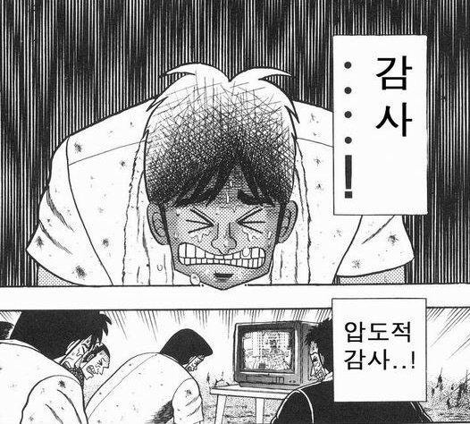

## 출사표

인프런 워밍업 클럽 2기가 오픈되었다. 0기때 참가하고 1기때 서포터로 활동한 나는 2기의 모집 배너를 보게 되었다. 이번 기수에는 저번 기수보다 더 다양한 스터디들이 존재했다.

그 중에 나는 백엔드 클린 코드, 테스트 코드 과정을 신청하게 되었다. 사실 신청하는 과정에 고민을 많이 하게 되었다.

> 현재 개인적인 공부와 더불어 북 스터디를 같이 진행하는 상황에서 워밍업 클럽까지 완주를 할 수 있을까?

그리고 다른 주위분들께도 조언을 많이 구해보았다. 그리고 결국 신청을 하게 되었다. 가장 큰 이유는 아래와 같다.

> 1. 지금 신청하지 않으면 미래의 나에게 많은 **후회**를 가져다 줄 것 같다는 느낌이 들었기 때문이다.
>
> 2. 해당 스터디는 개발 시작부터 우상이였던 **우빈님**이 하시는 스터디였기에 더욱 하고 싶은 마음이 더 컸던 것 같다.
>
> 3. 클린코드와 테스트 코드는 내가 한번 제대로 공부를 해본 적이 없었고 이렇게 다른 러너분들과 다 같이 학습하여 같이 **해당 주제의 심도를 같이 성장**시키고 싶었기 때문이다.

나는 웹 프론트 업무를 하는 겸 백엔드 업무도 서브로 진행하는 개발자이다. 현재 나는 이직 및 커리어 전환을 꿈꾸며 계속 달려오고 있었다. 하지만 어느순간부터 현재의 삶에 안주하며 계획했던것들을 미루고 조금은 나태한 삶을 살았던 것 같다. 하지만 아래의 명언을 우연히 본 순간 나의 가슴을 일깨웠다.

> 배는 항구에 있을 때 가장 안전하다. 그러나 그것이 배의 존재 이유는 아니다.

현재의 삶에 너무 안주했던 나에게 천둥같은 소리처럼 다가왔고 그때부터 조금은 열심히 공부를 진행하며 달려오고 있다. 물론 항해를 하면서 천둥과 비바람을 맞을 확률이 있는 것처럼 내가 공부를 하면서 커리어 전환에 있어서 많은 시련들이 있을 것이다. 지금 현재 이 워밍업 클럽도 하나의 시련일 수도 있다. 하지만 비바람을 이겨내고 목표지점에 도달한 항해사의 기쁨처럼 이 워밍업 클럽도 견뎌내어서 이로 인해 나의 목표에 도달했을때 그 기쁨.. 얼마나 아름답고 기쁠수 있을까..

인프런 워밍업 클럽 해당 기수에도 더욱 최선을 다하여 완주에 이어서 우수러너까지 더 열심히 해보겠다. 그러면 언젠가 저의 목적지 항구에 도착할 수 있지 않을까?

> 📚 참고자료
>
> [하단 이미지 짤](https://m.blog.naver.com/ididid090909/221742659185)