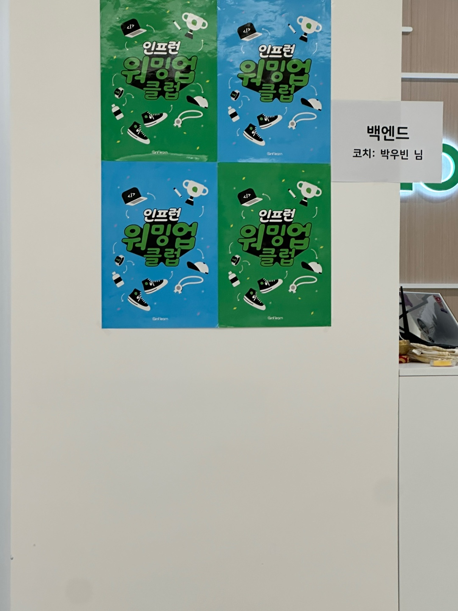

## 회고록

어느덧 인프런 워밍업 스터디 클럽 2기가 수료식까지 마무리가 되었습니다. 처음 이 스터디 클럽을 신청할때 "과연 이 스터디 클럽이 마무리가 되었을 때 정말 얼마나 나 자신이 성장을 할 수 있을까?"라는 생각을 하게 되었습다. 그리고 지금 마무리 시점에서 정말로 성장을 할 수 있었다는 생각을 들게 되었습니다.

이번에 배운 클린코드와 테스트코드는 지식 자체도 내가 어려운 부분이라 조금은 걱정이 되었지만 미션과 강의를 학습하면서 이제 나에게 **두려움의 대상에서 친구의 대상**이 되었던 것 같습니다! 그럼 이제 본격적으로 후기를 작성해보겠습니다.

### 수료식

오프라인 수료식에 조금 일찍 도착한 나는 같이 학습한 러너분 한분과 커피 한잔을 하고 인프랩 사무실에 도착했습니다. 명찰을 나눠주신 임직원분께서 익숙한 얼굴이라 하시면서 친근히 맞이해주셨습니다.

#### 네트워킹

테이블에 앉고 다른 러너분들도 슬슬 들어오시기 시작하셨습니다. 그리고 같은 테이블에 디스코드로만 뵙던 러너분들과 인사를 하면서 서로의 소개를 하고 같이 서로의 context를 공유를 하였습니다.

#### 저녁식사

저녁은 스터디별로 진행이 되었고 인프랩 측에서 맛있는 피자를 준비해주셨고 우빈님께서 각 테이블을 돌아다니시면서 재밌는 이야기를 많이 나누곤 했습니다.

#### 질의응답

사전에 미리 받으신 질문들에 대해 우빈님께서 질의응답을 해주셨고 여러 질문들에 대해서 나도 많이 얻고 깨닫는 부분이 있었고 질문을 해주신 러너분들과 답변을 해주신 우빈님께 감사의 인사를 드리고 싶었습니다.

#### 우수러너 시상식

어느덧 우수러너 시상식이 시작되었습니다. 솔직한 마음으로 나름 "나도 받지 않을까?"라는 마음이 없지는 않았지만 그래도 큰 기대는 하지 않았습니다. 솔직히 이번 과제를 0기때보다 열심히 하질 못한 것 같다는 죄책감에 다른 분들이라도 받으셨으면 좋겠다라는 생각을 하게되었습니다. 하지만 예상 밖으로 제가 **우수러너**에 당첨이 되었습니다! 정말 믿을 수가 없었습니다. 우수러너로 1:1 멘토링권과 인프랩측에서 준비한 굳즈를 받게 되었고 너무 행복했습니다! 굳즈도 정말 **이븐**한 굳즈들이였습니다! 또한 더욱 즐거웠던건 제가 아는 러너분들도 우수러너에 선정되었다는게 매우 좋았습니다.

### 마지막

'인프런 워밍업 스터디 클럽'이 다른 기업의 교육프로그램인 '우x코'처럼 커지기를 바라며 3기가 개최가 되고 저에게 다시 기회가 온다면 참여해보고 싶다는 생각을 하며 이 글의 마침표를 적어봅니다. 또한 다 같이 성장이라는 모토로 더욱 거대한 클럽이 되었으면 하는 마음으로 이 글을 마무리합니다.
