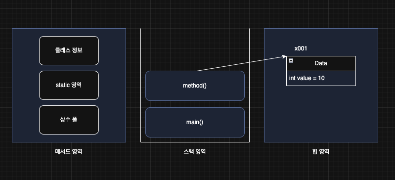
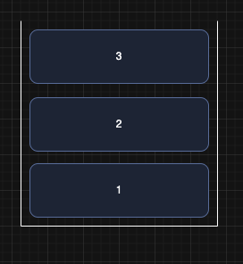
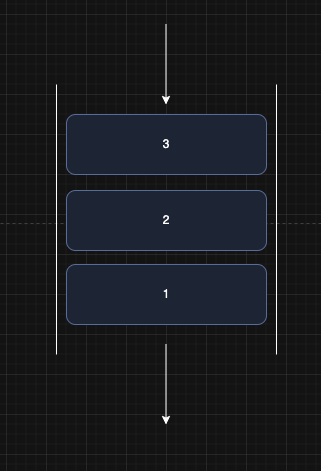
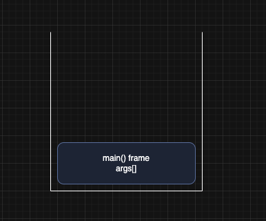
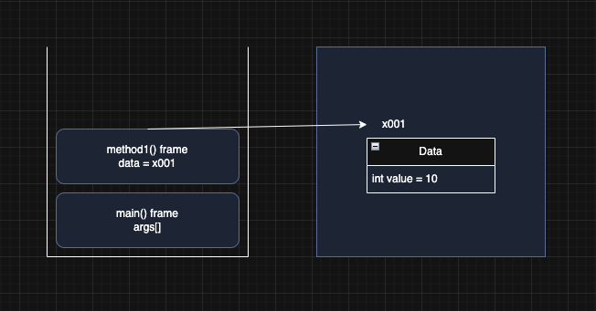
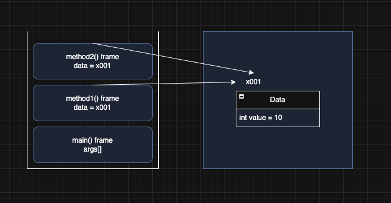

> 해당 블로그 글은 [영한님의 인프런 강의](https://inf.run/PuC6W)를 바탕으로 쓰여진 글입니다.

## 자바 메모리 구조

자바의 메모리 구조는 크게 메서드 영역, 스택 영역, 힙 영역 3개로 나눌 수 있다.

- 메서드 영역: 클래스 정보를 보관한다. 일종의 붕어빵 틀을 보관한다고 생각하면 이해하기 쉬울 것이다.
- 스택 영역: 실제 프로그램이 실행되는 영역이다. 메서드를 실행할 때 마다 하나씩 쌓인다.
- 힙 영역: 객체(인스턴스)가 생성되는 영역이다. `new` 명령어를 사용하면 이 영역을 사용한다. 붕버빵이 이 안에 담긴다고 생각하면 쉬울 것이다. 참고로 배열도 이 영역에 담긴다.

좀 더 자세히 알아보자.



- **메서드 영역**: 메서드 영역은 프로그램을 실행하는데 필요한 공통 데이터를 관리한다. 이 영역은 프로그램의 모든 영역에서 공유한다.
    - 클래스 정보: 클래스의 실행 코드(바이트 코드), 필드, 메서드와 생성자 코드등 모든 실행 코드가 존재한다.
    - static 영역: `static` 변수들을 보관한다.
    - 런타임 상수 풀: 프로그램을 실행하는데 필요한 공통 리터럴 상수를 보관한다.(Java7부터 힙 영역으로 이동)
- **스택 영역**: 자바 실행 시, 하나의 실행 스택이 생성된다. 각 스택 프레임은 지역 변수, 중간 연산 결과, 메서드 호출 정보 등을 포함한다.
    - 스택 프레임: 스택 영역에 쌓이는 네모 박스가 하나의 스택 프레임이다. 메서드를 호출할 때 마다 하나의 스택 프레임이 쌓이고, 메서드가 종료되면 해당 스택 프레임이 제거된다.
- **힙 영역**: 객체(인스턴스)와 배열이 생성되는 영역이다. 가비지 컬렉션(GC)이 이루어지는 주요 영역이며, 더 이상 참조되지 않는 객체는 GC에 의해 제거된다.

> ✅ 참고
>
> 스택 영역은 더 정확히는 각 쓰레드별로 하나의 실행 스택이 생성된다. 따라서 쓰레드 수 만큼 스택 영역이 생성된다.

자바에서 인스터스를 생성하면 힙 영역에 생성이 된다. 그리고 메서드를 호출하려고 한다면 각 인스턴스마다 메서드를 호출하는게 아닌 공통 영역인 메서드 영역에 메서드를 호출하는 형식인 것이다.

## 스택과 큐 자료 구조

스택 영역에 대해 학습하기 전에 스택, 큐 자료구조에 대해 잠깐 짚고 넘어가보자.

### 스택



스택 자료구조는 위의 그림처럼 위에만 뚫려 있는 형태이다. 그래서 먼저 들어간 것이 가장 아래에 위치하여 가장 나중에 나오는 구조이다. 쉽게 생각하면 우리 집에 위에 문이 있는 김치 냉장고를 생각하면 쉬울 것이다. 그리고 이렇게 먼저 들어간 것이 나중에 나오는 형태를 LIFO(후입 선출)이라고 한다. ex. 메서드 호출 순서

### 큐



큐 자료구조는 먼저 들어간 것이 먼저 나가는 형태이다. 양쪽이 다 뚫려 있는 그림을 생각하면 쉽다. 이렇게 먼저 들어간 것이 먼저 나오는 형태를 FIFO(선입 선출)이라고 한다. ex. 선착순 티켓팅

## 스택 영역

그러면 아래의 코드의 실행순서를 스택 영역과 연관 지어서 생각해보자.

``` java
package memory;

public class JavaMemoryMain1 {
    public static void main(String[] args) {
        System.out.println("main start");
        method1(10);
        System.out.println("main end");
    }

    static void method1(int m1){
        System.out.println("method1 start");
        int cal = m1 * 2;
        method2(cal);
        System.out.println("method1 end");
    }

    static void method2(int m2){
        System.out.println("method2 start");
        System.out.println("method2 end");
    }
}
```

1. 처음에 JVM 위에 스택 영역은 빈 공간일 것이다. 자바 프로그램이 시작되면서 main 메서드가 먼저 호출이 된다.
2. 스택 영역에 main 스택이 쌓인다.
3. main 메서드 내에서 method1이라는 메서드를 호출한다.
4. method1이 실행과 동시에 스택 영역에 method1 스택이 쌓인다.
5. method1 메서드 내에 method2가 호출된다.
6. method2가 실행과 동시에 스택영역에 method2 스택이 쌓인다.
7. method2 실행이 종료되면 스택영역에 제거된다.
8. method1도 마찬가지로 실행 종료 후 스택영역에 제거된다.
9. main메서드도 실행 종료후 스택영역에 제거되면서 프로그램이 종료된다.

### 정리

- 자바는 스택 영역을 사용해서 메서드 호출과 **지역 변수(매개변수 포함)를 관리**한다.
- 메서드를 계속 호출하면 스택 프레임이 계속 쌓인다.
- 지역 변수(매개변수 포함)는 스택 영역에서 관리한다.
- 스택 프레임이 종료되면 지역 변수도 함께 제거된다.
- 스택 프레임이 모두 제거되면 프로그램도 종료된다.

## 스택 영역과 힙 영역

이번에는 스택 영역과 힙 영역이 같이 사용되는 예제를 살펴보자.

``` java
package memory;

public class Data {

    private int value;

    public Data(int value) {
        this.value = value;
    }

    public int getValue() {
        return value;
    }
}
```

``` java
package memory;

public class JavaMemoryMain2 {
    public static void main(String[] args) {
        System.out.println("main start");
        method1();
        System.out.println("main end");
    }

    static void method1(){
        System.out.println("method1 start");
        Data data = new Data(10);
        method2(data);
        System.out.println("method1 end");
    }

    static void method2(Data data){
        System.out.println("method2 start");
        System.out.println("data.value = " + data.getValue());
        System.out.println("method2 end");
    }
}
```

이제 실행 순서를 보자.



처음에 자바 프로그램이 시작되면서 main메서드를 실행한다. 그러면 위와 같이 스택 영역에 main 스택이 쌓인다.



main메서드가 실행이 되면 그 안에서 method1 메서드가 호출이 된다. 호출이 되면 method1을 실행함과 동시에 스택영역에 method1 프레임이 쌓인다. method1이 실행하면서 지역변수 Data 타입의 참조형 변수를 만난다. 해당 지역변수도 스택 프레임에 포함되며 new 연산자로 초기화를 해줄 때 힙 영역에 Data 인스턴스를 생성하고 반환된 참조값을 해당 변수에 매핑한다.



method1이 실행되면서 method2가 호출이 된다. method2가 실행이 될 때 스택프레임에 쌓이고 method1로부터 복사하여 전달 받은 참조값을 파라미터에 저장한다. 그러면 method2 스택 프레임은 해당 힙 영역에 생성된 인스턴스를 가리킨다.

그리고 method2가 실행이 완료되면 스택 프레임은 제거되고 힙 영역의 인스턴스와도 연결이 끊긴다. 다음으로 method1이 실행이 완료되고 스택 프레임에 제거가 되며 힙 영역의 인스턴스와 연결이 끊긴다. 그렇게 되면 더 이상 힙 영역의 인스턴스는 누구와도 연결되어 있지 않기에 GC의 제거 대상이 되고 제거된다. 마지막으로 main메서드가 종료되고 스택프레임에 제거되면서 프로그램이 종료 된다.

> ✅ 참고
>
> 힙 영역 외부가 아닌, 힙 영역 안에서만 인스턴스끼리 서로 참조하는 경우에도 GC의 대상이 된다.

### 정리

지역 변수는 스택 영역에, 객체(인스턴스)는 힙 영역에 관리되는 것을 확인했다. 이제 나머지 하나가 남았다. 바로 메서드 영역이다. 메서드 영역이 관리하는 변수도 있다. 이것을 이해하기 위해서는 먼저 `static` 키워드를 알아야 한다.

## static 변수1

`static` 키워드는 주로 멤버 변수와 메서드에 사용된다. 그러면 왜 `static`키워드가 필요한지 예제를 통해 알아보자.

아래와 같이 회원 클래스가 존재하고 채팅방에 접속하는 것을 구현하려고 한다. 그리고 채팅방은 총 몇명 접속했는지 로직을 계산하려한다. 그러면 한번 살펴보자.

``` java
package static1;

public class Member {
    String name;

    int count;

    public Member(String name) {
        this.name = name;
        count++;
    }
}
```

``` java
package static1;

public class ChattingRoom {
    public static void main(String[] args) {
        Member member1 = new Member("A");
        System.out.println("A count=" + member1.count);

        Member member2 = new Member("B");
        System.out.println("B count=" + member2.count);
        
        Member member3 = new Member("C");
        System.out.println("C count=" + member3.count);
    }
}
```

위의 코드는 딱 봐도 이제 채팅룸 인원수를 제대로 표기를 못한다고 알 수 있다. 왜냐하면 멤버 변수는 인스턴스 마다 생기고 인스턴스 3개를 생성했으니 count값도 전부 따로 생기고 전부 1인 증상이 나올 것이다. 그래서 아래와 같이 Counter라는 클래스를 두려고 한다.

``` java
package static1;

public class Counter {

    public int count;
}
```

``` java
package static1;

public class Member {
    String name;

    public Member(String name, Counter counter) {
        this.name = name;
        counter.count++;
    }
}
```

``` java
package static1;

public class ChattingRoom {
    public static void main(String[] args) {
        Counter counter = new Counter();

        Member member1 = new Member("A");
        System.out.println("A count=" + counter.count);

        Member member2 = new Member("B");
        System.out.println("B count=" + counter.count);
        
        Member member3 = new Member("C");
        System.out.println("C count=" + counter.count);
    }
}
```

위와 같이 카운터 클래스를 만들고 회원 클래스 생성자에 카운터 인스턴스 참조값을 넘기는 방식으로 진행을 하였다. 그리고 원하는 결과가 나올 것이다.

하지만 문제가 있다. 해당 방식은 좋지 못한 방식이다. 회원 객체에서 처리해도 될 것을 굳이 해당 기능 때문에 클래스를 하나 더 만든 것이다. 이것은 매우 큰 리소스이다. 지금은 잘 모르겠지만 실제 JPA와 연동한다면 DB 테이블 하나를 더 만드는 행위인 것이기도 하다. 또한 생성자의 매개변수도 추가되고, 생성자가 복잡해지고, 생성자를 호출하는 부분도 복잡해진다.

## static 변수2

특정 클래스에서 공용으로 함께 사용할 수 있는 변수를 만들 수 있다면 편리할 것이다. `static` 키워드를 사용하면 공용으로 함께 사용하는 변수를 만들 수 있다.

``` java
package static1;

public class Member {
    String name;
    static int count;

    public Member(String name) {
        this.name = name;
        count++;
    }
}
```

``` java
package static1;

public class ChattingRoom {
    public static void main(String[] args) {
        Member member1 = new Member("A");
        System.out.println("A count=" + Member.count);

        Member member2 = new Member("B");
        System.out.println("B count=" + Member.count);
        
        Member member3 = new Member("C");
        System.out.println("C count=" + Member.count);
    }
}
```

이렇게 `static` 키워드를 사용한다면 추가의 클래스 없이도 간편히 원하는 로직을 작성할 수 있다. 이전 코드와 달라진 점은 그냥 변수에 `static` 키워드 밖에 붙인것이 없다. 이렇게 멤버 변수에 `static`을 붙이게 되면 `static` 변수, 정적 변수 또는 클래스 변수라 한다. 또한, 정적 변수에 접근하는 방법이 조금 특이한데 `Member.count` 와 같이 클래스명에 `.` (dot)을 사용한다. 마치 클래스에 직접 접근하는 것 처럼 느껴진다.

정적 변수를 선언하면 힙 영역에 해당 변수가 생성되는 것이 아니라 메서드 영역 중 static 영역에 공용 공간에 딱 1번 생성된다. 즉, 인스턴스가 수백개가 있더라도 해당 정적 변수는 하나로 공용으로 사용한다.

## static 변수3

### 용어 정리

``` java
public class Member {
    String name;
    static int count;
}
```

위의 name과 count는 둘다 멤버 변수이다.

### 멤버 변수의 종류

- 인스턴스 변수: `static`키워드가 붙지 않는 멤버 변수
    - `static` 이 붙지 않은 멤버 변수는 인스턴스를 생성해야 사용할 수 있고, 인스턴스에 소속되어 있다. 따라서 인스턴스 변수라 한다.
    - 인스턴스 변수는 인스턴스를 만들 때 마다 새로 만들어진다.
- 클래스 변수: `static`키워드가 붙은 멤버 변수
    - 클래스 변수, 정적 변수, `static` 변수등으로 부른다. **용어를 모두 사용하니 주의하자**
    - `static` 이 붙은 멤버 변수는 인스턴스와 무관하게 클래스에 바로 접근해서 사용할 수 있고, 클래스 자체에 소속되어 있다. 따라서 클래스 변수라 한다.
    - 클래스 변수는 자바 프로그램을 시작할 때 딱 1개가 만들어진다. 인스턴스와는 다르게 보통 여러곳에서 공유하는 목적으로 사용된다.

### 변수와 생명주기

- 지역변수(매개변수): 지역 변수는 스택 영역에 있는 스택 프레임 안에 보관된다. 메서드가 종료되면 스택 프레임도 제거 되는데 이때 해당 스택 프레임에 포함된 지역 변수도 함께 제거된다. 따라서 지역 변수는 생존 주기가 짧다.
- 인스턴스 변수: 인스턴스에 있는 멤버 변수를 인스턴스 변수라 한다. 인스턴스 변수는 힙 영역을 사용한다. 힙 영역은 GC(가비지 컬렉션)가 발생하기 전까지는 생존하기 때문에 보통 지역 변수보다 생존 주기가 길다.
- 클래스 변수: 클래스 변수는 메서드 영역의 static 영역에 보관되는 변수이다. 메서드 영역은 프로그램 전체에서 사용하는 공용 공간이다. 클래스 변수는 해당 클래스가 JVM에 로딩 되는 순간 생성된다. 그리고 JVM이 종료될 때 까지 생명주기가 이어진다. 따라서 가장 긴 생명주기를 가진다.

### 정적 변수 접근법

이전에 알아봤듯이 `클래스이름.정적변수`로 접근을 하는게 일반적이다. 하지만 `인스턴스명.정적변수`처럼 일반 클래스의 필드를 접근하듯이 접근할 수 있다. 하지만 해당 방법은 추천하지 않는다. 왜냐하면 다른 사람이 봤을 때 해당 변수가 정적 변수인지 인스턴스 변수인지 헷갈리기 때문이다.

## static 메서드1

``` java
public class Calculator {
    public int add(int num1, int num2) {
        return num1 + num2;
    }
}
```

위와 같은 클래스가 있다고 하자. 단순히 더하는 기능만 가지고 있다. 그러면 해당 클래스를 사용하려면 아래와 같이 할 수 있을 것이다.

``` java
public class Main {
    public static void main(String[] args) {
        Calculator calculator = new Calculator();
        int sum = calculator.add(1, 2);
    }
}
```

하지만 뭔가 해당 계산기 클래스는 객체 생성이 불필요해 보인다. 왜냐하면 자기가 가지고 있는 데이터도 없고 순수 기능만 있기 때문이다. 이럴 때 바로 `static` 메서드를 이용한다. 그러면 위의 예제 코드를 `static` 메서드로 변경해보자.

``` java
public class Calculator {
    public static int add(int num1, int num2) {
        return num1 + num2;
    }
}
```

``` java
public class Main {
    public static void main(String[] args) {
        int sum = Calculator.add(1, 2);
    }
}
```

정적 변수처럼 사용법은 비슷하다. 이렇게 `static` 메서드를 이용함으로 객체 생성 없이 단순해졌다. 이것을 **정적 메서드** 또는 **클래스 메서드**라 한다.

## static 메서드2

정적 메서드는 객체 생성 없이 사용할 수 있다는 장점이 있다. 하지만 약간의 제약이 존재한다.

- `static` 메서드는 `static` 만 사용할 수 있다.
    - 클래스 내부의 기능을 사용할 때, 정적 메서드는 `static` 이 붙은 **정적 메서드나 정적 변수만 사용할 수 있다.**
    - 클래스 내부의 기능을 사용할 때, 정적 메서드는 인스턴스 변수나, 인스턴스 메서드를 사용할 수 없다.
- 반대로 모든 곳에서 `static` 을 호출할 수 있다.

정적 메서드가 인스턴스 메서드나 변수를 사용할 수 없는 이유는 바로 참조값 개념이 없기 때문이다. 물론 정적 메서드에 인자로 참조값을 넘겨주면 인스턴스 변수나 메서드를 사용이 가능할 것이다. 아래 코드처럼 말이다. 또한 인스턴스를 만들어서 정적 메서드 호출이 가능하긴 하다.

``` java
public class A {

    public int data;

    public static void call(A a) {
        int temp = a.getData();
        a.data = 1;
    }

    public int getData() {
        return data;
    }
}
```

## static 메서드3

### 용어 정리

- 인스턴스 메서드: `static` 이 붙지 않은 멤버 메서드
- 정적 메서드: `static` 이 붙은 멤버 메서드

### 정적 메서드 활용

정적 메서드 활용하는 곳은 다양하다. 주로, 유틸성 클래스를 개발하거나 혹은 싱글톤 디자인 패턴을 사용할 때 주로 많이 사용한다.

### 정적 메서드 접근

정적 메서드 접근은 이전에 봤듯이 `클래스명.정적메서드()`로 하거나 `인스턴스명.정적메서드()`로 진행해야 한다. 하지만 주로 `클래스명.정적메서드()`으로 하고 `인스턴스명.정적메서드()`은 하지 않는다. 그 이유는 이전 정적 변수처럼 제3자가 보았을 때 일반 인스턴스 메서드로 착각하기 쉽기 때문이다.

### static import

정적 메서드를 사용할 때 해당 메서드를 다음과 같이 자주 호출해야 한다면 `static import` 기능을 고려하자. 코드를 통해 보자.

``` java
package static2;

import static static2.DecoData.staticCall;

public class DecoDataMain {
    public static void main(String[] args) {
        System.out.println("1. 정적 호출");
        staticCall();

        System.out.println("2. 인스턴스 호출1");
        DecoData data1 = new DecoData();
        data1.instanceCall();

        System.out.println("3. 인스턴스 호출2");
        DecoData data2 = new DecoData();
        data2.instanceCall();
    }
}
```

`staticCall()`이라는 정적 메서드를 클래스명 없이 사용했다. 그 이유는 `static import`때문이다. 정적 메서드를 많이 사용한다면 해당 기능을 이용하자. 참고로 `import static` 은 정적 메서드 뿐만 아니라 정적 변수에도 사용할 수 있다.

> 우리가 일일이 타이핑 할 필요 없이 IDE 도움을 받으면 쉽게 만들 수 있다.

### main() 메서드는 정적 메서드

인스턴스 생성 없이 실행하는 가장 대표적인 메서드가 바로 `main()` 메서드이다. `main()` 메서드는 프로그램을 시작하는 시작점이 되는데, 생각해보면 객체를 생성하지 않아도 `main()` 메서드가 작동했다. 이것은 `main()` 메서드가 `static` 이기 때문이다.

> 잘못된 지식이 있을 경우 댓글로 남겨주시면 빠르게 반영하겠습니다!