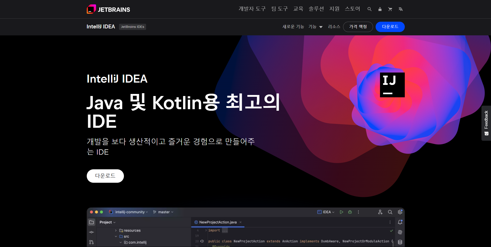
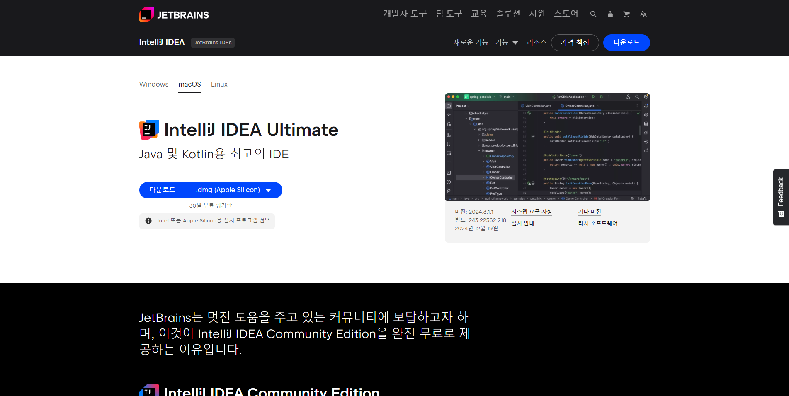
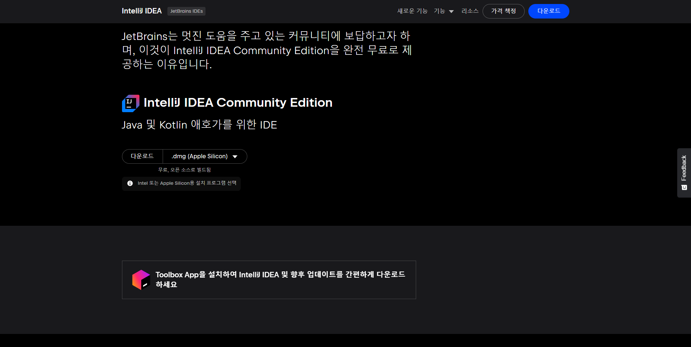
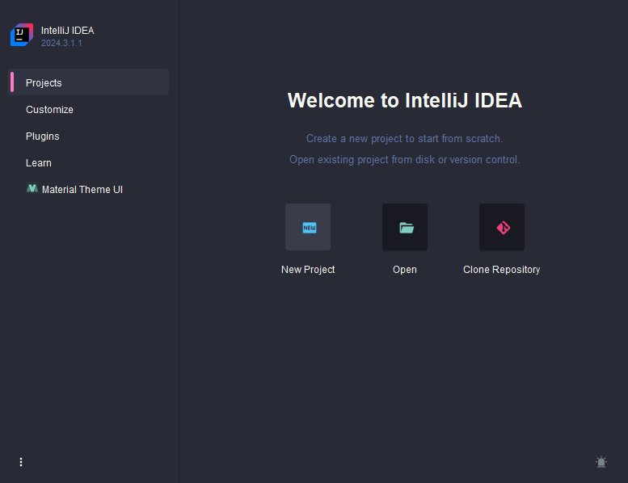
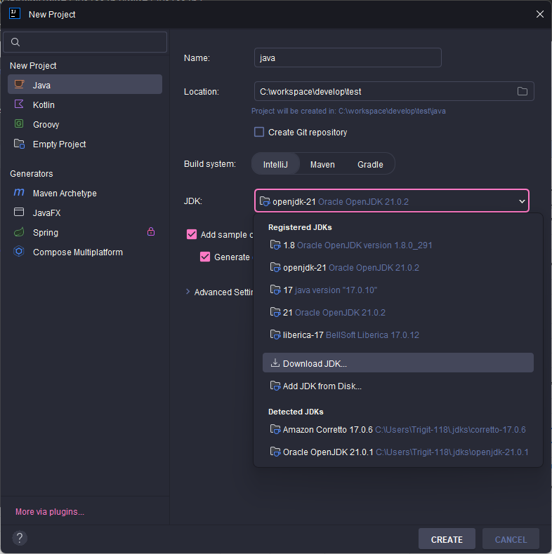
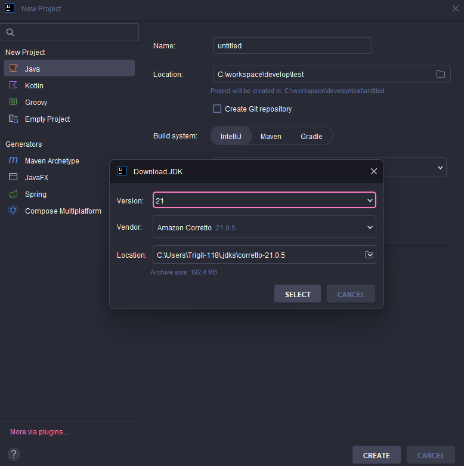
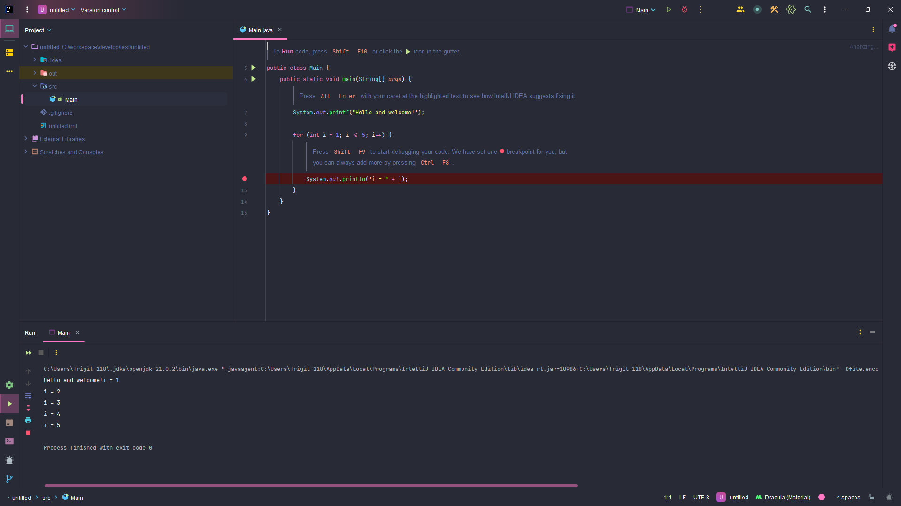
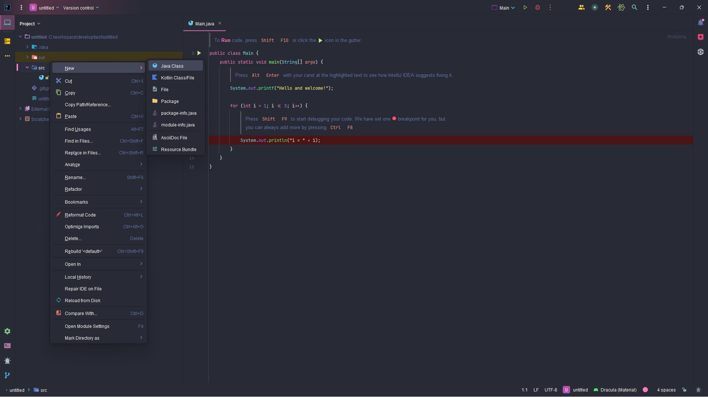
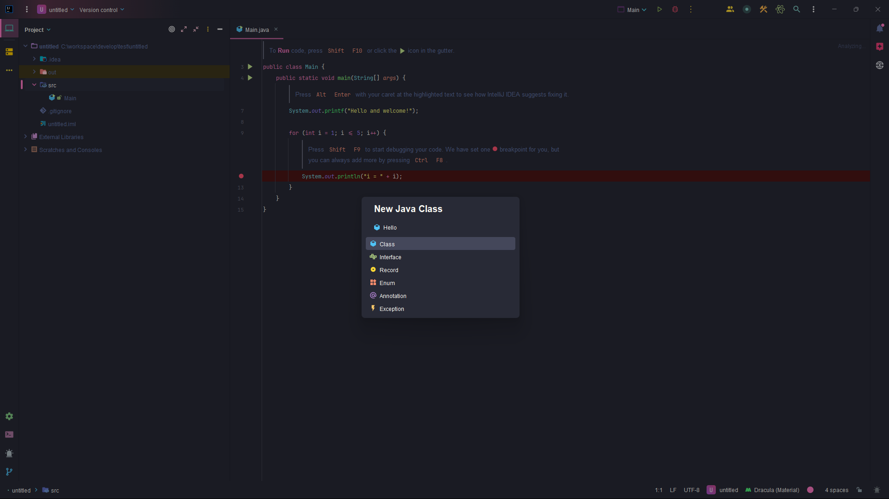

> 📖 참고사항
>
> https://inf.run/2zsZz

## Hello World

### 개발 환경 설정

Java 프로그래밍 개발에 앞서 먼저 환경 세팅을 해보려고 합니다. 개발함에 있어서 우리는 개발에 필요한 IDE를 설치해야 합니다. 그런데 처음 개발에 입문하시는 분들은 IDE라는 용어 자체도 생소하실 것입니다. IDE란 무엇일까요?

> ✅ IDE란?
>
> IDE(통합 개발 환경)는 프로그램을 만들기 위해 필요한 도구들이 하나로 모여 있는 소프트웨어입니다. 즉, 개발자가 코드를 작성하고 문제를 찾고, 실행해볼 수 있는 작업 공간이라고 생각하면 됩니다.

하지만 이렇게 말씀들 드리면 이해가 안 갈 것입니다. 조금 더 쉽게 설명해보겠습니다. 한번 여러분께서 사용하시는 MS Word같은 문서 작성 프로그램을 생각해봅시다. Word에서는 글씨를 쓰고 글자 모양을 바꾸고, 문법을 확인하며, 잘못된 부분을 쉽게 고칠수 있겠죠? 이런 도구들이 한 곳에 모여 있어서 우리는 쉽게 문서를 작성할 수 있습니다.

IDE는 프로그래밍을 위한 Word같은 역할을 한다고 생각합니다. 코드를 작성하고 실행하는 데 필요한 도구들이 모여있습니다. 만약 IDE가 없다면 어떻게 할까요? 여러분이 문서를 작성하는데 단순히 메모장으로만 한다고 생각을 하시면 이해가 쉬울 겁니다. IDE가 없다면, 개발자들은 코드를 메모장에 작성하고, 에러를 수동으로 찾고, 프로그램 실행 또한 별도 도구를 통해 해야하는 귀찮은 작업들을 할 것입니다. IDE는 이런 과정을 간단하고 빠르게 만들어줍니다.

#### IDE - 인텔리제이 vs 이클립스

자바의 대표적인 IDE로는 **인텔리제이**와 **이클립스** 2가지가 대표적입니다. 과거에는 이클립스를 많이 사용을 하였지만 요즘 메이저 기업들에서는 인텔리제이를 많이 사용한다고 합니다. 인텔리제이가 주목받는 이유는 이클립스에 비해 빠른 속도 및 사용자의 편의성때문이라고 생각이 듭니다. 또한, 제가 학부생때 이클립스를 사용하면서 느낀 것은 이클립스를 사용하면서 이클립스 IDE자체의 버그들이 있어서 개발 외적으로 신경을 쓰는 부분들도 있었습니다. 그래서 저의 개인적인 입장에서는 인텔리제이를 선호하며 인텔리제이로 실습을 진행해보겠습니다.

> ✅ 참고
>
> 이클립스 툴은 SI 기업에서 의외로 많이 사용된다고 합니다. SI 기업을 희망하시는 분들께서는 제가 학부생때 적었던 [이클립스 설치 및 세팅](https://blog.naver.com/ysb05222/221916326429)을 참고해주시면 감사하겠습니다.

#### OS - 윈도우 vs 맥

제가 조사한 바로는 자바로 개발하는 대부분의 빅테크 기업들에서는 맥을 사용한다고 알고 있습니다. 하지만 윈도우를 사용하는 곳 또한 무시하지 못하게 많은 걸로 파악이 됩니다. 또한 독자분들이 학생분들이라면 자바 개발을 위해서 거금을 주고 맥을 구입하기에는 너무 부담이 될 것입니다. 그래서 결론은 OS는 무관하게 사용하셔도 괜찮다고 판단됩니다. 다만, 저는 맥을 사용하는 입장에서 맥을 메인으로 이용하고 맥 환경과 다른 부분들은 첨부해서 알려드리도록 하겠습니다.

### 인텔리제이 설치하기

인텔리제이 설치방법은 비교적 간단하다. [인텔리제이 다운로드](https://www.jetbrains.com/ko-kr/idea/) 링크를 클릭해보시면 아래와 같은 화면이 나올 것입니다.



다운로드 버튼을 클릭해보시면 아래와 같이 운영체제별 선택하는 화면이 나올 것입니다.



그러면 2가지 선택을 할 수 있을 것입니다. 맨 처음에 있는 Ultimate버전과 스크롤을 내려보시면 아래와 같은 Community 버전이 있을 것입니다.



Ultimate와 Community 버전의 차이는 유료와 무료의 차이입니다. 물론 저자는 돈을 내고 Ultimate를 쓰고 있지만 무료로 Community 버전을 이용해도 자바 개발에 있어서 큰 무리는 없다고 봅니다. 독자들의 PC버전의 스펙에 맞게 원하시는 버전으로 다운로드 받아주시면 좋을 것 같습니다.

다운로드 받은 IDE를 설치해주시고, 실행을 시키면 다음과 같은 화면이 나올 것입니다.



New Project 버튼을 클릭하여 Name(프로젝트 이름)을 적어주시고(한글말고 영어로 기입) 해당 프로젝트 저장 경로를 설정해주시면 됩니다. 또한, 나머지 것들은 따로 건드실 필요 없고 JDK부분만 설치를 해주시면 됩니다. 아마 JDK를 설치하지 않았던 독자분들께서는 아래처럼 안 나올 것인데 Download JDK를 눌러서 원하시는 JDK를 설치해주시면 됩니다.





단, 버전은 자유롭게 해주시면 되지만 저는 되도록 LTS(공식) 버전 중 최신인 21로 추천드립니다. 그리고 create 버튼을 클릭하면 무슨 알수 없는 언어로 작성된 화면이 나올 것입니다. 일단 네모 화살표 버튼을 클릭하거나 단축키를 통해 자바 프로그램을 실행시켜 볼까요? 그러면 아래와 같은 화면이 나올 것입니다.

> ✅ 자바 프로그램 단축키
>
> 네모 화살표 박스에 있는 화면을 클릭 후, 맥 기준 Ctrl + shift + r, 윈도우 기준 Ctrl + shift + F10을 입력하시면 됩니다.




그러면 자바 개발에 드디어 첫 발자취가 시작이 된 것입니다.

> ✅ 용어 정리
>
> JDK: 자바를 개발하기 위해서는 JDK가 필요하다. JDK는 자바 프로그래머를 위한 도구 + 자바 실행 프로그램 묶음이다. ex) oracle openJDK

단, 우리는 이런 JDK를 따로 사이트에 가서 설치하지 않고 인텔리제이 툴을 이용해서 설치했습니다. 이것 또한 인텔리제이 편의성 중 하나라고 생각합니다. 만약 이클립스를 이용했다면 JDK를 다운받아 설치하고 환경변수 등록하는등의 수 많은 작업을 진행해야 하는데 학부생 때 저는 이 부분에서 많은 어려움을 겪었었습니다.

### 자바 프로그램 실행

그럼 이제 자바 프로그램 코드를 직접 작성해보고 실행을 시켜보고 분석해볼까요?


위의 화면에서 Project칸에 src라고 쓰여있는 곳에 클릭을 한번 하고 오른쪽 마우스를 클릭하고 New > Java Class를 클릭하거나 단축키로 윈도우 기준 Alt + Insert, 맥 기준 Cmd + n을 입력하면 아래와 같이 화면이 나옵니다.



그리고 Java Class를 클릭하거나 엔터를 누르면 아래와 같은 화면이 나오는데 클래스 명을 입력하시면 됩니다. 클래스는 아직 우리가 안 배운 개념이니, 쉽게 파일명이라 생각해봅시다. 그러면 Hello라는 파일명을 입력하고 class를 생성해봅시다.



그리고 아래의 코드를 똑같이 입력해봅시다.

```java
public class Hello {
    public static void main(String[] args) {
        System.out.println("Hello World!");
    }
}
```

> ✅ 꿀팁
>
> `public static void main(String[] args)`를 입력하기 매우 까다롭고 복잡하니 인텔리제이가 지원해주는 psvm 혹은 main이라고 치면 자동완성 툴팁이 나오는데 엔터나 탭을 누르면 자동완성이 됩니다.
>
> `System.out.println();`도 sout이라는 것을 치면 자동완성 툴팁이 나오는데 엔터나 탭을 누르면 자동완성이 됩니다.

> ⚠️ 주의
>
> 자바 언어는 대소문자를 구분합니다. 대소문자가 다르면 오류를 발생시킵니다.

#### 분석

`public class Hello`
- 클래스라고 합니다. 앞서 말했듯이 아직 해당 개념을 학습하지 않아 일단 파일명이라고 생각하면 쉬울 것 같습니다.
- `{}` 블록을 사용해서 클래스의 시작과 끝을 나타냅니다.

`public static void main(String[] args)`
- main 메서드라고 하는데 메서드도 아직 학습하지 않았기에 일단은 자바 프로그램의 시작점이라고 생각하면 쉬울 것 같습니다.
- `{}` 블록을 사용해서 메서드의 시작과 끝을 나타냅니다.

`System.out.println(”Hello World!”);`
- `System.out.println()` 안의 값을 출력하는 기능을 합니다.
- 또한, 문자 여러개를 문자열이라고 지칭하며 문자열을 사용할 시, 쌍따옴표로 감싸야 합니다.

`;`
- 자바 프로그래밍에서 모든 코드의 끝은 `;`로 끝나야 합니다. MS Word로 치면 마침표와 같은 느낌으로 받아들이시면 좋을 것 같습니다.

#### 들여쓰기
- 우리는 클래스라는 파일명과 main메서드라는 프로그램의 시작점에 대해 배웠습니다. 코드를 작성하시면서 아셨겠지만 스페이스 4칸으로 블록 기준으로 적용이 되어있습니다. 이것을 들여쓰기라고 지칭하며 이것은 코드를 쉽게 구분하고 이해하도록 도와주는 관례입니다. 필수규칙이 아닌 관례인 만큼 들여쓰기를 안하고 다 붙여써도 적용은 되지만 저희 개발자들이 알아볼 수 없을 것입니다. 그래서 IDE에서 이런 들여쓰기를 자동으로 지원해줍니다. 인텔리제이에서는 들여쓰기 기준이 space4번이며 이것은 Tab키를 눌렀을때 space 4번으로 되어있습니다. 하지만 이것 또한 회사의 컨벤션에 따라 바뀔 수 있으니, 실무에서는 회사 컨벤션을 따르고 변경이 필요할 시, 인텔리제이 설정에서 변경하시면 됩니다. 해당 부분은 직접 구글링을 해보시면 쉽게 적용할 수 있으실 겁니다.

### 주석

만약, 소스코드가 몇천만줄이면 어떻게 될까? 아무리 들여쓰기를 잘 해도 가독성이 떨어질겁니다. 그럴때 코드에 대한 이해를 위해 설명글을 적용할 수 있는데 이것을 주석이라고 합니다. 주석은 이렇게 설명글을 적는 용도로도 사용되지만 디버깅이나 테스트를 할때 해당 코드의 기능을 일시정지 시키고 싶을때도 사용이 됩니다.

##### 주석의 종류
- 한줄 주석: `//` 기호로 시작합니다. 이 기호 이후의 모든 텍스트는 주석으로 처리됩니다.
- 여러 줄 주석: `/*` 로 시작해서 `*/` 로 끝납니다. 이 사이의 모든 텍스트는 주석으로 처리됩니다.

#### 예시 코드드

```java
public class Hello {
    public static void main(String[] args) {
        System.out.println("Hello World!");
        // System.out.println("Hello World!");

        /*
        System.out.println("Hello World!");
        System.out.println("Hello World!");
        */
    }
}
```

### 자바란?

그럼 이제 자바가 무엇인지 살펴봅시다. 자바는 프로그래밍의 언어 중 하나이며 하나의 표준 스펙과 여러 구현체로 나뉘어 집니다. 자바를 만든 회사에서 이렇게 자바를 만들면 된다라는 가이드를 만들어주고 이 가이드를 통해서 여러 다양한 회사에서 여러 자바들을 만듭니다.

> 여기서 제가 자바라고 말씀드렸지만 엄밀히 말씀드리면 JDK입니다.

여러분이 인텔리제이에서 JDK를 설치하는 과정에서 여러 JDK를 확인하셨을 것입니다. 이것이 여러 회사에서 JDK를 만들고 있다는 증거입니다. 또한, 가이드라인대로 만들고 각 회사마다 여러 기능들을 추가해서 여러 JDK마다 각각의 장단점들이 존재합니다. 또한 이런 JDK들은 다양한 OS에서 작동하는 버전의 JDK를 함께 제공합니다. 그 덕분에 우리는 운영체제를 신경쓰지 않고 자바 프로그래밍을 할 수 있습니다.

일반적인 프로그램들은 운영체제에 종속적입니다. 예를들어, LOL이라는 게임을 윈도우 운영체제에 설치했는데 이 게임 실행 프로그램을 다른 운영체제로 복사해서 실행하면 실행이 안되는 것과 같은 것을 **'운영체제에 종속적이다.'**라고 표현합니다.

> ❓ 왜 다른 운영체제에서 개발된 프로그램은 다른 운영체제에서 실행이 불가능할까?
>
> 그 이유는 심오하나, 간단히 말씀드리면 윈도우 프로그램은 윈도우 운영체제가 사용하는 명령어들로 구성되어 있기 때문입니다.

하지만 자바는 운영체제에 종속적이지 않고 JVM이라는 가상머신에 종속적입니다. 그래서 JVM이 설치되어 있는 운영체제라면 어디서든 자바 프로그램을 실행시킬 수 있습니다.

> ❓JVM이란?
>
> 일종의 자바 가상머신이다. 가상머신은 무엇일까? 가상머신은 쉽게 생각해서 pc안에 또 다른 pc를 동작시킨다고 생각하면 편할 것입니다. 자세한 내용은 운영체제 관련 내용이므로, 나중에 깊게 다루겠습니다.

또한 개발할때 JDK와 배포할때 JDK는 서로 달라도 됩니다. 그 이유는 위와 같이 자바는 JVM에만 종속적이기 때문이죠. 그래서 배포하는 환경에 최적화된 JDK를 설치하여 많이 사용하곤 한다고 합니다.

### 컴파일과 실행

자바 프로그램을 실행시키려면 소스코드를 컴파일을 한 후에 실행을 합니다. 컴파일이라고 한다면 우리가 알아볼 수 있는 소스코드를 기계가 알아볼 수 있고 최적화되게 변환하는 과정이라고 생각하면 됩니다. 즉, 일종의 번역이라고 생각하시면 편하실 겁니다. 대한민국 사람이 외국인과 의사소통을 하기 위해 번역기를 돌려서 이야기를 하던지, 통역사를 거쳐서 이야기를 하던지, 이런 일련의 과정처럼 컴파일도 사람과 기계의 통역기능이라고 보면 좋을 것 같습니다. 그 다음에 이 번역된 것들을 실행을 시킴으로 자바 프로그램이 동작이 됩니다. 그럼 좀 더 자세히 알아 봅시다.

- 개발자가 Hello.java라는 프로그램 코드를 작성한다.
- 컴파일러를 통해 소스코드를 컴파일한다.
  - 컴파일 과정에서 자바가 제공하는 `javac`라는 명령어를 사용한다.
  - Hello.java가 Hello.class가 되어있다.
  - 인텔리제이에서 보면 주석이 있었던 것들이 주석이 사라지고 기본 생성자라는 것이 생성되어 있습니다.
  - 하지만 실제 이렇게 생기지는 않았고 실제는 0과 1로 되어있는 것을 볼 수 있습니다.
  - 이 과정에서 최적화 및 문법 오류 검출을 실행합니다.
- 자바 프로그램을 실행한다.
  - 자바가 제공하는 `java`라는 명령어를 사용합니다.
  - Hello.class 파일에 `java`라는 명령어를 이용해서 실행을 시킵니다.

하지만 우리는 이런 일련의 과정을 거치지 않고 초록색 버튼 하나 클릭을 하거나 단축키를 입력함으로 실행을 시켰습니다. 이것은 IDE가 `javac` 명령어를 이용해 컴파일과 `java` 명령어를 이용해 실행을 동시에 시켜준 것입니다. 이것이 우리가 IDE를 사용해야 하는 큰 이유 중 하나이기도 합니다.