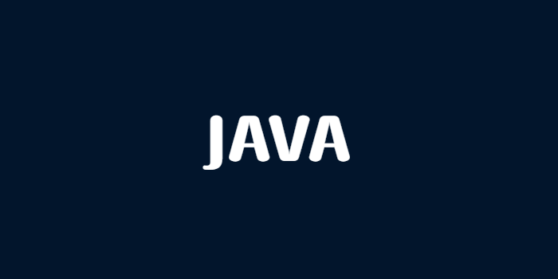
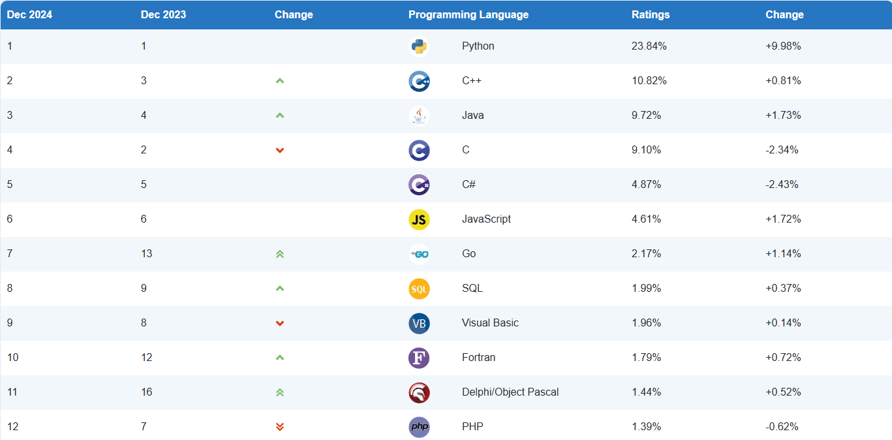

> 📖 참고사항
>
> https://inf.run/2zsZz
> 
> https://www.tiobe.com/tiobe-index/

## 자바 입문 출사표

저는 이제까지 단순히 강의만 듣고 관련 문제들을 푸는 방식으로 학습을 이어왔습니다. 하지만 이렇게 하니 나중에 개념자체를 금방 쉽게 까먹는 일이 비일비재하였습니다. 그래서 어떻게 하면 까먹지 않을까라는 생각을 하게 되었고 저는 **다른 분들께 설명**을 하는 방식을 하고 그 설명 글을 블로그에 개시해보자는 생각까지 하게 되었습니다.

설명을 하려면 일단 내가 **대충** 아는 지식으로는 안되며, 이 지식이 정말 확실한지 검증의 단계 또한 필요하기에 이 부분에 대해서 저에게 많은 **학습**을 할 수 있을 것 같다는 생각을 하게 되었습니다.

처음은 자바 입문편부터 시작해보려고 합니다. 물론 [김영한님의 인프런 자바 입문편](https://inf.run/2zsZz)을 기반으로 시작하려고 합니다. 해당 강좌를 듣고 영한님께서 그대로 설명해주시는 부분을 그대로 텍스트로 옮기는 것이 아니라 저만의 또 다른 언어로 설명을 해보고, 강좌에서 다루지 못했던 부분들도 깊게 파보는 시간을 가져보려고 합니다. 이것이 제가 생각하기에 최고의 학습이라고 생각이 듭니다.

이 또한 저의 스스로의 챌린지이고 이 챌린지가 끝까지 갈 수 있게 독자분들의 응원과 격려 부탁드리겠습니다. 감사합니다. 😊

## 왜 자바일까?

저는 첫 프로그래밍 언어로 자바를 선택하였습니다. 그러면 왜 자바로 선택했을까요? 이유를 듣기 전에 프로그래밍 언어 순위를 먼저 살펴보도록 하겠습니다. 저는 [TIOBE](https://www.tiobe.com/tiobe-index/)라는 사이트를 방문해서 살펴보았습니다. 살펴보니 대락적인 순위과 다음과 같았습니다.

AI 시대에 맞게 1위는 파이썬이였습니다. 2위는 C++였고 바로 3위가 Java였습니다. 그러면 독자분들께서는 이런 의문이 들것입니다.

> 왜 파이썬으로 시작을 안 하고 3등인 Java로 시작하셨나요?

일단 저의 목표는 웹 백엔드 개발자로 직무전환을 목표로 하며, 현재 백엔즈 개발자 시장의 채용공고 기술 스택을 확인해보면 Java나 Kotlin이 주로 이루기 때문입니다. 쉽게 채용사이트에서 보시면 확인이 가능하실 겁니다.

그래서 Java를 시작으로 설명을 진행해 볼 예정이며, 궁금하신 사항이나 잘못된 지식이 있을 경우 댓글에 남겨주시면 신속하게 수정하겠습니다. 독자들의 많은 응원 부탁드립니다.