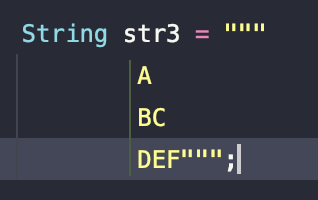

> 해당 블로그 글은 [태현님의 인프런 강의](https://inf.run/SjyDc)를 바탕으로 쓰여진 글입니다.

## 자바 12의 등장, preview 기능의 탄생과 Text Block

자바12부터 자바17까지는 이전 업데이트에 비해 언어적 기능이 상당 부분 추가되었고, 그 밑바탕에는 자바 12에서 등장한 **preview feature**라는 개념이 존재했다. 그렇다면 이 **preview feature**란 개념은 무엇이고, 이와 비슷한 **experimental, incubating**은 무엇인지 간단하게 표로 살펴보자.

<table style="width: 100%; border-collapse: collapse; font-family: -apple-system, BlinkMacSystemFont, 'Segoe UI', Roboto, Arial, sans-serif; box-shadow: 0 2px 10px rgba(0, 0, 0, 0.1);">
    <thead>
        <tr style="background-color: #4a90e2; color: white;">
            <th style="padding: 16px; text-align: left; font-weight: 600; border: 1px solid #3a7bc8;"></th>
            <th style="padding: 16px; text-align: left; font-weight: 600; border: 1px solid #3a7bc8;">preview</th>
            <th style="padding: 16px; text-align: left; font-weight: 600; border: 1px solid #3a7bc8;">experimental</th>
            <th style="padding: 16px; text-align: left; font-weight: 600; border: 1px solid #3a7bc8;">incubating</th>
        </tr>
    </thead>
    <tbody>
        <tr style="background-color: white; color: black;">
            <td style="padding: 14px 16px; border: 1px solid #e0e0e0; font-weight: 600;">적용 대상</td>
            <td style="padding: 14px 16px; border: 1px solid #e0e0e0;">언어적 기능, JVM</td>
            <td style="padding: 14px 16px; border: 1px solid #e0e0e0;">JVM</td>
            <td style="padding: 14px 16px; border: 1px solid #e0e0e0;">라이브러리 (API)</td>
        </tr>
        <tr style="background-color: #f8f9fa; color: black;">
            <td style="padding: 14px 16px; border: 1px solid #e0e0e0; font-weight: 600;">완성도</td>
            <td style="padding: 14px 16px; border: 1px solid #e0e0e0;">95%</td>
            <td style="padding: 14px 16px; border: 1px solid #e0e0e0;">25%</td>
            <td style="padding: 14px 16px; border: 1px solid #e0e0e0;">-</td>
        </tr>
        <tr style="background-color: white; color: black;">
            <td style="padding: 14px 16px; border: 1px solid #e0e0e0; font-weight: 600;">사용 방법</td>
            <td style="padding: 14px 16px; border: 1px solid #e0e0e0;"><code style="background-color: #f1f3f5; padding: 3px 8px; border-radius: 4px; font-family: Consolas, Monaco, monospace; color: #d63384;">--enable-preview</code></td>
            <td style="padding: 14px 16px; border: 1px solid #e0e0e0;">기능별 플래그</td>
            <td style="padding: 14px 16px; border: 1px solid #e0e0e0;">모듈 의존성 설정</td>
        </tr>
    </tbody>
</table>

또한, preview feature로 공개된 기능이 정식으로 포함되는 기간은 보통 두 단계 버전, 그러니까 1년 정도가 소요된다. 예를 들어 지금 살펴볼 Text Block이라는 새로운 문법은 자바 13 버전에서 preview feature로 소개되었고, 1년 후인 자바 15 버전에서 정식 기능으로 출시되었다.

그러면 본격적으로 Text Block에 대해 살펴보자.

기존에는 우리가 아래와 같이 하나의 문자열 안에서 개행을 하고 싶을 때 아래와 같이 작성할 수 있었다.

``` java
String str1 = "A\nBC\nDEF";

String str2 = "A\n" +
              "BC\n" +
              "DEF";
```

하지만 이러다 보니 문자열 자체에 `\n`도 넣어줘야 하고 상당히 조금 복잡해지는 것을 볼 수 있었다. 그래서 자바에서는 이 어려움을 해소하고자 아래와 같이 `"""`로 Text Block을 제공해주었다.

``` java
String str3 = """
                A
                BC
                DEF""";
```

만약, DEF 뒤에 한 줄 더 줄바꿈을 하고 싶다면, 닫히는 `"""`를 한 줄 내리면 된다.

하지만 Text Block을 사용할 때는 몇 가지 알아둬야 할 특징이 있다.

- Text Block을 시작하는 `"""` 다음에는 문자가 들어올 수 없다.
  - 따라서 Text Block은 한 줄로 적을 수 없다. 코드 한 줄로 문자열을 만들고 싶다면, 기존 방식을 사용해야 한다.
- 만약 Text Block 내부에 `"` 를 쓰고 싶다면, `escape \"` 를 사용해도 되지만, 단순히 `'`만 적어도 충분하다. 이는 작음 따옴표 (`’`)도 마찬 가지이다. `\t` 같은 다른 이스케이프 문자는 잘 동작한다.
- Text Block에 존재하는 각 줄의 뒷줄 공백은 없는 것으로 간주하여, 자바 컴파일러가 제거해 버린다.
- Text Block을 사용하면서 각 줄의 문자 뒤 공백을 만들기 위해서는 다음 방법들 중 하나를 사용 해야 한다.

``` java
// 방법 1. replace 사용하기
String str = """
    A$$
    BC$
    DEF
    """.replace('$', ' ');
// 방법 2. fence 사용하기
String str = """
    A |
    BC |
    DEF|
    """.replace("|\n", "\n");
// 방법 3. octal escape sequence 사용하기
String str = """
    A\040\040\040
    BC\040\040
    DEF
    """;
// 방법 4. Text Block에 존재하는 특별한 escape sequence 사용하기
String str = """
    A \s
    BC\s
    DEF
    """;
```

Text Block과 함께 새로 생긴 `\s`는 escape sequence로 공백 하나를 의미한다! `\s`를 사용하면 그 뒤에 있는 공백까지 유지되기 때문에 두개의 공백을 표현하기 위해 `\s`를 작성해 주었다.

- 만약 한 줄로 된 긴 문자열을 작성하고 싶다면, 줄을 바꾸지 않는다는 의미인 Text Block의 특별한 esacpe sequence, `\`를 사용할 수 있다. `\`는 줄바꿈을 없애준다는 의미에서 line-terminator라고도 부른다.

``` java
String str = """
    A \
    BC \
    DEF
    """;
// String str = "A BC DEF\n"; 와 동일하다
```

Text Block을 IntelliJ와 같은 IDE에서 잘 보면, 세로 선이 보일 수 있다. 이 세로 선은 Text Block 결과의 “들여 쓰기 기준선”이다. 들여쓰기의 기준선은, Text Block 안에 문자들, 그리고 닫히는 `"""` 중 가장 왼쪽에 있는 것을 기준으로 한다.



> ⚠️ 주의
>
> 이때 한 가지 주의할 점은 가장 왼쪽에 있는 줄을 판단할 때, 들여 쓰기가 공백으로 구성되어 있건 탭으로 구성되어 있건 한 칸으로 간주한다는 점이다. 따라서 Text Block을 사용할 때는 들여쓰기에 대한 문자를 통일해서 코딩하는 것이 좋다!

## Switch Expression과 instanceof Pattern Matching

이번 시간에는 switch expression과 instanceof pattern matching에 대해 알아보자.

### Switch Expression

우리가 기존에 작성했던 switch문을 생각해보자. 아마 이런식으로 작성하지 않았을까?

``` java
private String calculateTestGrade(int score) {
  String grade = "";
  switch (score) {
    case 5:
      grade = "A";
      break;
    case 4:
    case 3:
      grade = "B";
      break;
    case 2:
    case 1:
      grade = "C";
      break;
    default:
      grade = "F";
  }
  return grade;
}
```

실무에서는 `switch`문이 `if - else if`문에 비해 길고, 가독성도 좋지 않기 때문에 잘 사용하지 않는다고 한다. 하지만 `switch expression`의 등장으로 실무에 영향을 끼치기도 한다. 그럼 **swtich expression**을 알아보기 전에 **expression** 용어에 대해 살펴보자.

**expression**과 연관되는 용어가 하나 있는데 바로 **statement**이다. statement란, 어떠한 프로그래밍 문장을 의미한다. 우리가 흔히 이야기하는 조건문에서 “문”이 바로 statement라는 의미이다. 또한 단순히 `System.out.println("Hello World");`같은 코드도 statement이다.

다음으로 expression (한국어 : 식)이란, 프로그래밍 문장이긴 한데 어떠한 결괏값이 정해지는 문장을 의미한다. 예를 들어 3+5 는 8이라는 계산된 결괏값이 나온다. 또한 자바에 있는 삼항 연산자 역시 명확한 결괏값이 나오게 된다. 하지만 `if-else`문 같은 경우는 명확한 값이 나오지를 않는다. 왜냐하면 조건문이기 때문이다. 즉 크게 보면 expression은 statement의 부분집합으로 볼 수 있을 것이다.

그럼 이제 용어는 이 정도로 정리하고 본격적으로 **switch expression**에 대해 들어가보자. 자바 12에서 preview feature로 추가되었고, 자바 14에서 정식 기능으로 출시된 switch expression은 말 그대로 **기존에 statement였던 switch 문을 expression으로 사용할수 있게 강화된 기능이다.** 바로 아래와 같이 말이다.

``` java
package org.api.lect09;

public class Main {
    private String calculateTestGrade(int score) {
        return switch (score) {
            case 5 -> {
                System.out.println("만접입니다!");
                yield "A";
            }
            case 4, 3 -> throw new IllegalArgumentException();
            case 2, 1 -> "C";
            default -> "F";
        };
    }
}
```

기존의 `switch`문에는 문제점이 있었다.

- statement이다. 기존의 switch문은 statement이기 때문에 switch문에 쓰이는 변수 값을 미리 선언을 한 뒤에 사용이 가능했다. 이 점이 매우 불편했다.
- 조건에 따른 분기 처리를 위해 `case 값:`을 사용했다. 또한 한 분기가 끝나면, `break;`를 사용해 switch case문을 탈출시켜야 한다.
- 또한 조건이 같을 경우 `case 값:`을 연달아 작성해줘야 했다.

하지만 **switch expression**은 위의 문제를 개선하였다.

- expression으로 개선되었다. `switch () { }` 전체가 따라서 가장 뒤에 `;`이 붙게 되었다.
- `case 값:`을 동일하게 사용했지만, `break`를 사용하지 않았다. 대신, `yield`라는 새로운 키워드를 통해 라벨에 따라 switch expression이 반환할 값을 지정해 주었다.
- 여러 라벨을 한 번에 처리하기 위해 `case 4, 3:`과 같은 식으로 사용할 수 있게 되었다.

추가적으로, switch expression에서만 쓸 수 있는 새로운 방식의 라벨이 존재한다. 바로 **arrow case label**이다. 기존의 **colon case label**은 `yield` 키워드를 반드시 사용해야 했지만, **arrow case label**을 쓰면, 굳이 `yield`를 쓰지 않고도 반환 값을 지정할 수 있다.

만약 **arrow case label**에서 값을 바로 반환하지 않고, 여러 줄에 걸쳐 값을 반환해야 한다면 `->` 뒤에 `{ }` 을 쓸 수 있고, 이때는 `yield` 키워드를 명시적으로 작성해 주어야 한다. 마치 람다식과 유사한 것 같다.

여기서 한 가지 중요한 사실은 switch expression의 최종 결과 어져야 한다는 것이다. 만약, case마다 반환값이 없는 경우가 존재한다면 컴파일 오류가 발생한다. 물론 반환 값 대신에 예외를 던지는 것은 가능하다.

추가적으로 switch expression과 Enum class를 함께 활용하면 시너지 효과를 받을 수 있다. Enum class는 컴파일 타임 때 enum 타입의 종류를 미리 알 수 있고, 따라서 굳이 default 키워드를 사용하지 않더라도 모든 enum 타입이 switch 라벨에 포함되면 컴파일 에러 없이 코드를 작성할 수 있다.

### instanceof pattern matching

다음으로 자바 14에 preview feature로 등장해, 자바16에 공식 기능이 된 **instanceof pattern matching**에 대해 살펴보자.

기존 `instanceof`는 아래와 같이 사용했을 것이다.

``` java
// Animal은 최상위 클래스이다.
// Animal의 하위 클래스로 Dog, Cat이 있다.
public String sound(Animal animal) {
  if (animal instanceof Dog) {
    Dog dog = (Dog) animal;
    return dog.bark();
  } else if (animal instanceof Cat) {
    Cat cat = (Cat) animal;
    return cat.purr();
  }
  throw new IllegalArgumentException("다른 경우의 수는 존재하지 않습니다!");
}
```

기존 `instanceof`는 어떤 상위 타입을 매개 변수로 받아서 하위타입에 따른 분기처리를 할 때 사용한다. 그래서 조건식에 `instanceof`를 사용하여 판단하여 참인 경우 조건식 본문에 하위타입으로 형변환을 한 다음에 로직을 작성해야 했다. 그런데 이 부분은 매번 형변환을 해줘야 하니 매우 불편하다는 생각이 든다. 그래서 instanceof pattern matching은 아래와 같이 형변환을 생략하고 작성할 수 있다.

``` java
public String sound(Animal animal) {
    if (animal instanceof Dog dog) {
        return dog.bark();
    } else if (animal instanceof Cat cat) {
        return cat.purr();
    }

    throw new IllegalArgumentException("다른 경우의 수는 존재하지 않습니다.");
}
```

instanceof pattern matching을 사용해 하위 타입을 확인하고 형 변환을 해 변수에 할당한다. 그리고 할당된 하위 타입 변수의 멤버에 접근한다. 즉, 개발자 입장에서는 매우 편리해진 것이다.

그러면 instanceof pattern matching을 사용해 만들어진 변수의 범위는 어떻게 될까? 아래의 코드는 정상적으로 실행이 될까?

``` java
public String soundIfDog(Animal animal) {
  if (!(animal instanceof Dog dog)) {
    return "강아지가 아닙니다!";
  }
  return dog.bark(); // dog를 사용할 수 있다?!!
}
```

보통 우리가 변수의 scope를 생각할 때 dog 변수는 if문 조건 식에 있으므로 if문 블록까지라고 생각할 수 있다. 하지만 위의 코드는 정상적으로 실행이 가능하다. 왜냐하면 **if문을 통해 animal 이 Dog가 아닌 경우는 모두 return 되었으니, if 문 아래에서 조건 Dog 타입이라고 확신할 수 있는 것이다.** 그러면 만약 아래와 같이 조건식에서 `return`을 안 하는 구조라면 하위 dog가 Cat타입이 될수도 있고 다른 하위타입이 될 수 있기에 컴파일 타임에 예외가 발생한다.

``` java
public String soundIfDog(Animal animal) {
  if (!(animal instanceof Dog dog)) {
    // return 대신 출력을 했다.
    System.out.println("강아지가 아닙니다!");
  }
  return dog.bark(); // 컴파일 에러 - dog 변수를 찾을 수 없음
}
```

이런 패턴을 바로 **pattern matching**이라고 하는 것이다. 그러면 이것을 응용하면 아래와 같이 작성도 가능하다.

``` java
if ((animal instanceof Dog dog) && dog.bark() != null) {
}
```

물론 위의 조건문에서 `&&`연산자 대신에 `||`연산자를 사용하면 아까와 같은 이유로 컴파일 에러가 발생한다.

결론적으로 instanceof pattern matching은 instanceof를 사용해 변수의 타입을 확인하고, 원하는 타입이 맞다면, 특정 변수에 값을 바로 할당해 주는 기능이라 할 수 있다. 이를 조금 더 일반화하면 어떤 조건을 확인하고 조건이 true라면 특정 변수에 값을 바로 할당하는 기능이다.

## Record class와 Sealed class

record class와 sealed class에 대해 알아보자.

### Record Class

우리가 웹 어플리케이션을 만들 때 데이터를 요청하거나 응답을 받을때 데이터 전달 객체를 만들곤 한다. 이것을 우리는 **DTO**라고 부른다. DTO를 만들때 우리는 아마 아래와 같이 개발을 할 것이다.

``` java
package org.api.lect10;

import java.time.LocalDate;
import java.util.Objects;

public final class FruitDto {

    private final String name;

    private final int price;

    private final LocalDate date;

    public FruitDto(String name, int price, LocalDate date) {
        this.name = name;
        this.price = price;
        this.date = date;
    }

    public String name() {
        return name;
    }

    public int price() {
        return price;
    }

    public LocalDate date() {
        return date;
    }

    @Override
    public boolean equals(Object object) {
        if (object == null || getClass() != object.getClass()) return false;
        FruitDto fruitDto = (FruitDto) object;
        return price == fruitDto.price && Objects.equals(name, fruitDto.name) && Objects.equals(date, fruitDto.date);
    }

    @Override
    public int hashCode() {
        return Objects.hash(name, price, date);
    }

    @Override
    public String toString() {
        return "FruitDto{" +
                "name='" + name + '\'' +
                ", price=" + price +
                ", date=" + date +
                '}';
    }
}
```

DTO는 일반적으로 상속이 되면 안되기에 `final class`로 만들어 두고 데이터의 변경이나 조작이 되서는 안되기에 각 필드를 `final`로 두고 `getter`만 만들어 두었다. 보통은 실무에서 DTO를 만드는데 그 과정에서 IDE의 자동 생성 도움을 받을 수도 있고, lombok 어노테이션을 사용할 수도 있지만, 자바 언어에서 근본적으로 데이터 전달 전용 클래스가 존재하지는 않았다.

이런 점을 자바가 알아서 이런 데이터 전달 전용 클래스를 하나의 문법으로 만들어 두었는데 그것이 바로 `record class`이다. 위의 DTO를 record로 변경하면 아래와 같이 변경이 가능하다.

``` java
package org.api.lect10;

import java.time.LocalDate;

public record FruitDtoV2(
        String name,

        int price,

        LocalDate date
) {
}
```

이 record class는 `{`으로 시작하는 일반 클래스와 다르게 `(`으로 시작하고, `(` 안에 record class가 관리할 필드를 적을 수 있다. 이 데이터 하나하나를 컴포넌트라 부른다. 그리고 위의 record class는 이전에 만든 final class와 완전 동일한 클래스이다.

- 다른 클래스가 FruitDtoV2를 상속받을 수 없고
- FruitDtoV2에 선언한 세가지 컴포넌트에 대해 private final 필드가 자동 생성되며,
- name , price , date를 받아 필드에 값을 할당하는 생성자도 자동으로 만들어지고,
- 세 필드에 접근할 수 있는 접근자도 `name()`,`price()`,`date()`로 자동 생성되며,
- `equals()`,`hashCode()`,`toString()` 역시 자동으로 만들어진다.

그럼 record class의 특징들을 살펴보자.

- `java.lang.Enum` 클래스를 자동으로 상속하기 때문에 다른 클래스를 상속할 수 없는 enum class와 유사하게, record class 역시 `java lang.Record` 클래스를 자동으로 상속받고 있고, 따라서 다른 클래스를 상속받을 수 없다.
- 제네릭 클래스로 만들 수도 있으며, 클래스 내부에 추가적인 인스턴스 메소드도 만들 수 있고, static 필드나 static 메소드도 넣을 수 있다.

그러면 메서드나 static 필드를 만드는 과정을 살펴보자. 바로 아래와 같이 작성이 가능할 것이다.

``` java
package org.api.lect10;

import java.time.LocalDate;

public record FruitDtoV2(
        String name,

        @MyAnnotation
        int price,

        LocalDate date
) {

    private static final double DISCOUNT_RATE = 0.3;

    public int getDiscountPrice() {
        return (int) (price * (1.0 - DISCOUNT_RATE));
    }
}
```

당연하겠지만 record class가 자동으로 만들어주는 메서드들도 재정의가 가능하다.

``` java
package org.api.lect10;

import java.time.LocalDate;

public record FruitDtoV2(
        String name,

        int price,

        LocalDate date
) {

    private static final double DISCOUNT_RATE = 0.3;

    public int getDiscountPrice() {
        return (int) (price * (1.0 - DISCOUNT_RATE));
    }

    public FruitDtoV2(String name, int price, LocalDate date) {
        System.out.println("생성자 호출!");
        this.name = name;
        this.price = price;
        this.date = date;
    }

    @Override
    public String name() {
        return "[재정의] " + name;
    }
}
```

이때 필드 값을 검증해야 한다면, 굳이 일반적인 생성자를 재정의하지 않고, **compact constructor**를 활용할 수도 있다. compact constructor는 일반적인 생성자와 동일하게 생겼지만, 매개변수를 받는 ( ) 자체가 없다. 또한, compact constructor만 사용해도 일반 생성자를 똑같이 쓸 수 있다. 자바 문법을 최소화하며 생성자 안에 로직만 넣는 셈이다.

``` java
package org.api.lect10;

import java.time.LocalDate;

public record FruitDtoV2(
        String name,

        @MyAnnotation
        int price,

        LocalDate date
) {

    private static final double DISCOUNT_RATE = 0.3;

    public int getDiscountPrice() {
        return (int) (price * (1.0 - DISCOUNT_RATE));
    }

    public FruitDtoV2 {
        System.out.println("생성자 호출!");

        if (price < 0) {
            price = 0;
//            throw new IllegalArgumentException("과일의 가격은 양수입니다!");
        }
    }

    @Override
    public String name() {
        return "[재정의] " + name;
    }
}
```

record class의 component에는 어노테이션을 붙일 수도 있다. 다만, 아래와 같은 규칙이 존재한다.

- component는 클래스 안에 있는 필드이자, 생성자의 매개변수이자, 필드에 접근하는 메서드이기에 어노테이션을 붙이면 해당 필드, 생성자 매개변수, 메서드에 다 붙는다.
- 만약 특정한 곳에 붙이고 싶다면 어노테이션에 메타 어노테이션인 `@Target`을 붙여서 위치를 지정해주면 record class는 해당 부분에만 붙여준다.

record class는 실제 실무에서 웹 어플리케이션 개발에도 많이 쓰인다. 만약 스프링 프레임워크를 사용한다면, jackson 2.12.0 (= Spring Boot 2.5.x) 버전부터 record 클래스를 `@Controller`와 쉽게 혼용해 쓸 수 있다.

### sealed class

자바17부터 정식 기능으로 등록된 **sealed class**는 상속받을 수 있는 클래스 유형을 지정할 수 있다. 만약 아래와 같은 상속구조로 되어 있는 클래스들이 있다고 해보자.

``` java
public abstract class Animal {
}
```

``` java
class Dog extends Animal {
  public String bark() {
    return "강아지는 멍멍";
  }
}
```

``` java
class Cat extends Animal {
  public String purr() {
    return "고양이는 골골";
  }
}
```

그런데 만약 `Animal` 클래스를 `Dog`와 `Cat`에게만 상속 시키고 나머지는 시키지 않고 싶을 때가 있을 것이다. 라이브러리나 프레임워크를 만드는 개발자 입장에서 충분히 고민할 법한 문제이다. 내가 개발한 어떤 클래스를 제3자가 상속해서 사용한다면, 하위 호환성에 대한 문제가 생길 수 있기 때문이다.

여기서 등장한 클래스가 바로 sealed class이다. 위 예제에 sealed class를 사용하기 위해서는 두 가지 변화가 필요하다.

- 부모 클래스의 변화
  - 부모 클래스는 class 앞에 `sealed`를 써주어야 한다. 그리고 클래스 이름 뒤에 `permits`를 이용해 어떤 클래스를 하위 클래스로 제한할 것인지 확실히 적어주어야 한다.
- 자식 클래스의 변화
  - 자식 클래스도 class 앞에 추가적인 지시어가 붙어야 한다. 종류는 총 3가지가 존재한다.
  - `final` : 이 자식 클래스를 한 번 더 상속할 수 없다.
  - `sealed` : 이 자식 클래스 자체를 sealed class로 사용할 수 있다. 부모 - 자식 - 손자까지 이어지는 셈이다.
  - `non-sealed` : 이 자식 클래스는 한 번 더 상속될 수 있다. 즉 우리가 명시한 봉인이 깨지게 된다.

그러면 한번 위의 예제를 sealed class로 변경해보자.

``` java
package org.api.lect10;

public sealed abstract class Animal permits Dog, Cat {
}
```

``` java
package org.api.lect10;

public final class Dog extends Animal {

    public String bark() {
        return "강아지는 멍멍!";
    }
}
```

``` java
package org.api.lect10;

public non-sealed class Cat extends Animal {

    public String purr() {
        return "고양이는 골골~";
    }
}
```

또한 sealed class를 사용할 때는 자식 클래스의 물리적인 위치도 제한된다.

- 만약 `module-info.java`를 사용하는 `named module`에 부모 클래스가 있다면, 자식 클래스는 부모 클래스와 같은 모듈에 있어야 하고,
- `module-info.java`를 사용하지 않는 `unnamed module`에 부모 클래스가 있다면, 자식 클래스는 부모 클래스와 같은 패키지에 있어야 한다.
- 또한, 한 파일에 부모 클래스와 자식 클래스가 모두 있다면, 같은 파일에 있는 클래스만 자식 클래스로 자동 허용되며, `permits`를 생략할 수 있다.

그렇다면 이런 sealed class의 장점은 무엇일까?

- 상위 클래스를 설계할 때 호환성 걱정을 덜 수 있다.
- 컴파일 타임 때 경우의 수를 명확히 알 수 있기에, enum class처럼 sealed class를 switch에서 사용할 수 있게 된다. 코드가 매우 깔끔해지는 것이다!

sealed class와 개념적으로 동일한 sealed interface 역시 존재한다. 사용법은 sealed class와 같으며, record class는 interface를 구현할 수 있기 때문에 sealed interface + record class 조합이 가능하다는 것 정도만 알아두자. 이 조합은 DTO에 대한 위계를 설정해야 할 때 용이하다.

## 자바 12부터 자바17까지의 주요 업데이트

### String 클래스 / Files 클래스 API

``` java
String str = """
                A
                BC
                DEF
                """.indent(3);
```

자바 12에서 추가된 `indent()` 함수이다. indent() 함수는 숫자를 받아, 문자열의 각 줄마다 공백(스페이스바) 들여 쓰기를 해준다. 특이한 점으로는 indent() 함수에 음수를 넣을 경우, 문자열 왼쪽에 존재하는 공백을 제거해 준다는 것이다. 예를 들어 -1을 매개변수로 넣으면 공백을 ‘한 칸’ 제거해 준다.

``` java
String str = " A\n B\n C";
System.out.println(str.stripIndent());
```

자바 15에서 추가된 `stripIndent()`가 있다. 이 함수는 우리가 Text Block에서 살펴 보았던 “왼쪽으로 붙여쓰기” 로직을 실행해 주는 함수이다. 예를 들어 `(공백)A\n(공백)(공백)B\n(공백)C`과 같은 문자열이 있다면, 이 문자열을 왼쪽으로 최대한 붙여 `A\n(공백)B\nC`를 만들어 준다.

``` java
String str = """
                제 이름은 %s 이고
                나이는 %s 입니다.
             """.formatted("홍길동", 40);
```

자바 15에서 추가된 `formatted()` 함수가 있다. 이 함수는 `String.format()`과 동일한 기능을 하는 함수로, static 메소드인 String.format()과 달리, instance 메소드 라는 점이 특징이다. formatted()와 Text Block을 함께 사용하면 조금 더 깔끔한 문자열 템플릿 처리가 가능하다!

``` java
var file1 = Paths.get("./a.txt");
var file2 = Paths.get("./b.txt");
long result = Files.mismatch(file1, file2);
```

Files 클래스에도 간단한 기능이 하나 추가되었다. 서로 다른 두 파일의 내용물을 비교할 때, 파일의 내용물이 같은지 다른지를 쉽게 확인할 수 있게 되었다. 자바 12에서 추가된 `mismatch()` 메소드는 파일의 내용이 다르다면, 첫 번째로 다르다고 판단된 부분의 index를 반환하게 되고, 파일의 내용이 동일하다면 -1을 반환하된다.

### Collectors 클래스 / Stream 클래스 API

Collectors 클래스와 Stream 인터페이스에도 변화가 있었다. 먼저 Collectors 클래스에는 자바 12에서 `teeing()`이라는 함수가 추가되었다. teeing() 함수를 한 문장으로 표현하면, 두 개의 Collector를 받아 합치는 함수이다.

``` java
List<FruitDto> fruits = List.of(
  new FruitDto("사과", 100, LocalDate.of(2025, 6, 7)),
  new FruitDto("바나나", 200, LocalDate.of(2025, 6, 7)),
  new FruitDto("사과", 300, LocalDate.of(2025, 6, 7)),
  new FruitDto("수박", 500, LocalDate.of(2025, 6, 7))
);

Integer result = fruits.stream()
        .collect(Collectors.teeing(
                Collectors.minBy(Comparator.comparingInt(FruitDto::price)),
                Collectors.maxBy(Comparator.comparingInt(FruitDto::price)),
                (f1, f2) -> {
                    f1.ifPresent(f -> System.out.printf("가장 싼 과일은 %s입니다.\n", f.name()));
                    f2.ifPresent(f -> System.out.printf("가장 비싼 과일은 %s입니다.\n", f.name()));

                    return 0;
                }
        ));
```

과일 데이터 중에 가장 비싼 과일과 싼 과일을 동시에 찾으려고 하는 경우 물론 필터를 여러번 하거나 이중 반복을 통해 찾을수도 있겠지만 위와같이 사용이 가능하다. `teeing` 메서드의 첫번째 인자로 첫번째로 찾으려는 컬렉터를 작성하고 두번째 인자로 두번째로 찾을 컬렉터를 넣어준 후, 세번째 인자로 실행 로직을 작성해준 후, 반환값을 해준다. 즉, teeing 메서드는 아래와 같은 인자를 받을 수 있는 것이다.

- 첫 번째 Collector
- 두 번째 Collector
- 첫 번째 Collector 결과와 두 번째 Collector 결과를 매개변수로 받는 `BiFunction`

``` java
List<List<Number>> nums = List.of(List.of(1.0, 2.0), List.of(3, 4, 5));

List<Double> r = nums.stream()
    .<Double>mapMulti((numberList, consumer) -> {
        for (Number num : numberList) {
            if (num instanceof Double) {
                consumer.accept((double) num);
            }
        }
    })
    .toList();
```

이어서 Stream 인터페이스에 추가된 `mapMulti`를 살펴보자. 자바16에서 추가된 mapMulti 메서드는 `flatMap()`을 조금 더 효율적으로 쓸 수 있고 동시에, filter 연산이나 map 연산도 할 수 있는 함수이다. 우리가 자주 사용하는 중간 연산자인 `flatMap`, `filter`, `map`등을 합쳐놓은 느낌이다.

mapMulti은 매개변수가 두 개인 `BiFunction`을 사용하고 있는데, `BiFunction`의 첫 번째 매개변수에는 스트림의 원소가 들어가고, 두 번째 매개변수에는 다음 스트림에 전달할 데이터를 처리하는 `Consumer`가 들어간다.

기존 코드와의 차이를 보면, 이전 코드에 비해 코드가 약간 길어지고, 반환 타입을 명시적으로 `<Double>`이라고 지정해 주었다. 또한, 필터링, 매핑 같은 코드가 선언형(declarative) 스타일에서 명령형(imperative) 스타일로 변경되었으며, `List.of(3, 4, 5)`에 대해서는 consumer 자체가 호출되지 않기 때문에 불필요한 Stream이 생성되지 않는다. 결론적으로 mapMulti는 명령형 스타일로 코드를 작성하는 것이 유리하거나, flatMap 을 할 때 비어 있는 Stream 생성의 overhead를 줄이고 싶다면 사용해 볼 수 있는 기능이다.

Stream 에는 toList() 함수도 추가되었다. 이 함수 역시 자바 16에서 추가되었으며, 매우 간단한 기능을 갖고 있는데, 우리가 이전 버전에 `collect(Collectors.toUnmodifiableList())`라고 작성했던 스트림 종결 연산을 `toList()`로 대체할 수 있도록 해준다.

### 새로운 랜덤 API

기존 랜덤 API는 아래와 같이 작성했을 것이다.

``` java
Random random = new Random();
random.nextInt(10); // 0부터 ~ 9사이의 정수 생성!
```

이런 `Random` 클래스는 일반적인 경우에 많이 사용되고, 멀티 스레드 환경에서는 `ThreadLocalRandom`, 조금 더 암호학적인 난수가 필요하다면 `SecureRandom`을 사용했다.

이 구조에서 한 가지 아쉬운 점은 `Random`이라는 타입이 클래스라는 것이다. Random이 인터페이스였다면, 구현체를 적절히 갈아 끼우기 좋았겠지만, Random은 클래스이기 때문에 이 클래스 구현에 랜덤 생성 코드가 종속되어 버린다.

그래서 자바는 17부터 Random 클래스의 상위 인터페이스를 만들고, 몇몇 알고리즘을 이용해 추가적인 랜덤 생성기 구현체도 추가되었다. 이렇게 추가된 구현체들은 thread-safe 하지는 않아 멀티스레드 환경에서 사용하기는 애매하지만, 기존의 Random 클래스보다 더 나은 성능을 보인다.

한 다양한 구현체들에 대한 `RandomGeneratorFactory` 클래스도 추가되었다. `RandomGeneratorFactory`의 `all()` static method를 사용하면 현재 존재하는 구현체를 모두 가져올 수 있고, `getDefault()`를 사용해 기본 구현체를 가져올 수도 있다. 자바 21 기준으로 기본 구현체는 `L32X64MixRandom`이지만 추후 변경될 수 있다.

``` java
RandomGeneratorFactory.all()
                .forEach(f -> System.out.println(f.name()));

System.out.println("기본값: " + RandomGeneratorFactory.getDefault());
```

### 추가적으로 알아두면 좋은 변화들

- Helpful NullPointerException
  - 자바 14에서 소개되고, 자바 15에서 기본 적용된 Helpful NullPointerException은 NPE가 발생했을 때 정확히 어느 지점에서 에러가 발생했는지 보다 알기 쉽게 표시해 준다.
- 변경된 LTS 주기
  - 자바 17부터는 LTS 주기가 3년에서 2년으로 변경되었다.
- 새로운 패키징 툴
  - 자바 16에서 jpackage 라는 새로운 도구가 출시되었다. 이 도구를 사용하면, 우리가 흔히 Mac OS에서 `.dmg` 파일로 애플리케이션을 설치하거나, Windows에서 `.exe`로 애플리케이션을 설치하는 것처럼 jar 파일을 고객의 컴퓨터에서 설치할 수 있도록 변환해 준다. 심지어 이 변환 과정에서 필요한 java SE module 자체도 들어가기 때문에 고객은 굳이 자바를 설치할 필요가 없어진다.
- 정식 기능이 된 ZGC
  - 자바 15에서 ZGC가 정식 가비지 컬렉터의 종류 중 하나가 되었다. 다만 여전히 기본 설정은 G1GC이기 때문에 ZGC를 사용하고 싶다면, `-XX:+UseZGC` 옵션을 사용해 주어야 한다.
- Socket API 재구현
  - 기존의 스레드보다 더 가벼운 스레드를 구성하기 위한 Project Loom의 요청으로 Socket API가 재구현되었다. Project Loom 자바 21에서 가상스레드 라는 이름으로 정식 출시되었다.

> 잘못된 지식이 있을 경우 댓글로 남겨주시면 빠르게 반영하겠습니다!