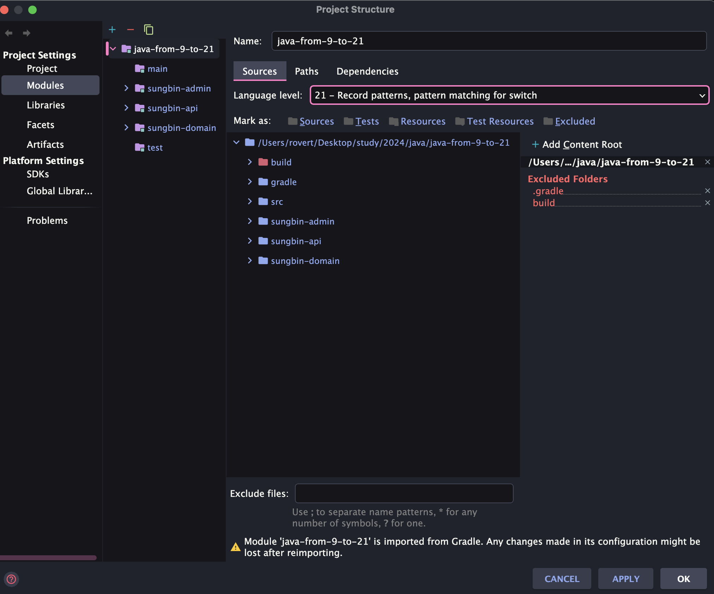
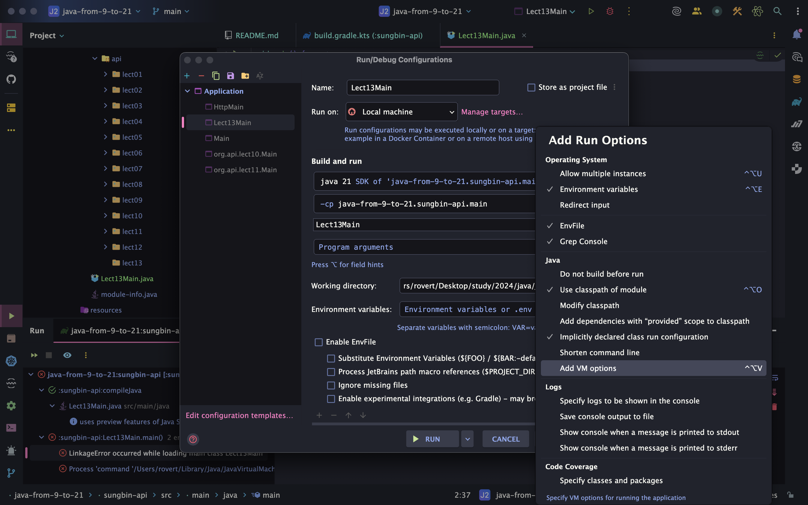
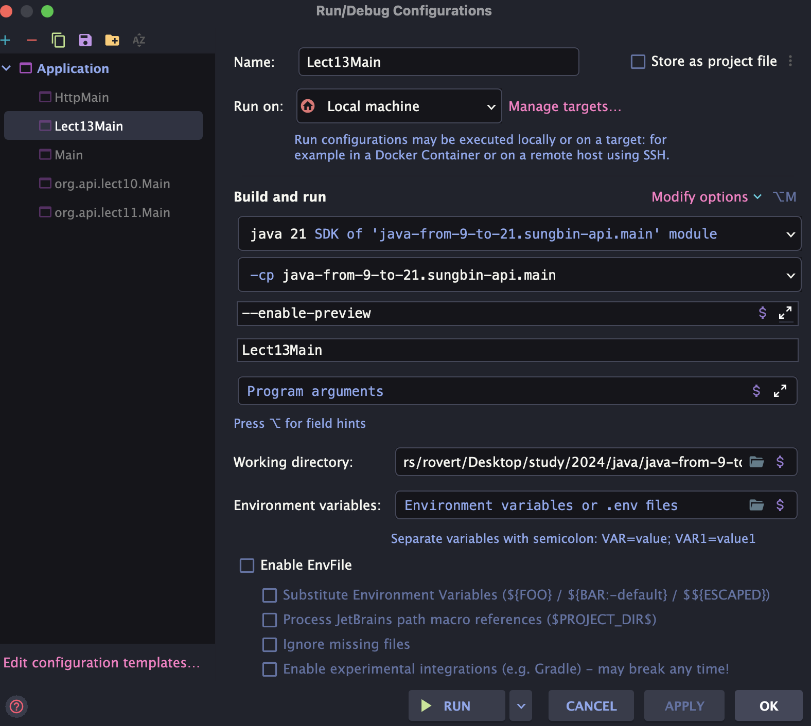

> 해당 블로그 글은 [태현님의 인프런 강의](https://inf.run/SjyDc)를 바탕으로 쓰여진 글입니다.

## record pattern과 switch pattern matching

### record pattern

**record pattern**은 **record class**를 **instanceof pattern matching**과 함께 사용할 때 내부 필드에 바로 접근할 수 있는 기능으로, 자바 19에서 preview feature, 자바 21에서 정식 기능으로 등록되었다. 한번 사용법을 코드로 살펴보자.

``` java
package org.api.lect12;

public class Main {
    public static void findDistanceIfPoint(Object object) {
        if (object instanceof Point p) {
            double diatance = Math.hypot(p.x, p.y);
            System.out.printf("원점으로부터 거리는 %.3f입니다.\n", diatance);
        }
    }

    record Point(int x, int y) {
    }
}
```

`findDistanceIfPoint` 메소드에 들어오는 `Object`가 `Point` 타입인 경우 `object` 변수를 바로 `p` 변수로 바꿔주는 instanceof pattern matching을 사용했다. 그 후, `p.x()`와 `p.y()`를 통해 원점으로부터의 거리를 계산했는데, 이렇게 record class의 변수에 한 번더 접근하는 것이 살짝 귀찮을 수 있다. 이럴 때 바로 record pattern을 사용할 수 있다!

``` java
public static void findDistanceIfPoint(Object object) {
  // Point p 대신 Point(double x, double y) 사용
  if (object instanceof Point(double x, double y)) {
    double distance = Math.hypot(x, y);
    System.out.printf("원점으로부터의 거리는 %.3f입니다.\n", distance);
  }
}
```

> ✅ 참고
>
> 해당 문법은 자바23으로 옮겨졌으니 주의 바란다.

### switch pattern matching

자바 17에서 preview feature로 등장했고, 자바 21에서 정식 기능으로 등록된 switch pattern matching은 이름에서도 유추할 수 있듯이, 스위치 식 혹은 스위치 문을 패턴 매칭과 함께 사용할 수 있는 기능이다. 이 기능이 등장하기 전까지는 스위치 선택자에 사용될 수 있는 변수의 형태가 제한적이었다. 아래 코드를 살펴보자.

``` java
private String calculateTestGrade(int score) {
  return switch (score) {
    case 5 -> "A";
    case 4, 3 -> "B";
    case 2, 1 -> "C";
    default -> "F";
  };
}
```

- 스위치 선택자: `switch ( )` - 안에 들어가는 변수는 반드시 char, byte, short, int, 문자열, Enum 중 한 타입이어야 한다. 즉, `Object`가 들어가거나 다른 객체 타입이 들어갈 수는 없다.
- case 뒤에 오는 값은 반드시 상수여야 한다.

이런 불편함으로 switch pattern matching에는 다음과 같은 규칙이 추가되었다.

- 스위치 선택자 안에는 char, byte, short, int와 더불어 그 어떤 reference type도 들어갈 수 있다. 이제 `Object`는 물론 다른 객체 타입이 들어갈 수 있게 된 것이다.
- `case` 뒤에는 패턴 매칭이 올 수 있게 되었다. `case Dog dog`와 같은 구문을 사용해 만약 들어온 객체 타입이 Dog 면, 변수 dog에 해당 값을 할당하는 것이다.

``` java
public String sound(Animal animal) {
  return switch (animal) {
    case Dog dog -> dog.bark();
    case Cat cat -> cat.purr();
    default -> throw new IllegalArgumentException("다른 경우의 수는 존재하지 않습니다!");
  };
}
```

심지어 Animal 클래스가 `sealed abstract class` 혹은 `sealed interface` 라면 하위 타입의 추론이 가능하기 때문에 default 라벨을 제거할 수도 있다.

``` java
public String sound(Animal animal) {
  return switch (animal) {
    case Dog dog -> dog.bark();
    case Cat cat -> cat.purr();
  };
}
```

여기서 끝이 아니다. 이제 case 라벨에서는 `when`절을 사용해 추가 조건을 확인할 수도 있다.

``` java
public String sound(Animal animal) {
  return switch (animal) {
    case Dog dog when dog.isQuite() -> "";
    case Dog dog -> dog.bark();
    case Cat cat -> cat.purr();
  };
}
```

이러한 매칭 순서로 인해 한 가지 주의할 점이 있다! 만약 위에 위치한 라벨이 아래 위치한 라벨을 완전히 막아 아래 위치한 라벨에 절대 도달할 수 없다면 에러가 발생하게 된다.

``` java
public String sound(Animal animal) {
  return switch (animal) {
    case Animal a -> ""; // 아래 case문 컴파일 에러
    case Dog dog when dog.isQuite() -> "";
    case Dog dog -> dog.bark();
    case Cat cat -> cat.purr();
  };
}
```

단, `when`절을 사용해 막는 경우는 컴파일 에러가 발생하지 않는다.

``` java
private String sound(Animal animal) {
    return switch (animal) {
        case Animal a when Math.random() >= 0 -> "";
        case Dog dog when dog.isQuite() -> "";
        case Dog dog -> dog.bark();
        case Cat cat -> cat.purr();
    };
}
```

이렇게 `switch`문에도 객체가 들어올 수 있게되어서 NPE가 발생하는 조건이 변경되게 되었다. 원래는 switch문의 선택자에 null이 들어오면 NPE가 발생하였지만 지금은 선택자에 null이 들어올때, case문에 null을 처리하는 분기가 없을 때 NPE가 발생한다. `case null`의 경우 `case default`와 함께 사용할 수 있다.

그럼 이제 sealed class와 switch pattern matching을 사용한 간단한 예제를 살펴보자. 만약 하나의 엔드 포인트에 고양이와 강아지 정보를 반환하는 api가 존재한다고 해보자. 강아지는 `ownerName`을 반환해야 하고 고양이는 `name`과 `age`를 반환받아야 한다고 해보자. 그럼 아마 아래와 같이 코드를 작성할 수 있을 것이다.

``` java
public sealed interface Animal permits Dog, Cat {
  AnimalType getType();
}
```

``` java
public final class Cat implements Animal {
  private String name;
  private int age;
  private AnimalType type;
  
  public String getName() {
    return name;
  }

  public int getAge() {
    return age;
  }

  @Override
  public AnimalType getType() {
    return type;
  }
}
```

``` java
public final class Cat implements Animal {
  private String ownerName;
  private AnimalType type;
  
  public String getOwnerName() {
    return ownerName;
  }

  @Override
  public AnimalType getType() {
    return type;
  }
}
```

도메인에 대한 DTO에는 sealed class와 record class를 함께 활용할 수 있다.

``` java
public sealed interface AnimalDto permits CatDto, DogDto {
  static AnimalDto of(Animal animal) {
    return switch (animal) {
      case Dog dog -> DogDto.of(dog);
      case Cat cat -> CatDto.of(cat);
    };
  }
}

public record CatDto(
  String name,
  int age
) implements AnimalDto {
  public static CatDto of(Cat cat) {
    return new CatDto(cat.getName(), cat.getAge());
  }
}

public record DogDto(
  String ownerName
) implements AnimalDto {
  public static DogDto of(Dog dog) {
    return new DogDto(dog.getOwnerName());
  }
}
```

그러면 서비스 로직은 아래와 같이 깔끔히 작성이 가능해진다.

``` java
package org.api.lect12;

public class AnimalService {

    public AnimalDto getInformation(AnimalType type, Long id) {
        Animal animal = new Dog();
        return AnimalDto.of(animal);
    }
}
```

## 자바 21에서 preview로 등장한 세 가지 문법

자바 21에서 등장한 세가지 preview feature를 살펴보려고 한다. 아직은 preview feature라서 프로덕션에 사용할 수는 없지만, 현재 가장 최신 버전에 등장한 기능이므로 하나씩 간단하게만 살펴보자!

먼저 살펴보기 전에 IDE의 세팅을 해줘야 한다.



먼저, `Project Structure -> Language Level`로 가서 위와 같이 JDK21 Preview를 설정해주어여 한다.

다음으로, 빌드 툴에 적절하게 `--enable-preview` 컴파일러 옵션을 추가해 주어야 한다.

``` kotlin
tasks.compileJava {
    options.compilerArgs.add("--enable-preview")
}
```

혹시나 설정 1, 설정 2를 진행한 후, preview feaure 기능이 포함된 클래스를 실행하려 했는데 에러가 발생한다면, Run/Debug Configuration에서 VM 옵션으로 `--enable-preview` 옵션을 추가해 보자.





### unnamed class

첫 번째 기능은 main 메소드가 간단해지는 기능이다. 우리가 알던 main 메서드는 아래와 같을 것이다.

``` java
public class Main {
  public static void main(String[] args) {

  }
}
```

하지만 JDK21 preview 버전에서는 아래와 같이 변경할 수 있다.

``` java
void main() {
  System.out.println("Hello World");
}
```

첫 번째 추가된 개념은 **unnamed package**이다. unnamed package는 패키지 위치를 표기하지 않으면, 해당 java 파일에 위치한 클래스는 unnamed package로 자동 편성된다. 하지만 이렇게 unnamed package에 들어 있는 클래스를 패키지가 표기된 **named package**에서 호출할 수는 없다.

두 번째로 unnamed class라는 개념도 추가되었다. 이름에서도 알 수 있듯이, public class 클래스이름 같은 클래스 선언 문법을 아예 작성하지 않은 경우 unnamed class로 간주된다. unnamed class는 반드시 unnamed package에만 있을 수 있고, unnamed class 안의 함수나 필드에는 다른 클래스가 접근할 수 없다. 사실상 애플리케이션의 시작 지점 (main 함수) 기능만 담당하는 셈으로 위의 코드가 바로 unnamed class 코드이다. 이런 unnamed class는 변수나 함수를 갖고 있을 수도 있다.

``` java
String greeting() { return "Hello, World!"; }
String greeting2 = "Hello, World!";

void main() {
  System.out.println(greeting()); // greeting2에도 접근 가능하다.
}
```

마지막으로 main 함수를 선언할 때 `String[] args` 매개변수를 굳이 넣지 않아도 되고 static 메서드일 필요가 없으며 `main` 함수 시그니처로 선언이 가능한 여러 경우가 생겼는데 우선순위는 다음과 같다.

- `static void main(String[] args)`
- `static void main()`
- `void main(String[] args)`
- `void main()`

### unnamed patterns, unnamed variable

다음으로는 unnamed patterns, unnamed variable이라는 preview feature에 대해 알아보은 코드에서 필요하지 않은 패턴 변수의 유형과 이름을 작성해야 하는 부담을 제거해준다. 바로 아래와 같이 말이다.

``` java
private static void findDistance(Object object) {
      if (object instanceof Line(Point(var x1, var _), Point(var x2, var _))) {

      }
}
```

이런 형태는 예시로 든 record pattern에서만 쓸 수 있는 것이 아니라, 지역 변수, for문, 람다, 파라미터, 예외 처리 등에서 다양하게 사용될 수 있다. 그런데 이 경우는 굳이 이럴 필요가 없을 것 같다. 만약 필요하지 않는 변수라면 그냥 오버라이딩을 하여 메서드를 만드는게 더 효율적일 것 같다는 생각이 든다.

### String Template

기존의 `String.format()`이나 `formatted()` 함수를 대체하는 String Template 기능은 문자열을 변수와 함께 손쉽게 렌더링 할 수 있도록 도와준다.

``` java
String name = "홍길동";
int age = 50;

String str = STR."이름: \{name} 나이: \{age}";
System.out.println(str);
```

- `\{ }` : embedded expression이라 부르고, 이 안에 그 어떤 expression이라도 넣을 수 있다. 단순히 변수여도 되고, 덧셈이나 뺄셈 같은 연산을 해도 되고, 함수 호출을 해도 된다.
- `STR` : 템플릿 안의 문자열과 embedded expression을 합칠 수 있도록 도와주는 template processor이다. 실제 코드를 보면, 자바 21에서 preview feature로 새로 생긴 `StringTemplate` 인터페이스의 `interpolate()` 함수를 호출하고 있다.

표준 라이브러리에서 제공되는 template processor는 `STR` 외에 두 가지가 더 존재한다. 첫번째는 바로 `FMT`이다.

``` java
double num = 1.333;
String str2 = FMT."숫자: %.2f\{num}";
System.out.println(str2);
```

`FMT`는 `STR`과 다르게 `%.2f` 혹은 `%8s`와 같은 포맷팅을 추가적으로 할 수 있다.

두 번째는 `RAW`라는 processor인데, `RAW`는 특이하게도 문자열을 바로 가공하지 않고, `StringTemplate` 클래스 자체를 반환한다. 우리는 이렇게 반환된 `StringTemplate`에 접근해서 문자열을 가공할 수도 있고, 우리가 작성한 순수한 문자열 부분과 embedded expression 부분을 분리할 수도 있다.

- `fragments()` : 우리가 작성한 순수한 문자열 부분을 List로 반환한다.
- `values()` : 우리가 넣으려는 변수를 가져온다.
- `interpolate()` : String Template을 가공한 문자열을 반환한다.

또한 StringTemplate 인터페이스를 구현 받아 우리만의 custom processor를 만들 수도 있다.

## 자바 18부터 자바 21까지의 라이브러리 주요 업데이트

### Math API 추가

Math 클래스에는 `clamp()`라는 함수가 추가되었다.

``` java
public static int clamp(long value, int min, int max)
```

- 만약 사이에 존재한다면, value를 반환하고,
- value가 min 보다 작으면 min을 반환,
- value가 max 보다 크면 max를 반환한다.

### String / StringBuilder / Character API 추가

String 클래스에는 새로운 indexOf() 함수가 추가되었다.

``` java
public int indexOf(int ch, int beginIndex, int endIndex)

public int indexOf(String str, int beginIndex, int endIndex)
```

기존의 indexOf() 함수는 특정 문자의 첫 번째 위치를 처음부터 찾거나, 특정 지점부터 시작해서 찾을 수 있었는데, 이번에 새로 추가된 indexOf() 함수는 범위를 지정해서 특정 문자를 찾을수 있게 되었다.

``` java
String str = "A;B;C";

// 기존의 split() 함수
String[] result1 = str.split(";"); // [A, B, C]

// 새로운 splitWithDelimiters() 함수
String[] result2 = str.splitWithDelimiters(";", -1); // [A,;, B, ;, C]
```

또한, splitWithDelimiters() 함수가 추가되었다. 이 함수는 이름에서도 알 수 있듯이 문자열을 split 하는 과정에서 delimiter (문자열을 나누는 기준이 되는 문자열)를 함께 포함해 문자열 배열을 반환한다.

``` java
StringBuilder sb = new StringBuilder();
sb.repeat("ABC ", 3);

// 출력 결과 : "ABC ABC ABC "
System.out.println(sb);
```

StringBuilder와 StringBuffer 에도 repeat() 이라는 간단한 함수가 추가되었다. 

``` java
public static boolean isEmoji(int codePoint)
public static boolean isEmojiPresentation(int codePoint)
public static boolean isEmojiModifier(int codePoint)
public static boolean isEmojiModifierBase(int codePoint)
public static boolean isEmojiComponent(int codePoint)
public static boolean isExtendedPictographic(int codePoint)
```

Character 클래스에는 이모지와 관련된 함수들이 추가되었다.

> ✅ 참고
>
> 이때 매개변수 `codePoint`는 유니코드를 의미하는데, 유니코드란 한 번쯤 들어보았을 ASCII 코드를 영어나 숫자뿐 아니라 다른 문자들도 코드화 시킨 것을 의미한다.

### Sequenced Collection API 추가

자바 21에서는 Collection 구조에도 변화가 생겼다. 자바 21에서는 Sequenced Collection, 즉 순서를 관리하는 컬렉션이라는 개념이 등장했으며, 이로 인해 기존 계층 구조가 일부 변경되었다. 이렇게 변경된 Sequenced Collection에는 다음과 같은 기능들이 추가되었다.

``` java
interface SequencedCollection<E> extends Collection<E> {
  SequencedCollection<E> reversed();
  void addFirst(E);
  void addLast(E);
  E getFirst();
  E getLast();
  E removeFirst();
  E removeLast();
}
```

이 중 한 가지 유의 깊게 살펴볼 기능은 `reversed()`인데, `reversed()`를 통해 얻은 Collection은 원본 Collection의 view 역할을 한다.

``` java
List<Integer> numbers2 = new ArrayList<>(List.of(1, 2, 3, 4, 5));
List<Integer> reversed = numbers2.reversed();

numbers2.add(6);
System.out.println(reversed);

reversed.addFirst(7);
System.out.println(numbers2);
```

위의 코드를 실행시켜보면 알겠지만 reversed 메서드로 반환된 리스트를 조작하면 원본이 바뀌고 원본에 변화를 주면 reversed로 반환된 리스트도 변경이 된다.

집합의 경우는 조금 다른 내부 동작을 갖고 있다. `LinkedHashSet` 같은 경우는 집합에 존재하는 원소를 `addFirst()` 혹은 `addLast()`로 추가하려 하면, 집합은 동일한 값에 대해 하나의 원소만을 갖기 때문에 해당 원소의 순서만 조정된다. 반면 원소를 정렬해 놓는 SortedSet은 `addFirst()` 혹은 `addLast()`를 호출했을 때 `UnsupportedOperationException`이 나오게 된다.

`Map`에서는 API의 종류와 이름이 조금 다르다.

``` java
interface SequencedMap<K,V> extends Map<K,V> {
  SequencedMap<K,V> reversed();
  SequencedSet<K> sequencedKeySet();
  SequencedCollection<V> sequencedValues();
  SequencedSet<Entry<K,V>> sequencedEntrySet();
  V putFirst(K, V);
  V putLast(K, V);
  Entry<K, V> firstEntry();
  Entry<K, V> lastEntry();
  Entry<K, V> pollFirstEntry(); // poll = remove와 동일하다.
  Entry<K, V> pollLastEntry();
}
```

또한 각 API의 동작도 조금 달라졌는데, `reversed()` / `sequencedKeySet()`등을 호출해 가져온 `SequencedMap` / `SequencedSet`등에 새로운 원소를 추가하거나, 기존 원소를 변경 / 삭제하려 하면 `UnsupportedOperationException`이 발생한다.

또한, `firstEntry()`,`lastEntry()`를 통해 가져온 Entry 를 `setValue()` 등의 메소드로 변경하려 해도 에러가 발생한다. 이런 동작원리는 `Iterable`을 통해 가져온 Entry에 `setValue()`를 사용할 수 있는 것과 대조적이다.

## 가상 스레드 1편

이제 가상 스레드에 대해 살펴보자. 본격적으로 가상 스레드에 대해 살펴보기 전에, 가상 스레드 역시 “스레드”라는 이름이 있으므로 “스레드”가 무엇인지부터 알아보자.

스레드에 대해 설명을 하기 위해서 항상 함께 소개되는 친구가 있다. 바로 “프로세스”이다. 우리가 엑셀과 같은 프로그램을 설치하고 설치받은 엑셀 프로그램을 더블 클릭으로 실행 시킬 때 해당 프로그램이 메모리에 올라가 프로세스가 된다. 즉, 프로세스란, 실행 중인 프로그램이라고 이해하면 좋을 것이다. 그리고 스레드란, 프로세스보다 작은 개념으로 프로세스에 소속되어 여러 코드를 동시에 실행할 수 있게 해주는 놈을 말한다.

그럼 자바에서 여러개 스레드를 생성하는 코드를 먼저 확인해보자.

``` java
package org.api.lect15;

public class Main {
    public static void main(String[] args) throws Exception {
        for (int i = 0; i < 3; i++) {
            int threadNum = i + 1;

            Thread thread = new Thread(() -> printlnWithThread(String.format("스레드 %s번 실행", threadNum)));

            thread.start();
        }

        Thread.sleep(5000);
    }

    private static void printlnWithThread(Object object) {
        System.out.printf("[%s] %s\n", Thread.currentThread().getName(), object);
    }
}
```

해당 부분은 이전 멀티스레드 포스팅에서 한번 다룬 적이 있기에 자세한 설명은 생략한다.

우리가 위의 코드를 실행시키게 되면, 자바 프로세스가 시작되고, 메인 스레드를 포함한 몇 개의 스레드가 JVM 위에서 생기게 된다. 그 후 메인 스레드에서 메인 함수가 실행이 되는데 우리는 메인 함수 안에서 다시 3개의 새로운 스레드를 만들어 실행했다. 이렇게 우리가 만들어 실행한 java의 Thread는 OS가 관리하는 스레드와 1:1 매핑이 되어 OS 스케쥴링에 의해 실행된다. 이때 OS가 관리하는 스레드는 native 스레드라고도 부른다.

그렇다면 스레드는 왜 만드는 것일까? 코드를 동시에 (concurrently) 실행해야 하는 경우 스레드를 사용하는 방식이 프로세스를 사용하는 방식보다 더 효율적이기 때문이다. OS가 한 프로세스를 실행시키다, 다른 프로세르를 실행시키려면 힙과 스택을 포함한 전체 메모리를 변경해야 하지만, 한 프로세스 내의 스레드를 교체하는 경우, 스레드에 배정된 스택만을 변경하면 되기에 더 효율적이다.

그렇지만 이런 스레드도 단점이 존재한다. 프로세스보단 가볍지만, 여전히 스레드를 만드는 비용이 무시할 정도가 아니라는 단점이다. 때문에 우리는 스레드를 미리 여러 개 만들어 스레드 풀(Thread Pool)이 불리는 곳에 모아놓고, 우리가 실행하고 싶은 코드를 스레드 풀에 집어넣는 방식으로 병렬 프로그래밍을 하게된다. 이런 방식을 풀링(Pooling)이라고 한다. 코드로 한번 확인해보자.

``` java
package org.api.lect15;

import java.util.concurrent.ExecutorService;
import java.util.concurrent.Executors;

public class Main2 {
    public static void main(String[] args) throws InterruptedException {
        try (ExecutorService executorService = Executors.newFixedThreadPool(2)) {
            for (int i = 0; i < 3; i++) {
                int threadNum = i + 1;
                executorService.submit(() -> printlnWithThread(String.format("스레드 %s번 실행", threadNum)));
            }
        }

        Thread.sleep(5000);
    }

    private static void printlnWithThread(Object object) {
        System.out.printf("[%s] %s\n", Thread.currentThread().getName(), object);
    }
}
```

그럼 이제 가상 스레드에 대해 본격적으로 알아보자. 앞으로 설명할 가상 스레드와 지금까지 살펴보았던 스레드를 구분하기 위해, 지금까지 살펴본 스레드를 “플랫폼 스레드”라고 부르겠다. 가상 스레드를 한 문장으로 정리하면, 높은 처리량의 동시성 애플리케이션을 개발하고 유지 보수하기 위한 경량 스레드이다. 즉, 가상 스레드도 스레드다.

여기서 플랫폼 스레드와 가상 스레드의 가장 큰 차이는 가상 스레드가 “경량”이라는 점이다. 앞서 우리는 플랫폼 스레드를 만들기 위해 비용이 들어간다고 했다. 플랫폼 스레드를 만들게되면, OS가 관리하는 스레드가 생성되어야 하고 이를 처리하기 위한 메모리 용량이 필요하다.

반면 가상 스레드는 native 스레드와 1:1로 매핑되지 않는다. 2개 이상의 가상 스레드를 만들더라도 상황에 따라 1개의 native 스레드에 매핑될 수 있다. 그럼 동시에 몇 가지 작업을 하면서도 native 스레드의 생성 비용을 아낄 수 있다.

가상 스레드와 native 스레드를 매핑하는 작업은 Java Runtime 내부의 스케쥴러가 담당한다. 스케쥴러는 어떤 가상스레드가 어떤 native 스레드와 매핑되어 실행될지 결정하고, 실행되고 있던 가상 스레드에서 blocking I/O가 발생하면 다른 가상 스레드가 실행되도록 교체한다.

보다 정확히 이야기하자면 여러 가상 스레드는 하나의 플랫폼 스레드에 매핑될 수 있고, 하나의 플랫폼 스레드는 native 스레드와 1:1 매핑이 된다. 가상 스레드를 처리하기 위해 할당된 플랫폼 스레드를 carrier라고 부른다. 실제로 가상 스레드가 어떤 플랫폼 스레드에 매핑되어 있는지 VirtualThread의 `carrierThread`라는 필드에서 확인할 수 있다. 추가적으로 가상 스레드가 플랫폼 스레드에 매핑되는 과정을 “mount” 된다고 하고, blocking I/O가 발생해 플랫폼 스레드로부터 해제되는 과정을 “unmount”라고 부른다.

- 가상 스레드도 자바의 Thread 이다.
- 가상 스레드는 원래 존재했던 플랫폼 스레드보다 가볍다.
- 가상 스레드의 코드가 실행되기 위해서는 플랫폼 스레드에 매핑되어야 한다.
- 가상 스레드의 코드가 실행되다 blocking I/O가 발생하면 다른 가상 스레드의 코드가 실행된다.

그럼 가상 스레드를 자바에서 생성하는 방법을 살펴보자.

``` java
package org.api.lect15;

import java.util.concurrent.ExecutionException;
import java.util.concurrent.ExecutorService;
import java.util.concurrent.Executors;
import java.util.concurrent.Future;

public class Main3 {
    public static void main(String[] args) throws InterruptedException {
        Thread t = Thread.ofVirtual()
                .start(() -> printlnWithThread("Hello Virtual Thread!"));
        t.join();

        Thread t2 = Thread.startVirtualThread(() -> System.out.println("ABC"));

        try (ExecutorService executorService = Executors.newVirtualThreadPerTaskExecutor()) {
            Future<?> future = executorService.submit(() -> printlnWithThread("Hello Virtual Thread!"));
            future.get();
        } catch (ExecutionException e) {
            throw new RuntimeException(e);
        }
    }

    private static void printlnWithThread(Object object) {
        System.out.printf("[%s] %s\n", Thread.currentThread().getName(), object);
    }
}
```

`Thread.ofVirtual()`을 호출하면 가상 스레드를 위한 빌더가 반환된다. 이 빌더를 이용해 가상 스레드의 이름을 지정하거나 가상 스레드 내에서 발생한 예외에 대한 핸들러를 추가할 수 있다. 그리고 `start()`를 `Runnable`과 함께 사용하면 가상 스레드가 만들어지고, 실행을 위해 스케쥴링된다.

빌더를 사용하고 싶지 않다면, `Thread.startVirtualThread()`를 사용할 수도 있다.

또한, `ExecutorService`를 이용하여 가상 스레드를 사용할 수 있다. 이때 `Executors`의 `newVirtualThreadPerTaskExecutor()`를 호출만 해주면 된다. 이전에 알고 있는 분들은 알겠지만 `ExecutorService`는 폴링 방식으로 스레드를 미리 생성해둔다고 했다. 하지만 해당 방식은 스레드를 미리 생성해두는게 아니라 요청이 올때마다 그때 그때 스레드를 생성한다.

> ⚠️ 주의
>
> 가상 스레드가 플랫폼 스레드보다 코드를 더 빠르게 실행시키는 것은 아니라는 점이 아니다.

가상 스레드를 사용하면 여러 요청을 동시에 처리하는 과정에서 native 스레드 생성 비용과 context switch 비용을 낮춰 전체 처리량을 늘리 수 있는 것인지 단순히 단일 요청 처리에 걸리는 절대적인 시간은 플랫폼 스레드보다 느릴 수 있다.

또한, 가상 스레드는 생성 비용이 싸기 때문에 기존의 스레드가 사용했던 풀링 방식을 쓰지 않는 편이 권장된다. 생성 비용 자체가 저렴하니 미리 만들어 놓고 관리하기 보다 그때그때 가상 스레드를 만드는 방식을 사용하는 것이다. 이러한 내용은 가상 스레드를 만든 목적에서 비롯된다.

가상 스레드는 thread-per-request 스타일을 scaling 할 수 있기 위해 등장했다. 기존에 작성되었던 스레드 기반의 수많은 코드와, 디버그 툴을 그대로 재활용할 수 있으면서도 기존 스레드의 단점을 보완할 수 있도록 가상 스레드를 만든 것이다.

그렇다면 스프링 MVC 혹은 스프링 webflux에 가상 스레드가 적용되면 어떻게 될까?

먼저 thread-per-request 형태로 동작하는 스프링 MVC의 경우, 스프링 부트 3.2부터 자바 21에서 아래 옵션을 적용하면, 톰캣에 가상 스레드가 적용된다. 또한 스프링 스케쥴러나 `@Async` 작업을 처리하는 코드 역시 가상 스레드에서 동작하게되며, RabbitMQ, Kafka 리스너도 가상 스레드가 자동 설정된다.

``` yml
spring:
  threads:
    virtual:
      enabled: true
```

톰캣에 가상 스레드가 적용되면, 요청이 들어올 때 기존의 풀링된 스레드가 요청을 처리하는 대신 그때그때 새로운 가상 스레드가 요청을 처리하기 되며 따라서 전체 처리량이 이전보다 좋아 질 수 있다. 다만, 애플리케이션 특성에 따라서는 오히려 가상 스레드를 사용해 문제가 생길 수도 있다. 예를 들어 데이터베이스에 접근을 해야 하는 스프링 애플리케이션의 경우, 보통은 데이터베이스 커넥션 풀을 갖고 있고, 데이터베이스에 접근할 때 미리 만들어진 커넥션을 사용하는 방식을 쓴다. 그런데 이때 기존과 달리 가상 스레드가 적용되어 요청을 받을 때마다 데이터베이스에 접근하려 한다면 결국 커넥션풀은 소진되고 몇몇 요청은 데이터베이스 자체에 접근을 하지 못할 것이다.

또한, 가상 스레드의 Pinning 현상도 문제가 될 수 있다. Pinning 현상이란 가상 스레드가 매핑되어야 하는 플랫폼 스레드 (= carrier)가 고정되어 버린 현상으로, blocking I/O를 호출해도 다른 가상 스레드가 실행되지 않게된다. Pinning 현상은 가상 스레드가 `synchronized` 코드를 실행하거나, C/C++로 작성된 네이티브 메소드를 실행한 경우 나타난다. 우리가 사용하는 다양한 라이브러리와 프레임워크 기능들에는 당연히 `synchronized` 코드나 네이티브 메소드가 들어 있을 수 있고, 스프링을 통해 요청을 처리하는 과정에서 이런 코드를 호출한다면, 기존의 플랫폼 스레드보다 더 성능이 떨어질 것이다. 실제로 JDBC 혹은 스프링 코드에서는 `synchronized` 코드가 사용되는 코드가 꽤 있고, 이 코드들은 가상 스레드와의 호환을 위해 `ReentrantLock`으로 점차 변경될 예정이라고 한다.

`ThreadLocal` 역시 문제이다. 제한된 스레드 개수를 사용하는 풀링 방식은 스레드 별로 값비싼 객체를 캐시해 사용하면 효율적인 처리가 가능하지만, 풀링을 하지 않고 스레드 개수 자체가 아주 많이 늘어나는 가상 스레드에서는 가상 스레드마다 값비싼 객체를 캐시하면 성능에 악영향을 미칠 수 있다.

그럼 스프링 webflux는 어떨까? 스프링 webflux는 리액티브 프로그래밍을 지원하는 프레임워크로, thread-per-request 스타일에서 벗어나, 상대적으로 매우 작은 스레드풀을 유지한 채 non-blocking API를 활용해 소수의 스레드를 극한 으로 활용하는 스타일이다. 이런 스타일 역시 가상 스레드를 적용하기에는 애매하다. 기존에 쓰고 있는 “풀링” 개념 자체가 가상 스레드와는 잘 맞지 않기 때문이다.

## 가상 스레드 2편

이번에는 가상 스레드와 함께 알아두면 좋은 추가적인 개념들을 살펴보고, coroutine과 가상 스레드를 간단히 비교해 보자.

먼저 `ThreadLocal`부터 시작해 보자. `ThreadLocal`은 동일한 스레드에 종속되는 변수를 관리하기 위한 객체이다. 한번 살펴보자.

``` java
package org.api.lect16;

import java.util.concurrent.*;
import java.util.random.RandomGenerator;

public class Constant {

    private static final ThreadLocal<Integer> randomNumber = new ThreadLocal<>();

    public static void main(String[] args) throws ExecutionException, InterruptedException {
        ExecutorService executorService = Executors.newFixedThreadPool(2);
        final ThreadLocalRandom generator = ThreadLocalRandom.current();

        for (int i = 1; i <= 5; i++) {
            Future<?> future = executorService.submit(() -> initNumber(generator));
            future.get();
        }

        for (int i = 1; i <= 5; i++) {
            executorService.submit(Constant::printNumber);
        }

        executorService.close();
    }

    public static void initNumber(RandomGenerator randomGenerator) {
        if (randomNumber.get() == null) {
            var num = randomGenerator.nextInt(10);
            printlnWithThread("값 설정 완료", num);
            randomNumber.set(num);
        }
    }

    public static void printNumber() {
        printlnWithThread("값 확인", randomNumber.get());
    }

    private static void printlnWithThread(String str, Object object) {
        System.out.printf("[%s] - %s: %s\n", Thread.currentThread().getName(), str, object);
    }
}
```

위의 코드를 동작시키면 특정 스레드가 특정 값으로 매핑되어 매핑된 스레드가 호출되면 같은 값을 호출시킬 수 있다. 그래서 실무에서는 조금 무거운 객체거나 자주 쓰이는 것들을 캐싱을 하는데도 많이 사용된다.

이렇게 특정 스레드에 변수를 지정할 수 있는 기능은, 스프링 MVC와 같은 thread-per-request 구조에서 적극 활용 된다. 하지만 이 `ThreadLocal`은 몇 가지 단점이 존재한다.

첫 번째는 `ThreadLocal`을 언제나 손쉽게 변경할 수 있다는 것이다. 우리는 불변 `ThreadLocal`을 만들 수는 없고, `ThreadLocal`의 `set()` 함수만 사용하면 언제든 `ThreadLocal`의 값을 바꿀 수 있다. 누군가 실수로라도 `set()`을 이용해 잘못된 값을 넣으면 추적이 쉽지 않다.

또한, `ThreadLocal`의 범위가 생각보다 크다는 것이다. ThreadLocal은 ThreadLocal이 사용된 스레드의 생애와 같이 유지되거나, `remove()` 메소드가 호출될 때까지 유지된다. 이 때문에 스레드 풀을 사용하는 경우는 remove() 메소드를 사용하지 않아 보안 문제가 발생할 수도 있고, 스레드마다 무거운 객체를 캐싱하려다 생각보다 메모리를 많이 잡아먹기도 한다.

스레드 개수를 사용하면, 메모리 문제는 어느 정도 제어할 수 있지만, 자바21에서 가상 스레드가 등장했고, 이런 가상 스레드는 기존의 플랫폼 스레드와 다르게 더 많은 스레드를 한번에 다루기 때문에 무거운 객체를 가상 스레드의 ThreadLocal 로 다루게 된다면, 순식간에 애플리케이션의 메모리가 소진될 수 있다.

따라서 이러한 ThreadLocal의 단점을 해결하고, 가상 스레드에서 사용할 수 있는 특정 영역의 변수를 제공하기 위해 `ScopedValue`라는 기능이 자바 21에 preview feature로 추가되었다. 코드를 통해 살펴보자.

``` java
package org.api.lect16;

import java.util.Random;
import java.util.random.RandomGenerator;

public class ConstantV2 {
    private static final ScopedValue<Integer> randomNumber = ScopedValue.newInstance();

    public static void main(String[] args) {
        final RandomGenerator generator = new Random();
        ScopedValue.where(ConstantV2.randomNumber, generator.nextInt(10))
                .run(() -> {
                    test1();
                    test2();
                });
    }

    private static void test1() {
        System.out.println("test1: " + randomNumber.get());
    }

    private static void test2() {
        System.out.println("test2: " + randomNumber.get());
    }
}
```

`ScopedValue.where()`을 통해서 `ConstantV2.randomNumber`에 값을 할당하고, `run()`을 통해 코드를 실행시켰다. test1()과 test2()에서는 동일한 값을 출력하는데, 이는 `ThreadLocal`에 접근해 스레드에 할당되어 있는 변수를 가져가는 것처럼, ScopedValue.run() 안에 할당되어 있는 변수를 가져가는 것과 동일한 느낌이다. ThreadLocal과 다르게 변수의 영역을 제어할 수 있고, 불변 변수인 셈이다.

그럼 만약 이런 경우는 어떻게 할까? 여러 가상 스레드가 있고 해당 가상 스레드가 여러 가상 스레드를 생성한다고 해보자. 하나의 가상 스레드의 작업이 실패하거나 취소되면, 전체 가상 스레드가 취소되어야 할까? 최상위 가상 스레드를 취소하면 어떻게 되어야 할까? 이렇게 여러 가상 스레드를 한번에 제어하기 위한 개념으로 `StructuredTaskScope` 클래스가 존재한다.

`StructuredTaskScope`를 사용하면 하나의 Task를 여러 개의 SubTask로 만들고 기본적으로 이 SubTask들은 각각의 virtual thread로 할당되는데, 이런 Subtask가 하나라도 실패하면 전체를 실패로 간주하거나, 하나라도 성공하면 전체를 성공으로 간주하는 등 중첩된 가상 스레드 그룹을 제어하기 위한 기능들이 준비되고 있다. 이렇게 한 작업을 여러 스레드로 나누고 해당 스레드들을 잘 관리하는 방법론을 구조화된 동시성, `structured concurrency`라고 부른다. 마치 스프링의 `@Transactional`과 유사하다.

그럼 이제 가상 스레드를 코루틴과 비교해 보자. 코루틴은 현재 포스팅과 주제가 다르므로 간단히 표로 비교만 하고 넘어가도록 하겠다.

<table style="width: 100%; border-collapse: collapse; font-family: -apple-system, BlinkMacSystemFont, 'Segoe UI', Roboto, Arial, sans-serif; box-shadow: 0 2px 10px rgba(0, 0, 0, 0.1);">
    <thead>
        <tr style="background-color: #4a90e2; color: white;">
            <th style="padding: 16px; text-align: left; font-weight: 600; border: 1px solid #3a7bc8;"></th>
            <th style="padding: 16px; text-align: left; font-weight: 600; border: 1px solid #3a7bc8;">코루틴</th>
            <th style="padding: 16px; text-align: left; font-weight: 600; border: 1px solid #3a7bc8;">가상 스레드</th>
        </tr>
    </thead>
    <tbody>
        <tr style="background-color: white; color: black;">
            <td style="padding: 14px 16px; border: 1px solid #e0e0e0; font-weight: 600;">대표적인<br>목적</td>
            <td style="padding: 14px 16px; border: 1px solid #e0e0e0;">비동기 프로그래밍을 동기식처럼</td>
            <td style="padding: 14px 16px; border: 1px solid #e0e0e0;">기존 Thread와 호환성을 유지하며<br>thread-per-request H/W 사용량 극대화</td>
        </tr>
        <tr style="background-color: #f8f9fa; color: black;">
            <td style="padding: 14px 16px; border: 1px solid #e0e0e0; font-weight: 600;">Learning<br>Curve</td>
            <td style="padding: 14px 16px; border: 1px solid #e0e0e0;">코틀린 / 코루틴 라이브러리</td>
            <td style="padding: 14px 16px; border: 1px solid #e0e0e0;">-</td>
        </tr>
        <tr style="background-color: white; color: black;">
            <td style="padding: 14px 16px; border: 1px solid #e0e0e0; font-weight: 600;">디테일한<br>활용</td>
            <td style="padding: 14px 16px; border: 1px solid #e0e0e0;"><code style="background-color: #f1f3f5; padding: 3px 8px; border-radius: 4px; font-family: Consolas, Monaco, monospace; color: #d63384;">CoroutineContext</code> / <code style="background-color: #f1f3f5; padding: 3px 8px; border-radius: 4px; font-family: Consolas, Monaco, monospace; color: #d63384;">CoroutineScope</code></td>
            <td style="padding: 14px 16px; border: 1px solid #e0e0e0;"><code style="background-color: #f1f3f5; padding: 3px 8px; border-radius: 4px; font-family: Consolas, Monaco, monospace; color: #d63384;">Scoped Value</code> / <code style="background-color: #f1f3f5; padding: 3px 8px; border-radius: 4px; font-family: Consolas, Monaco, monospace; color: #d63384;">StructuredTaskScope</code><br>(preview)</td>
        </tr>
        <tr style="background-color: #f8f9fa; color: black;">
            <td style="padding: 14px 16px; border: 1px solid #e0e0e0; font-weight: 600;">호환성</td>
            <td style="padding: 14px 16px; border: 1px solid #e0e0e0;">Spring Webflux와 적극적으로 호환됨</td>
            <td style="padding: 14px 16px; border: 1px solid #e0e0e0;"><code style="background-color: #f1f3f5; padding: 3px 8px; border-radius: 4px; font-family: Consolas, Monaco, monospace; color: #d63384;">java.lang.Thread</code>와의 호환성은 매우 뛰어남<br>프레임워크 호환성은 발전하고 있는 중</td>
        </tr>
    </tbody>
</table>

> 잘못된 지식이 있을 경우 댓글로 남겨주시면 빠르게 반영하겠습니다!